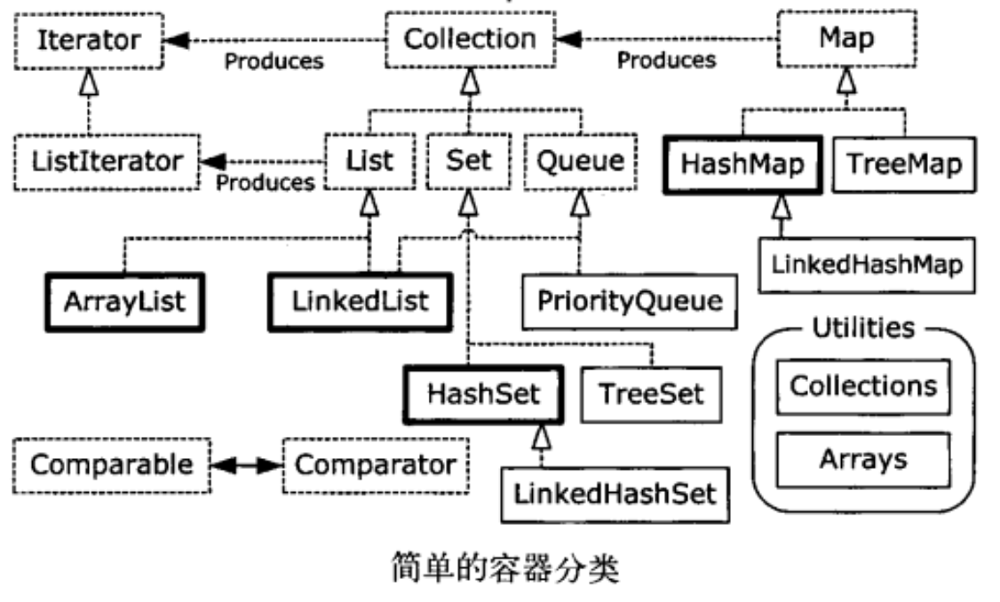
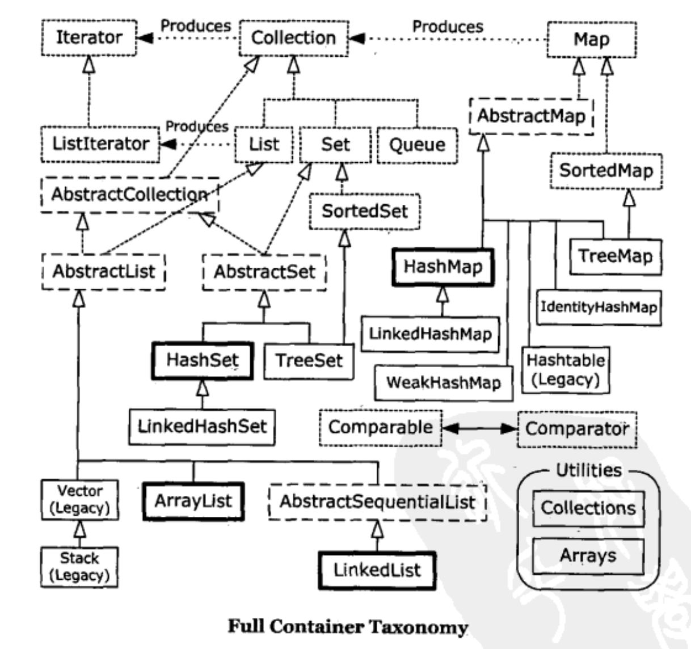

<!--ts-->
   * [前言](#前言)
   * [1. Collection接口](#1-collection接口)
      * [1.1 List接口](#11-list接口)
         * [1.1.1 ArrayList](#111-arraylist)
         * [1.1.2 LinkedList](#112-linkedlist)
         * [1.1.3 Vector](#113-vector)
         * [1.1.4 Stack](#114-stack)
      * [1.2  Set接口](#12--set接口)
         * [1.2.1 EnumSet](#121-enumset)
         * [1.2.2 HashSet](#122-hashset)
         * [1.2.3 TreeSet](#123-treeset)
      * [1.3 Queue](#13-queue)
      * [1.4 总结](#14-总结)
         * [1.4.1 set vs list](#141-set-vs-list)
         * [1.4.2 ArrayList vs LinkedList vs Vector](#142-arraylist-vs-linkedlist-vs-vector)
         * [1.4.3 HashSet vs TreeSet](#143-hashset-vs-treeset)
   * [2.  Map接口](#2--map接口)
      * [2.1 HashMap](#21-hashmap)
      * [2.4 总结](#24-总结)
         * [2.4.1 HashMap vs TreeMap](#241-hashmap-vs-treemap)
   * [3. Iterator](#3-iterator)
      * [一、java.util.Iterator](#一javautiliterator)
      * [二、各个集合的Iterator的实现](#二各个集合的iterator的实现)
         * [2.1、ArrayList的Iterator实现](#21arraylist的iterator实现)

<!-- Added by: anapodoton, at: Sat Feb 29 00:05:03 CST 2020 -->

<!--te-->

# 前言

在编写java程序中，我们最常用的除了八种基本数据类型，String对象外还有一个集合类，在我们的的程序中到处充斥着集合类的身影！java中集合大家族的成员实在是太丰富了，有常用的ArrayList. HashMap. HashSet，也有不常用的Stack. Queue，有线程安全的Vector，HashTable，也有线程不安全的LinkedList. TreeMap等等！

简化版





上面的图展示了整个集合大家族的成员以及他们之间的关系。下面就上面的各个接口. 基类做一些简单的介绍(主要介绍各个集合的特点。区别)，更加详细的介绍会在不久的将来一一讲解。

**Java 提供大量持有对象的方式：**

1. 数组是**将数字和对象联系起来**，它**保存明确的对象**，查询对象时候不需要对查询结果进行转换，它可以是多维的，可以保存基本类型的数据，**但是数组一旦生成，其容量不能改变**。所以数组是不可以直接删除和添加元素。
2. Collection 保存单一的元素，而 Map 保存相关联的值键对，有了 Java 泛型，可以指定容器存放对象类型，不会将错误类型的对象放在容器中，取元素时候也不需要转型。而且 Collection 和 Map 都可以自动调整其尺寸。**容器不可以持有基本类型**。
3. 像数组一样，**List 也建立数字索引和对象的关联**，因此，**数组和 List 都是排好序的容器，List 可以自动扩容。**
4. 如果需要大量的随机访问就要使用 ArrayList，如果要经常从中间插入和删除就要使用 LinkedList。
5. 各种 Queue 和 Stack 由 LinkedList 支持
6. Map 是一种**将对象（而非数字）与对象相关联的设计**。HashMap 用于快速访问，TreeMap 保持键始终处于排序状态，所以不如 HashMap 快，而 LinkedHashMap 保持元素插入的顺序，但是也通过散列提供了快速访问的能力。
7. **Set 不接受重复的元素**，HashSet 提供最快的访问能力，TreeSet 保持元素排序状态，LinkedHashSet 以插入顺序保存元素。
8. 不应使用过时的 Vector、HashTable


# 1. Collection接口

Collection接口是最基本的集合接口，它不提供直接的实现，Java SDK提供的类都是继承自Collection的“子接口”如List和Set。Collection所代表的是一种规则，**它所包含的元素都必须遵循一条或者多条规则。如有些允许重复而有些则不能重复. 有些必须要按照顺序插入而有些则是散列，有些支持排序但是有些则不支持。**

在Java中所有实现了Collection接口的类都必须提供两套标准的构造函数，一个是无参，用于创建一个空的Collection，一个是带有Collection参数的有参构造函数，用于创建一个新的Collection，这个新的Collection与传入进来的Collection具备相同的元素。

实现了Iterator接口，便于打印元素。

**Collection 和 Collections**

首先要明确的是，Collection 和 Collections是两个不同的概念。Collection是一个接口，所有的集合类（除Map外）都要继承（实现）自该接口。它提供了对集合对象进行基本操作的通用接口方法。Collections是一个包装类，它包含有各种有关集合操作的静态多态方法。（Collections是一个工具类，不能实例化）


**Collection家族关系图**


List,Set都是继承自Collection接口。都是用来存储一组相同类型的元素的。

List特点：元素有放入顺序，元素可重复 。

有顺序，即先放入的元素排在前面。

Set特点：元素无放入顺序，元素不可重复。

无顺序，即先放入的元素不一定排在前面。 不可重复，即相同元素在set中只会保留一份。所以，有些场景下，set可以用来去重。 不过需要注意的是，set在元素插入时是要有一定的方法来判断元素是否重复的。这个方法很重要，决定了set中可以保存哪些元素。

## 1.1 List接口

 [List.md](List/List.md) 

**可以将元素维护在特定的序列中**。

List接口为Collection直接接口。**List所代表的是有序的可重复Collection**，即它用某种特定的插入顺序来维护元素顺序。用户可以对列表中每个元素的插入位置进行精确地控制，同时可以根据元素的整数索引（在列表中的位置）访问元素，并搜索列表中的元素。实现List接口的集合主要有：ArrayList, LinkedList,Vector,Stack。

 [ArrayList-LinkedList-Vector.md](List/ArrayList-LinkedList-Vector.md) 

### 1.1.1 ArrayList

 [ArrayList.md](List/ArrayList.md) 

ArrayList是一个**动态数组**，也是我们最常用的集合。它允许任何符合规则的元素插入甚至包括null。每一个ArrayList都有一个初始容量（10），该容量代表了数组的大小。随着容器中的元素不断增加，容器的大小也会随着增加。在每次向容器中增加元素的同时都会进行容量检查，当快溢出时，就会进行扩容操作。所以如果我们明确所插入元素的多少，最好指定一个初始容量值，避免过多的进行扩容操作而浪费时间. 效率。

size. isEmpty. get. set. iterator 和 listIterator 操作都以固定时间运行。add 操作以分摊的固定时间运行，也就是说，添加 n 个元素需要 O(n) 时间（由于要考虑到扩容，所以这不只是添加元素会带来分摊固定时间开销那样简单）。

ArrayList擅长于随机访问。同时ArrayList是非同步的。

### 1.1.2 LinkedList

 [LinkedList.md](List/LinkedList.md) 

同样实现List接口的LinkedList与ArrayList不同，ArrayList是一个动态数组，而LinkedList是一个双向链表。所以它除了有ArrayList的基本操作方法外还额外提供了get，remove，insert方法在LinkedList的首部或尾部。

由于实现的方式不同，LinkedList不能随机访问，它所有的操作都是要按照双重链表的需要执行。在列表中索引的操作将从开头或结尾遍历列表（从靠近指定索引的一端）。这样做的好处就是可以通过较低的代价在List中进行插入和删除操作。

与ArrayList一样，LinkedList也是非同步的。如果多个线程同时访问一个List，则必须自己实现访问同步。一种解决方法是在创建List时构造一个同步的List：
List list = Collections.synchronizedList(new LinkedList(…));

### 1.1.3 Vector

 [Vector.md](List/Vector.md) 

与ArrayList相似，但是Vector是同步的。所以说Vector是线程安全的动态数组。它的操作与ArrayList几乎一样。

那么Vector和SynchronizedList的区别是什么呢？

 [SynchronizedList-vs-Vector.md](List/SynchronizedList-vs-Vector.md) 

### 1.1.4 Stack

 [Stack.md](List/Stack.md) 

Stack继承自Vector，实现一个后进先出的堆栈。Stack提供5个额外的方法使得Vector得以被当作堆栈使用。基本的push和pop 方法，还有peek方法得到栈顶的元素，empty方法测试堆栈是否为空，search方法检测一个元素在堆栈中的位置。Stack刚创建后是空栈。

## 1.2  Set接口

**Set是一种不包括重复元素的Collection（相同对象的多个实例也不行）**。它维持它自己的内部排序，所以随机访问没有任何意义。**与List一样，它同样运行null的存在但是仅有一个**。由于Set接口的特殊性，所有传入Set集合中的元素都必须不同，同时要注意任何可变对象，如果在对集合中元素进行操作时，导致e1.equals(e2)==true，则必定会产生某些问题。实现了Set接口的集合有：EnumSet. HashSet. TreeSet。

**常用来查找。**

### 1.2.1 EnumSet

是枚举的专用Set。所有的元素都是枚举类型。

### 1.2.2 HashSet

 [HashSet.md](Set/HashSet.md) 

HashSet堪称查询速度最快的集合，因为其内部是以HashCode来实现的。它内部元素的顺序是由哈希码来决定的，所以它不保证set 的迭代顺序；特别是它不保证该顺序恒久不变。

### 1.2.3 TreeSet

 [TreeSet.md](Set/TreeSet.md) 

基于TreeMap，生成一个总是处于排序状态的set，内部以TreeMap来实现。它是使用元素的自然顺序对元素进行排序，或者根据创建Set 时提供的`Comparator`进行排序，具体取决于使用的构造方法。

 ## 1.3 Queue

**可以安全可靠的将对象从程序的某个区域传输到另一个区域的途径**。

队列，它主要分为两大类，一类是阻塞式队列，队列满了以后再插入元素则会抛出异常，主要包括ArrayBlockQueue. PriorityBlockingQueue. LinkedBlockingQueue。另一种队列则是双端队列，支持在头. 尾两端插入和移除元素，主要包括：ArrayDeque. LinkedBlockingDeque. LinkedList。

## 1.4 总结

### 1.4.1 set vs list

问：Java 中 Set 与 List 有什么不同?

解：List,Set都是继承自Collection接口。都是用来存储一组相同类型的元素的。

List特点：元素有放入顺序，元素可重复 。 有顺序，即先放入的元素排在前面。

Set特点：元素无放入顺序，元素不可重复。 无顺序，即先放入的元素不一定排在前面。 不可重复，即相同元素在set中只会保留一份。所以，有些场景下，set可以用来去重。 不过需要注意的是，set在元素插入时是要有一定的方法来判断元素是否重复的。这个方法很重要，决定了set中可以保存哪些元素。

### 1.4.2 ArrayList vs LinkedList vs Vector

对List的选择

1. 对于随机查询与迭代遍历操作，数组比所有的容器都要快。所以在随机访问中一般使用ArrayList
2. LinkedList使用双向链表对元素的增加和删除提供了非常好的支持，而ArrayList执行增加和删除元素需要进行元素位移。
3. 对于Vector而已，我们一般都是避免使用。
4. 将ArrayList当做首选，毕竟对于集合元素而已我们都是进行遍历，只有当程序的性能因为List的频繁插入和删除而降低时，再考虑LinkedList。

1. vector是线程同步的，所以它也是线程安全的，而arraylist是线程异步的，是不安全的。如果不考虑到线程的安全因素，一般用arraylist效率比较高。
2. 如果集合中的元素的数目大于目前集合数组的长度时，vector增长率为目前数组长度的100%,而arraylist增长率为目前数组长度的50%.如过在集合中使用数据量比较大的数据，用vector有一定的优势。
3. 如果查找一个指定位置的数据，vector和arraylist使用的时间是相同的，都是0(1),这个时候使用vector和arraylist都可以。而如果移动一个指定位置的数据花费的时间为0(n-i)n为总长度，这个时候就应该考虑到使用linklist,因为它移动一个指定位置的数据所花费的时间为0(1),而查询一个指定位置的数据时花费的时间为0(i)。

ArrayList 和Vector是采用数组方式存储数据，此数组元素数大于实际存储的数据以便增加和插入元素，都允许直接序号索引元素，但是插入数据要设计到数组元素移动等内存操作，所以索引数据快插入数据慢，Vector由于使用了synchronized方法（线程安全）所以性能上比ArrayList要差，LinkedList使用双向链表实现存储，按序号索引数据需要进行向前或向后遍历，但是插入数据时只需要记录本项的前后项即可，所以插入数度较快！

### 1.4.3 HashSet vs TreeSet

1. HashSet由于使用HashCode实现，所以在某种程度上来说它的性能永远比TreeSet要好，尤其是进行增加和查找操作。
2. 虽然TreeSet没有HashSet性能好，但是由于它可以维持元素的排序，所以它还是存在用武之地的。

# 2.  Map接口

 [Map.md](Map/Map.md) 

无序不可重复。

**允许使用键来查找值**。Map与List,Set接口不同，它是由一系列键值对组成的集合，提供了key到Value的映射。同时它也没有继承Collection。在Map中它保证了key与value之间的一一对应关系。也就是说一个key对应一个value，所以它不能存在相同的key值，当然value值可以相同。实现map的有：HashMap. TreeMap. HashTable. Properties. EnumMap。

Map的家族关系图谱。


## 2.1 HashMap

以哈希表数据结构实现，查找对象时通过哈希函数计算其位置，它是为快速查询而设计的，其内部定义了一个hash表数组（Entry[] table），元素会通过哈希转换函数将元素的哈希地址转换成数组中存放的索引，如果有冲突，则使用散列链表的形式将所有相同哈希地址的元素串起来，可能通过查看HashMap.Entry的源码它是一个单链表结构。 [HashMap.md](Map/HashMap.md) 

##2.2. TreeMap

键以某种排序规则排序，内部以red-black（红-黑）树数据结构实现，实现了SortedMap接口。

 [TreeMap.md](Map/TreeMap.md) 

##2.3. HashTable

也是以哈希表数据结构实现的，解决冲突时与HashMap也一样也是采用了散列链表的形式，不过性能比HashMap要低

 [HashTable.md](Map/HashTable.md) 

## 2.4 总结

### 2.4.1 HashMap vs TreeMap

1. HashMap通过hashcode对其内容进行快速查找，而TreeMap中所有的元素都保持着某种固定的顺序，如果你需要得到一个有序的结果你就应该使用TreeMap（HashMap中元素的排列顺序是不固定的）。HashMap中元素的排列顺序是不固定的）。
2. HashMap通过hashcode对其内容进行快速查找，而TreeMap中所有的元素都保持着某种固定的顺序，如果你需要得到一个有序的结果你就应该使用TreeMap（HashMap中元素的排列顺序是不固定的）。集合框架”提供两种常规的Map实现：HashMap和TreeMap (TreeMap实现SortedMap接口)。
3. 在Map 中插入. 删除和定位元素，HashMap 是最好的选择。但如果您要按自然顺序或自定义顺序遍历键，那么TreeMap会更好。使用HashMap要求添加的键类明确定义了hashCode()和 equals()的实现。 这个TreeMap没有调优选项，因为该树总处于平衡状态。

# 3. Iterator

迭代对于我们搞Java的来说绝对不陌生。我们常常使用JDK提供的迭代接口进行Java集合的迭代。

```
Iterator iterator = list.iterator();
        while(iterator.hasNext()){
            String string = iterator.next();
            //do something
        }
```

迭代其实我们可以简单地理解为遍历，是一个标准化遍历各类容器里面的所有对象的方法类，它是一个很典型的设计模式。Iterator模式是用于遍历集合类的标准访问方法。它可以把访问逻辑从不同类型的集合类中抽象出来，从而避免向客户端暴露集合的内部结构。 在没有迭代器时我们都是这么进行处理的。如下：

对于数组我们是使用下标来进行处理的:

```
int[] arrays = new int[10];
   for(int i = 0 ; i < arrays.length ; i++){
       int a = arrays[i];
       //do something
   }
```

对于ArrayList是这么处理的:

```
List<String> list = new ArrayList<String>();
   for(int i = 0 ; i < list.size() ;  i++){
      String string = list.get(i);
      //do something
   }
```

对于这两种方式，我们总是都事先知道集合的内部结构，访问代码和集合本身是紧密耦合的，无法将访问逻辑从集合类和客户端代码中分离出来。同时每一种集合对应一种遍历方法，客户端代码无法复用。 在实际应用中如何需要将上面将两个集合进行整合是相当麻烦的。所以为了解决以上问题，Iterator模式腾空出世，它总是用同一种逻辑来遍历集合。使得客户端自身不需要来维护集合的内部结构，所有的内部状态都由Iterator来维护。客户端从不直接和集合类打交道，它总是控制Iterator，向它发送”向前”，”向后”，”取当前元素”的命令，就可以间接遍历整个集合。

上面只是对Iterator模式进行简单的说明，下面我们看看Java中Iterator接口，看他是如何来进行实现的。

## 一、java.util.Iterator

在Java中Iterator为一个接口，它只提供了迭代了基本规则，在JDK中他是这样定义的：对 collection 进行迭代的迭代器。迭代器取代了 Java Collections Framework 中的 Enumeration。迭代器与枚举有两点不同：

- 1、迭代器允许调用者利用定义良好的语义在迭代期间从迭代器所指向的 collection 移除元素。
- 2、方法名称得到了改进。

其接口定义如下：

```
public interface Iterator {
　　boolean hasNext();
　　Object next();
　　void remove();
}
```

其中：

- Object next()：返回迭代器刚越过的元素的引用，返回值是Object，需要强制转换成自己需要的类型
- boolean hasNext()：判断容器内是否还有可供访问的元素
- void remove()：删除迭代器刚越过的元素

对于我们而言，我们只一般只需使用next()、hasNext()两个方法即可完成迭代。如下：

```
 for(Iterator it = c.iterator(); it.hasNext(); ) {
　　Object o = it.next();
　　 //do something
}
```

前面阐述了Iterator有一个很大的优点,就是我们不必知道集合的内部结果,集合的内部结构、状态由Iterator来维持，通过统一的方法hasNext()、next()来判断、获取下一个元素，至于具体的内部实现我们就不用关心了。**但是作为一个合格的程序员我们非常有必要来弄清楚Iterator的实现。** 下面就ArrayList的源码进行分析分析。

## 二、各个集合的Iterator的实现

下面就ArrayList的Iterator实现来分析，其实如果我们理解了ArrayList、Hashset、TreeSet的数据结构，内部实现，对于他们是如何实现Iterator也会胸有成竹的。因为ArrayList的内部实现采用数组，所以我们只需要记录相应位置的索引即可，其方法的实现比较简单。

### 2.1、ArrayList的Iterator实现

在ArrayList内部首先是定义一个内部类Itr，该内部类实现Iterator接口，如下：

```
 private class Itr implements Iterator<E> {
    //do something
}
```

而ArrayList的iterator()方法实现：

```
 public Iterator<E> iterator() {
        return new Itr();
    }
```

所以通过使用ArrayList.iterator()方法返回的是Itr()内部类，所以现在我们需要关心的就是Itr()内部类的实现：

在Itr内部定义了三个int型的变量：cursor、lastRet、expectedModCount。其中cursor表示下一个元素的索引位置，lastRet表示上一个元素的索引位置

```
int cursor;             
int lastRet = -1;     
int expectedModCount = modCount;
```

从cursor、lastRet定义可以看出，lastRet一直比cursor少一所以hasNext()实现方法异常简单，只需要判断cursor和lastRet是否相等即可。

```
 public boolean hasNext() {
            return cursor != size;
        }
```

对于next()实现其实也是比较简单的，只要返回cursor索引位置处的元素即可，然后修改cursor、lastRet即可，

```
public E next() {
            checkForComodification();
            int i = cursor;    //记录索引位置
            if (i >= size)    //如果获取元素大于集合元素个数，则抛出异常
                throw new NoSuchElementException();
            Object[] elementData = ArrayList.this.elementData;
            if (i >= elementData.length)
                throw new ConcurrentModificationException();
            cursor = i + 1;      //cursor + 1
            return (E) elementData[lastRet = i];  //lastRet + 1 且返回cursor处元素
        }
```

checkForComodification()主要用来判断集合的修改次数是否合法，即用来判断遍历过程中集合是否被修改过。在[java提高篇（二一）—–ArrayList](http://www.cnblogs.com/chenssy/p/3498468.html)中已经阐述了。modCount用于记录ArrayList集合的修改次数，初始化为0，，每当集合被修改一次（结构上面的修改，内部update不算），如add、remove等方法，modCount + 1，所以如果modCount不变，则表示集合内容没有被修改。该机制主要是用于实现ArrayList集合的快速失败机制，在Java的集合中，较大一部分集合是存在快速失败机制的，这里就不多说，后面会讲到。所以要保证在遍历过程中不出错误，我们就应该保证在遍历过程中不会对集合产生结构上的修改（当然remove方法除外），出现了异常错误，我们就应该认真检查程序是否出错而不是catch后不做处理。

```
 final void checkForComodification() {
            if (modCount != expectedModCount)
                throw new ConcurrentModificationException();
        }
```

对于remove()方法的是实现，它是调用ArrayList本身的remove()方法删除lastRet位置元素，然后修改modCount即可。

```
public void remove() {
            if (lastRet < 0)
                throw new IllegalStateException();
            checkForComodification();

            try {
                ArrayList.this.remove(lastRet);
                cursor = lastRet;
                lastRet = -1;
                expectedModCount = modCount;
            } catch (IndexOutOfBoundsException ex) {
                throw new ConcurrentModificationException();
            }
        }
```

这里就对ArrayList的Iterator实现讲解到这里，对于Hashset、TreeSet等集合的Iterator实现，各位如果感兴趣可以继续研究，个人认为在研究这些集合的源码之前，有必要对该集合的数据结构有清晰的认识，这样会达到事半功倍的效果！！！！
