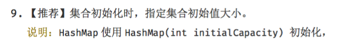
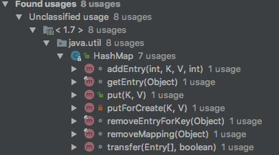

<!--ts-->
   * [前言](#前言)
   * [HashMap](#hashmap)
      * [1. 什么是HashMap](#1-什么是hashmap)
      * [2.HashMap和HashTable的区别](#2hashmap和hashtable的区别)
      * [3. HashMap与HashSet的关系](#3-hashmap与hashset的关系)
      * [3. HashMap 和 ConcurrentHashMap 的关系](#3-hashmap-和-concurrenthashmap-的关系)
      * [4. HashMap实现原理分析](#4-hashmap实现原理分析)
         * [4.1 定义](#41-定义)
         * [4.2 构造函数](#42-构造函数)
      * [5. HashMap的存取实现](#5-hashmap的存取实现)
      * [6. 解决hash冲突的办法](#6-解决hash冲突的办法)
      * [7. 再散列rehash过程](#7-再散列rehash过程)
   * [HashTable](#hashtable)
      * [前言](#前言-1)
      * [1.定义](#1定义)
      * [2. 构造方法](#2-构造方法)
      * [3. 主要方法](#3-主要方法)
      * [4. HashTable与HashMap的区别](#4-hashtable与hashmap的区别)
   * [TreeMap](#treemap)
      * [1.红黑树简介](#1红黑树简介)
      * [2. TreeMap数据结构](#2-treemap数据结构)
      * [3. TreeMap put()方法](#3-treemap-put方法)
         * [3.1 红黑树增加节点](#31-红黑树增加节点)
         * [3.2 TreeMap put()方法实现分析](#32-treemap-put方法实现分析)
         * [3.3 TreeMap delete()方法](#33-treemap-delete方法)
   * [4. 写在最后](#4-写在最后)
   * [总结](#总结)
      * [HashMap核心概念](#hashmap核心概念)
         * [size 和 capacity](#size-和-capacity)
         * [loadFactor 和 threshold](#loadfactor-和-threshold)
         * [总结](#总结-1)
      * [HashMap的初始化问题](#hashmap的初始化问题)
         * [前言](#前言-2)
         * [1.为什么要设置HashMap的初始化容量](#1为什么要设置hashmap的初始化容量)
         * [2. HashMap中容量的初始化](#2-hashmap中容量的初始化)
         * [3. HashMap中初始容量的合理值](#3-hashmap中初始容量的合理值)
         * [4. 总结](#4-总结)
      * [HashMap中的hash算法实现](#hashmap中的hash算法实现)
         * [前言](#前言-3)
         * [1. 哈希](#1-哈希)
         * [2. HashMap 的数据结构](#2-hashmap-的数据结构)
         * [4. 源码解析](#4-源码解析)
            * [4.1 HashMap In Java 7](#41-hashmap-in-java-7)
            * [4.2 HashTable In Java 7](#42-hashtable-in-java-7)
            * [4.3 ConcurrentHashMap In Java 7](#43-concurrenthashmap-in-java-7)
            * [4.4 HashMap In Java 8](#44-hashmap-in-java-8)
            * [4.5 ConcurrentHashMap In Java 8](#45-concurrenthashmap-in-java-8)
         * [5. 总结](#5-总结)

<!-- Added by: anapodoton, at: Sat Feb 29 00:05:24 CST 2020 -->

<!--te-->

# 前言

Map是一种(key/value)的映射结构，其它语言里可能称作字典（Dictionary），包括java早期也是叫做字典，Map中的元素是一个key只能对应一个value，不能存在重复的key。

[](https://gitee.com/alan-tang-tt/yuan/raw/master/死磕 java集合系列/resource/Map.png)

java中提供的Map的实现主要有HashMap、LinkedHashMap、WeakHashMap、TreeMap、ConcurrentHashMap、ConcurrentSkipListMap，另外还有两个比较古老的Map实现HashTable和Properties。

- **Map：** “键值”对映射的抽象接口。该映射不包括重复的键，一个键对应一个值。
- **SortedMap：** 有序的键值对接口，继承Map接口。
- **NavigableMap：** 继承SortedMap，具有了针对给定搜索目标返回最接近匹配项的导航方法的接口。
- **AbstractMap：** 实现了Map中的绝大部分函数接口。它减少了“Map的实现类”的重复编码。
- **Dictionary：** 任何可将键映射到相应值的类的抽象父类。目前被Map接口取代。
- **TreeMap：** 有序散列表，实现SortedMap 接口，底层通过红黑树实现。
- **HashMap：** 是基于“拉链法”实现的散列表。底层采用“数组+链表”实现。
- **WeakHashMap：** 基于“拉链法”实现的散列表。
- **HashTable：** 基于“拉链法”实现的散列表。

总结如下：


他们之间的区别：


# HashMap

## 1. 什么是HashMap

**基于哈希表的 Map 接口的实现**。此实现提供所有可选的映射操作，**并允许使用 null 值和 null 键。**（除了非同步和允许使用 null 之外，HashMap 类与 Hashtable 大致相同。）**此类不保证映射的顺序，特别是它不保证该顺序恒久不变。** 此实现假定哈希函数将元素适当地分布在各桶之间，可为基本操作（get 和 put）提供稳定的性能。迭代 collection 视图所需的时间与 HashMap 实例的“容量”（桶的数量）及其大小（键-值映射关系数）成比例。所以，如果迭代性能很重要，则不要将初始容量设置得太高（或将加载因子设置得太低）。

## 2.HashMap和HashTable的区别

> 1.**HashTable的方法是同步的**，在方法的前面都有synchronized来同步，**HashMap未经同步**，所以在多线程场合要手动同步
> 2.**HashTable不允许null值**(key和value都不可以) ,**HashMap允许null值**(key和value都可以)。
> 3.HashTable有一个contains(Object value)功能和containsValue(Object value)功能一样。
> 4.HashTable使用Enumeration进行遍历，HashMap使用Iterator进行遍历。
> 5.HashTable中hash数组默认大小是11，增加的方式是 old*2+1。HashMap中hash数组的默认大小是16，而且一定是2的指数。
> 6.哈希值的使用不同，HashTable直接使用对象的hashCode，代码是这样的：

```
int hash = key.hashCode();
int index = (hash & 0x7FFFFFFF) % tab.length;
```

> 而HashMap重新计算hash值，而且用与代替求模：

```
int hash = hash(k);
int i = indexFor(hash, table.length);
static int hash(Object x) {
h ^= (h >>> 20) ^ (h >>> 12);
     return h ^ (h >>> 7) ^ (h >>> 4);
}
static int indexFor(int h, int length) {
return h & (length-1);
}
```

## 3. HashMap与HashSet的关系

> 1、HashSet底层是采用HashMap实现的：
>
> public HashSet() {
> map = new HashMap<E,Object>();
> }
>
> 2、调用HashSet的add方法时，实际上是向HashMap中增加了一行(key-value对)，该行的key就是向HashSet增加的那个对象，该行的value就是一个Object类型的常量。
>
> ```java
> private static final Object PRESENT = new Object(); 
> public boolean add(E e) { 
>  return map.put(e, PRESENT)==null; 
> } 
> public boolean remove(Object o) { 
>  return map.remove(o)==PRESENT; 
> }
> ```

## 3. HashMap 和 ConcurrentHashMap 的关系

> 关于这部分内容建议自己去翻翻源码，`ConcurrentHashMap` 也是一种线程安全的集合类，他和`HashTable`也是有区别的，主要区别就是加锁的粒度以及如何加锁，`ConcurrentHashMap`的加锁粒度要比`HashTable`更细一点。将数据分成一段一段的存储，然后给每一段数据配一把锁，当一个线程占用锁访问其中一个段数据的时候，其他段的数据也能被其他线程访问。

## 4. HashMap实现原理分析

HashMap实现了Map接口，继承AbstractMap。其中Map接口定义了键映射到值的规则，而AbstractMap类提供 Map 接口的骨干实现，以最大限度地减少实现此接口所需的工作，其实AbstractMap类已经实现了Map，这里标注Map LZ觉得应该是更加清晰吧！

### 4.1 定义

```java
 public class HashMap<K,V>
    extends AbstractMap<K,V>
    implements Map<K,V>, Cloneable, Serializable
```

### 4.2 构造函数

HashMap提供了三个构造函数：

- HashMap()：构造一个具有默认初始容量 (16) 和默认加载因子 (0.75) 的空 HashMap。
- HashMap(int initialCapacity)：构造一个带指定初始容量和默认加载因子 (0.75) 的空 HashMap。
- HashMap(int initialCapacity, float loadFactor)：构造一个带指定初始容量和加载因子的空 HashMap。

在这里提到了两个参数：初始容量，加载因子。这两个参数是影响HashMap性能的重要参数，其中容量表示哈希表中桶的数量，初始容量是创建哈希表时的容量，加载因子是哈希表在其容量自动增加之前可以达到多满的一种尺度，它衡量的是一个散列表的空间的使用程度，负载因子越大表示散列表的装填程度越高，反之愈小。对于使用链表法的散列表来说，查找一个元素的平均时间是O(1+a)，因此如果负载因子越大，对空间的利用更充分，然而后果是查找效率的降低；如果负载因子太小，那么散列表的数据将过于稀疏，对空间造成严重浪费。系统默认负载因子为0.75，一般情况下我们是无需修改的。

HashMap是一种支持快速存取的数据结构，要了解它的性能必须要了解它的数据结构。

```java
public HashMap(int initialCapacity, float loadFactor) {
        //初始容量不能<0
        if (initialCapacity < 0)
            throw new IllegalArgumentException("Illegal initial capacity: "
                    + initialCapacity);
        //初始容量不能 > 最大容量值，HashMap的最大容量值为2^30
        if (initialCapacity > MAXIMUM_CAPACITY)
            initialCapacity = MAXIMUM_CAPACITY;
        //负载因子不能 < 0
        if (loadFactor <= 0 || Float.isNaN(loadFactor))
            throw new IllegalArgumentException("Illegal load factor: "
                    + loadFactor);

        // 计算出大于 initialCapacity 的最小的 2 的 n 次方值。
        int capacity = 1;
        while (capacity < initialCapacity)
            capacity <<= 1;

        this.loadFactor = loadFactor;
        //设置HashMap的容量极限，当HashMap的容量达到该极限时就会进行扩容操作
        threshold = (int) (capacity * loadFactor);
        //初始化table数组
        table = new Entry[capacity];
        init();
    }
```

从源码中可以看出，每次新建一个HashMap时，都会初始化一个table数组。table数组的元素为Entry节点。

```java
static class Entry<K,V> implements Map.Entry<K,V> {
        final K key;
        V value;
        Entry<K,V> next;
        final int hash;

        /**
         * Creates new entry.
         */
        Entry(int h, K k, V v, Entry<K,V> n) {
            value = v;
            next = n;
            key = k;
            hash = h;
        }
        .......
    }
```

其中Entry为HashMap的内部类，它包含了键key、值value、下一个节点next，以及hash值，这是非常重要的，正是由于Entry才构成了table数组的项为链表。

**1. HashMap的数据结构** 数据结构中有`数组`和`链表`来实现对数据的存储，但这两者基本上是两个极端。

> **数组**:数组必须事先定义固定的长度（元素个数），不能适应数据动态地增减的情况。当数据增加时，可能超出原先定义的元素个数；当数据减少时，造成内存浪费。
>
> > 数组是静态分配内存，并且在内存中连续。
> > 数组利用下标定位，时间复杂度为O(1)
> > 数组插入或删除元素的时间复杂度O(n)
> > 数组的特点是：*寻址容易，插入和删除困难*；
>
> **链表**:链表存储区间离散，占用内存比较宽松。
>
> > 链表是动态分配内存，并不连续。
> > 链表定位元素时间复杂度O(n)
> > 链表插入或删除元素的时间复杂度O(1)
> > 链表的特点是：*寻址困难，插入和删除容易。*

**哈希表**

那么我们能不能综合两者的特性，做出一种寻址容易，插入删除也容易的数据结构？答案是肯定的，这就是我们要提起的哈希表。`哈希表（(Hash table）`既满足了数据的查找方便，同时不占用太多的内容空间，使用也十分方便。

　　哈希表有多种不同的实现方法，我接下来解释的是最常用的一种方法—— 拉链法，我们可以理解为“链表的数组” ，如图：

从上图我们可以发现哈希表是由数组+链表组成的，一个长度为16的数组中，每个元素存储的是一个链表的头结点。那么这些元素是按照什么样的规则存储到数组中呢。一般情况是通过hash(key)%len获得，也就是元素的key的哈希值对数组长度取模得到。比如上述哈希表中，12%16=12,28%16=12,108%16=12,140%16=12。所以12、28、108以及140都存储在数组下标为12的位置。 　　HashMap其实也是一个线性的数组实现的,所以可以理解为其存储数据的容器就是一个线性数组。这可能让我们很不解，一个线性的数组怎么实现按键值对来存取数据呢？这里HashMap有做一些处理。 　　首先HashMap里面实现一个静态内部类Entry，其重要的属性有 key , value, next，从属性key,value我们就能很明显的看出来Entry就是HashMap键值对实现的一个基础bean，我们上面说到HashMap的基础就是一个线性数组，这个数组就是Entry[]，Map里面的内容都保存在Entry[]里面。

## 5. HashMap的存取实现

既然是线性数组，为什么能随机存取？这里HashMap用了一个小算法，大致是这样实现：

```
// 存储时:
int hash = key.hashCode(); // 这个hashCode方法这里不详述,只要理解每个key的hash是一个固定的int值
int index = hash % Entry[].length;
Entry[index] = value;

// 取值时:
int hash = key.hashCode();
int index = hash % Entry[].length;
return Entry[index];
```

**1）put**

疑问：如果两个key通过hash%Entry[].length得到的index相同，会不会有覆盖的危险？ 　　

这里HashMap里面用到链式数据结构的一个概念。上面我们提到过Entry类里面有一个`next`属性，作用是指向下一个Entry。
打个比方， 第一个键值对A进来，通过计算其key的hash得到的index=0，记做:Entry[0] = A。一会后又进来一个键值对B，通过计算其index也等于0，现在怎么办？HashMap会这样做:B.next = A,Entry[0] = B,如果又进来C,index也等于0,那么C.next = B,Entry[0] = C；这样我们发现index=0的地方其实存取了A,B,C三个键值对,他们通过next这个属性链接在一起。所以疑问不用担心。也就是说数组中存储的是最后插入的元素。到这里为止，HashMap的大致实现，我们应该已经清楚了。


```java
public V put(K key, V value) {
   //当key为null，调用putForNullKey方法，保存null与table第一个位置中，这是HashMap允许为null的原因
        if (key == null)
            return putForNullKey(value); //null总是放在数组的第一个链表中
        int hash = hash(key.hashCode());
        int i = indexFor(hash, table.length);
        //遍历链表
        for (Entry<K,V> e = table[i]; e != null; e = e.next) {
            Object k;
            //如果key在链表中已存在，则替换为新value
            if (e.hash == hash && ((k = e.key) == key || key.equals(k))) {
                V oldValue = e.value;
                e.value = value;
                e.recordAccess(this);
                return oldValue;
            }
        }
        modCount++;
        addEntry(hash, key, value, i);
        return null;
}

void addEntry(int hash, K key, V value, int bucketIndex) {
    Entry<K,V> e = table[bucketIndex];
    table[bucketIndex] = new Entry<K,V>(hash, key, value, e); //参数e, 是Entry.next
    //如果size超过threshold，则扩充table大小。再散列
    if (size++ >= threshold)
            resize(2 * table.length);
}
```

> 当然HashMap里面也包含一些优化方面的实现，这里也说一下。比如：Entry[]的长度一定后，随着map里面数据的越来越长，这样同一个index的链就会很长，会不会影响性能？HashMap里面设置一个因子，随着map的size越来越大，Entry[]会以一定的规则加长长度。

**2）get**

```java
public V get(Object key) {
        if (key == null)
            return getForNullKey();
        int hash = hash(key.hashCode());
        //先定位到数组元素，再遍历该元素处的链表
        for (Entry<K,V> e = table[indexFor(hash, table.length)];
             e != null;
             e = e.next) {
            Object k;
            if (e.hash == hash && ((k = e.key) == key || key.equals(k)))
                return e.value;
        }
        return null;
}
```

**3）null key的存取**

null key总是存放在Entry[]数组的第一个元素。

```java
   private V putForNullKey(V value) {
        for (Entry<K,V> e = table[0]; e != null; e = e.next) {
            if (e.key == null) {
                V oldValue = e.value;
                e.value = value;
                e.recordAccess(this);
                return oldValue;
            }
        }
        modCount++;
        addEntry(0, null, value, 0);
        return null;
    }


private V getForNullKey() {
    for (Entry<K,V> e = table[0]; e != null; e = e.next) {
        if (e.key == null)
            return e.value;
    }
    return null;
}
```

**4）确定数组index：hashcode % table.length取模**

HashMap存取时，都需要计算当前key应该对应Entry[]数组哪个元素，即计算数组下标；算法如下：

```java
 /**
     * Returns index for hash code h.
     */
    static int indexFor(int h, int length) {
        return h & (length-1);
    }
```

按位取并，作用上相当于取模mod或者取余%。 **这意味着数组下标相同，并不表示hashCode相同。**

**5）table初始大小**

```java
public HashMap(int initialCapacity, float loadFactor) {
        .....
        // Find a power of 2 >= initialCapacity
        int capacity = 1;
        while (capacity < initialCapacity)
            capacity <<= 1;
        this.loadFactor = loadFactor;
        threshold = (int)(capacity * loadFactor);
        table = new Entry[capacity];
        init();
    }
```

## 6. 解决hash冲突的办法

> 开放定址法（线性探测再散列，二次探测再散列，伪随机探测再散列） 再哈希法 链地址法 建立一个公共溢出区 **Java中hashmap的解决办法就是采用的链地址法。**

## 7. 再散列rehash过程

> 当哈希表的容量超过默认容量时，必须调整table的大小。当容量已经达到最大可能值时，那么该方法就将容量调整到Integer.MAX_VALUE返回，这时，需要创建一张新表，将原表的映射到新表中。

```java
 /**
     * Rehashes the contents of this map into a new array with a
     * larger capacity.  This method is called automatically when the
     * number of keys in this map reaches its threshold.
     *
     * If current capacity is MAXIMUM_CAPACITY, this method does not
     * resize the map, but sets threshold to Integer.MAX_VALUE.
     * This has the effect of preventing future calls.
     *
     * @param newCapacity the new capacity, MUST be a power of two;
     *        must be greater than current capacity unless current
     *        capacity is MAXIMUM_CAPACITY (in which case value
     *        is irrelevant).
     */
    void resize(int newCapacity) {
        Entry[] oldTable = table;
        int oldCapacity = oldTable.length;
        if (oldCapacity == MAXIMUM_CAPACITY) {
            threshold = Integer.MAX_VALUE;
            return;
        }
        Entry[] newTable = new Entry[newCapacity];
        transfer(newTable);
        table = newTable;
        threshold = (int)(newCapacity * loadFactor);
    }


/**
 * Transfers all entries from current table to newTable.
 */
void transfer(Entry[] newTable) {
    Entry[] src = table;
    int newCapacity = newTable.length;
    for (int j = 0; j < src.length; j++) {
        Entry<K,V> e = src[j];
        if (e != null) {
            src[j] = null;
            do {
                Entry<K,V> next = e.next;
                //重新计算index
                int i = indexFor(e.hash, newCapacity);
                e.next = newTable[i];
                newTable[i] = e;
                e = next;
            } while (e != null);
        }
    }
}
```


# HashTable

## 前言

在java中与有两个类都提供了一个多种用途的hashTable机制，他们都可以将可以key和value结合起来构成键值对通过put(key,value)方法保存起来，然后通过get(key)方法获取相对应的value值。一个是前面提到的HashMap，还有一个就是马上要讲解的HashTable。对于HashTable而言，它在很大程度上和HashMap的实现差不多，如果我们对HashMap比较了解的话，对HashTable的认知会提高很大的帮助。他们两者之间只存在几点的不同，这个后面会阐述。

## 1.定义

HashTable在Java中的定义如下：

```java
 public class Hashtable<K,V>
    extends Dictionary<K,V>
    implements Map<K,V>, Cloneable, java.io.Serializable
```

从中可以看出HashTable继承Dictionary类，实现Map接口。其中Dictionary类是任何可将键映射到相应值的类（如 `Hashtable`）的抽象父类。每个键和每个值都是一个对象。在任何一个 `Dictionary` 对象中，每个键至多与一个值相关联。Map是”key-value键值对”接口。

HashTable采用”拉链法”实现哈希表，它定义了几个重要的参数：table、count、threshold、loadFactor、modCount。

table：为一个Entry[]数组类型，Entry代表了“拉链”的节点，每一个Entry代表了一个键值对，哈希表的”key-value键值对”都是存储在Entry数组中的。

count：HashTable的大小，注意这个大小并不是HashTable的容器大小，而是他所包含Entry键值对的数量。

threshold：Hashtable的阈值，用于判断是否需要调整Hashtable的容量。threshold的值=”容量*加载因子”。

loadFactor：加载因子。

modCount：用来实现“fail-fast”机制的（也就是快速失败）。所谓快速失败就是在并发集合中，其进行迭代操作时，若有其他线程对其进行结构性的修改，这时迭代器会立马感知到，并且立即抛出ConcurrentModificationException异常，而不是等到迭代完成之后才告诉你（你已经出错了）。

## 2. 构造方法

在HashTabel中存在5个构造函数。通过这5个构造函数我们构建出一个我想要的HashTable。

public Hashtable() {
this(11, 0.75f);
}

默认构造函数，容量为11，加载因子为0.75。

public Hashtable(int initialCapacity) {
this(initialCapacity, 0.75f);
}

用指定初始容量和默认的加载因子 (0.75) 构造一个新的空哈希表。

```java
public Hashtable(int initialCapacity, float loadFactor) {
        //验证初始容量
        if (initialCapacity < 0)
            throw new IllegalArgumentException("Illegal Capacity: "+
                                               initialCapacity);
        //验证加载因子
        if (loadFactor <= 0 || Float.isNaN(loadFactor))
            throw new IllegalArgumentException("Illegal Load: "+loadFactor);

        if (initialCapacity==0)
            initialCapacity = 1;

        this.loadFactor = loadFactor;

        //初始化table，获得大小为initialCapacity的table数组
        table = new Entry[initialCapacity];
        //计算阀值
        threshold = (int)Math.min(initialCapacity * loadFactor, MAX_ARRAY_SIZE + 1);
        //初始化HashSeed值
        initHashSeedAsNeeded(initialCapacity);
    }
```

用指定初始容量和指定加载因子构造一个新的空哈希表。其中initHashSeedAsNeeded方法用于初始化hashSeed参数，其中hashSeed用于计算key的hash值，它与key的hashCode进行按位异或运算。这个hashSeed是一个与实例相关的随机值，主要用于解决hash冲突。

```java
 private int hash(Object k) {
        return hashSeed ^ k.hashCode();
    }
```

构造一个与给定的 Map 具有相同映射关系的新哈希表。

```java
public Hashtable(Map<? extends K, ? extends V> t) {
        //设置table容器大小，其值==t.size * 2 + 1
        this(Math.max(2*t.size(), 11), 0.75f);
        putAll(t);
    }
```

## 3. 主要方法

HashTable的API对外提供了许多方法，这些方法能够很好帮助我们操作HashTable，但是这里我只介绍两个最根本的方法：put、get。

首先我们先看put方法：将指定 `key` 映射到此哈希表中的指定 `value`。注意这里键key和值value都不可为空。

```java
public synchronized V put(K key, V value) {
        // 确保value不为null
        if (value == null) {
            throw new NullPointerException();
        }

        /*
         * 确保key在table[]是不重复的
         * 处理过程：
         * 1、计算key的hash值，确认在table[]中的索引位置
         * 2、迭代index索引位置，如果该位置处的链表中存在一个一样的key，则替换其value，返回旧值
         */
        Entry tab[] = table;
        int hash = hash(key);    //计算key的hash值
        int index = (hash & 0x7FFFFFFF) % tab.length;     //确认该key的索引位置
        //迭代，寻找该key，替换
        for (Entry<K,V> e = tab[index] ; e != null ; e = e.next) {
            if ((e.hash == hash) && e.key.equals(key)) {
                V old = e.value;
                e.value = value;
                return old;
            }
        }

        modCount++;
        if (count >= threshold) {  //如果容器中的元素数量已经达到阀值，则进行扩容操作
            rehash();
            tab = table;
            hash = hash(key);
            index = (hash & 0x7FFFFFFF) % tab.length;
        }

        // 在索引位置处插入一个新的节点
        Entry<K,V> e = tab[index];
        tab[index] = new Entry<>(hash, key, value, e);
        //容器中元素+1
        count++;
        return null;
    }
```

put方法的整个处理流程是：计算key的hash值，根据hash值获得key在table数组中的索引位置，然后迭代该key处的Entry链表（我们暂且理解为链表），若该链表中存在一个这个的key对象，那么就直接替换其value值即可，否则在将改key-value节点插入该index索引位置处。如下：

首先我们假设一个容量为5的table，存在8、10、13、16、17、21。他们在table中位置如下：


然后我们插入一个数：put(16,22)，key=16在table的索引位置为1，同时在1索引位置有两个数，程序对该“链表”进行迭代，发现存在一个key=16,这时要做的工作就是用newValue=22替换oldValue16，并将oldValue=16返回。

[](https://gitee.com/chenssy/blog-home/raw/master/image/sijava/032123042506269.png)

在put(33,33)，key=33所在的索引位置为3，并且在该链表中也没有存在某个key=33的节点，所以就将该节点插入该链表的第一个位置。


在HashTabled的put方法中有两个地方需要注意：

**1、** HashTable的扩容操作，在put方法中，如果需要向table[]中添加Entry元素，会首先进行容量校验，如果容量已经达到了阀值，HashTable就会进行扩容处理rehash()，如下:

```java
protected void rehash() {
        int oldCapacity = table.length;
        //元素
        Entry<K,V>[] oldMap = table;

        //新容量=旧容量 * 2 + 1
        int newCapacity = (oldCapacity << 1) + 1;
        if (newCapacity - MAX_ARRAY_SIZE > 0) {
            if (oldCapacity == MAX_ARRAY_SIZE)
                return;
            newCapacity = MAX_ARRAY_SIZE;
        }

        //新建一个size = newCapacity 的HashTable
        Entry<K,V>[] newMap = new Entry[];

        modCount++;
        //重新计算阀值
        threshold = (int)Math.min(newCapacity * loadFactor, MAX_ARRAY_SIZE + 1);
        //重新计算hashSeed
        boolean rehash = initHashSeedAsNeeded(newCapacity);

        table = newMap;
        //将原来的元素拷贝到新的HashTable中
        for (int i = oldCapacity ; i-- > 0 ;) {
            for (Entry<K,V> old = oldMap[i] ; old != null ; ) {
                Entry<K,V> e = old;
                old = old.next;

                if (rehash) {
                    e.hash = hash(e.key);
                }
                int index = (e.hash & 0x7FFFFFFF) % newCapacity;
                e.next = newMap[index];
                newMap[index] = e;
            }
        }
    }
```

在这个rehash()方法中我们可以看到容量扩大两倍+1，同时需要将原来HashTable中的元素一一复制到新的HashTable中，这个过程是比较消耗时间的，同时还需要重新计算hashSeed的，毕竟容量已经变了。这里对阀值啰嗦一下：比如初始值11、加载因子默认0.75，那么这个时候阀值threshold=8，当容器中的元素达到8时，HashTable进行一次扩容操作，容量 = 8 * 2 + 1 =17，而阀值threshold=17*0.75 = 13，当容器元素再一次达到阀值时，HashTable还会进行扩容操作，一次类推。

**2、** 其实这里是我的一个疑问，在计算索引位置index时，HashTable进行了一个与运算过程（hash & 0x7FFFFFFF），为什么需要做一步操作，这么做有什么好处？如果哪位知道，望指导，LZ不胜感激！！下面是计算key的hash值，这里hashSeed发挥了作用。

为啥要把hash值和0x7FFFFFFF做一次按位与操作呢，主要是为了保证得到的index的第一位为0，也就是为了得到一个正数。因为有符号数第一位0代表正数，1代表负数。

```
 private int hash(Object k) {
        return hashSeed ^ k.hashCode();
    }
```

相对于put方法，get方法就会比较简单，处理过程就是计算key的hash值，判断在table数组中的索引位置，然后迭代链表，匹配直到找到相对应key的value,若没有找到返回null。

```java
public synchronized V get(Object key) {
        Entry tab[] = table;
        int hash = hash(key);
        int index = (hash & 0x7FFFFFFF) % tab.length;
        for (Entry<K,V> e = tab[index] ; e != null ; e = e.next) {
            if ((e.hash == hash) && e.key.equals(key)) {
                return e.value;
            }
        }
        return null;
    }
```

## 4. HashTable与HashMap的区别

HashTable和HashMap存在很多的相同点，但是他们还是有几个比较重要的不同点。

**第一：** 我们从他们的定义就可以看出他们的不同，HashTable基于Dictionary类，而HashMap是基于AbstractMap。Dictionary是什么？它是任何可将键映射到相应值的类的抽象父类，而AbstractMap是基于Map接口的骨干实现，它以最大限度地减少实现此接口所需的工作。

**第二：** HashMap可以允许存在一个为null的key和任意个为null的value，但是HashTable中的key和value都不允许为null。如下：

当HashMap遇到为null的key时，它会调用putForNullKey方法来进行处理。对于value没有进行任何处理，只要是对象都可以。

```
if (key == null)
            return putForNullKey(value);
```

而当HashTable遇到null时，他会直接抛出NullPointerException异常信息。

```
 if (value == null) {
            throw new NullPointerException();
        }
```

**第三：** Hashtable的方法是同步的，而HashMap的方法不是。所以有人一般都建议如果是涉及到多线程同步时采用HashTable，没有涉及就采用HashMap，但是在Collections类中存在一个静态方法：synchronizedMap()，该方法创建了一个线程安全的Map对象，并把它作为一个封装的对象来返回，所以通过Collections类的synchronizedMap方法是可以我们你同步访问潜在的HashMap。这样君该如何选择呢？？？

# TreeMap

TreeMap的实现是红黑树算法的实现，所以要了解TreeMap就必须对红黑树有一定的了解,其实这篇博文的名字叫做：根据红黑树的算法来分析TreeMap的实现，但是为了与Java提高篇系列博文保持一致还是叫做TreeMap比较好。通过这篇博文你可以获得如下知识点：

1. 红黑树的基本概念。
2. 红黑树增加节点. 删除节点的实现过程。
3. 红黑树左旋转. 右旋转的复杂过程。
4. Java 中TreeMap是如何通过put. deleteEntry两个来实现红黑树增加. 删除节点的。

我想通过这篇博文你对TreeMap一定有了更深的认识。好了，下面先简单普及红黑树知识。

## 1.红黑树简介

红黑树又称红-黑二叉树，它首先是一颗二叉树，它具有二叉树所有的特性。同时红黑树更是一颗**自平衡的排序二叉树。**

我们知道一颗基本的排序二叉树他们都需要满足一个基本性质–即树中的任何节点的值大于它的左子节点，且小于它的右子节点。按照这个基本性质使得树的检索效率大大提高。我们知道在生成二叉树的过程是非常容易失衡的，最坏的情况就是一边倒（只有右/左子树），这样势必会导致二叉树的检索效率大大降低（O(n)），所以为了维持二叉树的平衡，大牛们提出了各种实现的算法，如：[AVL](http://baike.baidu.com/view/414610.htm)，[SBT](http://baike.baidu.com/view/2957252.htm)，[伸展树](http://baike.baidu.com/view/1118088.htm)，[TREAP](http://baike.baidu.com/view/956602.htm) ，[红黑树](http://baike.baidu.com/view/133754.htm?fr=aladdin#1_1)等等。

平衡二叉树必须具备如下特性：**它是一棵空树或它的左右两个子树的高度差的绝对值不超过1，并且左右两个子树都是一棵平衡二叉树。也就是说该二叉树的任何一个等等子节点，其左右子树的高度都相近。**


红黑树顾名思义就是节点是红色或者黑色的平衡二叉树，它通过颜色的约束来维持着二叉树的平衡。对于一棵有效的红黑树二叉树而言我们必须增加如下规则：

1. 每个节点都只能是红色或者黑色
2. 根节点是黑色
3. 每个叶节点（NIL节点，空节点）是黑色的。
4. 如果一个结点是红的，则它两个子节点都是黑的。也就是说在一条路径上不能出现**相邻的两个红色结点**。
5. 从任一节点到其每个叶子的所有路径都包含相同数目的黑色节点。

这些约束强制了红黑树的关键性质: 从根到叶子的最长的可能路径不多于最短的可能路径的两倍长。结果是这棵树大致上是平衡的。因为操作比如插入. 删除和查找某个值的最坏情况时间都要求与树的高度成比例，这个在高度上的理论上限允许红黑树在最坏情况下都是高效的，而不同于普通的二叉查找树。所以红黑树它是复杂而高效的，其检索效率O(log *n*)。下图为一颗典型的红黑二叉树。


对于红黑二叉树而言它主要包括三大基本操作：左旋. 右旋. 着色。


（图片来自：<http://www.cnblogs.com/yangecnu/p/Introduce-Red-Black-Tree.html>）

------

本节参考文献：<http://baike.baidu.com/view/133754.htm?fr=aladdin>—–百度百科

**注：**由于本文主要是讲解Java中TreeMap，所以并没有对红黑树进行非常深入的了解和研究，如果诸位想对其进行更加深入的研究Lz提供几篇较好的博文：

**1. [红黑树系列集锦](http://blog.csdn.net/v_JULY_v/article/category/774945)**

**2. [红黑树数据结构剖析](http://www.cnblogs.com/fanzhidongyzby/p/3187912.html)**

**3. [红黑树](http://blog.csdn.net/eric491179912/article/details/6179908)**

## 2. TreeMap数据结构

TreeMap的定义如下：

```java
 public class TreeMap<K,V>
    extends AbstractMap<K,V>
    implements NavigableMap<K,V>, Cloneable, java.io.Serializable
```

TreeMap继承AbstractMap，实现NavigableMap. Cloneable. Serializable三个接口。其中AbstractMap表明TreeMap为一个Map即支持key-value的集合， NavigableMap（[更多](http://docs.oracle.com/javase/7/docs/api/java/util/NavigableMap.html)）则意味着它支持一系列的导航方法，具备针对给定搜索目标返回最接近匹配项的导航方法 。

TreeMap中同时也包含了如下几个重要的属性：

```java
//比较器，因为TreeMap是有序的，通过comparator接口我们可以对TreeMap的内部排序进行精密的控制
        private final Comparator<? super K> comparator;
        //TreeMap红-黑节点，为TreeMap的内部类
        private transient Entry<K,V> root = null;
        //容器大小
        private transient int size = 0;
        //TreeMap修改次数
        private transient int modCount = 0;
        //红黑树的节点颜色--红色
        private static final boolean RED = false;
        //红黑树的节点颜色--黑色
        private static final boolean BLACK = true;
```

对于叶子节点Entry是TreeMap的内部类，它有几个重要的属性：

```java
        //键
        K key;
        //值
        V value;
        //左孩子
        Entry<K,V> left = null;
        //右孩子
        Entry<K,V> right = null;
        //父亲
        Entry<K,V> parent;
        //颜色
        boolean color = BLACK;
```

**注：** 前面只是开胃菜，下面是本篇博文的重中之重，在下面两节我将重点讲解treeMap的put(). delete()方法。通过这两个方法我们会了解红黑树增加. 删除节点的核心算法。

## 3. TreeMap put()方法

### 3.1 红黑树增加节点

红黑树在新增节点过程中比较复杂，复杂归复杂它同样必须要依据上面提到的五点规范，同时由于规则1. 2. 3基本都会满足，下面我们主要讨论规则4. 5。假设我们这里有一棵最简单的树，我们规定新增的节点为N. 它的父节点为P. P的兄弟节点为U. P的父节点为G。


对于新节点的插入有如下三个关键地方：

1. 插入新节点总是红色节点 。

2. 如果插入节点的父节点是黑色, 能维持性质 。

3. 如果插入节点的父节点是红色, 破坏了性质. 故插入算法就是通过重新着色或旋转, 来维持性质 。

   为了保证下面的阐述更加清晰和根据便于参考，我这里将红黑树的五点规定再贴一遍：

4. 每个节点都只能是红色或者黑色

5. 根节点是黑色

6. 每个叶节点（NIL节点，空节点）是黑色的。

7. 如果一个结点是红的，则它两个子节点都是黑的。也就是说在一条路径上不能出现相邻的两个红色结点。

8. 从任一节点到其每个叶子的所有路径都包含相同数目的黑色节点。

**一. 为跟节点**
若新插入的节点N没有父节点，则直接当做根据节点插入即可，同时将颜色设置为黑色。（如图一（1））

**二. 父节点为黑色**

这种情况新节点N同样是直接插入，同时颜色为红色，由于根据规则四它会存在两个黑色的叶子节点，值为null。同时由于新增节点N为红色，所以通过它的子节点的路径依然会保存着相同的黑色节点数，同样满足规则5。（如图一（2））


（图一）

**三. 若父节点P和P的兄弟节点U都为红色**

对于这种情况若直接插入肯定会出现不平衡现象。怎么处理？P. U节点变黑. G节点变红。这时由于经过节点P. U的路径都必须经过G所以在这些路径上面的黑节点数目还是相同的。但是经过上面的处理，可能G节点的父节点也是红色，这个时候我们需要将G节点当做新增节点递归处理。


四. 若父节点P为红色，叔父节点U为黑色或者缺少，且新增节点N为P节点的右孩子

对于这种情况我们对新增节点N. P进行一次左旋转。这里所产生的结果其实并没有完成，还不是平衡的（违反了规则四），这是我们需要进行情况5的操作。


五. 父节点P为红色，叔父节点U为黑色或者缺少，新增节点N为父节点P左孩子

这种情况有可能是由于情况四而产生的，也有可能不是。对于这种情况先已P节点为中心进行右旋转，在旋转后产生的树中，节点P是节点N. G的父节点。但是这棵树并不规范，它违反了规则4，所以我们将P. G节点的颜色进行交换，使之其满足规范。开始时所有的路径都需要经过G其他们的黑色节点数一样，但是现在所有的路径改为经过P，且P为整棵树的唯一黑色节点，所以调整后的树同样满足规范5。


上面展示了红黑树新增节点的五种情况，这五种情况涵盖了所有的新增可能，不管这棵红黑树多么复杂，都可以根据这五种情况来进行生成。下面就来分析Java中的TreeMap是如何来实现红黑树的。

### 3.2 TreeMap put()方法实现分析

在TreeMap的put()的实现方法中主要分为两个步骤，第一：构建排序二叉树，第二：平衡二叉树。

对于排序二叉树的创建，其添加节点的过程如下：

1. 以根节点为初始节点进行检索。
2. 与当前节点进行比对，若新增节点值较大，则以当前节点的右子节点作为新的当前节点。否则以当前节点的左子节点作为新的当前节点。
3. 循环递归2步骤知道检索出合适的叶子节点为止。
4. 将新增节点与3步骤中找到的节点进行比对，如果新增节点较大，则添加为右子节点；否则添加为左子节点。

按照这个步骤我们就可以将一个新增节点添加到排序二叉树中合适的位置。如下：

```
    public V put(K key, V value) {
               //用t表示二叉树的当前节点
                Entry<K,V> t = root;
                //t为null表示一个空树，即TreeMap中没有任何元素，直接插入
                if (t == null) {
                    //比较key值，个人觉得这句代码没有任何意义，空树还需要比较. 排序？
                    compare(key, key); // type (and possibly null) check
                    //将新的key-value键值对创建为一个Entry节点，并将该节点赋予给root
                    root = new Entry<>(key, value, null);
                    //容器的size = 1，表示TreeMap集合中存在一个元素
                    size = 1;
                    //修改次数 + 1
                    modCount++;
                    return null;
                }
                int cmp;     //cmp表示key排序的返回结果
                Entry<K,V> parent;   //父节点
                // split comparator and comparable paths
                Comparator<? super K> cpr = comparator;    //指定的排序算法
                //如果cpr不为空，则采用既定的排序算法进行创建TreeMap集合
                if (cpr != null) {
                    do {
                       **parent** **= t;      //****parent指向上次循环后的t
                        //比较新增节点的key和当前节点key的大小
                        cmp =** **cpr.compare(key, t.key);
                        //cmp返回值小于0，表示新增节点的key小于当前节点的key，则以当前节点的左子节点作为新的当前节点
                        if (cmp < 0****)
                            t =** **t.left;
                        //cmp返回值大于0，表示新增节点的key大于当前节点的key，则以当前节点的右子节点作为新的当前节点
                        else if (cmp > 0****)
                            t =** **t.right;
                        //cmp返回值等于0，表示两个key值相等，则新值覆盖旧值，并返回新值
                        else
                            return** **t.setValue(value);**
                    } while (t != null);
                }
                //如果cpr为空，则采用默认的排序算法进行创建TreeMap集合
                else {
                    if (key == null)     //key值为空抛出异常
                        throw new NullPointerException();
                    /* 下面处理过程和上面一样 */
                    Comparable<? super K> k = (Comparable<? super K>) key;
                    do {
                        parent = t;
                        cmp = k.compareTo(t.key);
                        if (cmp < 0)
                            t = t.left;
                        else if (cmp > 0)
                            t = t.right;
                        else
                            return t.setValue(value);
                    } while (t != null);
                }
                //将新增节点当做parent的子节点
                Entry<K,V> e = new Entry<>(key, value, parent);
                //如果新增节点的key小于parent的key，则当做左子节点
                if (cmp < 0)
                    parent.left = e;
              //如果新增节点的key大于parent的key，则当做右子节点
                else
                    parent.right = e;
                /*
                 *  上面已经完成了排序二叉树的的构建，将新增节点插入该树中的合适位置
                 *  下面fixAfterInsertion()方法就是对这棵树进行调整. 平衡，具体过程参考上面的五种情况
                 */
                **fixAfterInsertion(e);**
                //TreeMap元素数量 + 1
                size++;
                //TreeMap容器修改次数 + 1
                modCount++;
                return null;
            }
```

上面代码中do{}代码块是实现排序二叉树的核心算法，通过该算法我们可以确认新增节点在该树的正确位置。找到正确位置后将插入即可，这样做了其实还没有完成，因为我知道TreeMap的底层实现是红黑树，红黑树是一棵平衡排序二叉树，普通的排序二叉树可能会出现失衡的情况，所以下一步就是要进行调整。fixAfterInsertion(e); 调整的过程务必会涉及到红黑树的左旋. 右旋. 着色三个基本操作。代码如下：

```
    /**
         * 新增节点后的修复操作
         * x 表示新增节点
         */
         private void fixAfterInsertion(Entry<K,V> x) {
                x.color = RED;    //新增节点的颜色为红色

                //循环 直到 x不是根节点，且x的父节点不为红色
                while (x != null && x != root && x.parent.color == RED) {
                    //如果X的父节点（P）是其父节点的父节点（G）的左节点
                    if (parentOf(x) == leftOf(parentOf(parentOf(x)))) {
                        //获取X的叔节点(U)
                        Entry<K,V> y = rightOf(parentOf(parentOf(x)));
                        **//如果X的叔节点（U） 为红色（情况三）**
                        if (colorOf(y) == RED) {     
                            //将X的父节点（P）设置为黑色
                            setColor(parentOf(x), BLACK);
                            //将X的叔节点（U）设置为黑色
                            setColor(y, BLACK);
                            //将X的父节点的父节点（G）设置红色
                            setColor(parentOf(parentOf(x)), RED);
                            x = parentOf(parentOf(x));
                        }
                        **//如果X的叔节点（U为黑色）；这里会存在两种情况（情况四. 情况五）**
                        else {   
                            **//如果X节点为其父节点（P）的右子树，则进行左旋转（情况四）**
                            if (x == rightOf(parentOf(x))) {
                                //将X的父节点作为X
                                x = parentOf(x);
                                //右旋转
                                rotateLeft(x);
                            }
                            **//****（情况五）**
                            **//将X的父节点（P）设置为黑色**
                            setColor(parentOf(x), BLACK);
                            //将X的父节点的父节点（G）设置红色
                            setColor(parentOf(parentOf(x)), RED);
                            //以X的父节点的父节点（G）为中心右旋转
                            rotateRight(parentOf(parentOf(x)));
                        }
                    }
                    //如果X的父节点（P）是其父节点的父节点（G）的右节点
                    else {
                        //获取X的叔节点（U）
                        Entry<K,V> y = leftOf(parentOf(parentOf(x)));
                      //如果X的叔节点（U） 为红色（情况三）
                        if (colorOf(y) == RED) {
                            //将X的父节点（P）设置为黑色
                            setColor(parentOf(x), BLACK);
                            //将X的叔节点（U）设置为黑色
                            setColor(y, BLACK);
                            //将X的父节点的父节点（G）设置红色
                            setColor(parentOf(parentOf(x)), RED);
                            x = parentOf(parentOf(x));
                        }
                      //如果X的叔节点（U为黑色）；这里会存在两种情况（情况四. 情况五）
                        else {
                            //如果X节点为其父节点（P）的右子树，则进行左旋转（情况四）
                            if (x == leftOf(parentOf(x))) {
                                //将X的父节点作为X
                                x = parentOf(x);
                               //右旋转
                                rotateRight(x);
                            }
                            //（情况五）
                            //将X的父节点（P）设置为黑色
                            setColor(parentOf(x), BLACK);
                            //将X的父节点的父节点（G）设置红色
                            setColor(parentOf(parentOf(x)), RED);
                            //以X的父节点的父节点（G）为中心右旋转
                            rotateLeft(parentOf(parentOf(x)));
                        }
                    }
                }
                //将根节点G强制设置为黑色
                root.color = BLACK;
            }
```

对这段代码的研究我们发现,其处理过程完全符合红黑树新增节点的处理过程。所以在看这段代码的过程一定要对红黑树的新增节点过程有了解。在这个代码中还包含几个重要的操作。左旋(rotateLeft()). 右旋（rotateRight()）. 着色（setColor()）。

左旋：rotateLeft()

所谓左旋转，就是将新增节点（N）当做其父节点（P），将其父节点P当做新增节点（N）的左子节点。即：G.left —> N ,N.left —> P。

```
    private void rotateLeft(Entry<K,V> p) {
            if (p != null) {
                //获取P的右子节点，其实这里就相当于新增节点N（情况四而言）
                Entry<K,V> r = p.right;
                //将R的左子树设置为P的右子树
                p.right = r.left;
                //若R的左子树不为空，则将P设置为R左子树的父亲
                if (r.left != null)
                    r.left.parent = p;
                //将P的父亲设置R的父亲
                r.parent = p.parent;
                //如果P的父亲为空，则将R设置为跟节点
                if (p.parent == null)
                    root = r;
                //如果P为其父节点（G）的左子树，则将R设置为P父节点(G)左子树
                else if (p.parent.left == p)
                    p.parent.left = r;
                //否则R设置为P的父节点（G）的右子树
                else
                    p.parent.right = r;
                //将P设置为R的左子树
                r.left = p;
                //将R设置为P的父节点
                p.parent = r;
            }
        }
```

右旋：rotateRight()

所谓右旋转即，P.right —> G. G.parent —> P。

```
    private void rotateRight(Entry<K,V> p) {
            if (p != null) {
                //将L设置为P的左子树
                Entry<K,V> l = p.left;
                //将L的右子树设置为P的左子树
                p.left = l.right;
                //若L的右子树不为空，则将P设置L的右子树的父节点
                if (l.right != null)
                    l.right.parent = p;
                //将P的父节点设置为L的父节点
                l.parent = p.parent;
                //如果P的父节点为空，则将L设置根节点
                if (p.parent == null)
                    root = l;
                //若P为其父节点的右子树，则将L设置为P的父节点的右子树
                else if (p.parent.right == p)
                    p.parent.right = l;
                //否则将L设置为P的父节点的左子树
                else
                    p.parent.left = l;
                //将P设置为L的右子树
                l.right = p;
                //将L设置为P的父节点
                p.parent = l;
            }
        }
```

```
左旋. 右旋的示意图如下：
```

                   


（图片来自：<http://www.cnblogs.com/yangecnu/p/Introduce-Red-Black-Tree.html>）

着色：setColor()

着色就是改变该节点的颜色，在红黑树中，它是依靠节点的颜色来维持平衡的。

```
     private static <K,V> void setColor(Entry<K,V> p, boolean c) {
            if (p != null)
                p.color = c;
        }
```

### 3.3 TreeMap delete()方法

红黑树删除节点

针对于红黑树的增加节点而言，删除显得更加复杂，使原本就复杂的红黑树变得更加复杂。同时删除节点和增加节点一样，同样是找到删除的节点，删除之后调整红黑树。但是这里的删除节点并不是直接删除，而是通过走了“弯路”通过一种捷径来删除的：**找到被删除的节点D的子节点C，用C来替代D，不是直接删除D，因为D被C替代了，直接删除C即可。**所以这里就将删除父节点D的事情转变为了删除子节点C的事情，这样处理就将复杂的删除事件简单化了。**子节点C的规则是：右分支最左边，或者 左分支最右边的。**


红-黑二叉树删除节点，最大的麻烦是要保持 各分支黑色节点数目相等。 因为是删除，所以不用担心存在颜色冲突问题——插入才会引起颜色冲突。

红黑树删除节点同样会分成几种情况，这里是按照待删除节点有几个儿子的情况来进行分类：

1. 没有儿子，即为叶结点。直接把父结点的对应儿子指针设为NULL，删除儿子结点就OK了。
2. 只有一个儿子。那么把父结点的相应儿子指针指向儿子的独生子，删除儿子结点也OK了。
3. 有两个儿子。这种情况比较复杂，但还是比较简单。上面提到过用子节点C替代代替待删除节点D，然后删除子节点C即可。

下面就论各种删除情况来进行图例讲解，但是在讲解之前请允许我再次啰嗦一句，**请时刻牢记红黑树的5点规定：**

1. 每个节点都只能是红色或者黑色
2. 根节点是黑色
3. 每个叶节点（NIL节点，空节点）是黑色的。
4. 如果一个结点是红的，则它两个子节点都是黑的。也就是说在一条路径上不能出现相邻的两个红色结点。
5. 从任一节点到其每个叶子的所有路径都包含相同数目的黑色节点。 （注：已经讲三遍了，再不记住我就怀疑你是否适合搞IT了 O(∩_∩)O~）

诚然，既然删除节点比较复杂，那么在这里我们就约定一下规则：

1. 下面要讲解的删除节点一定是实际要删除节点的后继节点（N），如前面提到的C。
2. 下面提到的删除节点的树都是如下结构，该结构所选取的节点是待删除节点的右树的最左边子节点。这里我们规定真实删除节点为N. 父节点为P. 兄弟节点为W兄弟节点的两个子节点为X1. X2。如下图（2.1）。


现在我们就上面提到的三种情况进行分析. 处理。

**情况一. 无子节点（红色节点）**

这种情况对该节点直接删除即可，不会影响树的结构。因为该节点为叶子节点它不可能存在子节点—–如子节点为黑，则违反黑节点数原则（规定5），为红，则违反“颜色”原则（规定4）。 如上图（2.2）。

**情况二. 有一个子节点**

这种情况处理也是非常简单的，用子节点替代待删除节点，然后删除子节点即可。如上图（2.3）

**情况三. 有两个子节点**

这种情况可能会稍微有点儿复杂。它需要找到一个替代待删除节点（N）来替代它，然后删除N即可。它主要分为四种情况。

**情况3.1. N的兄弟节点W为红色**

W为红色，那么其子节点X1. X2必定全部为黑色，父节点P也为黑色。处理策略是：改变W. P的颜色，然后进行一次左旋转。这样处理就可以使得红黑性质得以继续保持。N的新兄弟new w是旋转之前w的某个孩子，为黑色。这样处理后将情况3.1. 转变为3.2. 3.3. 3.4中的一种。如下：


情况3.2. N的兄弟w是黑色的，且w的俩个孩子都是黑色的。

这种情况其父节点可红可黑，由于W为黑色，这样导致N子树相对于其兄弟W子树少一个黑色节点，这时我们可以将W置为红色。这样，N子树与W子树黑色节点一致，保持了平衡。如下


将W由黑转变为红，这样就会导致新节点new N相对于它的兄弟节点会少一个黑色节点。但是如果new x为红色，我们直接将new x转变为黑色，保持整棵树的平衡。否则情况3.2 会转变为情况3.1. 3.3. 3.4中的一种。

**情况3.3. N的兄弟w是黑色的，w的左孩子是红色，w的右孩子是黑色。**

针对这种情况是将节点W和其左子节点进行颜色交换，然后对W进行右旋转处理。


此时N的新兄弟X1(new w)是一个有红色右孩子的黑结点，于是将情况3转化为情况4.

**情况3.4. N的兄弟w是黑色的，且w的右孩子时红色的。**

交换W和父节点P的颜色，同时对P进行左旋转操作。这样就把左边缺失的黑色节点给补回来了。同时将W的右子节点X2置黑。这样左右都达到了平衡。

**总结**

个人认为这四种情况比较难理解，首先他们都不是单一的某种情况，他们之间是可以进行互转的。相对于其他的几种情况，情况3.2比较好理解，仅仅只是一个颜色的转变，通过减少右子树的一个黑色节点使之保持平衡，同时将不平衡点上移至N与W的父节点，然后进行下一轮迭代。情况3.1，是将W旋转将其转成情况2. 3. 4情况进行处理。而情况3.3通过转变后可以化成情况3.4来进行处理，从这里可以看出情况3.4应该最终结。情况3.4. 右子节点为红色节点，那么将缺失的黑色节点交由给右子节点，通过旋转达到平衡。

通过上面的分析，我们已经初步了解了红黑树的删除节点情况，相对于增加节点而言它确实是选的较为复杂。下面我将看到在Java TreeMap中是如何实现红黑树删除的。

 TreeMap deleteEntry()方法实现分析

通过上面的分析我们确认删除节点的步骤是：找到一个替代子节点C来替代P，然后直接删除C，最后调整这棵红黑树。下面代码是寻找替代节点. 删除替代节点。


```
private void deleteEntry(Entry<K,V> p) {
        modCount++;      //修改次数 +1
        size--;          //元素个数 -1

   *  /***
 *** 被删除节点的左子树和右子树都不为空，那么就用 p节点的中序后继节点代替 p 节点
         * successor(P)方法为寻找P的替代节点。规则是右分支最左边，或者 左分支最右边的节点
         * ---------------------（1）** ***/**
        if (p.left != null && p.right != null) {  
            Entry<K,V> s = successor(p);
            p.key = s.key;
            p.value = s.value;
            p = s;
        }

        //replacement为替代节点，如果P的左子树存在那么就用左子树替代，否则用右子树替代
        Entry<K,V> replacement = (p.left != null ? p.left : p.right);

        **/***
 *** 删除节点，分为上面提到的三种情况
         * -----------------------（2）** ***/**
        //如果替代节点不为空
        if (replacement != null) {
            replacement.parent = p.parent;
            /*
             *replacement来替代P节点
             */
            //若P没有父节点，则跟节点直接变成replacement
            if (p.parent == null)
                root = replacement;
            //如果P为左节点，则用replacement来替代为左节点
            else if (p == p.parent.left)
                p.parent.left  = replacement;
          //如果P为右节点，则用replacement来替代为右节点
            else
                p.parent.right = replacement;

            //同时将P节点从这棵树中剔除掉
            p.left = p.right = p.parent = null;

            /*
             * 若P为红色直接删除，红黑树保持平衡
             * 但是若P为黑色，则需要调整红黑树使其保持平衡
             */
            if (p.color == BLACK)
                fixAfterDeletion(replacement);
        } else if (p.parent == null) {     //p没有父节点，表示为P根节点，直接删除即可
            root = null;
        } else {      //P节点不存在子节点，直接删除即可
            if (p.color == BLACK)         //如果P节点的颜色为黑色，对红黑树进行调整
                fixAfterDeletion(p);

            //删除P节点
            if (p.parent != null) {
                if (p == p.parent.left)
                    p.parent.left = null;
                else if (p == p.parent.right)
                    p.parent.right = null;
                p.parent = null;
            }
        }
    }
```

**（1）** 除是寻找替代节点replacement，其实现方法为successor()。如下：

```
static <K,V> TreeMap.Entry<K,V> successor(Entry<K,V> t) {
        if (t == null)
            return null;
        /*
         * 寻找右子树的最左子树
         */
        else if (t.right != null) {
            Entry<K,V> p = t.right;
            while (p.left != null)
                p = p.left;
            return p;
        }
        /*
         * 选择左子树的最右子树
         */
        else {
            Entry<K,V> p = t.parent;
            Entry<K,V> ch = t;
            while (p != null && ch == p.right) {
                ch = p;
                p = p.parent;
            }
            return p;
        }
    }
```

**（2）** 处是删除该节点过程。它主要分为上面提到的三种情况，它与上面的if…else if… else一一对应 。如下：

1. 有两个儿子。这种情况比较复杂，但还是比较简单。上面提到过用子节点C替代代替待删除节点D，然后删除子节点C即可。
2. 没有儿子，即为叶结点。直接把父结点的对应儿子指针设为NULL，删除儿子结点就OK了。
3. 只有一个儿子。那么把父结点的相应儿子指针指向儿子的独生子，删除儿子结点也OK了。

删除完节点后，就要根据情况来对红黑树进行复杂的调整：fixAfterDeletion()。

```
private void fixAfterDeletion(Entry<K,V> x) {
        // 删除节点需要一直迭代，知道 直到 x 不是根节点，且 x 的颜色是黑色
        while (x != root && colorOf(x) == BLACK) {
            if (x == leftOf(parentOf(x))) {      //若X节点为左节点
                //获取其兄弟节点
                Entry<K,V> sib = rightOf(parentOf(x));

                /*
                 * 如果兄弟节点为红色----（情况3.1）
                 * 策略：改变W. P的颜色，然后进行一次左旋转
                 */
                if (colorOf(sib) == RED) {     
                    setColor(sib, BLACK);     
                    setColor(parentOf(x), RED);  
                    rotateLeft(parentOf(x));
                    sib = rightOf(parentOf(x));
                }

                /*
                 * 若兄弟节点的两个子节点都为黑色----（情况3.2）
                 * 策略：将兄弟节点编程红色
                 */
                if (colorOf(leftOf(sib))  == BLACK &&
                    colorOf(rightOf(sib)) == BLACK) {
                    setColor(sib, RED);
                    x = parentOf(x);
                }
                else {
                    /*
                     * 如果兄弟节点只有右子树为黑色----（情况3.3）
                     * 策略：将兄弟节点与其左子树进行颜色互换然后进行右转
                     * 这时情况会转变为3.4
                     */
                    if (colorOf(rightOf(sib)) == BLACK) {
                        setColor(leftOf(sib), BLACK);
                        setColor(sib, RED);
                        rotateRight(sib);
                        sib = rightOf(parentOf(x));
                    }
                    /*
                     *----情况3.4
                     *策略：交换兄弟节点和父节点的颜色，
                     *同时将兄弟节点右子树设置为黑色，最后左旋转
                     */
                    setColor(sib, colorOf(parentOf(x)));
                    setColor(parentOf(x), BLACK);
                    setColor(rightOf(sib), BLACK);
                    rotateLeft(parentOf(x));
                    x = root;
                }
            }

            /**
             * X节点为右节点与其为做节点处理过程差不多，这里就不在累述了
             */
            else {
                Entry<K,V> sib = leftOf(parentOf(x));

                if (colorOf(sib) == RED) {
                    setColor(sib, BLACK);
                    setColor(parentOf(x), RED);
                    rotateRight(parentOf(x));
                    sib = leftOf(parentOf(x));
                }

                if (colorOf(rightOf(sib)) == BLACK &&
                    colorOf(leftOf(sib)) == BLACK) {
                    setColor(sib, RED);
                    x = parentOf(x);
                } else {
                    if (colorOf(leftOf(sib)) == BLACK) {
                        setColor(rightOf(sib), BLACK);
                        setColor(sib, RED);
                        rotateLeft(sib);
                        sib = leftOf(parentOf(x));
                    }
                    setColor(sib, colorOf(parentOf(x)));
                    setColor(parentOf(x), BLACK);
                    setColor(leftOf(sib), BLACK);
                    rotateRight(parentOf(x));
                    x = root;
                }
            }
        }

        setColor(x, BLACK);
    }
```

这是红黑树在删除节点后，对树的平衡性进行调整的过程，其实现过程与上面四种复杂的情况一一对应，所以在这个源码的时候一定要对着上面提到的四种情况看。

# 4. 写在最后

这篇博文确实是有点儿长，在这里非常感谢各位看客能够静下心来读完，我想你通过读完这篇博文一定收获不小。同时这篇博文很大篇幅都在阐述红黑树的实现过程，对Java 的TreeMap聊的比较少，但是我认为如果理解了红黑树的实现过程，对TreeMap那是手到擒来，小菜一碟。

同时这篇博文我写了四天，看了. 参考了大量的博文。同时不免会有些地方存在借鉴之处，在这里对其表示感谢。LZ大二开始学习数据结构，自认为学的不错，现在发现数据结构我还有太多的地方需要学习了，同时也再一次体味了算法的魅力！！！！

------

参考资料：

1. 红黑树数据结构剖析：<http://www.cnblogs.com/fanzhidongyzby/p/3187912.html>
2. 红黑二叉树详解及理论分析 ：<http://blog.csdn.net/kartorz/article/details/8865997>
3. 教你透彻了解红黑树：[blog.csdn.net/v_july_v/article/details/6105630](https://www.cnblogs.com/chenssy/p/blog.csdn.net/v_july_v/article/details/6105630)
4. 经典算法研究系列：五. 红黑树算法的实现与剖析 ：<http://blog.csdn.net/v_JULY_v/article/details/6109153>
5. 示例，红黑树插入和删除过程：<http://saturnman.blog.163.com/blog/static/557611201097221570/>
6. 红黑二叉树详解及理论分析 ：<http://blog.csdn.net/kartorz/article/details/8865997>

# 总结

## HashMap核心概念

很多人在通过阅读源码的方式学习Java，这是个很好的方式。而JDK的源码自然是首选。在JDK的众多类中，我觉得HashMap及其相关的类是设计的比较好的。很多人读过HashMap的代码，不知道你们有没有和我一样，觉得HashMap中关于容量相关的参数定义的太多了，傻傻分不清楚。

其实，这篇文章介绍的内容比较简单，只要认真的看看HashMap的原理还是可以理解的，单独写一篇文章的原因是因为我后面还有几篇关于HashMap源码分析的文章，这些概念不熟悉的话阅读后面的文章会很吃力。

先来看一下，HashMap中都定义了哪些成员变量。


上面是一张HashMap中主要的成员变量的图，其中有一个是我们本文主要关注的： `size`、`loadFactor`、`threshold`、`DEFAULT_LOAD_FACTOR`和`DEFAULT_INITIAL_CAPACITY`。

我们先来简单解释一下这些参数的含义，然后再分析他们的作用。

HashMap类中有以下主要成员变量：

- transient int size;
  - 记录了Map中KV对的个数
- loadFactor
  - 装载印子，用来衡量HashMap满的程度。loadFactor的默认值为0.75f（`static final float DEFAULT_LOAD_FACTOR = 0.75f;`）。
- int threshold;
  - 临界值，当实际KV个数超过threshold时，HashMap会将容量扩容，threshold＝容量*加载因子
- 除了以上这些重要成员变量外，HashMap中还有一个和他们紧密相关的概念：capacity
  - 容量，如果不指定，默认容量是16(`static final int DEFAULT_INITIAL_CAPACITY = 1 << 4;`)

可能看完了你还是有点蒙，size和capacity之间有啥关系？为啥要定义这两个变量。loadFactor和threshold又是干啥的？

### size 和 capacity

HashMap中的size和capacity之间的区别其实解释起来也挺简单的。我们知道，HashMap就像一个“桶”，那么capacity就是这个桶“当前”最多可以装多少元素，而size表示这个桶已经装了多少元素。来看下以下代码：

```java
    Map<String, String> map = new HashMap<String, String>();
    map.put("hollis", "hollischuang");

    Class<?> mapType = map.getClass();
    Method capacity = mapType.getDeclaredMethod("capacity");
    capacity.setAccessible(true);
    System.out.println("capacity : " + capacity.invoke(map));

    Field size = mapType.getDeclaredField("size");
    size.setAccessible(true);
    System.out.println("size : " + size.get(map));
```

我们定义了一个新的HashMap，并想其中put了一个元素，然后通过反射的方式打印capacity和size。输出结果为：**capacity : 16、size : 1**

默认情况下，一个HashMap的容量（capacity）是16，设计成16的好处我在《[全网把Map中的hash()分析的最透彻的文章，别无二家。](http://www.hollischuang.com/archives/2091)》中也简单介绍过，主要是可以使用按位与替代取模来提升hash的效率。

为什么我刚刚说capacity就是这个桶“当前”最多可以装多少元素呢？当前怎么理解呢。其实，HashMap是具有扩容机制的。在一个HashMap第一次初始化的时候，默认情况下他的容量是16，当达到扩容条件的时候，就需要进行扩容了，会从16扩容成32。

我们知道，HashMap的重载的构造函数中，有一个是支持传入initialCapacity的，那么我们尝试着设置一下，看结果如何。

```java
    Map<String, String> map = new HashMap<String, String>(1);

    Class<?> mapType = map.getClass();
    Method capacity = mapType.getDeclaredMethod("capacity");
    capacity.setAccessible(true);
    System.out.println("capacity : " + capacity.invoke(map));

    Map<String, String> map = new HashMap<String, String>(7);

    Class<?> mapType = map.getClass();
    Method capacity = mapType.getDeclaredMethod("capacity");
    capacity.setAccessible(true);
    System.out.println("capacity : " + capacity.invoke(map));


    Map<String, String> map = new HashMap<String, String>(9);

    Class<?> mapType = map.getClass();
    Method capacity = mapType.getDeclaredMethod("capacity");
    capacity.setAccessible(true);
    System.out.println("capacity : " + capacity.invoke(map));
```

分别执行以上3段代码，分别输出：**capacity : 2、capacity : 8、capacity : 16**。

也就是说，默认情况下HashMap的容量是16，但是，如果用户通过构造函数指定了一个数字作为容量，那么Hash会选择大于该数字的第一个2的幂作为容量。(1->1、7->8、9->16)

> 这里有一个小建议：在初始化HashMap的时候，应该尽量指定其大小。尤其是当你已知map中存放的元素个数时。（《阿里巴巴Java开发规约》）

### loadFactor 和 threshold

前面我们提到过，HashMap有扩容机制，就是当达到扩容条件时会进行扩容，从16扩容到32、64、128…

那么，这个扩容条件指的是什么呢？

其实，HashMap的扩容条件就是当HashMap中的元素个数（size）超过临界值（threshold）时就会自动扩容。

在HashMap中，threshold = loadFactor * capacity。

loadFactor是装载因子，表示HashMap满的程度，默认值为0.75f，设置成0.75有一个好处，那就是0.75正好是3/4，而capacity又是2的幂。所以，两个数的乘积都是整数。

对于一个默认的HashMap来说，默认情况下，当其size大于12(16*0.75)时就会触发扩容。

验证代码如下：

```java
    Map<String, String> map = new HashMap<>();
    map.put("hollis1", "hollischuang");
    map.put("hollis2", "hollischuang");
    map.put("hollis3", "hollischuang");
    map.put("hollis4", "hollischuang");
    map.put("hollis5", "hollischuang");
    map.put("hollis6", "hollischuang");
    map.put("hollis7", "hollischuang");
    map.put("hollis8", "hollischuang");
    map.put("hollis9", "hollischuang");
    map.put("hollis10", "hollischuang");
    map.put("hollis11", "hollischuang");
    map.put("hollis12", "hollischuang");
    Class<?> mapType = map.getClass();

    Method capacity = mapType.getDeclaredMethod("capacity");
    capacity.setAccessible(true);
    System.out.println("capacity : " + capacity.invoke(map));

    Field size = mapType.getDeclaredField("size");
    size.setAccessible(true);
    System.out.println("size : " + size.get(map));

    Field threshold = mapType.getDeclaredField("threshold");
    threshold.setAccessible(true);
    System.out.println("threshold : " + threshold.get(map));

    Field loadFactor = mapType.getDeclaredField("loadFactor");
    loadFactor.setAccessible(true);
    System.out.println("loadFactor : " + loadFactor.get(map));

    map.put("hollis13", "hollischuang");
    Method capacity = mapType.getDeclaredMethod("capacity");
    capacity.setAccessible(true);
    System.out.println("capacity : " + capacity.invoke(map));

    Field size = mapType.getDeclaredField("size");
    size.setAccessible(true);
    System.out.println("size : " + size.get(map));

    Field threshold = mapType.getDeclaredField("threshold");
    threshold.setAccessible(true);
    System.out.println("threshold : " + threshold.get(map));

    Field loadFactor = mapType.getDeclaredField("loadFactor");
    loadFactor.setAccessible(true);
    System.out.println("loadFactor : " + loadFactor.get(map));
```

输出结果：

```
capacity : 16
size : 12
threshold : 12
loadFactor : 0.75

capacity : 32
size : 13
threshold : 24
loadFactor : 0.75
```

当HashMap中的元素个数达到13的时候，capacity就从16扩容到32了。

HashMap中还提供了一个支持传入initialCapacity,loadFactor两个参数的方法，来初始化容量和装载因子。不过，一般不建议修改loadFactor的值。

### 总结

HashMap中size表示当前共有多少个KV对，capacity表示当前HashMap的容量是多少，默认值是16，每次扩容都是成倍的。loadFactor是装载因子，当Map中元素个数超过`loadFactor* capacity`的值时，会触发扩容。`loadFactor* capacity`可以用threshold表示。

PS：文中分析基于JDK1.8.0_73


## HashMap的初始化问题

### 前言

在《[HashMap中傻傻分不清楚的那些概念](http://www.hollischuang.com/archives/2416)》文章中，我们介绍了HashMap中和容量相关的几个概念，简单介绍了一下HashMap的扩容机制。

文中我们提到，默认情况下HashMap的容量是16，但是，如果用户通过构造函数指定了一个数字作为容量，那么Hash会选择**大于该数字的第一个2的幂**作为容量。(3->4、7->8、9->16)

本文，延续上一篇文章，我们再来深入学习下，到底应不应该设置HashMap的默认容量？如果真的要设置HashMap的初始容量，我们应该设置多少？

### 1.为什么要设置HashMap的初始化容量

我们之前提到过，《阿里巴巴Java开发手册》中建议我们设置HashMap的初始化容量。



那么，为什么要这么建议？你有想过没有。

我们先来写一段代码在JDK 1.7 （jdk1.7.0_79）下面来分别测试下，在不指定初始化容量和指定初始化容量的情况下性能情况如何。（jdk 8 结果会有所不同，我会在后面的文章中分析）

```java
public static void main(String[] args) {
    int aHundredMillion = 10000000;

    Map<Integer, Integer> map = new HashMap<>();

    long s1 = System.currentTimeMillis();
    for (int i = 0; i < aHundredMillion; i++) {
        map.put(i, i);
    }
    long s2 = System.currentTimeMillis();

    System.out.println("未初始化容量，耗时 ： " + (s2 - s1));


    Map<Integer, Integer> map1 = new HashMap<>(aHundredMillion / 2);

    long s5 = System.currentTimeMillis();
    for (int i = 0; i < aHundredMillion; i++) {
        map1.put(i, i);
    }
    long s6 = System.currentTimeMillis();

    System.out.println("初始化容量5000000，耗时 ： " + (s6 - s5));


    Map<Integer, Integer> map2 = new HashMap<>(aHundredMillion);

    long s3 = System.currentTimeMillis();
    for (int i = 0; i < aHundredMillion; i++) {
        map2.put(i, i);
    }
    long s4 = System.currentTimeMillis();

    System.out.println("初始化容量为10000000，耗时 ： " + (s4 - s3));
}
```

以上代码不难理解，我们创建了3个HashMap，分别使用默认的容量（16）、使用元素个数的一半（5千万）作为初始容量、使用元素个数（一亿）作为初始容量进行初始化。然后分别向其中put一亿个KV。

输出结果：

```
未初始化容量，耗时 ： 14419
初始化容量5000000，耗时 ： 11916
初始化容量为10000000，耗时 ： 7984
```

**从结果中，我们可以知道，在已知HashMap中将要存放的KV个数的时候，设置一个合理的初始化容量可以有效的提高性能。**

当然，以上结论也是有理论支撑的。我们[上一篇](http://www.hollischuang.com/archives/2416)文章介绍过，HashMap有扩容机制，就是当达到扩容条件时会进行扩容。HashMap的扩容条件就是当HashMap中的元素个数（size）超过临界值（threshold）时就会自动扩容。在HashMap中，`threshold = loadFactor * capacity`。

所以，如果我们没有设置初始容量大小，随着元素的不断增加，HashMap会发生多次扩容，而HashMap中的扩容机制决定了每次扩容都需要重建hash表，是非常影响性能的。（关于resize，后面我会有文章单独介绍）

从上面的代码示例中，我们还发现，同样是设置初始化容量，设置的数值不同也会影响性能，那么当我们已知HashMap中即将存放的KV个数的时候，容量设置成多少为好呢？

### 2. HashMap中容量的初始化

在上一篇文章中，我们通过代码实例其实介绍过，默认情况下，当我们设置HashMap的初始化容量时，实际上HashMap会采用第一个大于该数值的2的幂作为初始化容量。

上一篇文章中有个例子

```java
Map<String, String> map = new HashMap<String, String>(1);
map.put("hahaha", "hollischuang");

Class<?> mapType = map.getClass();
Method capacity = mapType.getDeclaredMethod("capacity");
capacity.setAccessible(true);
System.out.println("capacity : " + capacity.invoke(map));
```

初始化容量设置成1的时候，输出结果是2。在jdk1.8中，如果我们传入的初始化容量为1，实际上设置的结果也为1，上面代码输出结果为2的原因是代码中map.put(“hahaha”, “hollischuang”);导致了扩容，容量从1扩容到2。

那么，话题再说回来，当我们通过HashMap(int initialCapacity)设置初始容量的时候，HashMap并不一定会直接采用我们传入的数值，而是经过计算，得到一个新值，目的是提高hash的效率。(1->1、3->4、7->8、9->16)

> 在Jdk 1.7和Jdk 1.8中，HashMap初始化这个容量的时机不同。jdk1.8中，在调用HashMap的构造函数定义HashMap的时候，就会进行容量的设定。而在Jdk 1.7中，要等到第一次put操作时才进行这一操作。

不管是Jdk 1.7还是Jdk 1.8，计算初始化容量的算法其实是如出一辙的，主要代码如下：

```java
    int n = cap - 1;
    n |= n >>> 1;
    n |= n >>> 2;
    n |= n >>> 4;
    n |= n >>> 8;
    n |= n >>> 16;
    return (n < 0) ? 1 : (n >= MAXIMUM_CAPACITY) ? MAXIMUM_CAPACITY : n + 1;
```

上面的代码挺有意思的，一个简单的容量初始化，Java的工程师也有很多考虑在里面。

上面的算法目的挺简单，就是：根据用户传入的容量值（代码中的cap），通过计算，得到第一个比他大的2的幂并返回。

聪明的读者们，如果让你设计这个算法你准备如何计算？如果你想到二进制的话，那就很简单了。举几个例子看一下：


请关注上面的几个例子中，蓝色字体部分的变化情况，或许你会发现些规律。5->8、9->16、19->32、37->64都是主要经过了两个阶段。

> Step 1，5->7
>
> Step 2，7->8
>
> Step 1，9->15
>
> Step 2，15->16
>
> Step 1，19->31
>
> Step 2，31->32

对应到以上代码中，Step1：

```
n |= n >>> 1;
n |= n >>> 2;
n |= n >>> 4;
n |= n >>> 8;
n |= n >>> 16;
```

对应到以上代码中，Step2：

```
return (n < 0) ? 1 : (n >= MAXIMUM_CAPACITY) ? MAXIMUM_CAPACITY : n + 1;
```

Step 2 比较简单，就是做一下极限值的判断，然后把Step 1得到的数值+1。

Step 1 怎么理解呢？**其实是对一个二进制数依次向右移位，然后与原值取或。**其目的对于一个数字的二进制，从第一个不为0的位开始，把后面的所有位都设置成1。

随便拿一个二进制数，套一遍上面的公式就发现其目的了：

```
1100 1100 1100 >>>1 = 0110 0110 0110
1100 1100 1100 | 0110 0110 0110 = 1110 1110 1110
1110 1110 1110 >>>2 = 0011 1011 1011
1110 1110 1110 | 0011 1011 1011 = 1111 1111 1111
1111 1111 1111 >>>4 = 1111 1111 1111
1111 1111 1111 | 1111 1111 1111 = 1111 1111 1111
```

通过几次`无符号右移`和`按位或`运算，我们把1100 1100 1100转换成了1111 1111 1111 ，再把1111 1111 1111加1，就得到了1 0000 0000 0000，这就是大于1100 1100 1100的第一个2的幂。

好了，我们现在解释清楚了Step 1和Step 2的代码。就是可以把一个数转化成第一个比他自身大的2的幂。（可以开始佩服Java的工程师们了，使用`无符号右移`和`按位或`运算大大提升了效率。）

但是还有一种特殊情况套用以上公式不行，这些数字就是2的幂自身。如果数字4 套用公式的话。得到的会是 8 ：

```
Step 1: 
0100 >>>1 = 0010
0100 | 0010 = 0110
0110 >>>1 = 0011
0110 | 0011 = 0111
Step 2:
0111 + 0001 = 1000
```

为了解决这个问题，JDK的工程师把所有用户传进来的数在进行计算之前先-1，就是源码中的第一行：

```
int n = cap - 1;
```

至此，再来回过头看看这个设置初始容量的代码，目的是不是一目了然了：

```
    int n = cap - 1;
    n |= n >>> 1;
    n |= n >>> 2;
    n |= n >>> 4;
    n |= n >>> 8;
    n |= n >>> 16;
    return (n < 0) ? 1 : (n >= MAXIMUM_CAPACITY) ? MAXIMUM_CAPACITY : n + 1;
```

### 3. HashMap中初始容量的合理值

当我们使用`HashMap(int initialCapacity)`来初始化容量的时候，jdk会默认帮我们计算一个相对合理的值当做初始容量。那么，是不是我们只需要把已知的HashMap中即将存放的元素个数直接传给initialCapacity就可以了呢？

关于这个值的设置，在《阿里巴巴Java开发手册》有以下建议：


这个值，并不是阿里巴巴的工程师原创的，在guava（21.0版本）中也使用的是这个值。

```java
public static <K, V> HashMap<K, V> newHashMapWithExpectedSize(int expectedSize) {
    return new HashMap<K, V>(capacity(expectedSize));
}

/**
* Returns a capacity that is sufficient to keep the map from being resized as long as it grows no
* larger than expectedSize and the load factor is ≥ its default (0.75).
*/
static int capacity(int expectedSize) {
    if (expectedSize < 3) {
      checkNonnegative(expectedSize, "expectedSize");
      return expectedSize + 1;
    }
    if (expectedSize < Ints.MAX_POWER_OF_TWO) {
      // This is the calculation used in JDK8 to resize when a putAll
      // happens; it seems to be the most conservative calculation we
      // can make.  0.75 is the default load factor.
      return (int) ((float) expectedSize / 0.75F + 1.0F);
    }
    return Integer.MAX_VALUE; // any large value
}
```

在`return (int) ((float) expectedSize / 0.75F + 1.0F);`上面有一行注释，说明了这个公式也不是guava原创，参考的是JDK8中putAll方法中的实现的。感兴趣的读者可以去看下putAll方法的实现，也是以上的这个公式。

虽然，当我们使用`HashMap(int initialCapacity)`来初始化容量的时候，jdk会默认帮我们计算一个相对合理的值当做初始容量。但是这个值并没有参考loadFactor的值。

也就是说，如果我们设置的默认值是7，经过Jdk处理之后，会被设置成8，但是，这个HashMap在元素个数达到 8*0.75 = 6的时候就会进行一次扩容，这明显是我们不希望见到的。

如果我们通过**expectedSize / 0.75F + 1.0F**计算，7/0.75 + 1 = 10 ,10经过Jdk处理之后，会被设置成16，这就大大的减少了扩容的几率。

当HashMap内部维护的哈希表的容量达到75%时（默认情况下），会触发rehash，而rehash的过程是比较耗费时间的。所以初始化容量要设置成expectedSize/0.75 + 1的话，可以有效的减少冲突也可以减小误差。

所以，我可以认为，当我们明确知道HashMap中元素的个数的时候，把默认容量设置成expectedSize / 0.75F + 1.0F 是一个在性能上相对好的选择，但是，同时也会牺牲些内存。

### 4. 总结

当我们想要在代码中创建一个HashMap的时候，如果我们已知这个Map中即将存放的元素个数，给HashMap设置初始容量可以在一定程度上提升效率。

但是，JDK并不会直接拿用户传进来的数字当做默认容量，而是会进行一番运算，最终得到一个2的幂。原因在（[全网把Map中的hash()分析的最透彻的文章，别无二家。](http://www.hollischuang.com/archives/2091)）介绍过，得到这个数字的算法其实是使用了使用无符号右移和按位或运算来提升效率。

但是，为了最大程度的避免扩容带来的性能消耗，我们建议可以把默认容量的数字设置成expectedSize / 0.75F + 1.0F 。在日常开发中，可以使用

```
Map<String, String> map = Maps.newHashMapWithExpectedSize(10);
```

来创建一个HashMap，计算的过程guava会帮我们完成。

但是，以上的操作是一种用内存换性能的做法，真正使用的时候，要考虑到内存的影响。

最后，留一个思考题：为什么JDK 8中，putAll方法采用了这个expectedSize / 0.75F + 1.0F公式，而put、构造函数等并没有默认使用这个公式呢？

**putAll中其实是已经有了expectedSize的值，所以可以使用该公式，但是put中，并没有该值。**


## HashMap中的hash算法实现

### 前言

你知道HashMap中hash方法的具体实现吗？

你知道HashTable、ConcurrentHashMap中hash方法的实现以及原因吗？

你知道为什么要这么实现吗？

你知道为什么JDK 7和JDK 8中hash方法实现的不同以及区别吗？

如果你不能很好的回答这些问题，那么你需要好好看看这篇文章。文中涉及到大量代码和计算机底层原理知识。绝对的干货满满。整个互联网，把hash()分析的如此透彻的，别无二家。

### 1. 哈希

**Hash，一般翻译做“散列”，也有直接音译为“哈希”的，就是把任意长度的输入，通过散列算法，变换成固定长度的输出，该输出就是散列值。**这种转换是一种压缩映射，也就是，散列值的空间通常远小于输入的空间，<u>不同的输入可能会散列成相同的输出</u>(**碰撞**)，所以不可能从散列值来唯一的确定输入值。简单的说就是一种将任意长度的消息压缩到某一固定长度的消息摘要的函数。

所有散列函数都有如下一个基本特性：**根据同一散列函数计算出的散列值如果不同，那么输入值肯定也不同。但是，根据同一散列函数计算出的散列值如果相同，输入值不一定相同。**

**两个不同的输入值，根据同一散列函数计算出的散列值相同的现象叫做碰撞。**

常见的Hash函数有以下几个：

> 直接定址法：直接以关键字k或者k加上某个常数（k+c）作为哈希地址。
>
> 数字分析法：提取关键字中取值比较均匀的数字作为哈希地址。
>
> 除留余数法：用关键字k除以某个不大于哈希表长度m的数p，将所得余数作为哈希表地址。
>
> 分段叠加法：按照哈希表地址位数将关键字分成位数相等的几部分，其中最后一部分可以比较短。然后将这几部分相加，舍弃最高进位后的结果就是该关键字的哈希地址。
>
> 平方取中法：如果关键字各个部分分布都不均匀的话，可以先求出它的平方值，然后按照需求取中间的几位作为哈希地址。
>
> 伪随机数法：采用一个伪随机数当作哈希函数。

上面介绍过碰撞。衡量一个哈希函数的好坏的重要指标就是发生碰撞的概率以及发生碰撞的解决方案。任何哈希函数基本都无法彻底避免碰撞，常见的解决碰撞的方法有以下几种：

- 开放定址法：
  - 开放定址法就是一旦发生了冲突，就去寻找下一个空的散列地址，只要散列表足够大，空的散列地址总能找到，并将记录存入。
- 链地址法
  - 将哈希表的每个单元作为链表的头结点，所有哈希地址为i的元素构成一个同义词链表。即发生冲突时就把该关键字链在以该单元为头结点的链表的尾部。
- 再哈希法
  - 当哈希地址发生冲突用其他的函数计算另一个哈希函数地址，直到冲突不再产生为止。
- 建立公共溢出区
  - 将哈希表分为基本表和溢出表两部分，发生冲突的元素都放入溢出表中。

### 2. HashMap 的数据结构

在Java中，保存数据有两种比较简单的数据结构：数组和链表。**数组的特点是：寻址容易，插入和删除困难；而链表的特点是：寻址困难，插入和删除容易。**上面我们提到过，常用的哈希函数的冲突解决办法中有一种方法叫做链地址法，其实就是将数组和链表组合在一起，发挥了两者的优势，我们可以将其理解为链表的数组。


我们可以从上图看到，左边很明显是个数组，数组的每个成员是一个链表。该数据结构所容纳的所有元素均包含一个指针，用于元素间的链接。我们根据元素的自身特征把元素分配到不同的链表中去，反过来我们也正是通过这些特征找到正确的链表，再从链表中找出正确的元素。其中，根据元素特征计算元素数组下标的方法就是哈希算法，即本文的主角hash()函数（当然，还包括indexOf()函数）。

###3. hash方法

我们拿JDK 1.7的HashMap为例，其中定义了一个final int hash(Object k) 方法，其主要被以下方法引用。



上面的方法主要都是增加和删除方法，这不难理解，当我们要对一个链表数组中的某个元素进行增删的时候，首先要知道他应该保存在这个链表数组中的哪个位置，即他在这个数组中的下标。而hash()方法的功能就是根据Key来定位其在HashMap中的位置。HashTable、ConcurrentHashMap同理。

### 4. 源码解析

首先，在同一个版本的Jdk中，HashMap、HashTable以及ConcurrentHashMap里面的hash方法的实现是不同的。再不同的版本的JDK中（Java7 和 Java8）中也是有区别的。我会尽量全部介绍到。相信，看文这篇文章，你会彻底理解hash方法。

在上代码之前，我们先来做个简单分析。我们知道，hash方法的功能是根据Key来定位这个K-V在链表数组中的位置的。也就是hash方法的输入应该是个Object类型的Key，输出应该是个int类型的数组下标。如果让你设计这个方法，你会怎么做？

其实简单，我们只要调用Object对象的hashCode()方法，该方法会返回一个整数，然后用这个数对HashMap或者HashTable的容量进行取模就行了。没错，其实基本原理就是这个，只不过，在具体实现上，由两个方法`int hash(Object k)`和`int indexFor(int h, int length)`来实现。但是考虑到效率等问题，HashMap的实现会稍微复杂一点。

> hash ：该方法主要是将Object转换成一个整型。
>
> indexFor ：该方法主要是将hash生成的整型转换成链表数组中的下标。

#### 4.1 HashMap In Java 7

```java
final int hash(Object k) {
    int h = hashSeed;
    if (0 != h && k instanceof String) {
        return sun.misc.Hashing.stringHash32((String) k);
    }

    h ^= k.hashCode();
    h ^= (h >>> 20) ^ (h >>> 12);
    return h ^ (h >>> 7) ^ (h >>> 4);
}

static int indexFor(int h, int length) {
    return h & (length-1);
}
```

前面我说过，`indexFor`方法其实主要是将hash生成的整型转换成链表数组中的下标。那么`return h & (length-1);`是什么意思呢？其实，他就是取模。Java之所有使用位运算(&)来代替取模运算(%)，最主要的考虑就是效率。**位运算(&)效率要比代替取模运算(%)高很多，主要原因是位运算直接对内存数据进行操作，不需要转成十进制，因此处理速度非常快。**

我们回到indexFor方法，该方法仅有一条语句：h&(length – 1)，这句话除了上面的取模运算外还有一个非常重要的责任：均匀分布table数据和充分利用空间。

这里我们假设length为16(2^n)和15，h为5、6、7。


当n=15时，6和7的结果一样，这样表示他们在table存储的位置是相同的，也就是产生了碰撞，6、7就会在一个位置形成链表，这样就会导致查询速度降低。诚然这里只分析三个数字不是很多，那么我们就看0-15。


从上面的图表中我们看到总共发生了8此碰撞，同时发现浪费的空间非常大，有1、3、5、7、9、11、13、15处没有记录，也就是没有存放数据。这是因为他们在与14进行&运算时，得到的结果最后一位永远都是0，即0001、0011、0101、0111、1001、1011、1101、1111位置处是不可能存储数据的，空间减少，进一步增加碰撞几率，这样就会导致查询速度慢。而当length = 16时，length – 1 = 15 即1111，那么进行低位&运算时，值总是与原来hash值相同，而进行高位运算时，其值等于其低位值。所以说当length = 2^n时，不同的hash值发生碰撞的概率比较小，这样就会使得数据在table数组中分布较均匀，查询速度也较快。


> **效率高，还可以很好的解决负数的问题。**

那么，为什么可以使用位运算(&)来实现取模运算(%)呢？这实现的原理如下：

> X % 2^n = X & (2^n – 1)
>
> 2^n表示2的n次方，也就是说，一个数对2^n取模 == 一个数和(2^n – 1)做按位与运算 。
>
> 假设n为3，则2^3 = 8，表示成2进制就是1000。2^3 -1= 7 ，即0111。
>
> 3此时X & (2^3 – 1) 就相当于取X的2进制的最后三位数。
>
> 从2进制角度来看，X / 8相当于 X >> 3，即把X右移3位，此时得到了X / 8的商，而被移掉的部分(后三位)，则是X % 8，也就是余数。

上面的解释不知道你有没有看懂，没看懂的话其实也没关系，你只需要记住这个技巧就可以了。或者你可以找几个例子试一下。

> 6 % 8 = 6 ，6 & 7 = 6
>
> 10 & 8 = 2 ，10 & 7 = 2


所以，`return h & (length-1);`只要保证length的长度是`2^n`的话，就可以实现取模运算了。而HashMap中的length也确实是2的倍数，初始值是16，之后每次扩充为原来的2倍。

分析完`indexFor`方法后，我们接下来准备分析`hash`方法的具体原理和实现。在深入分析之前，至此，先做个总结。

HashMap的数据是存储在链表数组里面的。在对HashMap进行插入/删除等操作时，都需要根据K-V对的键值定位到他应该保存在数组的哪个下标中。而这个通过键值求取下标的操作就叫做哈希。HashMap的数组是有长度的，Java中规定这个长度只能是2的倍数，初始值为16。简单的做法是先求取出键值的hashcode，然后在将hashcode得到的int值对数组长度进行取模。为了考虑性能，Java总采用按位与操作实现取模操作。

接下来我们会发现，无论是用取模运算还是位运算都无法直接解决冲突较大的问题。比如：`CA11 0000`和`0001 0000`在对`0000 1111`进行按位与运算后的值是相等的。


两个不同的键值，在对数组长度进行按位与运算后得到的结果相同，这不就发生了冲突吗。那么如何解决这种冲突呢，来看下Java是如何做的。

其中的主要代码部分如下：

```java
h ^= k.hashCode();
h ^= (h >>> 20) ^ (h >>> 12);
return h ^ (h >>> 7) ^ (h >>> 4);
```

这段代码是为了对key的hashCode进行扰动计算，防止不同hashCode的高位不同但低位相同导致的hash冲突。简单点说，就是为了把高位的特征和低位的特征组合起来，降低哈希冲突的概率，也就是说，尽量做到任何一位的变化都能对最终得到的结果产生影响。

举个例子来说，我们现在想向一个HashMap中put一个K-V对，Key的值为“hollischuang”，经过简单的获取hashcode后，得到的值为“1011000110101110011111010011011”，如果当前HashTable的大小为16，即在不进行扰动计算的情况下，他最终得到的index结果值为11。由于15的二进制扩展到32位为“00000000000000000000000000001111”，所以，一个数字在和他进行按位与操作的时候，前28位无论是什么，计算结果都一样（因为0和任何数做与，结果都为0）。如下图所示。


可以看到，后面的两个hashcode经过位运算之后得到的值也是11 ，虽然我们不知道哪个key的hashcode是上面例子中的那两个，但是肯定存在这样的key，这就产生了冲突。

那么，接下来，我看看一下经过扰动的算法最终的计算结果会如何。


从上面图中可以看到，之前会产生冲突的两个hashcode，经过扰动计算之后，最终得到的index的值不一样了，这就很好的**避免了冲突**。

> 其实，使用位运算代替取模运算，除了性能之外，还有一个好处就是**可以很好的解决负数**的问题。因为我们知道，hashcode的结果是int类型，而int的取值范围是-2^31 ~ 2^31 – 1，即[ -2147483648, 2147483647]；这里面是包含负数的，我们知道，对于一个负数取模还是有些麻烦的。如果使用二进制的位运算的话就可以很好的避免这个问题。首先，不管hashcode的值是正数还是负数。length-1这个值一定是个正数。那么，他的二进制的第一位一定是0（有符号数用最高位作为符号位，“0”代表“+”，“1”代表“-”），这样里两个数做按位与运算之后，第一位一定是个0，也就是，得到的结果一定是个正数。

#### 4.2 HashTable In Java 7

上面是Java 7中HashMap的`hash`方法以及`indexOf`方法的实现，那么接下来我们要看下，线程安全的HashTable是如何实现的，和HashMap有何不同，并试着分析下不同的原因。以下是Java 7中HashTable的hash方法的实现。

```java
private int hash(Object k) {
    // hashSeed will be zero if alternative hashing is disabled.
    return hashSeed ^ k.hashCode();
}
```

我们可以发现，很简单，相当于只是对k做了个简单的hash，取了一下其hashCode。而HashTable中也没有`indexOf`方法，取而代之的是这段代码：`int index = (hash & 0x7FFFFFFF) % tab.length;`。也就是说，HashMap和HashTable对于计算数组下标这件事，采用了两种方法。HashMap采用的是位运算，而HashTable采用的是直接取模。

> 为啥要把hash值和0x7FFFFFFF做一次按位与操作呢，主要是为了保证得到的index的第一位为0，也就是为了得到一个正数。因为有符号数第一位0代表正数，1代表负数。

我们前面说过，HashMap之所以不用取模的原因是为了提高效率。有人认为，因为HashTable是个线程安全的类，本来就慢，所以Java并没有考虑效率问题，就直接使用取模算法了呢？但是其实并不完全是，Java这样设计还是有一定的考虑在的，虽然这样效率确实是会比HashMap慢一些。

其实，HashTable采用简单的取模是有一定的考虑在的。这就要涉及到HashTable的构造函数和扩容函数了。由于篇幅有限，这里就不贴代码了，直接给出结论：

> HashTable默认的初始大小为11，之后每次扩充为原来的2n+1。
>
> 也就是说，HashTable的链表数组的默认大小是一个素数、奇数。之后的每次扩充结果也都是奇数。
>
> 由于HashTable会尽量使用素数、奇数作为容量的大小。当哈希表的大小为素数时，简单的取模哈希的结果会更加均匀。（这个是可以证明出来的，由于不是本文重点，暂不详细介绍，可参考：http://zhaox.github.io/algorithm/2015/06/29/hash）

至此，我们看完了Java 7中HashMap和HashTable中对于hash的实现，我们来做个简单的总结。

- HashMap默认的初始化大小为16，之后每次扩充为原来的2倍。
- HashTable默认的初始大小为11，之后每次扩充为原来的2n+1。
- 当哈希表的大小为素数时，简单的取模哈希的结果会更加均匀，所以单从这一点上看，HashTable的哈希表大小选择，似乎更高明些。因为hash结果越分散效果越好。
- 在取模计算时，如果模数是2的幂，那么我们可以直接使用位运算来得到结果，效率要大大高于做除法。所以从hash计算的效率上，又是HashMap更胜一筹。
- 但是，HashMap为了提高效率使用位运算代替哈希，这又引入了哈希分布不均匀的问题，所以HashMap为解决这问题，又对hash算法做了一些改进，进行了扰动计算。

#### 4.3 ConcurrentHashMap In Java 7

```java
private int hash(Object k) {
    int h = hashSeed;

    if ((0 != h) && (k instanceof String)) {
        return sun.misc.Hashing.stringHash32((String) k);
    }

    h ^= k.hashCode();

    // Spread bits to regularize both segment and index locations,
    // using variant of single-word Wang/Jenkins hash.
    h += (h <<  15) ^ 0xffffcd7d;
    h ^= (h >>> 10);
    h += (h <<   3);
    h ^= (h >>>  6);
    h += (h <<   2) + (h << 14);
    return h ^ (h >>> 16);
}

int j = (hash >>> segmentShift) & segmentMask;
```

上面这段关于ConcurrentHashMap的hash实现其实和HashMap如出一辙。都是通过位运算代替取模，然后再对hashcode进行扰动。区别在于，ConcurrentHashMap 使用了一种变种的Wang/Jenkins 哈希算法，其主要母的也是为了把高位和低位组合在一起，避免发生冲突。至于为啥不和HashMap采用同样的算法进行扰动，我猜这只是程序员自由意志的选择吧。至少我目前没有办法证明哪个更优。

#### 4.4 HashMap In Java 8

在Java 8 之前，HashMap和其他基于map的类都是通过链地址法解决冲突，它们使用单向链表来存储相同索引值的元素。在最坏的情况下，这种方式会将HashMap的get方法的性能从`O(1)`降低到`O(n)`。为了解决在频繁冲突时hashmap性能降低的问题，Java 8中使用平衡树来替代链表存储冲突的元素。这意味着我们可以将最坏情况下的性能从`O(n)`提高到`O(logn)`。关于HashMap在Java 8中的优化，我后面会有文章继续深入介绍。

如果恶意程序知道我们用的是Hash算法，则在纯链表情况下，它能够发送大量请求导致哈希碰撞，然后不停访问这些key导致HashMap忙于进行线性查找，最终陷入瘫痪，即形成了拒绝服务攻击（DoS）。

关于Java 8中的hash函数，原理和Java 7中基本类似。Java 8中这一步做了优化，只做一次16位右位移异或混合，而不是四次，但原理是不变的。

```java
static final int hash(Object key) {
    int h;
    return (key == null) ? 0 : (h = key.hashCode()) ^ (h >>> 16);
}
```

在JDK1.8的实现中，优化了高位运算的算法，通过hashCode()的高16位异或低16位实现的：(h = k.hashCode()) ^ (h >>> 16)，主要是从速度、功效、质量来考虑的。以上方法得到的int的hash值，然后再通过`h & (table.length -1)`来得到该对象在数据中保存的位置。

HashTable In Java 8

在Java 8的HashTable中，已经不在有hash方法了。但是哈希的操作还是在的，比如在put方法中就有如下实现：

```
    int hash = key.hashCode();
    int index = (hash & 0x7FFFFFFF) % tab.length;
```

这其实和Java 7中的实现几乎无差别，就不做过多的介绍了。

#### 4.5 ConcurrentHashMap In Java 8

Java 8 里面的求hash的方法从hash改为了spread。实现方式如下：

```
static final int spread(int h) {
    return (h ^ (h >>> 16)) & HASH_BITS;
}
```

Java 8的ConcurrentHashMap同样是通过Key的哈希值与数组长度取模确定该Key在数组中的索引。同样为了避免不太好的Key的hashCode设计，它通过如下方法计算得到Key的最终哈希值。不同的是，Java 8的ConcurrentHashMap作者认为引入红黑树后，即使哈希冲突比较严重，寻址效率也足够高，所以作者并未在哈希值的计算上做过多设计，只是将Key的hashCode值与其高16位作异或并保证最高位为0（从而保证最终结果为正整数）。

### 5. 总结

至此，我们已经分析完了HashMap、HashTable以及ConcurrentHashMap分别在Jdk 1.7 和 Jdk 1.8中的实现。我们可以发现，为了保证哈希的结果可以分散、为了提高哈希的效率，JDK在一个小小的hash方法上就有很多考虑，做了很多事情。当然，我希望我们不仅可以深入了解背后的原理，还要学会这种对代码精益求精的态度。

Jdk的源代码，每一行都很有意思，都值得花时间去钻研、推敲。

[哈希表（HashTable）的构造方法和冲突解决](https://www.jianshu.com/p/7e7f52a49ffc)

[HashMap的数据结构](http://blog.csdn.net/justloveyou_/article/details/62893086)

[HashMap和HashTable到底哪不同？](http://zhaox.github.io/2016/07/05/hashmap-vs-hashtable)

[知乎问题](https://www.zhihu.com/question/51784530)中 @二大王 和 @Anra的答案


参考资料： Java中的Map主要有哪几种？之间有什么区别。链接：https://t.zsxq.com/j2fAQfu 

问：Java中的Map主要有哪几种？之间有什么区别。 解： Java中的Map主要有HashMap、HashTable、LinkedHashMap、ConcurrentHashMap这几种常用的。 简单的区别如下： HashMap 是非线程安全的。 HashTable 是线程安全的。 LinkedHashMap 是 HashMap 的一个子类，它保留插入的顺序。 ConcurrentHashMap 也是线程安全的，在加锁粒度上比HashTable要细，性能会更好一些。

Java中遍历Map的几种方式。链接：https://t.zsxq.com/ujYFUfu 

问：Java中遍历Map的几种方式。 解： 方法一 在for-each循环中使用entries来遍历 这是最常见的并且在大多数情况下也是最可取的遍历方式。在键值都需要时使用。 Map<Integer, Integer> map = new HashMap<Integer, Integer>(); for (Map.Entry<Integer, Integer> entry : map.entrySet()) { System.out.println("Key = " + entry.getKey() + ", Value = " + entry.getValue()); } 注意：for-each循环在java 5中被引入所以该方法只能应用于java 5或更高的版本中。如果你遍历的是一个空的map对象，for-each循环将抛出NullPointerException，因此在遍历前你总是应该检查空引用。 方法二 在for-each循环中遍历keys或values。 如果只需要map中的键或者值，你可以通过keySet或values来实现遍历，而不是用entrySet。 Map<Integer, Integer> map = new HashMap<Integer, Integer>(); //遍历map中的键 for (Integer key : map.keySet()) { System.out.println("Key = " + key); } //遍历map中的值 for (Integer value : map.values()) { System.out.println("Value = " + value); } 该方法比entrySet遍历在性能上稍好（快了10%），而且代码更加干净。 方法三使用Iterator遍历 使用泛型： Map<Integer, Integer> map = new HashMap<Integer, Integer>(); Iterator<Map.Entry<Integer, Integer>> entries = map.entrySet().iterator(); while (entries.hasNext()) { Map.Entry<Integer, Integer> entry = entries.next(); System.out.println("Key = " + entry.getKey() + ", Value = " + entry.getValue()); } 不使用泛型： Map map = new HashMap(); Iterator entries = map.entrySet().iterator(); while (entries.hasNext()) { Map.Entry entry = (Map.Entry) entries.next(); Integer key = (Integer)entry.getKey(); Integer value = (Integer)entry.getValue(); System.out.println("Key = " + key + ", Value = " + value); } 你也可以在keySet和values上应用同样的方法。 该种方式看起来冗余却有其优点所在。首先，在老版本java中这是惟一遍历map的方式。另一个好处是，你可以在遍历时调用iterator.remove()来删除entries，另两个方法则不能。根据javadoc的说明，如果在for-each遍历中尝试使用此方法，结果是不可预测的。 从性能方面看，该方法类同于for-each遍历（即方法二）的性能。 方法四、通过键找值遍历（效率低） Map<Integer, Integer> map = new HashMap<Integer, Integer>(); for (Integer key : map.keySet()) { Integer value = map.get(key); System.out.println("Key = " + key + ", Value = " + value); } 作为方法一的替代，这个代码看上去更加干净；但实际上它相当慢且无效率。因为从键取值是耗时的操作（与方法一相比，在不同的Map实现中该方法慢了20%~200%）。如果你安装了FindBugs，它会做出检查并警告你关于哪些是低效率的遍历。所以尽量避免使用。 总结 如果仅需要键(keys)或值(values)使用方法二。如果你使用的语言版本低于java 5，或是打算在遍历时删除entries，必须使用方法三。否则使用方法一(键值都要)。 参考资料：

[Java中如何遍历Map对象的4种方法 - CSDN博客](https://blog.csdn.net/tjcyjd/article/details/11111401)

HashMap和HashTable有何不同？链接：https://t.zsxq.com/e66QNr3

HashMap 和 ConcurrentHashMap 的区别？链接：https://t.zsxq.com/Rb6uVVv 

同样是线程安全的Map，HashTable和ConcurrentHashMap之间有什么区别？链接：https://t.zsxq.com/q3Nnaqf 

hashCode()和equals()方法的作用，二者有什么关系？链接：https://t.zsxq.com/rRZBeAY HashMap和TreeMap的区别是什么？链接：https://t.zsxq.com/a23JYr7 ConcurrentHashMap和LinkedHashMap有什么区别？链接：https://t.zsxq.com/UF6yrJA 所有的类都可以作为Map的key吗？有什么需要注意的吗？链接：https://t.zsxq.com/vNJAmAI 什么是ConcurrentSkipListMap？他和ConcurrentHashMap有什么区别？链接：https://t.zsxq.com/vB2NbuN


关于Map的问题主要有：

（1）什么是散列表？

（2）怎么实现一个散列表？

（3）java中HashMap实现方式的演进？

（4）HashMap的容量有什么特点？

（5）HashMap是怎么进行扩容的？

（6）HashMap中的元素是否是有序的？

（7）HashMap何时进行树化？何时进行反树化？

（8）HashMap是怎么进行缩容的？

（9）HashMap插入、删除、查询元素的时间复杂度各是多少？

（10）HashMap中的红黑树实现部分可以用其它数据结构代替吗？

（11）LinkedHashMap是怎么实现的？

（12）LinkedHashMap是有序的吗？怎么个有序法？

（13）LinkedHashMap如何实现LRU缓存淘汰策略？

（14）WeakHashMap使用的数据结构？

（15）WeakHashMap具有什么特性？

（16）WeakHashMap通常用来做什么？

（17）WeakHashMap使用String作为key是需要注意些什么？为什么？

（18）什么是弱引用？

（19）红黑树具有哪些特性？

（20）TreeMap就有序的吗？怎么个有序法？

（21）TreeMap是否需要扩容？

（22）什么是左旋？什么是右旋？

（23）红黑树怎么插入元素？

（24）红黑树怎么删除元素？

（25）为什么要进行平衡？

（26）如何实现红黑树的遍历？

（27）TreeMap中是怎么遍历的？

（28）TreeMap插入、删除、查询元素的时间复杂度各是多少？

（29）HashMap在多线程环境中什么时候会出现问题？

（30）ConcurrentHashMap的存储结构？

（31）ConcurrentHashMap是怎么保证并发安全的？

（32）ConcurrentHashMap是怎么扩容的？

（33）ConcurrentHashMap的size()方法的实现知多少？

（34）ConcurrentHashMap是强一致性的吗？

（35）ConcurrentHashMap不能解决什么问题？

（36）ConcurrentHashMap中哪些地方运用到分段锁的思想？

（37）什么是伪共享？怎么避免伪共享？

（38）什么是跳表？

（40）ConcurrentSkipList是有序的吗？

（41）ConcurrentSkipList是如何保证线程安全的？

（42）ConcurrentSkipList插入、删除、查询元素的时间复杂度各是多少？

（43）ConcurrentSkipList的索引具有什么特性？

（44）为什么Redis选择使用跳表而不是红黑树来实现有序集合？
