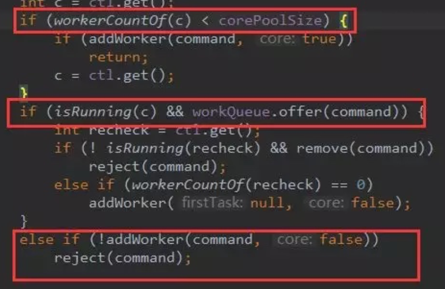
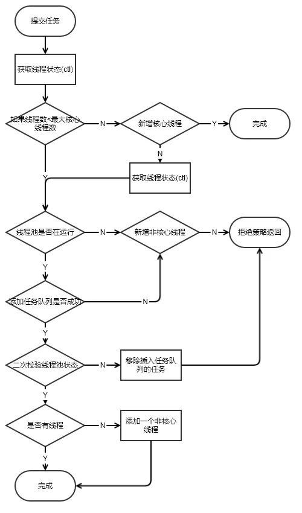
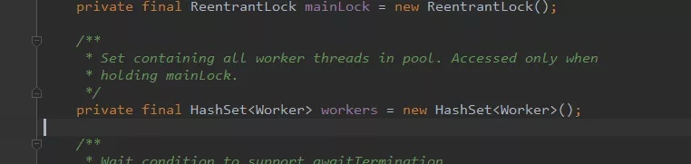
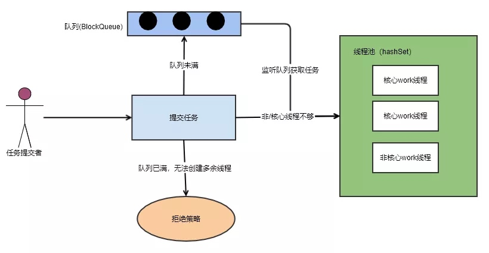

<!--ts-->

   * [1. 池化技术](#1-池化技术)
   * [2. 线程池的简单使用](#2-线程池的简单使用)
      * [2.1 添加一个任务](#21-添加一个任务)
      * [2.2 添加worker线程](#22-添加worker线程)
      * [2.4 worker线程处理队列任务](#24-worker线程处理队列任务)
      * [2.5 总结](#25-总结)
      * [2.6 Executors存在什么问题](#26-executors存在什么问题)
      * [2.7 Executors为什么存在缺陷](#27-executors为什么存在缺陷)
      * [2.8 创建线程池的正确姿势](#28-创建线程池的正确姿势)

<!-- Added by: anapodoton, at: Sat Feb 22 16:38:13 CST 2020 -->

<!--te-->

[深入理解Java并发编程（五）：Java线程池的实现原理](https://www.hollischuang.com/archives/3175)

在前面的章节中，我们介绍了线程的基本概念，如线程的定义、线程状态、线程调度、线程优先级、守护线程、ThreadLocal以及线程池等。

并且我们还介绍了四种创建线程的方式，本文，就来深入分析一下Java中线程池的实现原理。

程序的运行，其本质上，是对系统资源（CPU、内存、磁盘、网络等等）的使用。如何高效的使用这些资源是我们编程优化演进的一个方向。今天说的线程池就是一种对CPU利用的优化手段。

网上有不少介绍如何使用线程池的文章，那我想说点什么呢？我希望通过学习线程池原理，明白所有池化技术的基本设计思路。遇到其他相似问题可以解决。

# 1. 池化技术

前面提到一个名词——池化技术，那么到底什么是池化技术呢？

池化技术简单点来说，就是提前保存大量的资源，以备不时之需。在机器资源有限的情况下，使用池化技术可以大大的提高资源的利用率，提升性能等。

在编程领域，比较典型的池化技术有：

**线程池、连接池、内存池、对象池等。**

本文主要来介绍一下其中比较简单的线程池的实现原理，希望读者们可以举一反三，通过对线程池的理解，学习并掌握所有编程中池化技术的底层原理。

**创建一个线程**

在Java的并发编程中，线程是十分重要的，在Java中，创建一个线程比较简单：

```java
public class App {
    public static void main(String[] args) throws Exception {
        new Thread(new Runnable() {
            @Override
            public void run() {
                System.out.println("线程运行中");
            }
        }).start();
    }
}
```

我们通过创建一个线程对象，并且实现Runnable接口就可以实现一个简单的线程。可以利用上多核CPU。当一个任务结束，当前线程就接收。

但很多时候，我们不止会执行一个任务。**如果每次都是如此的创建线程->执行任务->销毁线程，会造成很大的性能开销。**

那能否一个线程创建后，执行完一个任务后，又去执行另一个任务，而不是销毁。这就是线程池。

**这也就是池化技术的思想，通过预先创建好多个线程，放在池中，这样可以在需要使用线程的时候直接获取，避免多次重复创建、销毁带来的开销。**

# 2. 线程池的简单使用

以下代码，是在Java中创建线程池：

```java
import java.util.concurrent.*;

public class App {
    public static void main(String[] args) throws Exception {
        ExecutorService executorService = new ThreadPoolExecutor(1, 1,
                60L, TimeUnit.SECONDS,
                new ArrayBlockingQueue<>(10));

        executorService.execute(new Runnable() {
            @Override
            public void run() {
                System.out.println("abcdefg");
            }
        });

        executorService.shutdown();
    }
}
```

Jdk提供给外部的接口也很简单。直接调用ThreadPoolExecutor构造一个就可以了，也可以通过Executors静态工厂构建，但一般不建议。(后面章节会专门介绍这个话题）

可以看到，开发者想要在代码中使用线程池还是比较简单的，这得益于Java给我们封装好的一系列API。但是，这些API的背后是什么呢，让我们来揭开这个迷雾，看清线程池的本质。

**线程池构造函数**

通常，一般构造函数会反映出这个工具或这个对象的数据存储结构。

```java
/**
 * Creates a new {@code ThreadPoolExecutor} with the given initial
 * parameters.
 *
 * @param corePoolSize the number of threads to keep in the pool, even
 *        if they are idle, unless {@code allowCoreThreadTimeOut} is set
 * @param maximumPoolSize the maximum number of threads to allow in the
 *        pool
 * @param keepAliveTime when the number of threads is greater than
 *        the core, this is the maximum time that excess idle threads
 *        will wait for new tasks before terminating.
 * @param unit the time unit for the {@code keepAliveTime} argument
 * @param workQueue the queue to use for holding tasks before they are
 *        executed.  This queue will hold only the {@code Runnable}
 *        tasks submitted by the {@code execute} method.
 * @param threadFactory the factory to use when the executor
 *        creates a new thread
 * @param handler the handler to use when execution is blocked
 *        because the thread bounds and queue capacities are reached
 * @throws IllegalArgumentException if one of the following holds:<br>
 *         {@code corePoolSize < 0}<br>
 *         {@code keepAliveTime < 0}<br>
 *         {@code maximumPoolSize <= 0}<br>
 *         {@code maximumPoolSize < corePoolSize}
 * @throws NullPointerException if {@code workQueue}
 *         or {@code threadFactory} or {@code handler} is null
 */
public ThreadPoolExecutor(int corePoolSize,
                          int maximumPoolSize,
                          long keepAliveTime,
                          TimeUnit unit,
                          BlockingQueue<Runnable> workQueue,
                          ThreadFactory threadFactory,
                          RejectedExecutionHandler handler) {
    if (corePoolSize < 0 ||
        maximumPoolSize <= 0 ||
        maximumPoolSize < corePoolSize ||
        keepAliveTime < 0)
        throw new IllegalArgumentException();
    if (workQueue == null || threadFactory == null || handler == null)
        throw new NullPointerException();
    this.corePoolSize = corePoolSize;
    this.maximumPoolSize = maximumPoolSize;
    this.workQueue = workQueue;
    this.keepAliveTime = unit.toNanos(keepAliveTime);
    this.threadFactory = threadFactory;
    this.handler = handler;
}
```

> 如果把线程池比作一个公司。公司会有正式员工处理正常业务，如果工作量大的话，会雇佣外包人员来工作。
>
> 闲时就可以释放外包人员以减少公司管理开销。一个公司因为成本关系，雇佣的人员始终是有最大数。
>
> 如果这时候还有任务处理不过来，就走需求池排任务。

- corePoolSize: 核心线程数量，可以类比正式员工数量，常驻线程数量。
- maximumPoolSize: 最大的线程数量，公司最多雇佣员工数量。常驻+临时线程数量。
- workQueue：多余任务等待队列，再多的人都处理不过来了，需要等着，在这个地方等。
- keepAliveTime：非核心线程空闲时间，就是外包人员等了多久，如果还没有活干，解雇了。
- threadFactory: 创建线程的工厂，在这个地方可以统一处理创建的线程的属性。每个公司对员工的要求不一样，恩，在这里设置员工的属性。
- handler：线程池拒绝策略，什么意思呢？就是当任务实在是太多，人也不够，需求池也排满了，还有任务咋办？默认是不处理，抛出异常告诉任务提交者，我这忙不过来了。

## 2.1 添加一个任务

接着，我们看一下线程池中比较重要的execute方法，该方法用于向线程池中添加一个任务。

```java
/**
 * Executes the given task sometime in the future.  The task
 * may execute in a new thread or in an existing pooled thread.
 *
 * If the task cannot be submitted for execution, either because this
 * executor has been shutdown or because its capacity has been reached,
 * the task is handled by the current {@code RejectedExecutionHandler}.
 *
 * @param command the task to execute
 * @throws RejectedExecutionException at discretion of
 *         {@code RejectedExecutionHandler}, if the task
 *         cannot be accepted for execution
 * @throws NullPointerException if {@code command} is null
 */
public void execute(Runnable command) {
    if (command == null)
        throw new NullPointerException();
    /*
     * Proceed in 3 steps:
     *
     * 1. If fewer than corePoolSize threads are running, try to
     * start a new thread with the given command as its first
     * task.  The call to addWorker atomically checks runState and
     * workerCount, and so prevents false alarms that would add
     * threads when it shouldn't, by returning false.
     *
     * 2. If a task can be successfully queued, then we still need
     * to double-check whether we should have added a thread
     * (because existing ones died since last checking) or that
     * the pool shut down since entry into this method. So we
     * recheck state and if necessary roll back the enqueuing if
     * stopped, or start a new thread if there are none.
     *
     * 3. If we cannot queue task, then we try to add a new
     * thread.  If it fails, we know we are shut down or saturated
     * and so reject the task.
     */
    int c = ctl.get();
    if (workerCountOf(c) < corePoolSize) {
        if (addWorker(command, true))
            return;
        c = ctl.get();
    }
    if (isRunning(c) && workQueue.offer(command)) {
        int recheck = ctl.get();
        if (! isRunning(recheck) && remove(command))
            reject(command);
        else if (workerCountOf(recheck) == 0)
            addWorker(null, false);
    }
    else if (!addWorker(command, false))
        reject(command);
}
```



核心模块用红框标记了。 

- 第一个红框：workerCountOf方法根据ctl的低29位，得到线程池的当前线程数，如果线程数小于corePoolSize，则执行addWorker方法创建新的线程执行任务；

- 第二个红框：判断线程池是否在运行，如果在，任务队列是否允许插入，插入成功再次验证线程池是否运行，如果不在运行，移除插入的任务，然后抛出拒绝策略。如果在运行，没有线程了，就启用一个线程。
- 第三个红框：如果添加非核心线程失败，就直接拒绝了。

这里逻辑稍微有点复杂，画了个流程图仅供参考



接下来，我们看看如何添加一个工作线程的？

## 2.2 添加worker线程

从方法execute的实现可以看出：addWorker主要负责创建新的线程并执行任务，代码如下（这里代码有点长，没关系，也是分块的，总共有5个关键的代码块）：

```java
/**
 * Checks if a new worker can be added with respect to current
 * pool state and the given bound (either core or maximum). If so,
 * the worker count is adjusted accordingly, and, if possible, a
 * new worker is created and started, running firstTask as its
 * first task. This method returns false if the pool is stopped or
 * eligible to shut down. It also returns false if the thread
 * factory fails to create a thread when asked.  If the thread
 * creation fails, either due to the thread factory returning
 * null, or due to an exception (typically OutOfMemoryError in
 * Thread#start), we roll back cleanly.
 *
 * @param firstTask the task the new thread should run first (or
 * null if none). Workers are created with an initial first task
 * (in method execute()) to bypass queuing when there are fewer
 * than corePoolSize threads (in which case we always start one),
 * or when the queue is full (in which case we must bypass queue).
 * Initially idle threads are usually created via
 * prestartCoreThread or to replace other dying workers.
 *
 * @param core if true use corePoolSize as bound, else
 * maximumPoolSize. (A boolean indicator is used here rather than a
 * value to ensure reads of fresh values after checking other pool
 * state).
 * @return true if successful
 */
private boolean addWorker(Runnable firstTask, boolean core) {
    retry:
    for (;;) {
        int c = ctl.get();
        int rs = runStateOf(c);

        // Check if queue empty only if necessary.
        if (rs >= SHUTDOWN &&
            ! (rs == SHUTDOWN &&
               firstTask == null &&
               ! workQueue.isEmpty()))
            return false;

        for (;;) {
            int wc = workerCountOf(c);
            if (wc >= CAPACITY ||
                wc >= (core ? corePoolSize : maximumPoolSize))
                return false;
            if (compareAndIncrementWorkerCount(c))
                break retry;
            c = ctl.get();  // Re-read ctl
            if (runStateOf(c) != rs)
                continue retry;
            // else CAS failed due to workerCount change; retry inner loop
        }
    }

    boolean workerStarted = false;
    boolean workerAdded = false;
    Worker w = null;
    try {
        final ReentrantLock mainLock = this.mainLock;
        w = new Worker(firstTask);
        final Thread t = w.thread;
        if (t != null) {
            mainLock.lock();
            try {
                // Recheck while holding lock.
                // Back out on ThreadFactory failure or if
                // shut down before lock acquired.
                int c = ctl.get();
                int rs = runStateOf(c);

                if (rs < SHUTDOWN ||
                    (rs == SHUTDOWN && firstTask == null)) {
                    if (t.isAlive()) // precheck that t is startable
                        throw new IllegalThreadStateException();
                    workers.add(w);
                    int s = workers.size();
                    if (s > largestPoolSize)
                        largestPoolSize = s;
                    workerAdded = true;
                }
            } finally {
                mainLock.unlock();
            }
            if (workerAdded) {
                t.start();
                workerStarted = true;
            }
        }
    } finally {
        if (! workerStarted)
            addWorkerFailed(w);
    }
    return workerStarted;
}
```



- 第一个红框：做是否能够添加工作线程条件过滤：

判断线程池的状态，如果线程池的状态值大于或等SHUTDOWN，则不处理提交的任务，直接返回；

- 第二个红框：做自旋，更新创建线程数量：

通过参数core判断当前需要创建的线程是否为核心线程，如果core为true，且当前线程数小于corePoolSize，则跳出循环，开始创建新的线程

> 有人或许会疑问 retry 是什么？这个是java中的goto语法。只能运用在break和continue后面。

接着看后面的代码：



- 第一个红框：获取线程池主锁。

线程池的工作线程通过Woker类实现，通过ReentrantLock锁保证线程安全。

- 第二个红框：添加线程到workers中（线程池中）。
- 第三个红框：启动新建的线程。

接下来，我们看看workers是什么。



一个hashSet。所以，线程池底层的存储结构其实就是一个HashSet。

## 2.4 worker线程处理队列任务



- 第一个红框：是否是第一次执行任务，或者从队列中可以获取到任务。
- 第二个红框：获取到任务后，执行任务开始前操作钩子。
- 第三个红框：执行任务。
- 第四个红框：执行任务后钩子。

这两个钩子（beforeExecute，afterExecute）允许我们自己继承线程池，做任务执行前后处理。

到这里，源代码分析到此为止。接下来做一下简单的总结。

## 2.5 总结

所谓线程池本质是一个hashSet。多余的任务会放在阻塞队列中。

只有当阻塞队列满了后，才会触发非核心线程的创建。所以非核心线程只是临时过来打杂的。直到空闲了，然后自己关闭了。

线程池提供了两个钩子（beforeExecute，afterExecute）给我们，我们继承线程池，在执行任务前后做一些事情。

   线程池原理关键技术：锁（lock,cas）、阻塞队列、hashSet（资源池）



最后希望对你理解线程池有帮助。最后，留一个思考题，为什么线程池的底层数据接口采用HashSet来实现？

上面是原理，下面是如何使用。

在前面的章节中，我们介绍过了Java中线 程池的常见用法以及基本原理。

在文中有这样一段描述：

> 可以通过Executors静态工厂构建线程池，但一般不建议这样使用。

关于这个问题，在那篇文章中并没有深入的展开。作者之所以这么说，是因为这种创建线程池的方式有很大的隐患，稍有不慎就有可能导致线上故障，如：一次Java线程池误用引发的血案和总结（ https://zhuanlan.zhihu.com/p/32867181 ）

本文我们就来围绕这个问题来分析一下为什么JDK自身提供的构建线程池的方式并不建议使用？到底应该如何创建一个线程池呢？

Executors 是一个Java中的工具类。提供工厂方法来创建不同类型的线程池。


从上图中也可以看出，Executors的创建线程池的方法，创建出来的线程池都实现了ExecutorService接口。常用方法有以下几个：

`newFiexedThreadPool(int Threads)`：创建固定数目线程的线程池。

`newCachedThreadPool()`：创建一个可缓存的线程池，调用execute 将重用以前构造的线程（如果线程可用）。如果没有可用的线程，则创建一个新线程并添加到池中。终止并从缓存中移除那些已有 60 秒钟未被使用的线程。

`newSingleThreadExecutor()`创建一个单线程化的Executor。

`newScheduledThreadPool(int corePoolSize)`创建一个支持定时及周期性的任务执行的线程池，多数情况下可用来替代Timer类。

类看起来功能还是比较强大的，又用到了工厂模式、又有比较强的扩展性，重要的是用起来还比较方便，如：

```text
ExecutorService executor = Executors.newFixedThreadPool(nThreads) ;
```

即可创建一个固定大小的线程池。

但是为什么我说不建议大家使用这个类来创建线程池呢？

我提到的是『不建议』，但是在阿里巴巴Java开发手册中也明确指出，而且用的词是『不允许』使用Executors创建线程池。


## 2.6 Executors存在什么问题

在阿里巴巴Java开发手册中提到，使用Executors创建线程池可能会导致OOM(OutOfMemory ,内存溢出)，但是并没有说明为什么，那么接下来我们就来看一下到底为什么不允许使用Executors？

我们先来一个简单的例子，模拟一下使用Executors导致OOM的情况。

```java
public class ExecutorsDemo {
    private static ExecutorService executor = Executors.newFixedThreadPool(15);
    public static void main(String[] args) {
        for (int i = 0; i < Integer.MAX_VALUE; i++) {
            executor.execute(new SubThread());
        }
    }
}

class SubThread implements Runnable {
    @Override
    public void run() {
        try {
            Thread.sleep(10000);
        } catch (InterruptedException e) {
            //do nothing
        }
    }
}
```

通过指定JVM参数：`-Xmx8m -Xms8m` 运行以上代码，会抛出OOM:

```java
Exception in thread "main" java.lang.OutOfMemoryError: GC overhead limit exceeded
    at java.util.concurrent.LinkedBlockingQueue.offer(LinkedBlockingQueue.java:416)
    at java.util.concurrent.ThreadPoolExecutor.execute(ThreadPoolExecutor.java:1371)
    at com.hollis.ExecutorsDemo.main(ExecutorsDemo.java:16)
```

以上代码指出，`ExecutorsDemo.java`的第16行，就是代码中的`executor.execute(new SubThread());`。

## 2.7 Executors为什么存在缺陷

通过上面的例子，我们知道了`Executors`创建的线程池存在OOM的风险，那么到底是什么原因导致的呢？我们需要深入`Executors`的源码来分析一下。

其实，在上面的报错信息中，我们是可以看出蛛丝马迹的，在以上的代码中其实已经说了，真正的导致OOM的其实是`LinkedBlockingQueue.offer`方法。

```text
Exception in thread "main" java.lang.OutOfMemoryError: GC overhead limit exceeded
    at java.util.concurrent.LinkedBlockingQueue.offer(LinkedBlockingQueue.java:416)
    at java.util.concurrent.ThreadPoolExecutor.execute(ThreadPoolExecutor.java:1371)
    at com.hollis.ExecutorsDemo.main(ExecutorsDemo.java:16)
```

如果读者翻看代码的话，也可以发现，其实底层确实是通过`LinkedBlockingQueue`实现的：

```java
public static ExecutorService newFixedThreadPool(int nThreads) {
        return new ThreadPoolExecutor(nThreads, nThreads,
                                      0L, TimeUnit.MILLISECONDS,
                                      new LinkedBlockingQueue<Runnable>());
```

如果读者对Java中的阻塞队列有所了解的话，看到这里或许就能够明白原因了。

Java中的`BlockingQueue`主要有两种实现，分别是`ArrayBlockingQueue` 和 `LinkedBlockingQueue`。

`ArrayBlockingQueue`是一个用数组实现的有界阻塞队列，必须设置容量。

`LinkedBlockingQueue`是一个用链表实现的有界阻塞队列，容量可以选择进行设置，不设置的话，将是一个无边界的阻塞队列，最大长度为`Integer.MAX_VALUE`。

这里的问题就出在：**不设置的话，将是一个无边界的阻塞队列，最大长度为Integer.MAX_VALUE。**也就是说，如果我们不设置`LinkedBlockingQueue`的容量的话，其默认容量将会是`Integer.MAX_VALUE`。

而`newFixedThreadPool`中创建`LinkedBlockingQueue`时，并未指定容量。此时，`LinkedBlockingQueue`就是一个无边界队列，对于一个无边界队列来说，是可以不断的向队列中加入任务的，这种情况下就有可能因为任务过多而导致内存溢出问题。

上面提到的问题主要体现在`newFixedThreadPool`和`newSingleThreadExecutor`两个工厂方法上，并不是说`newCachedThreadPool`和`newScheduledThreadPool`这两个方法就安全了，这两种方式创建的最大线程数可能是`Integer.MAX_VALUE`，而创建这么多线程，必然就有可能导致OOM。

## 2.8 创建线程池的正确姿势

避免使用Executors创建线程池，主要是避免使用其中的默认实现，那么我们可以自己直接调用`ThreadPoolExecutor`的构造函数来自己创建线程池。在创建的同时，给`BlockQueue`指定容量就可以了。

```text
private static ExecutorService executor = new ThreadPoolExecutor(10, 10,
        60L, TimeUnit.SECONDS,
        new ArrayBlockingQueue(10));
```

这种情况下，一旦提交的线程数超过当前可用线程数时，就会抛出`java.util.concurrent.RejectedExecutionException`，这是因为当前线程池使用的队列是有边界队列，队列已经满了便无法继续处理新的请求。但是异常（Exception）总比发生错误（Error）要好。

除了自己定义`ThreadPoolExecutor`外。还有其他方法。这个时候第一时间就应该想到开源类库，如apache和guava等。

作者推荐使用guava提供的ThreadFactoryBuilder来创建线程池。

```java
public class ExecutorsDemo {

    private static ThreadFactory namedThreadFactory = new ThreadFactoryBuilder()
        .setNameFormat("demo-pool-%d").build();

    private static ExecutorService pool = new ThreadPoolExecutor(5, 200,
        0L, TimeUnit.MILLISECONDS,
        new LinkedBlockingQueue<Runnable>(1024), namedThreadFactory, new ThreadPoolExecutor.AbortPolicy());

    public static void main(String[] args) {

        for (int i = 0; i < Integer.MAX_VALUE; i++) {
            pool.execute(new SubThread());
        }
    }
}
```

通过上述方式创建线程时，不仅可以避免OOM的问题，还可以自定义线程名称，更加方便的出错的时候溯源。
