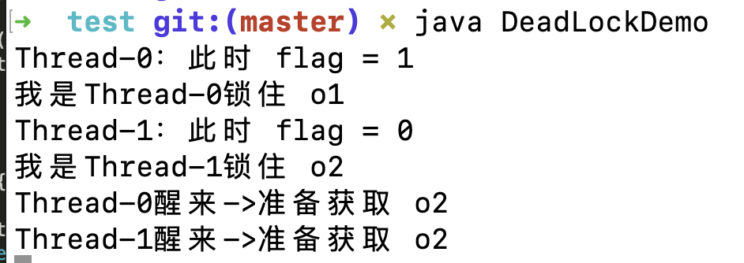

<!--ts-->
   * [前言](#前言)
   * [1. 数据库中的锁](#1-数据库中的锁)
      * [1.1 数据库的锁机制](#11-数据库的锁机制)
         * [1.2 并发控制](#12-并发控制)
         * [1.3 锁](#13-锁)
            * [1.3.1 锁的分类(oracle)](#131-锁的分类oracle)
      * [1.2 MySQL中的行级锁,表级锁,页级锁](#12-mysql中的行级锁表级锁页级锁)
         * [1.2.1 行级锁](#121-行级锁)
         * [1.2.2 表级锁](#122-表级锁)
         * [1.2.3 页级锁](#123-页级锁)
         * [1.2.4 MySQL常用存储引擎的锁机制](#124-mysql常用存储引擎的锁机制)
         * [1.2.5 Innodb中的行锁与表锁](#125-innodb中的行锁与表锁)
         * [1.2.6 行级锁与死锁](#126-行级锁与死锁)
         * [1.2.7 参考资料](#127-参考资料)
      * [1.3 MySQL中的共享锁与排他锁](#13-mysql中的共享锁与排他锁)
         * [1.3.1 共享锁(Share Lock)](#131-共享锁share-lock)
         * [1.3.2 排他锁（eXclusive Lock）](#132-排他锁exclusive-lock)
         * [1.3.3 意向锁](#133-意向锁)
         * [1.3.4 参考资料：](#134-参考资料)
   * [2. 深入理解乐观锁与悲观锁](#2-深入理解乐观锁与悲观锁)
      * [2.1 悲观锁](#21-悲观锁)
      * [2.2 乐观锁](#22-乐观锁)
         * [2.2.1 使用版本号实现乐观锁](#221-使用版本号实现乐观锁)
         * [2.2.2 优点与不足](#222-优点与不足)
      * [2.3 如何选择](#23-如何选择)
      * [2.4 参考资料](#24-参考资料)
   * [3. 乐观锁的一种实现方式——CAS](#3-乐观锁的一种实现方式cas)
      * [3.1 线程安全](#31-线程安全)
      * [3.2 锁存在的问题](#32-锁存在的问题)
      * [3.3 乐观锁](#33-乐观锁)
      * [3.4 CAS](#34-cas)
         * [3.4.1 Java对CAS的支持](#341-java对cas的支持)
         * [3.4.2 ABA问题](#342-aba问题)
      * [3.5 CAS与对象创建](#35-cas与对象创建)
      * [3.6 参考资料](#36-参考资料)
   * [4. 分布式锁](#4-分布式锁)
      * [4.1 基于数据库实现分布式锁](#41-基于数据库实现分布式锁)
         * [4.1.1 基于数据库表](#411-基于数据库表)
         * [4.1.2 基于数据库排他锁](#412-基于数据库排他锁)
         * [4.1.3 总结](#413-总结)
      * [4.2 基于缓存实现分布式锁](#42-基于缓存实现分布式锁)
      * [4.3 基于Zookeeper实现分布式锁](#43-基于zookeeper实现分布式锁)
      * [4.4 三种方案的比较](#44-三种方案的比较)
   * [5. Java虚拟机的锁优化技术](#5-java虚拟机的锁优化技术)
      * [5.1 线程状态](#51-线程状态)
      * [5.2 自旋锁](#52-自旋锁)
      * [5.3 锁消除](#53-锁消除)
      * [5.4 锁粗化](#54-锁粗化)
      * [5.5 总结](#55-总结)
   * [6. java级别的死锁](#6-java级别的死锁)
      * [6.1 什么是死锁](#61-什么是死锁)
      * [6.2 动手写死锁](#62-动手写死锁)
      * [6.3 发现排查死锁情况](#63-发现排查死锁情况)
      * [6.4 解决办法](#64-解决办法)

<!-- Added by: anapodoton, at: Sun Feb 23 11:10:30 CST 2020 -->

<!--te-->

# 前言

CAS、乐观锁与悲观锁、数据库相关锁机制、分布式锁、偏向锁、轻量级锁、重量级锁、monitor、

锁优化、锁消除、锁粗化、自旋锁、可重入锁、阻塞锁、死锁

# 1. 数据库中的锁

## 1.1 数据库的锁机制

> [数据库的读现象浅析](http://www.hollischuang.com/archives/900)中介绍过，在并发访问情况下，可能会出现脏读、不可重复读和幻读等读现象，为了应对这些问题，主流数据库都提供了锁机制，并引入了事务隔离级别的概念。

### 1.2 并发控制

> 在计算机科学，特别是程序设计、操作系统、多处理机和数据库等领域，并发控制（`Concurrency control`）是确保及时纠正由并发操作导致的错误的一种机制。

数据库管理系统（DBMS）中的并发控制的任务是确保在多个事务同时存取数据库中同一数据时不破坏事务的隔离性和统一性以及数据库的统一性。下面举例说明并发操作带来的数据不一致性问题：

现有两处火车票售票点，同时读取某一趟列车车票数据库中车票余额为 X。两处售票点同时卖出一张车票，同时修改余额为 X -1写回数据库，这样就造成了实际卖出两张火车票而数据库中的记录却只少了一张。 产生这种情况的原因是因为两个事务读入同一数据并同时修改，其中一个事务提交的结果破坏了另一个事务提交的结果，导致其数据的修改被丢失，破坏了事务的隔离性。并发控制要解决的就是这类问题。

**封锁**、**时间戳**、**乐观并发控制**(乐观锁)和**悲观并发控制**（悲观锁）是并发控制主要采用的技术手段。

### 1.3 锁

当并发事务同时访问一个资源时，有可能导致数据不一致，因此需要一种机制来将数据访问顺序化，以保证数据库数据的一致性。锁就是其中的一种机制。

在计算机科学中，锁是在执行多线程时用于强行限制资源访问的同步机制，即用于在并发控制中保证对互斥要求的满足。

#### 1.3.1 锁的分类(oracle)

一、按操作划分，可分为`DML锁`、`DDL锁`

二、按锁的粒度划分，可分为[`表级锁`](http://www.hollischuang.com/archives/914)、[`行级锁`](http://www.hollischuang.com/archives/914)、[`页级锁`](http://www.hollischuang.com/archives/914)（mysql）

三、按锁级别划分，可分为[`共享锁`](http://www.hollischuang.com/archives/923)、[`排他锁`](http://www.hollischuang.com/archives/923)

四、按加锁方式划分，可分为`自动锁`、`显示锁`

五、按使用方式划分，可分为[`乐观锁`](http://www.hollischuang.com/archives/934)、[`悲观锁`](http://www.hollischuang.com/archives/934)

DML锁（data locks，数据锁），用于保护数据的完整性，其中包括行级锁(Row Locks (TX锁))、表级锁(table lock(TM锁))。 DDL锁（dictionary locks，数据字典锁），用于保护数据库对象的结构，如表、索引等的结构定义。其中包排他DDL锁（Exclusive DDL lock）、共享DDL锁（Share DDL lock）、可中断解析锁（Breakable parse locks）

## 1.2 MySQL中的行级锁,表级锁,页级锁

在计算机科学中，锁是在执行多线程时用于强行限制资源访问的同步机制，即用于在并发控制中保证对互斥要求的满足。

在[数据库的锁机制](http://www.hollischuang.com/archives/909)中介绍过，在DBMS中，可以按照锁的粒度把数据库锁分为行级锁(INNODB引擎)、表级锁(MYISAM引擎)和页级锁(BDB引擎 )。

### 1.2.1 行级锁

行级锁是Mysql中锁定粒度最细的一种锁，表示只针对当前操作的行进行加锁。行级锁能大大减少数据库操作的冲突。其加锁粒度最小，但加锁的开销也最大。行级锁分为**[`共享锁`](http://www.hollischuang.com/archives/923)** 和 **[`排他锁`](http://www.hollischuang.com/archives/923)**。

**特点**

开销大，加锁慢；会出现死锁；锁定粒度最小，发生锁冲突的概率最低，并发度也最高。

------

### 1.2.2 表级锁

表级锁是MySQL中锁定粒度最大的一种锁，表示对当前操作的整张表加锁，它实现简单，资源消耗较少，被大部分MySQL引擎支持。最常使用的MYISAM与INNODB都支持表级锁定。表级锁定分为**`表共享读锁`（[共享锁](http://www.hollischuang.com/archives/923)）**与**`表独占写锁`（[排他锁](http://www.hollischuang.com/archives/923)）**。

**特点**

开销小，加锁快；不会出现死锁；锁定粒度大，发出锁冲突的概率最高，并发度最低。

------

### 1.2.3 页级锁

页级锁是MySQL中锁定粒度介于行级锁和表级锁中间的一种锁。表级锁速度快，但冲突多，行级冲突少，但速度慢。所以取了折衷的页级，一次锁定相邻的一组记录。BDB支持页级锁

**特点**

开销和加锁时间界于表锁和行锁之间；会出现死锁；锁定粒度界于表锁和行锁之间，并发度一般

------

### 1.2.4 MySQL常用存储引擎的锁机制

> MyISAM和MEMORY采用表级锁(table-level locking)
>
> BDB采用页面锁(page-level locking)或表级锁，默认为页面锁
>
> InnoDB支持行级锁(row-level locking)和表级锁,默认为行级锁

------

### 1.2.5 Innodb中的行锁与表锁

前面提到过，在Innodb引擎中既支持行锁也支持表锁，那么什么时候会锁住整张表，什么时候或只锁住一行呢？

InnoDB行锁是通过给索引上的索引项加锁来实现的，这一点MySQL与Oracle不同，后者是通过在数据块中对相应数据行加锁来实现的。InnoDB这种行锁实现特点意味着：**只有通过索引条件检索数据，InnoDB才使用行级锁，否则，InnoDB将使用表锁！**

在实际应用中，要特别注意InnoDB行锁的这一特性，不然的话，可能导致大量的锁冲突，从而影响并发性能。

- 在不通过索引条件查询的时候,InnoDB 确实使用的是表锁,而不是行锁。
- 由于 MySQL 的行锁是针对索引加的锁,不是针对记录加的锁,所以虽然是访问不同行 的记录,但是如果是使用相同的索引键,是会出现锁冲突的。应用设计的时候要注意这一点。
- 当表有多个索引的时候,不同的事务可以使用不同的索引锁定不同的行,另外,不论 是使用主键索引、唯一索引或普通索引,InnoDB 都会使用行锁来对数据加锁。
- 即便在条件中使用了索引字段,但是否使用索引来检索数据是由 MySQL 通过判断不同 执行计划的代价来决定的,如果 MySQL 认为全表扫 效率更高,比如对一些很小的表,它 就不会使用索引,这种情况下 InnoDB 将使用表锁,而不是行锁。因此,在分析锁冲突时, 别忘了检查 SQL 的执行计划,以确认是否真正使用了索引。

------

### 1.2.6 行级锁与死锁

MyISAM中是不会产生死锁的，因为MyISAM总是一次性获得所需的全部锁，要么全部满足，要么全部等待。而在InnoDB中，锁是逐步获得的，就造成了死锁的可能。

在MySQL中，行级锁并不是直接锁记录，而是锁索引。索引分为主键索引和非主键索引两种，如果一条sql语句操作了主键索引，MySQL就会锁定这条主键索引；如果一条语句操作了非主键索引，MySQL会先锁定该非主键索引，再锁定相关的主键索引。 在UPDATE、DELETE操作时，MySQL不仅锁定WHERE条件扫描过的所有索引记录，而且会锁定相邻的键值，即所谓的next-key locking。

当两个事务同时执行，一个锁住了主键索引，在等待其他相关索引。另一个锁定了非主键索引，在等待主键索引。这样就会发生死锁。

发生死锁后，InnoDB一般都可以检测到，并使一个事务释放锁回退，另一个获取锁完成事务。

------

**有多种方法可以避免死锁，这里只介绍常见的三种**

1、如果不同程序会并发存取多个表，尽量约定以相同的顺序访问表，可以大大降低死锁机会。

2、在同一个事务中，尽可能做到一次锁定所需要的所有资源，减少死锁产生概率；

3、对于非常容易产生死锁的业务部分，可以尝试使用升级锁定颗粒度，通过表级锁定来减少死锁产生的概率；

### 1.2.7 参考资料

[20.3.4 InnoDB行锁实现方式](http://book.51cto.com/art/200803/68127.htm)

## 1.3 MySQL中的共享锁与排他锁

在[MySQL中的行级锁,表级锁,页级锁](http://www.hollischuang.com/archives/914)中介绍过，行级锁是Mysql中锁定粒度最细的一种锁，行级锁能大大减少数据库操作的冲突。行级锁分为共享锁和排他锁两种，本文将详细介绍共享锁及排他锁的概念、使用方式及注意事项等。

### 1.3.1 共享锁(Share Lock)

共享锁又称读锁，是读取操作创建的锁。其他用户可以并发读取数据，但任何事务都不能对数据进行修改（获取数据上的排他锁），直到已释放所有共享锁。

如果事务T对数据A加上共享锁后，则其他事务只能对A再加共享锁，不能加排他锁。获准共享锁的事务只能读数据，不能修改数据。

用法

```
SELECT ... LOCK IN SHARE MODE;
```

在查询语句后面增加`LOCK IN SHARE MODE`，Mysql会对查询结果中的每行都加共享锁，当没有其他线程对查询结果集中的任何一行使用排他锁时，可以成功申请共享锁，否则会被阻塞。其他线程也可以读取使用了共享锁的表，而且这些线程读取的是同一个版本的数据。

### 1.3.2 排他锁（eXclusive Lock）

排他锁又称写锁，如果事务T对数据A加上排他锁后，则其他事务不能再对A加任任何类型的封锁。获准排他锁的事务既能读数据，又能修改数据。

用法

```
SELECT ... FOR UPDATE;
```

在查询语句后面增加`FOR UPDATE`，Mysql会对查询结果中的每行都加排他锁，当没有其他线程对查询结果集中的任何一行使用排他锁时，可以成功申请排他锁，否则会被阻塞。

### 1.3.3 意向锁

意向锁是表级锁，其设计目的主要是为了在一个事务中揭示下一行将要被请求锁的类型。InnoDB中的两个表锁：

意向共享锁（IS）：表示事务准备给数据行加入共享锁，也就是说一个数据行加共享锁前必须先取得该表的IS锁

意向排他锁（IX）：类似上面，表示事务准备给数据行加入排他锁，说明事务在一个数据行加排他锁前必须先取得该表的IX锁。

**意向锁是InnoDB自动加的，不需要用户干预。**

对于insert、update、delete，InnoDB会自动给涉及的数据加排他锁（X）；对于一般的Select语句，InnoDB不会加任何锁，事务可以通过以下语句给显示加共享锁或排他锁。

共享锁：`SELECT ... LOCK IN SHARE MODE;`

排他锁：`SELECT ... FOR UPDATE;`

### 1.3.4 参考资料：

[MySQL表级锁与行级锁](http://linux.it.net.cn/m/view.php?aid=11089)

[MySQL锁的用法之行级锁](http://blog.csdn.net/tigernorth/article/details/7948539)

[Mysql中那些锁机制之InnoDB](http://www.2cto.com/database/201508/429967.html)


# 2. 深入理解乐观锁与悲观锁

在[数据库的锁机制](http://www.hollischuang.com/archives/909)中介绍过，数据库管理系统（DBMS）中的并发控制的任务是确保在多个事务同时存取数据库中同一数据时不破坏事务的隔离性和统一性以及数据库的统一性。

乐观并发控制(乐观锁)和悲观并发控制（悲观锁）是并发控制主要采用的技术手段。

无论是悲观锁还是乐观锁，都是人们定义出来的概念，可以认为是一种思想。其实不仅仅是关系型数据库系统中有乐观锁和悲观锁的概念，像memcache、hibernate、tair等都有类似的概念。

针对于不同的业务场景，应该选用不同的并发控制方式。所以，不要把乐观并发控制和悲观并发控制狭义的理解为DBMS中的概念，更不要把他们和数据中提供的锁机制（行锁、表锁、排他锁、共享锁）混为一谈。其实，在DBMS中，悲观锁正是利用数据库本身提供的锁机制来实现的。

下面来分别学习一下悲观锁和乐观锁。

## 2.1 悲观锁

当我们要对一个数据库中的一条数据进行修改的时候，为了避免同时被其他人修改，最好的办法就是直接对该数据进行加锁以防止并发。

这种借助数据库锁机制在修改数据之前先锁定，再修改的方式被称之为悲观并发控制（又名“悲观锁”，Pessimistic Concurrency Control，缩写“PCC”）。

> 在关系数据库管理系统里，悲观并发控制（又名“悲观锁”，Pessimistic Concurrency Control，缩写“PCC”）是一种并发控制的方法。它可以阻止一个事务以影响其他用户的方式来修改数据。如果一个事务执行的操作都某行数据应用了锁，那只有当这个事务把锁释放，其他事务才能够执行与该锁冲突的操作。
> 悲观并发控制主要用于数据争用激烈的环境，以及发生并发冲突时使用锁保护数据的成本要低于回滚事务的成本的环境中。

悲观锁，正如其名，它指的是对数据被外界（包括本系统当前的其他事务，以及来自外部系统的事务处理）修改持保守态度(悲观)，因此，在整个数据处理过程中，将数据处于锁定状态。 悲观锁的实现，往往依靠数据库提供的锁机制 （也只有数据库层提供的锁机制才能真正保证数据访问的排他性，否则，即使在本系统中实现了加锁机制，也无法保证外部系统不会修改数据）

在数据库中，悲观锁的流程如下：

> 在对任意记录进行修改前，先尝试为该记录加上[排他锁](http://www.hollischuang.com/archives/923)（exclusive locking）。
>
> 如果加锁失败，说明该记录正在被修改，那么当前查询可能要等待或者抛出异常。 具体响应方式由开发者根据实际需要决定。
>
> 如果成功加锁，那么就可以对记录做修改，事务完成后就会解锁了。
>
> 其间如果有其他对该记录做修改或加排他锁的操作，都会等待我们解锁或直接抛出异常。

MySQL InnoDB中使用悲观锁

> 要使用悲观锁，我们必须关闭mysql数据库的自动提交属性，因为MySQL默认使用autocommit模式，也就是说，当你执行一个更新操作后，MySQL会立刻将结果进行提交。`set autocommit=0;`

```
//0.开始事务
begin;/begin work;/start transaction; (三者选一就可以)
//1.查询出商品信息
select status from t_goods where id=1 for update;
//2.根据商品信息生成订单
insert into t_orders (id,goods_id) values (null,1);
//3.修改商品status为2
update t_goods set status=2;
//4.提交事务
commit;/commit work;
```

以上，在对id = 1的记录修改前，先通过for update的方式进行加锁，然后再进行修改。这就是比较典型的悲观锁策略。

如果以上修改库存的代码发生并发，同一时间只有一个线程可以开启事务并获得id=1的锁，其它的事务必须等本次事务提交之后才能执行。这样我们可以保证当前的数据不会被其它事务修改。

上面的查询语句中，我们使用了`select…for update`的方式，这样就通过开启[排他锁](http://www.hollischuang.com/archives/923)的方式实现了悲观锁。此时在t_goods表中，id为1的 那条数据就被我们锁定了，其它的事务必须等本次事务提交之后才能执行。这样我们可以保证当前的数据不会被其它事务修改。

> 上面我们提到，使用`select…for update`会把数据给锁住，不过我们需要注意一些锁的级别，MySQL InnoDB默认[行级锁](http://www.hollischuang.com/archives/914)。行级锁都是基于索引的，如果一条SQL语句用不到索引是不会使用行级锁的，会使用表级锁把整张表锁住，这点需要注意。

优点与不足

悲观并发控制实际上是“先取锁再访问”的保守策略，为数据处理的安全提供了保证。但是在效率方面，处理加锁的机制会让数据库产生额外的开销，还有增加产生死锁的机会；另外，在只读型事务处理中由于不会产生冲突，也没必要使用锁，这样做只能增加系统负载；还有会降低了并行性，一个事务如果锁定了某行数据，其他事务就必须等待该事务处理完才可以处理那行数

## 2.2 乐观锁

> 在关系数据库管理系统里，乐观并发控制（又名“乐观锁”，Optimistic Concurrency Control，缩写“OCC”）是一种并发控制的方法。它假设多用户并发的事务在处理时不会彼此互相影响，各事务能够在不产生锁的情况下处理各自影响的那部分数据。在提交数据更新之前，每个事务会先检查在该事务读取数据后，有没有其他事务又修改了该数据。如果其他事务有更新的话，正在提交的事务会进行回滚。乐观事务控制最早是由孔祥重（H.T.Kung）教授提出。

乐观锁（ Optimistic Locking ） 相对悲观锁而言，乐观锁假设认为数据一般情况下不会造成冲突，所以在数据进行提交更新的时候，才会正式对数据的冲突与否进行检测，如果发现冲突了，则让返回用户错误的信息，让用户决定如何去做。

相对于悲观锁，在对数据库进行处理的时候，乐观锁并不会使用数据库提供的锁机制。一般的实现乐观锁的方式就是记录数据版本。

> 数据版本,为数据增加的一个版本标识。当读取数据时，将版本标识的值一同读出，数据每更新一次，同时对版本标识进行更新。当我们提交更新的时候，判断数据库表对应记录的当前版本信息与第一次取出来的版本标识进行比对，如果数据库表当前版本号与第一次取出来的版本标识值相等，则予以更新，否则认为是过期数据。

实现数据版本有两种方式，第一种是使用版本号，第二种是使用时间戳。

### 2.2.1 使用版本号实现乐观锁

使用版本号时，可以在数据初始化时指定一个版本号，每次对数据的更新操作都对版本号执行+1操作。并判断当前版本号是不是该数据的最新的版本号。

```
1.查询出商品信息
select (status,status,version) from t_goods where id=#{id}
2.根据商品信息生成订单
3.修改商品status为2
update t_goods 
set status=2,version=version+1
where id=#{id} and version=#{version};
```

以上SQL其实还是有一定的问题的，就是一旦发上高并发的时候，就只有一个线程可以修改成功，那么就会存在大量的失败。

对于像淘宝这样的电商网站，高并发是常有的事，总让用户感知到失败显然是不合理的。所以，还是要想办法减少乐观锁的粒度的。

有一条比较好的建议，可以减小乐观锁力度，最大程度的提升吞吐率，提高并发能力！如下：

```
//修改商品库存 
update item set quantity=quantity - 1 where id = 1 and quantity - 1 > 0 
```

以上SQL语句中，如果用户下单数为1，则通过quantity – 1 > 0的方式进行乐观锁控制。

以上update语句，在执行过程中，会在一次原子操作中自己查询一遍quantity的值，并将其扣减掉1。

高并发环境下锁粒度把控是一门重要的学问，选择一个好的锁，在保证数据安全的情况下，可以大大提升吞吐率，进而提升性能。

### 2.2.2 优点与不足

乐观并发控制相信事务之间的数据竞争(data race)的概率是比较小的，因此尽可能直接做下去，直到提交的时候才去锁定，所以不会产生任何锁和死锁。

## 2.3 如何选择

在乐观锁与悲观锁的选择上面，主要看下两者的区别以及适用场景就可以了。

1、乐观锁并未真正加锁，效率高。一旦锁的粒度掌握不好，更新失败的概率就会比较高，容易发生业务失败。

2、悲观锁依赖数据库锁，效率低。更新失败的概率比较低。

随着互联网三高架构（高并发、高性能、高可用）的提出，悲观锁已经越来越少的被使用到生产环境中了，尤其是并发量比较大的业务场景。

## 2.4 参考资料

[维基百科-乐观并发控制](https://zh.wikipedia.org/wiki/乐观并发控制)

[维基百科-悲观并发控制](https://zh.wikipedia.org/wiki/悲观并发控制)

[mysql悲观锁总结和实践](http://chenzhou123520.iteye.com/blog/1860954)

[mysql乐观锁总结和实践](http://chenzhou123520.iteye.com/blog/1863407)

[乐观锁与悲观锁](http://www.digpage.com/lock.html)

# 3. 乐观锁的一种实现方式——CAS

在[深入理解乐观锁与悲观锁](http://www.hollischuang.com/archives/934)一文中我们介绍过锁。本文在这篇文章的基础上，深入分析一下乐观锁的实现机制，介绍什么是CAS、CAS的应用以及CAS存在的问题等。

## 3.1 线程安全

众所周知，Java是多线程的。但是，Java对多线程的支持其实是一把双刃剑。一旦涉及到多个线程操作共享资源的情况时，处理不好就可能产生线程安全问题。线程安全性可能是非常复杂的，在没有充足的同步的情况下，多个线程中的操作执行顺序是不可预测的。

Java里面进行多线程通信的主要方式就是共享内存的方式，共享内存主要的关注点有两个：可见性和有序性。加上复合操作的原子性，我们可以认为Java的线程安全性问题主要关注点有3个：可见性、有序性和原子性。

[Java内存模型](http://www.hollischuang.com/archives/1003)（JMM）解决了可见性和有序性的问题，而锁解决了原子性的问题。这里不再详细介绍JMM及锁的其他相关知识。但是我们要讨论一个问题，那就是锁到底是不是有利无弊的？

## 3.2 锁存在的问题

Java在JDK1.5之前都是靠`synchronized`关键字保证同步的，这种通过使用一致的锁定协议来协调对共享状态的访问，可以确保无论哪个线程持有共享变量的锁，都采用独占的方式来访问这些变量。独占锁其实就是一种悲观锁，所以可以说`synchronized`是悲观锁。

悲观锁机制存在以下问题：

> 在多线程竞争下，加锁、释放锁会导致比较多的上下文切换和调度延时，引起性能问题。
>
> 一个线程持有锁会导致其它所有需要此锁的线程挂起。
>
> 如果一个优先级高的线程等待一个优先级低的线程释放锁会导致优先级倒置，引起性能风险。

而另一个更加有效的锁就是乐观锁。所谓乐观锁就是，每次不加锁而是假设没有冲突而去完成某项操作，如果因为冲突失败就重试，直到成功为止。

与锁相比，`volatile`变量是一个更轻量级的同步机制，因为在使用这些变量时不会发生上下文切换和线程调度等操作，但是`volatile`不能解决原子性问题，因此当一个变量依赖旧值时就不能使用`volatile`变量。因此对于同步最终还是要回到锁机制上来。

## 3.3 乐观锁

乐观锁（ `Optimistic Locking`）其实是一种思想。相对悲观锁而言，乐观锁假设认为数据一般情况下不会造成冲突，所以在数据进行提交更新的时候，才会正式对数据的冲突与否进行检测，如果发现冲突了，则让返回用户错误的信息，让用户决定如何去做。

上面提到的乐观锁的概念中其实已经阐述了他的具体实现细节：主要就是两个步骤：冲突检测和数据更新。其实现方式有一种比较典型的就是**Compare and Swap**(`CAS`)。

## 3.4 CAS

CAS是项乐观锁技术，当多个线程尝试使用CAS同时更新同一个变量时，只有其中一个线程能更新变量的值，而其它线程都失败，失败的线程并不会被挂起，而是被告知这次竞争中失败，并可以再次尝试。

CAS 操作包含三个操作数 —— 内存位置（V）、预期原值（A）和新值(B)。如果内存位置的值与预期原值相匹配，那么处理器会自动将该位置值更新为新值。否则，处理器不做任何操作。无论哪种情况，它都会在 CAS 指令之前返回该位置的值。（在 CAS 的一些特殊情况下将仅返回 CAS 是否成功，而不提取当前值。）CAS 有效地说明了“**我认为位置 V 应该包含值 A；如果包含该值，则将 B 放到这个位置；否则，不要更改该位置，只告诉我这个位置现在的值即可。**”这其实和乐观锁的冲突检查+数据更新的原理是一样的。

> 这里再强调一下，乐观锁是一种思想。CAS是这种思想的一种实现方式。

### 3.4.1 Java对CAS的支持

在JDK1.5 中新增`java.util.concurrent`(J.U.C)就是建立在CAS之上的。相对于对于`synchronized`这种阻塞算法，CAS是非阻塞算法的一种常见实现。所以J.U.C在性能上有了很大的提升。

我们以`java.util.concurrent`中的`AtomicInteger`为例，看一下在不使用锁的情况下是如何保证线程安全的。主要理解`getAndIncrement`方法，该方法的作用相当于 `++i` 操作。

```
public class AtomicInteger extends Number implements java.io.Serializable {  

        private volatile int value;  

    public final int get() {  
        return value;  
    }  

    public final int getAndIncrement() {  
        for (;;) {  
            int current = get();  
            int next = current + 1;  
            if (compareAndSet(current, next))  
                return current;  
        }  
    }  

    public final boolean compareAndSet(int expect, int update) {  
        return unsafe.compareAndSwapInt(this, valueOffset, expect, update);  
    }  
}
```

在没有锁的机制下需要字段value要借助volatile原语，保证线程间的数据是可见的。这样在获取变量的值的时候才能直接读取。然后来看看`++i`是怎么做到的。

`getAndIncrement`采用了CAS操作，每次从内存中读取数据然后将此数据和`+1`后的结果进行CAS操作，如果成功就返回结果，否则重试直到成功为止。而`compareAndSet`利用JNI来完成CPU指令的操作。

### 3.4.2 ABA问题

CAS会导致“ABA问题”。

CAS算法实现一个重要前提需要取出内存中某时刻的数据，而在下时刻比较并替换，那么在这个时间差类会导致数据的变化。

比如说一个线程one从内存位置V中取出A，这时候另一个线程two也从内存中取出A，并且two进行了一些操作变成了B，然后two又将V位置的数据变成A，这时候线程one进行CAS操作发现内存中仍然是A，然后one操作成功。尽管线程one的CAS操作成功，但是不代表这个过程就是没有问题的。

部分乐观锁的实现是通过版本号（`version`）的方式来解决ABA问题，乐观锁每次在执行数据的修改操作时，都会带上一个版本号，一旦版本号和数据的版本号一致就可以执行修改操作并对版本号执行`+1`操作，否则就执行失败。因为每次操作的版本号都会随之增加，所以不会出现ABA问题，因为版本号只会增加不会减少。

总结

Java中的线程安全问题至关重要，要想保证线程安全，就需要锁机制。锁机制包含两种：乐观锁与悲观锁。悲观锁是独占锁，阻塞锁。乐观锁是非独占锁，非阻塞锁。有一种乐观锁的实现方式就是CAS ，这种算法在JDK 1.5中引入的`java.util.concurrent`中有广泛应用。但是值得注意的是这种算法会存在ABA问题。

## 3.5 CAS与对象创建

另外，CAS还有一个应用，那就是在JVM创建对象的过程中。对象创建在虚拟机中是非常频繁的。即使是仅仅修改一个指针所指向的位置，在并发情况下也不是线程安全的，可能正在给对象A分配内存空间，指针还没来得及修改，对象B又同时使用了原来的指针来分配内存的情况。解决这个问题的方案有两种，其中一种就是采用CAS配上失败重试的方式保证更新操作的原子性。

## 3.6 参考资料

[非阻塞同步算法与CAS(Compare and Swap)无锁算法](http://www.cnblogs.com/Mainz/p/3546347.html)

[CAS原理分析](http://blog.csdn.net/heyutao007/article/details/19975665)

[Java CAS 和ABA问题](http://www.cnblogs.com/549294286/p/3766717.html)

# 4. 分布式锁

目前几乎很多大型网站及应用都是分布式部署的，分布式场景中的数据一致性问题一直是一个比较重要的话题。分布式的CAP理论告诉我们“任何一个分布式系统都无法同时满足一致性（Consistency）、可用性（Availability）和分区容错性（Partition tolerance），最多只能同时满足两项。”所以，很多系统在设计之初就要对这三者做出取舍。在互联网领域的绝大多数的场景中，都需要牺牲强一致性来换取系统的高可用性，系统往往只需要保证“最终一致性”，只要这个最终时间是在用户可以接受的范围内即可。

在很多场景中，我们为了保证数据的最终一致性，需要很多的技术方案来支持，比如分布式事务、分布式锁等。有的时候，我们需要保证一个方法在同一时间内只能被同一个线程执行。在单机环境中，Java中其实提供了很多并发处理相关的API，但是这些API在分布式场景中就无能为力了。也就是说单纯的Java Api并不能提供分布式锁的能力。所以针对分布式锁的实现目前有多种方案。

针对分布式锁的实现，目前比较常用的有以下几种方案：

> 基于数据库实现分布式锁 基于缓存（redis，memcached，tair）实现分布式锁 基于Zookeeper实现分布式锁

在分析这几种实现方案之前我们先来想一下，我们需要的分布式锁应该是怎么样的？（这里以方法锁为例，资源锁同理）

> 可以保证在分布式部署的应用集群中，同一个方法在同一时间只能被一台机器上的一个线程执行。
>
> 这把锁要是一把可重入锁（避免死锁）
>
> 这把锁最好是一把阻塞锁（根据业务需求考虑要不要这条）
>
> 有高可用的获取锁和释放锁功能
>
> 获取锁和释放锁的性能要好

------

## 4.1 基于数据库实现分布式锁

### 4.1.1 基于数据库表

要实现分布式锁，最简单的方式可能就是直接创建一张锁表，然后通过操作该表中的数据来实现了。

当我们要锁住某个方法或资源时，我们就在该表中增加一条记录，想要释放锁的时候就删除这条记录。

创建这样一张数据库表：

```
CREATE TABLE `methodLock` (
  `id` int(11) NOT NULL AUTO_INCREMENT COMMENT '主键',
  `method_name` varchar(64) NOT NULL DEFAULT '' COMMENT '锁定的方法名',
  `desc` varchar(1024) NOT NULL DEFAULT '备注信息',
  `update_time` timestamp NOT NULL DEFAULT CURRENT_TIMESTAMP ON UPDATE CURRENT_TIMESTAMP COMMENT '保存数据时间，自动生成',
  PRIMARY KEY (`id`),
  UNIQUE KEY `uidx_method_name` (`method_name `) USING BTREE
) ENGINE=InnoDB DEFAULT CHARSET=utf8 COMMENT='锁定中的方法';
```

当我们想要锁住某个方法时，执行以下SQL：

```
insert into methodLock(method_name,desc) values (‘method_name’,‘desc’)
```

因为我们对`method_name`做了唯一性约束，这里如果有多个请求同时提交到数据库的话，数据库会保证只有一个操作可以成功，那么我们就可以认为操作成功的那个线程获得了该方法的锁，可以执行方法体内容。

当方法执行完毕之后，想要释放锁的话，需要执行以下Sql:

```
delete from methodLock where method_name ='method_name'
```

上面这种简单的实现有以下几个问题：

> 1、这把锁强依赖数据库的可用性，数据库是一个单点，一旦数据库挂掉，会导致业务系统不可用。
>
> 2、这把锁没有失效时间，一旦解锁操作失败，就会导致锁记录一直在数据库中，其他线程无法再获得到锁。
>
> 3、这把锁只能是非阻塞的，因为数据的insert操作，一旦插入失败就会直接报错。没有获得锁的线程并不会进入排队队列，要想再次获得锁就要再次触发获得锁操作。
>
> 4、这把锁是非重入的，同一个线程在没有释放锁之前无法再次获得该锁。因为数据中数据已经存在了。

当然，我们也可以有其他方式解决上面的问题。

- 数据库是单点？搞两个数据库，数据之前双向同步。一旦挂掉快速切换到备库上。
- 没有失效时间？只要做一个定时任务，每隔一定时间把数据库中的超时数据清理一遍。
- 非阻塞的？搞一个while循环，直到insert成功再返回成功。
- 非重入的？在数据库表中加个字段，记录当前获得锁的机器的主机信息和线程信息，那么下次再获取锁的时候先查询数据库，如果当前机器的主机信息和线程信息在数据库可以查到的话，直接把锁分配给他就可以了。

------

### 4.1.2 基于数据库排他锁

除了可以通过增删操作数据表中的记录以外，其实还可以借助数据中自带的锁来实现分布式的锁。

我们还用刚刚创建的那张数据库表。可以通过数据库的排他锁来实现分布式锁。 基于MySql的InnoDB引擎，可以使用以下方法来实现加锁操作：

```
public boolean lock(){
    connection.setAutoCommit(false)
    while(true){
        try{
            result = select * from methodLock where method_name=xxx for update;
            if(result==null){
                return true;
            }
        }catch(Exception e){

        }
        sleep(1000);
    }
    return false;
}
```

在查询语句后面增加`for update`，数据库会在查询过程中给数据库表增加排他锁（这里再多提一句，InnoDB引擎在加锁的时候，只有通过索引进行检索的时候才会使用行级锁，否则会使用表级锁。这里我们希望使用行级锁，就要给method_name添加索引，值得注意的是，这个索引一定要创建成唯一索引，否则会出现多个重载方法之间无法同时被访问的问题。重载方法的话建议把参数类型也加上。）。当某条记录被加上排他锁之后，其他线程无法再在该行记录上增加排他锁。

我们可以认为获得排它锁的线程即可获得分布式锁，当获取到锁之后，可以执行方法的业务逻辑，执行完方法之后，再通过以下方法解锁：

```
public void unlock(){
    connection.commit();
}
```

通过`connection.commit()`操作来释放锁。

这种方法可以有效的解决上面提到的无法释放锁和阻塞锁的问题。

- 阻塞锁？ `for update`语句会在执行成功后立即返回，在执行失败时一直处于阻塞状态，直到成功。
- 锁定之后服务宕机，无法释放？使用这种方式，服务宕机之后数据库会自己把锁释放掉。

但是还是无法直接解决数据库单点和可重入问题。

**这里还可能存在另外一个问题，虽然我们对`method_name` 使用了唯一索引，并且显示使用`for update`来使用行级锁。但是，MySql会对查询进行优化，即便在条件中使用了索引字段，但是否使用索引来检索数据是由 MySQL 通过判断不同执行计划的代价来决定的，如果 MySQL 认为全表扫效率更高，比如对一些很小的表，它就不会使用索引，这种情况下 InnoDB 将使用表锁，而不是行锁。如果发生这种情况就悲剧了。。。**

------

**还有一个问题，就是我们要使用排他锁来进行分布式锁的lock，那么一个排他锁长时间不提交，就会占用数据库连接。一旦类似的连接变得多了，就可能把数据库连接池撑爆**

### 4.1.3 总结

总结一下使用数据库来实现分布式锁的方式，这两种方式都是依赖数据库的一张表，一种是通过表中的记录的存在情况确定当前是否有锁存在，另外一种是通过数据库的排他锁来实现分布式锁。

**数据库实现分布式锁的优点**

直接借助数据库，容易理解。

**数据库实现分布式锁的缺点**

会有各种各样的问题，在解决问题的过程中会使整个方案变得越来越复杂。

操作数据库需要一定的开销，性能问题需要考虑。

使用数据库的行级锁并不一定靠谱，尤其是当我们的锁表并不大的时候。

------

## 4.2 基于缓存实现分布式锁

相比较于基于数据库实现分布式锁的方案来说，基于缓存来实现在性能方面会表现的更好一点。而且很多缓存是可以集群部署的，可以解决单点问题。

目前有很多成熟的缓存产品，包括Redis，memcached以及我们公司内部的Tair。

这里以Tair为例来分析下使用缓存实现分布式锁的方案。关于Redis和memcached在网络上有很多相关的文章，并且也有一些成熟的框架及算法可以直接使用。

基于Tair的实现分布式锁其实和Redis类似，其中主要的实现方式是使用`TairManager.put`方法来实现。

```
public boolean trylock(String key) {
    ResultCode code = ldbTairManager.put(NAMESPACE, key, "This is a Lock.", 2, 0);
    if (ResultCode.SUCCESS.equals(code))
        return true;
    else
        return false;
}
public boolean unlock(String key) {
    ldbTairManager.invalid(NAMESPACE, key);
}
```

以上实现方式同样存在几个问题：

> 1、这把锁没有失效时间，一旦解锁操作失败，就会导致锁记录一直在tair中，其他线程无法再获得到锁。
>
> 2、这把锁只能是非阻塞的，无论成功还是失败都直接返回。
>
> 3、这把锁是非重入的，一个线程获得锁之后，在释放锁之前，无法再次获得该锁，因为使用到的key在tair中已经存在。无法再执行put操作。

当然，同样有方式可以解决。

- 没有失效时间？tair的put方法支持传入失效时间，到达时间之后数据会自动删除。
- 非阻塞？while重复执行。
- 非可重入？在一个线程获取到锁之后，把当前主机信息和线程信息保存起来，下次再获取之前先检查自己是不是当前锁的拥有者。

**但是，失效时间我设置多长时间为好？如何设置的失效时间太短，方法没等执行完，锁就自动释放了，那么就会产生并发问题。如果设置的时间太长，其他获取锁的线程就可能要平白的多等一段时间。**这个问题使用数据库实现分布式锁同样存在

总结

可以使用缓存来代替数据库来实现分布式锁，这个可以提供更好的性能，同时，很多缓存服务都是集群部署的，可以避免单点问题。并且很多缓存服务都提供了可以用来实现分布式锁的方法，比如Tair的put方法，redis的setnx方法等。并且，这些缓存服务也都提供了对数据的过期自动删除的支持，可以直接设置超时时间来控制锁的释放。

**使用缓存实现分布式锁的优点**

性能好，实现起来较为方便。

**使用缓存实现分布式锁的缺点**

通过超时时间来控制锁的失效时间并不是十分的靠谱。

------

## 4.3 基于Zookeeper实现分布式锁

基于zookeeper临时有序节点可以实现的分布式锁。

大致思想即为：每个客户端对某个方法加锁时，在zookeeper上的与该方法对应的指定节点的目录下，生成一个唯一的瞬时有序节点。 判断是否获取锁的方式很简单，只需要判断有序节点中序号最小的一个。 当释放锁的时候，只需将这个瞬时节点删除即可。同时，其可以避免服务宕机导致的锁无法释放，而产生的死锁问题。

来看下Zookeeper能不能解决前面提到的问题。

- 锁无法释放？使用Zookeeper可以有效的解决锁无法释放的问题，因为在创建锁的时候，客户端会在ZK中创建一个临时节点，一旦客户端获取到锁之后突然挂掉（Session连接断开），那么这个临时节点就会自动删除掉。其他客户端就可以再次获得锁。
- 非阻塞锁？使用Zookeeper可以实现阻塞的锁，客户端可以通过在ZK中创建顺序节点，并且在节点上绑定监听器，一旦节点有变化，Zookeeper会通知客户端，客户端可以检查自己创建的节点是不是当前所有节点中序号最小的，如果是，那么自己就获取到锁，便可以执行业务逻辑了。
- 不可重入？使用Zookeeper也可以有效的解决不可重入的问题，客户端在创建节点的时候，把当前客户端的主机信息和线程信息直接写入到节点中，下次想要获取锁的时候和当前最小的节点中的数据比对一下就可以了。如果和自己的信息一样，那么自己直接获取到锁，如果不一样就再创建一个临时的顺序节点，参与排队。
- 单点问题？使用Zookeeper可以有效的解决单点问题，ZK是集群部署的，只要集群中有半数以上的机器存活，就可以对外提供服务。

可以直接使用zookeeper第三方库[Curator](https://curator.apache.org/)客户端，这个客户端中封装了一个可重入的锁服务。

```
public boolean tryLock(long timeout, TimeUnit unit) throws InterruptedException {
    try {
        return interProcessMutex.acquire(timeout, unit);
    } catch (Exception e) {
        e.printStackTrace();
    }
    return true;
}
public boolean unlock() {
    try {
        interProcessMutex.release();
    } catch (Throwable e) {
        log.error(e.getMessage(), e);
    } finally {
        executorService.schedule(new Cleaner(client, path), delayTimeForClean, TimeUnit.MILLISECONDS);
    }
    return true;
}
```

Curator提供的InterProcessMutex是分布式锁的实现。acquire方法用户获取锁，release方法用于释放锁。

使用ZK实现的分布式锁好像完全符合了本文开头我们对一个分布式锁的所有期望。但是，其实并不是，Zookeeper实现的分布式锁其实存在一个缺点，那就是性能上可能并没有缓存服务那么高。因为每次在创建锁和释放锁的过程中，都要动态创建、销毁瞬时节点来实现锁功能。ZK中创建和删除节点只能通过Leader服务器来执行，然后将数据同不到所有的Follower机器上。

**其实，使用Zookeeper也有可能带来并发问题，只是并不常见而已。考虑这样的情况，由于网络抖动，客户端可ZK集群的session连接断了，那么zk以为客户端挂了，就会删除临时节点，这时候其他客户端就可以获取到分布式锁了。就可能产生并发问题。这个问题不常见是因为zk有重试机制，一旦zk集群检测不到客户端的心跳，就会重试，Curator客户端支持多种重试策略。多次重试之后还不行的话才会删除临时节点。（所以，选择一个合适的重试策略也比较重要，要在锁的粒度和并发之间找一个平衡。）**

总结

**使用Zookeeper实现分布式锁的优点**

有效的解决单点问题，不可重入问题，非阻塞问题以及锁无法释放的问题。实现起来较为简单。

**使用Zookeeper实现分布式锁的缺点**

性能上不如使用缓存实现分布式锁。 需要对ZK的原理有所了解。

------

## 4.4 三种方案的比较

上面几种方式，哪种方式都无法做到完美。就像CAP一样，在复杂性、可靠性、性能等方面无法同时满足，所以，根据不同的应用场景选择最适合自己的才是王道。

从理解的难易程度角度（从低到高）

数据库 > 缓存 > Zookeeper

从实现的复杂性角度（从低到高）

Zookeeper >= 缓存 > 数据库

从性能角度（从高到低）

缓存 > Zookeeper >= 数据库

从可靠性角度（从高到低）

Zookeeper > 缓存 > 数据库

# 5. Java虚拟机的锁优化技术

**在上一篇文章的最后，我们说过，事实上，只有在JDK1.6之前，`synchronized`的实现才会直接调用`ObjectMonitor`的`enter`和`exit`，这种锁被称之为重量级锁。**

**高效并发是从JDK 1.5 到 JDK 1.6的一个重要改进，HotSpot虚拟机开发团队在这个版本中花费了很大的精力去对Java中的锁进行优化，如适应性自旋、锁消除、锁粗化、轻量级锁和偏向锁等。这些技术都是为了在线程之间更高效的共享数据，以及解决竞争问题。**

本文，主要先来介绍一下自旋、锁消除以及锁粗化等技术。

这里简单说明一下，本文要介绍的这几个概念，以及后面要介绍的轻量级锁和偏向锁，其实对于使用他的开发者来说是屏蔽掉了的，也就是说，**作为一个Java开发，你只需要知道你想在加锁的时候使用synchronized就可以了，具体的锁的优化是虚拟机根据竞争情况自行决定的。**

也就是说，在JDK 1.5 以后，我们即将介绍的这些概念，都被封装在synchronized中了。

## 5.1 线程状态

要想把锁说清楚，一个重要的概念不得不提，那就是线程和线程的状态。锁和线程的关系是怎样的呢，举个简单的例子你就明白了。

比如，你今天要去银行办业务，你到了银行之后，要先取一个号，然后你坐在休息区等待叫号，过段时间，广播叫到你的号码之后，会告诉你去哪个柜台办理业务，这时，你拿着你手里的号码，去到对应的柜台，找相应的柜员开始办理业务。当你办理业务的时候，这个柜台和柜台后面的柜员只能为你自己服务。当你办完业务离开之后，广播再喊其他的顾客前来办理业务。

[](http://www.hollischuang.com/wp-content/uploads/2018/04/Pic1.png)

> 这个例子中，每个顾客是一个**线程**。 柜台前面的那把椅子，就是**锁**。 柜台后面的柜员，就是**共享资源**。 你发现无法直接办理业务，要取号等待的过程叫做**阻塞**。 当你听到叫你的号码的时候，你起身去办业务，这就是**唤醒**。 当你坐在椅子上开始办理业务的时候，你就**获得锁**。 当你办完业务离开的时候，你就**释放锁**。

对于线程来说，一共有五种状态，分别为：初始状态(New) 、就绪状态(Runnable) 、运行状态(Running) 、阻塞状态(Blocked) 和死亡状态(Dead) 。

[](http://www.hollischuang.com/wp-content/uploads/2018/04/thread.png)

## 5.2 自旋锁

在[前一篇](http://www.hollischuang.com/archives/2030)文章中，我们介绍的`synchronized`的实现方式中使用`Monitor`进行加锁，这是一种互斥锁，为了表示他对性能的影响我们称之为重量级锁。

这种互斥锁在互斥同步上对性能的影响很大，Java的线程是映射到操作系统原生线程之上的，如果要阻塞或唤醒一个线程就需要操作系统的帮忙，这就要从用户态转换到内核态，因此状态转换需要花费很多的处理器时间。

就像去银行办业务的例子，当你来到银行，发现柜台前面都有人的时候，你需要取一个号，然后再去等待区等待，一直等待被叫号。这个过程是比较浪费时间的，那么有没有什么办法改进呢？

有一种比较好的设计，那就是银行提供自动取款机，当你去银行取款的时候，你不需要取号，不需要去休息区等待叫号，你只需要找到一台取款机，排在其他人后面等待取款就行了。

[](http://www.hollischuang.com/wp-content/uploads/2018/04/Pic2.png)

之所以能这样做，是因为取款的这个过程相比较之下是比较节省时间的。如果所有人去银行都只取款，或者办理业务的时间都很短的话，那也就可以不需要取号，不需要去单独的休息区，不需要听叫号，也不需要再跑到对应的柜台了。

而，在程序中，Java虚拟机的开发工程师们在分析过大量数据后发现：共享数据的锁定状态一般只会持续很短的一段时间，为了这段时间去挂起和恢复线程其实并不值得。

如果物理机上有多个处理器，可以让多个线程同时执行的话。我们就可以让后面来的线程“稍微等一下”，但是并不放弃处理器的执行时间，看看持有锁的线程会不会很快释放锁。这个“稍微等一下”的过程就是自旋。

自旋锁在JDK 1.4中已经引入，在JDK 1.6中默认开启。

很多人在对于自旋锁的概念不清楚的时候可能会有以下疑问：这么听上去，自旋锁好像和阻塞锁没啥区别，反正都是等着嘛。

- 对于去银行取钱的你来说，站在取款机面前等待和去休息区等待叫号有一个很大的区别：
  - 那就是如果你在休息区等待，这段时间你什么都不需要管，随意做自己的事情，等着被唤醒就行了。
  - 如果你在取款机面前等待，那么你需要时刻关注自己前面还有没有人，因为没人会唤醒你。
  - 很明显，这种直接去取款机前面排队取款的效率是比较高。

**所以呢，自旋锁和阻塞锁最大的区别就是，到底要不要放弃处理器的执行时间。对于阻塞锁和自旋锁来说，都是要等待获得共享资源。但是阻塞锁是放弃了CPU时间，进入了等待区，等待被唤醒。而自旋锁是一直“自旋”在那里，时刻的检查共享资源是否可以被访问。**

由于自旋锁只是将当前线程不停地执行循环体，不进行线程状态的改变，所以响应速度更快。但当线程数不停增加时，性能下降明显，因为每个线程都需要执行，占用CPU时间。如果线程竞争不激烈，并且保持锁的时间段。适合使用自旋锁。

## 5.3 锁消除

除了自旋锁之后，JDK中还有一种锁的优化被称之为锁消除。还拿去银行取钱的例子说。

你去银行取钱，所有情况下都需要取号，并且等待吗？其实是不用的，当银行办理业务的人不多的时候，可能根本不需要取号，直接走到柜台前面办理业务就好了。

[](http://www.hollischuang.com/wp-content/uploads/2018/04/Pic3.png)

能这么做的前提是，没有人和你抢着办业务。

上面的这种例子，在锁优化中被称作“锁消除”，是JIT编译器对内部锁的具体实现所做的一种优化。

在动态编译同步块的时候，JIT编译器可以借助一种被称为逃逸分析（Escape Analysis）的技术来判断同步块所使用的锁对象是否只能够被一个线程访问而没有被发布到其他线程。

如果同步块所使用的锁对象通过这种分析被证实只能够被一个线程访问，那么JIT编译器在编译这个同步块的时候就会取消对这部分代码的同步。

如以下代码：

```
public void f() {
    Object hollis = new Object();
    synchronized(hollis) {
        System.out.println(hollis);
    }
}
```

代码中对`hollis`这个对象进行加锁，但是`hollis`对象的生命周期只在`f()`方法中，并不会被其他线程所访问到，所以在JIT编译阶段就会被优化掉。优化成：

```
public void f() {
    Object hollis = new Object();
    System.out.println(hollis);
}
```

> 这里，可能有读者会质疑了，代码是程序员自己写的，程序员难道没有能力判断要不要加锁吗？就像以上代码，完全没必要加锁，有经验的开发者一眼就能看的出来的。其实道理是这样，但是还是有可能有疏忽，比如我们经常在代码中使用`StringBuffer`作为局部变量，而`StringBuffer`中的`append`是线程安全的，有`synchronized`修饰的，这种情况开发者可能会忽略。这时候，JIT就可以帮忙优化，进行锁消除。

了解我的朋友都知道，一般到这个时候，我就会开始反编译，然后拿出反编译之后的代码来证明锁优化确实存在。

但是，之前很多例子之所以可以用反编译工具，是因为那些“优化”，如语法糖等，是在`javac编译`阶段发生的，并不是在`JIT编译`阶段发生的。而锁优化，是JIT编译器的功能，所以，无法使用现有的反编译工具查看具体的优化结果。（关于javac编译和JIT编译的关系和区别，我在我的知识星球中单独发了一篇文章介绍。）

> 但是，如果读者感兴趣，还是可以看的，只是会复杂一点，首先你要自己build一个fasttest版本的jdk，然后在使用java命令对`.class`文件进行执行的时候加上`-XX:+PrintEliminateLocks`参数。而且jdk的模式还必须是server模式。

总之，读者只需要知道，在使用`synchronized`的时候，如果JIT经过逃逸分析之后发现并无线程安全问题的话，就会做锁消除。

## 5.4 锁粗化

很多人都知道，在代码中，需要加锁的时候，我们提倡尽量减小锁的粒度，这样可以避免不必要的阻塞。

这也是很多人原因是用同步代码块来代替同步方法的原因，因为往往他的粒度会更小一些，这其实是很有道理的。

还是我们去银行柜台办业务，最高效的方式是你坐在柜台前面的时候，只办和银行相关的事情。如果这个时候，你拿出手机，接打几个电话，问朋友要往哪个账户里面打钱，这就很浪费时间了。最好的做法肯定是提前准备好相关资料，在办理业务时直接办理就好了。

[](http://www.hollischuang.com/wp-content/uploads/2018/04/Pic4.png)

加锁也一样，把无关的准备工作放到锁外面，锁内部只处理和并发相关的内容。这样有助于提高效率。

那么，这和锁粗化有什么关系呢？可以说，大部分情况下，减小锁的粒度是很正确的做法，只有一种特殊的情况下，会发生一种叫做锁粗化的优化。

就像你去银行办业务，你为了减少每次办理业务的时间，你把要办的五个业务分成五次去办理，这反而适得其反了。因为这平白的增加了很多你重新取号、排队、被唤醒的时间。

如果在一段代码中连续的对同一个对象反复加锁解锁，其实是相对耗费资源的，这种情况可以适当放宽加锁的范围，减少性能消耗。

当JIT发现一系列连续的操作都对同一个对象反复加锁和解锁，甚至加锁操作出现在循环体中的时候，会将加锁同步的范围扩散（粗化）到整个操作序列的外部。

如以下代码：

```
for(int i=0;i<100000;i++){  
    synchronized(this){  
        do();  
}  
```

会被粗化成：

```
synchronized(this){  
    for(int i=0;i<100000;i++){  
        do();  
}  
```

**这其实和我们要求的减小锁粒度并不冲突。减小锁粒度强调的是不要在银行柜台前做准备工作以及和办理业务无关的事情。而锁粗化建议的是，同一个人，要办理多个业务的时候，可以在同一个窗口一次性办完，而不是多次取号多次办理。**

## 5.5 总结

自Java 6/Java 7开始，Java虚拟机对内部锁的实现进行了一些优化。这些优化主要包括锁消除（Lock Elision）、锁粗化（Lock Coarsening）、偏向锁（Biased Locking）以及适应性自旋锁（Adaptive Locking）。这些优化仅在Java虚拟机server模式下起作用（即运行Java程序时我们可能需要在命令行中指定Java虚拟机参数“-server”以开启这些优化）。

本文主要介绍了自旋锁、锁粗化和锁消除的概念。在JIT编译过程中，虚拟机会根据情况使用这三种技术对锁进行优化，目的是减少锁的竞争，提升性能。

# 6. java级别的死锁

## 6.1 什么是死锁

死锁不仅在个人学习中，甚至在开发中也并不常见。但是一旦出现死锁，后果将非常严重。 首先什么是死锁呢？打个比方，就好像有两个人打架，互相限制住了(锁住，抱住)彼此一样，互相动弹不得，而且互相欧气，你不松手我就不松手。好了谁也动弹不得。 在多线程的环境下，势必会对资源进行抢夺。当两个线程锁住了当前资源，但都需要对方的资源才能进行下一步操作，这个时候两方就会一直等待对方的资源释放。这就形成了死锁。这些永远在互相等待的进程称为死锁进程。

那么我们来总结一下死锁产生的条件：

1. 互斥:资源的锁是排他性的，加锁期间只能有一个线程拥有该资源。其他线程只能等待锁释放才能尝试获取该资源。
2. 请求和保持:当前线程已经拥有至少一个资源，但其同时又发出新的资源请求，而被请求的资源被其他线程拥有。此时进入保持当前资源并等待下个资源的状态。
3. 不剥夺：线程已拥有的资源，只能由自己释放，不能被其他线程剥夺。
4. 循环等待：是指有多个线程互相的请求对方的资源，但同时拥有对方下一步所需的资源。形成一种循环，类似2)请求和保持。但此处指多个线程的关系。并不是指单个线程一直在循环中等待。

什么？还是不理解？那我们直接上代码，动手写一个死锁。

## 6.2 动手写死锁

根据条件，我们让两个线程互相请求保持。

```java
public class DeadLockDemo implements Runnable{

    public static int flag = 1;

    //static 变量是 类对象共享的
    static Object o1 = new Object();
    static Object o2 = new Object();

    @Override
    public void run() {
        System.out.println(Thread.currentThread().getName() + "：此时 flag = " + flag);
        if(flag == 1){
            synchronized (o1){
                try {
                    System.out.println("我是" + Thread.currentThread().getName() + "锁住 o1");
                    Thread.sleep(3000);
                    System.out.println(Thread.currentThread().getName() + "醒来->准备获取 o2");
                }catch (Exception e){
                    e.printStackTrace();
                }
                synchronized (o2){
                    System.out.println(Thread.currentThread().getName() + "拿到 o2");//第24行
                }
            }
        }
        if(flag == 0){
            synchronized (o2){
                try {
                    System.out.println("我是" + Thread.currentThread().getName() + "锁住 o2");
                    Thread.sleep(3000);
                    System.out.println(Thread.currentThread().getName() + "醒来->准备获取 o2");
                }catch (Exception e){
                    e.printStackTrace();
                }
                synchronized (o1){
                    System.out.println(Thread.currentThread().getName() + "拿到 o1");//第38行
                }
            }
        }
    }

    public static  void main(String args[]){

        DeadLockDemo t1 = new DeadLockDemo();
        DeadLockDemo t2 = new DeadLockDemo();
        t1.flag = 1;
        new Thread(t1).start();

        //让main线程休眠1秒钟,保证t2开启锁住o2.进入死锁
        try {
            Thread.sleep(1000);
        } catch (InterruptedException e) {
            e.printStackTrace();
        }

        t2.flag = 0;
        new Thread(t2).start();

    }
}
```

代码中， t1创建，t1先拿到o1的锁，开始休眠3秒。然后 t2线程创建，t2拿到o2的锁，开始休眠3秒。然后 t1先醒来，准备拿o2的锁，发现o2已经加锁，只能等待o2的锁释放。 t2后醒来，准备拿o1的锁，发现o1已经加锁，只能等待o1的锁释放。 t1,t2形成死锁。

我们查看运行状态，

 

## 6.3 发现排查死锁情况

我们利用jdk提供的工具定位死锁问题：

1. jps显示所有当前Java虚拟机进程名及pid.
2. jstack打印进程堆栈信息。


列出所有java进程。 我们检查一下DeadLockDemo，为什么这个线程不退栈。

```
jstack 6500
```


我们直接翻到最后:已经检测出了一个java级别死锁。其中两个线程分别卡在了代码第38行和第24行。检查我们代码的对应位置，即可排查错误。此处我们是第二个锁始终拿不到，所以死锁了。


## 6.4 解决办法

死锁一旦发生，我们就无法解决了。所以我们只能避免死锁的发生。 既然死锁需要满足四种条件，那我们就从条件下手，只要打破任意规则即可。

1. （互斥）尽量少用互斥锁，能加读锁，不加写锁。当然这条无法避免。
2. （请求和保持）采用资源静态分配策略（进程资源静态分配方式是指一个进程在建立时就分配了它需要的全部资源）.我们尽量不让线程同时去请求多个锁，或者在拥有一个锁又请求不到下个锁时，不保持等待，先释放资源等待一段时间在重新请求。
3. （不剥夺）允许进程剥夺使用其他进程占有的资源。优先级。
4. （循环等待）尽量调整获得锁的顺序，不发生嵌套资源请求。加入超时。

