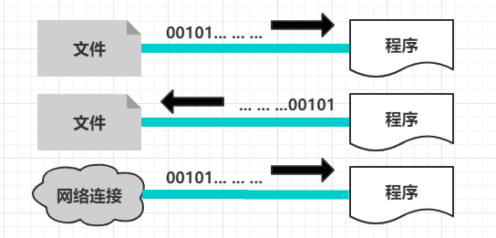
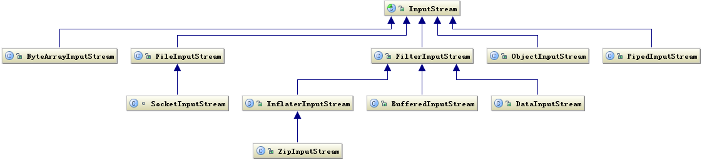
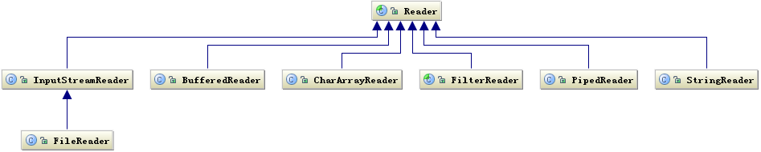
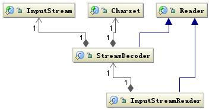
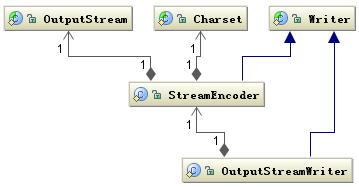
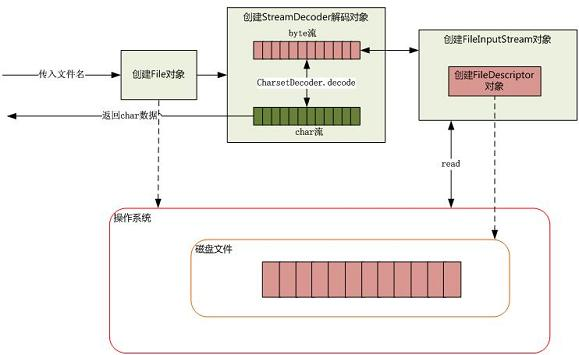
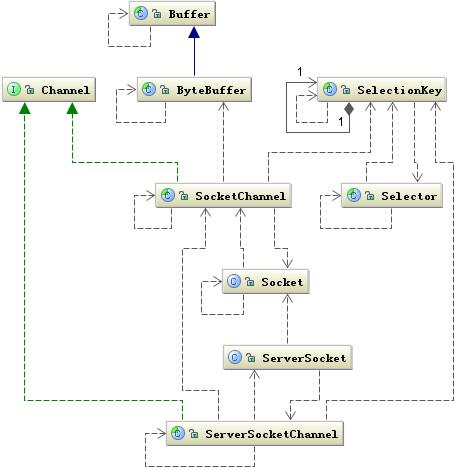

<!--ts-->
   * [1. 什么是 I/O?](#1-什么是-io)
   * [2. 简单理解Java 流（Stream）](#2-简单理解java-流stream)
   * [3. Java中的 I/O 类库的基本架构](#3-java中的-io-类库的基本架构)
      * [3.1 基于字节的 I/O 操作接口](#31-基于字节的-io-操作接口)
      * [3.2基于字符的 I/O 操作接口](#32基于字符的-io-操作接口)
      * [3.3 字节与字符的转化接口](#33-字节与字符的转化接口)
      * [3.4 如何选择I/O流](#34-如何选择io流)
   * [4. 磁盘 I/O 的工作机制](#4-磁盘-io-的工作机制)
      * [4.1 几种访问文件的方式](#41-几种访问文件的方式)
         * [4.1.1. 标准访问文件的方式](#411-标准访问文件的方式)
         * [4.1.2 .直接 I/O 方式](#412-直接-io-方式)
         * [4.1.3 .内存映射的方式](#413-内存映射的方式)
         * [4.1.4 同步和异步访问文件的方式](#414-同步和异步访问文件的方式)
      * [4.2 Java 访问磁盘文件](#42-java-访问磁盘文件)
      * [4.2  Java 序列化技术](#42--java-序列化技术)
         * [4.2.1 一个实际的序列化例子](#421-一个实际的序列化例子)
         * [4.2.2 serialVersionUID的作用](#422-serialversionuid的作用)
         * [4.2.3 序列化用来干什么？](#423-序列化用来干什么)
         * [4.2.4 关于序列化的一些细节](#424-关于序列化的一些细节)
   * [5. 网络 I/O 工作机制](#5-网络-io-工作机制)
      * [5.1 Java Socket 的工作机制](#51-java-socket-的工作机制)
         * [5.1.1 建立通信链路](#511-建立通信链路)
         * [5.1.2 数据传输](#512-数据传输)
      * [5.2 NIO 的工作方式](#52-nio-的工作方式)
         * [5.2.1 BIO 带来的挑战](#521-bio-带来的挑战)
         * [5.2.2 NIO 的工作机制](#522-nio-的工作机制)
         * [5.2.3 Buffer 的工作方式](#523-buffer-的工作方式)
         * [5.2.4 Java NIO 实例](#524-java-nio-实例)
         * [5.2.5 NIO 和 IO 的主要区别](#525-nio-和-io-的主要区别)
   * [6. BIO vs NIO vs AIO](#6-bio-vs-nio-vs-aio)
      * [6.1 什么是I/O?](#61-什么是io)
      * [6.2 BIO（Blocking I/O）同步阻塞I/O](#62-bioblocking-io同步阻塞io)
      * [6.3 NIO (New I/O) 同步非阻塞I/O](#63-nio-new-io-同步非阻塞io)
      * [6.4 AIO (Asynchronous I/O) 异步非阻塞I/O](#64-aio-asynchronous-io-异步非阻塞io)
      * [6.5 场景](#65-场景)
      * [6.6 使用方式](#66-使用方式)
      * [6.7 总结](#67-总结)
   * [7. 五种IO模型](#7-五种io模型)
      * [7.1 同步 vs 异步](#71-同步-vs-异步)
      * [7.2 同步，异步 和 阻塞，非阻塞之间的区别](#72-同步异步-和-阻塞非阻塞之间的区别)
      * [7.3 阻塞式IO模型](#73-阻塞式io模型)
      * [7.4 非阻塞IO模型](#74-非阻塞io模型)
      * [7.5 IO复用模型](#75-io复用模型)
      * [7.6 信号驱动IO模型](#76-信号驱动io模型)
      * [7.7 异步IO模型](#77-异步io模型)

<!-- Added by: anapodoton, at: Sun Mar  1 21:41:55 CST 2020 -->

<!--te-->

https://www.cnblogs.com/wmyskxz/p/9485251.html

# 1. 什么是 I/O?

学习过计算机相关课程的童鞋应该都知道，I/O 即输入Input/ 输出Output的缩写，最容易让人联想到的就是屏幕这样的输出设备以及键盘鼠标这一类的输入设备，**其广义上的定义就是：数据在内部存储器和外部存储器或其他周边设备之间的输入和输出；**

我们可以从定义上看到问题的核心就是：**数据/ 输入/ 输出**，在Java中，主要就是涉及到磁盘 I/O 和网络 I/O 两种了。

> 什么是比特？什么是字节？什么是字符？它们长度是多少？各有什么区别？

Bit最小的二进制单位 ，是计算机的操作部分。取值0或者1

Byte（字节）是计算机操作数据的最小单位由8位bit组成 取值（-128-127）

Char（字符）是用户的可读写的最小单位，在Java里面由16位bit组成 取值（0-65535）

# 2. 简单理解Java 流（Stream）

**数据流是一组有序，有起点和终点的字节的数据序列。包括输入流和输出流。**

通常我们说 I/O 都会涉及到诸如输入流、输出流这样的概念，那么什么是流呢？流是一个抽象但形象的概念，你可以简单理解成**一个数据的序列**，输入流表示从一个源读取数据，输出流则表示向一个目标写数据，在Java程序中，对于数据的输入和输出都是采用 “流” 这样的方式进行的，其设备可以是文件、网络、内存等；



流具有方向性，至于是输入流还是输出流则是一个相对的概念，**一般以程序为参考**，**如果数据的流向是程序至设备，我们成为输出流，反之我们称为输入流。**

可以将流想象成一个“水流管道”，水流就在这管道中形成了，自然就出现了方向的概念。


**“流”，代表了任何有能力产出数据的数据源对象或有能力接受数据的接收端对象，它屏蔽了实际的 I/O 设备中处理数据的细节——摘自《Think in Java》**

> 什么是流？Java IO中包含哪几种流，之间的关系是怎样的？ 字节流和字符流的区别。 什么是输入流和输出流，如何区分？ 字节流和字符流之间如何相互转换。

**字节流**

操作byte类型数据，主要操作类是OutputStream、InputStream的子类；不用缓冲区，直接对文件本身操作。

**字符流**

操作字符类型数据，主要操作类是Reader、Writer的子类；使用缓冲区缓冲字符，不关闭流就不会输出任何内容。

**互相转换**

整个IO包实际上分为字节流和字符流，但是除了这两个流之外，还存在一组字节流-字符流的转换类。

OutputStreamWriter：是Writer的子类，将输出的字符流变为字节流，即将一个字符流的输出对象变为字节流输出对象。

InputStreamReader：是Reader的子类，将输入的字节流变为字符流，即将一个字节流的输入对象变为字符流的输入对象。

# 3. Java中的 I/O 类库的基本架构

I/O 问题是任何编程语言都无法回避的问题，因为 I/O 操作是人机交互的核心，是机器获取和交换信息的主要渠道，所以如何设计 I/O 系统变成了一大难题，特别是在当今大流量大数据的时代，I/O 问题尤其突出，很容易称为一个性能的瓶颈，也正因为如此，在 I/O 库上也一直在做持续的优化，例如JDK1.4引入的 NIO，JDK1.7引入的 NIO 2.0，都一定程度上的提升了 I/O 的性能；

Java的 I/O 操作类在包 java.io下，有将近80个类，这些类大概可以分成如下 4 组：

- 基于字节操作的 I/O 接口：InputStream 和 OutputStream；
- 基于字符操作的 I/O 接口：Writer 和 Reader；
- 基于磁盘操作的 I/O 接口：File；
- 基于网络操作的 I/O 接口：Socket；

前两组主要是传输数据的数据格式，后两组主要是传输数据的方式，虽然Socket类并不在java.io包下，但这里仍然把它们划分在了一起；**I/O 只是人机交互的一种手段，除了它们能够完成这个交互功能外，我们更多的应该是关注如何提高它的运行效率；**

## 3.1 基于字节的 I/O 操作接口

基于字节的 I/O 操作的接口输入和输出分别对应是 InputStream 和 OutputStream，InputStream 的类层次结构如下图：



输入流根据数据类型和操作方式又被划分成若干个子类，每个子类分别处理不同操作类型，OutputStream 输出流的类层次结构也是类似，如下图所示：


这里就不详细解释每个子类如何使用了，如果感兴趣可以自己去看一下JDK的源码，而且的话从类名也能大致看出一二该类是在处理怎样的一些东西..这里需要说明两点：

**1）操作数据的方式是可以组合使用的：**

例如：

```
OutputStream out = new BufferedOutputStream(new ObjectOutputStream(new FileOutputStream("fileName"))；
```

**2）必须要指定流最终写到什么地方：**

要么是写到磁盘，要么是写到网络中，但重点是你必须说明这一点，而且你会发现其实SocketOutputStream是属于FileOutputStream下的，也就是说写网络实际上也是写文件，只不过写网络还有一步需要处理，就是让底层的操作系统知道我这个数据是需要传送到其他地方而不是本地磁盘上的；

## 3.2基于字符的 I/O 操作接口

**不管是磁盘还是网络传输，最小的存储单元都是字节，**而不是字符，所以 I/O 操作的都是字节而不是字符，但是在我们日常的程序中操作的数据几乎都是字符，所以为了操作方便当然要提供一个可以直接写字符的 I/O 接口。而且从字符到字节必须经过编码转换，而这个编码又非常耗时，还经常出现乱码的问题，所以 I/O 的编码问题经常是让人头疼的问题，关于这个问题有一篇深度好文推荐一下：[《深入分析 Java 中的中文编码问题》](https://www.ibm.com/developerworks/cn/java/j-lo-chinesecoding/)

下图是写字符的 I/O 操作接口涉及到的类，Writer 类提供了一个抽象方法 write(char cbuf[], int off, int len) 由子类去实现：


读字符的操作接口也有类似的类结构，如下图所示：

读字符的操作接口中也是 int read(char cbuf[], int off, int len)，返回读到的 n 个字节数，**不管是 Writer 还是 Reader 类它们都只定义了读取或写入的数据字符的方式**，也就是怎么写或读，但是并没有规定数据要写到哪去，写到哪去就是我们后面要讨论的基于磁盘和网络的工作机制。

## 3.3 字节与字符的转化接口

另外数据持久化或网络传输都是以字节进行的，所以必须要有字符到字节或字节到字符的转化。字符到字节需要转化，其中读的转化过程如下图所示：



InputStreamReader 类是字节到字符的转化桥梁，InputStream 到 Reader 的过程要指定编码字符集，否则将采用操作系统默认字符集，很可能会出现乱码问题。StreamDecoder 正是完成字节到字符的解码的实现类。也就是当你用如下方式读取一个文件时：

```java
try { 
       StringBuffer str = new StringBuffer(); 
       char[] buf = new char[1024]; 
       FileReader f = new FileReader("file"); 
       while(f.read(buf)>0){ 
           str.append(buf); 
       } 
       str.toString(); 
} catch (IOException e) {}
```

FileReader 类就是按照上面的工作方式读取文件的，FileReader 是继承了 InputStreamReader 类，实际上是读取文件流，然后通过 StreamDecoder 解码成 char，只不过这里的解码字符集是默认字符集。

写入也是类似的过程如下图所示：



通过 OutputStreamWriter 类完成，字符到字节的编码过程，由 StreamEncoder 完成编码过程。

## 3.4 如何选择I/O流

1. 确定是输入还是输出
   输入:输入流 InputStream Reader
   输出:输出流 OutputStream Writer
2. 明确操作的数据对象是否是纯文本
   是:字符流 Reader，Writer
   否:字节流 InputStream，OutputStream
3. 明确具体的设备。
   - 文件：
     读：FileInputStream,, FileReader,
     写：FileOutputStream，FileWriter
   - 数组：
     byte[ ]：ByteArrayInputStream, ByteArrayOutputStream
     char[ ]：CharArrayReader, CharArrayWriter
   - String：
     StringBufferInputStream(已过时，因为其只能用于String的每个字符都是8位的字符串), StringReader, StringWriter
   - Socket流
     键盘：用System.in（是一个InputStream对象）读取，用System.out（是一个OutoutStream对象）打印
4. 是否需要转换流
   是，就使用转换流，从Stream转化为Reader、Writer：InputStreamReader，OutputStreamWriter
5. 是否需要缓冲提高效率
   是就加上Buffered：BufferedInputStream, BufferedOuputStream, BufferedReader, BufferedWriter
6. 是否需要格式化输出

# 4. 磁盘 I/O 的工作机制

在介绍 Java 读取和写入磁盘文件之前，先来看看应用程序访问文件有哪几种方式；

## 4.1 几种访问文件的方式

我们知道，**读取和写入文件 I/O 操作都调用的是操作系统提供给我们的接口**，因为磁盘设备是归操作系统管的，而只要是系统调用都可能存在内核空间地址和用户空间地址切换的问题，这是为了保证用户进程不能直接操作内核，保证内核的安全而设计的，现代的操作系统将虚拟空间划分成了内核空间和用户空间两部分并实现了隔离，但是这样虽然保证了内核程序运行的安全性，但是也必然存在数据可能需要从内核空间向用户用户空间复制的问题；

如果遇到非常耗时的操作，如磁盘 I/O，数据从磁盘复制到内核空间，然后又从内核空间复制到用户空间，将会非常耗时，**这时操作系统为了加速 I/O 访问，在内核空间使用缓存机制，**也就是将从磁盘读取的文件按照一定的组织方式进行缓存，入股用户程序访问的是同一段磁盘地址的空间数据，那么操作系统将从内核缓存中直接取出返回给用户程序，这样就可以减少 I/O 的响应时间；

### 4.1.1. 标准访问文件的方式


读取的方式是，当应用程序调用`read()`接口时：

- ①操作系统首先检查在**内核的高速缓存中是否存在需要的数据**，如果有，那么直接从缓存中返回；
- ②如果没有，则**从磁盘中读取，然后缓存在操作系统的缓存中；**

写入的方式是，当应用程序调用`write()`接口时：

- **从用户地址空间复制到内核地址空间的缓存中**，这时对用户程序来说写操作就已经完成了，至于什么时候在写到磁盘中由操作系统决定，除非显示地调用了 sync 同步命令；

### 4.1.2 .直接 I/O 方式


所谓的直接 I/O 的方式就是应用程序直接访问磁盘数据，而不经过操作系统内核数据缓冲区，**这样做的目的是减少一次从内核缓冲区到用户程序缓存的数据复制；**

这种访问文件的方式通常是在对数据的缓存管理由应用程序实现的数据库管理系统中，如在数据库管理系统中，系统明确地知道应该缓存哪些数据，应该失效哪些数据，还可以对一些热点数据做预加载，提前将热点数据加载到内存，可以加速数据的访问效率，而这些情况如果是交给操作系统进行缓存，那么操作系统将不知道哪些数据是热点数据，哪些是只会访问一次的数据，因为它只是简单的缓存最近一次从磁盘读取的数据而已；

但是直接 I/O 也有负面影响，如果访问的数据不再应用程序缓存之中，那么每次数据都会直接从磁盘进行加载，这种直接加载会非常缓慢，因此直接 I/O 通常与 异步 I/O 进行结合以达到更好的性能；

### 4.1.3 .内存映射的方式


内存映射是指将硬盘上文件的位置与进程逻辑地址空间中一块大小相同的区域一一对应，当要访问内存中一段数据时，转换为访问文件的某一段数据。**这种方式的目的同样是减少数据在用户空间和内核空间之间的拷贝操作。**当大量数据需要传输的时候，采用内存映射方式去访问文件会获得比较好的效率。

### 4.1.4 同步和异步访问文件的方式

另外还有两种方式，一种是数据的读取和写入都是同步操作的同步方式，另一种是是当访问数据的线程发出请求之后，线程会接着去处理其他事情，而不是阻塞等待的异步访问方式，但从笔者就《深入分析 Java Web技术内幕》一书中的内容来看，这两种方式更像是对标准访问方式的一个具体说明，是标准访问方式对应的两种不同处理方法，知道就好了...

## 4.2 Java 访问磁盘文件

我们知道数据在磁盘的唯一最小描述就是文件，也就是说上层应用程序只能通过文件来操作磁盘上的数据，文件也是操作系统和磁盘驱动器交互的一个最小单元。值得注意的是 Java 中通常的 File 并不代表一个真实存在的文件对象，当你通过指定一个路径描述符时，它就会返回一个代表这个路径相关联的一个虚拟对象，这个可能是一个真实存在的文件或者是一个包含多个文件的目录。为何要这样设计？因为大部分情况下，我们并不关心这个文件是否真的存在，而是关心这个文件到底如何操作。例如我们手机里通常存了几百个朋友的电话号码，但是我们通常关心的是我有没有这个朋友的电话号码，或者这个电话号码是什么，但是这个电话号码到底能不能打通，我们并不是时时刻刻都去检查，而只有在真正要给他打电话时才会看这个电话能不能用。也就是使用这个电话记录要比打这个电话的次数多很多。

何时真正会要检查一个文件存不存？就是在真正要读取这个文件时，例如 FileInputStream 类都是操作一个文件的接口，注意到在创建一个 FileInputStream 对象时，会创建一个 FileDescriptor 对象，其实这个对象就是真正代表一个存在的文件对象的描述，当我们在操作一个文件对象时可以通过 getFD() 方法获取真正操作的与底层操作系统关联的文件描述。例如可以调用 FileDescriptor.sync() 方法将操作系统缓存中的数据强制刷新到物理磁盘中。

下面以上文读取文件的程序为例，介绍下如何从磁盘读取一段文本字符。如下图所示：



当传入一个文件路径，将会根据这个路径创建一个 File 对象来标识这个文件，然后将会根据这个 File 对象创建真正读取文件的操作对象，这时将会真正创建一个关联真实存在的磁盘文件的文件描述符 FileDescriptor，通过这个对象可以直接控制这个磁盘文件。由于我们需要读取的是字符格式，所以需要 StreamDecoder 类将 byte 解码为 char 格式，至于如何从磁盘驱动器上读取一段数据，由操作系统帮我们完成。至于操作系统是如何将数据持久化到磁盘以及如何建立数据结构需要根据当前操作系统使用何种文件系统来回答，至于文件系统的相关细节可以参考另外的文章。

> 参考文章：[深入分析 Java I/O 的工作机制](https://www.ibm.com/developerworks/cn/java/j-lo-javaio/index.html)
> 关于这一part，我们只需要了解一下就可以，我也是直接复制就完事儿...

## 4.2  Java 序列化技术

**Java序列化就是将一个对象转化成一串二进制表示的字节数组，通过保存或转移这些字节数据来达到持久化的目的。**需要持久化，对象必须继承 `java.io.Serializable` 接口，或者将其转为字节数组，用于网络传输；

### 4.2.1 一个实际的序列化例子

**第一步：创建一个用于序列化的对象**

为了具体说明序列化在Java中是如何运作的，我们来写一个实际的例子，首先我们来写一个用于序列化的对象，然后实现上述的接口：

```
/**
 * 用于演示Java中序列化的工作流程...
 *
 * @author: @我没有三颗心脏
 * @create: 2018-08-15-下午 14:37
 */
public class People implements Serializable{

    public String name;
    public transient int age;

    public void sayHello() {
        System.out.println("Hello,My Name is " + name);
    }
}
```

注意：一个类的对象想要序列化成功，必须满足两个条件

- ①实现上述的接口；
- ②保证该类的所有属性必须都是可序列化的，如果不希望某个属性序列化（例如一些敏感信息），可以加上`transient`关键字；

**第二步：序列化对象**

如下的代码完成了实例化一个 People 对象并其序列化到D盘的根目录下的一个操作，这里呢按照 Java 的标准约定将文件的后缀写成 .ser 的样子，你也可以写成其他的...

```
People people = new People();
people.name = "我没有三颗心脏";
people.age = 21;

try {
    FileOutputStream fileOutputStream = new FileOutputStream("D:/people.ser");
    ObjectOutputStream out = new ObjectOutputStream(fileOutputStream);
    out.writeObject(people);
    out.close();
    fileOutputStream.close();
    System.out.println("Serialized data is saved in D:/");
} catch (IOException e) {
    e.printStackTrace();
}
```

**第三步：反序列化对象**

下面的程序完成了对刚才我们序列化的文件还原成一个People对象的过程，并获取了其中的参数，但是注意，由于我们希望 age 属性是短暂的加入了`transient`关键字， 所以我们无法获取到序列化时 People 的 age 属性：

```
People people = null;
try {
    FileInputStream fileIn = new FileInputStream("D:/people.ser");
    ObjectInputStream in = new ObjectInputStream(fileIn);
    people = (People) in.readObject();
    in.close();
    fileIn.close();
} catch (IOException i) {
    i.printStackTrace();
    return;
} catch (ClassNotFoundException c) {
    System.out.println("People class not found");
    c.printStackTrace();
    return;
}
System.out.println("Deserialized People...");
System.out.println("Name: " + people.name);
System.out.println("Age: " + people.age);
```

输出结果如下：

```
Deserialized People...
Name: 我没有三颗心脏
Age: 0
```

### 4.2.2 serialVersionUID的作用

上述的例子中我们完成了对一个 People 对象序列化和反序列化的过程，我们现在来做一点简单的修改，例如把age字段的`transient`关键字去掉：

```
public class People implements Serializable {

    public String name;
    public int age;

    public void sayHello() {
        System.out.println("Hello,My Name is " + name);
    }
}
```

然后我们再运行我们刚才反序列化的代码，会发现，这个时候程序竟然报错了，说是serialVersionUID不一致：

事实上，如果你经常看别人的代码的话，或许会有留意到诸如这样的代码：

```
private static final long serialVersionUID = 876323262645176354L;
```

就这一长串的东西也不知道是在干嘛的，但这其实**是为了保证序列化版本的兼容性，即在版本升级后序列化仍保持对象的唯一性；**我们通过上述的修改也感受到了其中的一二，**但是问题是：我们并没有在需要序列化的对象中写任何关于这个UID的代码呀？**

这是个有趣的问题，通常情况下，如果我们实现了序列化接口，但是没有自己显式的声明这个UID的话，那么JVM就会根据该类的类名、属性名、方法名等自己计算出一个独一无二的变量值，然后将这个变量值一同序列化到文件之中，而在反序列化的时候同样，会根据该类计算出一个独一无二的变量然后进行比较，不一致就会报错，但是我怀着强烈的好奇心去反编译了一下.class文件，并没有发现编译器写了UDI这一类的东西，我看《深入分析 Java Web 技术内幕》中说，实际上是写到了二进制文件里面了；

- **不显式声明的缺点：**一旦写好了某一个类，那么想要修改就不行了，所以我们最好自己显式的去声明；
- **显式声明的方式：**①使用默认的1L作用UID；②根据类名、接口名等生成一个64位的哈希字段，现在的编译器如IDEA、Eclipse都有这样的功能，大家感兴趣去了解下；

### 4.2.3 序列化用来干什么？

虽然我们上面的程序成功将一个对象序列化保存到磁盘，然后从磁盘还原，但是这样的功能到底可以应用在哪些场景？到底可以干一些什么样的事情呢？下面举一些在实际应用中的例子：

- Web服务器中保存Session对象，如Tomcat会在服务器关闭时把session序列化存储到一个名为session.ser的文件之中，这个过程称为session的钝化；
- 网络上传输对象，如分布式应用等；

### 4.2.4 关于序列化的一些细节

1.如果一个类没有实现Serializable接口，但是它的基类实现了，那么这个类也是可以序列化的；

2.相反，如果一个类实现了Serializable接口，但是它的父类没有实现，那么这个类还是可以序列化（Object是所有类的父类），但是序列化该子类对象，然后反序列化后输出父类定义的某变量的数值，会发现该变量数值与序列化时的数值不同（一般为null或者其他默认值），而且这个父类里面必须有无参的构造方法，不然子类反序列化的时候会报错。

> 了解到这里就可以了，更多的细节感兴趣的童鞋可以自行去搜索引擎搜索..

------

# 5. 网络 I/O 工作机制

数据从一台主机发送到网络中的另一台主机需要经过很多步骤，首先双方需要有沟通的意向，然后要有能够沟通的物理渠道（物理链路），其次，还要保障双方能够正常的进行交流，例如语言一致的问题、说话顺序的问题等等等；

## 5.1 Java Socket 的工作机制

看到有地方说：**网络 I/O 的实质其实就是对 Socket 的读取；**那Socket 这个概念没有对应到一个具体的实体，它是描述计算机之间完成相互通信一种抽象功能。打个比方，可以把 Socket 比作为两个城市之间的交通工具，有了它，就可以在城市之间来回穿梭了。交通工具有多种，每种交通工具也有相应的交通规则。Socket 也一样，也有多种。大部分情况下我们使用的都是基于 TCP/IP 的流套接字，它是一种稳定的通信协议。

下图是典型的基于 Socket 的通信的场景：


主机 A 的应用程序要能和主机 B 的应用程序通信，必须通过 Socket 建立连接，而建立 Socket 连接必须需要底层 TCP/IP 协议来建立 TCP 连接。建立 TCP 连接需要底层 IP 协议来寻址网络中的主机。我们知道网络层使用的 IP 协议可以帮助我们根据 IP 地址来找到目标主机，但是一台主机上可能运行着多个应用程序，如何才能与指定的应用程序通信就要通过 TCP 或 UPD 的地址也就是端口号来指定。这样就可以通过一个 Socket 实例唯一代表一个主机上的一个应用程序的通信链路了。

### 5.1.1 建立通信链路

当客户端要与服务端通信，客户端首先要创建一个 Socket 实例，操作系统将为这个 Socket 实例分配一个没有被使用的本地端口号，并创建一个包含本地和远程地址和端口号的套接字数据结构，这个数据结构将一直保存在系统中直到这个连接关闭。在创建 Socket 实例的构造函数正确返回之前，将要进行 **TCP 的三次握手协议**，TCP 握手协议完成后，Socket 实例对象将创建完成，否则将抛出 IOException 错误。

与之对应的服务端将创建一个 ServerSocket 实例，ServerSocket 创建比较简单只要指定的端口号没有被占用，一般实例创建都会成功，同时操作系统也会为 ServerSocket 实例创建一个底层数据结构，这个数据结构中包含指定监听的端口号和包含监听地址的通配符，通常情况下都是“*”即监听所有地址。之后当调用 accept() 方法时，将进入阻塞状态，等待客户端的请求。当一个新的请求到来时，将为这个连接创建一个新的套接字数据结构，该套接字数据的信息包含的地址和端口信息正是请求源地址和端口。这个新创建的数据结构将会关联到 ServerSocket 实例的一个未完成的连接数据结构列表中，注意这时服务端与之对应的 Socket 实例并没有完成创建，而要等到与客户端的三次握手完成后，这个服务端的 Socket 实例才会返回，并将这个 Socket 实例对应的数据结构从未完成列表中移到已完成列表中。所以 ServerSocket 所关联的列表中每个数据结构，都代表与一个客户端的建立的 TCP 连接。

### 5.1.2 数据传输

传输数据是我们建立连接的主要目的，如何通过 Socket 传输数据，下面将详细介绍。

当连接已经建立成功，服务端和客户端都会拥有一个 Socket 实例，每个 Socket 实例都有一个 InputStream 和 OutputStream，正是通过这两个对象来交换数据。同时我们也知道网络 I/O 都是以字节流传输的。当 Socket 对象创建时，操作系统将会为 InputStream 和 OutputStream 分别分配一定大小的缓冲区，数据的写入和读取都是通过这个缓存区完成的。写入端将数据写到 OutputStream 对应的 SendQ 队列中，当队列填满时，数据将被发送到另一端 InputStream 的 RecvQ 队列中，如果这时 RecvQ 已经满了，那么 OutputStream 的 write 方法将会阻塞直到 RecvQ 队列有足够的空间容纳 SendQ 发送的数据。值得特别注意的是，这个缓存区的大小以及写入端的速度和读取端的速度非常影响这个连接的数据传输效率，由于可能会发生阻塞，所以网络 I/O 与磁盘 I/O 在数据的写入和读取还要有一个协调的过程，如果两边同时传送数据时可能会产生死锁，在后面 NIO 部分将介绍避免这种情况。

## 5.2 NIO 的工作方式

### 5.2.1 BIO 带来的挑战

BIO 即阻塞 I/O，不管是磁盘 I/O 还是网络 I/O，数据在写入 OutputStream 或者从 InputStream 读取时都有可能会阻塞。**一旦有线程阻塞将会失去 CPU 的使用权，这在当前的大规模访问量和有性能要求情况下是不能接受的。**虽然当前的网络 I/O 有一些解决办法，如一个客户端一个处理线程，出现阻塞时只是一个线程阻塞而不会影响其它线程工作，还有为了减少系统线程的开销，采用线程池的办法来减少线程创建和回收的成本，但是有一些使用场景仍然是无法解决的。**如当前一些需要大量 HTTP 长连接的情况**，像淘宝现在使用的 Web 旺旺项目，服务端需要同时保持几百万的 HTTP 连接，但是并不是每时每刻这些连接都在传输数据，这种情况下不可能同时创建这么多线程来保持连接。**即使线程的数量不是问题，仍然有一些问题还是无法避免的。**如这种情况，**我们想给某些客户端更高的服务优先级**，很难通过设计线程的优先级来完成，另外一种情况是，**我们需要让每个客户端的请求在服务端可能需要访问一些竞争资源，由于这些客户端是在不同线程中，因此需要同步，而往往要实现这些同步操作要远远比用单线程复杂很多。**以上这些情况都说明，我们需要另外一种新的 I/O 操作方式。

### 5.2.2 NIO 的工作机制

很多人都把NIO翻译成New IO，但我更觉得No-Block IO更接近它的本意，也就是非阻塞式IO，它虽然是非阻塞式的，但它是同步的，我们先看一下 NIO 涉及到的关联类图，如下：



**上图中有两个关键类：Channel 和 Selector**，它们是 NIO 中两个核心概念。我们还用前面的城市交通工具来继续比喻 NIO 的工作方式，这里的 Channel 要比 Socket 更加具体，它可以比作为某种具体的交通工具，如汽车或是高铁等，而 Selector 可以比作为一个车站的车辆运行调度系统，它将负责监控每辆车的当前运行状态：是已经出战还是在路上等等，也就是它可以轮询每个 Channel 的状态。**这里还有一个 Buffer 类**，它也比 Stream 更加具体化，我们可以将它比作为车上的座位，Channel 是汽车的话就是汽车上的座位，高铁上就是高铁上的座位，它始终是一个具体的概念，与 Stream 不同。Stream 只能代表是一个座位，至于是什么座位由你自己去想象，也就是你在去上车之前并不知道，这个车上是否还有没有座位了，也不知道上的是什么车，因为你并不能选择，这些信息都已经被封装在了运输工具（Socket）里面了，对你是透明的。

**NIO 引入了 Channel、Buffer 和 Selector 就是想把这些信息具体化，让程序员有机会控制它们**，如：当我们调用 write() 往 SendQ 写数据时，当一次写的数据超过 SendQ 长度是需要按照 SendQ 的长度进行分割，这个过程中需要有将用户空间数据和内核地址空间进行切换，而这个切换不是你可以控制的。而在 Buffer 中我们可以控制 Buffer 的 capacity，并且是否扩容以及如何扩容都可以控制。

理解了这些概念后我们看一下，实际上它们是如何工作的，下面是典型的一段 NIO 代码：

```
public void selector() throws IOException {
        ByteBuffer buffer = ByteBuffer.allocate(1024);
        Selector selector = Selector.open();
        ServerSocketChannel ssc = ServerSocketChannel.open();
        ssc.configureBlocking(false);//设置为非阻塞方式
        ssc.socket().bind(new InetSocketAddress(8080));
        ssc.register(selector, SelectionKey.OP_ACCEPT);//注册监听的事件
        while (true) {
            Set selectedKeys = selector.selectedKeys();//取得所有key集合
            Iterator it = selectedKeys.iterator();
            while (it.hasNext()) {
                SelectionKey key = (SelectionKey) it.next();
                if ((key.readyOps() & SelectionKey.OP_ACCEPT) == SelectionKey.OP_ACCEPT) {
                    ServerSocketChannel ssChannel = (ServerSocketChannel) key.channel();
                 SocketChannel sc = ssChannel.accept();//接受到服务端的请求
                    sc.configureBlocking(false);
                    sc.register(selector, SelectionKey.OP_READ);
                    it.remove();
                } else if 
                ((key.readyOps() & SelectionKey.OP_READ) == SelectionKey.OP_READ) {
                    SocketChannel sc = (SocketChannel) key.channel();
                    while (true) {
                        buffer.clear();
                        int n = sc.read(buffer);//读取数据
                        if (n <= 0) {
                            break;
                        }
                        buffer.flip();
                    }
                    it.remove();
                }
            }
        }
}
```

调用 Selector 的静态工厂创建一个选择器，创建一个服务端的 Channel 绑定到一个 Socket 对象，并把这个通信信道注册到选择器上，把这个通信信道设置为非阻塞模式。然后就可以调用 Selector 的 selectedKeys 方法来检查已经注册在这个选择器上的所有通信信道是否有需要的事件发生，如果有某个事件发生时，将会返回所有的 SelectionKey，通过这个对象 Channel 方法就可以取得这个通信信道对象从而可以读取通信的数据，而这里读取的数据是 Buffer，这个 Buffer 是我们可以控制的缓冲器。

在上面的这段程序中，是将 Server 端的监听连接请求的事件和处理请求的事件放在一个线程中，但是在实际应用中，我们通常会把它们放在两个线程中，**一个线程专门负责监听客户端的连接请求，而且是阻塞方式执行的；另外一个线程专门来处理请求，这个专门处理请求的线程才会真正采用 NIO 的方式**，像 Web 服务器 Tomcat 和 Jetty 都是这个处理方式，关于 Tomcat 和 Jetty 的 NIO 处理方式可以参考文章《 Jetty 的工作原理和与 Tomcat 的比较》。

下图是描述了基于 NIO 工作方式的 Socket 请求的处理过程：


上图中的 Selector 可以同时监听一组通信信道（Channel）上的 I/O 状态，前提是这个 Selector 要已经注册到这些通信信道中。选择器 Selector 可以调用 select() 方法检查已经注册的通信信道上的是否有 I/O 已经准备好，如果没有至少一个信道 I/O 状态有变化，那么 select 方法会阻塞等待或在超时时间后会返回 0。上图中如果有多个信道有数据，那么将会将这些数据分配到对应的数据 Buffer 中。所以关键的地方是有一个线程来处理所有连接的数据交互，每个连接的数据交互都不是阻塞方式，所以可以同时处理大量的连接请求。

### 5.2.3 Buffer 的工作方式

上面介绍了 Selector 将检测到有通信信道 I/O 有数据传输时，通过 selelct() 取得 SocketChannel，将数据读取或写入 Buffer 缓冲区。下面讨论一下 Buffer 如何接受和写出数据？

Buffer 可以简单的理解为一组基本数据类型的元素列表，它通过几个变量来保存这个数据的当前位置状态，也就是有四个索引。如下表所示：

| 索引     | 说明                                                    |
| -------- | ------------------------------------------------------- |
| capacity | 缓冲区数组的总长度                                      |
| position | 下一个要操作的数据元素的位置                            |
| limit    | 缓冲区数组中不可操作的下一个元素的位置，limit<=capacity |
| mark     | 用于记录当前 position 的前一个位置或者默认是 0          |

在实际操作数据时它们有如下关系图：


我们通过 ByteBuffer.allocate(11) 方法创建一个 11 个 byte 的数组缓冲区，初始状态如上图所示，position 的位置为 0，capacity 和 limit 默认都是数组长度。当我们写入 5 个字节时位置变化如下图所示：


这时底层操作系统就可以从缓冲区中正确读取这 5 个字节数据发送出去了。在下一次写数据之前我们在调一下 clear() 方法。缓冲区的索引状态又回到初始位置。

这里还要说明一下 mark，当我们调用 mark() 时，它将记录当前 position 的前一个位置，当我们调用 reset 时，position 将恢复 mark 记录下来的值。

还有一点需要说明，通过 Channel 获取的 I/O 数据首先要经过操作系统的 Socket 缓冲区再将数据复制到 Buffer 中，这个的操作系统缓冲区就是底层的 TCP 协议关联的 RecvQ 或者 SendQ 队列，从操作系统缓冲区到用户缓冲区复制数据比较耗性能，Buffer 提供了另外一种直接操作操作系统缓冲区的的方式即 ByteBuffer.allocateDirector(size)，这个方法返回的 byteBuffer 就是与底层存储空间关联的缓冲区，它的操作方式与 linux2.4 内核的 sendfile 操作方式类似。

### 5.2.4 Java NIO 实例

上面从 NIO 中引入了一些概念，下面我们对这些概念再来进行简单的复述和补充：

- **缓冲区Buffer：**缓冲区是一个对象，里面存的是数据，NIO进行通讯，传递的数据，都包装到Buffer中，Buffer是一个抽象类。子类有ByteBuffer、CharBuffer等，常用的是字节缓冲区，也就是ByteBuffer；
- **通道Channel：**channel是一个通道，通道就是通流某种物质的管道，在这里就是通流数据，他和流的不同之处就在于，流是单向的，只能向一个方向流动，而通道是一个管道，有两端，是双向的，可以进行读操作，也可以写操作，或者两者同时进行；
- **多路复用器Selector：**多路复用器是一个大管家，他管理着通道，通道把自己注册到Selector上面，Selector会**轮询**注册到自己的管道，通过判断这个管道的不同的状态，来进行相应的操作；

**NIO 工作机制的核心思想就是：**客户端和服务器端都是使用的通道，通道具有事件，可以将事件注册到多路复选器上，事件有就绪和非就绪两种状态，就绪的状态会放到多路复选器的就绪键的集合中，起一个线程不断地去轮询就绪的状态，根据不同的状态做不同的处理

> 参考资料：https://wangjingxin.top/2017/01/17/io/

### 5.2.5 NIO 和 IO 的主要区别

1. **面向流与面向缓冲.**
   Java NIO和IO之间第一个最大的区别是，IO是面向流的，NIO是面向缓冲区的。Java IO面向流意味着每次从流中读一个或多个字节，直至读取所有字节，它们没有被缓存在任何地方。此外，它不能前后移动流中的数据。如果需要前后移动从流中读取的数据，需要先将它缓存到一个缓冲区。 Java NIO的缓冲导向方法略有不同。数据读取到一个它稍后处理的缓冲区，需要时可在缓冲区中前后移动。这就增加了处理过程中的灵活性。
2. **阻塞与非阻塞IO**
   Java IO的各种流是阻塞的。这意味着，当一个线程调用read() 或 write()时，该线程被阻塞，直到有一些数据被读取，或数据完全写入。该线程在此期间不能再干任何事情了。 Java NIO的非阻塞模式，使一个线程从某通道发送请求读取数据，但是它仅能得到目前可用的数据，如果目前没有数据可用时，该线程可以继续做其他的事情。 非阻塞写也是如此。一个线程请求写入一些数据到某通道，但不需要等待它完全写入，这个线程同时可以去做别的事情。线程通常将非阻塞IO的空闲时间用于在其它通道上执行IO操作，所以一个单独的线程现在可以管理多个输入和输出通道（channel）。
3. **选择器（Selectors）**
   Java NIO的选择器允许一个单独的线程来监视多个输入通道，你可以注册多个通道使用一个选择器，然后使用一个单独的线程来“选择”通道：这些通道里已经有可以处理的输入，或者选择已准备写入的通道。这种选择机制，使得一个单独的线程很容易来管理多个通道。

------

# 6. BIO vs NIO vs AIO

## 6.1 什么是I/O?

在计算机系统中I/O就是输入（Input）和输出(Output)的意思，针对不同的操作对象，可以划分为**磁盘I/O模型，网络I/O模型，内存映射I/O, Direct I/O、数据库I/O**等，只要具有输入输出类型的交互系统都可以认为是I/O系统，也可以说I/O是整个操作系统数据交换与人机交互的通道，这个概念与选用的开发语言没有关系，是一个通用的概念。

在如今的系统中I/O却拥有很重要的位置，现在系统都有可能处理大量文件，大量数据库操作，而这些操作都依赖于系统的I/O性能，也就造成了现在系统的瓶颈往往都是由于I/O性能造成的。因此，为了解决磁盘I/O性能慢的问题，系统架构中添加了缓存来提高响应速度；或者有些高端服务器从硬件级入手，使用了固态硬盘（SSD）来替换传统机械硬盘；在大数据方面，Spark越来越多的承担了实时性计算任务，而传统的Hadoop体系则大多应用在了离线计算与大量数据存储的场景，这也是由于磁盘I/O性能远不如内存I/O性能而造成的格局（Spark更多的使用了内存，而MapReduece更多的使用了磁盘）。因此，一个系统的优化空间，往往都在低效率的I/O环节上，很少看到一个系统CPU、内存的性能是其整个系统的瓶颈。也正因为如此，Java在I/O上也一直在做持续的优化，从JDK 1.4开始便引入了NIO模型，大大的提高了以往BIO模型下的操作效率。

这里先给出BIO、NIO、AIO的基本定义与类比描述：

- **BIO （Blocking I/O）：同步阻塞I/O模式**，数据的读取写入必须阻塞在一个线程内等待其完成。这里使用那个经典的烧开水例子，这里假设一个烧开水的场景，有一排水壶在烧开水，BIO的工作模式就是， 叫一个线程停留在一个水壶那，直到这个水壶烧开，才去处理下一个水壶。但是实际上线程在等待水壶烧开的时间段什么都没有做。
- NIO （New I/O）：同时支持阻塞与非阻塞模式，但这里我们以其同步非阻塞I/O模式来说明，那么什么叫做同步非阻塞？如果还拿烧开水来说，NIO的做法是叫一个线程不断的轮询每个水壶的状态，看看是否有水壶的状态发生了改变，从而进行下一步的操作。（线程未挂起）

- AIO （ Asynchronous I/O）：异步非阻塞I/O模型。**异步非阻塞与同步非阻塞的区别在哪里？异步非阻塞无需一个线程去轮询所有IO操作的状态改变，在相应的状态改变后，系统会通知对应的线程来处理。**对应到烧开水中就是，为每个水壶上面装了一个开关，水烧开之后，水壶会自动通知我水烧开了。

进程中的IO调用步骤大致可以分为以下四步： 

1. 进程向操作系统请求数据 ;
2. 操作系统把外部数据加载到内核的缓冲区中; 
3. 操作系统把内核的缓冲区拷贝到进程的缓冲区 ;
4. 进程获得数据完成自己的功能 ;

当操作系统在把外部数据放到进程缓冲区的这段时间（即上述的第二，三步），如果应用进程是挂起等待的，那么就是同步IO，反之，就是异步IO，也就是AIO 。

## 6.2 BIO（Blocking I/O）同步阻塞I/O

这是最基本与简单的I/O操作方式，其根本特性是做完一件事再去做另一件事，一件事一定要等前一件事做完，这很符合程序员传统的顺序来开发思想，因此BIO模型程序开发起来较为简单，易于把握。

但是BIO如果需要同时做很多事情（例如同时读很多文件，处理很多tcp请求等），就需要系统创建很多线程来完成对应的工作，因为BIO模型下一个线程同时只能做一个工作，如果线程在执行过程中依赖于需要等待的资源，那么该线程会长期处于阻塞状态，我们知道在整个操作系统中，线程是系统执行的基本单位，在BIO模型下的线程 阻塞就会导致系统线程的切换，从而对整个系统性能造成一定的影响。当然如果我们只需要创建少量可控的线程，那么采用BIO模型也是很好的选择，但如果在需要考虑高并发的web或者tcp服务器中采用BIO模型就无法应对了，如果系统开辟成千上万的线程，那么CPU的执行时机都会浪费在线程的切换中，使得线程的执行效率大大降低。此外，关于线程这里说一句题外话，在系统开发中线程的生命周期一定要准确控制，在需要一定规模并发的情形下，尽量使用线程池来确保线程创建数目在一个合理的范围之内，切莫编写线程数量创建上限的代码。

## 6.3 NIO (New I/O) 同步非阻塞I/O

关于NIO，国内有很多技术博客将英文翻译成No-Blocking I/O，非阻塞I/O模型 ，当然这样就与BIO形成了鲜明的特性对比。NIO本身是基于事件驱动的思想来实现的，其目的就是解决BIO的大并发问题，在BIO模型中，如果需要并发处理多个I/O请求，那就需要多线程来支持，NIO使用了多路复用器机制，以socket使用来说，多路复用器通过不断轮询各个连接的状态，只有在socket有流可读或者可写时，应用程序才需要去处理它，在线程的使用上，就不需要一个连接就必须使用一个处理线程了，而是只是有效请求时（确实需要进行I/O处理时），才会使用一个线程去处理，这样就避免了BIO模型下大量线程处于阻塞等待状态的情景。

相对于BIO的流，NIO抽象出了新的通道（Channel）作为输入输出的通道，并且提供了缓存（Buffer）的支持，在进行读操作时，需要使用Buffer分配空间，然后将数据从Channel中读入Buffer中，对于Channel的写操作，也需要现将数据写入Buffer，然后将Buffer写入Channel中。

如下是NIO方式进行文件拷贝操作的示例，见下图：

通过比较New IO的使用方式我们可以发现，新的IO操作不再面向 Stream来进行操作了，改为了通道Channel，并且使用了更加灵活的缓存区类Buffer，Buffer只是缓存区定义接口， 根据需要，我们可以选择对应类型的缓存区实现类。在java NIO编程中，我们需要理解以下3个对象Channel、Buffer和Selector。

- **Channel**

首先说一下Channel，国内大多翻译成“通道”。Channel和IO中的Stream(流)是差不多一个等级的。只不过Stream是单向的，譬如：InputStream, OutputStream。而Channel是双向的，既可以用来进行读操作，又可以用来进行写操作，NIO中的Channel的主要实现有：FileChannel、DatagramChannel、SocketChannel、ServerSocketChannel；通过看名字就可以猜出个所以然来：分别可以对应文件IO、UDP和TCP（Server和Client）。

- **Buffer**

NIO中的关键Buffer实现有：ByteBuffer、CharBuffer、DoubleBuffer、 FloatBuffer、IntBuffer、 LongBuffer,、ShortBuffer，分别对应基本数据类型: byte、char、double、 float、int、 long、 short。当然NIO中还有MappedByteBuffer, HeapByteBuffer, DirectByteBuffer等这里先不具体陈述其用法细节。

说一下 DirectByteBuffer 与 HeapByteBuffer 的区别？

它们 ByteBuffer 分配内存的两种方式。HeapByteBuffer 顾名思义其内存空间在 JVM 的 heap（堆）上分配，可以看做是 jdk 对于 byte[] 数组的封装；而 DirectByteBuffer 则直接利用了系统接口进行内存申请，其内存分配在c heap 中，这样就减少了内存之间的拷贝操作，如此一来，在使用 DirectByteBuffer 时，系统就可以直接从内存将数据写入到 Channel 中，而无需进行 Java 堆的内存申请，复制等操作，提高了性能。既然如此，为什么不直接使用 DirectByteBuffer，还要来个 HeapByteBuffer？原因在于， DirectByteBuffer 是通过full gc来回收内存的，DirectByteBuffer会自己检测情况而调用 system.gc()，但是如果参数中使用了 DisableExplicitGC 那么就无法回收该快内存了，-XX:+DisableExplicitGC标志自动将 System.gc() 调用转换成一个空操作，就是应用中调用 System.gc() 会变成一个空操作，那么如果设置了就需要我们手动来回收内存了，所以DirectByteBuffer使用起来相对于完全托管于 java 内存管理的Heap ByteBuffer 来说更复杂一些，如果用不好可能会引起OOM。Direct ByteBuffer 的内存大小受 -XX:MaxDirectMemorySize JVM 参数控制（默认大小64M），在 DirectByteBuffer 申请内存空间达到该设置大小后，会触发 Full GC。

- **Selector**

Selector 是NIO相对于BIO实现多路复用的基础，Selector 运行单线程处理多个 Channel，如果你的应用打开了多个通道，但每个连接的流量都很低，使用 Selector 就会很方便。例如在一个聊天服务器中。要使用 Selector , 得向 Selector 注册 Channel，然后调用它的 select() 方法。这个方法会一直阻塞到某个注册的通道有事件就绪。一旦这个方法返回，线程就可以处理这些事件，事件的例子有如新的连接进来、数据接收等。

这里我们再来看一个NIO模型下的TCP服务器的实现，我们可以看到Selector 正是NIO模型下 TCP Server 实现IO复用的关键，请仔细理解下段代码while循环中的逻辑，见下图：

## 6.4 AIO (Asynchronous I/O) 异步非阻塞I/O

Java AIO就是Java作为对异步IO提供支持的NIO.2 ，Java NIO2 (JSR 203)定义了更多的 New I/O APIs， 提案2003提出，直到2011年才发布， 最终在JDK 7中才实现。JSR 203除了提供更多的文件系统操作API(包括可插拔的自定义的文件系统)， 还提供了对socket和文件的异步 I/O操作。 同时实现了JSR-51提案中的socket channel全部功能,包括对绑定， option配置的支持以及多播multicast的实现。

从编程模式上来看AIO相对于NIO的区别在于，NIO需要使用者线程不停的轮询IO对象，来确定是否有数据准备好可以读了，而AIO则是在数据准备好之后，才会通知数据使用者，这样使用者就不需要不停地轮询了。当然AIO的异步特性并不是Java实现的伪异步，而是使用了系统底层API的支持，在Unix系统下，采用了epoll IO模型，而windows便是使用了IOCP模型。关于Java AIO，本篇只做一个抛砖引玉的介绍，如果你在实际工作中用到了，那么可以参考Netty在高并发下使用AIO的相关技术。

## 6.5 场景

- **BIO方式适用于连接数目比较小且固定的架构**，这种方式对服务器资源要求比较高，并发局限于应用中，JDK1.4以前的唯一选择，但程序直观简单易理解。
- **NIO方式适用于连接数目多且连接比较短（轻操作）的架构**，比如聊天服务器，并发局限于应用中，编程比较复杂，JDK1.4开始支持。
- **AIO方式使用于连接数目多且连接比较长（重操作）的架构**，比如相册服务器，充分调用OS参与并发操作，编程比较复杂，JDK7开始支持。

## 6.6 使用方式

使用BIO实现文件的读取和写入。

```java
       //Initializes The Object
        User1 user = new User1();
        user.setName("hollis");
        user.setAge(23);
        System.out.println(user);

        //Write Obj to File
        ObjectOutputStream oos = null;
        try {
            oos = new ObjectOutputStream(new FileOutputStream("tempFile"));
            oos.writeObject(user);
        } catch (IOException e) {
            e.printStackTrace();
        } finally {
            IOUtils.closeQuietly(oos);
        }

        //Read Obj from File
        File file = new File("tempFile");
        ObjectInputStream ois = null;
        try {
            ois = new ObjectInputStream(new FileInputStream(file));
            User1 newUser = (User1) ois.readObject();
            System.out.println(newUser);
        } catch (IOException e) {
            e.printStackTrace();
        } catch (ClassNotFoundException e) {
            e.printStackTrace();
        } finally {
            IOUtils.closeQuietly(ois);
            try {
                FileUtils.forceDelete(file);
            } catch (IOException e) {
                e.printStackTrace();
            }
        }

       //Initializes The Object
        User1 user = new User1();
        user.setName("hollis");
        user.setAge(23);
        System.out.println(user);

        //Write Obj to File
        ObjectOutputStream oos = null;
        try {
            oos = new ObjectOutputStream(new FileOutputStream("tempFile"));
            oos.writeObject(user);
        } catch (IOException e) {
            e.printStackTrace();
        } finally {
            IOUtils.closeQuietly(oos);
        }

        //Read Obj from File
        File file = new File("tempFile");
        ObjectInputStream ois = null;
        try {
            ois = new ObjectInputStream(new FileInputStream(file));
            User1 newUser = (User1) ois.readObject();
            System.out.println(newUser);
        } catch (IOException e) {
            e.printStackTrace();
        } catch (ClassNotFoundException e) {
            e.printStackTrace();
        } finally {
            IOUtils.closeQuietly(ois);
            try {
                FileUtils.forceDelete(file);
            } catch (IOException e) {
                e.printStackTrace();
            }
        }
```

使用NIO实现文件的读取和写入。

```java
static void readNIO() {
		String pathname = "C:\\Users\\adew\\Desktop\\jd-gui.cfg";
		FileInputStream fin = null;
		try {
			fin = new FileInputStream(new File(pathname));
			FileChannel channel = fin.getChannel();

			int capacity = 100;// 字节
			ByteBuffer bf = ByteBuffer.allocate(capacity);
			System.out.println("限制是：" + bf.limit() + "容量是：" + bf.capacity()
					+ "位置是：" + bf.position());
			int length = -1;

			while ((length = channel.read(bf)) != -1) {

				/*
				 * 注意，读取后，将位置置为0，将limit置为容量, 以备下次读入到字节缓冲中，从0开始存储
				 */
				bf.clear();
				byte[] bytes = bf.array();
				System.out.write(bytes, 0, length);
				System.out.println();

				System.out.println("限制是：" + bf.limit() + "容量是：" + bf.capacity()
						+ "位置是：" + bf.position());

			}

			channel.close();

		} catch (FileNotFoundException e) {
			e.printStackTrace();
		} catch (IOException e) {
			e.printStackTrace();
		} finally {
			if (fin != null) {
				try {
					fin.close();
				} catch (IOException e) {
					e.printStackTrace();
				}
			}
		}
	}

	static void writeNIO() {
		String filename = "out.txt";
		FileOutputStream fos = null;
		try {

			fos = new FileOutputStream(new File(filename));
			FileChannel channel = fos.getChannel();
			ByteBuffer src = Charset.forName("utf8").encode("你好你好你好你好你好");
			// 字节缓冲的容量和limit会随着数据长度变化，不是固定不变的
			System.out.println("初始化容量和limit：" + src.capacity() + ","
					+ src.limit());
			int length = 0;

			while ((length = channel.write(src)) != 0) {
				/*
				 * 注意，这里不需要clear，将缓冲中的数据写入到通道中后 第二次接着上一次的顺序往下读
				 */
				System.out.println("写入长度:" + length);
			}

		} catch (FileNotFoundException e) {
			e.printStackTrace();
		} catch (IOException e) {
			e.printStackTrace();
		} finally {
			if (fos != null) {
				try {
					fos.close();
				} catch (IOException e) {
					e.printStackTrace();
				}
			}
		}
	}
```

使用AIO实现文件的读取和写入

```java
public class ReadFromFile {
  public static void main(String[] args) throws Exception {
    Path file = Paths.get("/usr/a.txt");
    AsynchronousFileChannel channel = AsynchronousFileChannel.open(file);

    ByteBuffer buffer = ByteBuffer.allocate(100_000);
    Future<Integer> result = channel.read(buffer, 0);

    while (!result.isDone()) {
      ProfitCalculator.calculateTax();
    }
    Integer bytesRead = result.get();
    System.out.println("Bytes read [" + bytesRead + "]");
  }
}
class ProfitCalculator {
  public ProfitCalculator() {
  }
  public static void calculateTax() {
  }
}

public class WriteToFile {

  public static void main(String[] args) throws Exception {
    AsynchronousFileChannel fileChannel = AsynchronousFileChannel.open(
        Paths.get("/asynchronous.txt"), StandardOpenOption.READ,
        StandardOpenOption.WRITE, StandardOpenOption.CREATE);
    CompletionHandler<Integer, Object> handler = new CompletionHandler<Integer, Object>() {

      @Override
      public void completed(Integer result, Object attachment) {
        System.out.println("Attachment: " + attachment + " " + result
            + " bytes written");
        System.out.println("CompletionHandler Thread ID: "
            + Thread.currentThread().getId());
      }

      @Override
      public void failed(Throwable e, Object attachment) {
        System.err.println("Attachment: " + attachment + " failed with:");
        e.printStackTrace();
      }
    };

    System.out.println("Main Thread ID: " + Thread.currentThread().getId());
    fileChannel.write(ByteBuffer.wrap("Sample".getBytes()), 0, "First Write",
        handler);
    fileChannel.write(ByteBuffer.wrap("Box".getBytes()), 0, "Second Write",
        handler);

  }
}
```

## 6.7 总结    

> IO实质上与线程没有太多的关系，但是不同的IO模型改变了应用程序使用线程的方式，NIO与AIO的出现解决了很多BIO无法解决的并发问题，当然任何技术抛开适用场景都是耍流氓，复杂的技术往往是为了解决简单技术无法解决的问题而设计的，在系统开发中能用常规技术解决的问题，绝不用复杂技术，否则大大增加系统代码的维护难度，学习IT技术不是为了炫技，而是要实实在在解决问题。


AIO就是异步非阻塞IO，A就是asynchronous的意思，因为NIO1.0虽然面向缓冲，利用多路复选器实现了同步非阻塞IO，可是在NIO1.0中需要使用一个线程不断去轮询就绪集合，开销也是比较大的，所以在jdk1.7中扩展了NIO，称之为NIO2.0，NIO2.0中引入了AIO，此外NIO2.0中还引入了异步文件通道，那么究竟是怎么实现异步的呢？

AIO 有三个特点，它的特点也可以说明它是如何完成异步这样的操作的：

- ①读完了再通知我；
- ②不会加快 I/O，只是在读完后进行通知；
- ③使用回调函数，进行业务处理；

**AIO 的核心原理就是：**对客户端和服务器端的各种操作进行回调函数的注册（通过实现一个CompletionHandler接口，其中定义了一个completed的成功操作方法和一个fail的失败方法）。在完成某个操作之后，就会自己去调用该注册到该操作的回调函数，达到异步的效果。

# 7. 五种IO模型

可以参考我的[博客](https://github.com/haojunsheng/NetworkLearning/blob/master/unix-network-socket-api.md#62-io%E6%A8%A1%E5%9E%8B)。

## 7.1 同步 vs 异步

阻塞与非阻塞描述的是调用者的

如A调用B：

如果是阻塞，A在发出调用后，要一直等待，等着B返回结果。

如果是非阻塞，A在发出调用后，不需要等待，可以去做自己的事情。

## 7.2 同步，异步 和 阻塞，非阻塞之间的区别

[同步、异步](https://github.com/hollischuang/toBeTopJavaer/blob/master/basics/java-basic/synchronized-vs-asynchronization.md)，是描述被调用方的。

阻塞，非阻塞，是描述调用方的。

同步不一定阻塞，异步也不一定非阻塞。没有必然关系。

举个简单的例子，老张烧水。 1 老张把水壶放到火上，一直在水壶旁等着水开。（同步阻塞） 2 老张把水壶放到火上，去客厅看电视，时不时去厨房看看水开没有。（同步非阻塞） 3 老张把响水壶放到火上，一直在水壶旁等着水开。（异步阻塞） 4 老张把响水壶放到火上，去客厅看电视，水壶响之前不再去看它了，响了再去拿壶。（异步非阻塞）

1和2的区别是，调用方在得到返回之前所做的事情不一行。 1和3的区别是，被调用方对于烧水的处理不一样。

## 7.3 阻塞式IO模型

最传统的一种IO模型，即在读写数据过程中会发生阻塞现象。

当用户线程发出IO请求之后，内核会去查看数据是否就绪，如果没有就绪就会等待数据就绪，而用户线程就会处于阻塞状态，用户线程交出CPU。当数据就绪之后，内核会将数据拷贝到用户线程，并返回结果给用户线程，用户线程才解除block状态。

典型的阻塞IO模型的例子为：

```
data = socket.read();
```

如果数据没有就绪，就会一直阻塞在read方法。

## 7.4 非阻塞IO模型

当用户线程发起一个read操作后，并不需要等待，而是马上就得到了一个结果。如果结果是一个error时，它就知道数据还没有准备好，于是它可以再次发送read操作。一旦内核中的数据准备好了，并且又再次收到了用户线程的请求，那么它马上就将数据拷贝到了用户线程，然后返回。

所以事实上，在非阻塞IO模型中，用户线程需要不断地询问内核数据是否就绪，也就说非阻塞IO不会交出CPU，而会一直占用CPU。

典型的非阻塞IO模型一般如下：

```
while(true){
    data = socket.read();
    if(data!= error){
        处理数据
        break;
    }
}
```

但是对于非阻塞IO就有一个非常严重的问题，在while循环中需要不断地去询问内核数据是否就绪，这样会导致CPU占用率非常高，因此一般情况下很少使用while循环这种方式来读取数据。

## 7.5 IO复用模型

多路复用IO模型是目前使用得比较多的模型。Java NIO实际上就是多路复用IO。

在多路复用IO模型中，会有一个线程不断去轮询多个socket的状态，只有当socket真正有读写事件时，才真正调用实际的IO读写操作。因为在多路复用IO模型中，只需要使用一个线程就可以管理多个socket，系统不需要建立新的进程或者线程，也不必维护这些线程和进程，并且只有在真正有socket读写事件进行时，才会使用IO资源，所以它大大减少了资源占用。

在Java NIO中，是通过selector.select()去查询每个通道是否有到达事件，如果没有事件，则一直阻塞在那里，因此这种方式会导致用户线程的阻塞。

也许有朋友会说，我可以采用 多线程+ 阻塞IO 达到类似的效果，但是由于在多线程 + 阻塞IO 中，每个socket对应一个线程，这样会造成很大的资源占用，并且尤其是对于长连接来说，线程的资源一直不会释放，如果后面陆续有很多连接的话，就会造成性能上的瓶颈。

而多路复用IO模式，通过一个线程就可以管理多个socket，只有当socket真正有读写事件发生才会占用资源来进行实际的读写操作。因此，多路复用IO比较适合连接数比较多的情况。

另外多路复用IO为何比非阻塞IO模型的效率高是因为在非阻塞IO中，不断地询问socket状态时通过用户线程去进行的，而在多路复用IO中，轮询每个socket状态是内核在进行的，这个效率要比用户线程要高的多。

不过要注意的是，多路复用IO模型是通过轮询的方式来检测是否有事件到达，并且对到达的事件逐一进行响应。因此对于多路复用IO模型来说，一旦事件响应体很大，那么就会导致后续的事件迟迟得不到处理，并且会影响新的事件轮询。

## 7.6 信号驱动IO模型

在信号驱动IO模型中，当用户线程发起一个IO请求操作，会给对应的socket注册一个信号函数，然后用户线程会继续执行，当内核数据就绪时会发送一个信号给用户线程，用户线程接收到信号之后，便在信号函数中调用IO读写操作来进行实际的IO请求操作。

## 7.7 异步IO模型

异步IO模型是比较理想的IO模型，在异步IO模型中，当用户线程发起read操作之后，立刻就可以开始去做其它的事。而另一方面，从内核的角度，当它受到一个asynchronous read之后，它会立刻返回，说明read请求已经成功发起了，因此不会对用户线程产生任何block。然后，内核会等待数据准备完成，然后将数据拷贝到用户线程，当这一切都完成之后，内核会给用户线程发送一个信号，告诉它read操作完成了。也就说用户线程完全不需要实际的整个IO操作是如何进行的，只需要先发起一个请求，当接收内核返回的成功信号时表示IO操作已经完成，可以直接去使用数据了。

也就说在异步IO模型中，IO操作的两个阶段都不会阻塞用户线程，这两个阶段都是由内核自动完成，然后发送一个信号告知用户线程操作已完成。用户线程中不需要再次调用IO函数进行具体的读写。这点是和信号驱动模型有所不同的，在信号驱动模型中，当用户线程接收到信号表示数据已经就绪，然后需要用户线程调用IO函数进行实际的读写操作；而在异步IO模型中，收到信号表示IO操作已经完成，不需要再在用户线程中调用iO函数进行实际的读写操作。

注意，异步IO是需要操作系统的底层支持，在Java 7中，提供了Asynchronous IO。

前面四种IO模型实际上都属于同步IO，只有最后一种是真正的异步IO，因为无论是多路复用IO还是信号驱动模型，IO操作的第2个阶段都会引起用户线程阻塞，也就是内核进行数据拷贝的过程都会让用户线程阻塞。
