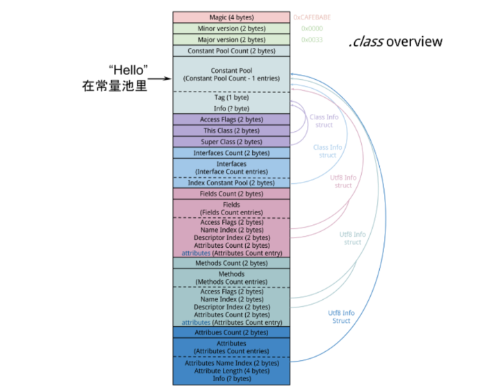
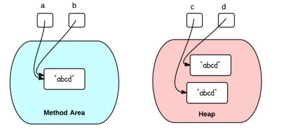

<!--ts-->

   * [前言](#前言)
   * [1. String的源码相关](#1-string的源码相关)
      * [Class文件常量池，运行时常量池和字符串常量池的区别](#class文件常量池运行时常量池和字符串常量池的区别)
   * [2. <a href="http://www.hollischuang.com/archives/2517" rel="nofollow">我终于搞清楚了和String有关的那点事儿</a>](#2-我终于搞清楚了和string有关的那点事儿)
      * [2.1 字面量和运行时常量池](#21-字面量和运行时常量池)
      * [2.2 new String创建了几个对象](#22-new-string创建了几个对象)
      * [2.3 运行时常量池的动态扩展](#23-运行时常量池的动态扩展)
      * [2.4 intern的正确用法](#24-intern的正确用法)
      * [2.5 总结](#25-总结)
   * [3. <a href="https://www.cnblogs.com/justcooooode/p/7603381.html" rel="nofollow">理解Java字符串常量池与intern()方法</a>](#3-理解java字符串常量池与intern方法)
      * [3.1 Java内存区域](#31-java内存区域)
      * [3.2 两种创建方式在内存中的区别](#32-两种创建方式在内存中的区别)
         * [解释开头的例子](#解释开头的例子)
      * [3.3 intern()方法](#33-intern方法)
      * [熟悉Java String的使用](#熟悉java-string的使用)
   * [4. <a href="https://www.hollischuang.com/archives/1230" rel="nofollow">三张图彻底了解Java中字符串的不变性</a>](#4-三张图彻底了解java中字符串的不变性)
      * [4.1 定义一个字符串](#41-定义一个字符串)
      * [4.2 使用变量来赋值变量](#42-使用变量来赋值变量)
      * [4.3 字符串连接](#43-字符串连接)
      * [4.4 总结](#44-总结)
   * [5. <a href="https://www.hollischuang.com/archives/1246" rel="nofollow">为什么Java要把字符串设计成不可变的</a>](#5-为什么java要把字符串设计成不可变的)
      * [5.1 字符串池](#51-字符串池)
      * [5.2 缓存Hashcode](#52-缓存hashcode)
      * [5.3 使其他类的使用更加便利](#53-使其他类的使用更加便利)
      * [5.4 安全性](#54-安全性)
      * [不可变对象天生就是线程安全的](#不可变对象天生就是线程安全的)
   * [6. <a href="https://www.hollischuang.com/archives/1249" rel="nofollow">该如何创建字符串，使用” “还是构造函数？</a>](#6-该如何创建字符串使用-还是构造函数)
      * [6.1 双引号 vs 构造函数](#61-双引号-vs-构造函数)
      * [6.2 运行时字符串驻留](#62-运行时字符串驻留)
      * [熟悉String的各种函数](#熟悉string的各种函数)
   * [7. <a href="https://www.hollischuang.com/archives/1232" rel="nofollow">三张图彻底了解JDK 6和JDK 7中substring的原理及区别</a>](#7-三张图彻底了解jdk-6和jdk-7中substring的原理及区别)
      * [7.1 substring() 的作用](#71-substring-的作用)
      * [调用substring()时发生了什么？](#调用substring时发生了什么)
      * [7.2 JDK 6中的substring](#72-jdk-6中的substring)
      * [7.3 JDK 6中的substring导致的问题](#73-jdk-6中的substring导致的问题)
      * [7.4 JDK 7 中的substring](#74-jdk-7-中的substring)
   * [8. <a href="https://www.hollischuang.com/archives/1261" rel="nofollow">深入分析Java中的length和length()</a>](#8-深入分析java中的length和length)
      * [8.1 为什么数组有length属性？](#81-为什么数组有length属性)
      * [8.2 Java中为什么没有定义一个类似String一样Array类](#82-java中为什么没有定义一个类似string一样array类)
      * [8.3 为什么String有length()方法？](#83-为什么string有length方法)
   * [9. <a href="https://www.hollischuang.com/archives/1290" rel="nofollow">Java中的equals()和hashcode()之间关系</a>](#9-java中的equals和hashcode之间关系)
      * [9.1 一个常犯的错误](#91-一个常犯的错误)
      * [9.2 hashcode()惹的祸](#92-hashcode惹的祸)
      * [总结](#总结)
   * [10. <a href="https://www.hollischuang.com/archives/61" rel="nofollow">Java中的Switch对整型、字符型、字符串型的具体实现细节</a>](#10-java中的switch对整型字符型字符串型的具体实现细节)
      * [10.1 switch对整型支持的实现](#101-switch对整型支持的实现)
      * [10.2 switch对字符型支持的实现](#102-switch对字符型支持的实现)
      * [10.3 switch对字符串支持的实现](#103-switch对字符串支持的实现)
   * [11. String](#11-string)
      * [11.1 StringBuffer](#111-stringbuffer)
      * [11.3 StringBuilder](#113-stringbuilder)
      * [11.4 正确使用String、StringBuffer、StringBuilder](#114-正确使用stringstringbufferstringbuilder)
      * [11.5 字符串拼接方式](#115-字符串拼接方式)

<!-- Added by: anapodoton, at: Sat Feb 15 19:02:17 CST 2020 -->

<!--te-->

# 前言

熟悉Java String的使用，熟悉String的各种函数。

掌握String的下面的知识点：

- JDK 6和JDK 7中substring的原理及区别、
- replaceFirst、replaceAll、replace区别、
- String对“+”的重载、
- String.valueOf和Integer.toString的区别、
- 字符串的不可变性（String是用final数组实现的）

# 1. String的源码相关

 [String-sourcecode.md](java-source-code/String-sourcecode.md) 

解决了substring的原理及区别、replaceFirst、replaceAll、replace区别，String对“+”的重载、String.valueOf和Integer.toString的区别（String.valueOf(i)`也是调用`Integer.toString(i)`来实现的）。

## Class文件常量池，运行时常量池和字符串常量池的区别

  [Java-constant-pool.md](../jvmLearning/Java-constant-pool.md) 

# 2. [我终于搞清楚了和String有关的那点事儿](http://www.hollischuang.com/archives/2517)

String，是Java中除了基本数据类型以外，最为重要的一个类型了。很多人会认为他比较简单。但是和String有关的面试题有很多，下面我随便找两道面试题，看看你能不能都答对：

Q1：`String s = new String("hollis");`定义了几个对象。（[直面Java第025期](https://t.zsxq.com/BUNVzJE)）

Q2：如何理解`String`的`intern`方法？（[直面Java第031期](https://t.zsxq.com/maQzrf2)）

上面这两个是面试题和String相关的比较常考的，很多人一般都知道答案。

A1：若常量池中已经存在”hollis”，则直接引用，也就是此时只会创建一个对象，如果常量池中不存在”hollis”，则先创建后引用，也就是有两个。

A2：当一个String实例str调用intern()方法时，Java查找常量池中是否有相同Unicode的字符串常量，如果有，则返回其的引用，如果没有，则在常量池中增加一个Unicode等于str的字符串并返回它的引用；

两个答案看上去没有任何问题，但是，仔细想想好像哪里不对呀。按照上面的两个面试题的回答，就是说`new String`也会检查常量池，如果有的话就直接引用，如果不存在就要在常量池创建一个，那么还要intern干啥？难道以下代码是没有意义的吗？

```java
String s = new String("Hollis").intern();
```

如果，每当我们使用new创建字符串的时候，都会到字符串池检查，然后返回。那么以下代码也应该输出结果都是`true`?

```java
    String s1 = "Hollis";
    String s2 = new String("Hollis");
    String s3 = new String("Hollis").intern();

    System.out.println(s1 == s2);
    System.out.println(s1 == s3);
```

但是，以上代码输出结果为（base jdk1.8.0_73）：

```
false
true
```

不知道，聪明的读者看完这段代码之后，是不是有点被搞蒙了，到底是怎么回事儿？

别急，且听我慢慢道来。

## 2.1 字面量和运行时常量池

JVM为了提高性能和减少内存开销，在实例化字符串常量的时候进行了一些优化。为了减少在JVM中创建的字符串的数量，字符串类维护了一个字符串常量池。

在JVM运行时区域的方法区中，有一块区域是运行时常量池，主要用来存储**编译期**生成的各种**字面量**和**符号引用**。

了解Class文件结构或者做过Java代码的[反编译](http://www.hollischuang.com/archives/58)的朋友可能都知道，在java代码被`javac`编译之后，文件结构中是包含一部分`Constant pool`的。比如以下代码：

```java
public static void main(String[] args) {
    String s = "Hollis";
}
```

经过编译后，常量池内容如下：

```
 Constant pool:
   #1 = Methodref          #4.#20         // java/lang/Object."<init>":()V
   #2 = String             #21            // Hollis
   #3 = Class              #22            // StringDemo
   #4 = Class              #23            // java/lang/Object
   ...
   #16 = Utf8               s
   ..
   #21 = Utf8               Hollis
   #22 = Utf8               StringDemo
   #23 = Utf8               java/lang/Object
```

上面的Class文件中的常量池中，比较重要的几个内容：

```
   #16 = Utf8               s
   #21 = Utf8               Hollis
   #22 = Utf8               StringDemo
```

上面几个常量中，`s`就是前面提到的**符号引用**，而`Hollis`就是前面提到的**字面量**。而Class文件中的常量池部分的内容，会在运行期被运行时常量池加载进去。关于字面量，详情参考[Java SE Specifications](https://docs.oracle.com/javase/specs/jls/se8/html/jls-3.html#jls-3.10.5)

**字面量，常量和变量的区别：**

```java
int a; //变量
static final int b = 10; //b为常量，10为字面量
String str = “hello world！”; // str 为变量，hello world！为字面量
```

## 2.2 new String创建了几个对象

下面，我们可以来分析下`String s = new String("Hollis");`创建对象情况了。

**字符串常量池和运行时常量池不同**。

运行时常量池属于方法区，是类私有的，字符串常量池属于全局共享的。

 [Java-constant-pool.md](../jvmLearning/Java-constant-pool.md) 

这段代码中，我们可以知道的是，在编译期，**符号引用**`s`和**字面量**`Hollis`会被加入到Class文件的常量池中，然后在类加载阶段（具体时间段参考Java 中[new String(“字面量”) 中 “字面量” 是何时进入字符串常量池的?](https://www.zhihu.com/question/55994121)），这两个常量会进入常量池。

但是，这个“进入”阶段，并不会直接把所有类中定义的常量全部都加载进来，而是会做个比较，如果需要加到字符串常量池中的字符串已经存在，那么就不需要再把字符串字面量加载进来了。

所以，当我们说<若字符串常量池中已经存在”hollis”，则直接引用，也就是此时只会创建一个对象>说的就是这个字符串字面量在字符串池中被创建的过程。

所以，你也就知道以下代码输出结果为false的原因了。

```java
String s1 = new String("Hollis");
String s2 = new String("Hollis");
System.out.println(s1 == s2);
```

因为，`==`比较的是`s1`和`s2`在堆中创建的对象的地址，当然不同了。但是如果使用`equals`，那么比较的就是字面量的内容了，那就会得到`true`。


> 在不同版本的JDK中，Java堆和字符串常量池之间的关系也是不同的，这里为了方便表述，就画成两个独立的物理区域了。具体情况请参考Java虚拟机规范。

所以，`String s = new String("Hollis");`创建几个对象的答案你也就清楚了。

**字符串常量池中的“对象”是在编译期就确定好了的，在类被加载的时候创建的，如果类加载时，该字符串常量在常量池中已经有了，那这一步就省略了。堆中的对象是在运行期才确定的，在代码执行到new的时候创建的。**

## 2.3 运行时常量池的动态扩展

**编译期**生成的各种**字面量**和**符号引用**是运行时常量池中比较重要的一部分来源，但是并不是全部。那么还有一种情况，可以在运行期像运行时常量池中增加常量。那就是`String`的`intern`方法。

当一个`String`实例调用`intern()`方法时，Java查找常量池中是否有相同Unicode的字符串常量，如果有，则返回其的引用，如果没有，则在常量池中增加一个Unicode等于str的字符串并返回它的引用；

**intern()有两个作用，第一个是将字符串字面量放入字符串常量池（如果池没有的话），第二个是返回这个常量的引用。**

我们再来看下开头的那个让人产生疑惑的例子：

```java
    String s1 = "Hollis";
    String s2 = new String("Hollis");
    String s3 = new String("Hollis").intern();
    String s4 = new String("Hollis");

    System.out.println(s1 == s2);
    System.out.println(s1 == s3);
    System.out.println(s2 == s4);//false

```

你可以简单的理解为`String s1 = "Hollis";`和`String s3 = new String("Hollis").intern();`做的事情是一样的（但实际有些区别，这里暂不展开）。都是定义一个字符串对象，然后将其字符串字面量保存在字符串常量池中，并把这个字面量的引用返回给定义好的对象引用。


对于`String s3 = new String("Hollis").intern();`，在不调用`intern`情况，s3指向的是JVM在堆中创建的那个对象的引用的（如图中的s2）。但是当执行了`intern`方法时，s3将指向字符串常量池中的那个字符串常量。

由于s1和s3都是字符串常量池中的字面量的引用，所以s1==s3。但是，s2的引用是堆中的对象，所以s2!=s1。

## 2.4 intern的正确用法

不知道，你有没有发现，在`String s3 = new String("Hollis").intern();`中，其实`intern`是多余的？

因为就算不用`intern`，Hollis作为一个字面量也会被加载到Class文件的常量池，进而加入到运行时常量池中，为啥还要多此一举呢？到底什么场景下才需要使用`intern`呢？

在解释这个之前，我们先来看下以下代码：

```java
    String s1 = "Hollis";
    String s2 = "Chuang";
    String s3 = s1 + s2;
    String s4 = "Hollis" + "Chuang";
```

在经过反编译后，得到代码如下：

```java
    String s1 = "Hollis";
    String s2 = "Chuang";
    String s3 = (new StringBuilder()).append(s1).append(s2).toString();
    String s4 = "HollisChuang";
```

可以发现，同样是字符串拼接，s3和s4在经过编译器编译后的实现方式并不一样。s3被转化成`StringBuilder`及`append`，而s4被直接拼接成新的字符串。

如果你感兴趣，你还能发现，`String s3 = s1 + s2;` 经过编译之后，常量池中是有两个字符串常量的分别是 `Hollis`、`Chuang`（其实`Hollis`和`Chuang`是`String s1 = "Hollis";`和`String s2 = "Chuang";`定义出来的），拼接结果`HollisChuang`并不在常量池中。

如果代码只有`String s4 = "Hollis" + "Chuang";`，那么常量池中将只有`HollisChuang`而没有”Hollis” 和 “Chuang”。

**究其原因，是因为常量池要保存的是已确定的字面量值。也就是说，对于字符串的拼接，纯字面量和字面量的拼接，会把拼接结果作为常量保存到字符串池。**

如果在字符串拼接中，有一个参数是非字面量，而是一个变量的话，整个拼接操作会被编译成`StringBuilder.append`，这种情况编译器是无法知道其确定值的。只有在运行期才能确定。

那么，有了这个特性了，`intern`就有用武之地了。那就是很多时候，我们在程序中得到的字符串是只有在运行期才能确定的，在编译期是无法确定的，那么也就没办法在编译期被加入到常量池中。

这时候，对于那种可能经常使用的字符串，使用`intern`进行定义，每次JVM运行到这段代码的时候，就会直接把常量池中该字面值的引用返回，这样就可以减少大量字符串对象的创建了。

如一[深入解析String#intern](https://tech.meituan.com/in_depth_understanding_string_intern.html)文中举的一个例子：

```java
static final int MAX = 1000 * 10000;
static final String[] arr = new String[MAX];

public static void main(String[] args) throws Exception {
    Integer[] DB_DATA = new Integer[10];
    Random random = new Random(10 * 10000);
    for (int i = 0; i < DB_DATA.length; i++) {
        DB_DATA[i] = random.nextInt();
    }
    long t = System.currentTimeMillis();
    for (int i = 0; i < MAX; i++) {
        //下面我们分别注释代码，研究代码执行的时间，发现有明显的差距，明显执行intern会更加耗时，但是也会    		//创建较少的字符串
         arr[i] = new String(String.valueOf(DB_DATA[i % DB_DATA.length])).intern();
         //arr[i] = new String(String.valueOf(DB_DATA[i % DB_DATA.length]));
    }

    System.out.println((System.currentTimeMillis() - t) + "ms");
    System.gc();
}
```

在以上代码中，我们明确的知道，会有很多重复的相同的字符串产生，但是这些字符串的值都是只有在运行期才能确定的。所以，只能我们通过`intern`显示的将其加入常量池，这样可以减少很多字符串的重复创建。

## 2.5 总结

我们再回到文章开头那个疑惑：按照上面的两个面试题的回答，就是说`new String`也会检查常量池，如果有的话就直接引用，如果不存在就要在常量池创建一个，那么还要`intern`干啥？难道以下代码是没有意义的吗？

```java
String s = new String("Hollis").intern();
```

而intern中说的“如果有的话就直接返回其引用”，指的是会把字面量对象的引用直接返回给定义的对象。**这个过程是不会在Java堆中再创建一个String对象的。**

的确，以上代码的写法其实是使用intern是没什么意义的。因为字面量Hollis会作为编译期常量被加载到运行时常量池。

之所以能有以上的疑惑，其实是对字符串常量池、字面量等概念没有真正理解导致的。有些问题其实就是这样，单个问题，自己都知道答案，但是多个问题综合到一起就蒙了。归根结底是知识的理解还停留在点上，没有串成面。

# 3. [理解Java字符串常量池与intern()方法](https://www.cnblogs.com/justcooooode/p/7603381.html)

```java
String s1 = "Hello";
String s2 = "Hello";
String s3 = "Hel" + "lo";
String s4 = "Hel" + new String("lo");
String s5 = new String("Hello");
String s6 = s5.intern();
String s7 = "H";
String s8 = "ello";
String s9 = s7 + s8;
          
System.out.println(s1 == s2);  // true
System.out.println(s1 == s3);  // true
System.out.println(s1 == s4);  // false
System.out.println(s1 == s9);  // false
System.out.println(s4 == s5);  // false
System.out.println(s1 == s6);  // true
```

刚开始看字符串的时候，经常会看到类似的题，难免会有些不解，查看答案总会提到字符串常量池、运行常量池等概念，很容易让人搞混。

下面就来说说Java中的字符串到底是怎样创建的。

## 3.1 Java内存区域 

String有两种赋值方式，第一种是通过“**字面量**”赋值。

```
String str = "Hello";
```

 第二种是通过**new**关键字创建新对象。

```
String str = new String("Hello");
```

 要弄清楚这两种方式的区别，首先要知道他们在内存中的存储位置。


我们平时所说的内存就是图中的**运行时数据区（Runtime Data Area）**，其中与字符串的创建有关的是**方法区（Method Area）**、**堆区（Heap Area）**和**栈区（Stack Area）**。

1. **方法区**：存储类信息、常量、静态变量。全局共享。
2. **堆区**：存放对象和数组。全局共享。
3. **栈区**：基本数据类型、对象的引用都存放在这。线程私有。


每当一个方法被执行时就会在栈区中创建一个**栈帧（Stack Frame）**，基本数据类型和对象引用就存在栈帧中**局部变量表（Local Variables）**。

当一个类被加载之后，类信息就存储在非堆的方法区中。在方法区中，有一块叫做**运行时常量池（Runtime Constant Pool）**,它是每个类私有的，每个class文件中的“常量池”被加载器加载之后就映射存放在这，后面会说到这一点。

和String最相关的是**字符串池（String Pool）**，其位置在方法区上面的**驻留字符串（Interned Strings）的位置**，之前一直把它和运行时常量池搞混，其实是两个完全不同的存储区域，字符串常量池是全局共享的。字符串调用String.intern()方法后，其引用就存放在String Pool中。

## 3.2 两种创建方式在内存中的区别

了解了这些概念，下面来说说究竟两种字符串创建方式有何区别。

下面的Test类，在main方法里以“字面量”赋值的方式给字符串str赋值为“Hello”。

```java
public class Test {
    public static void main(String[] args) {
        
        String str = "Hello";
        
    } 
}
```

Test.java文件编译后得到.class文件，里面包含了类的信息，其中有一块叫做**常量池（Constant Pool）**的区域，.class常量池和内存中的常量池并不是一个东西。

.class文件常量池主要存储的就包括**字面量**，字面量包括类中定义的常量，由于String是不可变的（[String为什么是不可变的？](http://www.cnblogs.com/justcooooode/p/7514863.html)），所以字符串“Hello”就存放在这。



当程序用到Test类时，Test.class被解析到内存中的方法区。.class文件中的常量池信息会被加载到运行时常量池，但String不是。

例子中“Hello”会在堆区中创建一个对象，同时会在字符串池（String Pool）存放一个它的引用，如下图所示。


**此时只是Test类刚刚被加载，主函数中的str并没有被创建，而“Hello”对象已经创建在于堆中。**

当主线程开始创建str变量的，虚拟机会去字符串池中找是否有equals(“Hello”)的String，如果相等就把在字符串池中“Hello”的引用复制给str。如果找不到相等的字符串，就会在堆中新建一个对象，同时把引用驻留在字符串池，再把引用赋给str。


当用字面量赋值的方法创建字符串时，无论创建多少次，只要字符串的值相同，它们所指向的都是堆中的同一个对象。

```java
public class Test {
    public static void main(String[] args) {
        
        String str1 = "Hello";
        String str2 = “Hello”;
        String str3 = “Hello”;
        
    } 
}
```


当利用**new**关键字去创建字符串时，前面加载的过程是一样的，只是在运行时无论字符串池中有没有与当前值相等的对象引用，都会在堆中新开辟一块内存，创建一个对象。

```java
public class Test {
    public static void main(String[] args) {
        
        String str1 = "Hello";
        String str2 = “Hello”;
        String str3 = new String("Hello");
        
    } 
}
```


### 解释开头的例子

现在我们来回头看之前的例子。

```
String s1 = "Hello";
String s2 = "Hello";
String s3 = "Hel" + "lo";
String s4 = "Hel" + new String("lo");
String s5 = new String("Hello");
String s6 = s5.intern();
String s7 = "H";
String s8 = "ello";
String s9 = s7 + s8;
          
System.out.println(s1 == s2);  // true
System.out.println(s1 == s3);  // true
System.out.println(s1 == s4);  // false
System.out.println(s1 == s9);  // false
System.out.println(s4 == s5);  // false
System.out.println(s1 == s6);  // true
```

 有了上面的基础，之前的问题就迎刃而解了。

**s1**在创建对象的同时，在字符串池中也创建了其对象的引用。

由于**s2**也是利用字面量创建，所以会先去字符串池中寻找是否有相等的字符串，显然**s1**已经帮他创建好了，它可以直接使用其引用。那么s1和s2所指向的都是同一个地址，所以**s1==s2**。

**s3**是一个字符串拼接操作，参与拼接的部分都是字面量，编译器会进行优化，在编译时s3就变成“Hello”了，所以**s1==s3**。

**s4**虽然也是拼接，但“lo”是通过**new**关键字创建的，在编译期无法知道它的地址，所以不能像s3一样优化。所以必须要等到运行时才能确定，必然新对象的地址和前面的不同。

同理，**s9**由两个变量拼接，编译期也不知道他们的具体位置，不会做出优化。

**s5**是new出来的，在堆中的地址肯定和s4不同。

**s6**利用intern()方法得到了s5在字符串池的引用，并不是s5本身的地址。由于它们在字符串池的引用都指向同一个“Hello”对象，自然**s1==s6**。

 总结一下：

- **字面量创建字符串会先在字符串池中找，看是否有相等的对象，没有的话就在堆中创建，把地址驻留在字符串池；有的话则直接用池中的引用，避免重复创建对象。**
- **new关键字创建时，前面的操作和字面量创建一样，只不过最后在运行时会创建一个新对象，变量所引用的都是这个新对象的地址。**

 由于不同版本的JDK内存会有些变化，JDK1.6字符串常量池在永久代，1.7移到了堆中，1.8用元空间代替了永久代。但是基本对上面的结论没有影响，思想是一样的。

## 3.3 intern()方法

下面来说说跟字符常量池有关的**intern()**方法。

```java
/**
     * Returns a canonical representation for the string object.
     * <p>
     * A pool of strings, initially empty, is maintained privately by the
     * class {@code String}.
     * <p>
     * When the intern method is invoked, if the pool already contains a
     * string equal to this {@code String} object as determined by
     * the {@link #equals(Object)} method, then the string from the pool is
     * returned. Otherwise, this {@code String} object is added to the
     * pool and a reference to this {@code String} object is returned.
     * <p>
     * It follows that for any two strings {@code s} and {@code t},
     * {@code s.intern() == t.intern()} is {@code true}
     * if and only if {@code s.equals(t)} is {@code true}.
     * <p>
     * All literal strings and string-valued constant expressions are
     * interned. String literals are defined in section 3.10.5 of the
     * <cite>The Java&trade; Language Specification</cite>.
     *
     * @return  a string that has the same contents as this string, but is
     *          guaranteed to be from a pool of unique strings.
     */
    public native String intern();
```

这个方法是一个本地方法，注释中描述得很清楚：“如果常量池中存在当前字符串，就会直接返回当前字符串；如果常量池中没有此字符串，会将此字符串放入常量池中后，再返回”。

由于上面提到JDK1.6之后，字符串常量池在内存中的位置发生了变化，所以intern()方法在不同版本的JDK中也有所差别。

来看下面的代码：

```java
public static void main(String[] args) {
    String s = new String("1");
    s.intern();
    String s2 = "1";
    System.out.println(s == s2);

    String s3 = new String("1") + new String("1");
    s3.intern();
    String s4 = "11";
    System.out.println(s3 == s4);
}
```

在JDK1.6中的运行结果是**false false**，而在1.7中结果是**false true**。

将intern()语句下移一行。

```java
public static void main(String[] args) {
    String s = new String("1");
    String s2 = "1";
    s.intern();
    System.out.println(s == s2);

    String s3 = new String("1") + new String("1");
    String s4 = "11";
    s3.intern();
    System.out.println(s3 == s4);
}
```

在JDK1.6中的运行结果是**false false**，在1.7中结果也是**false false**。

下面来解释一下**JDK1.6**环境下的结果：


图中绿色线条代表string对象的内容指向，黑色线条代表地址指向。

JDK1.6中的intern()方法只是返回常量池中的引用，上面说过，常量池中的引用所指向的对象和new出来的对象并不是一个，所以他们的地址自然不相同。

接着来说一下**JDK1.7**：


再贴一下代码

```
public static void main(String[] args) {
    String s = new String("1");
    s.intern();
    String s2 = "1";
    System.out.println(s == s2);

    String s3 = new String("1") + new String("1");
    s3.intern();
    String s4 = "11";
    System.out.println(s3 == s4);
}
```

创建s3生成了两个最终对象（**不考虑两个new String("1")，常量池中也没有“11”**），一个是**s3**，另一个是池中的**“1”**。如果在1.6中，s3调用intern()方法，则先在常量池中寻找是否有等于“11”的对象，本例中自然是没有，然后会在堆中创建一个“11”的对象，并在常量池中存储它的引用并返回。然而在1.7中调用intern()，如果这个字符串在常量池中是**第一次出现**，则不会重新创建对象，直接返回它在堆中的引用。在本例中，s4和s3指向的都是在堆中的那个对象，所以s3和s4的地址相等。

由于**s**是new出来的，所以会在常量池和堆中创建两个不同的对象，s.intern()后，发现“1”并不是第一次出现在常量池了，所以接下来就和之前没有区别了。


```
public static void main(String[] args) {
    String s = new String("1");
    String s2 = "1";
    s.intern();
    System.out.println(s == s2);

    String s3 = new String("1") + new String("1");
    String s4 = "11";
    s3.intern();
    System.out.println(s3 == s4);
}
```

将intern()语句下移一行后，执行顺序发生改变，执行到intern()时，字符串常量池已经存在“1”和“11”了，并不是第一次出现，字面量对象依然指向的是常量池，所以字面量创建的对象和new的对象地址一定是不同的。


> ## 熟悉Java String的使用

# 4. [三张图彻底了解Java中字符串的不变性](https://www.hollischuang.com/archives/1230)

## 4.1 定义一个字符串

```java
String s = "abcd";
```


`s`中保存了string对象的引用。下面的箭头可以理解为“存储他的引用”。

## 4.2 使用变量来赋值变量

```
String s2 = s;
```


s2保存了相同的引用值，因为他们代表同一个对象。

## 4.3 字符串连接

```
s = s.concat("ef");
```


`s`中保存的是一个重新创建出来的string对象的引用。

## 4.4 总结

一旦一个string对象在内存(堆)中被创建出来，他就无法被修改。特别要注意的是，String类的所有方法都没有改变字符串本身的值，都是返回了一个新的对象。

如果你需要一个可修改的字符串，应该使用StringBuffer 或者 StringBuilder。否则会有大量时间浪费在垃圾回收上，因为每次试图修改都有新的string对象被创建出来。


# 5. [为什么Java要把字符串设计成不可变的](https://www.hollischuang.com/archives/1246)

`String`是Java中一个不可变的类，所以他一旦被实例化就无法被修改。不可变类的实例一旦创建，其成员变量的值就不能被修改。不可变类有很多优势。本文总结了为什么[字符串被设计成不可变的](http://www.hollischuang.com/archives/1230)。**将涉及到内存、同步和数据结构相关的知识**。

## 5.1 字符串池

字符串池是[方法区](http://www.programcreek.com/2013/04/jvm-run-time-data-areas/)中的一部分特殊存储。当一个字符串被被创建的时候，首先会去这个字符串池中查找，如果找到，直接返回对该字符串的引用。

下面的代码只会在堆中创建一个字符串

```java
String string1 = "abcd";
String string2 = "abcd";
```

下面是图示：


如果字符串可变的话，**当两个引用指向指向同一个字符串时，对其中一个做修改就会影响另外一个。**（请记住该影响，有助于理解后面的内容）

## 5.2 缓存Hashcode

Java中经常会用到字符串的哈希码（hashcode）。例如，在HashMap中，字符串的不可变能保证其hashcode永远保持一致，这样就可以避免一些不必要的麻烦。这也就意味着每次在使用一个字符串的hashcode的时候不用重新计算一次，这样更加高效。

在String类中，有以下代码：

```java
private int hash;//this is used to cache hash code.
```

> 以上代码中`hash`变量中就保存了一个String对象的hashcode，因为String类不可变，所以一旦对象被创建，该hash值也无法改变。所以，每次想要使用该对象的hashcode的时候，直接返回即可。

## 5.3 使其他类的使用更加便利

在介绍这个内容之前，先看以下代码：

```java
HashSet<String> set = new HashSet<String>();
set.add(new String("a"));
set.add(new String("b"));
set.add(new String("c"));

for(String a: set)
    a.value = "a";
```

在上面的例子中，如果字符串可以被改变，那么以上用法将有可能违反Set的设计原则，因为Set要求其中的元素不可以重复。上面的代码只是为了简单说明该问题，其实String类中并没有`value`这个字段值。

## 5.4 安全性

String被广泛的使用在其他Java类中充当参数。比如网络连接、打开文件等操作。如果字符串可变，那么类似操作可能导致安全问题。因为某个方法在调用连接操作的时候，他认为会连接到某台机器，但是实际上并没有（其他引用同一String对象的值修改会导致该连接中的字符串内容被修改）。可变的字符串也可能导致反射的安全问题，因为他的参数也是字符串。

代码示例：

```java
boolean connect(string s){
    if (!isSecure(s)) { 
throw new SecurityException(); 
}
    //如果s在该操作之前被其他的引用所改变，那么就可能导致问题。   
    causeProblem(s);
}
```

## 不可变对象天生就是线程安全的

因为不可变对象不能被改变，所以他们可以自由地在多个线程之间共享。不需要任何同步处理。

总之，`String`被设计成不可变的主要目的是为了安全和高效。所以，使`String`是一个不可变类是一个很好的设计。

# 6. [该如何创建字符串，使用” “还是构造函数？](https://www.hollischuang.com/archives/1249)

在Java中，有两种方式可以创建字符串：

```java
String x = "abc";
String y = new String("abc");
```

使用双引号和构造函数之间到底有什么区别呢？

在编译期都会被加入常量池，即class文件的常量池。

## 6.1 双引号 vs 构造函数

这个问题可以使用这两个简单代码实例来回答：

实例一

```java
String a = "abcd";
String b = "abcd";
System.out.println("a == b : "+(a == b)); // true
System.out.println("a.equals(b) : "+(a.equals(b))); // true
```

`a== b`等于`true` 是因为x和y指向方法区中同一个字符串常量，他们的引用是相同的（==比较的是引用）。

当相同的字符串常量被多次创建时，只会保存字符串常量的一份副本，这称为“字符串驻留”。在Java中，所有编译时字符串常量都是驻留的。

实例二

```java
String a="abcd";
String c = new String("abcd");
String d = new String("abcd");
System.out.println("a == c : "+(a == c)); // false
System.out.println("c == d : "+(c == d)); // false
System.out.println("c.equals(d) : "+(c.equals(d))); // true
```

`c== d`等于`false` 是因为c和d指向堆中不同的对象。不同的对象拥有不同的内存引用。

下面图论证了以上的结论。



## 6.2 运行时字符串驻留

运行时也会发生字符串驻留，即使两个字符串是由构造函数方法创建的。

```java
String a="abcd";
String c = new String("abcd").intern();
String d = new String("abcd").intern();
System.out.println("a == c : "+(a == c)); // true
System.out.println("c == d : "+(c == d)); // true
System.out.println("c.equals(d) : "+(c.equals(d))); // true    （JDK1.7）
```

因为字面值“abcd”已经是字符串类型，那么使用构造函数方式只会创建一个额外没有用处的对象。

**因此，如果你只需要创建一个字符串，你可以使用双引号的方式，如果你需要在堆中创建一个新的对象，你可以选择构造函数的方式。**


> ## 熟悉String的各种函数

# 7. [三张图彻底了解JDK 6和JDK 7中substring的原理及区别](https://www.hollischuang.com/archives/1232)


String是Java中一个比较基础的类，每一个开发人员都会经常接触到。而且，String也是面试中经常会考的知识点。String有很多方法，有些方法比较常用，有些方法不太常用。今天要介绍的subString就是一个比较常用的方法，而且围绕subString也有很多面试题。

`substring(int beginIndex, int endIndex)`方法在不同版本的JDK中的实现是不同的。了解他们的区别可以帮助你更好的使用他。为简单起见，后文中用`substring()`代表`substring(int beginIndex, int endIndex)`方法。

## 7.1 substring() 的作用

`substring(int beginIndex, int endIndex)`方法截取字符串并返回其[beginIndex,endIndex-1]范围内的内容。

```java
String x = "abcdef";
x = x.substring(1,3);
System.out.println(x);
```

输出内容：

```
bc
```

## 调用substring()时发生了什么？

你可能知道，因为x是不可变的，当使用`x.substring(1,3)`对x赋值的时候，它会指向一个全新的字符串：


然而，这个图不是完全正确的表示堆中发生的事情。因为在jdk6 和 jdk7中调用substring时发生的事情并不一样。

## 7.2 JDK 6中的substring

String是通过字符数组实现的。在jdk 6 中，String类包含三个成员变量：`char value[]`， `int offset`，`int count`。他们分别用来存储真正的字符数组，数组的第一个位置索引以及字符串中包含的字符个数。

当调用substring方法的时候，会创建一个新的string对象，但是这个string的值仍然指向堆中的同一个字符数组。这两个对象中只有count和offset 的值是不同的。


下面是证明上说观点的Java源码中的关键代码：

```java
//JDK 6
String(int offset, int count, char value[]) {
    this.value = value;
    this.offset = offset;
    this.count = count;
}

public String substring(int beginIndex, int endIndex) {
    //check boundary
    return  new String(offset + beginIndex, endIndex - beginIndex, value);
}
```

## 7.3 JDK 6中的substring导致的问题

如果你有一个很长很长的字符串，但是当你使用substring进行切割的时候你只需要很短的一段。这可能导致性能问题，因为你需要的只是一小段字符序列，但是你却引用了整个字符串（因为这个非常长的字符数组一直在被引用，所以无法被回收，就可能导致内存泄露）。在JDK 6中，一般用以下方式来解决该问题，原理其实就是生成一个新的字符串并引用他。

```java
x = x.substring(x, y) + ""
```

关于JDK 6中subString的使用不当会导致内存系列已经被官方记录在Java Bug Database中：


> 内存泄露：在计算机科学中，内存泄漏指由于疏忽或错误造成程序未能释放已经不再使用的内存。 内存泄漏并非指内存在物理上的消失，而是应用程序分配某段内存后，由于设计错误，导致在释放该段内存之前就失去了对该段内存的控制，从而造成了内存的浪费。

## 7.4 JDK 7 中的substring

上面提到的问题，在jdk 7中得到解决。在jdk 7 中，substring方法会在堆内存中创建一个新的数组。


Java源码中关于这部分的主要代码如下：

```java
//JDK 7
public String(char value[], int offset, int count) {
    //check boundary
    this.value = Arrays.copyOfRange(value, offset, offset + count);
}

public String substring(int beginIndex, int endIndex) {
    //check boundary
    int subLen = endIndex - beginIndex;
    return new String(value, beginIndex, subLen);
}
```

以上是JDK 7中的subString方法，其使用`new String`创建了一个新字符串，避免对老字符串的引用。从而解决了内存泄露问题。

所以，如果你的生产环境中使用的JDK版本小于1.7，当你使用String的subString方法时一定要注意，避免内存泄露。

# 8. [深入分析Java中的length和length()](https://www.hollischuang.com/archives/1261)

在开始正文之前，请你快速回答如下问题：

> 在不使用任何带有自动补全功能IDE的情况下，如何获取一个数组的长度？以及，如何获取一个字符串的长度？

这个问题我问过不同水平的程序员，包括初级和中级水平的。他们都不能准确而自信地回答这个问题（如果你能很准确很自信的回答这个问题，那么证明针对这一知识点你比大多数中级程序员掌握的好）。由于现在很多IDE都有代码补全功能，这使得开发人员在很多问题上都理解的很肤浅。本文将介绍几个关于Java数组的关键概念。

上面问题的正确回答姿势应该是这样的：

```java
int[] arr = new int[3];
System.out.println(arr.length);//使用length获取数组的程度

String str = "abc";
System.out.println(str.length());//使用length()获取字符串的长度
```

那么问题来了，为什么数组有`length`属性，而字符串没有？或者，为什么字符串有`length()`方法，而数组没有？

## 8.1 为什么数组有length属性？

首先，数组是一个容器对象（[Java中的数组是对象吗？](http://blog.csdn.net/zhangjg_blog/article/details/16116613#t1)），其中包含固定数量的同一类型的值。一旦数组被创建，他的长度就是固定的了。数组的长度可以作为`final`实例变量的长度。因此，长度可以被视为一个数组的属性。

有两种创建数组的方法：1、通过数组表达式创建数组。2、通过初始化值创建数组。无论使用哪种方式，一旦数组被创建，其大小就固定了。

使用表达式创建数组方式如下，该方式指明了元素类型、数组的维度、以及至少一个维度的数组的长度。

该声明方式是符合要求的，因为他指定了一个维度的长度（该数组的类型为int，维度为2，第一维度的长度为3）

```
int[][] arr = new int[3][];
```

使用数组初始化的方式创建数组时需要提供所有的初始值。形式是使用`{`和`}`将所有初始值括在一起并用`,`隔开。

```
int[] arr = {1,2,3};
```

注：

这里可能会有一个疑问，既然数组大小是初始化时就规定好的，那么`int[][] arr = new int[3][];`定义的数组并没有给出数组的第二维的大小，那么这个`arr`的长度到底是如何“规定好”的呢？

其实，`arr`的长度就是3。其实Java中所有的数组，无论几维，其实都是一维数组。例如arr，分配了3个空间，每个空间存放一个一维数组的地址，这样就成了“二维”数组。但是对于arr来说，他的长度就是3。

```java
int[][] a=new int[3][];
System.out.println(a.length);//3
int[][] b=new int[3][5];
System.out.println(b.length);//3
```

## 8.2 Java中为什么没有定义一个类似String一样Array类

因为数组也是对象，所以下面的代码也是合法的：

```
Object obj = new int[10];
```

数组包含所有从Object继承下来方法（[Java中数组的继承关系](http://blog.csdn.net/zhangjg_blog/article/details/16116613#t4)），除clone()之外。为什么没有一个array类呢？在Java中没有`Array.java`文件。一个简单的解释是它被隐藏起来了（注：Java中的数组有点类似于基本数据类型，是一个内建类型，并没有实际的类与他对应）。你可以思考这样一个问题——如果有一个Array类，那它会像什么样？它会仍然需要一个数组来存放所有的数组元素，对吗？因此，定义出一个Array类不是一个好的主意。（译者注：这里可能有点绕，道理有点类似于：鸡生蛋蛋生鸡问题，可能比喻也不是很恰当，请读者自行理解）

事实上我们可以获得数组的类定义，通过下面的代码：

```java
int[] arr = new int[3];
System.out.println(arr.getClass());
```

输出：

```
class [I
```

“class [I”代表着”成员类型是int的数组”的class对象运行时类型的签名

## 8.3 为什么String有length()方法？

String背后的数据结构是一个char数组,所以没有必要来定义一个不必要的属性（因为该属性在char数值中已经提供了）。和C不同的是，Java中char的数组并不等于字符串，虽然String的内部机制是char数组实现的。（注：C语言中，并没有String类，定义字符串通常使用`char string[6] = "hollis";`的形式）

注：要想把char[]转成字符串有以下方式：

```java
char []s = {'a','b','c'};
String string1 = s.toString();
String string2 = new String(s);
String string3 = String.valueOf(s);
```

# 9. [Java中的equals()和hashcode()之间关系](https://www.hollischuang.com/archives/1290)

所有Java类的父类——`java.lang.Object`中定义了两个重要的方法：

```java
public boolean equals(Object obj)
public int hashCode()
```

本文首先会给出一个错误使用这两个方法的例子，然后再解释equals和hashcode是如何协同工作的。

## 9.1 一个常犯的错误

先看以下代码：

```java
import java.util.HashMap;

public class Apple {
    private String color;

    public Apple(String color) {
        this.color = color;
    }

    public boolean equals(Object obj) {
        if(obj==null) return false;
        if (!(obj instanceof Apple))
            return false;   
        if (obj == this)
            return true;
        return this.color.equals(((Apple) obj).color);
    }

    public static void main(String[] args) {
        Apple a1 = new Apple("green");
        Apple a2 = new Apple("red");

        //hashMap stores apple type and its quantity
        HashMap<Apple, Integer> m = new HashMap<Apple, Integer>();
        m.put(a1, 10);
        m.put(a2, 20);
        System.out.println(m.get(new Apple("green")));//null
    }
}
```

上面的代码执行过程中，先是创建个两个Apple，一个green apple和一个red apple，然后将这来两个apple存储在map中，存储之后再试图通过map的get方法获取到其中green apple的实例。读者可以试着执行以上代码，数据结果为null。也就是说刚刚通过put方法放到map中的green apple并没有通过get方法获取到。你可能怀疑是不是green apple并没有被成功的保存到map中，但是，通过debug工具可以看到，它已经被保存成功了。

## 9.2 hashcode()惹的祸

造成以上问题的原因其实比较简单，是因为代码中并没有重写`hashcode`方法。`hashcode`和`equals`的约定关系如下：

> 1、如果两个对象相等，那么他们一定有相同的哈希值（hash code）。
>
> 2、如果两个对象的哈希值相等，那么这两个对象有可能相等也有可能不相等。（需要再通过equals来判断）

如果你了解Map的工作原理，那么你一定知道，它是通过把key值进行hash来定位对象的，这样可以提供比线性存储更好的性能。实际上，Map的底层数据结构就是一个数组的数组（准确的说其实是一个链表+数组）。第一个数组的索引值是key的哈希码。通过这个索引可以定位到第二个数组，第二个数组通过使用equals方法进行线性搜索的方式来查找对象。([HashMap完全解读](http://www.hollischuang.com/archives/82))


其实，一个哈希码可以映射到一个桶（bucket）中，`hashcode`的作用就是先确定对象是属于哪个桶的。如果多个对象有相同的哈希值，那么他们可以放在同一个桶中。如果有不同的哈希值，则需要放在不同的桶中。至于同一个桶中的各个对象之前如何区分就需要使用`equals`方法了。

hashcode方法的默认实现会为每个对象返回一个不同的int类型的值。所以，上面的代码中，第二个apple被创建出来时他将具有不同的哈希值。可以通过重写hashCode方法来解决。

```java
public int hashCode(){
    return this.color.hashCode();   
}
```

## 总结

在判断两个对象是否相等时，不要只使用equals方法判断。还要考虑其哈希码是否相等。尤其是和hashMap等与hash相关的数据结构一起使用时。


# 10. [Java中的Switch对整型、字符型、字符串型的具体实现细节](https://www.hollischuang.com/archives/61)

Java 7中，switch的参数可以是String类型了，这对我们来说是一个很方便的改进。到目前为止switch支持这样几种数据类型：`byte` `short` `int` `char` `String` 。但是，作为一个程序员我们不仅要知道他有多么好用，还要知道它是如何实现的，switch对整型的支持是怎么实现的呢？对字符型是怎么实现的呢？String类型呢？有一点Java开发经验的人这个时候都会猜测switch对String的支持是使用equals()方法和hashcode()方法。那么到底是不是这两个方法呢？接下来我们就看一下，switch到底是如何实现的。

## 10.1 switch对整型支持的实现

下面是一段很简单的Java代码，定义一个int型变量a，然后使用switch语句进行判断。执行这段代码输出内容为5，那么我们将下面这段代码反编译，看看他到底是怎么实现的。

```java
public class switchDemoInt {
    public static void main(String[] args) {
        int a = 5;
        switch (a) {
        case 1:
            System.out.println(1);
            break;
        case 5:
            System.out.println(5);
            break;
        default:
            break;
        }
    }
}
//output 5
```

反编译后的代码如下：

```java
public class switchDemoInt
{
    public switchDemoInt()
    {
    }
    public static void main(String args[])
    {
        int a = 5;
        switch(a)
        {
        case 1: // '\001'
            System.out.println(1);
            break;

        case 5: // '\005'
            System.out.println(5);
            break;
        }
    }
}
```

我们发现，反编译后的代码和之前的代码比较除了多了两行注释以外没有任何区别，那么我们就知道，**switch对int的判断是直接比较整数的值**。

## 10.2 switch对字符型支持的实现

直接上代码：

```java
public class switchDemoInt {
    public static void main(String[] args) {
        char a = 'b';
        switch (a) {
        case 'a':
            System.out.println('a');
            break;
        case 'b':
            System.out.println('b');
            break;
        default:
            break;
        }
    }
}
```

编译后的代码如下： 

```java
public class switchDemoChar
{
    public switchDemoChar()
    {
    }
    public static void main(String args[])
    {
        char a = 'b';
        switch(a)
        {
        case 97: // 'a'
            System.out.println('a');
            break;
        case 98: // 'b'
            System.out.println('b');
            break;
        }
  }
}
```

通过以上的代码作比较我们发现：对char类型进行比较的时候，实际上比较的是ascii码，编译器会把char型变量转换成对应的int型变量

## 10.3 switch对字符串支持的实现

还是先上代码：

```java
public class switchDemoString {
    public static void main(String[] args) {
        String str = "world";
        switch (str) {
        case "hello":
            System.out.println("hello");
            break;
        case "world":
            System.out.println("world");
            break;
        default:
            break;
        }
    }
}
```

对代码进行反编译：

```java
public class switchDemoString
{
    public switchDemoString()
    {
    }
    public static void main(String args[])
    {
        String str = "world";
        String s;
        switch((s = str).hashCode())
        {
        default:
            break;
        case 99162322:
            if(s.equals("hello"))
                System.out.println("hello");
            break;
        case 113318802:
            if(s.equals("world"))
                System.out.println("world");
            break;
        }
    }
}
```

看到这个代码，你知道原来字符串的switch是通过`equals()`和`hashCode()`方法来实现的。**记住，switch中只能使用整型**，比如`byte`。`short`，`char`(ackii码是整型)以及`int`。还好`hashCode()`方法返回的是`int`，而不是`long`。通过这个很容易记住`hashCode`返回的是`int`这个事实。仔细看下可以发现，进行`switch`的实际是哈希值，然后通过使用equals方法比较进行安全检查，这个检查是必要的，因为哈希可能会发生碰撞。因此它的性能是不如使用枚举进行switch或者使用纯整数常量，但这也不是很差。因为Java编译器只增加了一个`equals`方法，如果你比较的是字符串字面量的话会非常快，比如”abc” ==”abc”。如果你把`hashCode()`方法的调用也考虑进来了，那么还会再多一次的调用开销，因为字符串一旦创建了，它就会把哈希值缓存起来。因此如果这个`siwtch`语句是用在一个循环里的，比如逐项处理某个值，或者游戏引擎循环地渲染屏幕，这里`hashCode()`方法的调用开销其实不会很大。

好，以上就是关于switch对整型、字符型、和字符串型的支持的实现方式，总结一下我们可以发现，**其实swich只支持一种数据类型，那就是整型，其他数据类型都是转换成整型之后在使用switch的。**


# 11. String

首先我们要明确，String并不是基本数据类型，而是一个对象，并且是不可变的对象。查看源码就会发现String类为final型的（当然也不可被继承），而且通过查看JDK文档会发现几乎每一个修改String对象的操作，实际上都是创建了一个全新的String对象。

字符串为对象，那么在初始化之前，它的值为null，到这里就有必要提下””、null、new String()三者的区别。null 表示string还没有new ，也就是说对象的引用还没有创建，也没有分配内存空间给他，而””、new String()则说明了已经new了，只不过内部为空，但是它创建了对象的引用，是需要分配内存空间的。打个比方：一个空玻璃杯，你不能说它里面什么都没有，因为里面有空气，当然也可以把它弄成真空，null与” “、new String()的区别就象真空与空气一样。

在字符串中存在一个非常特殊的地方，那就是字符串池。每当我们创建一个字符串对象时，首先就会检查字符串池中是否存在面值相等的字符串，如果有，则不再创建，直接放回字符串池中对该对象的引用，若没有则创建然后放入到字符串池中并且返回新建对象的引用。这个机制是非常有用的，因为可以提高效率，减少了内存空间的占用。所以在使用字符串的过程中，推荐使用直接赋值（即String s=”aa”），除非有必要才会新建一个String对象（即String s = new String(”aa”)）。

对于字符串的使用无非就是这几个方面：

**1、字符串比较**

- equals()   ——判断内容是否相同。
- compareTo() ——判断字符串的大小关系。
- compareToIgnoreCase(String int)    ——在比较时忽略字母大小写。
- == ——判断内容与地址是否相同。
- equalsIgnoreCase() ——忽略大小写的情况下判断内容是否相同。
- reagionMatches() ——对字符串中的部分内容是否相同进行比较（详情请参考API）。

**2、字符串查找**

- charAt(int index) ——返回指定索引index位置上的字符，索引范围从0开始。
- indexOf(String str)——从字符串开始检索str，并返回第一次出现的位置，未出现返回-1。
- indexOf(String str，int fromIndex);——从字符串的第fromIndex个字符开始检索str。
- lastIndexOf(String str)——查找最后一次出现的位置。
- lastIndexOf(String str，int fromIndex)—-从字符串的第fromIndex个字符查找最后一次出现的位置。
- starWith(String prefix，int toffset)—–测试此字符串从指定索引开始的子字符串是否以指定前缀开始。
- starWith(String prefix)——测试此字符串是否以指定的前缀开始。
- endsWith(String suffix)——测试此字符串是否以指定的后缀结束。

**3、字符串截取**

- public String subString(int beginIndex)——返回一个新的字符串，它是此字符串的一个子字符串。
- public String subString(int beginIndex，int endIndex)——返回的字符串是从beginIndex开始到endIndex-1的串。

**4、字符串替换**

- public String replace(char oldChar，char newChar)。
- public String replace(CharSequence target，CharSequence replacement)——把原来的etarget子序列替换为replacement序列，返回新串。
- public String replaceAll(String regex，String replacement)——用正则表达式实现对字符串的匹配。注意replaceAll第一个参数为正则表达式，鄙人曾经深受其害。

**5、更多方法请参考API**

## 11.1 StringBuffer

StringBuffer和String一样都是用来存储字符串的，只不过由于他们内部的实现方式不同，导致他们所使用的范围不同，对于StringBuffer而言，他在处理字符串时，若是对其进行修改操作，它并不会产生一个新的字符串对象，所以说在内存使用方面它是优于String的。

其实在使用方法，StringBuffer的许多方法和String类都差不多，所表示的功能几乎一模一样，只不过在修改时StringBuffer都是修改自身，而String类则是产生一个新的对象，这是他们之间最大的区别。

同时StringBuffer是不能使用=进行初始化的，它必须要产生StringBuffer实例，也就是说你必须通过它的构造方法进行初始化。

在StringBuffer的使用方面，它更加侧重于对字符串的变化，例如追加、修改、删除，相对应的方法：

- 1、append()：追加指定内容到当前StringBuffer对象的末尾，类似于字符串的连接，这里StringBuffer对象的内容会发生改变。
- 2、insert：该类方法主要是在StringBuffer对象中插入内容。
- 3、delete：该类方法主要用于移除StringBuffer对象中的内容。

## 11.3 StringBuilder

StringBuilder也是一个可变的字符串对象，他与StringBuffer不同之处就在于它是线程不安全的，基于这点，它的速度一般都比StringBuffer快。与StringBuffer一样，StringBuider的主要操作也是append与insert方法。这两个方法都能有效地将给定的数据转换成字符串，然后将该字符串的字符添加或插入到字符串生成器中。

上面只是简单的介绍了String、StringBuffer、StringBuilder，其实对于这三者我们应该更加侧重于他们只见到的区别，只有理清楚他们之间的区别才能够更好的使用他们。

## 11.4 正确使用String、StringBuffer、StringBuilder

 我们先看如下表格：


在使用方面由于String每次修改都需要产生一个新的对象，所以对于经常需要改变内容的字符串最好选择StringBuffer或者StringBuilder.而对于StringBuffer，每次操作都是对StringBuffer对象本身，它不会生成新的对象，所以StringBuffer特别适用于字符串内容经常改变的情况下。

但是并不是所有的String字符串操作都会比StringBuffer慢，在某些特殊的情况下，String字符串的拼接会被JVM解析成StringBuilder对象拼接，在这种情况下String的速度比StringBuffer的速度快。如：

```
String name = ”I  ” + ”am ” + ”chenssy ” ;

StringBuffer name = new StringBuffer(”I ”).append(” am ”).append(” chenssy ”);
```

对于这两种方式，你会发现第一种比第二种快太多了，在这里StringBuffer的优势荡然无存。其真实的原因就在于JVM做了一下优化处理，其实String name = ”I ” + ”am ” + ”chenssy ” ;在JVM眼中就是String name = ”I am  chenssy ” ;这样的方式对于JVM而言，真的是不要什么时间。但是如果我们在这个其中增加一个String对象，那么JVM就会按照原来那种规范来构建String对象了。

对于这三者使用的场景做如下概括（参考：《编写搞质量代码：改善java程序的151个建议》）：

- 1、String：在字符串不经常变化的场景中可以使用String类，如：常量的声明、少量的变量运算等。
- 2、StringBuffer：在频繁进行字符串的运算（拼接、替换、删除等），并且运行在多线程的环境中，则可以考虑使用StringBuffer，例如XML解析、HTTP参数解析和封装等。
- 3、StringBuilder：在频繁进行字符串的运算（拼接、替换、删除等），并且运行在多线程的环境中，则可以考虑使用StringBuffer，如SQL语句的拼装、JSON封装等（貌似这两个我也是使用|StringBuffer）。

更多有关于他们之间区别，请参考：<http://www.cnblogs.com/zuoxiaolong/p/lang1.html>。鄙人就不画蛇添足了。

## 11.5 字符串拼接方式 

对于字符串而言我们经常是要对其进行拼装处理的，在java中提高了三种拼装的方法：+、concat()以及append()方法。这三者之间存在什么区别呢？先看如下示例：

```
public class StringTest {

   /**
    * @desc 使用+、concat()、append()方法循环10W次
    * @author chenssy
    * @data 2013-11-16
    * @param args
    * @return void
    */
   public static void main(String[] args) {
       //+
       long start_01 = System.currentTimeMillis();
       String a = "a";
       for(int i = 0 ; i < 100000 ; i++){
           a += "b";
       }
       long end_01 = System.currentTimeMillis();
       System.out.println("  +   所消耗的时间：" + (end_01 - start_01) + "毫米");

       //concat()
       long start_02 = System.currentTimeMillis();
       String c = "c";
       for(int i = 0 ; i < 100000 ; i++){
           c = c.concat("d");
       }
       long end_02 = System.currentTimeMillis();
       System.out.println("concat所消耗的时间：" + (end_02 - start_02) + "毫米");

       //append
       long start_03 = System.currentTimeMillis();
       StringBuffer e = new StringBuffer("e");
       for(int i = 0 ; i < 100000 ; i++){
           e.append("d");
       }
       long end_03 = System.currentTimeMillis();
       System.out.println("append所消耗的时间：" + (end_03 - start_03) + "毫米");
   }
}

------------
Output:
 +   所消耗的时间：19080毫米
concat所消耗的时间：9089毫米
append所消耗的时间：10毫米
```

从上面的运行结果可以看出，append()速度最快，concat()次之，+最慢。原因请看下面分解:

   **(一)+方式拼接字符串**

在前面我们知道编译器对+进行了优化，它是使用StringBuilder的append()方法来进行处理的，我们知道StringBuilder的速度比StringBuffer的速度更加快，但是为何运行速度还是那样呢？主要是因为编译器使用append()方法追加后要同toString()转换成String字符串，也就说  str +=”b”等同于

 str = new StringBuilder(str).append(“b”).toString();

它变慢的关键原因就在于new StringBuilder()和toString()，这里可是创建了10W个StringBuilder对象，而且每次还需要将其转换成String，速度能不慢么？

​      **（二）concat()方法拼接字符串**

```
public String concat(String str) {
   int otherLen = str.length();
   if (otherLen == 0) {
       return this;
   }
   char buf[] = new char[count + otherLen];
   getChars(0, count, buf, 0);
   str.getChars(0, otherLen, buf, count);
   return new String(0, count + otherLen, buf);
   }
```

这是concat()的源码，它看上去就是一个数字拷贝形式，我们知道数组的处理速度是非常快的，但是由于该方法最后是这样的：return new String(0, count + otherLen, buf);这同样也创建了10W个字符串对象，这是它变慢的根本原因。

**（三）append()方法拼接字符串**

```
public synchronized StringBuffer append(String str) {
   super.append(str);
       return this;
   }
```

StringBuffer的append()方法是直接使用父类AbstractStringBuilder的append()方法，该方法的源码如下：

```
public AbstractStringBuilder append(String str) {
   if (str == null) str = "null";
       int len = str.length();
   if (len == 0) return this;
   int newCount = count + len;
   if (newCount > value.length)
       expandCapacity(newCount);
   str.getChars(0, len, value, count);
   count = newCount;
   return this;
   }
```

与concat()方法相似，它也是进行字符数组处理的，加长，然后拷贝，但是请注意它最后是返回并没有返回一个新串，而是返回本身，也就说这这个10W次的循环过程中，它并没有产生新的字符串对象。

通过上面的分析，我们需要在合适的场所选择合适的字符串拼接方式，但是并不一定就要选择append()和concat()方法，原因在于+根据符合我们的编程习惯，只有到了使用append()和concat()方法确实是可以对我们系统的效率起到比较大的帮助，才会考虑，同时鄙人也真的没有怎么用过concat()方法。
