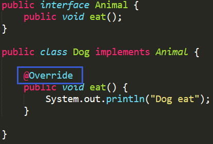
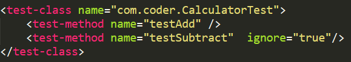

<!--ts-->
   * [1. 注解](#1-注解)
      * [1.1 什么是注解](#11-什么是注解)
      * [1.2 什么是元注解](#12-什么是元注解)
      * [1.3 Java中常用注解使用](#13-java中常用注解使用)
      * [1.4 如何自定义注解](#14-如何自定义注解)
      * [1.5 注解与反射的结合](#15-注解与反射的结合)
      * [1.6 Spring常用注解](#16-spring常用注解)
         * [Spring中的这几个注解有什么区别](#spring中的这几个注解有什么区别)
   * [2. annotation-coderising](#2-annotation-coderising)

<!-- Added by: anapodoton, at: Tue Mar  3 13:12:41 CST 2020 -->

<!--te-->

# 1. 注解

## 1.1 什么是注解

[参考](https://blog.csdn.net/briblue/article/details/73824058)

注解，也被称为元数据，为我们在代码中添加信息提供了一种形式化的方法。使我们可以在稍后的某个时刻非常方便的使用这些数据。

注解在一定程度上是把元数据与源代码文件结合在一起，而不是保存在外部文档中。

- 提供信息给编译器： 编译器可以利用注解来探测错误和警告信息
- 编译阶段时的处理： 软件工具可以用来利用注解信息来生成代码、Html文档或者做其它相应处理。
- 运行时的处理： 某些注解可以在程序运行的时候接受代码的提取

注解通过 @interface关键字进行定义。

```
public @interface TestAnnotation {
}
```


它的形式跟接口很类似，不过前面多了一个 @ 符号。上面的代码就创建了一个名字为 TestAnnotaion 的注解。

你可以简单理解为创建了一张名字为 TestAnnotation 的标签。


## 1.2 什么是元注解

说简单点，就是 定义其他注解的注解 。 比如Override这个注解，就不是一个元注解。而是通过元注解定义出来的。

```java
@Target(ElementType.METHOD)
@Retention(RetentionPolicy.SOURCE)
public @interface Override {
}
```

这里面的 @Target @Retention 就是元注解。

元注解有四个:@Target（表示该注解可以用于什么地方）、@Retention（表示再什么级别保存该注解信息）、@Documented（将此注解包含再javadoc中）、@Inherited（允许子类继承父类中的注解）。

## 1.3 Java中常用注解使用

上面创建了一个注解，那么注解的的使用方法是什么呢。

```java
@TestAnnotation
public class Test {
}
```


创建一个类 Test,然后在类定义的地方加上 @TestAnnotation 就可以用 TestAnnotation 注解这个类了。

你可以简单理解为将 TestAnnotation 这张标签贴到 Test 这个类上面。
@Deprecated
这个元素是用来标记过时的元素，想必大家在日常开发中经常碰到。编译器在编译阶段遇到这个注解时会发出提醒警告，告诉开发者正在调用一个过时的元素比如过时的方法、过时的类、过时的成员变量。

```java
public class Hero {
  @Deprecated
  public void say(){
    System.out.println("Noting has to say!");
	}
public void speak(){
	System.out.println("I have a dream!");
	}
} 
```


定义了一个 Hero 类，它有两个方法 say() 和 speak() ，其中 say() 被 @Deprecated 注解。然后我们在 IDE 中分别调用它们。


可以看到，say() 方法上面被一条直线划了一条，这其实就是编译器识别后的提醒效果。

@Override
这个大家应该很熟悉了，提示子类要复写父类中被 @Override 修饰的方法

@SuppressWarnings
阻止警告的意思。之前说过调用被 @Deprecated 注解的方法后，编译器会警告提醒，而有时候开发者会忽略这种警告，他们可以在调用的地方通过 @SuppressWarnings 达到目的。

```
@SuppressWarnings("deprecation")
public void test1(){
	Hero hero = new Hero();
	hero.say();
	hero.speak();
}
@SafeVarargs
参数安全类型注解。它的目的是提醒开发者不要用参数做一些不安全的操作,它的存在会阻止编译器产生 unchecked 这样的警告。它是在 Java 1.7 的版本中加入的。
```

@SafeVarargs
参数安全类型注解。它的目的是提醒开发者不要用参数做一些不安全的操作,它的存在会阻止编译器产生 unchecked 这样的警告。它是在 Java 1.7 的版本中加入的。

```
@SafeVarargs // Not actually safe!
	static void m(List<String>... stringLists) {
	Object[] array = stringLists;
	List<Integer> tmpList = Arrays.asList(42);
	array[0] = tmpList; // Semantically invalid, but compiles without warnings
	String s = stringLists[0].get(0); // Oh no, ClassCastException at runtime!
}
```


上面的代码中，编译阶段不会报错，但是运行时会抛出 ClassCastException 这个异常，所以它虽然告诉开发者要妥善处理，但是开发者自己还是搞砸了。

Java 官方文档说，未来的版本会授权编译器对这种不安全的操作产生错误警告。

@FunctionalInterface
函数式接口注解，这个是 Java 1.8 版本引入的新特性。函数式编程很火，所以 Java 8 也及时添加了这个特性。

函数式接口 (Functional Interface) 就是一个具有一个方法的普通接口。

比如

```
@FunctionalInterface
public interface Runnable {
    /**
     * When an object implementing interface <code>Runnable</code> is used
     * to create a thread, starting the thread causes the object's
     * <code>run</code> method to be called in that separately executing
     * thread.
     * <p>
     * The general contract of the method <code>run</code> is that it may
     * take any action whatsoever.
     *
     * @see     java.lang.Thread#run()
     */
    public abstract void run();
}
```


我们进行线程开发中常用的 Runnable 就是一个典型的函数式接口，上面源码可以看到它就被 @FunctionalInterface 注解。

可能有人会疑惑，函数式接口标记有什么用，这个原因是函数式接口可以很容易转换为 Lambda 表达式。这是另外的主题了，有兴趣的同学请自己搜索相关知识点学习。

## 1.4 如何自定义注解

除了元注解，都是自定义注解。通过元注解定义出来的注解。 如我们常用的Override 、Autowire等。 日常开发中也可以自定义一个注解，这些都是自定义注解。

在Java中，类使用class定义，接口使用interface定义，注解和接口的定义差不多，增加了一个@符号，即@interface，代码如下：

```
public @interface EnableAuth {

}
```

注解中可以定义成员变量，用于信息的描述，跟接口中方法的定义类似，代码如下：

```
public @interface EnableAuth {
    String name();
}
```

还可以添加默认值：

```
public @interface EnableAuth {
    String name() default "猿天地";
}
```

上面的介绍只是完成了自定义注解的第一步，开发中日常使用注解大部分是用在类上，方法上，字段上，示列代码如下：

```
@Target(ElementType.METHOD)
@Retention(RetentionPolicy.RUNTIME)
@Documented
public @interface EnableAuth {

}
```

Target

用于指定被修饰的注解修饰哪些程序单元，也就是上面说的类，方法，字段

Retention

用于指定被修饰的注解被保留多长时间，分别SOURCE（注解仅存在于源码中，在class字节码文件中不包含）,CLASS（默认的保留策略，注解会在class字节码文件中存在，但运行时无法获取）,RUNTIME（注解会在class字节码文件中存在，在运行时可以通过反射获取到）三种类型，如果想要在程序运行过程中通过反射来获取注解的信息需要将Retention设置为RUNTIME

Documented

用于指定被修饰的注解类将被javadoc工具提取成文档

Inherited

用于指定被修饰的注解类将具有继承性

## 1.5 注解与反射的结合

注解通过反射获取。首先可以通过 Class 对象的 isAnnotationPresent() 方法判断它是否应用了某个注解

```
public boolean isAnnotationPresent(Class<? extends Annotation> annotationClass) {}
```


然后通过 getAnnotation() 方法来获取 Annotation 对象。

```
public <A extends Annotation> A getAnnotation(Class<A> annotationClass) {}
```


或者是 getAnnotations() 方法。

```
public Annotation[] getAnnotations() {}
```

前一种方法返回指定类型的注解，后一种方法返回注解到这个元素上的所有注解。

如果获取到的 Annotation 如果不为 null，则就可以调用它们的属性方法了。比如

```java
@TestAnnotation()
public class Test {
	
	public static void main(String[] args) {
		
		boolean hasAnnotation = Test.class.isAnnotationPresent(TestAnnotation.class);
		
		if ( hasAnnotation ) {
			TestAnnotation testAnnotation = Test.class.getAnnotation(TestAnnotation.class);
			
			System.out.println("id:"+testAnnotation.id());
			System.out.println("msg:"+testAnnotation.msg());
		}
	}
}
```

程序的运行结果是：

id:-1
msg:
这个正是 TestAnnotation 中 id 和 msg 的默认值。

上面的例子中，只是检阅出了注解在类上的注解，其实属性、方法上的注解照样是可以的。同样还是要假手于反射。	

```java
@TestAnnotation(msg="hello")
public class Test {
	
	@Check(value="hi")
	int a;
	
	
	@Perform
	public void testMethod(){}
	
	
	@SuppressWarnings("deprecation")
	public void test1(){
		Hero hero = new Hero();
		hero.say();
		hero.speak();
	}


	public static void main(String[] args) {
		
		boolean hasAnnotation = Test.class.isAnnotationPresent(TestAnnotation.class);
		
		if ( hasAnnotation ) {
			TestAnnotation testAnnotation = Test.class.getAnnotation(TestAnnotation.class);
			//获取类的注解
			System.out.println("id:"+testAnnotation.id());
			System.out.println("msg:"+testAnnotation.msg());
		}
		
		
		try {
			Field a = Test.class.getDeclaredField("a");
			a.setAccessible(true);
			//获取一个成员变量上的注解
			Check check = a.getAnnotation(Check.class);
			
			if ( check != null ) {
				System.out.println("check value:"+check.value());
			}
			
			Method testMethod = Test.class.getDeclaredMethod("testMethod");
			
			if ( testMethod != null ) {
				// 获取方法中的注解
				Annotation[] ans = testMethod.getAnnotations();
				for( int i = 0;i < ans.length;i++) {
					System.out.println("method testMethod annotation:"+ans[i].annotationType().getSimpleName());
				}
			}
		} catch (NoSuchFieldException e) {
			// TODO Auto-generated catch block
			e.printStackTrace();
			System.out.println(e.getMessage());
		} catch (SecurityException e) {
			// TODO Auto-generated catch block
			e.printStackTrace();
			System.out.println(e.getMessage());
		} catch (NoSuchMethodException e) {
			// TODO Auto-generated catch block
			e.printStackTrace();
			System.out.println(e.getMessage());
		}
		
		

	}

}


```


它们的结果如下：

id:-1
msg:hello
check value:hi
method testMethod annotation:Perform
需要注意的是，如果一个注解要在运行时被成功提取，那么 @Retention(RetentionPolicy.RUNTIME) 是必须的。

## 1.6 Spring常用注解

[Spring常用注解](https://github.com/hollischuang/toBeTopJavaer/blob/master/basics/java-basic/annotation-in-spring.md)

@Configuration把一个类作为一个IoC容器，它的某个方法头上如果注册了@Bean，就会作为这个Spring容器中的Bean。

@Scope注解 作用域

@Lazy(true) 表示延迟初始化

@Service用于标注业务层组件、

@Controller用于标注控制层组件@Repository用于标注数据访问组件，即DAO组件。

@Component泛指组件，当组件不好归类的时候，我们可以使用这个注解进行标注。

@Scope用于指定scope作用域的（用在类上）

@PostConstruct用于指定初始化方法（用在方法上）

@PreDestory用于指定销毁方法（用在方法上）

@DependsOn：定义Bean初始化及销毁时的顺序

@Primary：自动装配时当出现多个Bean候选者时，被注解为@Primary的Bean将作为首选者，否则将抛出异常

@Autowired 默认按类型装配，如果我们想使用按名称装配，可以结合@Qualifier注解一起使用。如下：

@Autowired @Qualifier("personDaoBean") 存在多个实例配合使用

@Resource默认按名称装配，当找不到与名称匹配的bean才会按类型装配。

@PostConstruct 初始化注解

@PreDestroy 摧毁注解 默认 单例 启动就加载

### Spring中的这几个注解有什么区别

@Component 、@Repository、@Service、@Controller

1. @Component指的是组件，

@Controller，@Repository和@Service 注解都被@Component修饰，用于代码中区分表现层，持久层和业务层的组件，代码中组件不好归类时可以使用@Component来标注

1. 当前版本只有区分的作用，未来版本可能会添加更丰富的功能

# 2. annotation-coderising

[参考](https://mp.weixin.qq.com/s/fm4tnaZgnkmjrf9E72Dcew)。

1. XML大臣

最近这几年，XML大臣的宅邸车水马龙，像什么Spring, Hibernate, MyBatis 等大大小小的官员进京来都要拜访一下，无数的冰敬碳敬悄悄地送入府中， 真可谓红极一时， 正处于人生巅峰。 原因很简单，Java帝国的配置文件几乎都在使用XML, 自然都归XML大臣管理，想不红都难！

其他大臣看在眼里，恨在心里，他们决定联合起来，坚决打击XML大臣的嚣张气焰， 坚决把白花花的银子转移到自己府中来。 几位老家伙商量以后，决定还是推举老成持国的IO大臣为首领，给XML大臣一点颜色瞧瞧。 

2. 安翰林献计

可是IO大臣想了半天，也没什么好办法。 

这一天有个姓安的翰林自报家门求见， 说是可以助IO大臣一臂之力。

“安大人有何见教？” IO大臣懒洋洋地问道，他对这些读死书的翰林们没什么好感。

“大人，下官在负责Java注解，对付XML大臣，也许是个突破口”

“注解？ 这是什么东西？” IO大臣确实是有点老了

“其实就是元数据了”

“元数据？” IO大臣一头雾水。

“嗯， Metadata”  安翰林把英文都整出来了。 

“卖它推它？” IO大臣明显英文不好。

旁边的幕僚一个劲儿的使眼色， 谆谆告诫安翰林要通俗易懂。

安翰林说： “大人肯定知道@Override,@SuppressWarning等注解吧？ ”



IO大臣点头。

安翰林接着说： “**所谓元数据， 就是描述数据的数据了**，换句话说可以给其他数据提供描述性信息， 例如Java类中的某个方法，可以认为是一种数据， 如果我的@Override 一旦被用到这个方法上，那就意味着要覆盖父类/接口的方法了，于是我的@Override 就给这个方法提供了额外的信息。”

 “但是在源代码中写个@Override 似乎也没什么用处啊？ ” IO大臣问道

 “所以这只是元数据, 它给其他数据（如Java方法）提供了信息， 但是怎么样利用这些信息那就不归我管了。” 

 “那归谁管？” 

“比如@Override ， 由编译器来管，当编译这个Java 文件的时候，它就会检查被@Override 修饰的方法是否和父类的方法和参数相同， 如果不同，就会报错了。”

IO大臣说： “奥，明白了，**所谓的注解有点像加强版的注释， 这个“注释”不但有一定的格式，还有特定的含义**，这样别的工具就可以读取它来做事情了！”

安翰林松了一口气， 心里暗自佩服IO大臣的总结能力。 

“我记得这个@Override注解很早就有了啊，好像是JDK1.4吧”

“没错， 之前JDK内置了@Override、@Deprecated 、@SuppressWarnings等注解， 但是用处不大， 下官有个想法，干脆允许臣民们自定义注解得了” 安翰林开始切入正题。

“自定义？ 就是让臣民们自己写？ ”

“是的大人， 比如我可以自定义一个叫做 @Test的 注解：” 安翰林说着把写好的代码呈了上去。 


安翰林接着说： 大人请看我这里定义了一个叫做Test的注解，它有个ignore方法， 一会儿您老就看到它的用途了， 这个注解是应用在方法上的 @Target(ElementType.**METHOD**)， 在运行时起作用@Retention(RetentionPolicy.**RUNTIME**)。

IO大臣问道：“稍等， 我怎么还看到了@Target，@Retention， 这是什么？ ”

 “这称为元注解，可以认为是注解的注解。” 安翰林嘿嘿一笑说 “@Target表示该注解的应用目标，可以是类、方法、 方法参数等等， @Retention表示这个注解要保留到什么时候， 可以只在源码中， 或者class 文件中， 或者是运行时。”

“ 注解的注解， 真是够拗口的啊， 这个自定义的注解@Test 该怎么使用呢？ ”

安翰林又展示了另外一段代码：


IO大臣看了下，心想这自定义的注解和JDK内置的注解都差不多嘛，@Test修饰了方法， 表示这个方法可以作为测试用例来运行， @Test(ignore=true)则表示虽然这是个测试方法， 但是暂时忽略，不用运行， 果然简洁而清爽，老夫真是小看了这个安翰林。

“@Test注解的定义和使用，只是定义了行为语义，怎么样实现这个行为呢？ ” IO大臣问道

安翰林早有准备：“大人请看，我可以在运行时通过反射的方式取出把方法的注解，如果这个注解是@Test， 并且没有被ignore ， 那就可以通过反射去执行这个方法了， 是不是很简单？”


IO大臣微微点了点头，表示赞同，接着便闭目陷入了沉思： 这个东西有点意思，**在一个方法上添加了简单的修饰性注解@Test以后，这个方法突然间就有了额外的语义，变成了可以执行的测试用例了 !**

如果是XML老头儿， 该怎么描述类似的行为呢？ 也许得这样：




相比于简洁的@Test注解，这个方式实在是太复杂了， 更重要的是每次增加新的方法，除了修改Java文件之外，还得记着修改这个XML文件， 实在是繁琐。

嗯， 看来这个注解确实是个杀手锏， 要谨慎使用，一击必中。

想到这里，IO大臣睁开眼睛，喜笑颜开，让安翰林写一个关于注解的详细奏章，自己在合适的时候呈给皇上。 

3. 早朝争斗

初六阳光灿烂，IO大臣看到早朝的皇上心情不错，就把奏章呈了上去。 

“注解？ 这是什么东西？” 皇上根本没心思了解细节。

“启奏陛下，这个注解能够部分的代替一些XML的配置工作” IO大臣一边小心翼翼地回复，一边用余光向XML大臣扫去。 

看到IO大臣向自己发难， XML大臣立刻警觉起来， 他马上说： “陛下，可否让老臣一观？”

皇帝示意让吕公公把奏章递给XML大臣。 

XML大臣看了一会儿就明白大事不好， 这简直是釜底抽薪， 如果这个帝国批准了这个玩意儿，允许臣民们自定义注解，自己的势力要大大地被削弱了。

XML大臣脑海中出现一副可怕的场景， Spring, Struts, Hibernate 等纷纷倒戈，都采用注解来进行系统配置，白花花的银子开始流向IO大臣的府邸......

不， 坚决要把这点星星之火迅速扑灭。 

“陛下，依老臣之见， 此法断不可行！” XML大臣斩钉截铁。

“为何不可行？ 使用注解，配置靠近代码，容易阅读、容易修改！” IO大臣立刻反击， 为了展示易读易改，IO大臣还现场写了一段代码，描述了一个普通的Java 类是如何向数据库表和列映射的。 朝中多位大臣齐声喝彩， 为IO大臣摇旗呐喊。


“单独看一个当然很清晰， 但是如果多了， 配置分散在各个Java文件中， 极难查找，到时候你哭都来不及， 如果你用了XML, 所有的配置集中在一处， 一目了然。 还有，如果你想修改配置就得改Java源文件，重新编译部署，这也太扯了吧？！” XML大臣不甘示弱。

眼看着两位重臣开始剑拔弩张， 皇帝决定出面和稀泥， 他也不希望一家独大，也想平衡一下朝中关系。

“两位爱卿，依朕之意，还是先在JDK中加入自定义注解的支持，至于是用注解还是用XML， 还是让朕的子民们去选择吧！ ”

看到皇上主意已定， 两位大臣只好退下。 

自定义注解发布了， 令大家没有想到的是，无论是注解还是XML配置都没有占据垄断地位，很多人把二者混合起来使用了！ 对于一些需要集中配置的场合，例如数据源的配置， 自然是用XML。 另外一方面对于@Controller, @RequestMapping, @Transactional 这样的注解 ， 大家更喜欢和Java方法写在一起，显得简单而直观。

这正如朝中的局势，没人能够一家独大，XML大臣虽然丢失了一些领地，但依然是不可忽视的力量。 一场争斗，唯一的大赢家可能就是安翰林了，他被任命为Annotation大臣，专门管理自定义的注解。 
