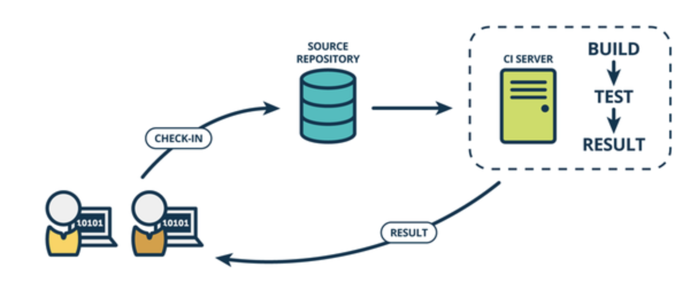
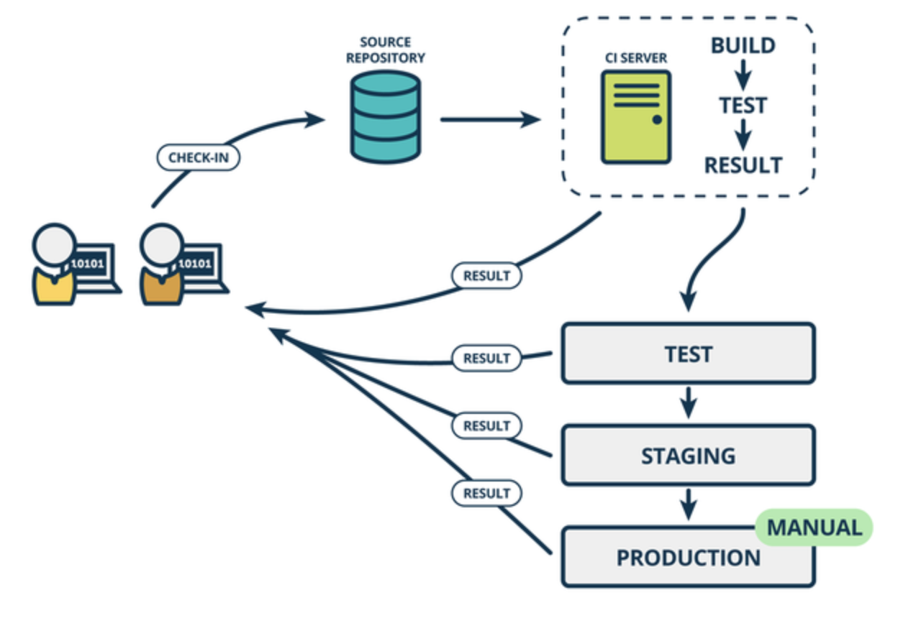
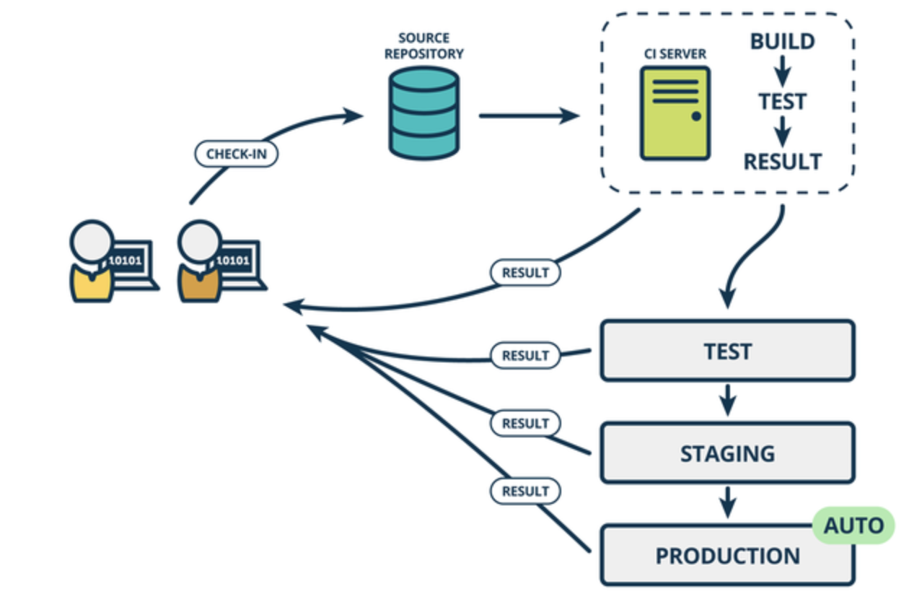

<!--ts-->
   * [前言](#前言)
   * [1. 从软件开发生命周期谈单元测试](#1-从软件开发生命周期谈单元测试)
      * [前言](#前言-1)
      * [1. 软件开发生命周期](#1-软件开发生命周期)
         * [1.1 持续集成](#11-持续集成)
         * [1.2 持续交付](#12-持续交付)
         * [1.3 持续部署](#13-持续部署)
      * [2. 软件测试](#2-软件测试)
         * [2.1 单元测试](#21-单元测试)
         * [2.2 集成测试](#22-集成测试)
         * [2.3 系统测试](#23-系统测试)
         * [2.4 回归测试](#24-回归测试)
      * [3. 单元测试](#3-单元测试)
      * [4. 总结](#4-总结)
      * [5. 参考资料](#5-参考资料)
   * [2. 单元测试与单元测试框架](#2-单元测试与单元测试框架)
      * [黑盒测试与白盒测试](#黑盒测试与白盒测试)
      * [黑盒测试](#黑盒测试)
      * [白盒测试](#白盒测试)
      * [灰盒测试](#灰盒测试)
      * [对代码做白盒测试](#对代码做白盒测试)
      * [单元测试框架](#单元测试框架)
      * [参考资料](#参考资料)
   * [3. 使用JUnit进行单元测试](#3-使用junit进行单元测试)
      * [前言](#前言-2)
      * [上手JUnit](#上手junit)
      * [JUnit中的Assert](#junit中的assert)
      * [JUnit中的注解](#junit中的注解)
         * [时间测试](#时间测试)
         * [异常测试](#异常测试)
      * [所有测试代码](#所有测试代码)
      * [总结](#总结)
   * [4. 使用Mock技术进行单元测试](#4-使用mock技术进行单元测试)
         * [why](#why)
         * [what](#what)
   * [5. 单元测试的基本准则](#5-单元测试的基本准则)
      * [1. 保持单元测试小巧, 快速](#1-保持单元测试小巧-快速)
      * [2. 单元测试应该是全自动/非交互式的](#2-单元测试应该是全自动非交互式的)
      * [3. 让单元测试很容易跑起来](#3-让单元测试很容易跑起来)
      * [4. 对测试进行评估](#4-对测试进行评估)
      * [5. 立即修正失败的测试](#5-立即修正失败的测试)
      * [6. 把测试维持在单元级别](#6-把测试维持在单元级别)
      * [7. 由简入繁](#7-由简入繁)
      * [8. 保持测试的独立性](#8-保持测试的独立性)
      * [9. Keep tests close to the class being tested](#9-keep-tests-close-to-the-class-being-tested)
      * [10. 合理的命名测试用例](#10-合理的命名测试用例)
      * [11. 只测公有接口](#11-只测公有接口)
      * [12. 看成是黑盒](#12-看成是黑盒)
      * [13. 看成是白盒](#13-看成是白盒)
      * [14. 芝麻函数也要测试](#14-芝麻函数也要测试)
      * [15. 先关注执行覆盖率](#15-先关注执行覆盖率)
      * [16. 覆盖边界值](#16-覆盖边界值)
      * [17. 提供一个随机值生成器](#17-提供一个随机值生成器)
      * [18. 每个特性只测一次](#18-每个特性只测一次)
      * [19. 使用显式断言](#19-使用显式断言)
      * [20. 提供反向测试](#20-提供反向测试)
      * [21. 代码设计时谨记测试](#21-代码设计时谨记测试)
      * [22. 不要访问预设的外部资源](#22-不要访问预设的外部资源)
      * [23. 权衡测试成本](#23-权衡测试成本)
      * [24. 安排测试优先次序](#24-安排测试优先次序)
      * [25. 测试代码要考虑错误处理](#25-测试代码要考虑错误处理)
      * [26. 写测试用例重现 bug](#26-写测试用例重现-bug)
      * [27. 了解局限](#27-了解局限)
   * [6. 写单元测试的重要性](#6-写单元测试的重要性)
      * [单元测试真的浪费时间吗？](#单元测试真的浪费时间吗)
      * [单元测试应不应该开发人员来写](#单元测试应不应该开发人员来写)
      * [我很自信，我还需要单测吗？](#我很自信我还需要单测吗)
      * [单测真的有那么重要么？](#单测真的有那么重要么)
      * [单元测试有哪些好处？](#单元测试有哪些好处)
         * [减少bug](#减少bug)
         * [减少修复bug的成本](#减少修复bug的成本)
         * [帮助重构，提高重构的成功率](#帮助重构提高重构的成功率)
         * [提高开发速度](#提高开发速度)
      * [后记](#后记)
   * [7. 使用JMockit编写java单元测试](#7-使用jmockit编写java单元测试)
         * [(1).基于行为的Mock方式：](#1基于行为的mock方式)
         * [(2).基于状态的Mock方式：](#2基于状态的mock方式)
   * [8. 单元测试mock框架——jmockit实战](#8-单元测试mock框架jmockit实战)

<!-- Added by: anapodoton, at: Tue Mar  3 17:23:36 CST 2020 -->

<!--te-->

# 前言

# 1. 从软件开发生命周期谈单元测试

## 前言

关于单元测试的重要性，本文不再赘述了。相信很多人都知道单测的重要性。但是在日常工作中写单测的人很少。很多项目的单测覆盖率和通过率一般都很低，尤其是web项目。

本文从软件开发的生命周期开始谈起，让我们站在一个全局的角度来看一下单元测试到底扮演着怎样的角色。

## 1. 软件开发生命周期

一个软件或者系统，从开发到上线基本要经过以下三个步骤：持续集成、持续交付、持续部署。在[The Product Managers’ Guide to Continuous Delivery and DevOps](http://www.mindtheproduct.com/2016/02/what-the-hell-are-ci-cd-and-devops-a-cheatsheet-for-the-rest-of-us/)一文中详细介绍了这三个阶段。

### 1.1 持续集成



持续集成(`Continuous Integration`)是指在软件开发过程中，频繁地将代码集成到主干上，然后进行自动化测试。

我们集团内部有持续集成的平台，可以直接在上面运行自动化测试。其实如果没有这样的平台，开发人员也可以做持续集成。

其实持续集成就是`git commit` + `mvn clean install`。注意，这里的maven命令不要加`-Dtest.skip`

### 1.2 持续交付



持续交付(`Continuous Delivery`)是指在持续集成的基础上，将集成后的代码部署到更贴近真实运行环境的“类生产环境”（production-like environments）中。比如，我们完成单元测试后，可以把代码部署到连接数据库的 Staging 环境中进行更多的测试。如果代码没有问题，可以继续手动部署到生产环境中。

这一步是在上线前的最后一次测试了，是在一个和生成环境一样的环境中进行测试。

### 1.3 持续部署



持续部署(`Continuous Deploy`)是在持续交付的基础上，把部署到生产环境的过程自动化。持续部署和持续交付的区别就是最终部署到生产环境是自动化的。

------

上面这三个阶段，都提到了一个词，那就是自动化测试。

> 自动化指软件测试的自动化，软件测试就是在预设条件下运行系统或应用程序，评估运行结果，预先条件应包括正常条件和异常条件。

## 2. 软件测试

现在我们知道，一个软件的从无到有或者每一次迭代都需要通过持续集成、持续交付、持续部署三个阶段。而每一个阶段都伴随着自动化测试，这足以看出测试的重要性。既然提到自动化的软件测试，那么我就要搞清楚到底什么是软件测试。

> 软件测试的经典定义是：在规定的条件下对程序进行操作，以发现程序错误，衡量软件质量，并对其是否能满足设计要求进行评估的过程。

目前，被普遍认可的软件测试包括以下几个阶段：

### 2.1 单元测试

单元测试是对软件组成单元进行测试，其目的是检验软件基本组成单位的正确性，测试的对象是软件设计的最小单位：**函数**。

### 2.2 集成测试

集成测试也称综合测试、组装测试、联合测试，将程序模块采用适当的集成策略组装起来，对系统的接口及集成后的功能进行正确性检测的测试工作。其主要目的是检查软件单位之间的接口是否正确，集成测试的对象是已经经过单元测试的模块。

### 2.3 系统测试

系统测试主要包括功能测试、界面测试、可靠性测试、易用性测试、性能测试。 功能测试主要针对包括功能可用性、功能实现程度（功能流程&业务流程、数据处理&业务数据处理）方面测试。

### 2.4 回归测试

回归测试指在软件维护阶段，为了检测代码修改而引入的错误所进行的测试活动。回归测试是软件维护阶段的重要工作，有研究表明，回归测试带来的耗费占软件生命周期的1/3总费用以上。

------

在整个软件测试的生命周期中，以单元测试开始，然后依次是集成测试、系统测试、回归测试。

软件测试的四个阶段，无论是复杂性还是成本，都是依次递增的。这个其实很好理解，当我们测试一个函数的时候发现问题简单，还是做整个功能的演示的时候发现问题简单？当我们在测试函数的时候发现问题好修改还是做功能演示的时候发现问题好修改？答案，不言而喻。

## 3. 单元测试

至此，我们知道，整个软件的上线过程中，都要进行自动化的软件测试。而软件测试主要有四个阶段：单元测试、集成测试、系统测试、回归测试。

那么，单元测试作为测试的第一个阶段，是发现和解决问题需要付出的成本最小的。那么，到底什么是单元测试？

> 单元测试（英语：Unit Testing）又称为模块测试, 是针对程序模块（软件设计的最小单位）来进行正确性检验的测试工作。程序单元是应用的最小可测试部件。在过程化编程中，一个单元就是单个程序、函数、过程等；对于面向对象编程，最小单元就是方法，包括基类（超类）、抽象类、或者派生类（子类）中的方法。

其实，可以很简单的说，就是我们在写代码的时候，对我们写出来的每一个重要的方法进行测试。

本文暂时不打算对单元测试涉及到的技术做详细介绍。后面我会有文章分专题的介绍单元测试涉及到的技术。目前我能想到的可能涉及到主要技术及知识点主要有以下这些：

- 什么地方改写单测
- 单元测试框架
- spring与单测框架的融合
- 数据库的单元测试
- 服务的mock测试
- 覆盖率
- 测试类及方法的命名
- 单测编写规范

这个专题我会持续做完，欢迎持续关注，同时也欢迎补充~

## 4. 总结

单元测试贯穿整个软件开发的生命周期，无论哪个阶段都离不开单元测试。单元测试就是对程序的模块最小测试。在面向对象编程中，主要是对函数的测试。单测涉及到的知识和技术比较多，本文暂时不做详细介绍。后面会逐一分析。

## 5. 参考资料

[单元测试](https://zh.wikipedia.org/wiki/%E5%8D%95%E5%85%83%E6%B5%8B%E8%AF%95)

[软件测试](https://zh.wikipedia.org/wiki/%E8%BD%AF%E4%BB%B6%E6%B5%8B%E8%AF%95)

# 2. 单元测试与单元测试框架

## 黑盒测试与白盒测试

在[第一弹](http://www.hollischuang.com/archives/1738)中我们介绍过，软件的测试包含单元测试、集成测试、系统测试和回归测试四个阶段。那么，这里我们先来看下各个阶段都使用怎样的测试方法。

软件测试，从测试方法上来区分可以分为黑盒测试、白盒测试和灰盒测试。

## 黑盒测试

黑盒测试，也称为功能测试。测试者不了解程序的内部情况，不需具备应用程序的代码、内部结构和编程语言的专门知识。只知道程序的输入、输出和系统的功能，这是从用户的角度针对软件界面、功能及外部结构进行测试，而不考虑程序内部逻辑结构。测试案例是依应用系统应该做的功能，照规范、规格或要求等设计。测试者选择有效输入和无效输入来验证是否正确的输出。
此测试方法可适合大部分的软件测试，如**集成测试**以及**系统测试**。

黑盒测试主要是为了发现以下几类错误：

> 是否有不正确或遗漏的功能？
>
> 在接口上，输入是否能正确的接受？能否输出正确的结果？
>
> 是否有数据结构错误或外部信息（例如数据文件）访问错误？
>
> 性能上是否能够满足要求？
>
> 是否有初始化或终止性错误？

## 白盒测试

白盒测试又称透明盒测试、结构测试等。测试应用程序的内部结构或运作，而不是测试应用程序的功能（即黑盒测试）。在白盒测试时，以编程语言的角度来设计测试案例。测试者输入数据验证数据流在程序中的流动路径，并确定适当的输出，类似测试电路中的节点。测试者了解待测试程序的内部结构、算法等信息，这是从程序设计者的角度对程序进行的测试。
白盒测试可以应用于**单元测试**、**集成测试**和系统的软件测试流程。

白盒测试主要是想对程序模块进行如下检查：

> 对程序模块的所有独立的执行路径至少测试一遍。
>
> 对所有的逻辑判定，取“真”与取“假”的两种情况都能至少测一遍。
>
> 在循环的边界和运行的界限内执行循环体。
>
> 测试内部数据结构的有效性，等等。

## 灰盒测试

灰盒测试，是介于白盒测试与黑盒测试之间的一种测试，灰盒测试多用于**集成测试**阶段，不仅关注输出、输入的正确性，同时也关注程序内部的情况。灰盒测试不像白盒那样详细、完整，但又比黑盒测试更关注程序的内部逻辑，常常是通过一些表征性的现象、事件、标志来判断内部的运行状态。

## 对代码做白盒测试

上面介绍了软件测试中的黑盒、白盒和灰盒测试。白盒测试被广泛的使用在单元测试阶段。

这里我们先来分析下，我们要进行单元测试，需要做哪些事情？因为单元测试的主要手段是白盒测试，白盒测试的测试方法是：**测试者输入数据验证数据流在程序中的流动路径，并确定适当的输出。**那么整个测试流程大概需要包含以下几个步骤：

- 初始化测试环境、准备测试数据。
- 调用需要被测试的单元。
- 收集结果，并与期望值比较。
- 测试数据清理。

以上四个步骤在每个单元在被测试的时候都需要被执行。举个例子，我们有一个除法运算的方法，我们要对他做单元测试。

```
public class Calculator{
    public float divide(float divisor，float dividend){
        return divisor/dividend;
    }
}
```

我们要在程序中验证上面这个方法的正确性，一般会写以下代码来测试他：

```
public class CalculatorTest{
    public static void main(String [] args){
        Calculator calculator = new Calculator();
        float result = calculator. divide(10.0,2.0);
        if(result == 5.0){
            System.out.println("divide test ok");
        }else{
            System.out.println("divide test failed");
        }
    }
}
```

这只是对该方法测试的第一个测试，如果我想测试这个方法在被除数是0的情况下会怎么样，那么我就要再写一个CalculatorTest2，然后重写写一个main方法，再重新定义一个Calculator对象，然后在调用divide方法的时候把第二个参数的值传为0。

> 其实上面的测试是存在很大问题的，因为在内存中并无法精确的存储浮点数，当我们把两个浮点数相除的时候结果并不一定可以精确的存储下来，而我们的逾期结果却是一个精确值，这样的比较可能会不相等的。但是这样的情况需要多个case才有可能被发现。

所以，我们在测试一个类中的一个方法的时候，可能要定义大量的类，然后需要分别执行，并且通过看控制台的输出才能确认结果。

这里，请先记住这些问题，因为，接下来我们要介绍的测试框架会帮我们解决这些问题的。

## 单元测试框架

通常，在没有特定框架支持下，我们在对一个方法进行单元测试的时候，无外乎是使用分支判断、异常处理、流程控制等来控制代码的执行，通过程序输出来表示方法的执行成功和失败。这样存在的最大问题就是我们每执行完一个单测之后，都要去控制台看输出才知道单元测试有没有成功，这明显是不合理的，因为单元测试是需要自动化执行的，程序没办法帮我们检查输出是否正确的。

单元测试框架就解决了这个问题，一旦使用了框架，加入单元测试相对来说会简单许多。通常，Java中常用的单元测试框架一般包含三个功能：测试工具、测试套件、测试运行器。

- 测试工具
  - 测试工具是一整套固定的工具用于基线测试。测试工具的目的是为了确保测试能够在共享且固定的环境中运行，因此保证测试结果的可重复性。一般负责初始化测试环境、准备测试数据和测试数据清理。
- 测试套件
  - 测试套件意味捆绑几个测试案例并且同时运行。
- 测试运行器
  - 用于执行测试案例。一般负责调用需要被测试的单元、收集结果、并与期望值比较。

除了以上这些功能之外，针对不同的功能，一般还会提供很多API和语法支持。

> 下一弹会重点介绍如何使用JUnit进行单元测试。

## 参考资料

[白盒测试](https://zh.wikipedia.org/wiki/%E7%99%BD%E7%9B%92%E6%B5%8B%E8%AF%95)

[黑盒测试](https://zh.wikipedia.org/wiki/%E9%BB%91%E7%9B%92%E6%B5%8B%E8%AF%95)

# 3. 使用JUnit进行单元测试

## 前言

[上一弹](http://www.hollischuang.com/archives/1755)中介绍了单元测试以及单元测试框架，这一弹主要来介绍一下JUnit这个目前比较流行的单测框架。

JUnit是由 Erich Gamma 和 Kent Beck 编写的一个回归测试框架（regression testing framework）。Junit测试是程序员测试，即所谓白盒测试，因为程序员知道被测试的软件如何（How）完成功能和完成什么样（What）的功能。

现在很多IDE中都已经集成了JUnit，当我们在创建`maven`项目的时候，一般在`pom`文件中也会自动增加junit的依赖。

```java
<dependency>
    <groupId>junit</groupId>
    <artifactId>junit</artifactId>
    <scope>test</scope>
    <version>4.4</version>
</dependency>
```

注意上面的maven的依赖中的`scope`，因为junit只在测试代码中会被用到，这里`scope`指定未`test`即可。我们直接使用和介绍JUnit4。

## 上手JUnit

要测试，要先有被测代码（当然，基于测试编程可以先有测试代码）。先来看我们想要测试的代码：

```
public class CaculateService {
    public float divide(float divisor, float dividend) {
        return divisor / dividend;
    }
}
```

我们想要测试这个类，那么如何使用Junit进行测试呢？先来写一个测试类。如果你使用的是`IntelliJ`+`Mac`，那么可以在类名上使用快捷键`option`+`enter`直接生成测试类，这样IDE会帮忙生成一个对应的测试类。（其他操作系统和IDE也有同样的功能）


生成后的测试代码和被测代码所处路径如下：


可以看到，一般的maven项目中，会在`src/main`下面有两个目录，`java`和`test`，`java`目录中放的是源码，`test`目录中放的是测试代码。测试代码和测试代码的包名保持一致即可。

测试代码如下：

```
public class CaculateServiceTest {
    CaculateService caculateService = new CaculateService();
    @Test
    public void testDivide() throws Exception {
       Assert.assertEquals(caculateService.divide(2, 1), 2.0);
    }

}
```

然后执行该方法就可以了，先不管`Assert.assertEquals`的用法及结果，这里总结下使用JUnit写测试代码的简单步骤：

> 创建一个名为 `CaculateServiceTest.java` 的测试类。
>
> 向测试类中添加名为 `testDivide()` 的方法。
>
> 向方法中添加 Annotaion `@Test`。
>
> 执行测试条件并且应用 Junit 的 assertEquals API 来检查。

## JUnit中的Assert

```
public class Assert extends java.lang.Object
```

这个类提供了一系列的编写测试的有用的声明方法。只有失败的声明方法才会被记录。

- ```
  void assertEquals(boolean expected, boolean actual)
  ```

  - 检查两个变量或者等式是否平衡

- ```
  void assertFalse(boolean condition)
  ```

  - 检查条件是假的

- ```
  void assertNotNull(Object object)
  ```

  - 检查对象不是空的

- ```
  void assertNull(Object object)
  ```

  - 检查对象是空的

- ```
  void assertTrue(boolean condition)
  ```

  - 检查条件为真

- ```
  void fail()
  ```

  - 在没有报告的情况下使测试不通过

这些方法我就不一一介绍了，相信我的读者们都能看懂并在平时开发中用的到，还是比较容易理解的。

Assert可以用来判断方法的真是结果和预期结果是否一样。是我们在写单元测试中用到最多的一个api。

## JUnit中的注解

- `@BeforeClass`：针对所有测试，只执行一次，且必须为static void
- `@Before`：初始化方法
- `@Test`：测试方法，在这里可以测试期望异常和超时时间
- `@After`：释放资源
- `@AfterClass`：针对所有测试，只执行一次，且必须为static void
- `@Ignore`：忽略的测试方法

一个单元测试类执行顺序为：

```
@BeforeClass` –> `@Before` –> `@Test` –> `@After` –> `@AfterClass
```

每一个测试方法的调用顺序为：

```
@Before` –> `@Test` –> `@After
```

### 时间测试

如果一个测试用例比起指定的毫秒数花费了更多的时间，那么 Junit 将自动将它标记为失败。timeout 参数和 `@Test`注释一起使用。现在让我们看看活动中的 @test(timeout)。

```
@Test(timeout = 1000)
public void testTimeoutSuccess() {
    // do nothing
}
```

### 异常测试

你可以测试代码是否它抛出了想要得到的异常。expected 参数和 @Test 注释一起使用。现在让我们看看活动中的 @Test(expected)。

```
@Test(expected = NullPointerException.class)
public void testException() {
    throw new NullPointerException();
}
```

## 所有测试代码

[代码地址](https://github.com/hollischuang/EffectiveUT/blob/master/src/test/test/com/hollischuang/effective/unitest/service/JUnitTest.java)

```java
package com.hollischuang.effective.unitest.service;

import org.junit.*;

/**
 * @author Hollis 17/1/7.
 */
public class JUnitTest {

    /**
     * 只执行一次,在整个类执行之前执行
     */
    @BeforeClass
    public static void beforeClass() {
        System.out.println("in before class");
    }

    /**
     * 只执行一次,在整个类执行之后执行
     */
    @AfterClass
    public static void afterClass() {
        System.out.println("in after class");
    }

    /**
     * 每个测试方法被执行前都被执行一次
     */
    @Before
    public void before() {
        System.out.println("in before");
    }

    /**
     * 每个测试方法被执行后都被执行一次
     */
    @After
    public void after() {
        System.out.println("in after");
    }

    // test case 1
    @Test
    public void testCase1() {
        System.out.println("in test case 1");
    }

    // test case 2
    @Test
    public void testCase2() {
        System.out.println("in test case 2");
    }

    /**
     * 测试assertEquals
     */
    @Test
    public void testEquals() {
        Assert.assertEquals(1 + 2, 3);
    }

    /**
     * 测试assertTrue
     */
    @Test
    public void testTrue() {
        Assert.assertTrue(1 + 2 == 3);
    }

    /**
     * 测试assertFalse
     */
    @Test
    public void testFals() {
        Assert.assertFalse(1 + 2 == 4);
    }

    /**
     * 测试assertNotNull
     */
    @Test
    public void assertNotNull() {
        Assert.assertNotNull("not null");
    }

    /**
     * 测试assertNull
     */
    @Test
    public void assertNull() {
        Assert.assertNull(null);
    }

    /**
     * 测试fail和Ignore
     */
    @Test
    @Ignore
    public void assertFail() {
        Assert.fail();
    }

    /**
     * 测试异常
     */
    @Test(expected = NullPointerException.class)
    public void testException() {
        throw new NullPointerException();
    }

    /**
     * 测试时间
     */
    @Test(timeout = 1000)
    public void testTimeoutSuccess() {
        // do nothing
    }

    /**
     * 测试时间
     */
    @Test(timeout = 1000)
    public void testTimeoutFailed() {
        while (true) {

        }
    }
}
```

## 总结

本文主要介绍了JUnit的常见用法，后面会专门写一篇文章介绍如何将JUnit和Spring集合到一起。

# 4. 使用Mock技术进行单元测试

碰撞测试是汽车开发活动中的重要组成部分。所有汽车在上市之前都要经过碰撞测试，并公布测试结果。碰撞测试的目的用于评定运输包装件在运输过程中承受多次重复性机械碰撞的耐冲击强度及包装对内装物的保护能力。说简单点就是为了测试汽车在碰撞的时候锁所产生的自身损伤、对车内人员及车外人员、物品等的损伤情况。


在进行汽车的碰撞测试时，当然不能让真人来进行测试，一般采用假人来测试。但是为了保证测试的真实性及可靠性，假人的生物力学性能应该和人体一样——比如身体各部分的大小和质量，以及关节的刚性等等，只有这样使用它们的模拟才能和现实相匹配。为了保证覆盖到的情况够全面，一般都会使用各种不同的假人，不同的假人模拟男性或者女性的身体，以及不同身高和年龄的人体。

想想软件测试，其实和汽车的碰撞测试流程差不多。一个软件在发布上线之前都要经过各种测试，并产出测试报告，更严格的一点的要保证单测覆盖率不能低于某个值。和汽车碰撞测试类似，我们在软件测试中也会用到很多“假人”。用这些“假人”的目的也是为了保证测试有效的进行。

------

### why

不知道你在日常开发中有没有遇到过以下问题或需求：

1、和别人一起做同一个项目，相互之间已经约定好接口。然后你开始开发，开发完自己的代码后，你想测试下你的服务实现逻辑是否正确。但是因为你依赖的只是接口，真正的服务还有开发出来。

2、还是和上面类似的场景，你要依赖的服务是通过RPC的方式调用的，而外部服务的稳定性很难保证。

3、对于一个接口或者方法，你希望测试其各种不同情况，但是依赖的服务的执行策略及返回值你没办法决定。

4、你依赖的服务或者对象很难创建！(比如具体的web容器)

5、依赖的对象的某些行为很难触发！（比如网络异常）

6、以上问题你都没有，但是你要用的那个服务他处理速度实在是太慢了。

上面这些情况都是日常开发测试过程中可能遇到的比较麻烦的问题。这些问题都会大大的提高测试成本。可以说，很多开发人员不愿意写单元测试很大程度上都和以上这六点有关系。

幸运的是，Mock对象可以解决以上问题。使用mock对象进行的测试就是mock测试。

### what

mock测试就是在测试过程中，对于某些不容易构造或者不容易获取的对象，用一个虚拟的对象来创建以便测试的测试方法。

mock对象，就是非真实对象，是模拟出来的一个对象。可以理解为汽车碰撞测试的那个假人。mock对象就是真实对象在调试期间的代替品。


你创建这样一个“假人”的成本比较低，这个“假人”可以按照你设定的“剧情”来运行。

在Java的单元测试中，很多Mock框架可以使用，用的比较多的有easymock、mockito、powermock、jmockit等。

面向对象开发中，我们通常定义一个接口，使用一个接口来描述这个对象。在被测试代码中只是通过接口来引用对象，所以它不知道这个引用的对象是真实对象，还是mock对象。

好了，这篇文章的内容差不多就这些了，主要是让大家知道，在Java中可以使用mock对象来模拟真实对象来进行单元测试，好处很多。下一篇会详细介绍如何使用mockito框架进行单元测试。

# 5. 单元测试的基本准则

实施单元测试的时候, 如果没有一份经过实践证明的详细规范, 很难掌握测试的 “度”, 范围太小施展不开, 太大又侵犯 “别人的” 地盘. 上帝的归上帝, 凯撒的归凯撒, 给单元测试念念紧箍咒不见得是件坏事, 反而更有利于发挥单元测试的威力, 为代码重构和提高代码质量提供动力.

这份文档来自 [Geotechnical](http://geosoft.no/development/unittesting.html), 是一份非常难得的经验准则. 你完全可以以这份准则作为模板, 结合所在团队的经验, 整理出一份内部单元测试准则.

## 1. 保持单元测试小巧, 快速

理论上, 任何代码提交前都应该完整跑一遍所有测试套件. 保持测试代码执行快能够缩短迭代开发周期.

## 2. 单元测试应该是全自动/非交互式的

测试套件通常是定期执行的, 执行过程必须完全自动化才有意义. 输出结果需要人工检查的测试不是一个好的单元测试.

## 3. 让单元测试很容易跑起来

对开发环境进行配置, 最好是敲一条命令或是点击一个按钮就能把单个测试用例或测试套件跑起来.

## 4. 对测试进行评估

对执行的测试进行覆盖率分析, 得到精确的代码执行覆盖率, 并调查哪些代码未被执行.

## 5. 立即修正失败的测试

每个开发人员在提交前都应该保证新的测试用例执行成功, 当有代码提交时, 现有测试用例也都能跑通.

如果一个定期执行的测试用例执行失败, 整个团队应该放下手上的工作先解决这个问题.

## 6. 把测试维持在单元级别

单元测试即类 (Class) 的测试. 一个 “测试类” 应该只对应于一个 “被测类”, 并且 “被测类” 的行为应该被隔离测试. 必须谨慎避免使用单元测试框架来测试整个程序的工作流, 这样的测试即低效又难维护. 工作流测试 (译注: 指跨模块/类的数据流测试) 有它自己的地盘, 但它绝不是单元测试, 必须单独建立和执行.

## 7. 由简入繁

再简单的测试也远远胜过完全没有测试. 一个简单的 “测试类” 会促使建立 “被测类” 基本的测试骨架, 可以对构建环境, 单元测试环境, 执行环境以及覆盖率分析工具等有效性进行检查, 同时也可以证明 “被测类” 能够被整合和调用.

下面便是单元测试版的 Hello, world! :

```
void testDefaultConstruction()
{
Foo foo = new Foo();
assertNotNull(foo);
}
```

## 8. 保持测试的独立性

为了保证测试稳定可靠且便于维护, 测试用例之间决不能有相互依赖, 也不能依赖执行的先后次序.

## 9. Keep tests close to the class being tested

[译注: 有意翻译该规则, 个人认为本条规则值得商榷, 大部分 C++, Objective-C和 Python 库均把测试代码从功能代码目录中独立出来, 通常是创建一个和 src 目录同级的 tests 目录, 被测模块/类名之前也常常 不加 Test 前缀. 这么做保证功能代码和测试代码隔离, 目录结构清晰, 并且发布源码的时候更容易排除测试用例.]

```
If the class to test is Foo the test class should be called FooTest (not TestFoo) and kept in the same package (directory) as Foo. Keeping test classes in separate directory trees makes them harder to access and maintain.

Make sure the build environment is configured so that the test classes doesn't make its way into production libraries or executables.
```

## 10. 合理的命名测试用例

确保每个方法只测试 “被测类” 的一个明确特性, 并相应的命名测试方法. 典型的命名俗定是`test[what]`, 比如 `testSaveAs()`, `testAddListener()`, `testDeleteProperty()` 等.

## 11. 只测公有接口

单元测试可以被定义为 通过类的公有 API 对类进行测试. 一些测试工具允许测试一个类的私有成员, 但这种做法应该避免, 它让测试变得繁琐而且更难维护. 如果有私有成员确实需要进行直接测试, 可以考虑把它重构到工具类的公有方法中. 但要注意这么做是为了改善设计, 而不是帮助测试.

## 12. 看成是黑盒

站在第三方使用者的角度, 测试一个类是否满足规定的需求. 并设法让它出问题.

## 13. 看成是白盒

毕竟被测试类是程序员自写自测的, 应该在最复杂的逻辑部分多花些精力测试.

## 14. 芝麻函数也要测试

通常建议所有重要的函数都应该被测试到, 一些芝麻方法比如简单的 `setter` 和 `getter` 都可以忽略. 但是仍然有充分的理由支持测试芝麻函数:

芝麻 很难定义. 对于不同的人有不同的理解.

从黑盒测试的观点看, 是无法知道哪些代码是芝麻级别的.

即便是再芝麻的函数, 也可能包含错误, 通常是 “复制粘贴” 代码的后果:

```
private double weight_;
private double x_, y_;

public void setWeight(int weight)
{
  weight = weight_;  // error
}

public double getX()
{
  return x_;
}

public double getY()
{
  return x_;  // error
}
```

因此建议测试所有方法. 毕竟芝麻用例也容易测试.

## 15. 先关注执行覆盖率

区别对待 执行覆盖率 和 实际测试覆盖率. 测试的最初目标应该是确保较高的执行覆盖率. 这样能保证代码在 少量 参数值输入时能执行成功. 一旦执行覆盖率就绪, 就应该开始改进测试覆盖率了. 注意, 实际的测试覆盖率很难衡量 (而且往往趋近于 0%).

思考以下公有方法:

```
void setLength(double length);
```

调用 `setLength(1.0)`你可能会得到 100% 的执行覆盖率. 但要达到 100% 的实际测试覆盖率, 有多少个 double 浮点数这个方法就必须被调用多少次, 并且要一一验证行为的正确性. 这无疑是不可能的任务.

## 16. 覆盖边界值

确保参数边界值均被覆盖. 对于数字, 测试负数, 0, 正数, 最小值, 最大值, NaN (非数字), 无穷大等. 对于字符串, 测试空字符串, 单字符, 非 ASCII 字符串, 多字节字符串等. 对于集合类型, 测试空, 1, 第一个, 最后一个等. 对于日期, 测试 1月1号, 2月29号, 12月31号等. 被测试的类本身也会暗示一些特定情况下的边界值. 要点是尽可能彻底的测试这些边界值, 因为它们都是主要 “疑犯”.

## 17. 提供一个随机值生成器

当边界值都覆盖了, 另一个能进一步改善测试覆盖率的简单方法就是生成随机参数, 这样每次执行测试都会有不同的输入.

想要做到这点, 需要提供一个用来生成基本类型 (如: 浮点数, 整型, 字符串, 日期等) 随机值的工具类. 生成器应该覆盖各种类型的所有取值范围.

如果测试时间比较短, 可以考虑再裹上一层循环, 覆盖尽可能多的输入组合. 下面的例子是验证两次转换 `little endian` 和 `big endian` 字节序后是否返回原值. 由于测试过程很快, 可以让它跑上个一百万次.

```
void testByteSwapper()
{
  for (int i = 0; i < 1000000; i++) {
    double v0 = Random.getDouble();
    double v1 = ByteSwapper.swap(v0);
    double v2 = ByteSwapper.swap(v1);
    assertEquals(v0, v2);
  }
}
```

## 18. 每个特性只测一次

在测试模式下, 有时会情不自禁的滥用断言. 这种做法会导致维护更困难, 需要极力避免. 仅对测试方法名指示的特性进行明确测试.

因为对于一般性代码而言, 保证测试代码尽可能少是一个重要目标.

## 19. 使用显式断言

应该总是优先使用 `assertEquals(a, b)` 而不是 `assertTrue(a == b)`, 因为前者会给出更有意义的测试失败信息. 在事先不确定输入值的情况下, 这条规则尤为重要, 比如之前使用随机参数值组合的例子.

## 20. 提供反向测试

反向测试是指刻意编写问题代码, 来验证鲁棒性和能否正确的处理错误.

假设如下方法的参数如果传进去的是负数, 会立马抛出异常:

```
void setLength(double length) throws IllegalArgumentException
```

可以用下面的方法来测试这个特例是否被正确处理:

```
try {
  setLength(-1.0);
  fail();  // If we get here, something went wrong
}
catch (IllegalArgumentException exception) {
  // If we get here, all is fine
}
```

## 21. 代码设计时谨记测试

编写和维护单元测试的代价是很高的, 减少代码中的公有接口和循环复杂度是降低成本, 使高覆盖率测试代码更易于编写和维护的有效方法.

一些建议:

使类成员常量化, 在构造函数中进行初始化. 减少 `setter` 方法的数量.

限制过度使用继承和公有虚函数.

通过使用友元类 (C++) 或包作用域 (Java) 来减少公有接口.

避免不必要的逻辑分支.

在逻辑分支中编写尽可能少的代码.

在公有和私有接口中尽量多用异常和断言验证参数参数的有效性.

限制使用快捷函数. 对于黑箱而言, 所有方法都必须一视同仁的进行测试. 考虑以下简短的例子:

```
public void scale(double x0, double y0, double scaleFactor)
{
  // scaling logic
}

public void scale(double x0, double y0)
{
  scale(x0, y0, 1.0);
}
```

删除后者可以简化测试, 但用户代码的工作量也将略微增加.

## 22. 不要访问预设的外部资源

单元测试代码不应该假定外部的执行环境, 以便在任何时候/任何地方都能执行. 为了向测试提供必需的资源, 这些资源应该由测试本身提供.

比如一个解析某类型文件的类, 可以把文件内容嵌入到测试代码里, 在测试的时候写入到临时文件, 测试结束再删除, 而不是从预定的地址直接读取.

## 23. 权衡测试成本

不写单元测试的代价很高, 但是写单元测试的代价同样很高. 要在这两者之间做适当的权衡, 如果用执行覆盖率来衡量, 业界标准通常在 80% 左右.

很典型的, 读写外部资源的错误处理和异常处理就很难达到百分百的执行覆盖率. 模拟数据库在事务处理到一半时发生故障并不是办不到, 但相对于进行大范围的代码审查, 代价可能太大了.

## 24. 安排测试优先次序

单元测试是典型的自底向上过程, 如果没有足够的资源测试一个系统的所有模块, 就应该先把重点放在较底层的模块.

## 25. 测试代码要考虑错误处理

考虑下面的这个例子:

```
Handle handle = manager.getHandle();
assertNotNull(handle);

String handleName = handle.getName();
assertEquals(handleName, "handle-01");
```

如果第一个断言失败, 后续语句会导致代码崩溃, 剩下的测试都无法执行. 任何时候都要为测试失败做好准备, 避免单个失败的测试项中断整个测试套件的执行. 上面的例子可以重写成:

```
Handle handle = manager.getHandle();
assertNotNull(handle);
if (handle == null) return;

String handleName = handle.getName();
assertEquals(handleName, "handle-01");
```

## 26. 写测试用例重现 bug

每上报一个 bug, 都要写一个测试用例来重现这个 bug (即无法通过测试), 并用它作为成功修正代码的检验标准.

## 27. 了解局限

单元测试永远无法证明代码的正确性!!

一个跑失败的测试可能表明代码有错误, 但一个跑成功的测试什么也证明不了.

单元测试最有效的使用场合是在一个较低的层级验证并文档化需求, 以及 回归测试: 开发或重构代码时，不会破坏已有功能的正确性.

# 6. 写单元测试的重要性

作为一个开发人员。很多人很少写单元测试，甚至不写单元测试。

总结一下开发人员不写单测的原因无非有以下几种：

```
1、认为写单测浪费时间。
2、认为测试不应该是开发人员来做的。
3、自信我写的代码没有问题，不需要单测。
4、不知道单测的重要性。
5、不知道单测的好处。
```

那么针对以上这几种观点，今天就逐个分析一下。到底单元测试有没有那么重要。

## 单元测试真的浪费时间吗？

在业务高速发展的今天，很多时候项目来的时候要的都很急。好像要是我不把这个功能在几天之内搞完整个公司都要倒闭了一样。所以，很多开发人员都把主要的时间用在写业务逻辑代码上。很多人都是有时间的时候才会写一些简单的单元测试代码，如果项目比较忙的话就不写单元测试。

很多程序员的项目都是这样完成的：

```
写代码---->集成测试---->改bug---->集成测试---->预发布测试---->改bug---->正式发布---->发生故障---->改bug---->发布---->改bug---->....
```

可以看到，改bug过程贯穿着整个软件的生命周期。改bug很多人都知道怎么改，就是要先定位问题，然后再解决问题。往往定位问题都是比较复杂的，一般都需要很长的时间。

如果有了单元测试可能就会节省很多时间，通过单测可以减少很多bug的发生，也能帮助我们快速的定位问题。只要在集成测试之前做好单元测试。在通过单元测试之后，我们就可以认为这部分代码是可靠的，那么就可以放心的进行项目集成。

当然，有了单元测试，并不能保证代码不出现bug。但是，单元测试可以在软件开发过程的早期就能发现问题。只要单测的测试用例足够好，那么就可以避免很多低级错误。

那么，为什么还是很多人认为单元测试浪费时间呢，个人分析原因可能是这样的。开发人员认为我的时间就应该用来写业务逻辑代码。项目出现了bug，我也应该用我的时间来解决这个bug。他们认为我的时间花费在这件事上我是认可的，所以我的时间就不叫浪费。归根结底，他们就是没有意识到单元测试所带来的好处。一旦他们发现，通过单元测试可以让我更早的发现问题等等好处，那么他们也会认可把时间花费在写单测上。

在这里，可以先下一个结论：**好的单测不仅不会浪费时间，还会大大节省我们的时间。**至于为什么会节省时间以及什么叫好的单测会在后面介绍。

## 单元测试应不应该开发人员来写

这里暂不分析到底应不应该有单独的测试人员，这是一个颇有争议的话题（一部分人认为，开发就应该是全栈的。还有一部分人认为开发就应该只关注业务写业务代码）。这里只分析单元测试到底应该由谁来做。有人认为，单元测试也是测试的一种手段，应该交给专门的QA去做。也有人认为单元测试应该是开发人员来写，那么，单元测试到底应不应该开发人员写呢？

**单元测试必须由最熟悉代码的人来写**。这是好的单元测试的标准之一。那么还能有谁比写代码的人更了解代码呢？代码的作者最了解代码的目的、特点和实现的局限性。所以，写单元测试没有比作者更适合的人选了。单独的测试人员进行单元测试，往往工作量大，周期长，耗费巨大，其结果事倍功半。软件的开发者总是应当负责程序的单个单元的测试，保证每个单元能够完成设计的功能，其实在很多情况下，开发者也应进行集成测试。

我的观点以为，开发人员写了一个函数，就要对这个函数负责，就有义务保证这个函数可以准确的执行。单测便是一个很好的手段。**所以，如果要写单测，就应该开发人员自己来写。**

## 我很自信，我还需要单测吗？

有人能写出完美无缺的代码么？答案是否定的！

我认为程序员都是天生骄傲的。虽然程序员往往都会说：在我机器上明明是好的呀，是不是你用的方式不对呀。但是，好的程序员应该在说完这句话之后会偷偷的去排查问题。

写代码不是可以一蹴而就的，必须经过各种各样的测试，单元测试只是其中一种。

**所以，无论你是一个多么天生骄傲的程序员，你都不是神！所以，你也需要单测。**

## 单测真的有那么重要么？

很多程序员宁愿把时间花费在写业务逻辑代码上，他们多数是有时间的时候才会写一些简单的单元测试代码，如果项目比较忙的话就不写单元测试。据我所知，只有少数的公司会要求项目上线必须达到一定百分比的[代码覆盖率](https://zh.wikipedia.org/wiki/代碼覆蓋率)（软件测试中的一种度量，描述程式中源代码被测试的比例和程度），大多数公司都不是很重视这一项，所有，很多人就不太重视单元测试。但是，很多发生故障的经验告诉我们，很多问题是可以通过单元测试避免的。

其实单元测试的重要性很简单，就是一句话：**不写单元测试，你怎么知道你的代码写的对不对？**没有足够丰富的测试用例，你怎么知道用户会怎么使用到你的代码，你又怎么会知道你的代码应该怎么被执行呢？

**所以，单元测试很重要。和写代码一样重要。无单测，不编码！**

## 单元测试有哪些好处？

前面说了这么多，其实以上这些问题都有一个最最根源的问题，那就是很多程序员不写单测的最最根本原因是他们根本不知道写单测和不写单测的区别。不知道写了单测能带来好处。所以他们会认为写单测是浪费时间，所以他们才会认为单测不应该是由我来写，所以他们才会认为我不需要写单测。

那么，单元测试到底能带来哪些好处呢？

J.Timothy King写过一篇关于先写单元测试有哪些好处的文章：[Twelve Benefits of Writing Unit Tests First](http://sd.jtimothyking.com/2006/07/11/twelve-benefits-of-writing-unit-tests-first/)（先写单元测试的十二个好处），这里挑其中几个显而易见和比较突出的好处介绍一下。

### 减少bug

单元测试的目的就是通过足够准确的测试用例保证代码逻辑是正确。所以，在单测过程中，必然可以解决一些bug。因为，一旦某条测试用例没有通过，那么我们就会修改被测试的代码来保证能够通过测试。

### 减少修复bug的成本

一般解决bug的思路都是先通过各种手段定位问题，然后在解决问题。定位问题的时候如果没有单元测试，就只能通过debug的方式一点一点的追踪代码。解决问题的时候更是需要想尽各种方法来重现问题，然后改代码，改了代码之后在集成测试。

因为单元规模较小，复杂性较低，因而发现错误后容易隔离和定位，有利于调试工作。

### 帮助重构，提高重构的成功率

我相信，对一个程序员来说最痛苦的事就是修改别人的代码。有时候，一个很大的系统会导致很多人不敢改，因为他不知道改了一个地方会不会导致其他地方出错。可以，一旦有了单元测试，开发人员可以很方便的重构代码，只要在重构之后跑一遍单元测试就可以知道是不是把代码“改坏了”

### 提高开发速度

不写单测也许能让开发速度更快，但是无法保证自己写出来的代码真的可以正确的执行。写单测可以较少很多后期解决bug的时间。也能让我们放心的使用自己写出来的代码。整体提高开发速度。

## 后记

据我说知，在facebook是没有QA的，他们的所有代码都是通过单元测试来保证能够正确执行的。在google也很重视单测，国外这样的大公司都会要求单测的代码覆盖率达到一个高的水平，否则是绝对不会允许代码发不到线上的。

所以，通过这样一篇文章，希望读者可以重视单元测试，并在实际项目中运用起来。但是，也请记得，单测只能在一定程度上减少bug的发生，并不是写了单测就不会在发生问题。

无单测，不编码！

# 7. 使用JMockit编写java单元测试

JMockit是基于JavaSE5中的java.lang.instrument包开发，内部使用ASM库来动态修改java的字节码，使得java这种静态语言可以想动态脚本语言一样动态设置被Mock对象私有属性，模拟静态、私有方法行为等等，对于手机开发，嵌入式开发等要求代码尽量简洁的情况下，或者对于被测试代码不想做任何修改的前提下，使用JMockit可以轻松搞定很多测试场景。

[](https://47.99.194.156/wp-content/uploads/2015/09/20140104100723093.jpg)

通过如下方式在maven中添加JMockit的相关依赖：

```
        <dependency>  
            <groupId>com.googlecode.jmockit</groupId>  
            <artifactId>jmockit</artifactId>  
            <version>1.5</version>  
            <scope>test</scope>  
        </dependency>  
        <dependency>  
            <groupId>com.googlecode.jmockit</groupId>  
            <artifactId>jmockit-coverage</artifactId>  
            <version>0.999.24</version>  
            <scope>test</scope>  
        </dependency>
```

JMockit有两种Mock方式：基于行为的Mock方式和基于状态的Mock方式：

引用单元测试中mock的使用及mock神器jmockit实践中JMockit API和工具如下：

[](https://47.99.194.156/wp-content/uploads/2015/09/20140104102342843.jpg)

### (1).基于行为的Mock方式：

非常类似与EasyMock和PowerMock的工作原理，基本步骤为：

1.录制方法预期行为。

2.真实调用。

3.验证录制的行为被调用。

通过一个简单的例子来介绍JMockit的基本流程：

**要Mock测试的方法如下：**

```
public class MyObject {
    public String hello(String name){
        return "Hello " + name;
    }
}
```

**使用JMockit编写的单元测试如下：**

```
@Mocked  //用@Mocked标注的对象，不需要赋值，jmockit自动mock  
MyObject obj;  

@Test  
public void testHello() {  
    new NonStrictExpectations() {//录制预期模拟行为  
        {  
            obj.hello("Zhangsan");  
            returns("Hello Zhangsan");  
            //也可以使用：result = "Hello Zhangsan";  
        }  
    };  
    assertEquals("Hello Zhangsan", obj.hello("Zhangsan"));//调用测试方法  
    new Verifications() {//验证预期Mock行为被调用  
        {  
            obj.hello("Hello Zhangsan");  
            times = 1;  
        }  
    };  
}  
```

JMockit也可以分类为非局部模拟与局部模拟，区分在于Expectations块是否有参数，有参数的是局部模拟，反之是非局部模拟。

而Expectations块一般由Expectations类和NonStrictExpectations类定义，类似于EasyMock和PowerMock中的Strict Mock和一般性Mock。

用Expectations类定义的，则mock对象在运行时只能按照 Expectations块中定义的顺序依次调用方法，不能多调用也不能少调用，所以可以省略掉Verifications块；

而用NonStrictExpectations类定义的，则没有这些限制，所以如果需要验证，则要添加Verifications块。

上述的例子使用了非局部模拟，下面我们使用局部模拟来改写上面的测试，代码如下：

```
@Test  
public void testHello() {  
    final MyObject obj = new MyObject();  
    new NonStrictExpectations(obj) {//录制预期模拟行为  
        {  
            obj.hello("Zhangsan");  
            returns("Hello Zhangsan");  
            //也可以使用：result = "Hello Zhangsan";  
        }  
    };  
    assertEquals("Hello Zhangsan", obj.hello("Zhangsan"));//调用测试方法  
    new Verifications() {//验证预期Mock行为被调用  
        {  
            obj.hello("Hello Zhangsan");  
            times = 1;  
        }  
    };  
}  
```

**模拟静态方法：**

```
@Test  
public void testMockStaticMethod() {  
    new NonStrictExpectations(ClassMocked.class) {  
        {  
            ClassMocked.getDouble(1);//也可以使用参数匹配：ClassMocked.getDouble(anyDouble);  
            result = 3;  
        }  
    };  

    assertEquals(3, ClassMocked.getDouble(1));  

    new Verifications() {  
        {  
            ClassMocked.getDouble(1);  
            times = 1;  
        }  
    };  
}  
```

**模拟私有方法：**

如果ClassMocked类中的getTripleString(int)方法指定调用一个私有的multiply3(int)的方法，我们可以使用如下方式来Mock：

```
@Test  
public void testMockPrivateMethod() throws Exception {  
    final ClassMocked obj = new ClassMocked();  
    new NonStrictExpectations(obj) {  
        {  
            this.invoke(obj, "multiply3", 1);//如果私有方法是静态的，可以使用：this.invoke(null, "multiply3")  
            result = 4;  
        }  
    };  

    String actual = obj.getTripleString(1);  
    assertEquals("4", actual);  

    new Verifications() {  
        {  
            this.invoke(obj, "multiply3", 1);  
            times = 1;  
        }  
    };  
}  
```

**设置Mock对象私有属性的值：** 我们知道EasyMock和PowerMock的Mock对象是通过JDK/CGLIB动态代理实现的，本质上是类的继承或者接口的实现，但是在java面向对象编程中，基类对象中的私有属性是无法被子类继承的，所以如果被Mock对象的方法中使用到了其自身的私有属性，并且这些私有属性没有提供对象访问方法，则使用传统的Mock方法是无法进行测试的，JMockit提供了设置Mocked对象私有属性值的方法，代码如下： 被测试代码：

```
public class ClassMocked {  
    private String name = "name_init";  

    public String getName() {  
        return name;  
    }  

    private static String className="Class3Mocked_init";  

    public static String getClassName(){  
        return className;  
    }  
}  
```

**使用JMockit设置私有属性：**

```
@Test  
public void testMockPrivateProperty() throws IOException {  
    final ClassMocked obj = new ClassMocked();  
    new NonStrictExpectations(obj) {  
        {  
            this.setField(obj, "name", "name has bean change!");  
        }  
    };  

    assertEquals("name has bean change!", obj.getName());  
}  
```

**使用JMockit设置静态私有属性：**

```
@Test  
public void testMockPrivateStaticProperty() throws IOException {  
    new NonStrictExpectations(Class3Mocked.class) {  
        {  
            this.setField(ClassMocked.class, "className", "className has bean change!");  
        }  
    };  

    assertEquals("className has bean change!", ClassMocked.getClassName());  
}  
```

### (2).基于状态的Mock方式：

JMockit上面的基于行为Mock方式和传统的EasyMock和PowerMock流程基本类似，相当于把被模拟的方法当作黑盒来处理，而JMockit的基于状态的Mock可以直接改写被模拟方法的内部逻辑，更像是真正意义上的白盒测试，下面通过简单例子介绍JMockit基于状态的Mock。 被测试的代码如下：

```
public class StateMocked {  

    public static int getDouble(int i){  
        return i*2;  
    }  

    public int getTriple(int i){  
        return i*3;  
    }  
} 
```

**改写普通方法内容：**

```
@Test  
public void testMockNormalMethodContent() throws IOException {  
    StateMocked obj = new StateMocked();  
    new MockUp<StateMocked>() {//使用MockUp修改被测试方法内部逻辑  
        @Mock  
      public int getTriple(int i) {  
            return i * 30;  
        }  
    };  
    assertEquals(30, obj.getTriple(1));  
    assertEquals(60, obj.getTriple(2));  
    Mockit.tearDownMocks();//注意：在JMockit1.5之后已经没有Mockit这个类，使用MockUp代替，mockUp和tearDown方法在MockUp类中  
}  
```

**修改静态方法的内容：** 基于状态的JMockit改写静态/final方法内容和测试普通方法没有什么区别，需要注意的是在MockUp中的方法除了不包含static关键字以外，其他都和被Mock的方法签名相同，并且使用@Mock标注，测试代码如下：

```
@Test  
    public void testGetTriple() {  
        new MockUp<StateMocked>() {  
            @Mock    
            public int getDouble(int i){    
                return i*20;    
            }  
        };    
        assertEquals(20, StateMocked.getDouble(1));    
        assertEquals(40, StateMocked.getDouble(2));   
    }  
```

原文链接: http://blog.csdn.net/chjttony/article/details/17838693

# 8. 单元测试mock框架——jmockit实战

JMockit是google code上面的一个java单元测试mock项目，她很方便地让你对单元测试中的final类,静态方法，构造方法进行mock，功能强大。项目地址在： http://jmockit.org/。详细用法可以在上面找到答案。 JMockit的测试方式可以通过下面2个途径实现

**一.根据用例的测试路径，测试代码内部逻辑**

对于这种情景，可以使用jmockit的基于行为的mock方式。在这种方式中，目的是测试单元测试及其依赖代码的调用过程，验证代码逻辑是否满足测试路径。 由于被依赖代码可能在自己单测中已测试过，或者难以测试，就需要把这些被依赖代码的逻辑用预定期待的行为替换掉，也就是mock掉，从而把待测是代码隔离开，这也是单元测试的初衷。 这种方式和白盒测试接近。

**二.根据测试用例的输入输出数据，测试代码是否功能运行正常。**

对于这种情景，可以使用jmockit基于状态的mock方式。目的是从被测代码的使用角度出发，结合数据的输入输出来检验程序运行的这个正确性。使用这个方式，需要把被依赖的代码mock掉，实际上相当于改变了被依赖的代码的逻辑。通常在集成测试中，如果有难以调用的外部接口，就通过这个方式mock掉，模拟外部接口。 这种方式有点像黑盒测试。

下面根据一个简单例子简单介绍JMockit的几个常用测试场景和使用方法。

被测试类：一个猜骰子点数的类。`new Guess(int n)`时候指定最大猜数次数，并且生成实际点数。在n次猜测内猜中则输出成功，n次猜测失败后通过`failHandle()`输出错误。结果输出通过`GuessDAO`来保存。但`GuessDAO`还没实现。

```
/** 在n次机会随机猜骰子点数 ,结果保存到数据库中 */  
    public class Guess {  
        private int maxTryTime;                         // 最大重试次数  
        private int tryTime = 0;                        // 当前重试次数  
        private int number = (int) (Math.random() * 6); // 目标数字  
        private GuessDAO guessDAO;                      // 持久化依赖  
        public Guess(int maxRetryTime) {               
            this.maxTryTime = maxRetryTime;  
        }  
        public void doit() {  
            while (tryTime++ < maxTryTime && !tryIt()) {  
                // 到达最大尝试次数仍不成功则调用handle  
                if (tryTime == maxTryTime) {  
                    failHandle();  
                }  
            }  
        }  
        public boolean tryIt() {                        // 最坏情况下调用maxRetryTime次tryIt(),猜中则保存信息  
            if (number == randomGuess()) {  
                guessDAO.saveResult(true, number);  
                return true;  
            }  
            return false;  
        }  
        public void failHandle() {                      // 失败处理，猜不中时调用  
            guessDAO.saveResult(false, number);  
        }  
        private int randomGuess(){                      // 猜的随机过程  
            return (int) (Math.random() * 6);  
        }  
        public void setGuessDAO(GuessDAO guessDAO) {  
            this.guessDAO = guessDAO;  
        }  
    }  
```

下面通过3个测试用例来说明如何使用jmockit **1. 测试当没有一次猜中时，代码逻辑如何执行。**

先上测试代码： public class GuessTest {

```
    @Tested        // 表明被修饰实例是将会被自动构建和注入的实例  
    Guess guess = new Guess(3);  
    @Injectable    // 表明被修饰实例将会自动注入到@Tested修饰的实例中，并且会自动mock掉，除非在测试前被赋值  
    GuessDAO guessDAO;  

    /** 
     * 连续3次失败 
     */  
    @Test  
    public void behaviorTest_fail3time() {  

        new Expectations() {        // Expectations中包含的内部类区块中，体现的是一个录制被测类的逻辑。  
            @Mocked(methods="tryIt")  // 表明被修饰的类对tryIt()方法进行mock。  
            Guess g;  
            {  
                g.tryIt();             // 期待调用Guess.tryIt()方法  
                result = false;        // mock掉返回值为false（表明猜不中）  
                times = 3;             // 期待以上过程重复3次  
                guessDAO.saveResult(false, anyInt); // 期待调用guessDAO把猜失败的结果保存  
            }  
        };  
        guess.doit();               // 录制完成后，进行实际的代码调用，也称回放(replay)  
    }  
}  
```

说明下这个测试代码的目的： 测试行为是guess.doit(),代码期望在调用doit()函数后，会发生：

> 1.调用tryIt，并把结果mock为false； 2.重复第一步3次； 3.把结果通过guessDAO保存。即调用3次均猜错数字

可以看出，JMockit在基于行为的测试中，体现3个步骤。 第一个是脚本录制，也就是把期望的行为记录下来。在上面例子中，在Expectation内部类的区块中的代码就是期待发生的行为。 第二是回放，也就是guess.doit()触发的过程。 第三是检验，在这里没有确切体现出，但是的确发生着检验：假设doit方法调用后，代码的逻辑没有符合录制过程中的脚本的行为，那么测试结果失败(其实Jmockit有专门的Verifications做检验，但是这里Expecation已经包含了这个功能，如果用NonStrictExpecation就需要有检验块)。

**再介绍下这段代码中用到的各个JMockit元素（结论源自文档及自己代码测试）：**

`@Tested`和`@Injectable`: 对`@Tested`对象判断是否为null，是则通过合适构造器初始化，并实现依赖注入。调用构造方法时，会尝试使用`@Injectable`的字段进行构造器注入。普通注入时，`@Injectable`字段如果没有在测试方法前被赋值，其行为将会被mock成默认值(静态方法和构造函数不会被mock掉)。`Injectable`最大作用除了注入，还有就是mock的范围只限当前注释实例。一句话：`@Injectable`的实例会自动注入到`@Tested`中，如果没初始赋值，那么JMockit将会以相应规则初始化。

`@Mocked`:`@Mocked`修饰的实例，将会把实例对应类的所有实例的所有行为都mock掉（无论构造方法，还是private，protected方法，够霸气吧）。在Expectation区块中，声明的成员变量均默认带有@Mocked，但是本例没有省略，是因为`@Mocked`会mock掉所有方法，而回放的代码中doit函数我们是不希望它也被mock，所以通过method=”tryIt”来设置被mock的类只对tryIt方法进行mock。

`Expectations`:这是录制期望发生行为的地方。result和times都是其内定成员变量。result可以重定义录制行为的返回值甚至通过Delegate来重定义行为，times是期待录制行为的发生次数。在Expectations中发生的调用，均会被mock。由于没定义result，所以`guessDAO.saveResult()`调用的结果返回空。

**2. 当多次失败后，最后一次猜数成功时，代码逻辑如何执行。**

在上面的测试代码中，加多一个测试方法：

```
/** 
  * 两次失败，第三次猜数成功 
  */  
 @Test  
 public void behaviorTest_sucecess() {  

     new Expectations(Guess.class) {                          // 构造函数可以传入Class或Instance实例  
         {     
             guess.tryIt();  
             result = false;  
             times=2;  
             invoke(guess, "randomGuess", new Object[]{});    // invoke()能调用私有方法  
             result = (Integer)getField(guess, "number");     // getField()能操作私有成员  
             guessDAO.saveResult(true, (Integer)getField(guess, "number"));  
         }  
     };  
     guess.doit();  
 }  
```

第二个测试用例是期待先猜2次失败，第3次猜中。

所以录制中会先调用2次tryIt并返回false，在发生第3次调用时，通过invoke调用私有方法randomGuess，并期待其返回被测实例的私有成员number，通过这种作弊的方式，自然肯定能在第三次猜中数字。最后期待guessDAO把结果保存。 这段代码和之前的区别是，在Expectation中没定义成员变量，而把Guess.class显式地通过构造函数传入。这么做也是为了只对tryIt方法mock，因为在Expectation构造函数传入Class对象或Instance对象后，只会区块内Class或Instance对应的行为进行mock。

通过以上2个基于行为mock的例子，应该对JMockit如何测试代码内部逻辑有了解了吧。下面再对基于状态的mock介绍：

**3. 模拟正常猜骰子，观察输出猜中的概率**

再加入第三各测试方法：

```
/** 
 * 模拟正常执行,计算抽中概率，把DAO mock掉 
 */  
@Test  
public void stateTest_mockDAO() {  
    final Map<Integer, Integer> statMap = new HashMap<Integer, Integer>(); // statMap.get(0)为猜中次数，statMap.get(1)为失败次数  
    statMap.put(0, 0);  
    statMap.put(1, 0);  
    guessDAO = new MockUp<GuessDAO>() {            // MockUp用来定义新的代码逻辑  
        @SuppressWarnings("unused")  
        @Mock  
        public boolean saveResult(boolean isSuccess, int n) {  
          if (isSuccess) {  
              statMap.put(0, statMap.get(0)+1);  
              System.out.println("you guess it! dice:" + n);  
          } else {  
              statMap.put(1, statMap.get(1)+1);  
              System.out.println("you didn't guess it. dice:" + n);  
          }  
          return true;  
        }  
    }.getMockInstance();    

    for (int i=0; i<1000; i++) {  
        Guess guess = new Guess(3);  
        guess.setGuessDAO(guessDAO);  
        guess.doit();  
    }  
    System.out.println("hit" + statMap.get(0));  
    System.out.println("not hit" + statMap.get(1));  
    double rate =((double) statMap.get(0)) / (statMap.get(0)+statMap.get(1));  
    System.out.println("hit rate=" + rate);  
}  
```

第三个用例目的是，测试在指定尝试次数下猜中数字的概率。这就不再盯着代码内部逻辑，而从整体功能角度进行测试，把内部无法调用的的依赖接口mock掉。 在基于状态的mock中，看不到了Expectations，@Mocked等字样了。取而代之的是MockUp,@Mock。

代码中对GuessDAO的保存方法进行了重定义。让其直接从控制带输出消息。

通过这种方式，不仅可以进行功能黑盒测试，还可以尽快地让测试代码跑起来。

MockUp中的泛型类型是被重定义的类，重定义的方法需要和原类中的方法签名一致。但是，static方法可以省区static关键字。如：

```
new MockUp<Calendar>() {  
    @Mock  
    public Calendar getInstance() {  
        return calendar1;  
    }  
};  
```

至此，通过三个例子，把JMockit的2个测试方式简单介绍了。但是JMockit的功能不仅如此，详细能请查看官方文档和实例。

过程中遇到还未解决的疑问：

1. 基于行为的mock，需要对回放的类的具体类型类mock，没法针对父类类型mock？

   Guess g = new Guess(3);
   new Expectations() {
   @Mocked(methods=”tryIt”)
   GuessParent mg; // 对Guess父类进行mock
   {
   mg.tryIt();result=true;
   }
   };
   g.doit();

假如声明的mg类型是Guess的父类，则回放中调用Guess.doit（）将不能捕捉道mg.tryIt();导致测试失败。 除非在expectation构造函数传入实例g才可以。

1. 基于行为的动态mock， 文档说： If the Class object for a given class is passed, the methods and constructors defined in that class are considered for mocking,but not the methods and constructors of its super-classes. If an instance of a given class is passed, then all methods defined in the whole class hierarchy, from the concrete class of the given instance up to (but not including) Object, are considered for mocking; the constructors of these classes, however, are not (since an instance was already created). 粗体的不是很理解，是说mock的父类的方法和构造函数不被mock？但测试结果却不是这样

原文地址：http://blog.csdn.net/ultrani/article/details/8993364
