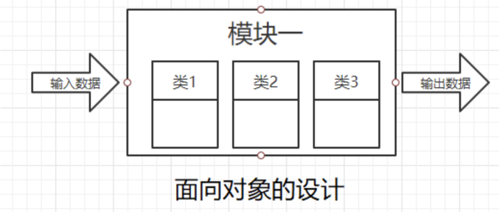

<!--ts-->
   * [1. 面向对象](#1-面向对象)
      * [1.1 什么是面向过程？](#11-什么是面向过程)
      * [1.2 什么是面向对象？](#12-什么是面向对象)
   * [2. 三大基本特征](#2-三大基本特征)
      * [2.1 封装](#21-封装)
      * [2.2 继承](#22-继承)
         * [2.2.1 构造器](#221-构造器)
         * [2.2.2 protected关键字](#222-protected关键字)
         * [2.2.3 向上转型](#223-向上转型)
         * [2.2.4 谨慎继承](#224-谨慎继承)
      * [2.3 多态](#23-多态)
         * [定义](#定义)
         * [多态的好处](#多态的好处)
         * [多态的必要条件](#多态的必要条件)
         * [Java中多态的实现方式](#java中多态的实现方式)
         * [思考](#思考)
         * [多态的实现](#多态的实现)
         * [经典实例](#经典实例)
   * [3. 五大基本原则](#3-五大基本原则)
      * [3.1 单一职责原则（Single-Resposibility Principle）](#31-单一职责原则single-resposibility-principle)
      * [3.2 开放封闭原则（Open-Closed principle）](#32-开放封闭原则open-closed-principle)
      * [3.3 Liskov替换原则（Liskov-Substituion Principle）](#33-liskov替换原则liskov-substituion-principle)
      * [3.4 依赖倒置原则（Dependecy-Inversion Principle）](#34-依赖倒置原则dependecy-inversion-principle)
      * [3.5 接口隔离原则（Interface-Segregation Principle）](#35-接口隔离原则interface-segregation-principle)
   * [4. 四种访问级别](#4-四种访问级别)
   * [5. 可变参数](#5-可变参数)
      * [5.2 什么是可变参数](#52-什么是可变参数)
      * [5.4 可变参数的使用场景](#54-可变参数的使用场景)

<!-- Added by: anapodoton, at: Wed Mar  4 20:32:52 CST 2020 -->

<!--te-->

# 1. 面向对象

## 1.1 什么是面向过程？

把问题分解成一个一个步骤，每个步骤都是函数或者表达式，这样的编程思想就是面向过程。最小的程序单元是函数，每个函数负责完成某一个功能，用以接受输入数据，函数对输入数据进行处理，然后输出结果数据。整个软件系统由一个个的函数组成，其中作为程序入口的函数称之为主函数，主函数依次调用其他函数，普通函数之间可以相互调用，从而实现整个系统功能。


**问题：**1）设计不够直观，与人类的习惯思维不一致；2）系统软件适应性差，可扩展性差，维护性低。

## 1.2 什么是面向对象？

对象是属性和行为的集合体。
把问题分解成一个一个步骤，每个步骤都是对象及对象的行为调用，这样的编程思想就是面向对象。



> 面向过程和面向对象的区别，可以说是中心不一样，面向过程以过程为中心，关注问题的解决过程顺序，而面向对象以对象为中心，将问题分解并抽象成多个对象，关注对象及对象之间的关系。

# 2. 三大基本特征

## 2.1 封装

封装从字面上来理解就是包装的意思，专业点就是信息隐藏，是指利用抽象数据类型将数据和基于数据的操作封装在一起，使其构成一个不可分割的独立实体，数据被保护在抽象数据类型的内部，尽可能地隐藏内部的细节，只保留一些对外接口使之与外部发生联系。系统的其他对象只能通过包裹在数据外面的已经授权的操作来与这个封装的对象进行交流和交互。也就是说用户是无需知道对象内部的细节（当然也无从知道），但可以通过该对象对外的提供的接口来访问该对象。

对于封装而言，一个对象它所封装的是自己的属性和方法，所以它是不需要依赖其他对象就可以完成自己的操作。

使用封装有三大好处：

- 1、良好的封装能够减少耦合。
- 2、类内部的结构可以自由修改。
- 3、可以对成员进行更精确的控制。
- 4、隐藏信息，实现细节。

首先我们先来看两个类：Husband.java、Wife.java

```java
public class Husband {

    /*
     * 对属性的封装
     * 一个人的姓名、性别、年龄、妻子都是这个人的私有属性
     */
    private String name ;
    private String sex ;
    private int age ;
    private Wife wife;

    /*
     * setter()、getter()是该对象对外开发的接口
     */
    public String getName() {
        return name;
    }

    public void setName(String name) {
        this.name = name;
    }

    public String getSex() {
        return sex;
    }

    public void setSex(String sex) {
        this.sex = sex;
    }

    public int getAge() {
        return age;
    }

    public void setAge(int age) {
        this.age = age;
    }

    public void setWife(Wife wife) {
        this.wife = wife;
    }
}
public class Wife {
    private String name;
    private int age;
    private String sex;
    private Husband husband;

    public String getName() {
        return name;
    }

    public void setName(String name) {
        this.name = name;
    }

    public String getSex() {
        return sex;
    }

    public void setSex(String sex) {
        this.sex = sex;
    }

    public void setAge(int age) {
        this.age = age;
    }

    public void setHusband(Husband husband) {
        this.husband = husband;
    }

    public Husband getHusband() {
        return husband;
    }

}
```

从上面两个实例我们可以看出Husband里面wife引用是没有getter()的，同时wife的age也是没有getter()方法的。至于理由我想各位都懂的，男人嘛深屋藏娇妻嘛，没有那个女人愿意别人知道她的年龄。

**所以封装把一个对象的属性私有化，同时提供一些可以被外界访问的属性的方法，如果不想被外界方法，我们大可不必提供方法给外界访问**。但是如果一个类没有提供给外界访问的方法，那么这个类也没有什么意义了。比如我们将一个房子看做是一个对象，里面的漂亮的装饰，如沙发、电视剧、空调、茶桌等等都是该房子的私有属性，但是如果我们没有那些墙遮挡，是不是别人就会一览无余呢？没有一点儿隐私！就是存在那个遮挡的墙，我们既能够有自己的隐私而且我们可以随意的更改里面的摆设而不会影响到其他的。但是如果没有门窗，一个包裹的严严实实的黑盒子，又有什么存在的意义呢？所以通过门窗别人也能够看到里面的风景。所以说门窗就是房子对象留给外界访问的接口。

通过这个我们还不能真正体会封装的好处。现在我们从程序的角度来分析封装带来的好处。如果我们不使用封装，那么该对象就没有setter()和getter()，那么Husband类应该这样写：

```
public class Husband {
    public String name ;
    public String sex ;
    public int age ;
    public Wife wife;
}
```

我们应该这样来使用它：

```
Husband husband = new Husband();
husband.age = 30;
husband.name = "张三";
husband.sex = "男";    //貌似有点儿多余
```

但是那天如果我们需要修改Husband，例如将age修改为String类型的呢？你只有一处使用了这个类还好，如果你有几十个甚至上百个这样地方，你是不是要改到崩溃。如果使用了封装，我们完全可以不需要做任何修改，只需要稍微改变下Husband类的setAge()方法即可。

```
public class Husband {

    /*
     * 对属性的封装
     * 一个人的姓名、性别、年龄、妻子都是这个人的私有属性
     */
    private String name ;
    private String sex ;
    private String age ;    /* 改成 String类型的*/
    private Wife wife;

    public String getAge() {
        return age;
    }

    public void setAge(int age) {
        //转换即可
        this.age = String.valueOf(age);
    }

    /** 省略其他属性的setter、getter **/

}
```

其他的地方依然那样引用(husband.setAge(22))保持不变。

到了这里我们确实可以看出，**封装确实可以使我们容易地修改类的内部实现，而无需修改使用了该类的客户代码**。我们在看这个好处：可以对成员变量进行更精确的控制。还是那个Husband，一般来说我们在引用这个对象的时候是不容易出错的，但是有时你迷糊了，写成了这样：

```
Husband husband = new Husband();
husband.age = 300;
```

也许你是因为粗心写成了，你发现了还好，如果没有发现那就麻烦大了，逼近谁见过300岁的老妖怪啊！

但是使用封装我们就可以避免这个问题，我们对age的访问入口做一些控制(setter)如：

```
public class Husband {

    /*
     * 对属性的封装
     * 一个人的姓名、性别、年龄、妻子都是这个人的私有属性
     */
    private String name ;
    private String sex ;
    private int age ;    /* 改成 String类型的*/
    private Wife wife;

    public int getAge() {
        return age;
    }

    public void setAge(int age) {
        if(age > 120){
            System.out.println("ERROR：error age input....");    //提示錯誤信息
        }else{
            this.age = age;
        }

    }

    /** 省略其他属性的setter、getter **/

}
```

上面都是对setter方法的控制，其实通过使用封装我们也能够对对象的出口做出很好的控制。例如性别我们在数据库中一般都是已1、0方式来存储的，但是在前台我们又不能展示1、0，这里我们只需要在getter()方法里面做一些转换即可。

```
public String getSexName() {
        if("0".equals(sex)){
            sexName = "女";
        }
        else if("1".equals(sex)){
            sexName = "男";
        }
        else{
            sexName = "人妖???";
        }
        return sexName;
    }
```

在使用的时候我们只需要使用sexName即可实现正确的性别显示。同理也可以用于针对不同的状态做出不同的操作。

```java
public String getCzHTML(){
        if("1".equals(zt)){
            czHTML = "<a href='javascript:void(0)' onclick='qy("+id+")'>启用</a>";
        }
        else{
            czHTML = "<a href='javascript:void(0)' onclick='jy("+id+")'>禁用</a>";
        }
        return czHTML;
}
```

## 2.2 继承

在讲解之前我们先看一个例子，该例子是前篇博文（[java提高篇—–理解java的三大特性之封装](http://www.cnblogs.com/chenssy/p/3351835.html)）的。


从这里我们可以看出，Wife、Husband两个类除了各自的husband、wife外其余部分全部相同，作为一个想最大限度实现复用代码的我们是不能够忍受这样的重复代码，如果再来一个小三、小四、小五……（扯远了!)我们是不是也要这样写呢？那么我们如何来实现这些类的可复用呢？利用继承！！

首先我们先离开软件编程的世界，从常识中我们知道丈夫、妻子、小三、小四…，他们都是人，而且都有一些共性，有名字、年龄、性别、头等等，而且他们都能够吃东西、走路、说话等等共同的行为，所以从这里我们可以发现他们都拥有人的属性和行为，同时也是从人那里继承来的这些属性和行为的。

从上面我们就可以基本了解了继承的概念了，继承是使用已存在的类的定义作为基础建立新类的技术，新类的定义可以增加新的数据或新的功能，也可以用父类的功能，但不能选择性地继承父类。通过使用继承我们能够非常方便地复用以前的代码，能够大大的提高开发的效率。


对于Wife、Husband使用继承后，除了代码量的减少我们还能够非常明显的看到他们的关系。

继承所描述的是“is-a”的关系，如果有两个对象A和B，若可以描述为“A是B”，则可以表示A继承B，其中B是被继承者称之为父类或者超类，A是继承者称之为子类或者派生类。

实际上**继承者是被继承者的特殊化，它除了拥有被继承者的特性外，还拥有自己独有得特性**。例如猫有抓老鼠、爬树等其他动物没有的特性。同时在继承关系中，继承者完全可以替换被继承者，反之则不可以，例如我们可以说猫是动物，但不能说动物是猫就是这个道理，其实对于这个我们将其称之为“向上转型”，下面介绍。

诚然，继承定义了类如何相互关联，共享特性。对于若干个相同或者相识的类，我们可以抽象出他们共有的行为或者属相并将其定义成一个父类或者超类，然后用这些类继承该父类，他们不仅可以拥有父类的属性、方法还可以定义自己独有的属性或者方法。

同时在使用继承时需要记住三句话：

- **1、子类拥有父类非private的属性和方法。**
- **2、子类可以拥有自己属性和方法，即子类可以对父类进行扩展。**
- **3、子类可以用自己的方式实现父类的方法。（以后介绍）。**

综上所述，使用继承确实有许多的优点，除了将所有子类的共同属性放入父类，实现代码共享，避免重复外，还可以使得修改扩展继承而来的实现比较简单。

诚然，讲到继承一定少不了这三个东西**：构造器、protected关键字、向上转型**。

### 2.2.1 构造器

通过前面我们知道子类可以继承父类的属性和方法，除了那些**private的外还有一样是子类继承不了的—构造器**。对于构造器而言，它只能够被调用，而不能被继承。 调用父类的构造方法我们使用super()即可。

对于子类而已,其构造器的正确初始化是非常重要的,而且当且仅当只有一个方法可以保证这点：在构造器中调用父类构造器来完成初始化，而父类构造器具有执行父类初始化所需要的所有知识和能力。

```java
public class Person {
    protected String name;
    protected int age;
    protected String sex;

    Person(){
        System.out.println("Person Constrctor...");
    }
}

public class Husband extends Person{
    private Wife wife;

    Husband(){
        System.out.println("Husband Constructor...");
    }

    public static void main(String[] args) {
        Husband husband  = new Husband();
    }
}

Output:
Person Constrctor...
Husband Constructor...
```

通过这个示例可以看出，构建过程是从父类“向外”扩散的，也就是从父类开始向子类一级一级地完成构建。而且我们并没有显示的引用父类的构造器，这就是java的聪明之处：编译器会默认给子类调用父类的构造器。

但是，这个默认调用父类的构造器是有前提的：父类有默认构造器。如果父类没有默认构造器，我们就要必须显示的使用super()来调用父类构造器，否则编译器会报错：无法找到符合父类形式的构造器。

```java
public class Person {
    protected String name;
    protected int age;
    protected String sex;

    Person(String name){
        System.out.println("Person Constrctor-----" + name);
    }
}

public class Husband extends Person{
    private Wife wife;

    Husband(){
        super("chenssy");
        System.out.println("Husband Constructor...");
    }

    public static void main(String[] args) {
        Husband husband  = new Husband();
    }
}

Output:
Person Constrctor-----chenssy
Husband Constructor...
```

所以综上所述**：对于继承而已，子类会默认调用父类的构造器，但是如果没有默认的父类构造器，子类必须要显示的指定父类的构造器，而且必须是在子类构造器中做的第一件事(第一行代码)**。

### 2.2.2 protected关键字

private访问修饰符，对于封装而言，是最好的选择，但这个只是基于理想的世界，有时候我们需要这样的需求：我们需要将某些事物尽可能地对这个世界隐藏，但是仍然允许子类的成员来访问它们。这个时候就需要使用到protected。

对于protected而言，它指明就类用户而言，他是private，但是对于任何继承与此类的子类而言或者其他任何位于同一个包的类而言，他却是可以访问的。

```java
public class Person {
    private String name;
    private int age;
    private String sex;

    protected String getName() {
        return name;
    }

    protected void setName(String name) {
        this.name = name;
    }

    public String toString(){
        return "this name is " + name;
    }

    /** 省略其他setter、getter方法 **/
}

public class Husband extends Person{
    private Wife wife;

    public  String toString(){
        setName("chenssy");    //调用父类的setName();
        return  super.toString();    //调用父类的toString()方法
    }

    public static void main(String[] args) {
        Husband husband = new Husband();

        System.out.println(husband.toString());
    }
}

Output：
this name is chenssy
```

从上面示例可以看书子类Husband可以明显地调用父类Person的setName()。

诚然尽管可以使用protected访问修饰符来限制父类属性和方法的访问权限，但是最好的方式还是将属性保持为private(我们应当一致保留更改底层实现)，通过protected方法来控制类的继承者的访问权限。

### 2.2.3 向上转型

在上面的继承中我们谈到继承是is-a的相互关系，猫继承与动物，所以我们可以说猫是动物，或者说猫是动物的一种。这样将猫看做动物就是向上转型。如下：

```
public class Person {
    public void display(){
        System.out.println("Play Person...");
    }

    static void display(Person person){
        person.display();
    }
}

public class Husband extends Person{
    public static void main(String[] args) {
        Husband husband = new Husband();
        Person.display(husband);      //向上转型
    }
}
```

在这我们通过Person.display(husband)。这句话可以看出husband是person类型。

将子类转换成父类，在继承关系上面是向上移动的，所以一般称之为向上转型。由于向上转型是从一个叫专用类型向较通用类型转换，所以它总是安全的，唯一发生变化的可能就是属性和方法的丢失。这就是为什么编译器在“未曾明确表示转型”活“未曾指定特殊标记”的情况下，仍然允许向上转型的原因。

### 2.2.4 谨慎继承

上面讲了继承所带来的诸多好处，那我们是不是就可以大肆地使用继承呢？送你一句话：慎用继承。

首先我们需要明确，继承存在如下缺陷：

- **1、父类变，子类就必须变。**
- **2、继承破坏了封装，对于父类而言，它的实现细节对与子类来说都是透明的。**
- **3、继承是一种强耦合关系。**

所以说当我们使用继承的时候，我们需要确信使用继承确实是有效可行的办法。那么到底要不要使用继承呢？《Think in java》中提供了解决办法：**问一问自己是否需要从子类向父类进行向上转型。如果必须向上转型，则继承是必要的，但是如果不需要，则应当好好考虑自己是否需要继承**。

## 2.3 多态

### 定义

Wikipedia上有非常详细的定义

[多态(计算机科学)](https://zh.wikipedia.org/wiki/%E5%A4%9A%E5%9E%8B_%28%E8%AE%A1%E7%AE%97%E6%9C%BA%E7%A7%91%E5%AD%A6%29)
那我比较喜欢的解释就是：
***相同的消息发给不同的对象而引发不同的行为***

### 多态的好处

我个人在使用多态得到的比较重要的好处就是**简化编程**，**可扩展性强**，**灵活**

### 多态的必要条件

- 继承或接口实现
- 方法重写
- 父类引用指向子类对象

### Java中多态的实现方式

- 动态多态
  - 继承
  - 接口实现
- 静态动态
  - 函数重载
  - 泛型

### 思考

维基百科上明确地将多态分为两种：**动态多态和静态多态**，但是网上也有很多人认为静态多态和多态无关，那我个人的理解是，从定义上看，多态分为动态和静态是没错的，但是我们平时对于多态谈论更多或者默认都是指动态多态。这一点从维基百科也是有表述这一观点的。

面向对象编程有三大特性：封装、继承、多态。

**封装隐藏了类的内部实现机制，可以在不影响使用的情况下改变类的内部结构，同时也保护了数据。对外界而已它的内部细节是隐藏的，暴露给外界的只是它的访问方法。**

**继承是为了重用父类代码。两个类若存在IS-A的关系就可以使用继承。，同时继承也为实现多态做了铺垫。那么什么是多态呢？多态的实现机制又是什么？请看我一一为你揭开：**

**所谓多态就是指程序中定义的引用变量所指向的具体类型和通过该引用变量发出的方法调用在编程时并不确定，而是在程序运行期间才确定，即一个引用变量倒底会指向哪个类的实例对象，该引用变量发出的方法调用到底是哪个类中实现的方法，必须在由程序运行期间才能决定。因为在程序运行时才确定具体的类，这样，不用修改源程序代码，就可以让引用变量绑定到各种不同的类实现上，从而导致该引用调用的具体方法随之改变，即不修改程序代码就可以改变程序运行时所绑定的具体代码，让程序可以选择多个运行状态，这就是多态性。**

比如你是一个酒神，对酒情有独钟。某日回家发现桌上有几个杯子里面都装了白酒，从外面看我们是不可能知道这是些什么酒，只有喝了之后才能够猜出来是何种酒。你一喝，这是剑南春、再喝这是五粮液、再喝这是酒鬼酒….在这里我们可以描述成如下：

```
酒 a = 剑南春
酒 b = 五粮液
酒 c = 酒鬼酒
…
```

这里所表现的的就是多态。剑南春、五粮液、酒鬼酒都是酒的子类，我们只是通过酒这一个父类就能够引用不同的子类，这就是多态——我们只有在运行的时候才会知道引用变量所指向的具体实例对象。

诚然，要理解多态我们就必须要明白什么是“向上转型”。在继承中我们简单介绍了向上转型，这里就在啰嗦下：在上面的喝酒例子中，酒（Win）是父类，剑南春（JNC）、五粮液（WLY）、酒鬼酒（JGJ）是子类。我们定义如下代码：

```
JNC a = new  JNC();
```

对于这个代码我们非常容易理解无非就是实例化了一个剑南春的对象嘛！但是这样呢？

```
Wine a = new JNC();
```

在这里我们这样理解，这里定义了一个Wine 类型的a，它指向JNC对象实例。由于JNC是继承与Wine，所以JNC可以自动向上转型为Wine，所以a是可以指向JNC实例对象的。这样做存在一个非常大的好处，在继承中我们知道子类是父类的扩展，它可以提供比父类更加强大的功能，如果我们定义了一个指向子类的父类引用类型，那么它除了能够引用父类的共性外，还可以使用子类强大的功能。

但是向上转型存在**一些缺憾，那就是它必定会导致一些方法和属性的丢失，而导致我们不能够获取它们**。所以父类类型的引用可以调用父类中定义的所有属性和方法，对于只存在与子类中的方法和属性它就望尘莫及了。

```java
public class Wine {
    public void fun1(){
        System.out.println("Wine 的Fun.....");
        fun2();
    }

    public void fun2(){
        System.out.println("Wine 的Fun2...");
    }
}

public class JNC extends Wine{
    /**
     * @desc 子类重载父类方法
     *        父类中不存在该方法，向上转型后，父类是不能引用该方法的
     * @param a
     * @return void
     */
    public void fun1(String a){
        System.out.println("JNC 的 Fun1...");
        fun2();
    }

    /**
     * 子类重写父类方法
     * 指向子类的父类引用调用fun2时，必定是调用该方法
     */
    public void fun2(){
        System.out.println("JNC 的Fun2...");
    }
}

public class Test {
    public static void main(String[] args) {
        Wine a = new JNC();
        a.fun1();
    }
}
-------------------------------------------------
Output:
Wine 的Fun.....
JNC 的Fun2...
```

从程序的运行结果中我们发现，a.fun1()首先是运行父类Wine中的fun1().然后再运行子类JNC中的fun2()。

分析：在这个程序中子类JNC重载了父类Wine的方法fun1()，重写fun2()，而且重载后的fun1(String a)与 fun1()不是同一个方法，**由于父类中没有该方法，向上转型后会丢失该方法**，所以执行JNC的Wine类型引用是不能引用fun1(String a)方法。而子类JNC重写了fun2() ，那么指向JNC的Wine引用会调用JNC中fun2()方法。

所以对于多态我们可以总结如下：

**指向子类的父类引用由于向上转型了，它只能访问父类中拥有的方法和属性，而对于子类中存在而父类中不存在的方法，该引用是不能使用的，尽管是重载该方法。若子类重写了父类中的某些方法，在调用该些方法的时候，必定是使用子类中定义的这些方法（动态连接、动态调用）。**

**子类和父类的相同的函数的签名必须一致，同一个类的函数的签名可以不一样。（前者是重写Override，后者是重载overload）**

对于面向对象而已，多态分为编译时多态和运行时多态。其中编辑时多态是静态的，主要是指方法的重载，它是根据参数列表的不同来区分不同的函数，通过编辑之后会变成两个不同的函数，在运行时谈不上多态。而运行时多态是动态的，它是通过动态绑定来实现的，也就是我们所说的多态性。

### 多态的实现

**2.1实现条件**

在刚刚开始就提到了继承在为多态的实现做了准备。子类Child继承父类Father，我们可以编写一个指向子类的父类类型引用，该引用既可以处理父类Father对象，也可以处理子类Child对象，当相同的消息发送给子类或者父类对象时，该对象就会根据自己所属的引用而执行不同的行为，这就是多态。即多态性就是相同的消息使得不同的类做出不同的响应。

Java实现多态有三个必要条件：继承、重写、向上转型。

- 继承：在多态中必须存在有继承关系的子类和父类。
- 重写：子类对父类中某些方法进行重新定义，在调用这些方法时就会调用子类的方法。
- 向上转型：在多态中需要将子类的引用赋给父类对象，只有这样该引用才能够具备技能调用父类的方法和子类的方法。

只有满足了上述三个条件，我们才能够在同一个继承结构中使用统一的逻辑实现代码处理不同的对象，从而达到执行不同的行为。

对于Java而言，它多态的实现机制遵循一个原则：当超类对象引用变量引用子类对象时，被引用对象的类型而不是引用变量的类型决定了调用谁的成员方法，**但是这个被调用的方法必须是在超类中定义过的，也就是说被子类覆盖的方法。**

**2.2实现形式**

在Java中有两种形式可以实现多态。继承和接口。

**2.2.1、基于继承实现的多态**

基于继承的实现机制主要表现在父类和继承该父类的一个或多个子类对某些方法的重写，多个子类对同一方法的重写可以表现出不同的行为。

```java
public class Wine {
    private String name;

    public String getName() {
        return name;
    }

    public void setName(String name) {
        this.name = name;
    }

    public Wine(){
    }

    public String drink(){
        return "喝的是 " + getName();
    }

    /**
     * 重写toString()
     */
    public String toString(){
        return null;
    }
}

public class JNC extends Wine{
    public JNC(){
        setName("JNC");
    }

    /**
     * 重写父类方法，实现多态
     */
    public String drink(){
        return "喝的是 " + getName();
    }

    /**
     * 重写toString()
     */
    public String toString(){
        return "Wine : " + getName();
    }
}

public class JGJ extends Wine{
    public JGJ(){
        setName("JGJ");
    }

    /**
     * 重写父类方法，实现多态
     */
    public String drink(){
        return "喝的是 " + getName();
    }

    /**
     * 重写toString()
     */
    public String toString(){
        return "Wine : " + getName();
    }
}

public class Test {
    public static void main(String[] args) {
        //定义父类数组
        Wine[] wines = new Wine[2];
        //定义两个子类
        JNC jnc = new JNC();
        JGJ jgj = new JGJ();

        //父类引用子类对象
        wines[0] = jnc;
        wines[1] = jgj;

        for(int i = 0 ; i < 2 ; i++){
            System.out.println(wines[i].toString() + "--" + wines[i].drink());
        }
        System.out.println("-------------------------------");

    }
}
OUTPUT:
Wine : JNC--喝的是 JNC
Wine : JGJ--喝的是 JGJ
-------------------------------
```

在上面的代码中JNC、JGJ继承Wine，并且重写了drink()、toString()方法，程序运行结果是调用子类中方法，输出JNC、JGJ的名称，这就是多态的表现。不同的对象可以执行相同的行为，但是他们都需要通过自己的实现方式来执行，这就要得益于向上转型了。

我们都知道所有的类都继承自超类Object，toString()方法也是Object中方法，当我们这样写时：

```
Object o = new JGJ();
System.out.println(o.toString());

输出的结果是Wine : JGJ。
```

Object、Wine、JGJ三者继承链关系是：JGJ—>Wine—>Object。所以我们可以这样说：当子类重写父类的方法被调用时，只有对象继承链中的最末端的方法才会被调用。但是注意如果这样写：

```
Object o = new Wine();

System.out.println(o.toString());
```

输出的结果应该是Null，因为JGJ并不存在于该对象继承链中。

所以基于继承实现的多态可以总结如下：对于引用子类的父类类型，在处理该引用时，它适用于继承该父类的所有子类，子类对象的不同，对方法的实现也就不同，执行相同动作产生的行为也就不同。

如果父类是抽象类，那么子类必须要实现父类中所有的抽象方法，这样该父类所有的子类一定存在统一的对外接口，但其内部的具体实现可以各异。这样我们就可以使用顶层类提供的统一接口来处理该层次的方法。

**2.2.2、基于接口实现的多态**

继承是通过重写父类的同一方法的几个不同子类来体现的，那么就可就是通过实现接口并覆盖接口中同一方法的几不同的类体现的。

在接口的多态中，指向接口的引用必须是指定这实现了该接口的一个类的实例程序，在运行时，根据对象引用的实际类型来执行对应的方法。

继承都是单继承，只能为一组相关的类提供一致的服务接口。但是接口可以是多继承多实现，它能够利用一组相关或者不相关的接口进行组合与扩充，能够对外提供一致的服务接口。所以它相对于继承来说有更好的灵活性。

### 经典实例

通过上面的讲述，可以说是对多态有了一定的了解。现在趁热打铁，看一个实例。该实例是有关多态的经典例子，摘自：<http://blog.csdn.net/thinkGhoster/archive/2008/04/19/2307001.aspx>。

```java
public class A {
    public String show(D obj) {
        return ("A and D");
    }

    public String show(A obj) {
        return ("A and A");
    }

}

public class B extends A{
    public String show(B obj){
        return ("B and B");
    }

    public String show(A obj){
        return ("B and A");
    }
}

public class C extends B{

}

public class D extends B{

}

public class Test {
    public static void main(String[] args) {
        A a1 = new A();
        A a2 = new B();
        B b = new B();
        C c = new C();
        D d = new D();

        System.out.println("1--" + a1.show(b));
        System.out.println("2--" + a1.show(c));
        System.out.println("3--" + a1.show(d));
        System.out.println("4--" + a2.show(b));
        System.out.println("5--" + a2.show(c));
        System.out.println("6--" + a2.show(d));
        System.out.println("7--" + b.show(b));
        System.out.println("8--" + b.show(c));
        System.out.println("9--" + b.show(d));      
    }
}
```

运行结果：

```
1--A and A
2--A and A
3--A and D
4--B and A
5--B and A
6--A and D
7--B and B
8--B and B
9--A and D
```

在这里看结果1、2、3还好理解，从4开始就开始糊涂了，对于4来说为什么输出不是“B and B”呢？

首先我们先看一句话：当超类对象引用变量引用子类对象时，被引用对象的类型而不是引用变量的类型决定了调用谁的成员方法，但是这个被调用的方法必须是在超类中定义过的，也就是说被子类覆盖的方法。这句话对多态进行了一个概括。其实在继承链中对象方法的调用存在一个优先级：this.show(O)、super.show(O)、this.show((super)O)、super.show((super)O)。

分析：

从上面的程序中我们可以看出A、B、C、D存在如下关系。


首先我们分析5，a2.show(c)，a2是A类型的引用变量，所以this就代表了A，a2.show(c),它在A类中找发现没有找到，于是到A的超类中找(super)，由于A没有超类（Object除外），所以跳到第三级，也就是this.show((super)O)，C的超类有B、A，所以(super)O为B、A，this同样是A，这里在A中找到了show(A obj)，同时由于a2是B类的一个引用且B类重写了show(A obj)，因此最终会调用子类B类的show(A obj)方法，结果也就是B and A。

按照同样的方法我也可以确认其他的答案。

方法已经找到了但是我们这里还是存在一点疑问，我们还是来看这句话：当超类对象引用变量引用子类对象时，被引用对象的类型而不是引用变量的类型决定了调用谁的成员方法，但是这个被调用的方法必须是在超类中定义过的，也就是说被子类覆盖的方法。这我们用一个例子来说明这句话所代表的含义：a2.show(b)；

这里a2是引用变量，为A类型，它引用的是B对象，因此按照上面那句话的意思是说有B来决定调用谁的方法,所以a2.show(b)应该要调用B中的show(B obj)，产生的结果应该是“B and B”，但是为什么会与前面的运行结果产生差异呢？这里我们忽略了后面那句话“但是这儿被调用的方法必须是在超类中定义过的”，那么show(B obj)在A类中存在吗？根本就不存在！所以这句话在这里不适用？那么难道是这句话错误了？非也！其实这句话还隐含这这句话：它仍然要按照继承链中调用方法的优先级来确认。所以它才会在A类中找到show(A obj)，同时由于B重写了该方法所以才会调用B类中的方法，否则就会调用A类中的方法。

所以多态机制遵循的原则概括为：**当超类对象引用变量引用子类对象时，被引用对象的类型而不是引用变量的类型决定了调用谁的成员方法，但是这个被调用的方法必须是在超类中定义过的，也就是说被子类覆盖的方法，但是它仍然要根据继承链中方法调用的优先级来确认方法，该优先级为：this.show(O)、super.show(O)、this.show((super)O)、super.show((super)O)。**

参考资料：<http://blog.csdn.net/thinkGhoster/archive/2008/04/19/2307001.aspx>。

在这里面向对象的三大特性已经介绍完成，下一步继续是java基础部分—巩固基础，提高技术，不惧困难，攀登高峰！！！！！！

# 3. 五大基本原则

> 写在前面:面向对象的三个基本要素和五个基本原则,很早以前就知道.但是一直没有当做很重要的东西去理解,以为就是概念性的东西知道就好了.最近再看代码重构的知识.发现要想写出干净的代码,就一定要遵守这五个原则.

## 3.1 单一职责原则（Single-Resposibility Principle）

其核心思想为：一个类，最好只做一件事，只有一个引起它的变化。单一职责原则可以看做是低耦合、高内聚在面向对象原则上的引申，将职责定义为引起变化的原因，以提高内聚性来减少引起变化的原因。职责过多，可能引起它变化的原因就越多，这将导致职责依赖，相互之间就产生影响，从而大大损伤其内聚性和耦合度。通常意义下的单一职责，就是指只有一种单一功能，不要为类实现过多的功能点，以保证实体只有一个引起它变化的原因。
专注，是一个人优良的品质；同样的，单一也是一个类的优良设计。交杂不清的职责将使得代码看起来特别别扭牵一发而动全身，有失美感和必然导致丑陋的系统错误风险。

## 3.2 开放封闭原则（Open-Closed principle）

其核心思想是：软件实体应该是可扩展的，而不可修改的。也就是，对扩展开放，对修改封闭的。开放封闭原则主要体现在两个方面1、对扩展开放，意味着有新的需求或变化时，可以对现有代码进行扩展，以适应新的情况。2、对修改封闭，意味着类一旦设计完成，就可以独立完成其工作，而不要对其进行任何尝试的修改。
实现开开放封闭原则的核心思想就是对抽象编程，而不对具体编程，因为抽象相对稳定。让类依赖于固定的抽象，所以修改就是封闭的；而通过面向对象的继承和多态机制，又可以实现对抽象类的继承，通过覆写其方法来改变固有行为，实现新的拓展方法，所以就是开放的。
“需求总是变化”没有不变的软件，所以就需要用封闭开放原则来封闭变化满足需求，同时还能保持软件内部的封装体系稳定，不被需求的变化影响。

## 3.3 Liskov替换原则（Liskov-Substituion Principle）

其核心思想是：子类必须能够替换其基类。这一思想体现为对继承机制的约束规范，只有子类能够替换基类时，才能保证系统在运行期内识别子类，这是保证继承复用的基础。在父类和子类的具体行为中，必须严格把握继承层次中的关系和特征，将基类替换为子类，程序的行为不会发生任何变化。同时，这一约束反过来则是不成立的，子类可以替换基类，但是基类不一定能替换子类。
Liskov替换原则，主要着眼于对抽象和多态建立在继承的基础上，因此只有遵循了Liskov替换原则，才能保证继承复用是可靠地。实现的方法是面向接口编程：将公共部分抽象为基类接口或抽象类，通过Extract Abstract Class，在子类中通过覆写父类的方法实现新的方式支持同样的职责。
Liskov替换原则是关于继承机制的设计原则，违反了Liskov替换原则就必然导致违反开放封闭原则。
Liskov替换原则能够保证系统具有良好的拓展性，同时实现基于多态的抽象机制，能够减少代码冗余，避免运行期的类型判别。

## 3.4 依赖倒置原则（Dependecy-Inversion Principle）

其核心思想是：依赖于抽象。具体而言就是高层模块不依赖于底层模块，二者都同依赖于抽象；抽象不依赖于具体，具体依赖于抽象。
我们知道，依赖一定会存在于类与类、模块与模块之间。当两个模块之间存在紧密的耦合关系时，最好的方法就是分离接口和实现：在依赖之间定义一个抽象的接口使得高层模块调用接口，而底层模块实现接口的定义，以此来有效控制耦合关系，达到依赖于抽象的设计目标。
抽象的稳定性决定了系统的稳定性，因为抽象是不变的，依赖于抽象是面向对象设计的精髓，也是依赖倒置原则的核心。
依赖于抽象是一个通用的原则，而某些时候依赖于细节则是在所难免的，必须权衡在抽象和具体之间的取舍，方法不是一层不变的。依赖于抽象，就是对接口编程，不要对实现编程。

## 3.5 接口隔离原则（Interface-Segregation Principle）

其核心思想是：使用多个小的专门的接口，而不要使用一个大的总接口。
具体而言，接口隔离原则体现在：接口应该是内聚的，应该避免“胖”接口。一个类对另外一个类的依赖应该建立在最小的接口上，不要强迫依赖不用的方法，这是一种接口污染。
接口有效地将细节和抽象隔离，体现了对抽象编程的一切好处，接口隔离强调接口的单一性。而胖接口存在明显的弊端，会导致实现的类型必须完全实现接口的所有方法、属性等；而某些时候，实现类型并非需要所有的接口定义，在设计上这是“浪费”，而且在实施上这会带来潜在的问题，对胖接口的修改将导致一连串的客户端程序需要修改，有时候这是一种灾难。在这种情况下，将胖接口分解为多个特点的定制化方法，使得客户端仅仅依赖于它们的实际调用的方法，从而解除了客户端不会依赖于它们不用的方法。
分离的手段主要有以下两种：1、委托分离，通过增加一个新的类型来委托客户的请求，隔离客户和接口的直接依赖，但是会增加系统的开销。2、多重继承分离，通过接口多继承来实现客户的需求，这种方式是较好的。

以上就是5个基本的面向对象设计原则，它们就像面向对象程序设计中的金科玉律，遵守它们可以使我们的代码更加鲜活，易于复用，易于拓展，灵活优雅。不同的设计模式对应不同的需求，而设计原则则代表永恒的灵魂，需要在实践中时时刻刻地遵守。就如ARTHUR J.RIEL在那边《OOD启示录》中所说的：“你并不必严格遵守这些原则，违背它们也不会被处以宗教刑罚。但你应当把这些原则看做警铃，若违背了其中的一条，那么警铃就会响起。”

# 4. 四种访问级别

Java中有三个很常用的关键字：`public` `protected` 和 `private`。我们可以称呼他们为访问控制(级别)，也可称呼为作用域。怎么称呼都不重要，重要的是理解他们的作用及用法。

Java访问级别包含两个部分:1)对类的访问级别 2)对成员的访问级别。

在对类的访问进行限制的时候，关键字可以是`public`或者不明确指定类修饰符（`package-private`）。

在对类里面的成员做访问限制时，可以使用`public`，`protected`，`package-private`（不指明关键字），`private`

下面的表格总结了不同的关键字在修饰成员时候的访问级别。访问级别决定了类中的字段和方法的可访问性。

注意：外部类的访问修饰符只有public和包访问权限两种。内部类即私有。

# 5. 可变参数

## 5.2 什么是可变参数

可变参数(variable arguments)是在Java 1.5中引入的一个特性。它允许一个方法把任意数量的值作为参数。

```java
public static void main(String[] args) {
    print("a");
    print("a", "b");
    print("a", "b", "c");
}

public static void print(String ... s){
    for(String a: s)
        System.out.println(a);
}
```

##5.3 可变参数的工作原理

是用数组实现的。

可变参数在被使用的时候，他首先会创建一个数组，数组的长度就是调用该方法是传递的实参的个数，然后再把参数值全部放到这个数组当中，然后再把这个数组作为参数传递到被调用的方法中。

## 5.4 可变参数的使用场景

通过其定义我们知道，当一个方法可能要接收任意数量的参数的时候使用可变参数是非常有用的。Java SDK中有个很好的例子：`String.format(String format, Object... args)`。一个字符串可以中可以包含任意个待格式化参数，所以使用可变参数。

```java
String.format("An integer: %d", i);
String.format("An integer: %d and a string: %s", i, s);
```
