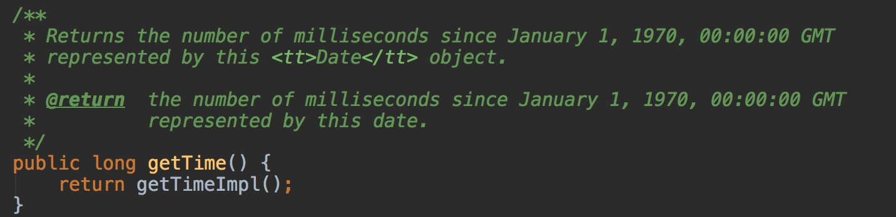

<!--ts-->
   * [1. 交换变量的三种方式](#1-交换变量的三种方式)
      * [1.1 通过第三个变量](#11-通过第三个变量)
      * [1.2通过通过相加的方式](#12通过通过相加的方式)
      * [3. 通过异或的方式](#3-通过异或的方式)
   * [2. 时间处理](#2-时间处理)
      * [时区](#时区)
      * [格林威治时间](#格林威治时间)
      * [时间戳](#时间戳)
      * [Date](#date)
      * [显示不同时区的时间](#显示不同时区的时间)
      * [Java 8与时区](#java-8与时区)
      * [总结](#总结)
      * [拓展知识](#拓展知识)
   * [3. SimpleDateFormat](#3-simpledateformat)
      * [前言](#前言)
      * [3.1 SimpleDateFormat用法](#31-simpledateformat用法)
      * [3.2 日期和时间模式表达方法](#32-日期和时间模式表达方法)
      * [3.3 输出不同时区的时间](#33-输出不同时区的时间)
      * [3.4 SimpleDateFormat线程安全性](#34-simpledateformat线程安全性)
         * [3.4.1 问题重现](#341-问题重现)
         * [3.4.2 线程不安全原因](#342-线程不安全原因)
         * [3.4.3 如何解决](#343-如何解决)
      * [3.5 总结](#35-总结)
   * [4. API-vs-SPI](#4-api-vs-spi)
      * [背景](#背景)
      * [理解](#理解)
      * [从面向接口编程说起](#从面向接口编程说起)
         * [1、接口位于【调用方】所在的包中](#1接口位于调用方所在的包中)
         * [2、接口位于【实现方】所在的包中](#2接口位于实现方所在的包中)
         * [3、接口位于独立的包中](#3接口位于独立的包中)
      * [Java类库中的实例](#java类库中的实例)
   * [5. 对象初始化顺序](#5-对象初始化顺序)

<!-- Added by: anapodoton, at: Thu Mar  5 00:14:49 CST 2020 -->

<!--te-->

# 1. 交换变量的三种方式

## 1.1 通过第三个变量

```java
public class Test{
    public static void main(String[] args) {
        int x = 5;
        int y = 10;
        swap(x,y);
        System.out.println(x);
        System.out.println(y);

        Value v = new Value(5,10);
        swap(v);
        System.out.println(v.x);
        System.out.println(v.y);
    }

    // 无效的交换：形参的改变无法反作用于实参
    public static void swap(int x,int y) {
        int temp = x;
        x = y;
        y = temp;
    }

    // 有效的交换：通过引用（变量指向一个对象）来修改成员变量
    public static void swap(Value value) {
        int temp = value.x;
        value.x = value.y;
        value.y = temp;
    }
}

class Value{
    int x;
    int y;

    public Value(int x,int y) {
        this.x = x;
        this.y = y;
    }
}
```

> 输出的结果：
> 5
> 10
> 10
> 5

这有点类似于C/C++语言中的指针，不过相对来说更加安全。

事实上，其实如果把基础类型int改成对应的包装类的话其实可以更加简单的完成这个操作，不过需要付出更多的内存代价。

##  1.2通过通过相加的方式

```java
public class Test{
    public static void main(String[] args) {
        Value v1 = new Value(5,10);
        swap(v1);
        System.out.println("v1交换之后的结果为：");
        System.out.println(v1.x);
        System.out.println(v1.y);
    }

    public static void swap(Value v) {
        v.x = v.x + v.y;
        v.y = v.x - v.y;
        v.x = v.x - v.y;
    }
}
```

> 输出的结果：
> v1的交换结果：
> 10
> 5

核心的算法就是swap方法:

```
v.x = v.x + v.y;    // 把v.x与v.y的和存储在v.x中
v.y = v.x - v.y;    // v.x减掉v.y本来的值即为v.x
v.x = v.x - v.y;    // v.x减掉v.y的值也就是以前x.y的值
```

这样就可以不通过临时变量，来达到交换两个变量的目的，如果觉得上面的方法不太容易理解，我们也可以用另一个参数z来表示上述过程：

```
int z = v.x + v.y;    // 把v.x与v.y的和存储在z中
v.y = z - v.y;        // z减掉以前的v.y就等于v.x
v.x = z - v.y;        // z减掉现在的v.y即以前的v.x，即为v.y
```

但并**不推荐这种做法**，原因在于当数值很大的时候，16进制的求和运算可能造成数据的溢出，虽然最后的结果依然会是我们所期望的那样，但仍然不是十分可取。

## 3. 通过异或的方式

位异或运算符（^）有这样的一个性质，就是两个整型的数据x与y，有：
`（x ^ y ^ y） == x`这说明，如果一个变量x异或另外一个变量y两次，结果为x。通过这一点，可以实现交换两个变量的值：

```
public class Test{
    public static void main(String[] args) {
        Value v1 = new Value(5,10);
        swap(v1);
        System.out.println("v1交换之后的结果为：");
        System.out.println(v1.x);
        System.out.println(v1.y);
    }

    public static void swap(Value v) {
        v.x = v.x ^ v.y;
        v.y = v.x ^ v.y;
        v.x = v.x ^ v.y;
    }
}
```

> 输出的结果：
> v1交换之后的结果为：
> 10
> 5

跟上面相加的方式过程几乎类似，只不过运算的方式不同而已。**异或的方法比相加更加可取的地方在于，异或不存在数据溢出。**

# 2. 时间处理

之前在我的知识星球的直面Java板块中，给粉丝们出了这样一道题：

**在Java中，如何获取不同时区的当前时间？**

你知道这道题的正确答案应该如何回答吗？背后的原理又是什么呢？

然后，紧接着，我又提出了以下问题：

**为什么以下代码无法得到美国时间。（在东八区的计算机上）**

```java
System.out.println(Calendar.getInstance(TimeZone.getTimeZone("America/Los_Angeles")).getTime());
```

接下来，本文就围绕这两个问题，来带领读者一起学习一下哪些和Java中的时间有关的概念。

## 时区

前面提到了时区，可能很多读者不知道什么是时区，先来简单介绍一下。

时区是地球上的区域使用同一个时间定义。以前，人们通过观察太阳的位置（时角）决定时间，这就使得不同经度的地方的时间有所不同（地方时）。1863年，首次使用时区的概念。时区通过设立一个区域的标准时间部分地解决了这个问题。

世界各个国家位于地球不同位置上，因此不同国家，特别是东西跨度大的国家日出、日落时间必定有所偏差。这些偏差就是所谓的时差。

为了照顾到各地区的使用方便，又使其他地方的人容易将本地的时间换算到别的地方时间上去。有关国际会议决定将地球表面按经线从东到西，划成一个个区域，并且规定相邻区域的时间相差1小时。在同一区域内的东端和西端的人看到太阳升起的时间最多相差不过1小时。当人们跨过一个区域，就将自己的时钟校正1小时（向西减1小时，向东加1小时），跨过几个区域就加或减几小时。这样使用起来就很方便。

现今全球共分为24个时区。由于实用上常常1个国家，或1个省份同时跨着2个或更多时区，为了照顾到行政上的方便，常将1个国家或1个省份划在一起。所以时区并不严格按南北直线来划分，而是按自然条件来划分。**例如，中国幅员宽广，差不多跨5个时区，但为了使用方便简单，实际上在只用东八时区的标准时即北京时间为准。**

## 格林威治时间

前面提到了，时区通过设立一个区域的标准时间部分地解决了不同地方看到的太阳位置不一样而无法定义时间的问题。那么这个标准时间是什么呢？

前面还提到。中国位于东八区，一般是用`GMT+8`来表示东八区这个时区。那么，看起来`GMT`就是这个所谓的标准时间。`GMT`是个什么东西呢？为什么要在他的基础上`+8`来表示东八区呢？

GMT，是Greenwich Mean Time的缩写，及格林尼治（格林威治）平时，是指位于英国伦敦郊区的皇家格林尼治天文台当地的平太阳时，因为本初子午线被定义为通过那里的经线。

自1924年2月5日开始，格林尼治天文台负责每隔一小时向全世界发放调时信息。国际天文学联合会于1928年决定，将由格林威治平子夜起算的平太阳时作为世界时，也就是通常所说的格林威治时间

一般使用GMT+8表示中国的时间，是因为中国位于东八区，时间上比格林威治时间快8个小时。

北京时间还可以用CST表示，即China Standard Time，又名中国标准时间，是中国的标准时间。当格林威治时间为凌晨0：00时，中国标准时间正好为上午8：00。

所以，有等式：`CST=GMT +8 小时`

## 时间戳

前面提到了全世界各个时区的时间可能都是不一样的，那么有没有一个什么样的办法可以不受时区的限制，可以精确的表示时间呢。

其实是有的，这个方法就是时间戳。

时间戳（timestamp），一个能表示一份数据在某个特定时间之前已经存在的、 完整的、 可验证的数据,通常是一个字符序列，唯一地标识某一刻的时间。

**时间戳是指格林威治时间1970年01月01日00时00分00秒起至现在的总秒数。**

有了时间戳，无论我们深处哪个时区，从格林威治时间1970年01月01日00时00分00秒到现在这一时刻的总秒数应该是一样的。所以说，时间戳是一份能够表示一份数据在一个特定时间点已经存在的完整的可验证的数据。

**1970-01-01**

不知道大家有没有注意到一个比较特殊的时间，1970-01-01，相信每一个开发者对这个时间都并不陌生。一般如果软件系统中出现这个时间的时候，代表着出现了网络故障、线上bug等。



当有些计算机存储或者传输时间戳出错时，这个时间戳就会取默认值。而在计算机中，默认值通常是 0。

当 Timestamp 为 0，就表示时间（GMT）1970年1月1日0时0分0秒。中国使用北京时间，处于东 8 区，相应就是早上 8 点。因此在中国这边，时间出错了，就经常会显示成 1970年1月1日 08:00。

```
System.out.println(new Date(0));
//Thu Jan 01 08:00:00 CST 1970
```

当我们在Java代码中使用new Date(0)来创建时间的时候，得到的结果就是`Thu Jan 01 08:00:00 CST 1970`，既1970年1月1日 上午08点整。

## Date

前面提到了`java.util.Java`中的Date类，这个类通常用来表示时间。你可以通过getTime()方法访问java.util.Date实例的日期和时间，比如像这样：

```
Date date = new Date();
long time = date.getTime();
```

以上代码，其实得到的就是时间戳，在源码中也有明确的表述：



所以，我们就可以认为`java.util.Java`其实表示的就是从格林威治1970年1月1日零点到现在这一时刻的总秒数。

从Date的源码中也可以看到，**Date中是不包含时区有关的信息的，因为时间戳和时区没有关系。**

那么，如果想要把一个时间戳转换成不同时区的时间输出应该怎么做呢？

## 显示不同时区的时间

想要把时间戳转换成对应时区的时间，总要有个地方可以获取时区吧。其实，我们的计算机中是有时区相关的信息的。

无论我们使用的是哪种操作系统的电脑，都是可以查看时间的，而一般情况下，我们拿到的电脑都会展示中国时间，那是因为操作系统中已经设置了一个默认时区。

其实，Java中的时区信息也是从操作系统中取到的，默认情况下会使用操作系统的时区。

当我们使用`System.out.println`来输出一个时间的时候，他会调用Date类的toString方法，而该方法会读取操作系统的默认时区来进行时间的转换。

```java
public String toString() {
    // "EEE MMM dd HH:mm:ss zzz yyyy";
    BaseCalendar.Date date = normalize();
    ...
}

private final BaseCalendar.Date normalize() {
    ...
    TimeZone tz = TimeZone.getDefaultRef();
    if (tz != cdate.getZone()) {
        cdate.setZone(tz);
        CalendarSystem cal = getCalendarSystem(cdate);
        cal.getCalendarDate(fastTime, cdate);
    }
    return cdate;
}

static TimeZone getDefaultRef() {
    TimeZone defaultZone = defaultTimeZone;
    if (defaultZone == null) {
        // Need to initialize the default time zone.
        defaultZone = setDefaultZone();
        assert defaultZone != null;
    }
    // Don't clone here.
    return defaultZone;
}
```

主要代码如上。也就是说如果我们想要通过`System.out.println`输出一个Date类的时候，输出美国洛杉矶时间的话，就需要想办法把`defaultTimeZone`改为`America/Los_Angeles`，这个方法就是：

```
TimeZone.setDefault(TimeZone.getTimeZone("America/Los_Angeles"));
```

所以，当我们想要输出美国洛杉矶时间时，可以选择这种方式：

```
TimeZone.setDefault(TimeZone.getTimeZone("America/Los_Angeles"));
Date date = new Date();
System.out.println(date);
```

还有一种方式，就是通过SimpleDateFormat来处理，这种方式我们在[你真的会使用SimpleDateFormat吗](https://www.hollischuang.com/archives/3017)中也介绍过。这里就不再展开了。

接下来，我们再回到文章开始的那个问题：

**为什么以下代码无法得到美国时间。（在东八区的计算机上）**

```
System.out.println(Calendar.getInstance(TimeZone.getTimeZone("America/Los_Angeles")).getTime());
```

其实答案前面也已经说过了，我们通过查看`Date.toString`的源码，发现在输出的过程中该方法只会去获取系统的默认时区，只有修改了默认时区才会显示该时区的时间。

但是，通过阅读Calendar的源码，我们可以发现，`getInstance`方法虽然有一个参数可以传入时区，但是并没有将默认时区设置成传入的时区。

而在Calendar.getInstance.getTime后得到的时间只是一个时间戳，其中未保留任何和时区有关的信息，所以，在输出时，还是显示的是当前系统默认时区的时间。

## Java 8与时区

了解Java8 的朋友可能都知道，Java8提供了一套新的时间处理API，这套API比以前的时间处理API要友好的多。

Java8 中加入了对时区的支持，带时区的时间为分别为：ZonedDate、ZonedTime、ZonedDateTime。其中每个时区都对应着 ID，地区ID都为 “{区域}/{城市}”的格式，如`Asia/Shanghai`、`America/Los_Angeles`等。

在Java8中，直接使用以下代码即可输出美国洛杉矶的时间：

```
LocalDateTime now = LocalDateTime.now(ZoneId.of("America/Los_Angeles"));
System.out.println(now);
```

## 总结

世界上有很多时区，不同的时区的时间不一样，中国使用东八区的时间作为标准时间。美国自东海岸至西海岸横跨西五区至西十区，共六个时区。

所谓东八区，一般表示成`GMT+8`，这里的GMT指的是格林威治时间。计算机中经常使用时间戳来表示时间，时间戳指的就是当前时间举例格林威治的1970-01-01 00：00：00的总秒数。

而Java中的Date类中是不包含时区信息的，在使用`System.out.println`打印Date的时候，回调用Date.toString方法，该方法会获取系统的默认时区来转换时间。

在Java8中可以使用ZonedTime、ZonedDate和ZonedDateTime来表示带有时区信息的时间。

## 拓展知识

**什么是冬令时？什么是夏令时？**

夏令时、冬令时的出现，是为了充分利用夏天的日照，所以时钟要往前拨快一小时，冬天再把表往回拨一小时。其中夏令时从3月第二个周日持续到11月第一个周日。

冬令时：北京和洛杉矶时差16小时，北京和纽约时差13小时。 夏令时：北京和洛杉矶时差12小时，北京和纽约时差15小时。

**CET,UTC,GMT,CST几种常见时间的含义和关系？**

CET，欧洲中部时间（英語：Central European Time，CET）是比世界标准时间（UTC）早一个小时的时区名称之一。

UTC，协调世界时，又称世界标准时间或世界协调时间，简称UTC。

GMT，格林尼治标准时间，是指位于英国伦敦郊区的皇家格林尼治天文台的标准时间，因为本初子午线被定义在通过那里的经线。

CST，北京时间，China Standard Time，又名中国标准时间，是中国的标准时间。

CET=UTC/GMT + 1小时、CST=UTC/GMT +8 小时、CST=CET+9

# 3. SimpleDateFormat

## 前言

在日常开发中，我们经常会用到时间，我们有很多办法在Java代码中获取时间。但是不同的方法获取到的时间的格式都不尽相同，这时候就需要一种格式化工具，把时间显示成我们需要的格式。

最常用的方法就是使用SimpleDateFormat类。这是一个看上去功能比较简单的类，但是，一旦使用不当也有可能导致很大的问题。

在阿里巴巴Java开发手册中，有如下明确规定：


那么，本文就围绕SimpleDateFormat的用法、原理等来深入分析下如何以正确的姿势使用它。

## 3.1 SimpleDateFormat用法

SimpleDateFormat是Java提供的一个格式化和解析日期的工具类。它允许进行格式化（日期 -> 文本）、解析（文本 -> 日期）和规范化。SimpleDateFormat 使得可以选择任何用户定义的日期-时间格式的模式。

在Java中，可以使用SimpleDateFormat的format方法，将一个Date类型转化成String类型，并且可以指定输出格式。

```java
// Date转String
Date data = new Date();
SimpleDateFormat sdf = new SimpleDateFormat("yyyy-MM-dd HH:mm:ss");
String dataStr = sdf.format(data);
System.out.println(dataStr);
```

以上代码，转换的结果是：2018-11-25 13:00:00，日期和时间格式由”日期和时间模式”字符串指定。如果你想要转换成其他格式，只要指定不同的时间模式就行了。

在Java中，可以使用SimpleDateFormat的parse方法，将一个String类型转化成Date类型。

```
// String转Data
System.out.println(sdf.parse(dataStr));
```

## 3.2 日期和时间模式表达方法

在使用SimpleDateFormat的时候，需要通过字母来描述时间元素，并组装成想要的日期和时间模式。常用的时间元素和字母的对应表如下：



模式字母通常是重复的，其数量确定其精确表示。如下表是常用的输出格式的表示方法。



## 3.3 输出不同时区的时间

时区是地球上的区域使用同一个时间定义。以前，人们通过观察太阳的位置（时角）决定时间，这就使得不同经度的地方的时间有所不同（地方时）。1863年，首次使用时区的概念。时区通过设立一个区域的标准时间部分地解决了这个问题。

世界各个国家位于地球不同位置上，因此不同国家，特别是东西跨度大的国家日出、日落时间必定有所偏差。这些偏差就是所谓的时差。

现今全球共分为24个时区。由于实用上常常1个国家，或1个省份同时跨着2个或更多时区，为了照顾到行政上的方便，常将1个国家或1个省份划在一起。所以时区并不严格按南北直线来划分，而是按自然条件来划分。例如，中国幅员宽广，差不多跨5个时区，但为了使用方便简单，实际上在只用东八时区的标准时即北京时间为准。

由于不同的时区的时间是不一样的，甚至同一个国家的不同城市时间都可能不一样，所以，在Java中想要获取时间的时候，要重点关注一下时区问题。

默认情况下，如果不指明，在创建日期的时候，会使用当前计算机所在的时区作为默认时区，这也是为什么我们通过只要使用`new Date()`就可以获取中国的当前时间的原因。

那么，如何在Java代码中获取不同时区的时间呢？SimpleDateFormat可以实现这个功能。

```java
SimpleDateFormat sdf = new SimpleDateFormat("yyyy-MM-dd HH:mm:ss");
sdf.setTimeZone(TimeZone.getTimeZone("America/Los_Angeles"));
System.out.println(sdf.format(Calendar.getInstance().getTime()));
```

以上代码，转换的结果是： 2018-11-24 21:00:00 。既中国的时间是11月25日的13点，而美国洛杉矶时间比中国北京时间慢了16个小时（这还和冬夏令时有关系，就不详细展开了）。

> 如果你感兴趣，你还可以尝试打印一下美国纽约时间（America/New_York）。纽约时间是2018-11-25 00:00:00。纽约时间比中国北京时间早了13个小时。

当然，这不是显示其他时区的唯一方法，不过本文主要为了介绍SimpleDateFormat，其他方法暂不介绍了。

## 3.4 SimpleDateFormat线程安全性

由于SimpleDateFormat比较常用，而且在一般情况下，一个应用中的时间显示模式都是一样的，所以很多人愿意使用如下方式定义SimpleDateFormat：

```java
public class Main {

    private static SimpleDateFormat simpleDateFormat = new SimpleDateFormat("yyyy-MM-dd HH:mm:ss");

    public static void main(String[] args) {
        simpleDateFormat.setTimeZone(TimeZone.getTimeZone("America/New_York"));
        System.out.println(simpleDateFormat.format(Calendar.getInstance().getTime()));
    }
}
```

**这种定义方式，存在很大的安全隐患。**

### 3.4.1 问题重现

我们来看一段代码，以下代码使用线程池来执行时间输出。

```java
   /** * @author Hollis */ 
   public class Main {

    /**
     * 定义一个全局的SimpleDateFormat
     */
    private static SimpleDateFormat simpleDateFormat = new SimpleDateFormat("yyyy-MM-dd HH:mm:ss");

    /**
     * 使用ThreadFactoryBuilder定义一个线程池
     */
    private static ThreadFactory namedThreadFactory = new ThreadFactoryBuilder()
        .setNameFormat("demo-pool-%d").build();

    private static ExecutorService pool = new ThreadPoolExecutor(5, 200,
        0L, TimeUnit.MILLISECONDS,
        new LinkedBlockingQueue<Runnable>(1024), namedThreadFactory, new ThreadPoolExecutor.AbortPolicy());

    /**
     * 定义一个CountDownLatch，保证所有子线程执行完之后主线程再执行
     */
    private static CountDownLatch countDownLatch = new CountDownLatch(100);

    public static void main(String[] args) {
        //定义一个线程安全的HashSet
        Set<String> dates = Collections.synchronizedSet(new HashSet<String>());
        for (int i = 0; i < 100; i++) {
            //获取当前时间
            Calendar calendar = Calendar.getInstance();
            int finalI = i;
            pool.execute(() -> {
                    //时间增加
                    calendar.add(Calendar.DATE, finalI);
                    //通过simpleDateFormat把时间转换成字符串
                    String dateString = simpleDateFormat.format(calendar.getTime());
                    //把字符串放入Set中
                    dates.add(dateString);
                    //countDown
                    countDownLatch.countDown();
            });
        }
        //阻塞，直到countDown数量为0
        countDownLatch.await();
        //输出去重后的时间个数
        System.out.println(dates.size());
    }
}
```

以上代码，其实比较简单，很容易理解。就是循环一百次，每次循环的时候都在当前时间基础上增加一个天数（这个天数随着循环次数而变化），然后把所有日期放入一个**线程安全的**、**带有去重功能**的Set中，然后输出Set中元素个数。

> 上面的例子我特意写的稍微复杂了一些，不过我几乎都加了注释。这里面涉及到了[线程池的创建](https://www.hollischuang.com/archives/2888)、[CountDownLatch](https://www.hollischuang.com/archives/290)、lambda表达式、线程安全的HashSet等知识。感兴趣的朋友可以逐一了解一下。

正常情况下，以上代码输出结果应该是100。但是实际执行结果是一个小于100的数字。

原因就是因为SimpleDateFormat作为一个非线程安全的类，被当做了共享变量在多个线程中进行使用，这就出现了线程安全问题。

在阿里巴巴Java开发手册的第一章第六节——并发处理中关于这一点也有明确说明：


那么，接下来我们就来看下到底是为什么，以及该如何解决。

### 3.4.2 线程不安全原因

通过以上代码，我们发现了在并发场景中使用SimpleDateFormat会有线程安全问题。其实，JDK文档中已经明确表明了SimpleDateFormat不应该用在多线程场景中：

> Date formats are not synchronized. It is recommended to create separate format instances for each thread. If multiple threads access a format concurrently, it must be synchronized externally.

那么接下来分析下为什么会出现这种问题，SimpleDateFormat底层到底是怎么实现的？

我们跟一下SimpleDateFormat类中format方法的实现其实就能发现端倪。



SimpleDateFormat中的format方法在执行过程中，会使用一个成员变量calendar来保存时间。这其实就是问题的关键。

由于我们在声明SimpleDateFormat的时候，使用的是static定义的。那么这个SimpleDateFormat就是一个共享变量，随之，SimpleDateFormat中的calendar也就可以被多个线程访问到。

假设线程1刚刚执行完`calendar.setTime`把时间设置成2018-11-11，还没等执行完，线程2又执行了`calendar.setTime`把时间改成了2018-12-12。这时候线程1继续往下执行，拿到的`calendar.getTime`得到的时间就是线程2改过之后的。

除了format方法以外，SimpleDateFormat的parse方法也有同样的问题。

所以，不要把SimpleDateFormat作为一个共享变量使用。

### 3.4.3 如何解决

前面介绍过了SimpleDateFormat存在的问题以及问题存在的原因，那么有什么办法解决这种问题呢？

解决方法有很多，这里介绍三个比较常用的方法。

**使用局部变量**

```java
for (int i = 0; i < 100; i++) {
    //获取当前时间
    Calendar calendar = Calendar.getInstance();
    int finalI = i;
    pool.execute(() -> {
        // SimpleDateFormat声明成局部变量
    SimpleDateFormat simpleDateFormat = new SimpleDateFormat("yyyy-MM-dd HH:mm:ss");
        //时间增加
        calendar.add(Calendar.DATE, finalI);
        //通过simpleDateFormat把时间转换成字符串
        String dateString = simpleDateFormat.format(calendar.getTime());
        //把字符串放入Set中
        dates.add(dateString);
        //countDown
        countDownLatch.countDown();
    });
}
```

SimpleDateFormat变成了局部变量，就不会被多个线程同时访问到了，就避免了线程安全问题。

**加同步锁**

除了改成局部变量以外，还有一种方法大家可能比较熟悉的，就是对于共享变量进行加锁。

```java
for (int i = 0; i < 100; i++) {
    //获取当前时间
    Calendar calendar = Calendar.getInstance();
    int finalI = i;
    pool.execute(() -> {
        //加锁
        synchronized (simpleDateFormat) {
            //时间增加
            calendar.add(Calendar.DATE, finalI);
            //通过simpleDateFormat把时间转换成字符串
            String dateString = simpleDateFormat.format(calendar.getTime());
            //把字符串放入Set中
            dates.add(dateString);
            //countDown
            countDownLatch.countDown();
        }
    });
}
```

通过加锁，使多个线程排队顺序执行。避免了并发导致的线程安全问题。

其实以上代码还有可以改进的地方，就是可以把锁的粒度再设置的小一点，可以只对`simpleDateFormat.format`这一行加锁，这样效率更高一些。

**使用ThreadLocal**

第三种方式，就是使用 ThreadLocal。 ThreadLocal 可以确保每个线程都可以得到单独的一个 SimpleDateFormat 的对象，那么自然也就不存在竞争问题了。

```java
/**
 * 使用ThreadLocal定义一个全局的SimpleDateFormat
 */
private static ThreadLocal<SimpleDateFormat> simpleDateFormatThreadLocal = new ThreadLocal<SimpleDateFormat>() {
    @Override
    protected SimpleDateFormat initialValue() {
        return new SimpleDateFormat("yyyy-MM-dd HH:mm:ss");
    }
};

//用法
String dateString = simpleDateFormatThreadLocal.get().format(calendar.getTime());
```

用 ThreadLocal 来实现其实是有点类似于缓存的思路，每个线程都有一个独享的对象，避免了频繁创建对象，也避免了多线程的竞争。

当然，以上代码也有改进空间，就是，其实SimpleDateFormat的创建过程可以改为延迟加载。这里就不详细介绍了。

**使用DateTimeFormatter**

如果是Java8应用，可以使用DateTimeFormatter代替SimpleDateFormat，这是一个线程安全的格式化工具类。就像官方文档中说的，这个类 simple beautiful strong immutable thread-safe。

```java
//解析日期
String dateStr= "2016年10月25日";
DateTimeFormatter formatter = DateTimeFormatter.ofPattern("yyyy年MM月dd日");
LocalDate date= LocalDate.parse(dateStr, formatter);

//日期转换为字符串
LocalDateTime now = LocalDateTime.now();
DateTimeFormatter format = DateTimeFormatter.ofPattern("yyyy年MM月dd日 hh:mm a");
String nowStr = now .format(format);
System.out.println(nowStr);
```

## 3.5 总结

本文介绍了SimpleDateFormat的用法，SimpleDateFormat主要可以在String和Date之间做转换，还可以将时间转换成不同时区输出。同时提到在并发场景中SimpleDateFormat是不能保证线程安全的，需要开发者自己来保证其安全性。

主要的几个手段有改为局部变量、使用synchronized加锁、使用Threadlocal为每一个线程单独创建一个等。

希望通过此文，你可以在使用SimpleDateFormat的时候更加得心应手。

# 4. API-vs-SPI

## 背景

Java 中区分 API 和 SPI，通俗的讲：API 和 SPI 都是相对的概念，他们的差别只在语义上，API 直接被应用开发人员使用，SPI 被框架扩展人员使用

## 理解

API （Application Programming Interface）

- 大多数情况下，都是**实现方**来制定接口并完成对接口的不同实现，**调用方**仅仅依赖却无权选择不同实现。

SPI (Service Provider Interface)

- 而如果是**调用方**来制定接口，**实现方**来针对接口来实现不同的实现。**调用方**来选择自己需要的实现方。

## 从面向接口编程说起


当我们选择在**调用方** 和 **实现方** 中间引入 接口。上图没有给出“接口”应该位于哪个“包”中，从纯粹的可能性上考虑，我们有三种选择：

1. 接口位于**实现方**所在的包中
2. 接口位于**调用方**所在的包中
3. 接口位于独立的包中

### 1、接口位于【调用方】所在的包中

对于类似这种情况下接口，我们将其称为 SPI, SPI的规则如下：

- 概念上更依赖调用方。
- 组织上位于调用方所在的包中。
- 实现位于独立的包中。

常见的例子是：插件模式的插件。如：

- 数据库驱动 Driver
- 日志 Log
- dubbo扩展点开发

### 2、接口位于【实现方】所在的包中

对于类似这种情况下的接口，我们将其称作为API，API的规则如下：

- 概念上更接近实现方。
- 组织上位于实现方所在的包中。

### 3、接口位于独立的包中

如果一个“接口”在一个上下文是API，在另一个上下文是SPI，那么你就可以这么组织

需要注意的事项 
SPI 和 API 也不一定是接口，我这里都是指狭义的具体的接口。


## Java类库中的实例

```java
Class.forName("com.mysql.jdbc.Driver");
Connection conn = DriverManager.getConnection(

              "jdbc:mysql://localhost:3306/test", "root", "123456");
Statement stmt = conn.createStatement();

ResultSet rs = stmt.executeQuery("select * from Users");12345678
```

说明：java.sql.Driver 是 Spi，com.mysql.jdbc.Driver 是 Spi 实现，其它的都是 Api。

# 5. 对象初始化顺序

不考虑静态成员的初始化，调用一个对象的构造函数时，程序**先调用父类的构造函数**（可以通过super关键字指定父类的构造函数，否则默认调用无参的构造函数，并且需要在子类的构造函数的第一行调用），**之后静态成员变量的初始化函数和静态初始化块则按照在代码当中的顺序执行**，成员变量如果没有指定值的话则赋予默认值，即基本数据类型为0或false等，对象则为null；**最后调用自身构造函数。**

> - 我们可以写一段程序来对初始化顺序进行一个简单的验证：

```
public class Derive extends Base
{
    private Member m1 = new Member("Member 1");
    {
        System.out.println("Initial Block()");
    }

    public Derive() {
        System.out.println("Derive()");
    }

    private Member m2 = new Member("Member 2");
    private int i = getInt();

    private int getInt()
    {
        System.out.println("getInt()");
        return 2;
    }

    public static void main(String[] args)
    {
        new Derive();
    }
}

class Base
{
    public Base()
    {
        System.out.println("Base()");
    }
}

class Member
{
    public Member(String m)
    {
        System.out.println("Member() "+m);
    }
}
```

> 程序的输出结果是：
> Base()
> Member() Member 1
> Initial Block()
> Member() Member 2
> getInt()
> Derive()
