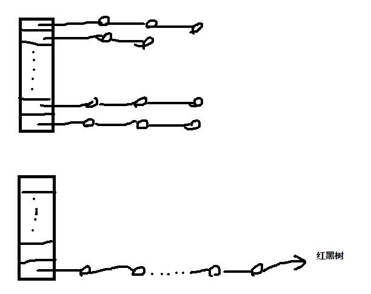

#### 1）说说常见的集合有哪些吧？

答：Map接口和Collection接口是所有集合框架的父接口：

1. Collection接口的子接口包括：Set接口和List接口
2. Map接口的实现类主要有：HashMap、TreeMap、Hashtable、ConcurrentHashMap以及Properties等
3. Set接口的实现类主要有：HashSet、TreeSet、LinkedHashSet等
4. List接口的实现类主要有：ArrayList、LinkedList、Stack以及Vector等

#### 2）HashMap和Hashtable的区别有哪些？（必问）

答：

1. HashMap没有考虑同步，是线程不安全的；Hashtable使用了synchronized关键字，是线程安全的；
2. 前者允许null作为Key；后者不允许null作为Key

#### 3）HashMap的底层实现你知道吗？

答：在Java8之前，其底层实现是数组+链表实现，Java8使用了数组+链表+红黑树实现。此时你可以简单的在纸上画图分析：



#### 4）ConcurrentHashMap 和 Hashtable 的区别？（必问）

**答：ConcurrentHashMap 结合了 HashMap 和 HashTable 二者的优势。HashMap 没有考虑同步，HashTable 考虑了同步的问题。但是 HashTable 在每次同步执行时都要锁住整个结构。 ConcurrentHashMap 锁的方式是稍微细粒度的。 ConcurrentHashMap 将 hash 表分为 16 个桶（默认值），诸如get,put,remove 等常用操作只锁当前需要用到的桶。**

**面试官：ConcurrentHashMap的具体实现知道吗？**

**答：**

**1. 该类包含两个静态内部类 HashEntry 和 Segment ；前者用来封装映射表的键值对，后者用来充当锁的角色；**

**2. Segment 是一种可重入的锁 ReentrantLock，每个 Segment 守护一个HashEntry 数组里得元素，当对 HashEntry 数组的数据进行修改时，必须首先获得对应的 Segment 锁。**

#### 5）HashMap 的长度为什么是2的幂次方？

**答：**

**1. 通过将 Key 的 hash 值与 length - 1 进行 & 运算，实现了当前 Key 的定位，2 的幂次方可以减少冲突（碰撞）的次数，提高 HashMap 查询效率**

**2. 如果 length 为 2 的次幂 则 length-1 转化为二进制必定是 11111……的形式，在于 h 的二进制与操作效率会非常的快，而且空间不浪费；如果 length 不是 2 的次幂，比如 length 为 15，则 length - 1 为 14，对应的二进制为 1110，在于 h 与操作，最后一位都为 0 ，而 0001，0011，0101，1001，1011，0111，1101 这几个位置永远都不能存放元素了，空间浪费相当大，更糟的是这种情况中，数组可以使用的位置比数组长度小了很多，这意味着进一步增加了碰撞的几率，减慢了查询的效率！这样就会造成空间的浪费。**

#### 6）List和Set的区别是啥？

**答：List元素是有序的，可以重复；Set元素是无序的，不可以重复。**

#### 7）List、Set和Map的初始容量和加载因子：

**答：**

**1. List**

- **ArrayList的初始容量是10；加载因子为0.5； 扩容增量：原容量的 0.5倍+1；一次扩容后长度为15。**
- **Vector初始容量为10，加载因子是1。扩容增量：原容量的 1倍，如 Vector的容量为10，一次扩容后是容量为20。**

**2. Set**

**HashSet，初始容量为16，加载因子为0.75； 扩容增量：原容量的 1 倍； 如 HashSet的容量为16，一次扩容后容量为32**

**3. Map**

**HashMap，初始容量16，加载因子为0.75； 扩容增量：原容量的 1 倍； 如 HashMap的容量为16，一次扩容后容量为32**

#### 8）Comparable接口和Comparator接口有什么区别？

**答：**

**1. 前者简单，但是如果需要重新定义比较类型时，需要修改源代码。**

**2. 后者不需要修改源代码，自定义一个比较器，实现自定义的比较方法。 具体解析参考博客：Java集合框架—Set**

#### 9）Java集合的快速失败机制 “fail-fast”

**答：**

**是java集合的一种错误检测机制，当多个线程对集合进行结构上的改变的操作时，有可能会产生 fail-fast 机制。**

**例如：假设存在两个线程（线程1、线程2），线程1通过Iterator在遍历集合A中的元素，在某个时候线程2修改了集合A的结构（是结构上面的修改，而不是简单的修改集合元素的内容），那么这个时候程序就会抛出 ConcurrentModificationException 异常，从而产生fail-fast机制。**

**原因：迭代器在遍历时直接访问集合中的内容，并且在遍历过程中使用一个 modCount 变量。集合在被遍历期间如果内容发生变化，就会改变modCount的值。每当迭代器使用hashNext()/next()遍历下一个元素之前，都会检测modCount变量是否为expectedmodCount值，是的话就返回遍历；否则抛出异常，终止遍历。**

**解决办法：**

**1. 在遍历过程中，所有涉及到改变modCount值得地方全部加上synchronized。**

**2. 使用CopyOnWriteArrayList来替换ArrayList**

#### 10）ArrayList 和 Vector 的区别

答：

这两个类都实现了 List 接口（List 接口继承了 Collection 接口），他们都是有序集合，即存储在这两个集合中的元素位置都是有顺序的，相当于一种动态的数组，我们以后可以按位置索引来取出某个元素，并且其中的数据是允许重复的，这是与 HashSet 之类的集合的最大不同处，HashSet 之类的集合不可以按索引号去检索其中的元素，也不允许有重复的元素。

ArrayList 与 Vector 的区别主要包括两个方面：

1. 同步性：
   Vector 是线程安全的，也就是说它的方法之间是线程同步（加了synchronized 关键字）的，而 ArrayList 是线程不安全的，它的方法之间是线程不同步的。如果只有一个线程会访问到集合，那最好是使用 ArrayList，因为它不考虑线程安全的问题，所以效率会高一些；如果有多个线程会访问到集合，那最好是使用 Vector，因为不需要我们自己再去考虑和编写线程安全的代码。
2. 数据增长：
   ArrayList 与 Vector 都有一个初始的容量大小，当存储进它们里面的元素的个人超过了容量时，就需要增加 ArrayList 和 Vector 的存储空间，每次要增加存储空间时，不是只增加一个存储单元，而是增加多个存储单元，每次增加的存储单元的个数在内存空间利用与程序效率之间要去的一定的平衡。Vector 在数据满时（加载因子1）增长为原来的两倍（扩容增量：原容量的 1 倍），而 ArrayList 在数据量达到容量的一半时（加载因子 0.5）增长为原容量的 0.5 倍 + 1 个空间。

**面试官：那 ArrayList 和 LinkedList 的区别呢？**

答：

1. LinkedList 实现了 List 和 Deque 接口，一般称为双向链表；
2. LinkedList 在插入和删除数据时效率更高，ArrayList 在查找某个 index 的数据时效率更高；
3. LinkedList 比 ArrayList 需要更多的内存；

**面试官：Array 和 ArrayList 有什么区别？什么时候该应 Array 而不是 ArrayList 呢？**

答：它们的区别是：

1. Array 可以包含基本类型和对象类型，ArrayList 只能包含对象类型。
2. Array 大小是固定的，ArrayList 的大小是动态变化的。
3. ArrayList 提供了更多的方法和特性，比如：addAll()，removeAll()，iterator() 等等。

对于基本类型数据，集合使用自动装箱来减少编码工作量。但是，当处理固定大小的基本数据类型的时候，这种方式相对比较慢。

#### 11）如何去掉一个 Vector 集合中重复的元素？

答：

```
Vector newVector = new Vector();
for (int i = 0; i < vector.size(); i++) {
    Object obj = vector.get(i);
    if (!newVector.contains(obj)) {
        newVector.add(obj);
    }
}
```

还有一种简单的方式，利用了 Set 不允许重复元素的特性：

```
HashSet set = new HashSet(vector);
```

> 小结：本小节是 Java 中关于集合的考察，是 Java 岗位面试中必考的知识点，除了应该掌握以上的问题，包括各个集合的底层实现也建议各位同学阅读，加深理解。

#### 12）如何权衡是使用无序的数组还是有序的数组？

答：有序数组最大的好处在于查找的时间复杂度是O(log n)，而无序数组是O(n)。有序数组的缺点是插入操作的时间复杂度是O(n)，因为值大的元素需要往后移动来给新元素腾位置。相反，无序数组的插入时间复杂度是常量O(1)。