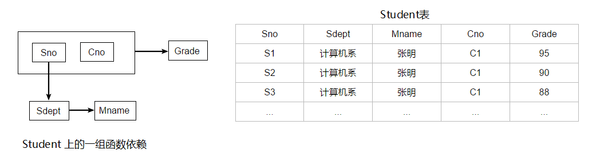

<!--ts-->
   * [1. 什么是存储过程？有哪些优缺点？@](#1-什么是存储过程有哪些优缺点)
   * [2. 三大范式 @@](#2-三大范式-)
   * [3. 数据库索引 @@@@@](#3-数据库索引-)
      * [3.1 什么是索引？](#31-什么是索引)
      * [3.2 底层数据结构是什么，为什么使用这种数据结构？](#32-底层数据结构是什么为什么使用这种数据结构)
      * [3.3 索引的分类？](#33-索引的分类)
      * [3.4 索引的优缺点？](#34-索引的优缺点)
      * [3.5 什么样的字段适合创建索引？](#35-什么样的字段适合创建索引)
      * [3.6 创建索引时需要注意什么？](#36-创建索引时需要注意什么)
   * [4. 听说过事务吗？@@@@@](#4-听说过事务吗)
      * [4.1 实例说明：](#41-实例说明)
      * [4.2 事务的并发问题有哪几种？](#42-事务的并发问题有哪几种)
      * [4.3 事务的隔离级别有哪几种？](#43-事务的隔离级别有哪几种)
   * [5. 什么是视图？以及视图的使用场景有哪些？](#5-什么是视图以及视图的使用场景有哪些)
   * [6. drop,delete与truncate的区别？](#6-dropdelete与truncate的区别)
   * [7. 触发器的作用？](#7-触发器的作用)
   * [8. 数据库的乐观锁和悲观锁是什么？@@@@](#8-数据库的乐观锁和悲观锁是什么)
      * [8.1 悲观锁](#81-悲观锁)
      * [8.2 乐观锁](#82-乐观锁)
   * [9. 超键、候选键、主键、外键分别是什么？](#9-超键候选键主键外键分别是什么)
   * [10. SQL 约束有哪几种？](#10-sql-约束有哪几种)
   * [11. MySQL存储引擎中的MyISAM和InnoDB区别详解 @@@](#11-mysql存储引擎中的myisam和innodb区别详解-)
      * [11.1 MyIASM和Innodb两种引擎所使用的索引的数据结构是什么？](#111-myiasm和innodb两种引擎所使用的索引的数据结构是什么)
   * [12. varchar和char的区别](#12-varchar和char的区别)
   * [13. 主键、自增主键、主键索引与唯一索引概念区别](#13-主键自增主键主键索引与唯一索引概念区别)
   * [14. 主键就是聚集索引吗？主键和索引有什么区别？](#14-主键就是聚集索引吗主键和索引有什么区别)
   * [15. 实践中如何优化MySQL @@@@@](#15-实践中如何优化mysql-)
      * [15.1 SQL语句优化：](#151-sql语句优化)
      * [15.2 索引优化：](#152-索引优化)
      * [15.3  数据库表结构的优化：](#153--数据库表结构的优化)
      * [15.4  系统配置的优化：](#154--系统配置的优化)
      * [15.5  硬件的优化：](#155--硬件的优化)
   * [16. <em>数据库中 Where、group by、having 关键字</em>](#16-数据库中-wheregroup-byhaving-关键字)

<!-- Added by: anapodoton, at: Thu Mar  5 20:54:48 CST 2020 -->

<!--te-->

# 1. 什么是存储过程？有哪些优缺点？@

**存储过程就像是编程语言中的函数一样，封装了我们的代码（PLSQL，T-SQL）**

例如：

```java
-------------创建名为GetUserAccount的存储过程----------------
create Procedure GetUserAccount
as
select * from UserAccount
go

-------------执行上面的存储过程----------------
exec GetUserAccount
```

存储过程的优点：

- **能够将代码封装起来**
- **保存在数据库之中**
- **让编程语言进行调用**
- **存储过程是一个预编译的代码块，执行效率比较高**
- **一个存储过程替代大量T_SQL语句 ，可以降低网络通信量，提高通信速率**

存储过程的缺点：

- **每个数据库的存储过程语法几乎都不一样，十分难以维护（不通用）**
- **业务逻辑放在数据库上，难以迭代**

# 2. 三大范式 @@

> - 思考这样的一个例子：

我们现在需要建立一个描述学校教务的数据库，该数据库涉及的对象包括学生的学号（Sno）、所在系（Sdept）、系主任姓名（Mname）、课程号（Cno）和成绩（Grade），假设我们使用单一的关系模式 Student 来表示，那么根据现实世界已知的信息，会描述成以下这个样子：



但是，这个关系模式存在以下问题：

**（1） 数据冗余**
比如，每一个系的系主任姓名重复出现，重复次数与该系所有学生的所有课程成绩出现次数相同，这将浪费大量的存储空间。
**（2）更新异常（update anomalies）**
由于数据冗余，当更新数据库中的数据时，系统要付出很大的代价来维护数据库的完整性，否则会面临数据不一致的危险。比如，某系更换系主任后，必须修改与该系学生有关的每一个元组。
**（3）插入异常（insertion anomalies）**
如果一个系刚成立，尚无学生，则无法把这个系及其系主任的信息存入数据库。
**（4）删除异常（deletion anomalies）**
如果某个系的学生全部毕业了，则在删除该系学生信息的同时，这个系及其系主任的信息也丢失了。

- **总结：** 所以，我们在设计数据库的时候，就需要满足一定的规范要求，而满足不同程度要求的就是不同的范式。

> - **第一范式：** 列不可分

1NF（第一范式）是对属性具有**原子性**的要求，不可再分，例如：


如果认为最后一列还可以再分成出生年，出生月，出生日，则它就不满足第一范式的要求。

> - **第二范式：** 消除非主属性对码的部分函数依赖

2NF（第二范式）是对记录有**唯一性**的要求，即实体的唯一性，不存在部分依赖，每一列与主键都相关，例如：


该表明显说明了两个事物：学生信息和课程信息；正常的依赖应该是：学分依赖课程号，姓名依赖学号，但这里存在非主键字段对码的部分依赖，即与主键不相关，不满足第二范式的要求。

**可能存在的问题：**

- **数据冗余**：每条记录都含有相同信息；
- **删除异常**：删除所有学生成绩，就把课程信息全删除了；
- **插入异常**：学生未选课，无法记录进数据库；
- **更新异常**：调整课程学分，所有行都调整。

**正确的做法：**


> - **第三范式：** 消除非主属性对码的传递函数依赖

3NF（第三范式）对字段有**冗余性**的要求，任何字段不能由其他字段派生出来，它要求字段没有冗余，即不存在依赖传递，例如：


很明显，学院电话是一个冗余字段，因为存在依赖传递：（学号）→（学生）→（学院）→（学院电话）

**可能会存在的问题：**

- **数据冗余**：有重复值；
- **更新异常**：有重复的冗余信息，修改时需要同时修改多条记录，否则会出现数据不一致的情况 。

**正确的做法：**


------

# 3. 数据库索引 @@@@@

- 数据库的索引为什么采用树？
  - 因为查询效率高，而且有序。
- 为什么没有采用二叉查找树？
  - 因为二叉查找树的高度可能过高。
- 那么为什么不采用平衡二叉树？
  - 因为平衡二叉树的要求过高，可能需要频繁调整树结构。
- **文件系统，非关系型数据库MongoDB**为什么采用B-树？
  - 因为查询高效。
- Mysql为什么采用B+树？
  - 比B-树更加高效
  - B+树的中间节点没有卫星数据，同样大小的磁盘页可以容纳更多的节点元素。数据量相同时，B+更加高效。
  - B+树的查找**性能稳定**，因为每次都需要查找到叶子节点。
  - B-树的范围查询，比较繁琐。B+树的范围查询只需要遍历链表即可。

## 3.1 什么是索引？

**索引是对数据库表中一个或多个列的值进行排序的数据结构，以协助快速查询、更新数据库表中数据。**

你也可以这样理解：索引就是加快检索表中数据的方法。数据库的索引类似于书籍的索引。在书籍中，索引允许用户不必翻阅完整个书就能迅速地找到所需要的信息。在数据库中，索引也允许数据库程序迅速地找到表中的数据，而不必扫描整个数据库。

## 3.2 底层数据结构是什么，为什么使用这种数据结构？

**（1）底层数据结构是B+树：**
在数据结构中，我们最为常见的搜索结构就是**二叉搜索树和AVL树**(高度平衡的二叉搜索树，为了提高二叉搜索树的效率，减少树的平均搜索长度)了。然而，无论二叉搜索树还是AVL树，当数据量比较大时，都会由于树的深度过大而造成I/O读写过于频繁，进而导致查询效率低下，因此对于索引而言，多叉树结构成为不二选择。特别地，B-Tree的各种操作能使B树保持较低的高度，从而保证高效的查找效率。

**（2）使用B+树的原因：**

1.单一节点存储更多的元素，使得查询的IO次数更少。

2.所有查询都要查找到叶子节点，查询性能稳定。

3.所有叶子节点形成有序链表，便于范围查询。


## 3.3 索引的分类？

- **唯一索引**：唯一索引不允许两行具有相同的索引值
- **主键索引**：为表定义一个主键将自动创建主键索引，主键索引是唯一索引的特殊类型。主键索引要求主键中的每个值是唯一的，并且不能为空
- **聚集索引(Clustered)**：表中各行的物理顺序与键值的逻辑（索引）顺序相同，每个表只能有一个
- **非聚集索引(Non-clustered)**：非聚集索引指定表的逻辑顺序。数据存储在一个位置，索引存储在另一个位置，索引中包含指向数据存储位置的指针。可以有多个，小于249个

## 3.4 索引的优缺点？

**（1）优点：**

- **大大加快数据的检索速度**，这也是创建索引的最主要的原因；
- 加速表和表之间的连接；
- 在使用分组和排序子句进行数据检索时，同样可以显著减少查询中分组和排序的时间；
- 通过创建唯一性索引，可以保证数据库表中每一行数据的唯一性；

**（2）缺点：**

- 时间方面：创建索引和维护索引要耗费时间，具体地，当对表中的数据进行增加、删除和修改的时候，索引也要动态的维护，这样就降低了数据的维护速度；
- 空间方面：索引需要占物理空间。

## 3.5 什么样的字段适合创建索引？

- 经常作查询选择的字段
- 经常作表连接的字段
- 经常出现在order by, group by, distinct 后面的字段

## 3.6 创建索引时需要注意什么？

- **非空字段**：应该指定列为NOT NULL，除非你想存储NULL。在mysql中，含有空值的列很难进行查询优化，因为它们使得索引、索引的统计信息以及比较运算更加复杂。你应该用0、一个特殊的值或者一个空串代替空值；
- **取值离散大的字段**：（变量各个取值之间的差异程度）的列放到联合索引的前面，可以通过count()函数查看字段的差异值，返回值越大说明字段的唯一值越多字段的离散程度高；
- **索引字段越小越好**：数据库的数据存储以页为单位一页存储的数据越多一次IO操作获取的数据越大效率越高。

## 3.7 索引优化

### 1. 独立的列

在进行查询时，索引列不能是表达式的一部分，也不能是函数的参数，否则无法使用索引。

例如下面的查询不能使用 actor_id 列的索引：

```
SELECT actor_id FROM sakila.actor WHERE actor_id + 1 = 5;
```

### 2. 多列索引

在需要使用多个列作为条件进行查询时，使用多列索引比使用多个单列索引性能更好。例如下面的语句中，最好把 actor_id 和 film_id 设置为多列索引。

```
SELECT film_id, actor_ id FROM sakila.film_actor
WHERE actor_id = 1 AND film_id = 1;
```

### 3. 索引列的顺序

让选择性最强的索引列放在前面。

索引的选择性是指：不重复的索引值和记录总数的比值。最大值为 1，此时每个记录都有唯一的索引与其对应。选择性越高，每个记录的区分度越高，查询效率也越高。

例如下面显示的结果中 customer_id 的选择性比 staff_id 更高，因此最好把 customer_id 列放在多列索引的前面。

```
SELECT COUNT(DISTINCT staff_id)/COUNT(*) AS staff_id_selectivity,
COUNT(DISTINCT customer_id)/COUNT(*) AS customer_id_selectivity,
COUNT(*)
FROM payment;
   staff_id_selectivity: 0.0001
customer_id_selectivity: 0.0373
               COUNT(*): 16049
```

### 4. 前缀索引

对于 BLOB、TEXT 和 VARCHAR 类型的列，必须使用前缀索引，只索引开始的部分字符。

前缀长度的选取需要根据索引选择性来确定。

### 5. 覆盖索引

索引包含所有需要查询的字段的值。

具有以下优点：

- 索引通常远小于数据行的大小，只读取索引能大大减少数据访问量。
- 一些存储引擎（例如 MyISAM）在内存中只缓存索引，而数据依赖于操作系统来缓存。因此，只访问索引可以不使用系统调用（通常比较费时）。
- 对于 InnoDB 引擎，若辅助索引能够覆盖查询，则无需访问主索引。

# 4. 听说过事务吗？@@@@@

**事务简单来说：一个 Session 中所进行所有的操作，要么同时成功，要么同时失败**；作为单个逻辑工作单元执行的一系列操作，满足四大特性：

1. 原子性（Atomicity）：事务作为一个整体被执行 ，要么全部执行，要么全部不执行
2. 一致性（Consistency）：保证数据库状态从一个一致状态转变为另一个一致状态
3. 隔离性（Isolation）：多个事务并发执行时，一个事务的执行不应影响其他事务的执行
4. 持久性（Durability）：一个事务一旦提交，对数据库的修改应该永久保存

## 4.1 实例说明：

```java
/*
 * 我们来模拟A向B账号转账的场景
 *   A和B账户都有1000块，现在我让A账户向B账号转500块钱
 *
 **/
//JDBC默认的情况下是关闭事务的，下面我们看看关闭事务去操作转账操作有什么问题

//A账户减去500块
String sql = "UPDATE a SET money=money-500 ";
preparedStatement = connection.prepareStatement(sql);
preparedStatement.executeUpdate();

//B账户多了500块
String sql2 = "UPDATE b SET money=money+500";
preparedStatement = connection.prepareStatement(sql2);
preparedStatement.executeUpdate();
```

从上面看，我们的确可以发现A向B转账，成功了。可是如果A向B转账的过程中出现了问题呢？下面模拟一下

```java
// A账户减去500块
String sql = "UPDATE a SET money=money-500 ";
preparedStatement = connection.prepareStatement(sql);
preparedStatement.executeUpdate();

// 这里模拟出现问题
int a = 3 / 0;

String sql2 = "UPDATE b SET money=money+500";
preparedStatement = connection.prepareStatement(sql2);
preparedStatement.executeUpdate();
```

显然，上面代码是会抛出异常的，我们再来查询一下数据。A账户少了500块钱，B账户的钱没有增加。这明显是不合理的。

我们可以通过事务来解决上面出现的问题：

```java
    // 开启事务,对数据的操作就不会立即生效。
    connection.setAutoCommit(false);

    // A账户减去500块
    String sql = "UPDATE a SET money=money-500 ";
    preparedStatement = connection.prepareStatement(sql);
    preparedStatement.executeUpdate();

    // 在转账过程中出现问题
    int a = 3 / 0;

    // B账户多500块
    String sql2 = "UPDATE b SET money=money+500";
    preparedStatement = connection.prepareStatement(sql2);
    preparedStatement.executeUpdate();

    // 如果程序能执行到这里，没有抛出异常，我们就提交数据
    connection.commit();

    // 关闭事务【自动提交】
    connection.setAutoCommit(true);

} catch(SQLException e) {
    try {
        // 如果出现了异常，就会进到这里来，我们就把事务回滚【将数据变成原来那样】
        connection.rollback();

        // 关闭事务【自动提交】
        connection.setAutoCommit(true);
    } catch (SQLException e1) {
        e1.printStackTrace();
    }
}
```

上面的程序也一样抛出了异常，A账户钱没有减少，B账户的钱也没有增加。

- **注意**：当Connection遇到一个未处理的SQLException时，系统会非正常退出，事务也会自动回滚，但如果程序捕获到了异常，是需要在catch中显式回滚事务的。

## 4.2 事务的并发问题有哪几种？

1. 丢失更新：一个事务的更新覆盖了另一个事务的更新；
2. 脏读：一个事务读取了另一个事务未提交的数据；
3. 不可重复读：不可重复读的重点是修改，同样条件下两次读取结果不同，也就是说，被读取的数据可以被其它事务修改；
4. 幻读：幻读的重点在于新增或者删除，同样条件下两次读出来的记录数不一样。

------

## 4.3 事务的隔离级别有哪几种？

隔离级别决定了一个session中的事务可能对另一个session中的事务的影响。ANSI标准定义了4个隔离级别，MySQL的InnoDB都支持，分别是：

1. 读未提交（READ UNCOMMITTED）：最低级别的隔离，通常又称为dirty read，它允许一个事务读取另一个事务还没 commit 的数据，这样可能会提高性能，但是会导致脏读问题；
2. 读已提交（READ COMMITTED）：在一个事务中只允许对其它事务已经 commit 的记录可见，该隔离级别不能避免不可重复读问题；
3. 可重复读（REPEATABLE READ）：在一个事务开始后，其他事务对数据库的修改在本事务中不可见，直到本事务 commit 或 rollback。但是，其他事务的 insert/delete 操作对该事务是可见的，也就是说，该隔离级别并不能避免幻读问题。在一个事务中重复 select 的结果一样，除非本事务中 update 数据库。
4. 序列化（SERIALIZABLE）：最高级别的隔离，只允许事务串行执行。

**MySQL默认的隔离级别是可重复读（REPEATABLE READ）**

> - MySql 的事务支持

MySQL的事务支持不是绑定在MySQL服务器本身，而是与存储引擎相关：

- MyISAM：不支持事务，用于只读程序提高性能；
- InnoDB：支持ACID事务、行级锁、并发；
- Berkeley DB：支持事务。

# 5. 什么是视图？以及视图的使用场景有哪些？

视图是一种虚拟的表，具有和物理表相同的功能。可以对视图进行增，改，查，操作，试图通常是有一个表或者多个表的行或列的子集。对视图的修改不影响基本表。它使得我们获取数据更容易，相比多表查询。

如下两种场景一般会使用到视图：

1. 不希望访问者获取整个表的信息，只暴露部分字段给访问者，所以就建一个虚表，就是视图。
2. 查询的数据来源于不同的表，而查询者希望以统一的方式查询，这样也可以建立一个视图，把多个表查询结果联合起来，查询者只需要直接从视图中获取数据，不必考虑数据来源于不同表所带来的差异。

**注意**：这个视图是在数据库中创建的 而不是用代码创建的。

------

# 6. drop,delete与truncate的区别？

drop 直接删除表；truncate 删除表中数据，再插入时自增长id又从1开始 ；delete 删除表中数据，可以加where字句。

> - **drop table：**

- 属于DDL（Data Definition Language，数据库定义语言）
- 不可回滚
- 不可带 where
- 表内容和结构删除
- 删除速度快

> - **truncate table：**

- 属于DDL（Data Definition Language，数据库定义语言）
- 不可回滚
- 不可带 where
- 表内容删除
- 删除速度快

> - **delete from：**

- 属于DML
- 可回滚
- 可带where
- 表结构在，表内容要看where执行的情况
- 删除速度慢,需要逐行删除

> - **使用简要说明：**

- 不再需要一张表的时候，用drop
- 想删除部分数据行时候，用delete，并且带上where子句
- 保留表而删除所有数据的时候用truncate

------

# 7. 触发器的作用？

触发器是与表相关的数据库对象，在满足定义条件时触发，并执行触发器中定义的语句集合。触发器的这种特性可以协助应用在数据库端确保数据库的完整性。

------

# 8. 数据库的乐观锁和悲观锁是什么？@@@@

数据库管理系统（DBMS）中的并发控制的任务是确保在多个事务同时存取数据库中同一数据时不破坏事务的隔离性和统一性以及数据库的统一性。

乐观并发控制(乐观锁)和悲观并发控制（悲观锁）是并发控制主要采用的技术手段。

## 8.1 悲观锁

假定会发生并发冲突，屏蔽一切可能违反数据完整性的操作。

悲观锁是一种利用数据库内部机制提供的锁的方式，也就是对更新的数据加锁，这样在并发期间一旦有一个事务持有了数据库记录的锁，其他的线程将不能再对数据进行更新了，这就是悲观锁的实现方式。

**MySQL InnoDB中使用悲观锁：**

要使用悲观锁，我们必须关闭mysql数据库的自动提交属性，因为MySQL默认使用autocommit模式，也就是说，当你执行一个更新操作后，MySQL会立刻将结果进行提交。 set autocommit=0;

```
//0.开始事务
begin;/begin work;/start transaction; (三者选一就可以)
//1.查询出商品信息
select status from t_goods where id=1 for update;
//2.根据商品信息生成订单
insert into t_orders (id,goods_id) values (null,1);
//3.修改商品status为2
update t_goods set status=2;
//4.提交事务
commit;/commit work;
```

上面的查询语句中，我们使用了 `select…for update` 的方式，这样就通过开启排他锁的方式实现了悲观锁。此时在t_goods表中，id为1的 那条数据就被我们锁定了，其它的事务必须等本次事务提交之后才能执行。这样我们可以保证当前的数据不会被其它事务修改。

上面我们提到，使用 `select…for update` 会把数据给锁住，不过我们需要注意一些锁的级别，MySQL InnoDB默认行级锁。行级锁都是基于索引的，如果一条SQL语句用不到索引是不会使用行级锁的，会使用表级锁把整张表锁住，这点需要注意。

**优点与不足：**

悲观并发控制实际上是“先取锁再访问”的保守策略，为数据处理的安全提供了保证。但是在效率方面，处理加锁的机制会让数据库产生额外的开销，还有增加产生死锁的机会；另外，在只读型事务处理中由于不会产生冲突，也没必要使用锁，这样做只能增加系统负载；还有会降低了并行性，一个事务如果锁定了某行数据，其他事务就必须等待该事务处理完才可以处理那行数

## 8.2 乐观锁

假设不会发生并发冲突，只在提交操作时检查是否违反数据完整性。

乐观锁是一种不会阻塞其他线程并发的控制，它不会使用数据库的锁进行实现，它的设计里面由于不阻塞其他线程，所以并不会引起线程频繁挂起和恢复，这样便能够提高并发能力，所以也有人把它称为非阻塞锁。一般的实现乐观锁的方式就是记录数据版本。

数据版本,为数据增加的一个版本标识。当读取数据时，将版本标识的值一同读出，数据每更新一次，同时对版本标识进行更新。当我们提交更新的时候，判断数据库表对应记录的当前版本信息与第一次取出来的版本标识进行比对，如果数据库表当前版本号与第一次取出来的版本标识值相等，则予以更新，否则认为是过期数据。

实现数据版本有两种方式，第一种是使用版本号，第二种是使用时间戳。

**使用版本号实现乐观锁：**

使用版本号时，可以在数据初始化时指定一个版本号，每次对数据的更新操作都对版本号执行+1操作。并判断当前版本号是不是该数据的最新的版本号。

```
1.查询出商品信息
select (status,status,version) from t_goods where id=#{id}
2.根据商品信息生成订单
3.修改商品status为2
update t_goods 
set status=2,version=version+1
where id=#{id} and version=#{version};
```

**优点与不足：**

乐观并发控制相信事务之间的数据竞争(data race)的概率是比较小的，因此尽可能直接做下去，直到提交的时候才去锁定，所以不会产生任何锁和死锁。但如果直接简单这么做，还是有可能会遇到不可预期的结果，例如两个事务都读取了数据库的某一行，经过修改以后写回数据库，这时就遇到了问题。

> 参考文章：[深入理解乐观锁与悲观锁](http://www.open-open.com/lib/view/open1452046967245.html)

------

# 9. 超键、候选键、主键、外键分别是什么？

- 超键：在关系中能唯一标识元组的属性集称为关系模式的超键。一个属性可以为作为一个超键，多个属性组合在一起也可以作为一个超键。超键包含候选键和主键。
- 候选键（候选码）：是最小超键，即没有冗余元素的超键。
- 主键（主码）：数据库表中对储存数据对象予以唯一和完整标识的数据列或属性的组合。一个数据列只能有一个主键，且主键的取值不能缺失，即不能为空值（Null）。
- 外键：在一个表中存在的另一个表的主键称此表的外键。

**候选码和主码：**

例子：邮寄地址（城市名，街道名，邮政编码，单位名，收件人）

- **它有两个候选键:{城市名，街道名} 和 {街道名，邮政编码}**
- **如果我选取{城市名，街道名}作为唯一标识实体的属性，那么{城市名，街道名} 就是主码(主键)**

------

# 10. SQL 约束有哪几种？

- NOT NULL: 用于控制字段的内容一定不能为空（NULL）。
- UNIQUE: 控件字段内容不能重复，一个表允许有多个 Unique 约束。
- PRIMARY KEY: 也是用于控件字段内容不能重复，但它在一个表只允许出现一个。
- FOREIGN KEY: 用于预防破坏表之间连接的动作，也能防止非法数据插入外键列，因为它必须是它指向的那个表中的值之一。
- CHECK: 用于控制字段的值范围。

------

# 11. MySQL存储引擎中的MyISAM和InnoDB区别详解 @@@

## InnoDB

是 MySQL 默认的事务型存储引擎，只有在需要它不支持的特性时，才考虑使用其它存储引擎。

实现了四个标准的隔离级别，默认级别是可重复读（REPEATABLE READ）。在可重复读隔离级别下，通过多版本并发控制（MVCC）+ Next-Key Locking 防止幻影读。

主索引是聚簇索引，在索引中保存了数据，从而避免直接读取磁盘，因此对查询性能有很大的提升。

内部做了很多优化，包括从磁盘读取数据时采用的可预测性读、能够加快读操作并且自动创建的自适应哈希索引、能够加速插入操作的插入缓冲区等。

支持真正的在线热备份。其它存储引擎不支持在线热备份，要获取一致性视图需要停止对所有表的写入，而在读写混合场景中，停止写入可能也意味着停止读取。

## MyISAM

设计简单，数据以紧密格式存储。对于只读数据，或者表比较小、可以容忍修复操作，则依然可以使用它。

提供了大量的特性，包括压缩表、空间数据索引等。

不支持事务。

不支持行级锁，只能对整张表加锁，读取时会对需要读到的所有表加共享锁，写入时则对表加排它锁。但在表有读取操作的同时，也可以往表中插入新的记录，这被称为并发插入（CONCURRENT INSERT）。

可以手工或者自动执行检查和修复操作，但是和事务恢复以及崩溃恢复不同，可能导致一些数据丢失，而且修复操作是非常慢的。

如果指定了 DELAY_KEY_WRITE 选项，在每次修改执行完成时，不会立即将修改的索引数据写入磁盘，而是会写到内存中的键缓冲区，只有在清理键缓冲区或者关闭表的时候才会将对应的索引块写入磁盘。这种方式可以极大的提升写入性能，但是在数据库或者主机崩溃时会造成索引损坏，需要执行修复操作。

## 比较

- 事务：InnoDB 是事务型的，可以使用 Commit 和 Rollback 语句。
- 并发：MyISAM 只支持表级锁，而 InnoDB 还支持行级锁。
- 外键：InnoDB 支持外键。
- 备份：InnoDB 支持在线热备份。
- 崩溃恢复：MyISAM 崩溃后发生损坏的概率比 InnoDB 高很多，而且恢复的速度也更慢。
- 其它特性：MyISAM 支持压缩表和空间数据索引。

MyIASM引擎，B+树的数据结构中存储的内容实际上是实际数据的地址值。也就是说它的索引和实际数据是分开的，**只不过使用索引指向了实际数据。这种索引的模式被称为非聚集索引。**

Innodb引擎的索引的数据结构也是B+树，**只不过数据结构中存储的都是实际的数据，这种索引有被称为聚集索引。**

------

# 12. varchar和char的区别

char是一种固定长度的类型，varchar是一种可变长度的类型，例如：

定义一个char[10]和varchar[10]，如果存进去的是 'test'，那么char所占的长度依然为10，除了字符 'test' 外，后面跟六个空格，varchar就立马把长度变为4了，取数据的时候，char类型的要用trim()去掉多余的空格，而varchar是不需要的

char的存取速度还是要比varchar要快得多，因为其长度固定，方便程序的存储于查找

char也为此付出的是空间的代价，因为其长度固定，所以难免会有多余的空格占位符占据空间，可谓是以空间换取时间效率。

varchar是以空间效率为首位。

char的存储方式是：对英文字符（ASCII）占用1个字节，对一个汉字占用两个字节。

varchar的存储方式是：对每个英文字符占用2个字节，汉字也占用2个字节。
两者的存储数据都非unicode的字符数据。

------

# 13. 主键、自增主键、主键索引与唯一索引概念区别

1. 主键：指字段 **唯一、不为空值** 的列；
2. 主键索引：指的就是主键，主键是索引的一种，是唯一索引的特殊类型。创建主键的时候，数据库默认会为主键创建一个唯一索引；
3. 自增主键：字段类型为数字、自增、并且是主键；
4. 唯一索引：索引列的值必须唯一，但允许有空值。**主键是唯一索引，这样说没错；但反过来说，唯一索引也是主键就错误了，因为唯一索引允许空值，主键不允许有空值，所以不能说唯一索引也是主键。**

------

# 14. 主键就是聚集索引吗？主键和索引有什么区别？

**主键是一种特殊的唯一性索引，其可以是聚集索引，也可以是非聚集索引。**在SQLServer中，主键的创建必须依赖于索引，默认创建的是聚集索引，但也可以显式指定为非聚集索引。InnoDB作为MySQL存储引擎时，默认按照主键进行聚集，如果没有定义主键，InnoDB会试着使用唯一的非空索引来代替。如果没有这种索引，InnoDB就会定义隐藏的主键然后在上面进行聚集。所以，对于聚集索引来说，你创建主键的时候，自动就创建了主键的聚集索引。

------

# 15. 实践中如何优化MySQL @@@@@

实践中，MySQL的优化主要涉及SQL语句及索引的优化、数据表结构的优化、系统配置的优化和硬件的优化四个方面，如下图所示：


## 15.1 SQL语句优化：

SQL语句的优化主要包括三个问题，即如何发现有问题的SQL、如何分析SQL的执行计划以及如何优化SQL，下面将逐一解释。

**① 怎么发现有问题的SQL?（通过MySQL慢查询日志对有效率问题的SQL进行监控）**

MySQL的慢查询日志是MySQL提供的一种日志记录，它用来记录在MySQL中响应时间超过阀值的语句，具体指运行时间超过long_query_time值的SQL，则会被记录到慢查询日志中。long_query_time的默认值为10，意思是运行10s以上的语句。慢查询日志的相关参数如下所示：


通过MySQL的慢查询日志，我们可以查询出执行的次数多占用的时间长的SQL、可以通过pt_query_disgest(一种mysql慢日志分析工具)分析Rows examine(MySQL执行器需要检查的行数)项去找出IO大的SQL以及发现未命中索引的SQL，对于这些SQL，都是我们优化的对象。

**② 通过explain查询和分析SQL的执行计划：**

Explain 用来分析 SELECT 查询语句，开发人员可以通过分析 Explain 结果来优化查询语句。

比较重要的字段有：

- select_type : 查询类型，有简单查询、联合查询、子查询等
- key : 使用的索引
- rows : 扫描的行数

③ SQL语句的优化：**

**⒈优化insert语句：一次插入多值；**

**⒉应尽量避免在 where 子句中使用!=或<>操作符，否则将引擎放弃使用索引而进行全表扫描；**

**⒊应尽量避免在 where 子句中对字段进行null值判断，否则将导致引擎放弃使用索引而进行全表扫描；**

**⒋优化嵌套查询：子查询可以被更有效率的连接(Join)替代；**

**⒌很多时候用 exists 代替 in 是一个好的选择。**

**⒍选择最有效率的表名顺序：数据库的解析器按照从右到左的顺序处理FROM子句中的表名，FROM子句中写在最后的表将被最先处理**

在FROM子句中包含多个表的情况下：

- 如果三个表是完全无关系的话，将记录和列名最少的表，写在最后，然后依次类推
- 也就是说：选择记录条数最少的表放在最后

如果有3个以上的表连接查询：

- 如果三个表是有关系的话，将引用最多的表，放在最后，然后依次类推。
- 也就是说：被其他表所引用的表放在最后

**⒎用IN代替OR：**

```
select * from emp where sal = 1500 or sal = 3000 or sal = 800;
select * from emp where sal in (1500,3000,800);
```

**⒏SELECT子句中避免使用\*号：**

我们最开始接触 SQL 的时候，“`*`” 号是可以获取表中全部的字段数据的，**但是它要通过查询数据字典完成，这意味着将消耗更多的时间**，而且使用 “`*`” 号写出来的 SQL 语句也不够直观。

## 15.2 索引优化：

建议在经常作查询选择的字段、经常作表连接的字段以及经常出现在 order by、group by、distinct 后面的字段中建立索引。但必须注意以下几种可能会引起索引失效的情形：

- 以 “%(表示任意0个或多个字符)” 开头的 LIKE 语句，模糊匹配；
- OR语句前后没有同时使用索引；
- 数据类型出现隐式转化（如varchar不加单引号的话可能会自动转换为int型）；
- 对于多列索引，必须满足最左匹配原则(eg,多列索引col1、col2和col3，则 索引生效的情形包括col1或col1，col2或col1，col2，col3)。

## 15.3  数据库表结构的优化：

**① 选择合适数据类型：**

- 使用较小的数据类型解决问题；
- 使用简单的数据类型(mysql处理int要比varchar容易)；
- 尽可能的使用not null 定义字段；
- 尽量避免使用text类型，非用不可时最好考虑分表；

**② 表的范式的优化：**

一般情况下，表的设计应该遵循三大范式。

**③ 表的垂直拆分：**

把含有多个列的表拆分成多个表，解决表宽度问题，具体包括以下几种拆分手段：

- 把不常用的字段单独放在同一个表中；
- 把大字段独立放入一个表中；
- 把经常使用的字段放在一起；

这样做的好处是非常明显的，具体包括：拆分后业务清晰，拆分规则明确、系统之间整合或扩展容易、数据维护简单

**④ 表的水平拆分：**

表的水平拆分用于解决数据表中数据过大的问题，水平拆分每一个表的结构都是完全一致的。一般地，将数据平分到N张表中的常用方法包括以下两种：

- 对ID进行hash运算，如果要拆分成5个表，mod(id,5)取出0~4个值；
- 针对不同的hashID将数据存入不同的表中；

表的水平拆分会带来一些问题和挑战，包括跨分区表的数据查询、统计及后台报表的操作等问题，但也带来了一些切实的好处：

- 表分割后可以降低在查询时需要读的数据和索引的页数，同时也降低了索引的层数，提高查询速度；
- 表中的数据本来就有独立性，例如表中分别记录各个地区的数据或不同时期的数据，特别是有些数据常用，而另外一些数据不常用。
- 需要把数据存放到多个数据库中，提高系统的总体可用性(分库，鸡蛋不能放在同一个篮子里)。

## 15.4  系统配置的优化：

- 操作系统配置的优化：增加TCP支持的队列数
- mysql配置文件优化：Innodb缓存池设置(innodb_buffer_pool_size，推荐总内存的75%)和缓存池的个数（innodb_buffer_pool_instances）

## 15.5  硬件的优化：

- CPU：核心数多并且主频高的
- 内存：增大内存
- 磁盘配置和选择：磁盘性能

# 16. *数据库中 Where、group by、having 关键字*

答：  **关键字作用：**

1. where 子句用来筛选 from 子句中指定的操作所产生的的行；
2. group by 子句用来分组 where 子句的输出；
3. having 子句用来从分组的结果中筛选行；

**having 和 where 的区别：**

1. 语法类似，where 搜索条件在进行分组操作之前应用；having 搜索条件在进行分组操作之后应用；
2. having 可以包含聚合函数 sum、avg、max 等；
3. having 子句限制的是组，而不是行。

当同时含有 where 子句、group by 子句 、having 子句及聚集函数时，执行顺序如下：

1. 执行 where 子句查找符合条件的数据；
2. 使用 group by 子句对数据进行分组；对 group by 子句形成的组运行聚集函数计算每一组的值；最后用 having 子句去掉不符合条件的组。

# 17 基本sql语句 @@@@@

[参考](https://github.com/CyC2018/CS-Notes/blob/master/notes/SQL.md)

# 二、创建表

```
CREATE TABLE mytable (
  # int 类型，不为空，自增
  id INT NOT NULL AUTO_INCREMENT,
  # int 类型，不可为空，默认值为 1，不为空
  col1 INT NOT NULL DEFAULT 1,
  # 变长字符串类型，最长为 45 个字符，可以为空
  col2 VARCHAR(45) NULL,
  # 日期类型，可为空
  col3 DATE NULL,
  # 设置主键为 id
  PRIMARY KEY (`id`));
```

# 三、修改表

添加列

```
ALTER TABLE mytable
ADD col CHAR(20);
```

删除列

```
ALTER TABLE mytable
DROP COLUMN col;
```

删除表

```
DROP TABLE mytable;
```

# 四、插入

普通插入

```
INSERT INTO mytable(col1, col2)
VALUES(val1, val2);
```

插入检索出来的数据

```
INSERT INTO mytable1(col1, col2)
SELECT col1, col2
FROM mytable2;
```

将一个表的内容插入到一个新表

```
CREATE TABLE newtable AS
SELECT * FROM mytable;
```

# 五、更新

```
UPDATE mytable
SET col = val
WHERE id = 1;
```

# 六、删除

```
DELETE FROM mytable
WHERE id = 1;
```

**TRUNCATE TABLE** 可以清空表，也就是删除所有行。

```
TRUNCATE TABLE mytable;
```

使用更新和删除操作时一定要用 WHERE 子句，不然会把整张表的数据都破坏。可以先用 SELECT 语句进行测试，防止错误删除。

# 七、查询

## DISTINCT

相同值只会出现一次。它作用于所有列，也就是说所有列的值都相同才算相同。

```
SELECT DISTINCT col1, col2
FROM mytable;
```

## LIMIT

限制返回的行数。可以有两个参数，第一个参数为起始行，从 0 开始；第二个参数为返回的总行数。

返回前 5 行：

```
SELECT *
FROM mytable
LIMIT 5;
SELECT *
FROM mytable
LIMIT 0, 5;
```

返回第 3 ~ 5 行：

```
SELECT *
FROM mytable
LIMIT 2, 3;
```

# 八、排序

- **ASC** ：升序（默认）
- **DESC** ：降序

可以按多个列进行排序，并且为每个列指定不同的排序方式：

```
SELECT *
FROM mytable
ORDER BY col1 DESC, col2 ASC;
```

# 九、过滤

不进行过滤的数据非常大，导致通过网络传输了多余的数据，从而浪费了网络带宽。因此尽量使用 SQL 语句来过滤不必要的数据，而不是传输所有的数据到客户端中然后由客户端进行过滤。

```
SELECT *
FROM mytable
WHERE col IS NULL;
```

下表显示了 WHERE 子句可用的操作符

| 操作符  | 说明         |
| ------- | ------------ |
| =       | 等于         |
| <       | 小于         |
| >       | 大于         |
| <> !=   | 不等于       |
| <= !>   | 小于等于     |
| >= !<   | 大于等于     |
| BETWEEN | 在两个值之间 |
| IS NULL | 为 NULL 值   |

应该注意到，NULL 与 0、空字符串都不同。

**AND 和 OR** 用于连接多个过滤条件。优先处理 AND，当一个过滤表达式涉及到多个 AND 和 OR 时，可以使用 () 来决定优先级，使得优先级关系更清晰。

**IN** 操作符用于匹配一组值，其后也可以接一个 SELECT 子句，从而匹配子查询得到的一组值。

**NOT** 操作符用于否定一个条件。

# 十、通配符

通配符也是用在过滤语句中，但它只能用于文本字段。

- **%** 匹配 >=0 个任意字符；
- **_** 匹配 ==1 个任意字符；
- **[ ]** 可以匹配集合内的字符，例如 [ab] 将匹配字符 a 或者 b。用脱字符 ^ 可以对其进行否定，也就是不匹配集合内的字符。

使用 Like 来进行通配符匹配。

```
SELECT *
FROM mytable
WHERE col LIKE '[^AB]%'; -- 不以 A 和 B 开头的任意文本
```

不要滥用通配符，通配符位于开头处匹配会非常慢。

# 十一、计算字段

在数据库服务器上完成数据的转换和格式化的工作往往比客户端上快得多，并且转换和格式化后的数据量更少的话可以减少网络通信量。

计算字段通常需要使用 **AS** 来取别名，否则输出的时候字段名为计算表达式。

```
SELECT col1 * col2 AS alias
FROM mytable;
```

**CONCAT()** 用于连接两个字段。许多数据库会使用空格把一个值填充为列宽，因此连接的结果会出现一些不必要的空格，使用 **TRIM()** 可以去除首尾空格。

```
SELECT CONCAT(TRIM(col1), '(', TRIM(col2), ')') AS concat_col
FROM mytable;
```

# 十二、函数

各个 DBMS 的函数都是不相同的，因此不可移植，以下主要是 MySQL 的函数。

## 汇总

| 函 数   | 说 明            |
| ------- | ---------------- |
| AVG()   | 返回某列的平均值 |
| COUNT() | 返回某列的行数   |
| MAX()   | 返回某列的最大值 |
| MIN()   | 返回某列的最小值 |
| SUM()   | 返回某列值之和   |

AVG() 会忽略 NULL 行。

使用 DISTINCT 可以汇总不同的值。

```
SELECT AVG(DISTINCT col1) AS avg_col
FROM mytable;
```

## 文本处理

| 函数      | 说明           |
| --------- | -------------- |
| LEFT()    | 左边的字符     |
| RIGHT()   | 右边的字符     |
| LOWER()   | 转换为小写字符 |
| UPPER()   | 转换为大写字符 |
| LTRIM()   | 去除左边的空格 |
| RTRIM()   | 去除右边的空格 |
| LENGTH()  | 长度           |
| SOUNDEX() | 转换为语音值   |

其中， **SOUNDEX()** 可以将一个字符串转换为描述其语音表示的字母数字模式。

```
SELECT *
FROM mytable
WHERE SOUNDEX(col1) = SOUNDEX('apple')
```

## 日期和时间处理

- 日期格式：YYYY-MM-DD
- 时间格式：HH:MM:SS

| 函 数         | 说 明                          |
| ------------- | ------------------------------ |
| ADDDATE()     | 增加一个日期（天、周等）       |
| ADDTIME()     | 增加一个时间（时、分等）       |
| CURDATE()     | 返回当前日期                   |
| CURTIME()     | 返回当前时间                   |
| DATE()        | 返回日期时间的日期部分         |
| DATEDIFF()    | 计算两个日期之差               |
| DATE_ADD()    | 高度灵活的日期运算函数         |
| DATE_FORMAT() | 返回一个格式化的日期或时间串   |
| DAY()         | 返回一个日期的天数部分         |
| DAYOFWEEK()   | 对于一个日期，返回对应的星期几 |
| HOUR()        | 返回一个时间的小时部分         |
| MINUTE()      | 返回一个时间的分钟部分         |
| MONTH()       | 返回一个日期的月份部分         |
| NOW()         | 返回当前日期和时间             |
| SECOND()      | 返回一个时间的秒部分           |
| TIME()        | 返回一个日期时间的时间部分     |
| YEAR()        | 返回一个日期的年份部分         |

```
mysql> SELECT NOW();
2018-4-14 20:25:11
```

## 数值处理

| 函数   | 说明   |
| ------ | ------ |
| SIN()  | 正弦   |
| COS()  | 余弦   |
| TAN()  | 正切   |
| ABS()  | 绝对值 |
| SQRT() | 平方根 |
| MOD()  | 余数   |
| EXP()  | 指数   |
| PI()   | 圆周率 |
| RAND() | 随机数 |

# 十三、分组

把具有相同的数据值的行放在同一组中。

可以对同一分组数据使用汇总函数进行处理，例如求分组数据的平均值等。

指定的分组字段除了能按该字段进行分组，也会自动按该字段进行排序。

```
SELECT col, COUNT(*) AS num
FROM mytable
GROUP BY col;
```

GROUP BY 自动按分组字段进行排序，ORDER BY 也可以按汇总字段来进行排序。

```
SELECT col, COUNT(*) AS num
FROM mytable
GROUP BY col
ORDER BY num;
```

WHERE 过滤行，HAVING 过滤分组，行过滤应当先于分组过滤。

```
SELECT col, COUNT(*) AS num
FROM mytable
WHERE col > 2
GROUP BY col
HAVING num >= 2;
```

分组规定：

- GROUP BY 子句出现在 WHERE 子句之后，ORDER BY 子句之前；
- 除了汇总字段外，SELECT 语句中的每一字段都必须在 GROUP BY 子句中给出；
- NULL 的行会单独分为一组；
- 大多数 SQL 实现不支持 GROUP BY 列具有可变长度的数据类型。

# 十四、子查询

子查询中只能返回一个字段的数据。

可以将子查询的结果作为 WHRER 语句的过滤条件：

```
SELECT *
FROM mytable1
WHERE col1 IN (SELECT col2
               FROM mytable2);
```

下面的语句可以检索出客户的订单数量，子查询语句会对第一个查询检索出的每个客户执行一次：

```
SELECT cust_name, (SELECT COUNT(*)
                   FROM Orders
                   WHERE Orders.cust_id = Customers.cust_id)
                   AS orders_num
FROM Customers
ORDER BY cust_name;
```

# 十五、连接

连接用于连接多个表，使用 JOIN 关键字，并且条件语句使用 ON 而不是 WHERE。

连接可以替换子查询，并且比子查询的效率一般会更快。

可以用 AS 给列名、计算字段和表名取别名，给表名取别名是为了简化 SQL 语句以及连接相同表。

## 内连接

内连接又称等值连接，使用 INNER JOIN 关键字。

```
SELECT A.value, B.value
FROM tablea AS A INNER JOIN tableb AS B
ON A.key = B.key;
```

可以不明确使用 INNER JOIN，而使用普通查询并在 WHERE 中将两个表中要连接的列用等值方法连接起来。

```
SELECT A.value, B.value
FROM tablea AS A, tableb AS B
WHERE A.key = B.key;
```

## 自连接

自连接可以看成内连接的一种，只是连接的表是自身而已。

一张员工表，包含员工姓名和员工所属部门，要找出与 Jim 处在同一部门的所有员工姓名。

子查询版本

```
SELECT name
FROM employee
WHERE department = (
      SELECT department
      FROM employee
      WHERE name = "Jim");
```

自连接版本

```
SELECT e1.name
FROM employee AS e1 INNER JOIN employee AS e2
ON e1.department = e2.department
      AND e2.name = "Jim";
```

## 自然连接

自然连接是把同名列通过等值测试连接起来的，同名列可以有多个。

内连接和自然连接的区别：内连接提供连接的列，而自然连接自动连接所有同名列。

```
SELECT A.value, B.value
FROM tablea AS A NATURAL JOIN tableb AS B;
```

## 外连接

外连接保留了没有关联的那些行。分为左外连接，右外连接以及全外连接，左外连接就是保留左表没有关联的行。

检索所有顾客的订单信息，包括还没有订单信息的顾客。

```
SELECT Customers.cust_id, Orders.order_num
FROM Customers LEFT OUTER JOIN Orders
ON Customers.cust_id = Orders.cust_id;
```

customers 表：

| cust_id | cust_name |
| ------- | --------- |
| 1       | a         |
| 2       | b         |
| 3       | c         |

orders 表：

| order_id | cust_id |
| -------- | ------- |
| 1        | 1       |
| 2        | 1       |
| 3        | 3       |
| 4        | 3       |

结果：

| cust_id | cust_name | order_id |
| ------- | --------- | -------- |
| 1       | a         | 1        |
| 1       | a         | 2        |
| 3       | c         | 3        |
| 3       | c         | 4        |
| 2       | b         | Null     |

# 十六、组合查询

使用 **UNION** 来组合两个查询，如果第一个查询返回 M 行，第二个查询返回 N 行，那么组合查询的结果一般为 M+N 行。

每个查询必须包含相同的列、表达式和聚集函数。

默认会去除相同行，如果需要保留相同行，使用 UNION ALL。

只能包含一个 ORDER BY 子句，并且必须位于语句的最后。

```
SELECT col
FROM mytable
WHERE col = 1
UNION
SELECT col
FROM mytable
WHERE col =2;
```

# 十七、视图

视图是虚拟的表，本身不包含数据，也就不能对其进行索引操作。

对视图的操作和对普通表的操作一样。

视图具有如下好处：

- 简化复杂的 SQL 操作，比如复杂的连接；
- 只使用实际表的一部分数据；
- 通过只给用户访问视图的权限，保证数据的安全性；
- 更改数据格式和表示。

```
CREATE VIEW myview AS
SELECT Concat(col1, col2) AS concat_col, col3*col4 AS compute_col
FROM mytable
WHERE col5 = val;
```

# 十八、存储过程

存储过程可以看成是对一系列 SQL 操作的批处理。

使用存储过程的好处：

- 代码封装，保证了一定的安全性；
- 代码复用；
- 由于是预先编译，因此具有很高的性能。

命令行中创建存储过程需要自定义分隔符，因为命令行是以 ; 为结束符，而存储过程中也包含了分号，因此会错误把这部分分号当成是结束符，造成语法错误。

包含 in、out 和 inout 三种参数。

给变量赋值都需要用 select into 语句。

每次只能给一个变量赋值，不支持集合的操作。

```
delimiter //

create procedure myprocedure( out ret int )
    begin
        declare y int;
        select sum(col1)
        from mytable
        into y;
        select y*y into ret;
    end //

delimiter ;
call myprocedure(@ret);
select @ret;
```

# 十九、游标

在存储过程中使用游标可以对一个结果集进行移动遍历。

游标主要用于交互式应用，其中用户需要对数据集中的任意行进行浏览和修改。

使用游标的四个步骤：

1. 声明游标，这个过程没有实际检索出数据；
2. 打开游标；
3. 取出数据；
4. 关闭游标；

```
delimiter //
create procedure myprocedure(out ret int)
    begin
        declare done boolean default 0;

        declare mycursor cursor for
        select col1 from mytable;
        # 定义了一个 continue handler，当 sqlstate '02000' 这个条件出现时，会执行 set done = 1
        declare continue handler for sqlstate '02000' set done = 1;

        open mycursor;

        repeat
            fetch mycursor into ret;
            select ret;
        until done end repeat;

        close mycursor;
    end //
 delimiter ;
```

# 二十、触发器

触发器会在某个表执行以下语句时而自动执行：DELETE、INSERT、UPDATE。

触发器必须指定在语句执行之前还是之后自动执行，之前执行使用 BEFORE 关键字，之后执行使用 AFTER 关键字。BEFORE 用于数据验证和净化，AFTER 用于审计跟踪，将修改记录到另外一张表中。

INSERT 触发器包含一个名为 NEW 的虚拟表。

```
CREATE TRIGGER mytrigger AFTER INSERT ON mytable
FOR EACH ROW SELECT NEW.col into @result;

SELECT @result; -- 获取结果
```

DELETE 触发器包含一个名为 OLD 的虚拟表，并且是只读的。

UPDATE 触发器包含一个名为 NEW 和一个名为 OLD 的虚拟表，其中 NEW 是可以被修改的，而 OLD 是只读的。

MySQL 不允许在触发器中使用 CALL 语句，也就是不能调用存储过程。

# 二十一、事务管理

基本术语：

- 事务（transaction）指一组 SQL 语句；
- 回退（rollback）指撤销指定 SQL 语句的过程；
- 提交（commit）指将未存储的 SQL 语句结果写入数据库表；
- 保留点（savepoint）指事务处理中设置的临时占位符（placeholder），你可以对它发布回退（与回退整个事务处理不同）。

不能回退 SELECT 语句，回退 SELECT 语句也没意义；也不能回退 CREATE 和 DROP 语句。

MySQL 的事务提交默认是隐式提交，每执行一条语句就把这条语句当成一个事务然后进行提交。当出现 START TRANSACTION 语句时，会关闭隐式提交；当 COMMIT 或 ROLLBACK 语句执行后，事务会自动关闭，重新恢复隐式提交。

设置 autocommit 为 0 可以取消自动提交；autocommit 标记是针对每个连接而不是针对服务器的。

如果没有设置保留点，ROLLBACK 会回退到 START TRANSACTION 语句处；如果设置了保留点，并且在 ROLLBACK 中指定该保留点，则会回退到该保留点。

```
START TRANSACTION
// ...
SAVEPOINT delete1
// ...
ROLLBACK TO delete1
// ...
COMMIT
```

# 二十二、字符集

基本术语：

- 字符集为字母和符号的集合；
- 编码为某个字符集成员的内部表示；
- 校对字符指定如何比较，主要用于排序和分组。

除了给表指定字符集和校对外，也可以给列指定：

```
CREATE TABLE mytable
(col VARCHAR(10) CHARACTER SET latin COLLATE latin1_general_ci )
DEFAULT CHARACTER SET hebrew COLLATE hebrew_general_ci;
```

可以在排序、分组时指定校对：

```
SELECT *
FROM mytable
ORDER BY col COLLATE latin1_general_ci;
```

# 二十三、权限管理

MySQL 的账户信息保存在 mysql 这个数据库中。

```
USE mysql;
SELECT user FROM user;
```

**创建账户**

新创建的账户没有任何权限。

```
CREATE USER myuser IDENTIFIED BY 'mypassword';
```

**修改账户名**

```
RENAME USER myuser TO newuser;
```

**删除账户**

```
DROP USER myuser;
```

**查看权限**

```
SHOW GRANTS FOR myuser;
```

**授予权限**

账户用 username@host 的形式定义，username@% 使用的是默认主机名。

```
GRANT SELECT, INSERT ON mydatabase.* TO myuser;
```

**删除权限**

GRANT 和 REVOKE 可在几个层次上控制访问权限：

- 整个服务器，使用 GRANT ALL 和 REVOKE ALL；
- 整个数据库，使用 ON database.*；
- 特定的表，使用 ON database.table；
- 特定的列；
- 特定的存储过程。

```
REVOKE SELECT, INSERT ON mydatabase.* FROM myuser;
```

**更改密码**

必须使用 Password() 函数进行加密。

```
SET PASSWROD FOR myuser = Password('new_password');
```