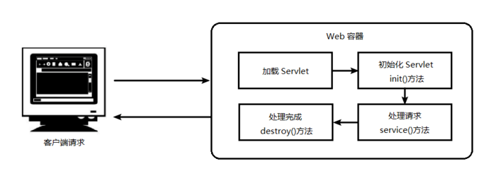
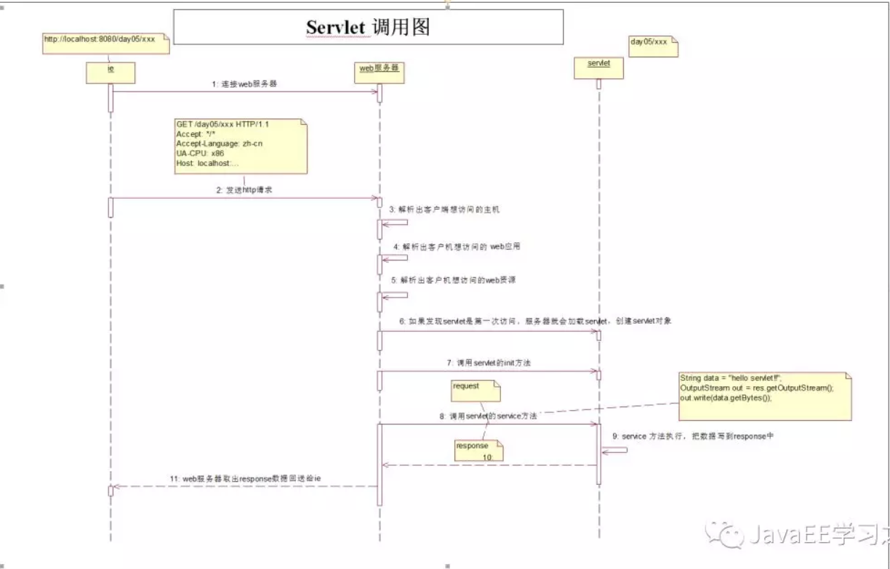
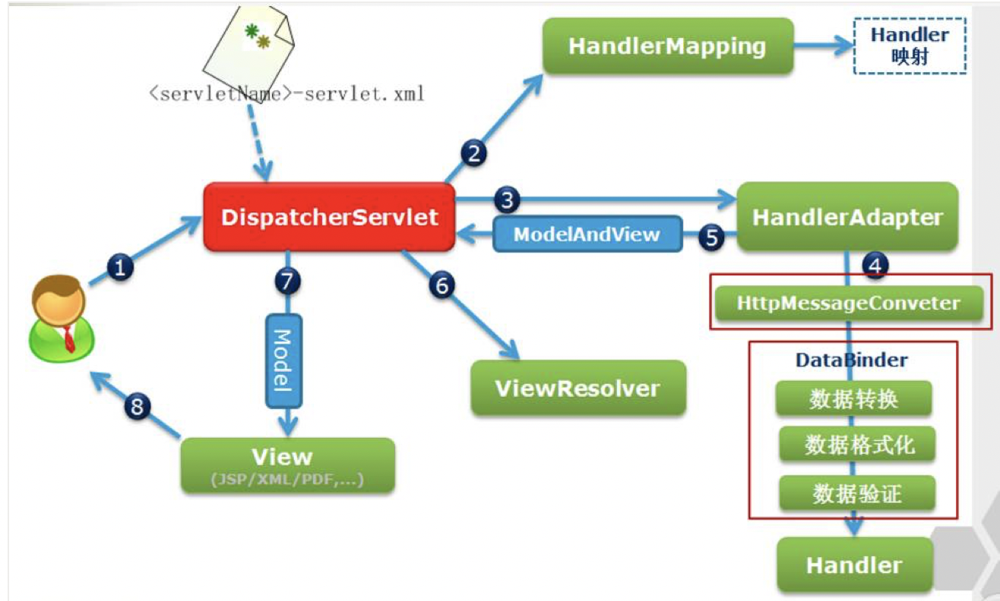

# 1. 基础

## 1.1 Servlet

### 1.1.1 什么是Servlet？

Servlet 取自两个单词：Server、Applet （很符合 sun 公司的命名特点）， Java Servlet 的简称，**其实质就是运行在 Web 应用服务器上的 Java 程序，**与普通 Java 程序不同，它是位于 Web 服务器内部的服务器端的 Java 应用程序，可以对 Web 浏览器或其他 HTTP 客户端程序发送的请求进行处理。

狭义的Servlet是指Java语言实现的一个接口，广义的Servlet是指任何实现了这个Servlet接口的类，一般情况下，人们将Servlet理解为后者。Servlet运行于支持Java的应用服务器中。从原理上讲，Servlet可以响应任何类型的请求，但绝大多数情况下Servlet只用来扩展基于HTTP协议的Web服务器。

> 实际上，Servlet 就像是一个规范，想象一下我们的 USB 接口，它不仅约束了U盘的大小和形状，同样也约束了电脑的插槽，Servlet 也是如此，它不仅约束了服务器端如何实现规范，也约束着 Java Web 项目的结构，为什么这样说，我们下面再来讲，**编写一个 Servlet 其实就是按照 Servlet 规范编写一个 Java 类。**

### 1.1.2 Servlet 容器能提供什么？

上面我们知道了需要由 Servlet 容器来管理和运行 Servlet ，但是为什么要这样做呢？使用 Servlet 容器的原因有：

1. **通信支持：**利用容器提供的方法，你能轻松的让 Servlet 与 web 服务器对话，而不用自己建立 serversocket 、监听某个端口、创建流等。容器知道自己与 web 服务器之间的协议，所以你的 Servlet 不用担心 web 服务器（如Apache）和你自己的 web 代码之间的 API ，只需要考虑如何在 Servlet 中实现业务逻辑（如处理一个订单）。
2. **生命周期管理：** Servlet 容器控制着 Servlet 的生与死，它负责加载类、实例化和初始化 Servlet ，调用 Servlet 方法，以及使 Servlet 实例被垃圾回收，有了 Servlet 容器，你不需要太多的考虑资源管理。
3. **多线程支持：**容器会自动为它所接收的每个 Servlet 请求创建一个新的 java 线程。针对用户的请求，如果 Servlet 已经运行完相应的http服务方法，这个线程就会结束。这并不是说你不需要考虑线程安全性，其实你还会遇到同步问题，不过这样能使你少做很多工作。
4. **声明方式实现安全：**利用 Servlet 容器，你可以使用 xml 部署描述文件来配置和修改安全性，而不必将其硬编码写到 Servlet 类代码中。
5. **JSP支持：** Servlet容器负责将 jsp 代码翻译为真正的 java 代码。

### 1.1.3 Servlet 的生命周期？@@@@

在 Web 容器中，Servlet 主要经历 4 个阶段，如下图：

****



**1. 加载 Servlet**：当 Tomcat 第一次访问 Servlet 的时候，Tomcat 会负责创建 Servlet 的实例。要知道所需的Servlet类在什么位置。

**2. 初始化 Servlet**：当 Servlet 被实例化之后，Tomcat 会调用 init() 方法来初始化这个对象。初始化的目的是为了让Servlet对象在处理客户端请求前完成一些初始化的工作，如建立数据库的连接，获取配置信息等。Servlet 是单例的，**浏览器多次对Servlet的请求**，一般情况下，**服务器只创建一个Servlet对象**，也就是说，Servlet对象**一旦创建了**，就会驻留在内存中，**为后续的请求做服务，直到服务器关闭。**

**3. 处理服务**：当浏览器访问 Servlet 的时候，Servlet 会调用 service() 方法处理请求。 解析客户端请求-〉执行业务逻辑-〉输出响应页面到客户端。

**4. 销毁**：当 Tomcat 关闭或者检测到 Servlet 要从 Tomcat 删除的时候，会自动调用 destroy() 方法，让该实例所占用的资源释放掉。一个 Servlet 如果长时间不被使用的话，也会被 Tomcat 自动销毁。

- **简单总结**：只要访问 Servlet ，就会调用其对应的 service() 方法，init() 方法只会在第一次访问 Serlvet 的时候才会被调用。

### 1.1.4 Servlet单例模式

**为什么Servlet是单例的**

**浏览器多次对Servlet的请求，**一般情况下，**服务器只创建一个Servlet对象，**也就是说，Servlet对象**一旦创建了，**就会**驻留在内存中，为后续的请求做服务，直到服务器关闭。**

**每次访问请求对象和响应对象都是新的**

对于**每次访问请求，**Servlet引擎都会**创建一个新的HttpServletRequest请求对象和一个新的HttpServletResponse响应对象，**然后将这**两个对象作为参数传递给它调用的Servlet的service()方法，**service方法再根据请求方式分别调用doXXX方法。

**线程安全问题**

当多个用户访问Servlet的时候，**服务器会为每个用户创建一个线程。**当多个用户并发访问Servlet共享资源的时候就会出现线程安全问题。

**原则：**

1. 如果一个变量**需要多个用户共享**，则应当在访问该变量的时候，**加同步机制synchronized (对象){}**
2. 如果一个变量**不需要共享，**则**直接在 doGet() 或者 doPost()定义**.这样不会存在线程安全问题。

### 1.1.5 Servlet 的请求流程？

1. **浏览器发出请求：** `http://localhost:80/xxx1/xxx2` （80端口可以默认不写，因为这是http协议默认的端口，平时我们访问`https://www.baidu.com/` 时其实访问的是`https://www.baidu.com:80/`）

2. 服务器解析请求信息：

   - **http:**协议名称
   - **localhost:**访问的是互联网中的**哪一台计算机**
   - **80:**从主机当中找到**对应 80 端口的程序** （**这里即为 Tomcat 服务器**）
   - **/xxx1:**当前项目的**上下文路径** （即在 server.xml 中配置主机时配置的 **path属性**）
   - **/xxx2:**当前**请求的资源名**

3. 解析

  Tomcat 服务器根目录下的/config/server.xml文件：

   ```
<Context docBase="D:\javaPros\test\webapp" path="xxx1" />
   ```
  
   判断哪一个

   ```
<Context />
   ```
  
   元素的path属性属性为

   ```
xxx1
   ```
  
   - 若找不到，则返回 **404错误**
- 若找到了，则解析该`<Context />`元素，得到`docBase`属性，获取当前访问 Web 项目的跟的绝对路径：`D:\javaPros\test\webapp`
  
4. 从D:\javaPros\test\webapp下的WEB-INF下找到web.xml文件判断web.xml文件中是否有

   ```
   <url-pattern>
   ```

    的文本内容为/xxx2

   - 若找不到，则返回 **404错误**
   - 若找到了，则继续**获取该资源对应 Servlet 类的全限名称：** xxx.xxx

5. 判断 **Servlet 实例缓存池** 中是否有 xxx.xxx 的对象

```
Map<String,Servlet> cache = ......(Tomcat提供的);
    key:存Servlet类的全限定名称
    value:该Servlet类的对象.
Servlet obj = cache.get("xxx.xxx");
    if(obj==null){
        //Servlet实例缓存中没有该类的对象,第一次.
        GOTO 6:
    }else{
        //有对象,非第一次.
        GOTO 8:
    }
}
```

1. **使用反射**调用构造器，**创建对应的对象**
   `obj = Class.forName("xxx.xxx").newInstance();`
   把当前创建的 **Servlet 对象**，存放在缓存之中，**供给下一次的使用.**
   `cache.put("xxx.xxx",obj);`
2. 创建 **ServletConfig 对象**，并调用 **init()** 方法
   `obj.init(config);`
3. 创建 **ServletRequest 对象和 ServletResponse 对象**，并调用 **service()**方法
   `obj.service(req,resp);`
4. 在 **service()** 方法中对浏览器作出响应操作。

## 1.3 GET 和 POST 的区别

要知道，GET 和 POST 都是请求方式

#### 1. GET：

浏览器器地址栏：`http://localhost/test.html?name=wmyskxz&sex=male`

这里提交了两个参数，一个是`name`属性值为`wmyskxz`，另一个是`sex`属性值为`male`，这是一种直接的请求方式，在请求资源后面跟上 **?** 符号与参数连接，其他的参数使用 **&** 符号连接。

- **缺点：**
  1.暴露请求信息，**不安全**
  2.请求信息不能超过**1kb**，可传输的信息有限，不能上传图片

#### 2. POST：

浏览器地址栏：`http://localhost/test.html#`

- **优点：**
  1.隐藏了请求信息，**较安全**（但仍可以通过相关工具访问到数据）
  2.POST 方式**没有限制**请求的数据大小，可以做图片的上传

## 1.4 Tomcat 中如何解决中文乱码问题？

在 **Tomcat 服务器**中，接受请求的时候，**默认的编码方式为 ISO-8859-1**，而该编码方式只占一个字节，不支持中文（两个字节），所以当我们做请求的时候，会出现乱码的问题

**解决方案：**

1.对乱码使用 **ISO-8859-1** 解码，转换成**byte数组**，恢复为二进制
`byte[] data = name.getBytes("ISO-8859-1");`

2.对byte数组重新进行 UTF-8 编码：
`name = new String(data,"UTF-8");`
但是这样会出现一个问题，那就是当表单数据太多的时候，这样反复解码-编码，会很繁琐。

**终极解决方案：**

**1.对于 POST 请求：**
设置请求的编码方式：`request.setCharacterEncoding("UTF-8");`
**注意：**必须在获取**第一个参数之前设置**，并且该方式**只对 POST 方式有效。**

**2.对于 GET 请求：**
重新设置 Tomcat 的编码方式，修改 Tomcat 的配置文件:
`Tomcat根目录/conf/server.xml(修改端口的那一行)`


------

## 1.5 forward 与 redirect 的区别

### 1.请求转发（forward）

又叫做**直接转发方式，**客户端和浏览器**只发出一次请求，**Servlet、HTML、JSP或其它信息资源，由**第二个信息资源响应该请求，**在请求对象request中，保存的对象对于**每个信息资源是共享的。**

比如：从 AServlet 请求转发到 BServlet


- **语法：**

```
request.getRequestDispatcher(path).forward(request, response);
```

*参数：* `path`，要跳转到的资源路径：**上下文路径 / 资源路径**

**特点：**

**1.地址栏中的地址【不会】改变**，通常看作是服务端的跳转

**2.只有一个请求**

**3.资源是共享的**

也就是说在两个 Servlet 中可以共享请求的资源，可以通过`request.setAttribute(String var1,Object var2)`**设置要共享的数据资源**，并通过`request.getAttribute(String var1);`来**获取传递的资源**

**4.【可以】访问 WEB-INF 中的资源**

**WEB-INF** 文件夹是 Java Web 应用的**默认安全目录，**即客户端无法直接访问，只有服务端可以访问的目录。如果想在页面中**直接访问**其中的文件，**必须通过web.xml文件**对要访问的文件进行**相应映射**才能访问。

**注意：**在实际的开发中，可以把不希望用户直接访问到（通过浏览器输入地址栏）的网页放在文件夹中**通过此方式访问。**

**5.请求转发【不能】跨域访问**

所谓的同域，是指**域名，协议，端口均相同**

### 2.URl 重定向（redirect）

又叫做**间接转发方式（Redirect）**实际是**两次HTTP请求，**服务器端在响应第一次请求的时候，让浏览器再向另外一个URL发出请求，从而达到转发的目的。

比如:从AServlet重定向到BServlet


- **语法：**

```
response.sendRedirect(String location);
```

*参数：*`location`，转发到的资源路径

**特点：**

**1.地址栏中的地址【会】发生改变**，通常看作是客户端跳转

**2.有两个请求**

**3.在两个 Servlet 中不可以共享请求中的数据**

**4.最终的响应由 BServlet 来决定，和 AServlet 没有关系**

**5.【不可以】访问 WEB-INF 中的资源**

**6.请求转发【能】跨域访问**

就像是在网页中点开了新的链接一样

- **总结：**URL 重定向相当于是将重定向的资源路径，重新复制到浏览器地址栏中按下回车一样，**重新发送一次新的请求。**

## 1.6 JSP 的执行原理？

当访问一个 JSP 页面时，该页面请求将会讲给服务器中的 **JSP 引擎**去处理，它**负责解释和执行 JSP 页面，**每个 JSP 页面在**第一次被访问时**，JSP 引擎就会将它翻译成一个继承自 `org.apache.jasper.runtime.HttpJspBase`类的 **Servlet 源程序，接着再编译成 class 类文件**，再由 Web 容器**像调用普通 Servlet 程序一样**的方式来装载和解释执行这个由 JSP 页面翻译成的 Servlet 程序。

### 1.6.1 JSP 与 Servlet 的区别？

1. **JSP 实质上就是一个 Servlet。**可以理解为，JSP 是编译后的 “Servlet 类”；
2. JSP 由 HTML 代码和 JSP 标签组成，更擅长页面显示；而 Servlet 更擅长流程控制；
3. JSP 感觉像是 HTML 中嵌入 Java 代码，而 Servlet 有些像 Java 中嵌入 HTML 代码的意思。

### 1.6.2 JSP 静态包含和动态包含的区别？

#### （1）静态包含：编译指令包含

```
<%@include file="被包含的页面的路径"%>
```

**包含的时机：在 JSP 文件被翻译的时候合并在一起，最终翻译得到一个 class文件**

#### （2）动态包含：动作指令包含

```
<jsp:include page="被包含页面的路径"></jsp:include>
```

**包含的时机：在运行阶段合并代码，最终得到两个 class 文件**

#### （3）动态包含和静态包含的选择:

- 如果被包含的页面如果是静态页面,那么使用静态包含；
- 如果被包含的如果是动态页面,那么使用动态包含。

### 1.6.3 JSP 有哪些内置对象？作用分别是什么？

JSP 共有以下 9 个内置的对象：

1. request：用户端请求，此请求会包含来自 GET/POST 请求的参数；
2. response：表示一次响应对象；
3. pageContext：表示当前的 JSP 对象；
4. session：表示一次会话对象；
5. application：表示当前应用对象；
6. out：表示一个输出流对象；
7. config：表示当前 JSP 的配置对象；
8. page：表示当前页面；
9. exception：表示异常对象。

------

### 1.6.4 JSTL 是什么？优点有哪些？

JSTL（JSP StandardTagLibrary，JSP标准标签库)是一个不断完善的开放源代码的JSP标签库，由四个定制标记库（core、format、xml和sql）和一对通用标记库验证器（ScriptFreeTLV和PermittedTaglibsTLV）组成。优点有：

1. 在应用程序服务器之间提供了一致的接口，最大程序地提高了WEB应用在各应用服务器之间的移植。
2. 简化了JSP和WEB应用程序的开发。
3. 以一种统一的方式减少了JSP中的scriptlet代码数量，可以达到没有任何scriptlet代码的程序。在我们公司的项目中是不允许有任何的scriptlet代码出现在JSP中。
4. 允许JSP设计工具与WEB应用程序开发的进一步集成。相信不久就会有支持JSTL的IDE开发工具出现。

## 1.7 request.getAttribute() 和 request.getParameter() 有何区别？

1. request.getParameter() 通常用来接收接收表单的get或者post提交过来的参数；而request.getAttribute()一般和setAttribute()搭配使用，只有先set之后才能通过get方法获取到Object类型的数据
2. getAttribute 返回的是对象，而getParameter 返回的是字符串
3. getAttribute 和 setAttribute 只是在 web 容器内流转，仅仅是请求处理阶段；而 getParameter 取到的数据是通过容器来获取的。

## 1.8 什么是 Cookie？Session 和 Cookie 有什么区别？

#### Cookie 技术

Cookie 是一种会话技术，用于将用户的信息保存在客户端上。Cookie 英文直接翻译过来就是小甜品，Cookie 的作用呢，通俗的说就是当一个用户通过 HTTP 访问一个服务器时，这个服务器会将一些 Key/Value 键值对返回给客户端浏览器，并给这些数据加上一些限制条件，在条件符合时这个用户下次访问这个服务器时，数据又被完整地带回给服务器。

这个作用就像是你去超市购物时，第一次给你办了一张购物卡，在这个购物卡里存放了一些你的个人信息，下次你再来这个超市的时候，你就只需要带上你的购物卡，直接购物就好了。


#### Session 技术

Session：会话，从浏览器打开开始，直到浏览器关闭结束，无论在这个网站中访问了多少页面，点击了多少链接，都属于同一个会话。Session 也可以称为会话 Cookie

- 特点：服务端技术，将数据保存在服务器


#### Cookie 与 Session 的区别

- Cookie 的数据是存放在客户的浏览器上，Session 数据放在服务器上；
- Cookie 不是很安全，别人可以分析存放在本地的 Cookie 并进行 Cookie 欺骗，如果考虑安全问题则应当使用 Session；
- Session 会在一定时间内保存在服务器上，当访问增多，会比较占用服务器的资源，所以如果考虑性能问题，则应当使用 Cookie；
- 单个 Cookie 在客户端的限制是 3k ，就是说一个站点在客户端存放的 Cookie 不能超过 3k。

**总结：** 将登录信息等重要信息存放为 Session；其他信息如果需要保留，可以存放在 Cookie 中。

## 1.9 什么是过滤器？

**过滤器就是 Servlet 的高级特性之一，**就是一个具有**拦截/过滤**功能的一个东西，在生活中过滤器可以是香烟滤嘴，滤纸，净水器，空气净化器等，在 Web 中仅仅是一个**实现了 Filter 接口的 Java 类**而已。

- **特点：双向，拦截请求，拦截响应**


- **作用：**
  过滤器可以对**所有的请求或者响应做拦截操作**

### 1.9.1 为什么在 Web 开发中需要用到过滤器？

- **问题：**为什么非得使用过滤器，我直接在 Servlet 中作判断不行吗？
- **开发遵循的原则：**
  **1.DRY原则（Don't Reeat Yourself，不要重复你自己）**：重复，意味着维护的成本很高。
  **2.责任分离原则：**谁擅长什么功能就做什么功能，Servlet 擅长的是逻辑而不是处理请求

举一个实际的例子：（处理 POST 请求中文编码的问题）


- **Web 中过滤器的作用：**
  **1.可以在请求资源之前设置请求的编码**
  **2.可以进行登录校验**
  **3.可以进行请求参数的内容的过滤**
  **4.数据压缩 / 数据加密 / 数据格式的转换**
  5.可以设置浏览器相关的数据

### 1.9.2 过滤器的应用场景

> 1、统一POST请求中文字符编码的过滤器 

如何 实现：将每个Servlet共有的代码提取出来。

> 2、禁止浏览器缓存所有动态页面的过滤器

如何实现：

response.setDateHeader("Expires",-1);
response.setHeader("Cache-Control","no-cache"); 
response.setHeader("Pragma","no-cache"); 
并不是所有的浏览器都能完全支持上面的三个响应头，因此最好是同时使用上面的三个响应头。
Expires数据头：值为GMT时间值，为-1指浏览器不要缓存页面
Cache-Control响应头有两个常用值： 
no-cache指浏览器不要缓存当前页面。
max-age:xxx指浏览器缓存页面xxx秒。

> 3、控制浏览器缓存页面中的静态资源的过滤器

如何实现：

有些动态页面中引用了一些图片或css文件以修饰页面效果，这些图片和css文件经常是不变化的，

所以为减轻服务器的压力，可以使用filter控制浏览器缓存这些文件，以提升服务器的性能。

> 4、使用Filter实现URL级别的权限认证

如何实现：

在实际开发中我们经常把一些执行敏感操作的servlet映射到一些特殊目录中，并用filter把这些特殊目录保护起来，限制只能拥有相应访问权限的用户才能访问这些目录下的资源。

从而在我们系统中实现一种URL级别的权限功能。

> 5. 通过配置参数encoding指明使用何种字符编码,以处理html form请求参数的中文问题。


> 6. 实现用户自动登陆的过滤器

在用户登陆成功后，发送一个名称为user的cookie给客户端，cookie的值为用户名和md5加密后的密码。
编写一个AutoLoginFilter，这个filter检查用户是否带有名称为user的cookie来，如果有，则调用dao查询cookie的用户名和密码是否和数据库匹配，

匹配则向session中存入user对象（即用户登陆标记），以实现程序完成自动登陆。

请求过滤器可以：

- 完成安全检查
- 重新格式化请求首部和请求体
- 建立请求审计或日志

响应过滤器可以：

- 压缩响应流
- 追加或者修改响应流
- 创建一个完全不同的响应

Filter也称之为过滤器，它是Servlet技术中最激动人心的技术，WEB开发人员通过Filter技术，
对web服务器管理的所有web资源：例如Jsp, Servlet, 静态图片文件或静态 html 文件等进行拦截，
从而实现一些特殊的功能。例如实现URL级别的权限访问控制、过滤敏感词汇、压缩响应信息等一些高级功能。
Servlet API中提供了一个Filter接口，开发web应用时，如果编写的Java类实现了这个接口，则把这个java类称之为过滤器Filter。

通过Filter技术，开发人员可以实现用户在访问某个目标资源之前，对访问的请求和响应进行拦截

## 1.10 MVC 模式？

MVC模式（Model-View-Controller）是[软件工程](https://link.jianshu.com/?t=https%3A%2F%2Flink.zhihu.com%2F%3Ftarget%3Dhttps%253A%2F%2Fzh.wikipedia.org%2Fwiki%2F%2525E8%2525BD%2525AF%2525E4%2525BB%2525B6%2525E5%2525B7%2525A5%2525E7%2525A8%25258B)中的一种[软件架构](https://link.jianshu.com/?t=https%3A%2F%2Flink.zhihu.com%2F%3Ftarget%3Dhttps%253A%2F%2Fzh.wikipedia.org%2Fwiki%2F%2525E8%2525BD%2525AF%2525E4%2525BB%2525B6%2525E6%25259E%2525B6%2525E6%25259E%252584)模式，把软件系统分为三个基本部分：模型（Model）、视图（View）和控制器（Controller）：

- Controller——负责转发请求，对请求进行处理
- View——负责界面显示
- Model——业务功能编写（例如算法实现）、数据库设计以及数据存取操作实现

在JSP/Servlet开发的软件系统中，这三个部分的描述如下所示：


1.Web浏览器发送HTTP请求到服务端，被Controller(Servlet)获取并进行处理（例如参数解析、请求转发）
2.Controller(Servlet)调用核心业务逻辑——Model部分，获得结果
3.Controller(Servlet)将逻辑处理结果交给View（JSP），动态输出HTML内容
4.动态生成的HTML内容返回到浏览器显示

MVC模式在Web开发中的好处是非常明显，它规避了JSP与Servlet各自的短板，Servlet只负责业务逻辑而不会通过out.append()动态生成HTML代码；JSP中也不会充斥着大量的业务代码。这大大提高了代码的可读性和可维护性。

------

# 2. 框架相关知识

## 2.1 Spring

框架是指完成一定功能的半成品。

框架能够帮助我们完成的是：项目的整体框架、一些基础功能、规定了类和对象如何创建，如何协作等，当我们开发一个项目时，框架帮助我们完成了一部分功能，我们自己再完成一部分，那这个项目就完成了。

### 2.1.1 什么是 Spring ？

1. **Spring 是一个轻量级的 DI / IoC 和 AOP 容器的开源框架**，来源于 Rod Johnson 在其著作《Expert one on one J2EE design and development》中阐述的部分理念和原型衍生而来。
2. Spring 提倡以 **“最少侵入”** 的方式来管理应用中的代码，这意味着我们可以随时安装或者卸载 Spring

- **适用范围：任何 Java 应用**
- **Spring的根本使命：简化 Java 开发**

### 2.1.2 Spring 有什么优势？

- 低侵入 / 低耦合 （降低组件之间的耦合度，实现软件各层之间的解耦）
- 声明式事务管理（基于切面和惯例）
- 方便集成其他框架（如MyBatis、Hibernate）
- 降低 Java 开发难度
- Spring 框架中包括了 J2EE 三层的每一层的解决方案（一站式）

**Spring 的框架结构**


- **Data Access/Integration层**包含有JDBC、ORM、OXM、JMS和Transaction模块。
- **Web层**包含了Web、Web-Servlet、WebSocket、Web-Porlet模块。
- **AOP模块**提供了一个符合AOP联盟标准的面向切面编程的实现。
- **Core Container(核心容器)**：包含有Beans、Core、Context和SpEL模块。
- **Test模块**支持使用JUnit和TestNG对Spring组件进行测试。

### 2.1.3 Spring 面试问答 Top 25

> 更多戳这里：[Spring面试问答Top 25](http://www.importnew.com/15851.html#beanfactory_vs_applicationcontext)

Spring vs Spring mvc vs Spring boot

springMVC就相当于是Struts2加上Spring的整合。

### 2.1.4 Spring MVC 的请求流程



每当用户在 Web 浏览器中点击链接或者提交表单的时候，请求就开始工作了，像是邮递员一样，从离开浏览器开始到获取响应返回，它会经历很多站点，在每一个站点都会留下一些信息同时也会带上其他信息，下图为 Spring MVC 的请求流程：


#### 第一站：DispatcherServlet

从请求离开浏览器以后，第一站到达的就是 DispatcherServlet，看名字这是一个 Servlet，通过 J2EE 的学习，我们知道 Servlet 可以拦截并处理 HTTP 请求，DispatcherServlet 会拦截所有的请求，并且将这些请求发送给 Spring MVC 控制器。

```
<servlet>
    <servlet-name>dispatcher</servlet-name>
    <servlet-class>org.springframework.web.servlet.DispatcherServlet</servlet-class>
    <load-on-startup>1</load-on-startup>
</servlet>
<servlet-mapping>
    <servlet-name>dispatcher</servlet-name>
    <!-- 拦截所有的请求 -->
    <url-pattern>/</url-pattern>
</servlet-mapping>
```

- **DispatcherServlet 的任务就是拦截请求发送给 Spring MVC 控制器。**

#### 第二站：处理器映射（HandlerMapping）

- **问题：**典型的应用程序中可能会有多个控制器，这些请求到底应该发给哪一个控制器呢？

所以 DispatcherServlet 会查询一个或多个处理器映射来确定请求的下一站在哪里，处理器映射会**根据请求所携带的 URL 信息来进行决策**，例如上面的例子中，我们通过配置 simpleUrlHandlerMapping 来将 /hello 地址交给 helloController 处理：

```
<bean id="simpleUrlHandlerMapping"
      class="org.springframework.web.servlet.handler.SimpleUrlHandlerMapping">
    <property name="mappings">
        <props>
            <!-- /hello 路径的请求交给 id 为 helloController 的控制器处理-->
            <prop key="/hello">helloController</prop>
        </props>
    </property>
</bean>
<bean id="helloController" class="controller.HelloController"></bean>
```

#### 第三站：控制器

一旦选择了合适的控制器， DispatcherServlet 会将请求发送给选中的控制器，到了控制器，请求会卸下其负载（用户提交的请求）等待控制器处理完这些信息：

```
public ModelAndView handleRequest(javax.servlet.http.HttpServletRequest httpServletRequest, javax.servlet.http.HttpServletResponse httpServletResponse) throws Exception {
    // 处理逻辑
    ....
}
```

#### 第四站：返回 DispatcherServlet

当控制器在完成逻辑处理后，通常会产生一些信息，这些信息就是需要返回给用户并在浏览器上显示的信息，它们被称为**模型（Model）**。仅仅返回原始的信息时不够的——这些信息需要以用户友好的方式进行格式化，一般会是 HTML，所以，信息需要发送给一个**视图（view）**，通常会是 JSP。

控制器所做的最后一件事就是将模型数据打包，并且表示出用于渲染输出的视图名**（逻辑视图名）。它接下来会将请求连同模型和视图名发送回 DispatcherServlet。**

```
public ModelAndView handleRequest(javax.servlet.http.HttpServletRequest httpServletRequest, javax.servlet.http.HttpServletResponse httpServletResponse) throws Exception {
    // 处理逻辑
    ....
    // 返回给 DispatcherServlet
    return mav;
}
```

#### 第五站：视图解析器

这样以来，控制器就不会和特定的视图相耦合，传递给 DispatcherServlet 的视图名并不直接表示某个特定的 JSP。（实际上，它甚至不能确定视图就是 JSP）相反，**它传递的仅仅是一个逻辑名称，这个名称将会用来查找产生结果的真正视图。**

DispatcherServlet 将会使用视图解析器（view resolver）来将逻辑视图名匹配为一个特定的视图实现，它可能是也可能不是 JSP

> 上面的例子是直接绑定到了 index.jsp 视图

#### 第六站：视图

既然 DispatcherServlet 已经知道由哪个视图渲染结果了，那请求的任务基本上也就完成了。

它的最后一站是视图的实现，在这里它交付模型数据，请求的任务也就完成了。视图使用模型数据渲染出结果，这个输出结果会通过响应对象传递给客户端。

```
<%@ page language="java" contentType="text/html; charset=UTF-8"
         pageEncoding="UTF-8" isELIgnored="false"%>

<h1>${message}</h1>
```

> 更多 Spring-MVC 内容：[Spring MVC【入门】就这一篇](https://www.jianshu.com/p/91a2d0a1e45a)

#### Spring MVC 的架构

为解决持久层中一直未处理好的数据库事务的编程，又为了迎合 NoSQL 的强势崛起，Spring MVC 给出了方案：


**传统的模型层被拆分为了业务层(Service)和数据访问层（DAO,Data Access Object）。**在 Service 下可以通过 Spring 的声明式事务操作数据访问层，而在业务层上还允许我们访问 NoSQL ，这样就能够满足异军突起的 NoSQL 的使用了，它可以大大提高互联网系统的性能。

- **特点：**
  结构松散，几乎可以在 Spring MVC 中使用各类视图
  松耦合，各个模块分离
  与 Spring 无缝集成

### 2.1.5 什么是 Spring Boot ？

- 它使用 **“习惯优于配置”** （项目中存在大量的配置，此外还内置一个习惯性的配置，让你无须）的理念让你的项目快速运行起来。
- 它并不是什么新的框架，而是默认配置了很多框架的使用方式，就像 Maven 整合了所有的 jar 包一样，Spring Boot 整合了所有框架（引自：[springboot(一)：入门篇——纯洁的微笑](https://link.jianshu.com/?t=http%3A%2F%2Fwww.ityouknow.com%2Fspringboot%2F2016%2F01%2F06%2Fspringboot%28%25E4%25B8%2580%29-%25E5%2585%25A5%25E9%2597%25A8%25E7%25AF%2587.html)）

------

### 2.1.6 Spring的IOC是如何解决循环依赖的

[参考](http://cmsblogs.com/?p=2887)

1. 什么是循环依赖

循环依赖其实就是循环引用，就是两个或者两个以上的 bean 互相引用对方，最终形成一个闭环，如 A 依赖 B，B 依赖 C，C 依赖 A，如下：


循环依赖 其实就是一个死循环的过程，在初始化 A 的时候发现引用了 B，这时就会去初始化 B，然后又发现 B 引用 C，跑去初始化 C，初始化 C 的时候发现引用了 A，则又会去初始化 A，依次循环永不退出，除非有终结条件。 Spring 循环依赖的场景有两种：

1. 构造器的循环依赖
2. field 属性的循环依赖

对于构造器的循环依赖，Spring 是无法解决的，只能抛出 BeanCurrentlyInCreationException 异常表示循环依赖，所以下面我们分析的都是基于 field 属性的循环依赖。 在博客 [【死磕 Spring】----- IOC 之开启 bean 的加载](http://cmsblogs.com/?p=2806) 中提到，Spring 只解决 scope 为 singleton 的循环依赖，对于scope 为 prototype 的 bean Spring 无法解决，直接抛出 BeanCurrentlyInCreationException 异常。为什么 Spring 不处理 prototype bean，其实如果理解 Spring 是如何解决 singleton bean 的循环依赖就明白了。这里先卖一个关子，我们先来关注 Spring 是如何解决 singleton bean 的循环依赖的。

```java
  /** Cache of singleton objects: bean name --> bean instance */
    private final Map<String, Object> singletonObjects = new ConcurrentHashMap<>(256);

    /** Cache of singleton factories: bean name --> ObjectFactory */
    private final Map<String, ObjectFactory<?>> singletonFactories = new HashMap<>(16);

    /** Cache of early singleton objects: bean name --> bean instance */
    private final Map<String, Object> earlySingletonObjects = new HashMap<>(16);
```

意义如下：

- singletonObjects：单例对象的cache
- singletonFactories ： 单例对象工厂的cache
- earlySingletonObjects ：提前暴光的单例对象的Cache

他们就是 Spring 解决 singleton bean 的关键因素所在，我称他们为**三级缓存**，第一级为 singletonObjects，第二级为 earlySingletonObjects，第三级为 singletonFactories。这里我们可以通过 `getSingleton()` 看到他们是如何配合的，这分析该方法之前，提下其中的 `isSingletonCurrentlyInCreation()` 和 `allowEarlyReference`。

- `isSingletonCurrentlyInCreation()`：判断当前 singleton bean 是否处于创建中。bean 处于创建中也就是说 bean 在初始化但是没有完成初始化，有一个这样的过程其实和 Spring 解决 bean 循环依赖的理念相辅相成，因为 Spring 解决 singleton bean 的核心就在于提前曝光 bean。
- allowEarlyReference：从字面意思上面理解就是允许提前拿到引用。其实真正的意思是是否允许从 singletonFactories 缓存中通过 `getObject()` 拿到对象，为什么会有这样一个字段呢？原因就在于 singletonFactories 才是 Spring 解决 singleton bean 的诀窍所在，这个我们后续分析。

Spring 在创建 bean 的时候并不是等它完全完成，而是在创建过程中将创建中的 bean 的 ObjectFactory 提前曝光（即加入到 singletonFactories 缓存中），这样一旦下一个 bean 创建的时候需要依赖 bean ，则直接使用 ObjectFactory 的 `getObject()` 获取了，也就是 `getSingleton()` 中的代码片段了。 到这里，关于 Spring 解决 bean 循环依赖就已经分析完毕了。最后来描述下就上面那个循环依赖 Spring 解决的过程：首先 A 完成初始化第一步并将自己提前曝光出来（通过 ObjectFactory 将自己提前曝光），在初始化的时候，发现自己依赖对象 B，此时就会去尝试 get(B)，这个时候发现 B 还没有被创建出来，然后 B 就走创建流程，在 B 初始化的时候，同样发现自己依赖 C，C 也没有被创建出来，这个时候 C 又开始初始化进程，但是在初始化的过程中发现自己依赖 A，于是尝试 get(A)，这个时候由于 A 已经添加至缓存中（一般都是添加至三级缓存 singletonFactories ），通过 ObjectFactory 提前曝光，所以可以通过 `ObjectFactory.getObject()` 拿到 A 对象，C 拿到 A 对象后顺利完成初始化，然后将自己添加到一级缓存中，回到 B ，B 也可以拿到 C 对象，完成初始化，A 可以顺利拿到 B 完成初始化。到这里整个链路就已经完成了初始化过程了。

### 2.1.7 使用 Spring Boot 有什么好处？

回顾我们之前的 SSM 项目，搭建过程还是比较繁琐的，需要：

- 1）配置 web.xml，加载 spring 和 spring mvc
- 2）配置数据库连接、配置日志文件
- 3）配置家在配置文件的读取，开启注解
- 4）配置mapper文件
- .....

而使用 Spring Boot 来开发项目则只需要非常少的几个配置就可以搭建起来一个 Web 项目，并且利用 IDEA 可以自动生成生成，这简直是太爽了...

- 划重点：简单、快速、方便地搭建项目；对主流开发框架的无配置集成；极大提高了开发、部署效率。

## 2.2 什么是非侵入式设计？

从框架的角度可以理解为：**无需继承框架提供的任何类**
这样我们在更换框架时，之前写过的代码几乎可以继续使用。

------

## 2.3 Spring IoC 和 AOP 分别是什么？

### 2.3.1 IoC

**IoC：Inverse of Control（控制反转）**，读作 **“反转控制”**，更好理解，不是什么技术，而是一种设计思想，就是将原本在程序中手动创建对象的控制权，交由Spring框架来管理。

- **正控**：若要使用某个对象，需要自己去负责对象的创建
- **反控**：若要使用某个对象，只需要从 Spring 容器中获取需要使用的对象，不关心对象的创建过程，也就是把创建对象的控制权反转给了Spring框架
- **好莱坞法则**：Don’t call me ,I’ll call you

**为了便于理解我们这里举一个鲜明的例子：**

在现实生活中，人们要用到一样东西的时候，第一反应就是去找到这件东西，比如想喝新鲜橙汁，在没有饮品店的日子里，最直观的做法就是：买果汁机、买橙子，然后准备开水。值得注意的是：这些都是你自己“主动”创造的过程，也就是说一杯橙汁需要你自己创造。


然而到了今时今日，由于饮品店的盛行，当我们想喝橙汁时，第一想法就转换成了找到饮品店的联系方式，通过电话等渠道描述你的需要、地址、联系方式等，下订单等待，过一会儿就会有人送来橙汁了。


**请注意你并没有“主动”去创造橙汁**，橙汁是由饮品店创造的，而不是你，然而也完全达到了你的要求，甚至比你创造的要好上那么一些。

- **总结：** 这就是一种控制反转的理念，上述的例子已经很好的说明了问题，我们再来描述一下控制反转的概念：**控制反转是一种通过描述（在 Java 中可以是 XML 或者注解）并通过第三方（Spring）去产生或获取特定对象的方式。**
- **好处：** ① 降低对象之间的耦合；② 我们不需要理解一个类的具体实现，只需要知道它有什么用就好了（直接向 IoC 容器拿）

#### 2.3.1.1  IoC 是如何实现的

最后我们简单说说IoC是如何实现的。想象一下如果我们自己来实现这个依赖注入的功能，我们怎么来做？ 无外乎：

1. 读取标注或者配置文件，看看JuiceMaker依赖的是哪个Source，拿到类名
2. 使用反射的API，基于类名实例化对应的对象实例
3. 将对象实例，通过构造函数或者 setter，传递给 JuiceMaker

我们发现其实自己来实现也不是很难，Spring实际也就是这么做的。这么看的话其实IoC就是一个工厂模式的升级版！当然要做一个成熟的IoC框架，还是非常多细致的工作要做，Spring不仅提供了一个已经成为业界标准的Java IoC框架，还提供了更多强大的功能，所以大家就别去造轮子啦！希望了解IoC更多实现细节不妨通过学习Spring的源码来加深理解！

> 引用地址：[这里](https://link.jianshu.com/?t=https%3A%2F%2Fwww.tianmaying.com%2Ftutorial%2Fspring-ioc)

### 2.3.2 AOP

指 Spring 创建对象的过程中，将对象依赖属性（简单值，集合，对象）通过配置设值给该对象。

如果说 IoC 是 Spring 的核心，那么面向切面编程就是 Spring 最为重要的功能之一了，在数据库事务中切面编程被广泛使用。

AOP 即 Aspect Oriented Program 面向切面编程

首先，在面向切面编程的思想里面，把功能分为核心业务功能，和周边功能。

- **所谓的核心业务**，比如登陆，增加数据，删除数据都叫核心业务
- **所谓的周边功能**，比如性能统计，日志，事务管理等等

周边功能在 Spring 的面向切面编程AOP思想里，即被定义为切面

**在面向切面编程AOP的思想里面，核心业务功能和切面功能分别独立进行开发，然后把切面功能和核心业务功能 "编织" 在一起，这就叫AOP**

**AOP 的目的**

AOP能够将那些与业务无关，**却为业务模块所共同调用的逻辑或责任（例如事务处理、日志管理、权限控制等）封装起来**，便于**减少系统的重复代码**，**降低模块间的耦合度**，并**有利于未来的可拓展性和可维护性**。

**AOP 当中的概念：**

- 切入点（Pointcut）
  在哪些类，哪些方法上切入（**where**）
- 通知（Advice）
  在方法执行的什么实际（**when:**方法前/方法后/方法前后）做什么（**what:**增强的功能）
- 切面（Aspect）
  切面 = 切入点 + 通知，通俗点就是：**在什么时机，什么地方，做什么增强！**
- 织入（Weaving）
  把切面加入到对象，并创建出代理对象的过程。（由 Spring 来完成）

## 2.4 BeanFactory 和 ApplicationContext 的区别

**1.BeanFactory：**

是Spring中最底层的接口，只提供了最简单的IoC功能,负责配置，创建和管理bean。在应用中，一般不使用 BeanFactory，而推荐使ApplicationContext（应用上下文），原因如下。

**2.ApplicationContext：**

⑴. 继承了 BeanFactory，拥有了基本的 IoC 功能；
⑵. 除此之外，ApplicationContext 还提供了以下功能：
① 支持国际化；② 支持消息机制；③ 支持统一的资源加载；④ 支持AOP功能；

- **注意：** ApplicationContext 和 BeanFactory 相比，最主要的区别在于 BeanFactory 是延迟加载，举个例子：如果 Bean 没有完全注入，BeanFactory 加载后，会在你第一次调用 getBean 方法才会抛出异常；而 ApplicationContext 会在初始化的时候就加载并且检查，这样的好处是可以及时检查依赖是否完全注入；所以通常我们会选择 ApplicationContext。

## 2.5 Bean

### 2.5.1 Spring 配置 Bean 有几种方式？

在 Spring 中提供了 3 种方法进行配置：

- 在 XML 文件中显式配置
- 在 Java 的接口和类中实现配置
- 隐式 Bean 的发现机制和自动装配原则

**方式选择的原则**

在现实的工作中，这 3 种方式都会被用到，并且在学习和工作之中常常混合使用，所以这里给出一些关于这 3 种优先级的建议：

**1.最优先：通过隐式 Bean 的发现机制和自动装配的原则。**
基于约定由于配置的原则，这种方式应该是最优先的

- 好处：减少程序开发者的决定权，简单又不失灵活。

**2.其次：Java 接口和类中配置实现配置**
在没有办法使用自动装配原则的情况下应该优先考虑此类方法

- 好处：避免 XML 配置的泛滥，也更为容易。
- 典型场景：一个父类有多个子类，比如学生类有两个子类，一个男学生类和女学生类，通过 IoC 容器初始化一个学生类，容器将无法知道使用哪个子类去初始化，这个时候可以使用 Java 的注解配置去指定。

**3.最后：XML 方式配置**
在上述方法都无法使用的情况下，那么也只能选择 XML 配置的方式。

- 好处：简单易懂（当然，特别是对于初学者）
- 典型场景：当使用第三方类的时候，有些类并不是我们开发的，我们无法修改里面的代码，这个时候就通过 XML 的方式配置使用了。

------

### 2.5.2 Spring 中 Bean 的作用域

**在默认的情况下，Spring IoC 容器只会对一个 Bean 创建一个实例**，但有时候，我们希望能够通过 Spring IoC 容器获取多个实例，我们可以通过 `@Scope` 注解或者 `<bean>` 元素中的 `scope` 属性来设置，例如：

```
// XML 中设置作用域
<bean id="" class="" scope="prototype" />
// 使用注解设置作用域
@Scope(ConfigurableBeanFactory.SCOPE_PROTOTYPE)
```

Spring 提供了 5 种作用域，它会根据情况来决定是否生成新的对象：

| 作用域类别              | 描述                                                         |
| ----------------------- | ------------------------------------------------------------ |
| singleton(单例)         | 在Spring IoC容器中仅存在一个Bean实例 （默认的scope）         |
| prototype(多例)         | 每次从容器中调用Bean时，都返回一个新的实例，即每次调用getBean()时 ，相当于执行new XxxBean()：不会在容器启动时创建对象 |
| request(请求)           | 用于web开发，将Bean放入request范围 ，request.setAttribute("xxx") ， 在同一个request 获得同一个Bean |
| session(会话)           | 用于web开发，将Bean 放入Session范围，在同一个Session 获得同一个Bean |
| globalSession(全局会话) | 一般用于 Porlet 应用环境 , 分布式系统存在全局 session 概念（单点登录），如果不是 porlet 环境，globalSession 等同于 Session |

在开发中主要使用 `scope="singleton"`、`scope="prototype"`，**对于MVC中的Action使用prototype类型，其他使用singleton**，Spring容器会管理 Action 对象的创建,此时把 Action 的作用域设置为 prototype.

> 扩展阅读：[@Profile 注解](https://blog.csdn.net/u013803262/article/details/62416880) 、 [条件化装配 Bean](https://blog.csdn.net/tinydolphin/article/details/76253771)

------

## 2.6 什么是 ORM？

对象关系映射（Object-Relational Mapping，简称ORM）是一种为了解决程序的面向对象模型与数据库的关系模型互不匹配问题的技术；

简单的说，ORM是通过使用描述对象和数据库之间映射的元数据（在Java中可以用XML或者是注解），将程序中的对象自动持久化到关系数据库中或者将关系数据库表中的行转换成Java对象，其本质上就是将数据从一种形式转换到另外一种形式。

------

## 2.7 MyBatis

### 2.7.1 为什么要使用 MyBatis ？

在我们**传统的 JDBC** 中，我们除了需要自己提供 SQL 外，还必须操作 Connection、Statment、ResultSet，不仅如此，为了访问不同的表，不同字段的数据，我们需要些很多雷同模板化的代码，闲的繁琐又枯燥。

而我们在使用了 **MyBatis** 之后，**只需要提供 SQL 语句就好了**，其余的诸如：建立连接、操作 Statment、ResultSet，处理 JDBC 相关异常等等都可以交给 MyBatis 去处理，**我们的关注点于是可以就此集中在 SQL 语句上**，关注在增删改查这些操作层面上。

并且 MyBatis 支持使用简单的 XML 或注解来配置和映射原生信息，将接口和 Java 的 POJOs(Plain Old Java Objects,普通的 Java对象)映射成数据库中的记录。

------

### 2.7.2 MyBatis 中占位符 `#` 和 $  的区别

区别如下：

1. `#`符号将传入的数据都当做一个字符串，会对自动传入的数据加一个双引号
2. `$`符号将传入的数据直接显示生成SQL中。
3. `#`符号存在预编译的过程，，对问号赋值，防止SQL注入。
4. `$`符号是直译的方式，一般用在orderby {列名} 语句中。
5. 能用`#`号就不要用`$`符号

------

### 2.7.3 MyBatis 缓存结构


在 Web 系统中，最重要的操作就是查询数据库中的数据。但是有些时候查询数据的频率非常高，这是很耗费数据库资源的，往往会导致数据库查询效率极低，影响客户的操作体验。于是我们可以将一些变动不大且访问频率高的数据，放置在一个缓存容器中，用户下一次查询时就从缓存容器中获取结果。

- MyBatis 拥有自己的缓存结构，可以用来缓解数据库压力，加快查询速度。
- MyBatis 一级缓存是一个 SqlSession 级别，同一个 SqlSession 只能访问自己的一级缓存的数据
- 二级缓存是跨sqlSession，是 mapper 级别的缓存，对于 mapper 级别的缓存不同的sqlsession是可以共享的。

> 更多深入MyBatis的内容戳这里：[MyBatis(2)——MyBatis 深入学习](https://www.jianshu.com/p/76d35d939539)

------

### 2.7.4 MyBatis 与 Spring 整合

> 戳这里：[MyBatis 与 Spring 整合](https://www.jianshu.com/p/412051d41d73)

------

## 2.8 IDEA 整合 SSM 框架学习

> 戳这里[IDEA 整合 SSM 框架学习](https://www.jianshu.com/p/3098050b0d14)
