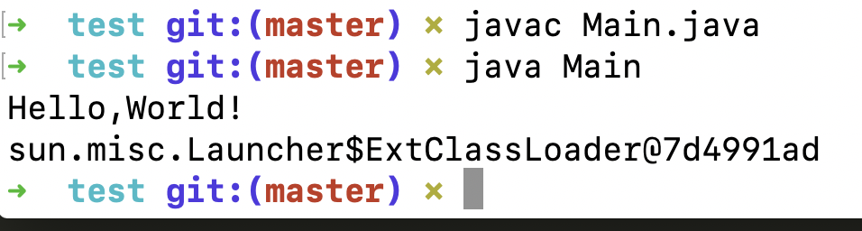
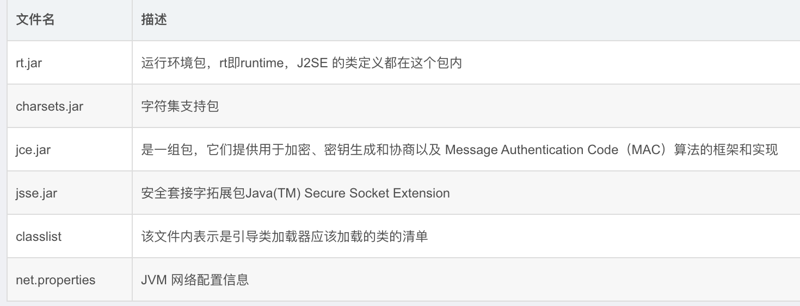
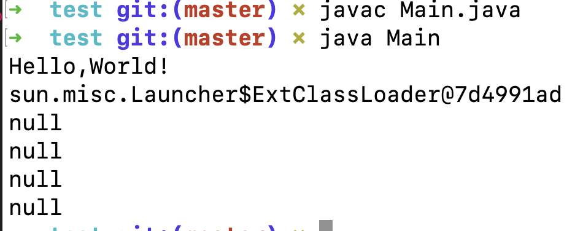
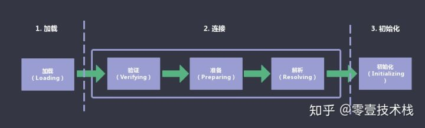
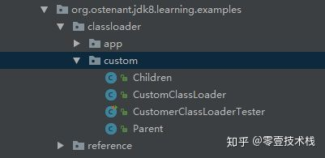
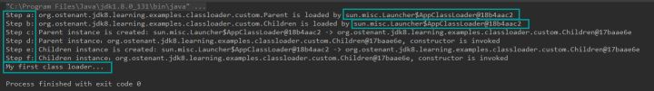
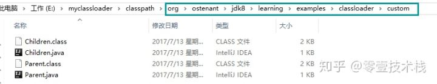
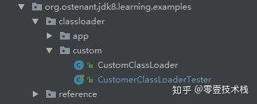
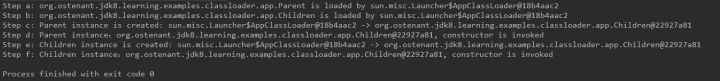

<!--ts-->
   * [前言](#前言)
   * [1. <a href="https://www.hollischuang.com/archives/199" rel="nofollow">深度分析Java的ClassLoader机制（源码级别）</a>](#1-深度分析java的classloader机制源码级别)
      * [1.1 源码分析](#11-源码分析)
      * [1.2 总结](#12-总结)
      * [1.3 类装载器ClassLoader（一个抽象类）描述一下JVM加载class文件的原理机制](#13-类装载器classloader一个抽象类描述一下jvm加载class文件的原理机制)
   * [2. JVM类加载器机制与类加载过程](#2-jvm类加载器机制与类加载过程)
      * [2.1 Java虚拟机启动、加载类过程分析](#21-java虚拟机启动加载类过程分析)
         * [2.1.1 根据JVM内存配置要求，为JVM申请特定大小的内存空间](#211-根据jvm内存配置要求为jvm申请特定大小的内存空间)
         * [2.1.2 创建一个引导类加载器实例，初步加载系统类到内存方法区区域中](#212-创建一个引导类加载器实例初步加载系统类到内存方法区区域中)
         * [2.1.3 创建JVM 启动器实例 Launcher,并取得类加载器ClassLoader](#213-创建jvm-启动器实例-launcher并取得类加载器classloader)
         * [2.1.4 使用类加载器ClassLoader加载Main类](#214-使用类加载器classloader加载main类)
         * [2.1.5 使用Main类的main方法作为程序入口运行程序](#215-使用main类的main方法作为程序入口运行程序)
         * [2.1.6 方法执行完毕，JVM销毁，释放内存](#216-方法执行完毕jvm销毁释放内存)
      * [2.2 类加载器有哪些？其组织结构是怎样的？](#22-类加载器有哪些其组织结构是怎样的)
      * [2.3 双亲加载模型的逻辑和底层代码实现是怎样的？](#23-双亲加载模型的逻辑和底层代码实现是怎样的)
      * [2.4 类加载器与Class 实例的关系](#24-类加载器与class-实例的关系)
      * [2.5 线程上下文加载器](#25-线程上下文加载器)
   * [3. 类加载过程详解](#3-类加载过程详解)
      * [3.1 <strong>类加载器是什么</strong>](#31-类加载器是什么)
      * [3.2 类加载的时机](#32-类加载的时机)
         * [3.2.1 主动引用](#321-主动引用)
         * [3.2.2 被动引用](#322-被动引用)
      * [3.3 <strong>类加载的过程</strong>](#33-类加载的过程)
         * [3.3.1 <strong>加载</strong>](#331-加载)
         * [3.3.2 <strong>连接</strong>](#332-连接)
         * [3.3.3 初始化](#333-初始化)
   * [3. <strong>自定义类加载器</strong>](#3-自定义类加载器)
      * [3.1 编写自己的类加载器](#31-编写自己的类加载器)
      * [3.2 <strong>测试编写的类加载器</strong>](#32-测试编写的类加载器)
   * [4. 对象的初始化](#4-对象的初始化)
      * [4.1 对象的初始化顺序](#41-对象的初始化顺序)
      * [4.2 <strong>对象的初始化示例</strong>](#42-对象的初始化示例)
      * [4.3 对象的创建](#43-对象的创建)
         * [4.3.1 适用范围](#431-适用范围)
         * [4.3.2 分配内存](#432-分配内存)
         * [4.3.3 初始化内存空间](#433-初始化内存空间)
         * [4.3.4 设置对象](#434-设置对象)
         * [4.3.5 总结](#435-总结)
      * [4.4 对象的内存布局](#44-对象的内存布局)
         * [4.4.1 对象头（Header）](#441-对象头header)
         * [4.4.2 实例数据（Instance Data）](#442-实例数据instance-data)
         * [4.4.3 对齐填充（Padding）](#443-对齐填充padding)
      * [4.5 对象的访问定位](#45-对象的访问定位)

<!-- Added by: anapodoton, at: Thu Feb 20 17:08:11 CST 2020 -->

<!--te-->

# 前言

> java代码（比如Demo.java），用javac命令进行编译为Demo.class文件。然后虚拟机进行加载（加载，连接（验证，准备和解析），初始化）生成Class对象（Class<Demo>）。然后执行main方法（main方法所在的类如果没有new指令，不会在堆中生成对象），如果碰到new指令，会在堆中为其生成对象（对象的创建，对象的内存布局，对象的访问定位等步骤）。

主要学习jvm的类加载机制。

classLoader、类加载过程、双亲委派（破坏双亲委派）、模块化（jboss modules、osgi、jigsaw）

# 1. [深度分析Java的ClassLoader机制（源码级别）](https://www.hollischuang.com/archives/199)

> 写在前面：`Java`中的所有类，必须被装载到`jvm`中才能运行，这个装载工作是由`jvm`中的类装载器完成的，类装载器所做的工作实质是把类文件从硬盘读取到内存中，`JVM`在加载类的时候，都是通过`ClassLoader`的`loadClass（）`方法来加载class的，`loadClass`使用**双亲委派模式**。

为了更好的理解类的加载机制，我们来深入研究一下`ClassLoader`和他的`loadClass（）`方法。

## 1.1 源码分析

```java
public abstract class ClassLoader
```

`ClassLoader`类是一个抽象类，sun公司是这么解释这个类的：

```html
/**
 * A class loader is an object that is responsible for loading classes. The
 * class <tt>ClassLoader</tt> is an abstract class.  Given the <a
 * href="#name">binary name</a> of a class, a class loader should attempt to
 * locate or generate data that constitutes a definition for the class.  A
 * typical strategy is to transform the name into a file name and then read a
 * "class file" of that name from a file system.
**/
```

大致意思如下：

> class loader是一个**负责加载classes的对象**，ClassLoader类是一个抽象类，需要给出类的二进制名称，class loader尝试定位或者产生一个class的数据，一个典型的策略是**把二进制名字转换成文件名**然后到文件系统中找到该文件。

接下来我们看loadClass方法的实现方式：

```java
protected Class<?> loadClass(String name, boolean resolve)
        throws ClassNotFoundException
    {
        synchronized (getClassLoadingLock(name)) {
            // First, check if the class has already been loaded
            Class c = findLoadedClass(name);
            if (c == null) {
                long t0 = System.nanoTime();
                try {
                    if (parent != null) {
                        c = parent.loadClass(name, false);
                    } else {
                        c = findBootstrapClassOrNull(name);
                    }
                } catch (ClassNotFoundException e) {
                    // ClassNotFoundException thrown if class not found
                    // from the non-null parent class loader
                }

                if (c == null) {
                    // If still not found, then invoke findClass in order
                    // to find the class.
                    long t1 = System.nanoTime();
                    c = findClass(name);

                    // this is the defining class loader; record the stats
                    sun.misc.PerfCounter.getParentDelegationTime().addTime(t1 - t0);
                    sun.misc.PerfCounter.getFindClassTime().addElapsedTimeFrom(t1);
                    sun.misc.PerfCounter.getFindClasses().increment();
                }
            }
            if (resolve) {
                resolveClass(c);
            }
            return c;
        }
    }
```

还是来看sun公司对该方法的解释：

```html
/**
     * Loads the class with the specified <a href="#name">binary name</a>.  The
     * default implementation of this method searches for classes in the
     * following order:
     *
     * <p><ol>
     *
     *   <li><p> Invoke {@link #findLoadedClass(String)} to check if the class
     *   has already been loaded.  </p></li>
     *
     *   <li><p> Invoke the {@link #loadClass(String) <tt>loadClass</tt>} method
     *   on the parent class loader.  If the parent is <tt>null</tt> the class
     *   loader built-in to the virtual machine is used, instead.  </p></li>
     *
     *   <li><p> Invoke the {@link #findClass(String)} method to find the
     *   class.  </p></li>
     *
     * </ol>
     *
     * <p> If the class was found using the above steps, and the
     * <tt>resolve</tt> flag is true, this method will then invoke the {@link
     * #resolveClass(Class)} method on the resulting <tt>Class</tt> object.
     *
     * <p> Subclasses of <tt>ClassLoader</tt> are encouraged to override {@link
     * #findClass(String)}, rather than this method.  </p>
     *
     * <p> Unless overridden, this method synchronizes on the result of
     * {@link #getClassLoadingLock <tt>getClassLoadingLock</tt>} method
     * during the entire class loading process.
     *
     */
```

大致内容如下:

> 使用指定的二进制名称来加载类，这个方法的默认实现按照以下顺序查找类： 调用`findLoadedClass(String)`方法检查这个类是否被加载过 使用父加载器调用`loadClass(String)`方法，如果父加载器为`Null`，类加载器装载虚拟机内置的加载器调用`findClass(String)`方法装载类， 如果，按照以上的步骤成功的找到对应的类，并且该方法接收的`resolve`参数的值为`true`,那么就调用`resolveClass(Class)`方法来处理类。 `ClassLoader`的子类最好覆盖`findClass(String)`而不是这个方法。 **除非被重写，这个方法默认在整个装载过程中都是同步的（线程安全的）**

接下来，我们开始分析该方法。

**protected Class loadClass(String name, boolean resolve)** 

该方法的访问控制符是protected，也就是说该方法**同包内和派生类中可用**，返回值类型`Class，这里用到泛型。这里使用通配符`?`作为泛型实参表示对象可以接受任何类型(类类型)。因为该方法不知道要加载的类到底是什么类，所以就用了通用的泛型。`String name`要查找的类的名字，`boolean resolve`，一个标志，`true`表示将调用`resolveClass(c)处理该类

**throws ClassNotFoundException** 该方法会抛出找不到该类的异常，这是一个非运行时异常。

**synchronized (getClassLoadingLock(name))** 看到这行代码，我们能知道的是，这是一个同步代码块，那么synchronized的括号中放的应该是一个对象。我们来看`getClassLoadingLock(name)`方法的作用是什么：

```java
    /**
     * Returns the lock object for class loading operations.
     * For backward compatibility, the default implementation of this method
     * behaves as follows. If this ClassLoader object is registered as
     * parallel capable, the method returns a dedicated object associated
     * with the specified class name. Otherwise, the method returns this
     * ClassLoader object. </p>
     *
     * @param  className
     *         The name of the to-be-loaded class
     *
     * @return the lock for class loading operations
     *
     * @throws NullPointerException
     *         If registered as parallel capable and <tt>className</tt> is null
     *
     * @see #loadClass(String, boolean)
     *
     * @since  1.7
     */
protected Object getClassLoadingLock(String className) {
        Object lock = this;
        if (parallelLockMap != null) {
            Object newLock = new Object();
            lock = parallelLockMap.putIfAbsent(className, newLock);
            if (lock == null) {
                lock = newLock;
            }
        }
        return lock;
    }
```

以上是`getClassLoadingLock(name)`方法的实现细节，我们看到这里用到变量`parallelLockMap` ，根据这个变量的值进行不同的操作，如果这个变量是Null，那么直接返回this，如果这个属性不为Null，那么就新建一个对象，然后在调用一个`putIfAbsent(className, newLock);`方法来给刚刚创建好的对象赋值，这个方法的作用我们一会讲。那么这个`parallelLockMap`变量又是哪来的那，我们发现这个变量是`ClassLoader`类的成员变量：

```java
//把类名称和锁进行相互映射
private final ConcurrentHashMap<String, Object> parallelLockMap;
```

这个变量的初始化工作在`ClassLoader`的构造函数中：

```java
private ClassLoader(Void unused, ClassLoader parent) {
        this.parent = parent;
        if (ParallelLoaders.isRegistered(this.getClass())) {
            parallelLockMap = new ConcurrentHashMap<>();
            package2certs = new ConcurrentHashMap<>();
            domains =
                Collections.synchronizedSet(new HashSet<ProtectionDomain>());
            assertionLock = new Object();
        } else {
            // no finer-grained lock; lock on the classloader instance
            parallelLockMap = null;
            package2certs = new Hashtable<>();
            domains = new HashSet<>();
            assertionLock = this;
        }
    }
```

这里我们可以看到构造函数根据一个属性`ParallelLoaders`的`Registered`状态的不同来给`parallelLockMap` 赋值。 我去，隐藏的好深，好，我们继续挖，看看这个`ParallelLoaders`又是在哪赋值的呢？我们发现，在ClassLoader类中包含一个静态内部类`private static class ParallelLoaders`，在`ClassLoader`被加载的时候这个静态内部类就被初始化。这个静态内部类的代码我就不贴了，直接告诉大家什么意思，sun公司是这么说的：`Encapsulates the set of parallel capable loader types`，意识就是说：**封装了并行的可装载的类型的集合。**

> 上面这个说的是不是有点乱，那让我们来整理一下： 首先，在ClassLoader类中有一个静态内部类`ParallelLoaders`，他会指定的类的并行能力，如果当前的加载器被定位为具有并行能力，那么他就给`parallelLockMap`定义，就是`new`一个 `ConcurrentHashMap<>()`，那么这个时候，我们知道如果当前的加载器是具有并行能力的，那么`parallelLockMap`就不是`Null`，这个时候，我们判断`parallelLockMap`是不是`Null`，如果他是null，说明该加载器没有注册并行能力，那么我们没有必要给他一个加锁的对象，`getClassLoadingLock`方法直接返回`this`,就是当前的加载器的一个实例。
>
> 如果这个`parallelLockMap`不是`null`，那就说明该加载器是有并行能力的，那么就可能有并行情况，那就需要返回一个锁对象。然后就是创建一个新的Object对象，调用`parallelLockMap`的`putIfAbsent(className, newLock)`方法，这个方法的作用是：首先根据传进来的className,检查该名字是否已经关联了一个value值，如果已经关联过value值，那么直接把他关联的值返回，如果没有关联过值的话，那就把我们传进来的Object对象作为value值，className作为Key值组成一个map返回。然后无论putIfAbsent方法的返回值是什么，都把它赋值给我们刚刚生成的那个Object对象。
>
>  这个时候，我们来简单说明一下`getClassLoadingLock(String className)`的作用，就是： **为类的加载操作返回一个锁对象。为了向后兼容，这个方法这样实现:如果当前的classloader对象注册了并行能力，方法返回一个与指定的名字className相关联的特定对象，否则，直接返回当前的ClassLoader对象。**


**Class c = findLoadedClass(name);** 在这里，在加载类之前先调用`findLoadedClass`方法检查该类是否已经被加载过，findLoadedClass会返回一个`Class`类型的对象，如果该类已经被加载过，那么就可以直接返回该对象（在返回之前会根据`resolve`的值来决定是否处理该对象，具体的怎么处理后面会讲）。 如果，该类没有被加载过，那么执行以下的加载过程

```java
try {
    if (parent != null) {
           c = parent.loadClass(name, false);
    } else {
            c = findBootstrapClassOrNull(name);
     }
} catch (ClassNotFoundException e) {
         // ClassNotFoundException thrown if class not found
          // from the non-null parent class loader
}
```

如果父加载器不为空，那么调用父加载器的`loadClass`方法加载类，如果父加载器为空，那么调用虚拟机的加载器来加载类。

如果以上两个步骤都没有成功的加载到类，那么

```java
c = findClass(name);
```

调用自己的`findClass(name)`方法来加载类。

这个时候，我们已经得到了加载之后的类，那么就根据`resolve`的值决定是否调用`resolveClass`方法。`resolveClass`方法的作用是：

> **链接指定的类。**这个方法给`Classloader`用来链接一个类，如果这个类已经被链接过了，那么这个方法只做一个简单的返回。否则，这个类将被按照 `Java™`规范中的`Execution`描述进行链接。。。

至此，ClassLoader类以及loadClass方法的源码我们已经分析完了，那么。结合源码的分析，我们来总结一下：

## 1.2 总结

**java中的类大致分为三种：**

> 1.系统类 2.扩展类 3.由程序员自定义的类

**类装载方式，有两种:**

> 1.隐式装载， 程序在运行过程中当碰到通过new 等方式生成对象时，隐式调用类装载器加载对应的类到jvm中。
>
>  2.显式装载， 通过class.forname()等方法，显式加载需要的类。

**类加载的动态性体现:**

> 一个应用程序总是由n多个类组成，Java程序启动时，并不是一次把所有的类全部加载后再运行，它总是先把保证程序运行的基础类一次性加载到jvm中，其它类等到jvm用到的时候再加载，这样的好处是节省了内存的开销，因为java最早就是为嵌入式系统而设计的，内存宝贵，这是一种可以理解的机制，而用到时再加载这也是java动态性的一种体现

**java类装载器**

Java中的类装载器实质上也是类，功能是把类载入jvm中，值得注意的是jvm的类装载器并不是一个，而是三个，层次结构如下：


为什么要有三个类加载器，一方面是分工，各自负责各自的区块，另一方面为了实现委托模型，下面会谈到该模型

**类加载器之间是如何协调工作的**

前面说了，java中有三个类加载器，问题就来了，碰到一个类需要加载时，它们之间是如何协调工作的，即java是如何区分一个类该由哪个类加载器来完成呢。 在这里java采用了**委托模型机制**，这个机制简单来讲，就是“**类装载器有载入类的需求时，会先请示其Parent使用其搜索路径帮忙载入，如果Parent 找不到,那么才由自己依照自己的搜索路径搜索类**”


下面举一个例子来说明，为了更好的理解，先弄清楚几行代码：

```java
public class Test{
    public static void main(String[] arg){
        ClassLoader c  = Test.class.getClassLoader();  //获取Test类的类加载器
        System.out.println(c); 
        ClassLoader c1 = c.getParent();  //获取c这个类加载器的父类加载器
        System.out.println(c1);
        ClassLoader c2 = c1.getParent();//获取c1这个类加载器的父类加载器
        System.out.println(c2);
  }
}
```

运行结果：

```
。。。AppClassLoader。。。

。。。ExtClassLoader。。。

Null
```

可以看出Test是由**AppClassLoader**加载器加载的，**AppClassLoader**的`Parent` 加载器是 **ExtClassLoader**,但是`ExtClassLoader`的`Parent`为 `null` 是怎么回事呵，朋友们留意的话，前面有提到**Bootstrap Loader**是用C++语言写的，依java的观点来看，逻辑上并不存在**Bootstrap Loader**的类实体，所以在`java`程序代码里试图打印出其内容时，我们就会看到输出为`null`。

## 1.3 类装载器ClassLoader（一个抽象类）描述一下JVM加载class文件的原理机制

类装载器就是寻找类或接口字节码文件进行解析并构造JVM内部对象表示的组件，在java中类装载器把一个类装入JVM，经过以下步骤：

> 1、装载：查找和导入Class文件 2、链接：其中解析步骤是可以选择的 （a）检查：检查载入的class文件数据的正确性 （b）准备：给类的静态变量分配存储空间 （c）解析：将符号引用转成直接引用 3、初始化：对静态变量，静态代码块执行初始化工作

类装载工作由`ClassLoder`和其子类负责。JVM在运行时会产生三个ClassLoader：**根装载器**，`ExtClassLoader`(**扩展类装载器**)和`AppClassLoader`，其中根装载器不是ClassLoader的子类，由C++编写，因此在java中看不到他，负责装载JRE的核心类库，如JRE目录下的rt.jar,charsets.jar等。`ExtClassLoader`是`ClassLoder`的子类，负责装载JRE扩展目录ext下的jar类包；**AppClassLoader负责装载classpath路径下的类包，这三个类装载器存在父子层级关系，即根装载器是ExtClassLoader的父装载器，ExtClassLoader是AppClassLoader的父装载器。默认情况下使用AppClassLoader装载应用程序的类**

Java装载类使用“**全盘负责委托机制**”。“**全盘负责**”是指当一个`ClassLoder`装载一个类时，除非显示的使用另外一个`ClassLoder`，该类所依赖及引用的类也由这个`ClassLoder`载入；“**委托机制**”是指先委托父类装载器寻找目标类，只有在找不到的情况下才从自己的类路径中查找并装载目标类。

这一点是**从安全方面考虑**的，试想如果一个人写了一个恶意的基础类（如`java.lang.String`）并加载到`JVM`将会引起严重的后果，但有了全盘负责制，`java.lang.String`永远是由根装载器来装载，避免以上情况发生 除了JVM默认的三个`ClassLoder`以外，第三方可以编写自己的类装载器，以实现一些特殊的需求。

类文件被装载解析后，在`JVM`中都有一个对应的`java.lang.Class`对象，提供了类结构信息的描述。数组，枚举及基本数据类型，甚至`void`都拥有对应的`Class`对象。`Class`类没有`public`的构造方法，`Class`对象是在装载类时由`JVM`通过调用类装载器中的`defineClass()`方法自动构造的。

# 2. JVM类加载器机制与类加载过程

https://blog.csdn.net/luanlouis/article/details/50529868

## 2.1 Java虚拟机启动、加载类过程分析

下面我将定义一个非常简单的java程序并运行它，来逐步分析java虚拟机启动的过程

```java
import sun.security.pkcs11.P11Util;
 
/**
 * Created by louis on 2016/1/16.
 */
public class Main{
 
    public static void main(String[] args) {
        System.out.println("Hello,World!");
 
        ClassLoader loader = P11Util.class.getClassLoader();
 
        System.out.println(loader);
    }
}
```



执行的顺序：

1.  根据JVM内存配置要求，为JVM申请特定大小的内存空间；
2.  创建一个引导类加载器实例，初步加载系统类到内存方法区区域中；

3.  创建JVM 启动器实例 Launcher,并取得类加载器ClassLoader；

4.  使用上述获取的ClassLoader实例加载我们定义的 org.luanlouis.jvm.load.Main类；
5.  加载完成时候JVM会执行Main类的m ain方法入口，执行Main类的main方法；

6.  结束，java程序运行结束，JVM销毁。

### 2.1.1 根据JVM内存配置要求，为JVM申请特定大小的内存空间

### 2.1.2 创建一个引导类加载器实例，初步加载系统类到内存方法区区域中

JVM申请好内存空间后，JVM会创建一个**引导类加载器（Bootstrap Classloader）**实例，引导类加载器是使用C++语言实现的，负责加载JVM虚拟机运行时所需的基本系统级别的类，如java.lang.String, java.lang.Object等等。
引导类加载器(Bootstrap Classloader)会读取 {JRE_HOME}/lib 下的jar包和配置，然后将这些系统类加载到方法区内。

本例中，引导类加载器是用 {JRE_HOME}/lib加载类的，不过，你也可以使用参数 -Xbootclasspath 或 系统变量sun.boot.class.path来指定的目录来加载类。

一般而言，{JRE_HOME}/lib下存放着JVM正常工作所需要的系统类，如下表所示：


引导类加载器(Bootstrap ClassLoader） 加载系统类后，JVM内存会呈现如下格局：


- 引导类加载器将类信息加载到方法区中，以特定方式组织，对于某一个特定的类而言，在方法区中它应该有 运行时常量池、类型信息、字段信息、方法信息、类加载器的引用，对应class实例的引用等信息。
- 类加载器的引用,由于这些类是由引导类加载器(Bootstrap Classloader)进行加载的，而 引导类加载器是有C++语言实现的，所以是无法访问的，故而该引用为NULL。
- 对应class实例的引用， 类加载器在加载类信息放到方法区中后，会创建一个对应的Class 类型的实例放到堆(Heap)中, 作为开发人员访问方法区中类定义的入口和切入点。

当我们在代码中尝试获取系统类如java.lang.Object的类加载器时，你会始终得到NULL：

```java
System.out.println(String.class.getClassLoader());//null
System.out.println(Object.class.getClassLoader());//null
System.out.println(Math.class.getClassLoader());//null
System.out.println(System.class.getClassLoader());//null
```



### 2.1.3 创建JVM 启动器实例 Launcher,并取得类加载器ClassLoader

上述步骤完成，JVM基本运行环境就准备就绪了。接着，我们要让JVM工作起来了：运行我们定义的程序 org.luanlouis,jvm.load.Main。

此时，JVM虚拟机调用已经加载在方法区的类sun.misc.Launcher 的静态方法getLauncher(),  获取sun.misc.Launcher 实例：

```java
sun.misc.Launcher launcher = sun.misc.Launcher.getLauncher(); //获取Java启动器
ClassLoader classLoader = launcher.getClassLoader();          //获取类加载器ClassLoader用来加载class到内存来
```

sun.misc.Launcher 使用了单例模式设计，保证一个JVM虚拟机内只有一个sun.misc.Launcher实例。
在Launcher的内部，其定义了两个类加载器(ClassLoader),分别是sun.misc.Launcher.ExtClassLoader和sun.misc.Launcher.AppClassLoader，这两个类加载器分别被称为拓展类加载器(Extension ClassLoader) 和 应用类加载器(Application ClassLoader).如下图所示：


图例注释：除了引导类加载器(Bootstrap Class Loader )的所有类加载器，都有一个能力，就是判断某一个类是否被引导类加载器加载过，如果加载过，可以直接返回对应的Class<T> instance，如果没有，则返回null.  图上的指向引导类加载器的虚线表示类加载器的这个有限的访问 引导类加载器的功能。

此时的  launcher.getClassLoader() 方法将会返回 AppClassLoader 实例，AppClassLoader将ExtClassLoader作为自己的父加载器。

当AppClassLoader加载类时，会首先尝试让父加载器ExtClassLoader进行加载，如果父加载器ExtClassLoader加载成功，则AppClassLoader直接返回父加载器ExtClassLoader加载的结果；如果父加载器ExtClassLoader加载失败，AppClassLoader则会判断该类是否是引导的系统类(即是否是通过Bootstrap类加载器加载，这会调用Native方法进行查找)；若要加载的类不是系统引导类，那么ClassLoader将会尝试自己加载，加载失败将会抛出“ClassNotFoundException”。

**双亲委派模型(parent-delegation model)**

上面讨论的应用类加载器AppClassLoader的加载类的模式就是我们常说的双亲委派模型(parent-delegation model).
对于某个特定的类加载器而言，应该为其指定一个父类加载器，当用其进行加载类的时候：
1. 委托父类加载器帮忙加载；
2. 父类加载器加载不了，则查询引导类加载器有没有加载过该类；
3. 如果引导类加载器没有加载过该类，则当前的类加载器应该自己加载该类；
4. 若加载成功，返回 对应的Class<T> 对象；若失败，抛出异常“ClassNotFoundException”。

请注意：
双亲委派模型中的"双亲"并不是指它有两个父类加载器的意思，一个类加载器只应该有一个父加载器。上面的步骤中，有两个角色：

1. 父类加载器(parent classloader)：它可以替子加载器尝试加载类
2. 引导类加载器（bootstrap classloader）: 子类加载器只能判断某个类是否被引导类加载器加载过，而不能委托它加载某个类；换句话说，就是子类加载器不能接触到引导类加载器，引导类加载器对其他类加载器而言是透明的。

一般情况下，双亲加载模型如下所示：


### 2.1.4 使用类加载器ClassLoader加载Main类

通过 launcher.getClassLoader()方法返回AppClassLoader实例，接着就是AppClassLoader加载 org.luanlouis.jvm.load.Main类的时候了。

```java
ClassLoader classloader = launcher.getClassLoader();//取得AppClassLoader类
classLoader.loadClass("org.luanlouis.jvm.load.Main");//加载自定义类
```

上述定义的org.luanlouis.jvm.load.Main类被编译成org.luanlouis.jvm.load.Main class二进制文件，这个class文件中有一个叫常量池(Constant Pool)的结构体来存储该class的常亮信息。常量池中有CONSTANT_CLASS_INFO类型的常量，表示该class中声明了要用到那些类：


当AppClassLoader要加载 org.luanlouis.jvm.load.Main类时，会去查看该类的定义，发现它内部声明使用了其它的类： sun.security.pkcs11.P11Util、java.lang.Object、java.lang.System、java.io.PrintStream、java.lang.Class；org.luanlouis.jvm.load.Main类要想正常工作，首先要能够保证这些其内部声明的类加载成功。所以AppClassLoader要先将这些类加载到内存中。（注：为了理解方便，这里没有考虑懒加载的情况，事实上的JVM加载类过程比这复杂的多）

加载顺序：

1. 加载java.lang.Object、java.lang.System、java.io.PrintStream、java,lang.Class

     AppClassLoader尝试加载这些类的时候，会先委托ExtClassLoader进行加载；而ExtClassLoader发现不是其加载范围，其返回null；AppClassLoader发现父类加载器ExtClassLoader无法加载，则会查询这些类是否已经被BootstrapClassLoader加载过，结果表明这些类已经被BootstrapClassLoader加载过，则无需重复加载，直接返回对应的Class<T>实例；

2. 加载sun.security.pkcs11.P11Util

    此在{JRE_HOME}/lib/ext/sunpkcs11.jar包内，属于ExtClassLoader负责加载的范畴。AppClassLoader尝试加载这些类的时候，会先委托ExtClassLoader进行加载；而ExtClassLoader发现其正好属于加载范围，故ExtClassLoader负责将其加载到内存中。ExtClassLoader在加载sun.security.pkcs11.P11Util时也分析这个类内都使用了哪些类，并将这些类先加载内存后，才开始加载sun.security.pkcs11.P11Util，加载成功后直接返回对应的Class<sun.security.pkcs11.P11Util>实例；

3. 加载org.luanlouis.jvm.load.Main

  AppClassLoader尝试加载这些类的时候，会先委托ExtClassLoader进行加载；而ExtClassLoader发现不是其加载范围，其返回null；AppClassLoader发现父类加载器ExtClassLoader无法加载，则会查询这些类是否已经被BootstrapClassLoader加载过。而结果表明BootstrapClassLoader 没有加载过它，这时候AppClassLoader只能自己动手负责将其加载到内存中，然后返回对应的Class<org.luanlouis.jvm.load.Main>实例引用；

以上三步骤都成功，才表示classLoader.loadClass("org.luanlouis.jvm.load.Main")完成，上述操作完成后，JVM内存方法区的格局会如下所示：


- JVM方法区的类信息区是按照类加载器进行划分的，每个类加载器会维护自己加载类信息；
- 某个类加载器在加载相应的类时，会相应地在JVM内存堆（Heap）中创建一个对应的Class<T>，用来表示访问该类信息的入口

### 2.1.5 使用Main类的main方法作为程序入口运行程序

### 2.1.6 方法执行完毕，JVM销毁，释放内存

## 2.2 类加载器有哪些？其组织结构是怎样的？

类加载器(Class Loader)：顾名思义，指的是可以加载类的工具。JVM自身定义了三个类加载器：引导类加载器(Bootstrap Class Loader)、拓展类加载器(Extension Class Loader )、应用加载器(Application Class Loader)。当然，我们有时候也会自己定义一些类加载器来满足自身的需要。

引导类加载器(Bootstrap Class Loader): 该类加载器使JVM使用C/C++底层代码实现的加载器，用以加载JVM运行时所需要的系统类，这些系统类在{JRE_HOME}/lib目录下。由于类加载器是使用平台相关的底层C/C++语言实现的， 所以该加载器不能被Java代码访问到。但是，我们可以查询某个类是否被引导类加载器加载过。我们经常使用的系统类如：java.lang.String,java.lang.Object,java.lang*....... 这些都被放在 {JRE_HOME}/lib/rt.jar包内， 当JVM系统启动的时候，引导类加载器会将其加载到 JVM内存的方法区中。

   拓展类加载器(Extension Class Loader): 该加载器是用于加载 java 的拓展类 ，拓展类一般会放在 {JRE_HOME}/lib/ext/ 目录下，用来提供除了系统类之外的额外功能。拓展类加载器是是整个JVM加载器的Java代码可以访问到的类加载器的最顶端，即是超级父加载器，拓展类加载器是没有父类加载器的。

   应用类加载器(Applocatoin Class Loader): 该类加载器是用于加载用户代码，是用户代码的入口。我经常执行指令 java   xxx.x.xxx.x.x.XClass , 实际上，JVM就是使用的AppClassLoader加载 xxx.x.xxx.x.x.XClass 类的。应用类加载器将拓展类加载器当成自己的父类加载器，当其尝试加载类的时候，首先尝试让其父加载器-拓展类加载器加载；如果拓展类加载器加载成功，则直接返回加载结果Class<T> instance,加载失败，则会询问是否引导类加载器已经加载了该类；只有没有加载的时候，应用类加载器才会尝试自己加载。由于xxx.x.xxx.x.x.XClass是整个用户代码的入口，在Java虚拟机规范中，称其为 初始类(Initial Class).

用户自定义类加载器（Customized Class Loader）：用户可以自己定义类加载器来加载类。所有的类加载器都要继承java.lang.ClassLoader类。


## 2.3 双亲加载模型的逻辑和底层代码实现是怎样的？

前面已经不厌其烦地讲解什么是双亲加载模型，以及其机制是什么，这些东西都是可以通过底层代码查看到的。

我们也可以通过JDK源码看java.lang.ClassLoader的核心方法 loadClass()的实现：

```java
  //提供class类的二进制名称表示，加载对应class，加载成功，则返回表示该类对应的Class<T> instance 实例
    public Class<?> loadClass(String name) throws ClassNotFoundException {
        return loadClass(name, false);
    }
 
    
    protected Class<?> loadClass(String name, boolean resolve)
        throws ClassNotFoundException
    {
        synchronized (getClassLoadingLock(name)) {
            // 首先，检查是否已经被当前的类加载器记载过了，如果已经被加载，直接返回对应的Class<T>实例
            Class<?> c = findLoadedClass(name);
                //初次加载
                if (c == null) {
                long t0 = System.nanoTime();
                try {
                    if (parent != null) {
                        //如果有父类加载器，则先让父类加载器加载
                        c = parent.loadClass(name, false);
                    } else {
                        // 没有父加载器，则查看是否已经被引导类加载器加载，有则直接返回
                        c = findBootstrapClassOrNull(name);
                    }
                } catch (ClassNotFoundException e) {
                    // ClassNotFoundException thrown if class not found
                    // from the non-null parent class loader
                }
                // 父加载器加载失败，并且没有被引导类加载器加载，则尝试该类加载器自己尝试加载
                if (c == null) {
                    // If still not found, then invoke findClass in order
                    // to find the class.
                    long t1 = System.nanoTime();
                    // 自己尝试加载
                    c = findClass(name);
 
                    // this is the defining class loader; record the stats
                    sun.misc.PerfCounter.getParentDelegationTime().addTime(t1 - t0);
                    sun.misc.PerfCounter.getFindClassTime().addElapsedTimeFrom(t1);
                    sun.misc.PerfCounter.getFindClasses().increment();
                }
            }
            //是否解析类 
            if (resolve) {
                resolveClass(c);
            }
            return c;
        }
    }
```


## 2.4 类加载器与Class<T> 实例的关系


## 2.5 线程上下文加载器

​       Java 任何一段代码的执行，都有对应的线程上下文。如果我们在代码中，想看当前是哪一个线程在执行当前代码，我们经常是使用如下方法：

```java
Thread  thread = Thread.currentThread();//返回对当当前运行线程的引用
```


相应地，我们可以为当前的线程指定类加载器。在上述的例子中， 当执行   java    org.luanlouis.jvm.load.Main  的时候，JVM会创建一个Main线程，而创建应用类加载器AppClassLoader的时候，会将AppClassLoader  设置成Main线程的上下文类加载器：

```java
    public Launcher() {
        Launcher.ExtClassLoader var1;
        try {
            var1 = Launcher.ExtClassLoader.getExtClassLoader();
        } catch (IOException var10) {
            throw new InternalError("Could not create extension class loader", var10);
        }
 
        try {
            this.loader = Launcher.AppClassLoader.getAppClassLoader(var1);
        } catch (IOException var9) {
            throw new InternalError("Could not create application class loader", var9);
        }
		//将AppClassLoader设置成当前线程的上下文加载器
        Thread.currentThread().setContextClassLoader(this.loader);
        //.......
 
    }
```

线程上下文类加载器是从线程的角度来看待类的加载，为每一个线程绑定一个类加载器，可以将类的加载从单纯的 双亲加载模型解放出来，进而实现特定的加载需求。

# 3. 类加载过程详解

https://zhuanlan.zhihu.com/p/43845064

## 3.1 **类加载器是什么**

类加载器简言之，就是用于把`.class`文件中的**字节码信息**转化为具体`的java.lang.Class`**对象**的过程的工具。

具体过程：

1. 在实际类加载过程中，`JVM`会将所有的`.class`字节码文件中的**二进制数据**读入内存中，导入运行时数据区的**方法区**中。
2. 当一个类首次被**主动加载**或**被动加载**时，类加载器会对此类执行类加载的流程 – **加载**、**连接**（**验证**、**准备**、**解析**）、**初始化**。
3. 如果类加载成功，**堆内存**中会产生一个新的`Class`对象，`Class`对象封装了类在**方法区**内的**数据结构**。

`Class`对象的创建过程描述：


## 3.2 类加载的时机

### 3.2.1 主动引用

主动引用：在类加载阶段，只执行**加载**、**连接**操作，不执行**初始化**操作。

- 使用 new 关键字实例化对象的时候、读取或设置一个类的静态字段的时候（被final修饰、已在编译期把结果放入常量池的静态字段除外）、以及调用一个类的静态方法的时候；
- 反射
- 父类
- main方法所在的类

**主动引用1 - main方法在初始类中**

```java
public class OptimisticReference0 {
    static {
        System.out.println(OptimisticReference0.class.getSimpleName() + " is referred!");
    }
public static void main(String[] args) {
    System.out.println();
}
}
```
运行结果：

> OptimisticReference0 is referred!

**主动引用2 – 创建子类会触发父类的初始化**

代码示例：

```java
public class OptimisticReference1 {
    public static class Parent {
        static {
            System.out.println(Parent.class.getSimpleName() + " is referred!");
        }
    }

    public static class Child extends Parent {
        static {
            System.out.println(Child.class.getSimpleName() + " is referred!");
        }
    }

    public static void main(String[] args) {
        new Child();
    }
}
```

运行结果：

> Parent is referred! 
>
> Child is referred!

**主动引用3 – 访问一个类静态变量**

代码示例：

```java
public class OptimisticReference2 {
    public static class Child {
        protected static String name;
        static {
            System.out.println(Child.class.getSimpleName() + " is referred!");
            name = "Child";
        }
    }

    public static void main(String[] args) {
        System.out.println(Child.name);
    }
}
```

运行结果：

>  Child is referred!
>
>  Child

**主动引用4 – 对类的静态变量进行赋值**

代码示例：

```java
public class OptimisticReference3 {
    public static class Child {
        protected static String name;
        static {
            System.out.println(Child.class.getSimpleName() + " is referred!");
        }
    }

    public static void main(String[] args) {
        Child.name = "Child";
    }
}
```

运行结果：

>  Child is referred!


### 3.2.2 被动引用

被动引用： 在类加载阶段，会执行**加载**、**连接**和**初始化**操作。

- 通过子类引用父类的静态字段，不会导致子类初始化
- 常量在编译阶段会存入调用类的常量池中
  - 本质上并没有直接引用到定义常量的类，因此不会触发定义常量类的初始化。


**被动引用1 – 子类引用父类的的静态字段，不会导致子类初始化**

代码示例：

```java
public class NegativeReference0 {
    public static class Parent {
        public static String name = "Parent";
        static {
            System.out.println(Parent.class.getSimpleName() + " is referred!");
        }
    }

    public static class Child extends Parent {
        static {
            System.out.println(Child.class.getSimpleName() + " is referred!");
        }
    }

    public static void main(String[] args) {
        System.out.println(Child.name);
    }
}
```

运行结果：

>  Parent is referred! 
>
> Parent

**被动引用2 – 定义类的数组引用而不赋值，不会触发此类的初始化**

代码示例：

```java
public class NegativeReference1 {
    public static class Child {
        static {
            System.out.println(Child.class.getSimpleName() + " is referred!");
        }
    }

    public static void main(String[] args) {
        Child[] childs = new Child[10];
    }
}
```

运行结果：

>  无输出

**被动引用3 – 访问类定义的常量，不会触发此类的初始化**

示例代码：

```java
public class NegativeReference2 {
    public static class Child {
        public static final String name = "Child";
        static {
            System.out.println(Child.class.getSimpleName() + " is referred!");
        }
    }

    public static void main(String[] args) {
        System.out.println(Child.name);
    }
}
```

运行结果：

>  Child

## 3.3 **类加载的过程**

类加载的过程分为三个步骤(五个阶段) ：**加载** -> **连接**（**验证**、**准备**、**解析**）-> **初始化**。

**加载**、**验证**、**准备**和**初始化**这四个阶段发生的顺序是**确定的**，而**解析阶段**可以在初始化阶段之后发生，也称为**动态绑定**或**晚期绑定**。

类加载的过程描述：



### 3.3.1 **加载**

加载：查找并加载类的**二进制数据**的过程。

**加载的过程描述**：

1. 通过类的**全限定名**定位`.class`文件，并获取其**二进制字节流**。
2. 把字节流所代表的**静态存储结构**转换为**方法区**的**运行时数据结构**。
3. 在`Java`**堆**中生成一个此类的`java.lang.Class`对象，作为方法区中这些数据的**访问入口**。

### 3.3.2 **连接**

连接：包括**验证**、**准备**、**解析**三步。

1. 验证

**目的**

保证字节流符合虚拟机的要求，并且不会危害虚拟机自身的安全。

**验证内容**：

- 文件格式验证：是否符合 Class 文件格式的规范
- 元数据验证:进行语义分析
- 字节码验证:通过数据流和控制流分析，确定程序语义是合法的、符合逻辑的。
- 符号引用验证：虚拟机将符号引用转化为直接引用

2. 准备

准备：为类的**静态变量**分配内存，并将其初始化为**默认值**。准备过程通常分配一个结构用来存储类信息，这个结构中包含了类中定义的**成员变量**，**方法**和**接口信息**等。

**具体行为：**

- 这时候进行内存分配的仅包括**类变量**(`static`)，而不包括**实例变量**，**实例变量**会在对象**实例化**时随着对象一块分配在`Java`**堆**中。

- 这里所设置的**初始值**通常情况下是数据类型**默认的零值**（如`0`、`0L`、`null`、`false`等），而不是被在`Java`代码中被**显式赋值**。

3. **解析**

解析：把类中对**常量池**内的**符号引用**转换为**直接引用**。

- 符号引用：以一组符号来描述所引用的目标，符号可以是任何形式的字面量，与VM实现的内存布局无关，引用的目标并不一定已经加载到内存中。
- 直接引用：可以是直接指向目标的指针、相对偏移量或是一个能间接定位到目标的句柄。直接引用于VM实现的内存布局相关，引用的目标必定已经在内存中存在。

解析动作主要针对**类或接口**、**字段**、**类方法**、**接口方法**、**方法类型**、**方法句柄**和**调用点限定符**等7类符号引用进行。

### 3.3.3 初始化

初始化：对**类静态变量**赋予正确的初始值 (注意和连接时的**解析过程**区分开)。

**初始化的目标**

1. 实现对声明**类静态变量**时指定的初始值的初始化；
2. 实现对使用**静态代码块**设置的初始值的初始化。

**初始化的步骤**

1. 如果此类没被**加载**、**连接**，则先**加载**、**连接**此类；
2. 如果此类的**直接父类**还未被初始化，则先**初始化**其直接父类；
3. 如果类中有**初始化语句**，则按照顺序依次执行初始化语句。

**初始化的时机**

1. 创建类的实例(`new`关键字)；
2. `java.lang.reflect`包中的方法(如：`Class.forName(“xxx”)`)；
3. 对类的**静态变量**进行访问或赋值；
4. 访问调用类的**静态方法**；
5. 初始化一个类的**子类**，**父类**本身也会被初始化；
6. 作为程序的**启动入口**，包含`main`方法(如：`SpringBoot`入口类)。

# 3. **自定义类加载器**

## 3.1 编写自己的类加载器

在源码分析阶段，我们已经解读了如何实现**自定义类加载器**，现在我们开始**怼**自己的类加载器。

> Step 1：定义待加载的目标类`Parent.java`和`Children.java`。

```java
public class Parent {
    protected static String CLASS_NAME;
    protected static String CLASS_LOADER_NAME;
    protected String instanceID;

    // 1.先执行静态变量和静态代码块（只在类加载期间执行一次）
    static {
        CLASS_NAME = Parent.class.getName();
        CLASS_LOADER_NAME = Parent.class.getClassLoader().toString();
        System.out.println("Step a: " + CLASS_NAME + " is loaded by " + CLASS_LOADER_NAME);
    }

    // 2.然后执行变量和普通代码块（每次创建实例都会执行）
    {
        instanceID = this.toString();
        System.out.println("Step c: Parent instance is created: " + CLASS_LOADER_NAME + " -> " + instanceID);
    }

    // 3.然后执行构造方法
    public Parent() {
        System.out.println("Step d: Parent instance：" + instanceID + ", constructor is invoked");
    }

    public void say() {
        System.out.println("My first class loader...");
    }
}
```

Children.java

```java
package org.ostenant.jdk8.learning.examples.classloader.custom;

public class Children extends Parent {
    static {
        CLASS_NAME = Children.class.getName();
        CLASS_LOADER_NAME = Children.class.getClassLoader().toString();
        System.out.println("Step b: " + CLASS_NAME + " is loaded by " + CLASS_LOADER_NAME);
    }

    {
        instanceID = this.toString();
        System.out.println("Step e: Children instance is created: " + CLASS_LOADER_NAME + " -> " + instanceID);
    }

    public Children() {
        System.out.println("Step f: Children instance：" + instanceID + ", constructor is invoked");
    }

    public void say() {
        System.out.println("My first class loader...");
    }
}
```


> Step 2：实现自定义类加载器`CustomClassLoader`
>  

CustomClassLoader.java

```java
public class CustomClassLoader extends ClassLoader {
    private String classPath;

    public CustomClassLoader(String classPath) {
        this.classPath = classPath;
    }

    @Override
    protected Class<?> findClass(String name) throws ClassNotFoundException {
        Class<?> c = findLoadedClass(name); // 可省略
        if (c == null) {
            byte[] data = loadClassData(name);
            if (data == null) {
                throw new ClassNotFoundException();
            }
            return defineClass(name, data, 0, data.length);
        }
        return null;
    }

    protected byte[] loadClassData(String name) {
        try {
            // package -> file folder
            name = name.replace(".", "//");
            FileInputStream fis = new FileInputStream(new File(classPath + "//" + name + ".class"));
            ByteArrayOutputStream baos = new ByteArrayOutputStream();
            int len = -1;
            byte[] b = new byte[2048];
            while ((len = fis.read(b)) != -1) {
                baos.write(b, 0, len);
            }
            fis.close();
            return baos.toByteArray();
        } catch (IOException e) {
            e.printStackTrace();
        }
        return null;
    }
}
```

>  Step 3：测试类加载器的加载过程
>  

CustomerClassLoaderTester.java

1. 测试程序启动时，逐一**拷贝**并**加载**待加载的**目标类源文件**。

```java
private static final String CHILDREN_SOURCE_CODE_NAME = SOURCE_CODE_LOCATION + "Children.java";
    private static final String PARENT_SOURCE_CODE_NAME = SOURCE_CODE_LOCATION + "Parent.java";
    private static final List<String> SOURCE_CODE = Arrays.asList(CHILDREN_SOURCE_CODE_NAME, PARENT_SOURCE_CODE_NAME);

    static {
        SOURCE_CODE.stream().map(path -> new File(path))
            // 路径转文件对象
            .filter(f -> !f.isDirectory())
            // 文件遍历
            .forEach(f -> {
            // 拷贝后源代码
            File targetFile = copySourceFile(f);
            // 编译源代码
            compileSourceFile(targetFile);
        });
    }
```

1. 拷贝单一源文件到自定义类加载器的**类加载目录**。

```java
protected static File copySourceFile(File f) {
        BufferedReader reader = null;
        BufferedWriter writer = null;
        try {
            reader = new BufferedReader(new FileReader(f));
            // package ...;
            String firstLine = reader.readLine();

            StringTokenizer tokenizer = new StringTokenizer(firstLine, " ");
            String packageName = "";
            while (tokenizer.hasMoreElements()) {
                String e = tokenizer.nextToken();
                if (e.contains("package")) {
                    continue;
                } else {
                    packageName = e.trim().substring(0, e.trim().length() - 1);
                }
            }

            // package -> path
            String packagePath = packageName.replace(".", "//");
            // java file path
            String targetFileLocation = TARGET_CODE_LOCALTION + "//" + packagePath + "//";

            String sourceFilePath = f.getPath();
            String fileName = sourceFilePath.substring(sourceFilePath.lastIndexOf("\\") + 1);

            File targetFile = new File(targetFileLocation, fileName);
            File targetFileLocationDir = new File(targetFileLocation);
            if (!targetFileLocationDir.exists()) {
                targetFileLocationDir.mkdirs();
            }
            // writer
            writer = new BufferedWriter(new FileWriter(targetFile));
            // 写入第一行
            writer.write(firstLine);
            writer.newLine();
            writer.newLine();

            String input = "";
            while ((input = reader.readLine()) != null) {
            writer.write(input);
                writer.newLine();
            }

            return targetFile;
        } catch (FileNotFoundException e) {
            e.printStackTrace();
        } catch (IOException e) {
            e.printStackTrace();
        } finally {
            try {
                reader.close();
                writer.close();
            } catch (IOException e) {
                e.printStackTrace();
            }
        }
        return null;
    }
```

1. 对拷贝后的`.java`源文件执行手动编译，在同级目录下生成`.class`文件。

```java
protected static void compileSourceFile(File f) {
        try {
            JavaCompiler javaCompiler = ToolProvider.getSystemJavaCompiler();
            StandardJavaFileManager standardFileManager = javaCompiler.getStandardFileManager(null, null, null);
            Iterable<? extends JavaFileObject> javaFileObjects = standardFileManager.getJavaFileObjects(f);

            // 执行编译任务
            CompilationTask task = javaCompiler.getTask(null, standardFileManager, null, null, null, javaFileObjects);
            task.call();
            standardFileManager.close();

        } catch (Exception e) {
            e.printStackTrace();
        }
    }
```

1. 通过**自定义类加载器**加载`Children`的`java.lang.Class<?>`对象，然后用反射机制创建`Children`的实例对象。

```java
@Test
    public void test() throws Exception {
        // 创建自定义类加载器
        CustomClassLoader classLoader = new CustomClassLoader(TARGET_CODE_LOCALTION); // E://myclassloader//classpath
        // 动态加载class文件到内存中（无连接）
        Class<?> c = classLoader.loadClass("org.ostenant.jdk8.learning.examples.classloader.custom.Children");
        // 通过反射拿到所有的方法
        Method[] declaredMethods = c.getDeclaredMethods();
        for (Method method : declaredMethods) {
            if ("say".equals(method.getName())) {
                // 通过反射拿到children对象
                Object children = c.newInstance();
                // 调用children的say()方法
                method.invoke(children);
                break;
            }
        }
    }
```

## 3.2 **测试编写的类加载器**

**(一). 测试场景一**

1. **保留**`static`代码块，把目标类`Children.java`和`Parent.java`**拷贝**到类加载的目录，然后进行手动**编译**。
2. **保留**测试项目目录中的目标类`Children.java`和`Parent.java`。 



测试结果输出： 



测试结果分析：

>  我们成功创建了`Children`对象，并通过反射调用了它的`say()`方法。 然而查看控制台日志，可以发现类加载使用的仍然是`AppClassLoader`，`CustomClassLoader`并没有生效。
>  

查看`CustomClassLoader`的类加载目录： 



>  类目录下有我们**拷贝**并**编译**的`Parent`和`Chidren`文件。
>  

分析原因：

>  由于项目空间中的`Parent.java`和`Children.java`，在拷贝后并没有移除。导致`AppClassLoader`优先在其`Classpath`下面**找到**并成功**加载**了目标类。
>  

**(二). 测试场景二**

1. **注释掉**`static`代码块（类目录下有已编译的目标类`.class`文件）。
2. **移除**测试项目目录中的目标类`Children.java`和`Parent.java`。 



测试结果输出： 


 测试结果分析：

>  我们成功通过**自定义类加载器**加载了目标类。创建了`Children`对象，并通过反射调用了它的`say()`方法。
>  

至此，我们自己的一个简单的类加载器就完成了！

# 4. 对象的初始化

## 4.1 对象的初始化顺序

静态变量/静态代码块 -> 普通代码块 -> 构造函数

1. 父类**静态变量**和**静态代码块**（先声明的先执行）； 

2. 子类**静态变量**和**静态代码块**（先声明的先执行）； 
3. 父类**普通成员变量**和**普通代码块**（先声明的先执行）； 

4. 父类的**构造函数**；

5. 子类**普通成员变量**和**普通代码块**（先声明的先执行）； 

6. 子类的**构造函数**。

## 4.2 **对象的初始化示例**

Parent.java


Children.java


Tester.java


测试结果：



测试结果表明：`JVM`在创建对象时，遵守以上对象的初始化顺序。

## 4.3 对象的创建

### 4.3.1 适用范围

new ，仅限于普通对象，不包括数组和Class对象。

### 4.3.2 分配内存

### 4.3.3 初始化内存空间

### 4.3.4 设置对象

这个对象是哪个类的实例、如何才能找到类的元数据信息、对象的哈希码、对象的GC分代年龄等信息。

### 4.3.5 总结

完成上面的步骤后，对于虚拟机来讲，对象已经成功创建，接下来开始按照程序员的意愿进行初始化，为各个字段进行赋值。

## 4.4 对象的内存布局

### 4.4.1 对象头（Header）

- 对象自身的运行时数据
  - 哈希码、GC分代年龄、锁状态标志、线程持有的锁、偏向线程ID、偏向时间戳等，这部分数据的存储官方称为Mark Word
- 类型指针
  - 即对象指向它的类元数据的指针，JVM通过这个指针来确定这个对象是哪个类的实例
- 对于数组：对象头中还必须有一块用于记录数组长度的数据 
  - 原因是：虚拟机可以根据普通的java对象的元数据信息确定java对象的大小，数组则不行

### 4.4.2 实例数据（Instance Data）

- 对象真正存储的有效信息，也是在程序代码中所定义的各种类型的字段内容。
- 父类中定义的变量会出现在子类之前

### 4.4.3 对齐填充（Padding）

不是必然存在的，也没有特别的含义，它仅仅起着占位符的作用。不满8个字节的时候占位。

## 4.5 对象的访问定位

- 直接使用句柄访问

- 使用直接指针访问
