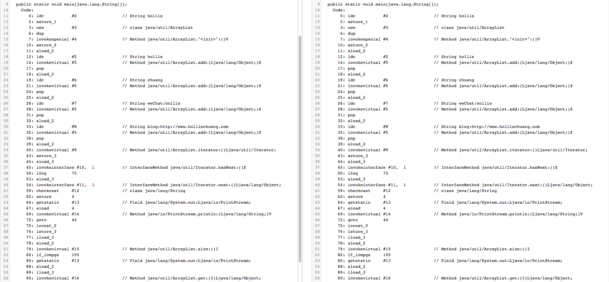
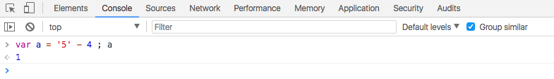

<!--ts-->
   * [前言](#前言)
   * [1. Java代码的编译与反编译那些事儿](#1-java代码的编译与反编译那些事儿)
      * [1.1 编程语言](#11-编程语言)
      * [1.2 什么是编译](#12-什么是编译)
      * [1.3 什么是反编译](#13-什么是反编译)
      * [1.4 Java反编译工具](#14-java反编译工具)
         * [1.4.1 javap](#141-javap)
         * [1.4.2 jad](#142-jad)
         * [1.4.3 CFR](#143-cfr)
      * [1.5 如何防止反编译](#15-如何防止反编译)
   * [2. 深入分析Java的编译原理](#2-深入分析java的编译原理)
      * [2.1 Java中的前端编译](#21-java中的前端编译)
         * [2.1.1 词法分析](#211-词法分析)
         * [2.1.2 语法分析](#212-语法分析)
         * [2.1.3 语义分析](#213-语义分析)
         * [2.1.4 中间代码生成](#214-中间代码生成)
      * [2.2 Java中的后端编译](#22-java中的后端编译)
         * [2.2.1 热点检测](#221-热点检测)
         * [2.2.2 编译优化](#222-编译优化)
   * [3. 我反编译了Java 10的本地变量类型推断](#3-我反编译了java-10的本地变量类型推断)
      * [3.1 和JavaScript有啥区别](#31-和javascript有啥区别)
      * [3.2 到底会不会影响可读性](#32-到底会不会影响可读性)
   * [4. javap命令](#4-javap命令)
   * [5. Java中的Switch对整型、字符型、字符串型的具体实现细节](#5-java中的switch对整型字符型字符串型的具体实现细节)
      * [5.1 switch对整型支持的实现](#51-switch对整型支持的实现)
      * [5.2 switch对字符型支持的实现](#52-switch对字符型支持的实现)
      * [5.3 switch对字符串支持的实现](#53-switch对字符串支持的实现)

<!-- Added by: anapodoton, at: Mon Feb 24 12:13:57 CST 2020 -->

<!--te-->

# 前言

# 1. Java代码的编译与反编译那些事儿

 [Java代码的编译与反编译那些事儿](https://www.hollischuang.com/archives/58)

## 1.1 编程语言

在介绍编译和反编译之前，我们先来简单介绍下编程语言（Programming Language）。编程语言（Programming Language）分为低级语言（Low-level Language）和高级语言（High-level Language）。

机器语言（Machine Language）和汇编语言（Assembly Language）属于低级语言，直接用计算机指令编写程序。

而C、C++、Java、Python等属于高级语言，用语句（Statement）编写程序，语句是计算机指令的抽象表示。

举个例子，同样一个语句用C语言、汇编语言和机器语言分别表示如下：


计算机只能对数字做运算，符号、声音、图像在计算机内部都要用数字表示，指令也不例外，上表中的机器语言完全由十六进制数字组成。最早的程序员都是直接用机器语言编程，但是很麻烦，需要查大量的表格来确定每个数字表示什么意思，编写出来的程序很不直观，而且容易出错，于是有了汇编语言，把机器语言中一组一组的数字用助记符（Mnemonic）表示，直接用这些助记符写出汇编程序，然后让汇编器（Assembler）去查表把助记符替换成数字，也就把汇编语言翻译成了机器语言。

但是，汇编语言用起来同样比较复杂，后面，就衍生出了Java、C、C++等高级语言。

## 1.2 什么是编译

上面提到语言有两种，一种低级语言，一种高级语言。可以这样简单的理解：低级语言是计算机认识的语言、高级语言是程序员认识的语言。

那么如何从高级语言转换成低级语言呢？这个过程其实就是编译。

从上面的例子还可以看出，C语言的语句和低级语言的指令之间不是简单的一一对应关系，一条`a=b+1`;语句要翻译成三条汇编或机器指令，这个过程称为编译（Compile），由编译器（Compiler）来完成，显然编译器的功能比汇编器要复杂得多。用C语言编写的程序必须经过编译转成机器指令才能被计算机执行，编译需要花一些时间，这是用高级语言编程的一个缺点，然而更多的是优点。首先，用C语言编程更容易，写出来的代码更紧凑，可读性更强，出了错也更容易改正。

**将便于人编写、阅读、维护的高级计算机语言所写作的源代码程序，翻译为计算机能解读、运行的低阶机器语言的程序的过程就是编译。负责这一过程的处理的工具叫做编译器**

现在我们知道了什么是编译，也知道了什么是编译器。不同的语言都有自己的编译器，Java语言中负责编译的编译器是一个命令：`javac`

> javac是收录于JDK中的Java语言编译器。该工具可以将后缀名为.java的源文件编译为后缀名为.class的可以运行于Java虚拟机的字节码。

**当我们写完一个`HelloWorld.java`文件后，我们可以使用`javac HelloWorld.java`命令来生成`HelloWorld.class`文件，这个`class`类型的文件是JVM可以识别的文件。通常我们认为这个过程叫做Java语言的编译。其实，`class`文件仍然不是机器能够识别的语言，因为机器只能识别机器语言，还需要JVM再将这种`class`文件类型字节码转换成机器可以识别的机器语言。**

## 1.3 什么是反编译

反编译的过程与编译刚好相反，就是将已编译好的编程语言还原到未编译的状态，也就是找出程序语言的源代码。就是将机器看得懂的语言转换成程序员可以看得懂的语言。Java语言中的反编译一般指将`class`文件转换成`java`文件。

有了反编译工具，我们可以做很多事情，最主要的功能就是有了反编译工具，我们就能读得懂Java编译器生成的字节码。如果你想问读懂字节码有啥用，那么我可以很负责任的告诉你，好处大大的。比如我的博文几篇典型的原理性文章，都是通过反编译工具得到反编译后的代码分析得到的。如深入理解多线程（一）——Synchronized的实现原理、深度分析Java的枚举类型—-枚举的线程安全性及序列化问题、Java中的Switch对整型、字符型、字符串型的具体实现细节、Java的类型擦除等。我最近在GitChat写了一篇关于Java语法糖的文章，其中大部分内容都用到反编译工具来洞悉语法糖背后的原理。

## 1.4 Java反编译工具

本文主要介绍3个Java的反编译工具：**javap**、**jad**和**cfr**

### 1.4.1 javap

`javap`是jdk自带的一个工具，可以对代码反编译，也可以查看java编译器生成的字节码。`javap`和其他两个反编译工具最大的区别是他生成的文件并不是`java`文件，也不像其他两个工具生成代码那样更容易理解。拿一段简单的代码举例，如我们想分析Java 7中的`switch`是如何支持`String`的，我们先有以下可以编译通过的源代码：

```java
public class switchDemoString {
    public static void main(String[] args) {
        String str = "world";
        switch (str) {
            case "hello":
                System.out.println("hello");
                break;
            case "world":
                System.out.println("world");
                break;
            default:
                break;
        }
    }
}
```

执行以下两个命令：

```
javac switchDemoString.java
javap -c switchDemoString.class
```

生成代码如下：

```java
public class com.hollis.suguar.switchDemoString {
  public com.hollis.suguar.switchDemoString();
    Code:
       0: aload_0
       1: invokespecial #1                  // Method java/lang/Object."<init>":()V
       4: return

  public static void main(java.lang.String[]);
    Code:
       0: ldc           #2                  // String world
       2: astore_1
       3: aload_1
       4: astore_2
       5: iconst_m1
       6: istore_3
       7: aload_2
       8: invokevirtual #3                  // Method java/lang/String.hashCode:()I
      11: lookupswitch  { // 2
              99162322: 36
             113318802: 50
               default: 61
          }
      36: aload_2
      37: ldc           #4                  // String hello
      39: invokevirtual #5                  // Method java/lang/String.equals:(Ljava/lang/Object;)Z
      42: ifeq          61
      45: iconst_0
      46: istore_3
      47: goto          61
      50: aload_2
      51: ldc           #2                  // String world
      53: invokevirtual #5                  // Method java/lang/String.equals:(Ljava/lang/Object;)Z
      56: ifeq          61
      59: iconst_1
      60: istore_3
      61: iload_3
      62: lookupswitch  { // 2
                     0: 88
                     1: 99
               default: 110
          }
      88: getstatic     #6                  // Field java/lang/System.out:Ljava/io/PrintStream;
      91: ldc           #4                  // String hello
      93: invokevirtual #7                  // Method java/io/PrintStream.println:(Ljava/lang/String;)V
      96: goto          110
      99: getstatic     #6                  // Field java/lang/System.out:Ljava/io/PrintStream;
     102: ldc           #2                  // String world
     104: invokevirtual #7                  // Method java/io/PrintStream.println:(Ljava/lang/String;)V
     107: goto          110
     110: return
}
```

我个人的理解，`javap`并没有将字节码反编译成`java`文件，而是生成了一种我们可以看得懂字节码。其实javap生成的文件仍然是字节码，只是程序员可以稍微看得懂一些。如果你对字节码有所掌握，还是可以看得懂以上的代码的。其实就是把String转成hashcode，然后进行比较。

个人认为，一般情况下我们会用到`javap`命令的时候不多，一般只有在真的需要看字节码的时候才会用到。但是字节码中间暴露的东西是最全的，你肯定有机会用到，比如我在分析`synchronized`的原理的时候就有是用到`javap`。通过`javap`生成的字节码，我发现`synchronized`底层依赖了`ACC_SYNCHRONIZED`标记和`monitorenter`、`monitorexit`两个指令来实现同步。

### 1.4.2 jad

jad是一个比较不错的反编译工具，只要下载一个执行工具，就可以实现对`class`文件的反编译了。还是上面的源代码，使用jad反编译后内容如下：

命令：`jad switchDemoString.class`

```java
public class switchDemoString
{
    public switchDemoString()
    {
    }
    public static void main(String args[])
    {
        String str = "world";
        String s;
        switch((s = str).hashCode())
        {
        default:
            break;
        case 99162322:
            if(s.equals("hello"))
                System.out.println("hello");
            break;
        case 113318802:
            if(s.equals("world"))
                System.out.println("world");
            break;
        }
    }
}
```

看，这个代码你肯定看的懂，因为这不就是标准的java的源代码么。这个就很清楚的可以看到原来**字符串的switch是通过`equals()`和`hashCode()`方法来实现的**。

但是，jad已经很久不更新了，在对Java7生成的字节码进行反编译时，偶尔会出现不支持的问题，在对Java 8的lambda表达式反编译时就彻底失败。

### 1.4.3 CFR

jad很好用，但是无奈的是很久没更新了，所以只能用一款新的工具替代他，CFR是一个不错的选择，相比jad来说，他的语法可能会稍微复杂一些，但是好在他可以work。

如，我们使用cfr对刚刚的代码进行反编译。执行一下命令：

```
java -jar cfr_0_125.jar switchDemoString.class --decodestringswitch false
```

得到以下代码：

```
public class switchDemoString {
    public static void main(String[] arrstring) {
        String string;
        String string2 = string = "world";
        int n = -1;
        switch (string2.hashCode()) {
            case 99162322: {
                if (!string2.equals("hello")) break;
                n = 0;
                break;
            }
            case 113318802: {
                if (!string2.equals("world")) break;
                n = 1;
            }
        }
        switch (n) {
            case 0: {
                System.out.println("hello");
                break;
            }
            case 1: {
                System.out.println("world");
                break;
            }
        }
    }
}
```

通过这段代码也能得到字符串的switch是通过`equals()`和`hashCode()`方法来实现的结论。

相比Jad来说，CFR有很多参数，还是刚刚的代码，如果我们使用以下命令，输出结果就会不同：

```
java -jar cfr_0_125.jar switchDemoString.class

public class switchDemoString {
    public static void main(String[] arrstring) {
        String string;
        switch (string = "world") {
            case "hello": {
                System.out.println("hello");
                break;
            }
            case "world": {
                System.out.println("world");
                break;
            }
        }
    }
}
```

所以`--decodestringswitch`表示对于switch支持string的细节进行解码。类似的还有`--decodeenumswitch`、`--decodefinally`、`--decodelambdas`等。在我的关于语法糖的文章中，我使用`--decodelambdas`对lambda表达式警进行了反编译。 源码：

```
public static void main(String... args) {
    List<String> strList = ImmutableList.of("Hollis", "公众号：Hollis", "博客：www.hollischuang.com");

    strList.forEach( s -> { System.out.println(s); } );
}
```

`java -jar cfr_0_125.jar lambdaDemo.class --decodelambdas false`反编译后代码：

```
public static /* varargs */ void main(String ... args) {
    ImmutableList strList = ImmutableList.of((Object)"Hollis", (Object)"\u516c\u4f17\u53f7\uff1aHollis", (Object)"\u535a\u5ba2\uff1awww.hollischuang.com");
    strList.forEach((Consumer<String>)LambdaMetafactory.metafactory(null, null, null, (Ljava/lang/Object;)V, lambda$main$0(java.lang.String ), (Ljava/lang/String;)V)());
}

private static /* synthetic */ void lambda$main$0(String s) {
    System.out.println(s);
}
```

CFR还有很多其他参数，均用于不同场景，读者可以使用`java -jar cfr_0_125.jar --help`进行了解。这里不逐一介绍了。

## 1.5 如何防止反编译

由于我们有工具可以对`Class`文件进行反编译，所以，对开发人员来说，如何保护Java程序就变成了一个非常重要的挑战。但是，魔高一尺、道高一丈。当然有对应的技术可以应对反编译咯。但是，这里还是要说明一点，和网络安全的防护一样，无论做出多少努力，其实都只是提高攻击者的成本而已。无法彻底防治。

典型的应对策略有以下几种：

- 隔离Java程序
  - 让用户接触不到你的Class文件
- 对Class文件进行加密
  - 提到破解难度
- 代码混淆
  - 将代码转换成功能上等价，但是难于阅读和理解的形式

# 2. 深入分析Java的编译原理

[深入分析Java的编译原理](https://www.hollischuang.com/archives/2322)

在《[Java代码的编译与反编译](http://www.hollischuang.com/archives/58)》中，有过关于Java语言的编译和反编译的介绍。我们可以通过`javac`命令将Java程序的源代码编译成Java字节码，即我们常说的class文件。这是我们通常意义上理解的编译。

但是，字节码并不是机器语言，要想让机器能够执行，还需要把字节码翻译成机器指令。这个过程是Java虚拟机做的，这个过程也叫编译。是更深层次的编译。

在编译原理中，把源代码翻译成机器指令，一般要经过以下几个重要步骤：

[](http://www.hollischuang.com/wp-content/uploads/2018/04/QQ20180414-203816.png)

根据完成任务不同，可以将编译器的组成部分划分为前端（Front End）与后端（Back End）。

> 前端编译主要指与源语言有关但与目标机无关的部分，包括词法分析、语法分析、语义分析与中间代码生成。
>
> 后端编译主要指与目标机有关的部分，包括代码优化和目标代码生成等。

**我们可以把将`.java`文件编译成`.class`的编译过程称之为前端编译。把将`.class`文件翻译成机器指令的编译过程称之为后端编译。**

## 2.1 Java中的前端编译

前端编译主要指与源语言有关但与目标机无关的部分，包括词法分析、语法分析、语义分析与中间代码生成。

我们所熟知的`javac`的编译就是前端编译。除了这种以外，我们使用的很多IDE，如eclipse，idea等，都内置了前端编译器。主要功能就是把`.java`代码转换成`.class`代码。

### 2.1.1 词法分析

词法分析阶段是编译过程的第一个阶段。这个阶段的任务是从左到右一个字符一个字符地读入源程序，将字符序列转换为标记（token）序列的过程。这里的标记是一个字符串，是构成源代码的最小单位。在这个过程中，词法分析器还会对标记进行分类。

词法分析器通常不会关心标记之间的关系（属于语法分析的范畴），举例来说：词法分析器能够将括号识别为标记，但并不保证括号是否匹配。

### 2.1.2 语法分析

语法分析的任务是在词法分析的基础上将单词序列组合成各类语法短语，如“程序”，“语句”，“表达式”等等.语法分析程序判断源程序在结构上是否正确.源程序的结构由上下文无关文法描述。

### 2.1.3 语义分析

语义分析是编译过程的一个逻辑阶段， 语义分析的任务是对结构上正确的源程序进行上下文有关性质的审查，进行类型审查。语义分析是审查源程序有无语义错误，为代码生成阶段收集类型信息。

语义分析的一个重要部分就是类型检查。比如很多语言要求数组下标必须为整数，如果使用浮点数作为下标，编译器就必须报错。再比如，很多语言允许某些类型转换，称为自动类型转换。

### 2.1.4 中间代码生成

在源程序的语法分析和语义分析完成之后，很多编译器生成一个明确的低级的或类机器语言的中间表示。该中间表示有两个重要的性质： 1.易于生成； 2.能够轻松地翻译为目标机器上的语言。

在Java中，`javac`执行的结果就是得到一个字节码，而这个字节码其实就是一种中间代码。

PS：著名的解语法糖操作，也是在javac中完成的。

## 2.2 Java中的后端编译

首先，我们大家都知道，通常通过 `javac` 将程序源代码编译，转换成 java 字节码，JVM 通过解释字节码将其翻译成对应的机器指令，逐条读入，逐条解释翻译。很显然，经过解释执行，其执行速度必然会比可执行的二进制字节码程序慢很多。这就是传统的JVM的**解释器（Interpreter）**的功能。为了解决这种效率问题，引入了 **JIT** 技术。

JAVA程序还是通过解释器进行解释执行，当JVM发现某个方法或代码块运行特别频繁的时候，就会认为这是“热点代码”（Hot Spot Code)。然后JIT会把部分“热点代码”**翻译**成本地机器相关的机器码，并进行**优化**，然后再把翻译后的机器码**缓存**起来，以备下次使用。

HotSpot虚拟机中内置了两个JIT编译器：Client Complier和Server Complier，分别用在客户端和服务端，目前主流的HotSpot虚拟机中默认是采用解释器与其中一个编译器直接配合的方式工作。

当 JVM 执行代码时，它并不立即开始编译代码。首先，如果这段代码本身在将来只会被执行一次，那么从本质上看，编译就是在浪费精力。因为将代码翻译成 java 字节码相对于编译这段代码并执行代码来说，要快很多。第二个原因是最优化，当 JVM 执行某一方法或遍历循环的次数越多，就会更加了解代码结构，那么 JVM 在编译代码的时候就做出相应的优化。

在机器上，执行`java -version`命令就可以看到自己安装的JDK中JIT是哪种模式:

[](http://www.hollischuang.com/wp-content/uploads/2018/04/javaversion.png)

上图是我的机器上安装的jdk1.8，可以看到，他是Server Compile，但是，需要说明的是，无论是Client Complier还是Server Complier，解释器与编译器的搭配使用方式都是混合模式，即上图中的mixed mode。

### 2.2.1 热点检测

上面我们说过，要想触发JIT，首先需要识别出热点代码。目前主要的热点代码识别方式是热点探测（Hot Spot Detection），有以下两种：

1、基于采样的方式探测（Sample Based Hot Spot Detection) ：周期性检测各个线程的栈顶，发现某个方法经常出险在栈顶，就认为是热点方法。好处就是简单，缺点就是无法精确确认一个方法的热度。容易受线程阻塞或别的原因干扰热点探测。

2、基于计数器的热点探测（Counter Based Hot Spot Detection)。采用这种方法的虚拟机会为每个方法，甚至是代码块建立计数器，统计方法的执行次数，某个方法超过阀值就认为是热点方法，触发JIT编译。

在HotSpot虚拟机中使用的是第二种——基于计数器的热点探测方法，因此它为每个方法准备了两个计数器：方法调用计数器和回边计数器。

方法计数器。顾名思义，就是记录一个方法被调用次数的计数器。

回边计数器。是记录方法中的for或者while的运行次数的计数器。

### 2.2.2 编译优化

前面提到过，JIT除了具有缓存的功能外，还会对代码做各种优化。说到这里，不得不佩服HotSpot的开发者，他们在JIT中对于代码优化真的算是面面俱到了。

这里简答提及几个我觉得比较重要的优化技术，并不准备直接展开，读者感兴趣的话，我后面再写文章单独介绍。

逃逸分析、 锁消除、 锁膨胀、 方法内联、 空值检查消除、 类型检测消除、 公共子表达式消除

# 3. 我反编译了Java 10的本地变量类型推断

[我反编译了Java 10的本地变量类型推断](https://www.hollischuang.com/archives/2187)

北京时间 3 月 21 日，Oracle 官方宣布 Java 10 正式发布。这是 Java 大版本周期变化后的第一个正式发布版本。关于Java 10 ，最值得程序员关注的一个新特性恐怕就是本地变量类型推断（local-variable type inference）了。

Java 10 推出之后，很多文章也随之出来了，告诉我们有哪些特性，告诉我们本地变量类型推断怎么用。但是，知其然，要知其所以然。

Java 10发布之后，我第一时间下载了这个版本的Jdk并安装到我的电脑中，然后写了一段代码，真正的感受一下本地变量推断到底如何。这篇文章简单来谈一下我的感受。

关于本地变量类型推断的用法，我的《[Java 10将于本月发布，它会改变你写代码的方式](http://www.hollischuang.com/archives/2064)》中有介绍过。主要可以用在以下几个场景中：

```java
public class VarDemo {

    public static void main(String[] args) {
        //初始化局部变量  
        var string = "hollis";
        //初始化局部变量  
        var stringList = new ArrayList<String>();
        stringList.add("hollis");
        stringList.add("chuang");
        stringList.add("weChat:hollis");
        stringList.add("blog:http://www.hollischuang.com");
        //增强for循环的索引
        for (var s : stringList){
            System.out.println(s);
        }
        //传统for循环的局部变量定义
        for (var i = 0; i < stringList.size(); i++){
            System.out.println(stringList.get(i));
        }
    }
}
```

然后，使用java 10的javac命令进行编译：

```
/Library/Java/JavaVirtualMachines/jdk-10.jdk/Contents/Home/bin/javac VarDemo.java
```

生成VarDemo.class文件，我们对VarDemo.class进行[反编译](http://www.hollischuang.com/archives/58)。用jad进行反编译得到以下代码：

```java
public class VarDemo
{
    public static void main(String args[])
    {
        String s = "hollis";
        ArrayList arraylist = new ArrayList();
        arraylist.add("hollis");
        arraylist.add("chuang");
        arraylist.add("weChat:hollis");
        arraylist.add("blog:http://www.hollischuang.com");
        String s1;
        for(Iterator iterator = arraylist.iterator(); iterator.hasNext(); System.out.println(s1))
            s1 = (String)iterator.next();

        for(int i = 0; i < arraylist.size(); i++)
            System.out.println((String)arraylist.get(i));

    }
}
```

这段代码我们就很熟悉了，就是在Java 10之前，没有本地变量类型推断的时候写的代码。代码的对应关系如下：

|            本地变量类型推断写法             |                  正常写法                   |
| :-----------------------------------------: | :-----------------------------------------: |
|           var string = “hollis”;            |          String string = “hollis”;          |
|      var stringList = new ArrayList();      |   ArrayList stringList = new ArrayList();   |
|          for (var s : stringList)           |         for (String s : stringList)         |
| for (var i = 0; i < stringList.size(); i++) | for (int i = 0; i < stringList.size(); i++) |

> `ArrayList arraylist = new ArrayList();` 其实是`ArrayList stringList = new ArrayList();` 解糖后，类型擦除后的写法。
>
> `for(Iterator iterator = arraylist.iterator(); iterator.hasNext(); System.out.println(s1))` 其实是 `for (String s : stringList)` 这种for循环解糖后的写法。

所以，本地变量类型推断，也是Java 10提供给开发者的语法糖。虽然我们在代码中使用var进行了定义，但是对于虚拟机来说他是不认识这个var的，在java文件编译成class文件的过程中，会进行解糖，使用变量真正的类型来替代var（如使用`String string` 来替换 `var string`）。对于虚拟机来说，完全不需要对var做任何兼容性改变，因为他的生命周期在编译阶段就结束了。唯一变化的是编译器在编译过程中需要多增加一个关于var的解糖操作。

感兴趣的同学可以写两段代码，一段使用var，一段不使用var，然后对比下编译后的字节码。你会发现真的是完全一样的。下图是我用diff工具对比的结果。

[](http://www.hollischuang.com/wp-content/uploads/2018/03/diff.png)

> 语法糖（Syntactic Sugar），也称糖衣语法，是由英国计算机学家 Peter.J.Landin 发明的一个术语，指在计算机语言中添加的某种语法，这种语法对语言的功能并没有影响，但是更方便程序员使用。简而言之，语法糖让程序更加简洁，有更高的可读性。

## 3.1 和JavaScript有啥区别

很多人都知道，在JavaScript中，变量的定义就是使用var来声明的。所以，Java 10的本地变量类型推断刚刚一出来，就有人说了，这不就是抄袭JavaScript的吗？这和JS里面的var不是一样吗？

其实，还真的不一样。

首先，JavaScript 是一种弱类型（或称动态类型）语言，即变量的类型是不确定的。你可以在JavaScript中，使用“4”-3这样的语法，他的的结果是数字1，这里字符串和数字做运算了。不信的话，你打开你浏览器的控制台，试一下：

[](http://www.hollischuang.com/wp-content/uploads/2018/03/console.png)

但是，Java中虽然可以使用var来声明变量，但是它还是一种强类型的语言。通过上面反编译的代码，我们已经知道，var只是Java给开发者提供的语法糖，最终在编译之后还是要将var定义的对象类型定义成编译器推断出来的类型的。

## 3.2 到底会不会影响可读性

本地变量类型推断最让人诟病的恐怕就是其可读性了，因为在之前，我们定义变量时候要明确指定他的类型，所以在阅读代码的时候只要看其声明的类型就可以知道他的类型了，但是全都使用var之后，那就惨了。毫无疑问，这会损失一部分可读性的。但是，在代码中使用var声明对象同样也带来了很多的好处，如代码更加简洁等。

一个新东西刚刚出来之前，总会有各种不习惯。现在大家就会觉得这东西太影响我阅读代码的效率。就像淘宝商城刚刚改名叫天猫的时候，大家都觉得，这是个什么鬼名字。现在听习惯了，是不是觉得还挺好的。

如果大家都使用了var来声明变量以后，那么变量的名字就更加重要了。那时候大家就会更注重变量起名的可读性。而且，相信不久，各大IDE就会推出智能显示变量的推断类型功能。所以，从各个方面，都能弥补一些不足。

总之，对于本地变量类型推断这一特性，我是比较积极的拥抱的。

最后，再提出一个问题，供大家思考，本地变量类型推断看上去还是挺好用的，而且，既然Java已经决定在新版本中推出他，那么为什么要限制他的用法呢。现在已知的可以使用var声明变量的几个场景就是初始化局部变量、增强for循环的索引和传统for循环的局部变量定义，还有几个场景是不支持这种用法的，如：

方法的参数 构造函数的参数 方法的返回值类型 对象的成员变量 只是定义定义而不初始化

那么，我的问题是，Java为什么做这些限制，考虑是什么？

# 4. javap命令

[javap命令](https://github.com/haojunsheng/JavaLearning/blob/master/jvmLearning/java-command.md#71-实例)

# 5. Java中的Switch对整型、字符型、字符串型的具体实现细节

Java 7中，switch的参数可以是String类型了，这对我们来说是一个很方便的改进。到目前为止switch支持这样几种数据类型：`byte` `short` `int` `char` `String` 。但是，作为一个程序员我们不仅要知道他有多么好用，还要知道它是如何实现的，switch对整型的支持是怎么实现的呢？对字符型是怎么实现的呢？String类型呢？有一点Java开发经验的人这个时候都会猜测switch对String的支持是使用equals()方法和hashcode()方法。那么到底是不是这两个方法呢？接下来我们就看一下，switch到底是如何实现的。

## 5.1 switch对整型支持的实现

下面是一段很简单的Java代码，定义一个int型变量a，然后使用switch语句进行判断。执行这段代码输出内容为5，那么我们将下面这段代码反编译，看看他到底是怎么实现的。

```java
public class switchDemoInt {
    public static void main(String[] args) {
        int a = 5;
        switch (a) {
        case 1:
            System.out.println(1);
            break;
        case 5:
            System.out.println(5);
            break;
        default:
            break;
        }
    }
}
//output 5
```

反编译后的代码如下：

```java
public class switchDemoInt
{
    public switchDemoInt()
    {
    }
    public static void main(String args[])
    {
        int a = 5;
        switch(a)
        {
        case 1: // '\001'
            System.out.println(1);
            break;

        case 5: // '\005'
            System.out.println(5);
            break;
        }
    }
}
```

我们发现，反编译后的代码和之前的代码比较除了多了两行注释以外没有任何区别，那么我们就知道，**switch对int的判断是直接比较整数的值**。

## 5.2 switch对字符型支持的实现

直接上代码：

```java
public class switchDemoInt {
    public static void main(String[] args) {
        char a = 'b';
        switch (a) {
        case 'a':
            System.out.println('a');
            break;
        case 'b':
            System.out.println('b');
            break;
        default:
            break;
        }
    }
}
```

编译后的代码如下：

```java
public class switchDemoChar
{
    public switchDemoChar()
    {
    }
    public static void main(String args[])
    {
        char a = 'b';
        switch(a)
        {
        case 97: // 'a'
            System.out.println('a');
            break;
        case 98: // 'b'
            System.out.println('b');
            break;
        }
  }
}
```

通过以上的代码作比较我们发现：对char类型进行比较的时候，实际上比较的是ascii码，编译器会把char型变量转换成对应的int型变量

## 5.3 switch对字符串支持的实现

还是先上代码：

```java
public class switchDemoString {
    public static void main(String[] args) {
        String str = "world";
        switch (str) {
        case "hello":
            System.out.println("hello");
            break;
        case "world":
            System.out.println("world");
            break;
        default:
            break;
        }
    }
}
```

对代码进行反编译：

```
public class switchDemoString
{
    public switchDemoString()
    {
    }
    public static void main(String args[])
    {
        String str = "world";
        String s;
        switch((s = str).hashCode())
        {
        default:
            break;
        case 99162322:
            if(s.equals("hello"))
                System.out.println("hello");
            break;
        case 113318802:
            if(s.equals("world"))
                System.out.println("world");
            break;
        }
    }
}
```

看到这个代码，你知道原来字符串的switch是通过`equals()`和`hashCode()`方法来实现的。**记住，switch中只能使用整型**，比如`byte`。`short`，`char`(ackii码是整型)以及`int`。还好`hashCode()`方法返回的是`int`，而不是`long`。通过这个很容易记住`hashCode`返回的是`int`这个事实。仔细看下可以发现，进行`switch`的实际是哈希值，然后通过使用equals方法比较进行安全检查，这个检查是必要的，因为哈希可能会发生碰撞。因此它的性能是不如使用枚举进行switch或者使用纯整数常量，但这也不是很差。因为Java编译器只增加了一个`equals`方法，如果你比较的是字符串字面量的话会非常快，比如”abc” ==”abc”。如果你把`hashCode()`方法的调用也考虑进来了，那么还会再多一次的调用开销，因为字符串一旦创建了，它就会把哈希值缓存起来。因此如果这个`siwtch`语句是用在一个循环里的，比如逐项处理某个值，或者游戏引擎循环地渲染屏幕，这里`hashCode()`方法的调用开销其实不会很大。

好，以上就是关于switch对整型、字符型、和字符串型的支持的实现方式，总结一下我们可以发现，**其实swich只支持一种数据类型，那就是整型，其他数据类型都是转换成整型之后在使用switch的。**
