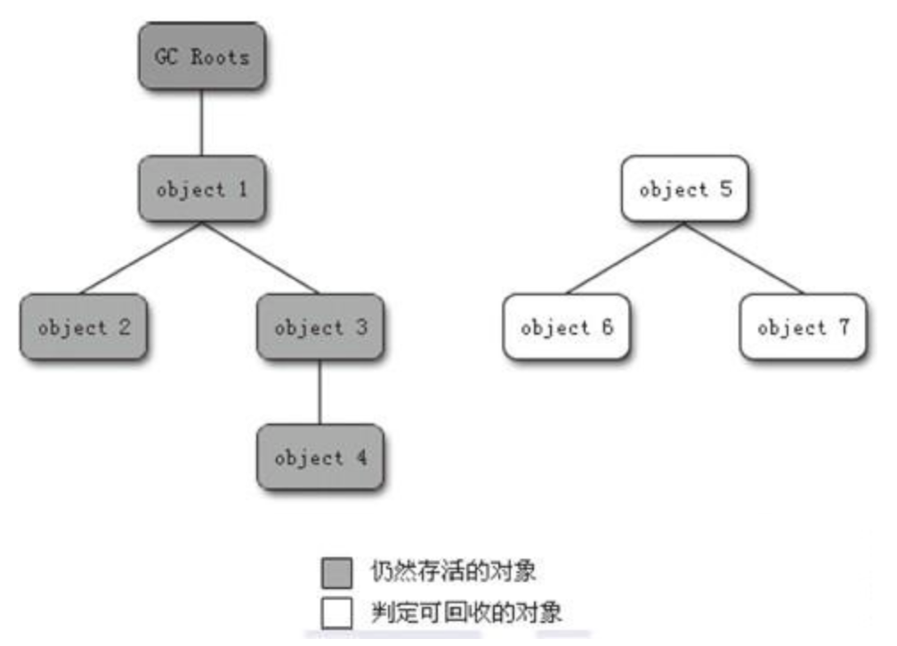
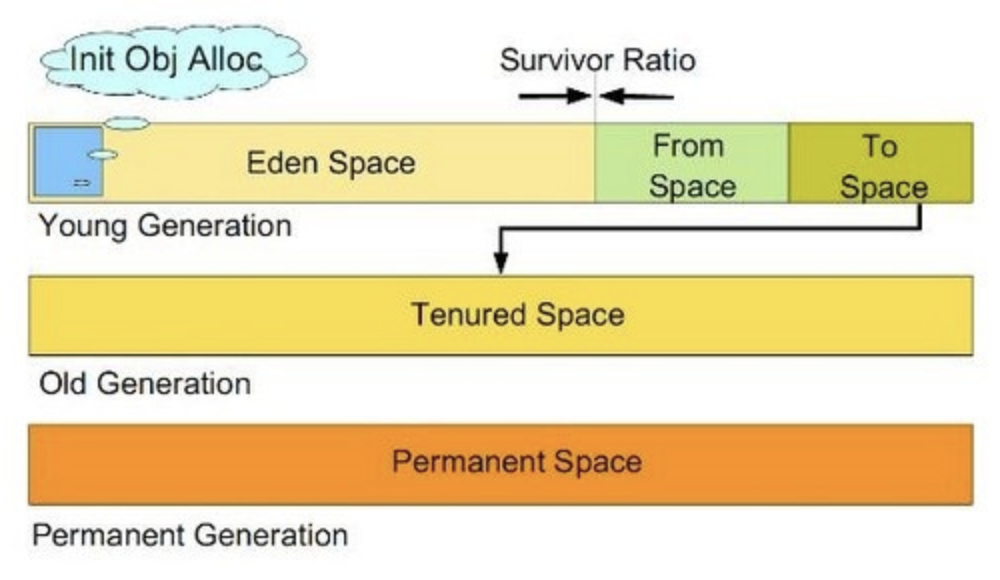
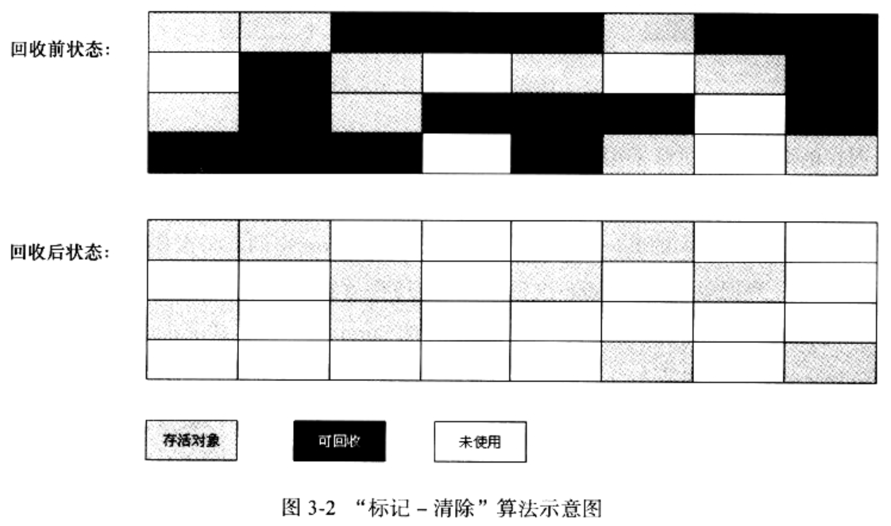
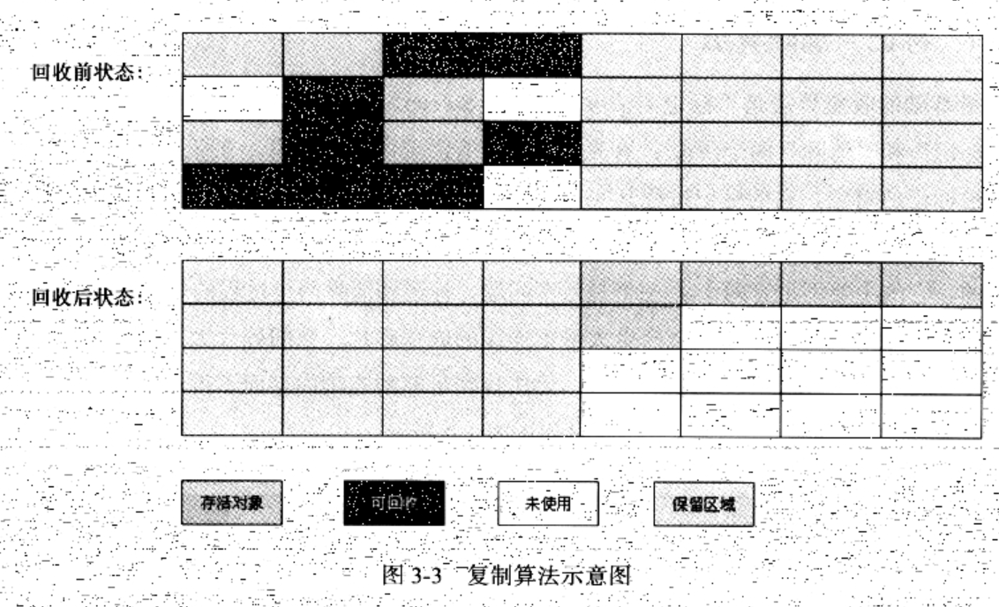
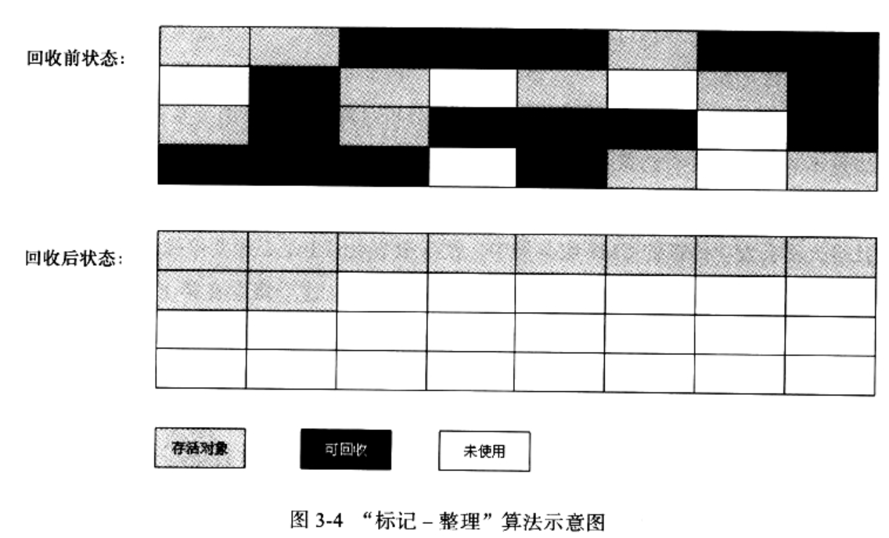
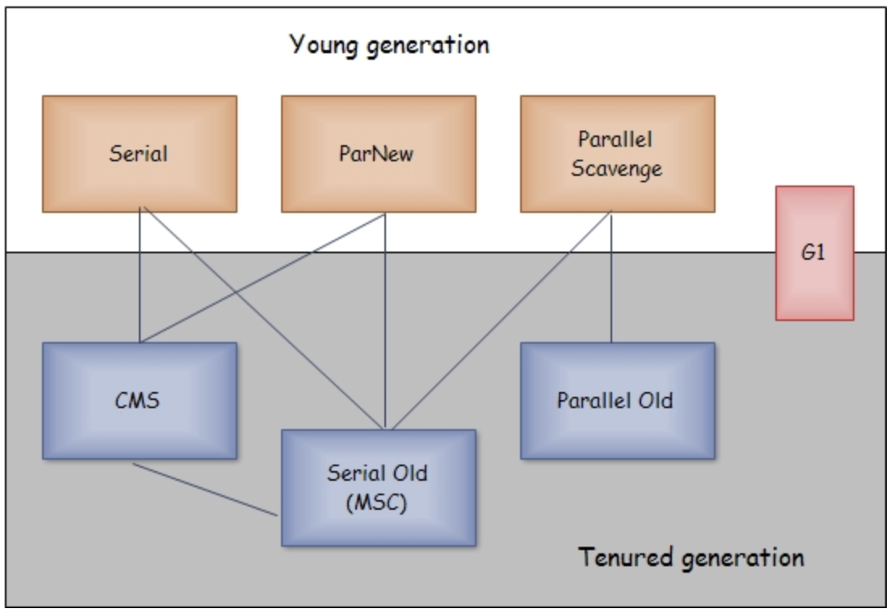
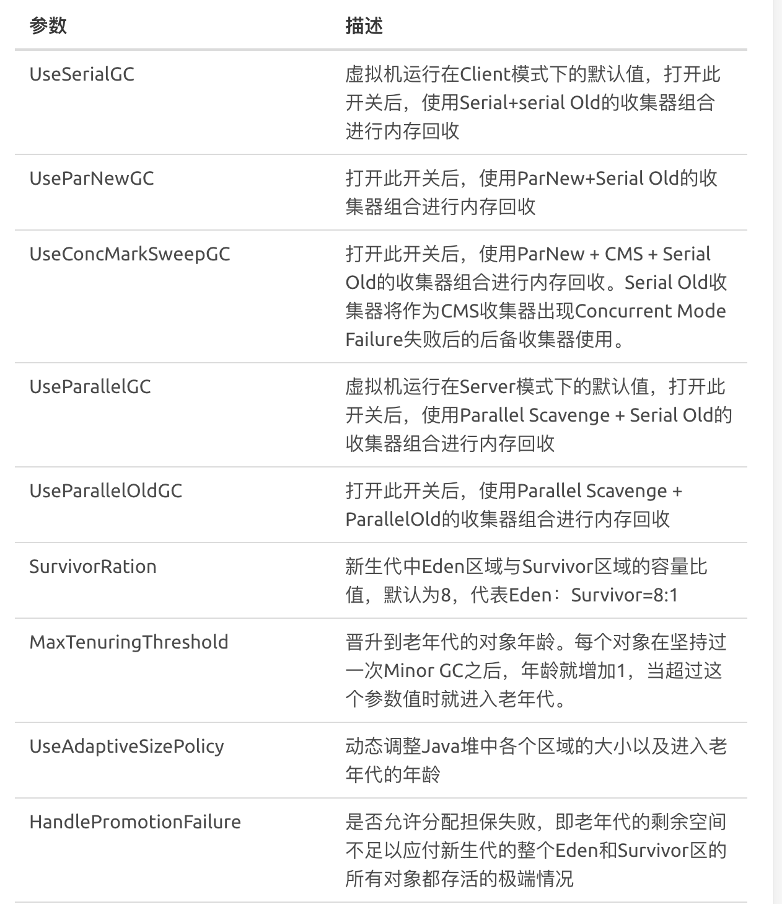
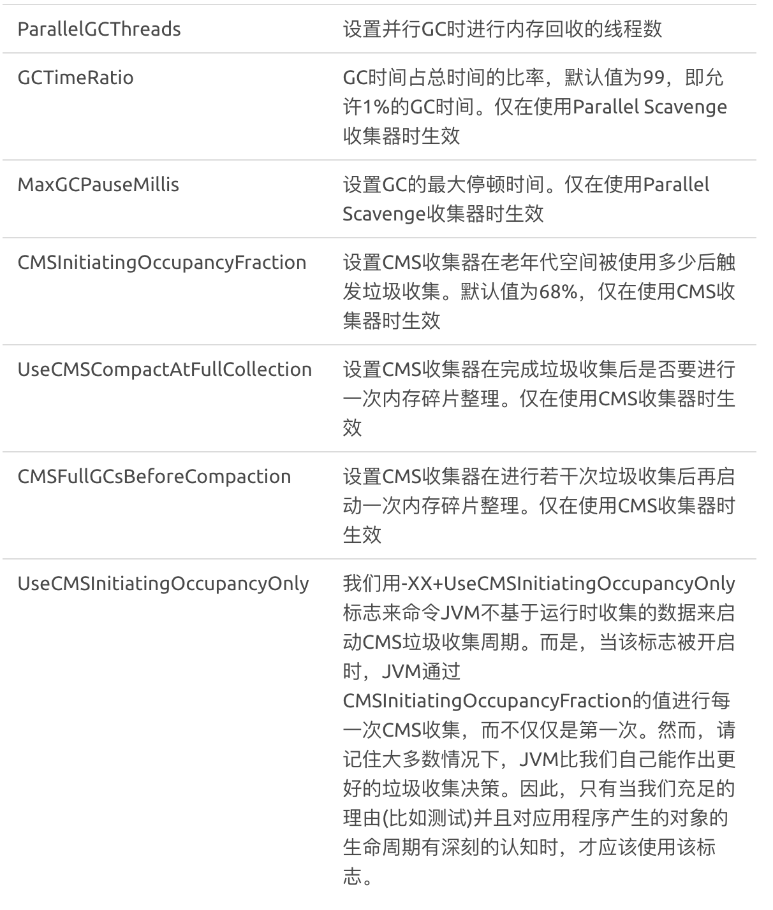

<!--ts-->
   * [前言](#前言)
   * [1 垃圾回收](#1-垃圾回收)
      * [1.1 为什么要进行垃圾回收？](#11-为什么要进行垃圾回收)
      * [1.2 哪些“垃圾”需要回收？](#12-哪些垃圾需要回收)
      * [1.3 什么时候进行垃圾回收？](#13-什么时候进行垃圾回收)
      * [1.4 如何进行垃圾回收？](#14-如何进行垃圾回收)
      * [1.5 常见的GC算法](#15-常见的gc算法)
         * [1.5.1 引用计数法 (Reference Counting)](#151-引用计数法-reference-counting)
         * [1.5.2 标记-清除算法（Mark-Sweep）](#152-标记-清除算法mark-sweep)
         * [1.5.3 复制算法（Copying）](#153-复制算法copying)
         * [1.5.4 标记-压缩算法（Mark-Compact）](#154-标记-压缩算法mark-compact)
         * [1.5.5 增量算法 (Incremental Collecting)](#155-增量算法-incremental-collecting)
         * [1.5.6 分代 (Generational Collecting)](#156-分代-generational-collecting)
      * [1.6 常见的垃圾收集器](#16-常见的垃圾收集器)
         * [1.6.1 新生代串行收集器(Serial)](#161-新生代串行收集器serial)
         * [1.6.2 老年代串行收集器(Serial old)](#162-老年代串行收集器serial-old)
         * [1.6.3 并行收集器(ParNew)](#163-并行收集器parnew)
         * [1.6.4 新生代并行回收 (Parallel Scavenge) 收集器](#164-新生代并行回收-parallel-scavenge-收集器)
         * [1.6.5 老年代并行回收收集器（Parallel old）](#165-老年代并行回收收集器parallel-old)
         * [1.6.6 CMS 收集器](#166-cms-收集器)
         * [1.6.7 G1 收集器 (Garbage First)](#167-g1-收集器-garbage-first)
      * [1.7 收集器对系统性能的影响](#17-收集器对系统性能的影响)
      * [1.8 GC日志](#18-gc日志)
      * [1.9 GC 相关参数总结](#19-gc-相关参数总结)
   * [2 <strong>Java程序性能优化</strong>](#2-java程序性能优化)
      * [2.1 gc()的调用](#21-gc的调用)
      * [2.2 finalize()的调用及重写](#22-finalize的调用及重写)
      * [2.3 程序如何与GC进行交互](#23-程序如何与gc进行交互)
      * [2.4 优秀的编程习惯](#24-优秀的编程习惯)
   * [3. 从实际案例聊聊Java应用的GC优化-美团](#3-从实际案例聊聊java应用的gc优化-美团)
      * [3.1 优化前的准备](#31-优化前的准备)
         * [3.1.1 GC优化需知](#311-gc优化需知)
         * [3.1.2 JVM基础回顾](#312-jvm基础回顾)
            * [3.1.2.1 JVM内存结构](#3121-jvm内存结构)
            * [3.1.2.2 常见垃圾回收器](#3122-常见垃圾回收器)
            * [3.1.2.3 GC日志](#3123-gc日志)
         * [3.1.3 参数基本策略](#313-参数基本策略)
      * [3.2 优化步骤](#32-优化步骤)
         * [3.2.1 确定目标](#321-确定目标)
            * [优化](#优化)
         * [3.2.2 验收优化结果](#322-验收优化结果)
      * [3.3 GC优化案例](#33-gc优化案例)
         * [3.3.1 案例一 Major GC和Minor GC频繁](#331-案例一-major-gc和minor-gc频繁)
            * [3.3.1.1 确定目标](#3311-确定目标)
            * [3.3.1.2 优化](#3312-优化)
            * [3.3.1.3 优化结果](#3313-优化结果)
            * [3.3.1.4 小结](#3314-小结)
            * [3.3.1.5 更多思考](#3315-更多思考)
         * [3.3.2 请求高峰期发生GC，导致服务可用性下降](#332-请求高峰期发生gc导致服务可用性下降)
            * [3.3.2.1 确定目标](#3321-确定目标)
            * [3.3.2.2 优化](#3322-优化)
            * [3.3.2.3 优化结果](#3323-优化结果)
            * [3.3.2.4 小结](#3324-小结)
            * [3.3.2.5 更多思考](#3325-更多思考)
         * [3.3.3 案例三 发生Stop-The-World的GC](#333-案例三-发生stop-the-world的gc)
            * [3.3.3.1 确定目标](#3331-确定目标)
            * [3.3.3.2 优化](#3332-优化)
            * [3.3.3.3 优化结果](#3333-优化结果)
            * [3.3.3.4 小结](#3334-小结)
      * [3.4 总结](#34-总结)
      * [3.5 参考文献](#35-参考文献)

<!-- Added by: anapodoton, at: Mon Feb 24 11:54:36 CST 2020 -->

<!--te-->

# 前言

**可以根据本节内容回答下面的问题**：

内存分配策略、垃圾收集器（G1）、GC算法、GC参数、对象存活的判定 

https://www.ibm.com/developerworks/cn/java/j-lo-JVMGarbageCollection/

# 1 垃圾回收

## 1.1 为什么要进行垃圾回收？

随着程序的运行，内存中存在的实例对象、变量等信息占据的内存越来越多，如果不及时进行垃圾回收，必然会带来程序性能的下降，甚至会因为可用内存不足造成一些不必要的系统异常。

GC是垃圾收集的意思（`Garbage Collection`）,内存处理是编程人员容易出现问题的地方，忘记或者错误的内存回收会导致程序或系统的不稳定甚至崩溃，Java提供的GC功能可以自动监测对象是否超过作用域从而达到自动回收内存的目的，Java语言没有提供释放已分配内存的显示操作方法。

所以，Java的内存管理实际上就是对象的管理，其中包括对象的分配和释放。
对于程序员来说，分配对象使用`new`关键字；释放对象时，只要将对象所有引用赋值为null，让程序不能够再访问到这个对象，我们称该对象为”不可达的”.GC将负责回收所有”不可达”对象的内存空间。
对于GC来说，**当程序员创建对象时，GC就开始监控这个对象的地址、大小以及使用情况。通常，GC采用有向图的方式记录和管理堆（heap）中的所有对象。通过这种方式确定哪些对象是”可达的”，哪些对象是”不可达的”.当GC确定一些对象为”不可达”时，GC就有责任回收这些内存空间。但是，为了保证GC能够在不同平台实现的问题，Java规范对GC的很多行为都没有进行严格的规定。例如，对于采用什么类型的回收算法、什么时候进行回收等重要问题都没有明确的规定。因此，不同的JVM的实现者往往有不同的实现算法。这也给Java程序员的开发带来行多不确定性。**本文研究了几个与GC工作相关的问题，努力减少这种不确定性给Java程序带来的负面影响。

## 1.2 哪些“垃圾”需要回收？

在我们上面介绍的五大区中，有三个是不需要进行垃圾回收的：程序计数器、JVM栈、本地方法栈。因为它们的生命周期是和线程同步的，随着线程的销毁，它们占用的内存会自动释放，所以只有方法区和堆（主要还是堆）需要进行GC（不一定方法区，可能是堆中的永久代）。具体到哪些对象的话，简单概况一句话：如果某个对象已经不存在任何引用，那么它可以被回收。通俗解释一下就是说，如果一个对象，已经没有什么作用了，就可以被当废弃物被回收了。

## 1.3 什么时候进行垃圾回收？

我们需要了解下jvm是怎么**判断一个对象有没有死掉**的。

1. 引用计数算法(Reference count)
   1. 特点：每个对象添加一个引用计数器，每被引用一次，计数器加1，失去引用，计数器减1，当计数器在一段时间内保持为0时，该对象就认为是可以被回收得了。
   2. 缺点：当两个对象**相互引用**，但是二者已经没有作用时，按照常规，应该对其进行垃圾回收，但是其相互引用，又不符合垃圾回收的条件，因此无法完美处理这块内存清理。
2. 可达性分析算法(Reachability Analysis)
   1. 特点：从一个叫GC Roots的对象开始，向下搜索，如果一个对象不能到达GC Roots对象的时候，说明它已经不再被引用，即可被进行垃圾回收（此处 暂且这样理解，其实事实还有一些不同，当一个对象不再被引用时，并没有完全“死亡”，如果类重写了finalize()方法，且没有被系统调用过，那么系统会调用一次finalize()方法，以完成最后的工作，在这期间，如果可以将对象重新与任何一个和GC Roots有引用的对象相关联，则该对象可以“重生”，如果不可以，那么就说明彻底可以被回收了），如上图中的Object5、Object6、Object7，虽然它们3个依然可能相互引用，但是总体来说，它们已经没有作用了，这样就解决了引用计数算法无法解决的问题。
   2. GCROOTS:
      1. 虚拟机栈中引用的对象
      2. 方法区中静态属性引用的对象
      3. 方法区中常量引用的对象
      4. native方法医用的对象



补充引用的概念：JDK 1.2之后，对引用进行了扩充，引入了强、软、若、虚四种引用，被标记为这四种引用的对象，在GC时分别有不同的意义：

a：强引用(Strong Reference).就是为刚被new出来的对象所加的引用，它的特点就是，永远不会被回收。

b：软引用(Soft Reference).声明为软引用的类，是可被回收的对象，如果JVM内存并不紧张，这类对象可以不被回收，如果内存紧张，则会被回收。此处有一个问题，既然被引用为软引用的对象可以回收，为什么不去回收呢？其实我们知道，Java中是存在缓存机制的，就拿字面量缓存来说，有些时候，缓存的对象就是当前可有可无的，只是留在内存中如果还有需要，则不需要重新分配内存即可使用，因此，这些对象即可被引用为软引用，方便使用，提高程序性能。

c：弱引用(Weak Reference).弱引用的对象就是一定需要进行垃圾回收的，不管内存是否紧张，当进行GC时，标记为弱引用的对象一定会被清理回收。

d：虚引用(Phantom Reference).虚引用弱的可以忽略不计，JVM完全不会在乎虚引用，其唯一作用就是做一些跟踪记录，辅助finalize函数的使用。

最后总结，什么样的类需要回收呢？无用的类，何为无用的类？需满足如下要求：

   1> 该类的所有实例对象都已经被回收。

   2> 加载该类的ClassLoader已经被回收。

   3> 该类对应的反射类java.lang.Class对象没有被任何地方引用。

## 1.4 如何进行垃圾回收？

本块内容以介绍垃圾回收算法为主，因为我们前面有介绍，内存主要被分为三块，新生代、旧生代、持久代。三代的特点不同，造就了他们所用的GC算法不同，新生代适合那些生命周期较短，频繁创建及销毁的对象，旧生代适合生命周期相对较长的对象，持久代在Sun HotSpot中就是指方法区（有些JVM中根本就没有持久代这中说法）。首先介绍下新生代、旧生代、持久代的概念及特点：



分代的垃圾回收策略，是基于这样一个事实：**不同的对象的生命周期是不一样的**。因此，不同生命周期的对象可以采取不同的收集方式，以便提高回收效率。
在Java程序运行的过程中，会产生大量的对象，其中有些对象是与业务信息相关，比如Http请求中的Session对象、线程、Socket连接，这类对象跟业务直接挂钩，因此生命周期比较长。但是还有一些对象，主要是程序运行过程中生成的临时变量，这些对象生命周期会比较短，比如：String对象，由于其不变类的特性，系统会产生大量的这些对象，有些对象甚至只用一次即可回收。
试想，在不进行对象存活时间区分的情况下，每次垃圾回收都是对整个堆空间进行回收，花费时间相对会长，同时，因为每次回收都需要遍历所有存活对象，但实际上，对于生命周期长的对象而言，这种遍历是没有效果的，因为可能进行了很多次遍历，但是他们依旧存在。因此，分代垃圾回收采用分治的思想，进行代的划分，把不同生命周期的对象放在不同代上，不同代上采用最适合它的垃圾回收方式进行回收。

虚拟机中的共划分为三个代：**年轻代(Young Generation)、年老点(Old Generation)和持久代(Permanent Generation)。**其中持久代主要存放的是Java类的类信息，与垃圾收集要收集的Java对象关系不大。年轻代和年老代的划分是对垃圾收集影响比较大的。

**年轻代**:

　　所有新生成的对象首先都是放在年轻代的。年轻代的目标就是尽可能快速的收集掉那些生命周期短的对象。年轻代分三个区。一个Eden区，两个Survivor区(一般而言)。大部分对象在Eden区中生成在GC开始的时候，对象只会存在于Eden区和名为“From”的Survivor区，Survivor区“To”是空的。紧接着进行GC，Eden区中所有存活的对象都会被复制到“To”，而在“From”区中，仍存活的对象会根据他们的年龄值来决定去向。年龄达到一定值(年龄阈值，可以通过-XX:MaxTenuringThreshold来设置)的对象会被移动到年老代中，没有达到阈值的对象会被复制到“To”区域。经过这次GC后，Eden区和From区已经被清空。这个时候，“From”和“To”会交换他们的角色，也就是新的“To”就是上次GC前的“From”，新的“From”就是上次GC前的“To”。不管怎样，都会保证名为To的Survivor区域是空的。Minor GC会一直重复这样的过程，直到“To”区被填满，“To”区被填满之后，会将所有对象移动到年老代中。

**年老代**:

在年轻代中经历了N次垃圾回收后仍然存活的对象，就会被放到年老代中。因此，可以认为年老代中存放的都是一些生命周期较长的对象。

**持久代**:

用于存放静态文件，如今Java类、方法等。持久代对垃圾回收没有显着影响，但是有些应用可能动态生成或者调用一些class，例如Hibernate等，在这种时候需要设置一个比较大的持久代空间来存放这些运行过程中新增的类。持久代大小通过-XX:MaxPermSize=进行设置。

什么情况下触发垃圾回收
由于对象进行了分代处理，因此垃圾回收区域、时间也不一样。GC有两种类型：`Scavenge GC`和`Full GC`。

> `Scavenge GC`
> 一般情况下，当新对象生成，并且在Eden申请空间失败时，就会触发Scavenge GC，对Eden区域进行GC，清除非存活对象，并且把尚且存活的对象移动到Survivor区。然后整理Survivor的两个区。这种方式的GC是对年轻代的Eden区进行，不会影响到年老代。因为大部分对象都是从Eden区开始的，同时Eden区不会分配的很大，所以Eden区的GC会频繁进行。因而，一般在这里需要使用速度快、效率高的算法，使Eden去能尽快空闲出来。
> `Full GC`
> 对整个堆进行整理，包括Young、Tenured和Perm。Full GC因为需要对整个对进行回收，所以比Scavenge GC要慢，因此应该尽可能减少Full GC的次数。在对JVM调优的过程中，很大一部分工作就是对于FullGC的调节。有如下原因可能导致Full GC：
> · 年老代(Tenured)被写满
> · 持久代(Perm)被写满
> · System.gc()被显示调用
> ·上一次GC之后Heap的各域分配策略动态变化

## 1.5 常见的GC算法

https://www.ibm.com/developerworks/cn/java/j-lo-JVMGarbageCollection/

### 1.5.1 引用计数法 (Reference Counting)

引用计数器在微软的 COM 组件技术中、Adobe 的 ActionScript3 种都有使用。

引用计数器的实现很简单，对于一个对象 A，只要有任何一个对象引用了 A，则 A 的引用计数器就加 1，当引用失效时，引用计数器就减 1。只要对象 A 的引用计数器的值为 0，则对象 A 就不可能再被使用。

引用计数器的实现也非常简单，只需要为每个对象配置一个整形的计数器即可。但是引用计数器有一个严重的问题，即无法处理循环引用的情况。因此，在 Java 的垃圾回收器中没有使用这种算法。

一个简单的循环引用问题描述如下：有对象 A 和对象 B，对象 A 中含有对象 B 的引用，对象 B 中含有对象 A 的引用。此时，对象 A 和对象 B 的引用计数器都不为 0。但是在系统中却不存在任何第 3 个对象引用了 A 或 B。也就是说，A 和 B 是应该被回收的垃圾对象，但由于垃圾对象间相互引用，从而使垃圾回收器无法识别，引起内存泄漏。

### 1.5.2 标记-清除算法（Mark-Sweep）

标记-清除算法将垃圾回收分为两个阶段：**标记阶段和清除阶段**。

- 特点：一种可行的实现是，在标记阶段首先通过根节点，标记所有从根节点开始的较大对象。因此，未被标记的对象就是未被引用的垃圾对象。然后，在清除阶段，清除所有未被标记的对象。
- 缺点：
  - 效率问题：标记和清除的效率都不高。
  - 空间问题：存在大量的空间碎片，因为回收后的空间是不连续的。在对象的堆空间分配过程中，尤其是大对象的内存分配，不连续的内存空间的工作效率要低于连续的空间。



### 1.5.3 复制算法（Copying）

**解决了标记-清除算法的效率问题。解决了内存碎片的问题，缺陷是可以使用的内存变成了原来的一半。**

将现有的内存空间分为两快，每次只使用其中一块，在垃圾回收时将正在使用的内存中的存活对象复制到未被使用的内存块中，之后，清除正在使用的内存块中的所有对象，交换两个内存的角色，完成垃圾回收。

如果系统中的垃圾对象很多，复制算法需要复制的存活对象数量并不会太大。因此在真正需要垃圾回收的时刻，复制算法的效率是很高的。又由于对象在垃圾回收过程中统一被复制到新的内存空间中，因此，可确保回收后的内存空间是没有碎片的。该算法的缺点是将系统内存折半。

Java 的新生代串行垃圾回收器中使用了复制算法的思想。新生代分为 eden 空间、from 空间、to 空间 3 个部分。其中 from 空间和 to 空间可以视为用于复制的两块大小相同、地位相等，且可进行角色互换的空间块。from 和 to 空间也称为 survivor 空间，即幸存者空间，用于存放未被回收的对象。

在垃圾回收时，eden 空间中的存活对象会被复制到未使用的 survivor 空间中 (假设是 to)，正在使用的 survivor 空间 (假设是 from) 中的年轻对象也会被复制到 to 空间中 (大对象，或者老年对象会直接进入老年带，如果 to 空间已满，则对象也会直接进入老年代)。此时，eden 空间和 from 空间中的剩余对象就是垃圾对象，可以直接清空，to 空间则存放此次回收后的存活对象。这种改进的复制算法既保证了空间的连续性，又避免了大量的内存空间浪费。



### 1.5.4 标记-压缩算法（Mark-Compact）

复制算法在对象存活率高的时候，效率低，浪费了50%的空间。

复制算法的高效性是建立在存活对象少、垃圾对象多的前提下的。这种情况在年轻代经常发生，但是在老年代更常见的情况是大部分对象都是存活对象。如果依然使用复制算法，由于存活的对象较多，复制的成本也将很高。

标记-压缩算法是一种**老年代**的回收算法，它在标记-清除算法的基础上做了一些优化。也首先需要从根节点开始对所有可达对象做一次标记，但之后，它并不简单地清理未标记的对象，而是**将所有的存活对象压缩到内存的一端**。之后，清理边界外所有的空间。这种方法既避免了碎片的产生，又不需要两块相同的内存空间，因此，其性价比比较高。



### 1.5.5 增量算法 (Incremental Collecting)

在垃圾回收过程中，应用软件将处于一种 CPU 消耗很高的状态。在这种 CPU 消耗很高的状态下，应用程序所有的线程都会挂起，暂停一切正常的工作，等待垃圾回收的完成。如果垃圾回收时间过长，应用程序会被挂起很久，将严重影响用户体验或者系统的稳定性。

增量算法的基本思想是，如果一次性将所有的垃圾进行处理，需要造成系统长时间的停顿，那么就可以让垃圾收集线程和应用程序线程交替执行。每次，垃圾收集线程只收集一小片区域的内存空间，接着切换到应用程序线程。依次反复，直到垃圾收集完成。使用这种方式，由于在垃圾回收过程中，间断性地还执行了应用程序代码，所以能减少系统的停顿时间。但是，因为线程切换和上下文转换的消耗，会使得垃圾回收的总体成本上升，造成系统吞吐量的下降。

### 1.5.6 分代 (Generational Collecting)

根据**垃圾回收对象的特性**，**不同阶段最优**的方式是使用合适的算法用于本阶段的垃圾回收，分代算法即是基于这种思想，它将内存区间根据对象的特点分成几块，根据每块内存区间的特点，使用不同的回收算法，以提高垃圾回收的效率。以 Hot Spot 虚拟机为例，它将所有的新建对象都放入称为年轻代的内存区域，年轻代的特点是对象会很快回收，因此，在年轻代就选择效率较高的复制算法。当一个对象经过几次回收后依然存活，对象就会被放入称为老生代的内存空间。在老生代中，几乎所有的对象都是经过几次垃圾回收后依然得以幸存的。因此，可以认为这些对象在一段时期内，甚至在应用程序的整个生命周期中，将是常驻内存的。如果依然使用复制算法回收老生代，将需要复制大量对象。再加上老生代的回收性价比也要低于新生代，因此这种做法也是不可取的。根据分代的思想，可以对老年代的回收使用与新生代不同的标记-压缩算法，以提高垃圾回收效率。

## 1.6 常见的垃圾收集器

从不同角度分析垃圾收集器，可以将其分为不同的类型。

1. 按线程数分，可以分为串行垃圾回收器和并行垃圾回收器。串行垃圾回收器一次只使用一个线程进行垃圾回收；并行垃圾回收器一次将开启多个线程同时进行垃圾回收。在并行能力较强的 CPU 上，使用并行垃圾回收器可以缩短 GC 的停顿时间。
2. 按照工作模式分，可以分为并发式垃圾回收器和独占式垃圾回收器。并发式垃圾回收器与应用程序线程交替工作，以尽可能减少应用程序的停顿时间；独占式垃圾回收器 (Stop the world) 一旦运行，就停止应用程序中的其他所有线程，直到垃圾回收过程完全结束。
3. 按碎片处理方式可分为压缩式垃圾回收器和非压缩式垃圾回收器。压缩式垃圾回收器会在回收完成后，对存活对象进行压缩整理，消除回收后的碎片；非压缩式的垃圾回收器不进行这步操作。
4. 按工作的内存区间，又可分为新生代垃圾回收器和老年代垃圾回收器。

可以用以下指标评价一个垃圾处理器的好坏。

吞吐量：指在应用程序的生命周期内，应用程序所花费的时间和系统总运行时间的比值。系统总运行时间=应用程序耗时+GC 耗时。如果系统运行了 100min，GC 耗时 1min，那么系统的吞吐量就是 (100-1)/100=99%。

垃圾回收器负载：和吞吐量相反，垃圾回收器负载指来记回收器耗时与系统运行总时间的比值。

停顿时间：指垃圾回收器正在运行时，应用程序的暂停时间。对于独占回收器而言，停顿时间可能会比较长。使用并发的回收器时，由于垃圾回收器和应用程序交替运行，程序的停顿时间会变短，但是，由于其效率很可能不如独占垃圾回收器，故系统的吞吐量可能会较低。

垃圾回收频率：指垃圾回收器多长时间会运行一次。一般来说，对于固定的应用而言，垃圾回收器的频率应该是越低越好。通常增大堆空间可以有效降低垃圾回收发生的频率，但是可能会增加回收产生的停顿时间。

反应时间：指当一个对象被称为垃圾后多长时间内，它所占据的内存空间会被释放。

堆分配：不同的垃圾回收器对堆内存的分配方式可能是不同的。一个良好的垃圾收集器应该有一个合理的堆内存区间划分。

根据上面说的诸多算法，每天JVM都有不同的实现，我们先来看看常见的一些垃圾收集器：



首先介绍三种实际的垃圾回收器：串行GC（SerialGC）、并行回收GC（Parallel Scavenge）和并行GC（ParNew）。

### 1.6.1 新生代串行收集器(Serial)

串行收集器主要有两个特点：**第一，它仅仅使用单线程进行垃圾回收；第二，它独占式的垃圾回收**。

在串行收集器进行垃圾回收时，Java 应用程序中的线程都需要暂停，等待垃圾回收的完成，这样给用户体验造成较差效果。虽然如此，串行收集器却是一个成熟、经过长时间生产环境考验的极为高效的收集器。新生代串行处理器使用复制算法，实现相对简单，逻辑处理特别高效，且没有线程切换的开销。在诸如单 CPU 处理器或者较小的应用内存等硬件平台不是特别优越的场合，它的性能表现可以超过并行回收器和并发回收器。在 HotSpot 虚拟机中，使用-XX：+UseSerialGC 参数可以指定使用新生代串行收集器和老年代串行收集器。当 JVM 在 Client 模式下运行时，它是默认的垃圾收集器。一次新生代串行收集器的工作输出日志类似如清单 1 信息 (使用-XX:+PrintGCDetails 开关) 所示。

清单 1. 一次新生代串行收集器的工作输出日志

```
[GC [DefNew: 3468K->150K(9216K), 0.0028638 secs][Tenured:
  1562K->1712K(10240K), 0.0084220 secs] 3468K->1712K(19456K),
  [Perm : 377K->377K(12288K)],
  0.0113816 secs] [Times: user=0.02 sys=0.00, real=0.01 secs]
```

它显示了一次垃圾回收前的新生代的内存占用量和垃圾回收后的新生代内存占用量，以及垃圾回收所消耗的时间。

### 1.6.2 老年代串行收集器(Serial old)

老年代串行收集器使用的是标记-压缩算法。和新生代串行收集器一样，它也是一个串行的、独占式的垃圾回收器。由于老年代垃圾回收通常会使用比新生代垃圾回收更长的时间，因此，在堆空间较大的应用程序中，一旦老年代串行收集器启动，应用程序很可能会因此停顿几秒甚至更长时间。虽然如此，老年代串行回收器可以和多种新生代回收器配合使用，同时它也可以作为 CMS 回收器的备用回收器。若要启用老年代串行回收器，可以尝试使用以下参数：-XX:+UseSerialGC: 新生代、老年代都使用串行回收器。

清单 2. 一次老年代串行收集器的工作输出日志

```
Heap
 def new generation total 4928K, used 1373K [0x27010000, 0x27560000, 0x2c560000)
 eden space 4416K, 31% used [0x27010000, 0x27167628, 0x27460000)
 from space 512K, 0% used [0x27460000, 0x27460000, 0x274e0000)
 to space 512K, 0% used [0x274e0000, 0x274e0000, 0x27560000)
 tenured generation total 10944K, used 0K [0x2c560000, 0x2d010000, 0x37010000)
 the space 10944K, 0% used [0x2c560000, 0x2c560000, 0x2c560200, 0x2d010000)
 compacting perm gen total 12288K, used 376K [0x37010000, 0x37c10000, 0x3b010000)
 the space 12288K, 3% used [0x37010000, 0x3706e0b8, 0x3706e200, 0x37c10000)
 ro space 10240K, 51% used [0x3b010000, 0x3b543000, 0x3b543000, 0x3ba10000)
 rw space 12288K, 55% used [0x3ba10000, 0x3c0ae4f8, 0x3c0ae600, 0x3c610000)
```

如果使用-XX:+UseParNewGC 参数设置，表示新生代使用并行收集器，老年代使用串行收集器，如清单 3 所示。

清单 3. 一次串并行收集器混合使用的工作输出日志

```
Heap
 par new generation total 4928K, used 1373K [0x0f010000, 0x0f560000, 0x14560000)
 eden space 4416K, 31% used [0x0f010000, 0x0f167620, 0x0f460000)
 from space 512K, 0% used [0x0f460000, 0x0f460000, 0x0f4e0000)
 to space 512K, 0% used [0x0f4e0000, 0x0f4e0000, 0x0f560000)
 tenured generation total 10944K, used 0K [0x14560000, 0x15010000, 0x1f010000)
 the space 10944K, 0% used [0x14560000, 0x14560000, 0x14560200, 0x15010000)
 compacting perm gen total 12288K, used 2056K [0x1f010000, 0x1fc10000, 0x23010000)
 the space 12288K, 16% used [0x1f010000, 0x1f2121d0, 0x1f212200, 0x1fc10000)
No shared spaces configured.
```

如果使用-XX:+UseParallelGC 参数设置，表示新生代和老年代均使用并行回收收集器。如清单 4 所示。

清单 4. 一次老年代并行回收器的工作输出日志

```
[Full GC [Tenured: 1712K->1699K(10240K), 0.0071963 secs] 1712K->1699K(19456K),
      [Perm : 377K->372K(12288K)], 0.0072393 secs] [Times: user=0.00 sys=0.00,
      real=0.01 secs]
```

它显示了垃圾回收前老年代和永久区的内存占用量，以及垃圾回收后老年代和永久区的内存使用量。

### 1.6.3 并行收集器(ParNew)

并行收集器是工作在新生代的垃圾收集器，它只简单地将串行回收器多线程化。它的回收策略、算法以及参数和串行回收器一样。

并行回收器也是独占式的回收器，在收集过程中，应用程序会全部暂停。但由于并行回收器使用多线程进行垃圾回收，因此，在并发能力比较强的 CPU 上，它产生的停顿时间要短于串行回收器，而在单 CPU 或者并发能力较弱的系统中，并行回收器的效果不会比串行回收器好，由于多线程的压力，它的实际表现很可能比串行回收器差。

开启并行回收器可以使用参数-XX:+UseParNewGC，该参数设置新生代使用并行收集器，老年代使用串行收集器。

清单 5. 设置参数-XX:+UseParNewGC 的输出日志

```
[GC [ParNew: 825K->161K(4928K), 0.0155258 secs][Tenured: 8704K->661K(10944K), 
  0.0071964 secs] 9017K->661K(15872K), 
  [Perm : 2049K->2049K(12288K)], 0.0228090 secs] [Times: user=0.01 sys=0.00, real=0.01 secs] 
Heap
 par new generation total 4992K, used 179K [0x0f010000, 0x0f570000, 0x14560000)
 eden space 4480K, 4% used [0x0f010000, 0x0f03cda8, 0x0f470000)
 from space 512K, 0% used [0x0f470000, 0x0f470000, 0x0f4f0000)
 to space 512K, 0% used [0x0f4f0000, 0x0f4f0000, 0x0f570000)
 tenured generation total 10944K, used 8853K [0x14560000, 0x15010000, 0x1f010000)
 the space 10944K, 80% used [0x14560000, 0x14e057c0, 0x14e05800, 0x15010000)
 compacting perm gen total 12288K, used 2060K [0x1f010000, 0x1fc10000, 0x23010000)
 the space 12288K, 16% used [0x1f010000, 0x1f213228, 0x1f213400, 0x1fc10000)
No shared spaces configured.
```

设置参数-XX:+UseConcMarkSweepGC 可以要求新生代使用并行收集器，老年代使用 CMS。

清单 6. 设置参数-XX:+UseConcMarkSweepGC 的输出日志

```
[GC [ParNew: 8967K->669K(14784K), 0.0040895 secs] 8967K->669K(63936K),
  0.0043255 secs] [Times: user=0.00 sys=0.00, real=0.00 secs] 
Heap
 par new generation total 14784K, used 9389K [0x03f50000, 0x04f50000, 0x04f50000)
 eden space 13184K, 66% used [0x03f50000, 0x047d3e58, 0x04c30000)
 from space 1600K, 41% used [0x04dc0000, 0x04e67738, 0x04f50000)
 to space 1600K, 0% used [0x04c30000, 0x04c30000, 0x04dc0000)
 concurrent mark-sweep generation total 49152K, used 0K [0x04f50000, 0x07f50000, 0x09f50000)
 concurrent-mark-sweep perm gen total 12288K, used 2060K [0x09f50000, 0x0ab50000, 0x0df50000)
```

并行收集器工作时的线程数量可以使用-XX:ParallelGCThreads 参数指定。一般，最好与 CPU 数量相当，避免过多的线程数影响垃圾收集性能。在默认情况下，当 CPU 数量小于 8 个，ParallelGCThreads 的值等于 CPU 数量，大于 8 个，ParallelGCThreads 的值等于 3+[5*CPU_Count]/8]。以下测试显示了笔者笔记本上运行 8 个线程时耗时最短，本人笔记本是 8 核 IntelCPU。

清单 7. 设置为 8 个线程后 GC 输出

```
[GC [ParNew: 8967K->676K(14784K), 0.0036983 secs] 8967K->676K(63936K),
  0.0037662 secs] [Times: user=0.00 sys=0.00, real=0.00 secs] 
Heap
 par new generation total 14784K, used 9395K [0x040e0000, 0x050e0000, 0x050e0000)
 eden space 13184K, 66% used [0x040e0000, 0x04963e58, 0x04dc0000)
 from space 1600K, 42% used [0x04f50000, 0x04ff9100, 0x050e0000)
 to space 1600K, 0% used [0x04dc0000, 0x04dc0000, 0x04f50000)
 concurrent mark-sweep generation total 49152K, used 0K [0x050e0000, 0x080e0000, 0x0a0e0000)
 concurrent-mark-sweep perm gen total 12288K, used 2060K [0x0a0e0000, 0x0ace0000, 0x0e0e00
```

清单 8. 设置为 128 个线程后 GC 输出

```
[GC [ParNew: 8967K->664K(14784K), 0.0207327 secs] 8967K->664K(63936K),
 0.0208077 secs] [Times: user=0.03 sys=0.00, real=0.02 secs]
```

清单 9. 设置为 640 个线程后 GC 输出

```
[GC [ParNew: 8967K->667K(14784K), 0.2323704 secs] 8967K->667K(63936K),
 0.2324778 secs] [Times: user=0.34 sys=0.02, real=0.23 secs]
```

清单 10. 设置为 1280 个线程后 GC 输出

```
Error occurred during initialization of VM
Too small new size specified
```

### 1.6.4 新生代并行回收 (Parallel Scavenge) 收集器

新生代并行回收收集器也是使用复制算法的收集器。从表面上看，它和并行收集器一样都是多线程、独占式的收集器。但是，并行回收收集器有一个重要的特点：**它非常关注系统的吞吐量**。

新生代并行回收收集器可以使用以下参数启用：

-XX:+UseParallelGC:新生代使用并行回收收集器，老年代使用串行收集器。

-XX:+UseParallelOldGC:新生代和老年代都是用并行回收收集器。

清单 11. 设置为 24 个线程后 GC 输出

```
Heap
 PSYoungGen total 4800K, used 893K [0x1dac0000, 0x1e010000, 0x23010000)
 eden space 4160K, 21% used [0x1dac0000,0x1db9f570,0x1ded0000)
 from space 640K, 0% used [0x1df70000,0x1df70000,0x1e010000)
 to space 640K, 0% used [0x1ded0000,0x1ded0000,0x1df70000)
 ParOldGen total 19200K, used 16384K [0x13010000, 0x142d0000, 0x1dac0000)
 object space 19200K, 85% used [0x13010000,0x14010020,0x142d0000)
 PSPermGen total 12288K, used 2054K [0x0f010000, 0x0fc10000, 0x13010000)
 object space 12288K, 16% used [0x0f010000,0x0f2119c0,0x0fc10000)
```

新生代并行回收收集器可以使用以下参数启用：

-XX:+MaxGCPauseMills:设置最大垃圾收集停顿时间，它的值是一个大于 0 的整数。收集器在工作时会调整 Java 堆大小或者其他一些参数，尽可能地把停顿时间控制在 MaxGCPauseMills 以内。如果希望减少停顿时间，而把这个值设置得很小，为了达到预期的停顿时间，JVM 可能会使用一个较小的堆 (一个小堆比一个大堆回收快)，而这将导致垃圾回收变得很频繁，从而增加了垃圾回收总时间，降低了吞吐量。

-XX:+GCTimeRatio：设置吞吐量大小，它的值是一个 0-100 之间的整数。假设 GCTimeRatio 的值为 n，那么系统将花费不超过 1/(1+n) 的时间用于垃圾收集。比如 GCTimeRatio 等于 19，则系统用于垃圾收集的时间不超过 1/(1+19)=5%。默认情况下，它的取值是 99，即不超过 1%的时间用于垃圾收集。

除此之外，并行回收收集器与并行收集器另一个不同之处在于，它支持一种自适应的 GC 调节策略，使用-XX:+UseAdaptiveSizePolicy 可以打开自适应 GC 策略。在这种模式下，新生代的大小、eden 和 survivor 的比例、晋升老年代的对象年龄等参数会被自动调整，以达到在堆大小、吞吐量和停顿时间之间的平衡点。在手工调优比较困难的场合，可以直接使用这种自适应的方式，仅指定虚拟机的最大堆、目标的吞吐量 (GCTimeRatio) 和停顿时间 (MaxGCPauseMills)，让虚拟机自己完成调优工作。

清单 12. 新生代并行回收收集器 GC 输出

```
Heap
 PSYoungGen total 4800K, used 893K [0x1dac0000, 0x1e010000, 0x23010000)
 eden space 4160K, 21% used [0x1dac0000,0x1db9f570,0x1ded0000)
 from space 640K, 0% used [0x1df70000,0x1df70000,0x1e010000)
 to space 640K, 0% used [0x1ded0000,0x1ded0000,0x1df70000)
 PSOldGen total 19200K, used 16384K [0x13010000, 0x142d0000, 0x1dac0000)
 object space 19200K, 85% used [0x13010000,0x14010020,0x142d0000)
 PSPermGen total 12288K, used 2054K [0x0f010000, 0x0fc10000, 0x13010000)
 object space 12288K, 16% used [0x0f010000,0x0f2119c0,0x0fc10000)
```

它也显示了收集器的工作成果，也就是回收前的内存大小和回收后的内存大小，以及花费的时间。

### 1.6.5 老年代并行回收收集器（Parallel old）

老年代的并行回收收集器也是一种多线程并发的收集器。和新生代并行回收收集器一样，它也是一种关注吞吐量的收集器。老年代并行回收收集器使用标记-压缩算法，JDK1.6 之后开始启用。

使用-XX:+UseParallelOldGC 可以在新生代和老生代都使用并行回收收集器，这是一对非常关注吞吐量的垃圾收集器组合，在对吞吐量敏感的系统中，可以考虑使用。参数-XX:ParallelGCThreads 也可以用于设置垃圾回收时的线程数量。

清单 13 是设置线程数量为 100 时老年代并行回收收集器输出日志：

```
Heap
 PSYoungGen total 4800K, used 893K [0x1dac0000, 0x1e010000, 0x23010000)
 eden space 4160K, 21% used [0x1dac0000,0x1db9f570,0x1ded0000)
 from space 640K, 0% used [0x1df70000,0x1df70000,0x1e010000)
 to space 640K, 0% used [0x1ded0000,0x1ded0000,0x1df70000)
 ParOldGen total 19200K, used 16384K [0x13010000, 0x142d0000, 0x1dac0000)
 object space 19200K, 85% used [0x13010000,0x14010020,0x142d0000)
 PSPermGen total 12288K, used 2054K [0x0f010000, 0x0fc10000, 0x13010000)
 object space 12288K, 16% used [0x0f010000,0x0f2119c0,0x0fc10000)
```

### 1.6.6 CMS 收集器

与并行回收收集器不同，CMS 收集器主要关注于系统停顿时间。CMS 是 Concurrent Mark Sweep 的缩写，**意为并发标记清除**，从名称上可以得知，它使用的是标记-清除算法，同时它又是一个使用多线程并发回收的垃圾收集器。

CMS 工作时，主要步骤有：**初始标记、并发标记、重新标记、并发清除和并发重置**。其中初始标记和重新标记是独占系统资源的，而并发标记、并发清除和并发重置是可以和用户线程一起执行的。因此，从整体上来说，CMS 收集不是独占式的，它可以在应用程序运行过程中进行垃圾回收。

根据标记-清除算法，初始标记、并发标记和重新标记都是为了标记出需要回收的对象。并发清理则是在标记完成后，正式回收垃圾对象；并发重置是指在垃圾回收完成后，重新初始化 CMS 数据结构和数据，为下一次垃圾回收做好准备。并发标记、并发清理和并发重置都是可以和应用程序线程一起执行的。

CMS 收集器在其主要的工作阶段虽然没有暴力地彻底暂停应用程序线程，但是由于它和应用程序线程并发执行，相互抢占 CPU，所以在 CMS 执行期内对应用程序吞吐量造成一定影响。CMS 默认启动的线程数是 (ParallelGCThreads+3)/4),ParallelGCThreads 是新生代并行收集器的线程数，也可以通过-XX:ParallelCMSThreads 参数手工设定 CMS 的线程数量。当 CPU 资源比较紧张时，受到 CMS 收集器线程的影响，应用程序的性能在垃圾回收阶段可能会非常糟糕。

由于 CMS 收集器不是独占式的回收器，在 CMS 回收过程中，应用程序仍然在不停地工作。在应用程序工作过程中，又会不断地产生垃圾。这些新生成的垃圾在当前 CMS 回收过程中是无法清除的。同时，因为应用程序没有中断，所以在 CMS 回收过程中，还应该确保应用程序有足够的内存可用。因此，CMS 收集器不会等待堆内存饱和时才进行垃圾回收，而是当前堆内存使用率达到某一阈值时，便开始进行回收，以确保应用程序在 CMS 工作过程中依然有足够的空间支持应用程序运行。

这个回收阈值可以使用-XX:CMSInitiatingOccupancyFraction 来指定，默认是 68。即当老年代的空间使用率达到 68%时，会执行一次 CMS 回收。如果应用程序的内存使用率增长很快，在 CMS 的执行过程中，已经出现了内存不足的情况，此时，CMS 回收将会失败，JVM 将启动老年代串行收集器进行垃圾回收。如果这样，应用程序将完全中断，直到垃圾收集完成，这时，应用程序的停顿时间可能很长。因此，根据应用程序的特点，可以对-XX:CMSInitiatingOccupancyFraction 进行调优。如果内存增长缓慢，则可以设置一个稍大的值，大的阈值可以有效降低 CMS 的触发频率，减少老年代回收的次数可以较为明显地改善应用程序性能。反之，如果应用程序内存使用率增长很快，则应该降低这个阈值，以避免频繁触发老年代串行收集器。

标记-清除算法将会造成大量内存碎片，离散的可用空间无法分配较大的对象。在这种情况下，即使堆内存仍然有较大的剩余空间，也可能会被迫进行一次垃圾回收，以换取一块可用的连续内存，这种现象对系统性能是相当不利的，为了解决这个问题，CMS 收集器还提供了几个用于内存压缩整理的算法。

-XX:+UseCMSCompactAtFullCollection 参数可以使 CMS 在垃圾收集完成后，进行一次内存碎片整理。内存碎片的整理并不是并发进行的。-XX:CMSFullGCsBeforeCompaction 参数可以用于设定进行多少次 CMS 回收后，进行一次内存压缩。

-XX:CMSInitiatingOccupancyFraction 设置为 100，同时设置-XX:+UseCMSCompactAtFullCollection 和-XX:CMSFullGCsBeforeCompaction，日志输出如下：

清单 14.CMS 垃圾回收器 GC 输出

```
[GC [DefNew: 825K->149K(4928K), 0.0023384 secs][Tenured: 8704K->661K(10944K),
  0.0587725 secs] 9017K->661K(15872K), 
  [Perm : 374K->374K(12288K)], 0.0612037 secs] [Times: user=0.01 sys=0.02, real=0.06 secs] 
Heap
 def new generation total 4992K, used 179K [0x27010000, 0x27570000, 0x2c560000)
 eden space 4480K, 4% used [0x27010000, 0x2703cda8, 0x27470000)
 from space 512K, 0% used [0x27470000, 0x27470000, 0x274f0000)
 to space 512K, 0% used [0x274f0000, 0x274f0000, 0x27570000)
 tenured generation total 10944K, used 8853K [0x2c560000, 0x2d010000, 0x37010000)
 the space 10944K, 80% used [0x2c560000, 0x2ce057c8, 0x2ce05800, 0x2d010000)
 compacting perm gen total 12288K, used 374K [0x37010000, 0x37c10000, 0x3b010000)
 the space 12288K, 3% used [0x37010000, 0x3706db10, 0x3706dc00, 0x37c10000)
 ro space 10240K, 51% used [0x3b010000, 0x3b543000, 0x3b543000, 0x3ba10000)
 rw space 12288K, 55% used [0x3ba10000, 0x3c0ae4f8, 0x3c0ae600, 0x3c610000)
```

### 1.6.7 G1 收集器 (Garbage First)

G1 收集器的目标是作为一款服务器的垃圾收集器，因此，它在吞吐量和停顿控制上，预期要优于 CMS 收集器。

与 CMS 收集器相比，G1 收集器是**基于标记-压缩算法**的。因此，它不会产生空间碎片，也没有必要在收集完成后，进行一次独占式的碎片整理工作。G1 收集器还可以进行非常精确的停顿控制。它可以让开发人员指定当停顿时长为 M 时，垃圾回收时间不超过 N。使用参数-XX:+UnlockExperimentalVMOptions –XX:+UseG1GC 来启用 G1 回收器，设置 G1 回收器的目标停顿时间：-XX:MaxGCPauseMills=20,-XX:GCPauseIntervalMills=200。

**初始标记，并发标记，最终标记，筛选回收。**

## 1.7 收集器对系统性能的影响

通过清单 15 所示代码运行 1 万次循环，每次分配 512*100B 空间，采用不同的垃圾回收器，输出程序运行所消耗的时间。

清单 15. 性能测试代码

```
import java.util.HashMap;
 
 
public class GCTimeTest {
 static HashMap map = new HashMap();
  
 public static void main(String[] args){
 long begintime = System.currentTimeMillis();
 for(int i=0;i<10000;i++){
 if(map.size()*512/1024/1024>=400){
 map.clear();//保护内存不溢出
 System.out.println("clean map");
 }
 byte[] b1;
 for(int j=0;j<100;j++){
 b1 = new byte[512];
 map.put(System.nanoTime(), b1);//不断消耗内存
 }
 }
 long endtime = System.currentTimeMillis();
 System.out.println(endtime-begintime);
 }
}
```

使用参数-Xmx512M -Xms512M -XX:+UseParNewGC 运行代码，输出如下：

clean map 8565

cost time=1655

使用参数-Xmx512M -Xms512M -XX:+UseParallelOldGC –XX:ParallelGCThreads=8 运行代码，输出如下：

clean map 8798

cost time=1998

使用参数-Xmx512M -Xms512M -XX:+UseSerialGC 运行代码，输出如下：

clean map 8864

cost time=1717

使用参数-Xmx512M -Xms512M -XX:+UseConcMarkSweepGC 运行代码，输出如下：

clean map 8862

cost time=1530

上面例子的 GC 输出可以看出，采用不同的垃圾回收机制及设定不同的线程数，对于代码段的整体执行时间有较大的影响。需要读者有针对性地选用适合自己代码段的垃圾回收机制。

## 1.8 GC日志

```
33.125：[GC [DefNew：3324K-＞152K（3712K），0.0025925 secs]3324K-＞152K（11904K），0.0031680 secs]
100.667：[Full GC [Tenured：0K-＞210K（10240K），0.0149142secs]4603K-＞210K（19456K），[Perm：2999K-＞2999K（21248K）]，0.0150007 secs][Times：user=0.01 sys=0.00，real=0.02 secs]
```

- 33.125代表GC发生的时间，从jvm启动以来的秒数。
- 日志开头“[GC ”和“[Full GC”说明了这次垃圾收集的停顿类型。有"Full"说明这次GC是发生了Stop-The-World的。一般因为出现了分配担保失败之类的问题才会导致STW。如果调用System.gc()方法所触发的收集，那么这里将显示“[Full GC(System)”。

- “ [DefNew”、“[Tenured”、“[Perm”表示GC发生区域，这里显示区域名称与使用的GC收集器密切相关，例如上面样例所使用的Serial收集器中的新生代名为“Default New Generation”，所以显示的是“[DefNew”。如果是ParNew收集器，新生代名称就会变为“[ParNew”，意为“Parallel New Generation”。如果采用Parallel Scavenge收集器，那它配套的新生代称为“PSYoungGen”，老年代和永久代同理，名称也是由收集器决定的。
- 后面方括号内部的“3324K-＞152K（3712K）”含义是“GC前该内存区域已使用容量-＞GC后该内存区域已使用容量（该内存区域总容量）”。而在方括号之外的“3324K-＞152K（11904K）”表示“GC前Java堆已使用容量-＞GC后Java堆已使用容量（Java堆总容量）”。
- 再往后，“0.0025925 secs”表示该内存区域GC所占用的时间，单位是秒。有的收集器会给出更具体的时间数据，如“[Times：user=0.01 sys=0.00，real=0.02 secs]”，这里面的user、sys和real与Linux的time命令所输出的时间含义一致，分别代表用户态消耗的CPU时间、内核态消耗的CPU时间和操作从开始到结束所经过的墙钟时间（Wall Clock Time）。CPU时间与墙钟时间的区别是，墙钟时间包括各种非运算的等待耗时，例如等待磁盘I/O、等待线程阻塞，而CPU时间不包括这些耗时，但当系统有多CPU或者多核的话，多线程操作会叠加这些CPU时间，所以读者看到user或sys时间超过real时间是完全正常的。

## 1.9 GC 相关参数总结

1.  与串行回收器相关的参数

-XX:+UseSerialGC:在新生代和老年代使用串行回收器。

-XX:+SurvivorRatio:设置 eden 区大小和 survivor 区大小的比例。

-XX:+PretenureSizeThreshold:设置大对象直接进入老年代的阈值。当对象的大小超过这个值时，将直接在老年代分配。

-XX:MaxTenuringThreshold:设置对象进入老年代的年龄的最大值。每一次 Minor GC 后，对象年龄就加 1。任何大于这个年龄的对象，一定会进入老年代。

2. 与并行 GC 相关的参数

-XX:+UseParNewGC: 在新生代使用并行收集器。

-XX:+UseParallelOldGC: 老年代使用并行回收收集器。

-XX:ParallelGCThreads：设置用于垃圾回收的线程数。通常情况下可以和 CPU 数量相等。但在 CPU 数量比较多的情况下，设置相对较小的数值也是合理的。

-XX:MaxGCPauseMills：设置最大垃圾收集停顿时间。它的值是一个大于 0 的整数。收集器在工作时，会调整 Java 堆大小或者其他一些参数，尽可能地把停顿时间控制在 MaxGCPauseMills 以内。

-XX:GCTimeRatio:设置吞吐量大小，它的值是一个 0-100 之间的整数。假设 GCTimeRatio 的值为 n，那么系统将花费不超过 1/(1+n) 的时间用于垃圾收集。

-XX:+UseAdaptiveSizePolicy:打开自适应 GC 策略。在这种模式下，新生代的大小，eden 和 survivor 的比例、晋升老年代的对象年龄等参数会被自动调整，以达到在堆大小、吞吐量和停顿时间之间的平衡点。

3. 与 CMS 回收器相关的参数

-XX:+UseConcMarkSweepGC: 新生代使用并行收集器，老年代使用 CMS+串行收集器。

-XX:+ParallelCMSThreads: 设定 CMS 的线程数量。

-XX:+CMSInitiatingOccupancyFraction:设置 CMS 收集器在老年代空间被使用多少后触发，默认为 68%。

-XX:+UseFullGCsBeforeCompaction:设定进行多少次 CMS 垃圾回收后，进行一次内存压缩。

-XX:+CMSClassUnloadingEnabled:允许对类元数据进行回收。

-XX:+CMSParallelRemarkEndable:启用并行重标记。

-XX:CMSInitatingPermOccupancyFraction:当永久区占用率达到这一百分比后，启动 CMS 回收 (前提是-XX:+CMSClassUnloadingEnabled 激活了)。

-XX:UseCMSInitatingOccupancyOnly:表示只在到达阈值的时候，才进行 CMS 回收。

-XX:+CMSIncrementalMode:使用增量模式，比较适合单 CPU。

4. 与 G1 回收器相关的参数

-XX:+UseG1GC：使用 G1 回收器。

-XX:+UnlockExperimentalVMOptions:允许使用实验性参数。

-XX:+MaxGCPauseMills:设置最大垃圾收集停顿时间。

-XX:+GCPauseIntervalMills:设置停顿间隔时间。

5. 其他参数

-XX:+DisableExplicitGC: 禁用显示 GC。





# 2 **Java程序性能优化**

## 2.1 gc()的调用

调用gc 方法暗示着Java 虚拟机做了一些努力来回收未用对象，以便能够快速地重用这些对象当前占用的内存。当控制权从方法调用中返回时，虚拟机已经尽最大努力从所有丢弃的对象中回收了空间，调用System.gc() 等效于调用Runtime.getRuntime().gc()。

## 2.2 finalize()的调用及重写

gc 只能清除在堆上分配的内存(纯java语言的所有对象都在堆上使用new分配内存)，而不能清除栈上分配的内存（当使用JNI技术时,可能会在栈上分配内存，例如java调用c程序，而该c程序使用malloc分配内存时）。因此，如果某些对象被分配了栈上的内存区域，那gc就管不着了，对栈上的对象进行内存回收就要靠finalize()。举个例子来说,当java 调用非java方法时（这种方法可能是c或是c++的）,在非java代码内部也许调用了c的malloc()函数来分配内存，而且除非调用那个了 free() 否则不会释放内存(因为free()是c的函数),这个时候要进行释放内存的工作,gc是不起作用的,因而需要在finalize()内部的一个固有方法调用free()。

`finalize`是位于Object类的一个方法，该方法的访问修饰符为`protected`，由于所有类为Object的子类，因此用户类很容易访问到这个方法。由于，finalize函数没有自动实现链式调用，我们必须手动的实现，因此finalize函数的最后一个语句通常是`super.finalize（）`。通过这种方式，我们可以实现从下到上实现finalize的调用，即先释放自己的资源，然后再释放父类的资源。
**根据Java语言规范，JVM保证调用finalize函数之前，这个对象是不可达的，但是JVM不保证这个函数一定会被调用。另外，规范还保证finalize函数最多运行一次。**
很多Java初学者会认为这个方法类似与C++中的析构函数，将很多对象、资源的释放都放在这一函数里面。其实，这不是一种很好的方式。原因有三，其一，GC为了能够支持finalize函数，要对覆盖这个函数的对象作很多附加的工作。其二，在finalize运行完成之后，该对象可能变成可达的，GC还要再检查一次该对象是否是可达的。因此，使用finalize会降低GC的运行性能。其三，由于GC调用finalize的时间是不确定的，因此通过这种方式释放资源也是不确定的。
通常，finalize用于一些不容易控制、并且非常重要资源的释放，例如一些I/O的操作，数据的连接。这些资源的释放对整个应用程序是非常关键的。在这种情况下，程序员应该以通过程序本身管理（包括释放）这些资源为主，以finalize函数释放资源方式为辅，形成一种双保险的管理机制，而不应该仅仅依靠finalize来释放资源。
下面给出一个例子说明，finalize函数被调用以后，仍然可能是可达的，同时也可说明一个对象的finalize只可能运行一次。

```java
classMyObject{
　　Test main;//记录Test对象，在finalize中时用于恢复可达性
　　publicMyObject(Testt)
　　{
　　main=t;//保存Test对象
　　}
　　protected void finalize()
　　{
　　main.ref=this;//恢复本对象，让本对象可达
　　System.out.println("This is finalize");//用于测试finalize只运行一次
　　}
}
```

　　

```java
classTest{
　　MyObject ref;
　　public static void main(String[]args)
{
　　Test test=new Test();
　　test.ref=new MyObject(test);
　　test.ref=null;//MyObject对象为不可达对象，finalize将被调用
　　System.gc();
　　if(test.ref!=null)System.out.println("MyObject还活着");
　　}
}

运行结果：
This is finalize
```

`MyObject`还活着：此例子中，需要注意的是虽然MyObject对象在finalize中变成可达对象，但是下次回收时候，finalize却不再被调用，因为finalize函数最多只调用一次。

## 2.3 程序如何与GC进行交互

Java2增强了内存管理功能，增加了一个`java.lang.ref`包，其中定义了三种引用类。这三种引用类分别为`SoftReference`、`WeakReference`和`PhantomReference`.通过使用这些引用类，程序员可以在一定程度与GC进行交互，以便改善GC的工作效率。这些引用类的引用强度介于可达对象和不可达对象之间。
创建一个引用对象也非常容易，例如如果你需要创建一个`SoftReference`对象，那么首先创建一个对象，并采用普通引用方式（可达对象）；然后再创建一个`SoftReference`引用该对象；最后将普通引用设置为`null`.通过这种方式，这个对象就只有一个`SoftReference`引用。同时，我们称这个对象为`SoftReference`对象。
`SoftReference`的主要特点是据有较强的引用功能。只有当内存不够的时候，才进行回收这类内存，因此在内存足够的时候，它们通常不被回收。另外，这些引用对象还能保证在Java抛出`OutOfMemory`异常之前，被设置为null.它可以用于实现一些常用图片的缓存，实现Cache的功能，保证最大限度的使用内存而不引起`OutOfMemory`.以下给出这种引用类型的使用伪代码；

```java
//申请一个图像对象
Image image=new Image();//创建Image对象
　　…
//使用image
　　…
//使用完了image，将它设置为soft引用类型，并且释放强引用；
SoftReference sr=new SoftReference(image);
image=null;
　　…
//下次使用时
if(sr!=null)image=sr.get();
else{
//由于GC由于低内存，已释放image，因此需要重新装载；
image=new Image();
sr=new SoftReference(image);
}
```

Weak引用对象与Soft引用对象的最大不同就在于：GC在进行回收时，需要通过算法检查是否回收Soft引用对象，而对于Weak引用对象，GC总是进行回收。Weak引用对象更容易、更快被GC回收。虽然，GC在运行时一定回收Weak对象，但是复杂关系的Weak对象群常常需要好几次GC的运行才能完成。Weak引用对象常常用于Map结构中，引用数据量较大的对象，一旦该对象的强引用为null时，GC能够快速地回收该对象空间。
Phantom引用的用途较少，主要用于辅助finalize函数的使用。Phantom对象指一些对象，它们执行完了finalize函数，并为不可达对象，但是它们还没有被GC回收。这种对象可以辅助finalize进行一些后期的回收工作，我们通过覆盖Reference的clear（）方法，增强资源回收机制的灵活性。

## 2.4 优秀的编程习惯

（1）避免在循环体中创建对象，即使该对象占用内存空间不大。
（2）尽量及时使对象符合垃圾回收标准。
（3）不要采用过深的继承层次。
（4）访问本地变量优于访问类中的变量。

根据GC的工作原理，我们可以通过一些技巧和方式，让GC运行更加有效率，更加符合应用程序的要求。一些关于程序设计的几点建议：
　　1.最基本的建议就是尽早释放无用对象的引用。大多数程序员在使用临时变量的时候，都是让引用变量在退出活动域（scope）后，自动设置为null.我们在使用这种方式时候，必须特别注意一些复杂的对象图，例如数组，队列，树，图等，这些对象之间有相互引用关系较为复杂。对于这类对象，GC回收它们一般效率较低。如果程序允许，尽早将不用的引用对象赋为null.这样可以加速GC的工作。
　　2.尽量少用finalize函数。finalize函数是Java提供给程序员一个释放对象或资源的机会。但是，它会加大GC的工作量，因此尽量少采用finalize方式回收资源。
　　3.如果需要使用经常使用的图片，可以使用soft应用类型。它可以尽可能将图片保存在内存中，供程序调用，而不引起OutOfMemory.
　　4.注意集合数据类型，包括数组，树，图，链表等数据结构，这些数据结构对GC来说，回收更为复杂。另外，注意一些全局的变量，以及一些静态变量。这些变量往往容易引起悬挂对象（dangling reference），造成内存浪费。
　　5.当程序有一定的等待时间，程序员可以手动执行System.gc()，通知GC运行，但是Java语言规范并不保证GC一定会执行。使用增量式GC可以缩短Java程序的暂停时间。


# 3. 从实际案例聊聊Java应用的GC优化-美团

[从实际案例聊聊Java应用的GC优化](https://tech.meituan.com/2017/12/29/jvm-optimize.html)

当Java程序性能达不到既定目标，且其他优化手段都已经穷尽时，通常需要调整垃圾回收器来进一步提高性能，称为GC优化。但GC算法复杂，影响GC性能的参数众多，且参数调整又依赖于应用各自的特点，这些因素很大程度上增加了GC优化的难度。即便如此，GC调优也不是无章可循，仍然有一些通用的思考方法。本篇会介绍这些通用的GC优化策略和相关实践案例，主要包括如下内容：

> 优化前准备: 简单回顾JVM相关知识、介绍GC优化的一些通用策略。
>
> 优化方法: 介绍调优的一般流程：明确优化目标→优化→跟踪优化结果。 
>
>  优化案例: 简述笔者所在团队遇到的GC问题以及优化方案。

## 3.1 优化前的准备

### 3.1.1 GC优化需知

为了更好地理解本篇所介绍的内容，你需要了解如下内容。 1. GC相关基础知识，包括但不限于： a) GC工作原理。 b) 理解新生代、老年代、晋升等术语含义。 c) 可以看懂GC日志。

1. GC优化不能解决一切性能问题，它是最后的调优手段。

如果对第一点中提及的知识点不是很熟悉，可以先阅读小结-JVM基础回顾；如果已经很熟悉，可以跳过该节直接往下阅读。

### 3.1.2 JVM基础回顾

#### 3.1.2.1 JVM内存结构

简单介绍一下JVM内存结构和常见的垃圾回收器。

当代主流虚拟机（Hotspot VM）的垃圾回收都采用“分代回收”的算法。“分代回收”是基于这样一个事实：**对象的生命周期不同，所以针对不同生命周期的对象可以采取不同的回收方式，以便提高回收效率。**

Hotspot VM将内存划分为不同的物理区，就是“分代”思想的体现。如图所示，JVM内存主要由新生代、老年代、永久代构成。


① **新生代（Young Generation）**：**大多数对象**在新生代中被创建，其中很多对象的**生命周期很短**。每次新生代的垃圾回收（又称Minor GC,轻微的）后只有少量对象存活，所以选用**复制算法**，只需要少量的复制成本就可以完成回收。

新生代内又分三个区：一个**Eden区**(伊甸园)，**两个Survivor区**(幸存区)（一般而言），大部分对象在Eden区中生成。当Eden区满时，还存活的对象将被复制到两个Survivor区（中的一个）。当这个Survivor区满时，此区的存活且不满足“晋升”条件的对象将被复制到另外一个Survivor区。对象每经历一次Minor GC，年龄加1，达到“晋升年龄阈值”后，被放到老年代，这个过程也称为“**晋升**”。显然，“**晋升年龄阈值**”的大小直接影响着对象在新生代中的停留时间，在**Serial和ParNew GC**两种回收器中，“晋升年龄阈值”通过参数**MaxTenuringThreshold**设定，默认值为15。

② **老年代（Old Generation）**：在新生代中经历了N次垃圾回收后仍然存活的对象，就会被放到年老代，该区域中对象**存活率高**。老年代的垃圾回收（又称**Major GC**）通常使用**“标记-清理”或“标记-整理”**算法。整堆包括新生代和老年代的垃圾回收称为**Full GC**（HotSpot VM里，除了CMS之外，其它能收集老年代的GC都会同时收集整个GC堆，包括新生代）。

③ **永久代（Perm Generation）**：主要**存放元数据，例如Class、Method的元信息**，与垃圾回收要回收的Java对象关系不大。相对于新生代和年老代来说，该区域的划分对垃圾回收影响比较小。

#### 3.1.2.2 常见垃圾回收器

不同的垃圾回收器，适用于不同的场景。常用的垃圾回收器：

- 串行（Serial）回收器是**单线程**的一个回收器，简单、易实现、效率高。
- 并行（ParNew）回收器是Serial的**多线程版**，可以充分的利用CPU资源，减少回收的时间。
- 吞吐量优先（Parallel Scavenge）回收器，侧重于**吞吐量的控制**。
- 并发标记清除（CMS，Concurrent Mark Sweep）回收器是一种**以获取最短回收停顿时间为目标**的回收器，该回收器是**基于“标记-清除”**算法实现的。

#### 3.1.2.3 GC日志

每一种回收器的日志格式都是由其自身的实现决定的，换而言之，每种回收器的日志格式都可以不一样。但虚拟机设计者为了方便用户阅读，将各个回收器的日志都维持一定的共性。[JavaGC日志](http://blog.csdn.net/wanglha/article/details/48713217) 中简单介绍了这些共性。

### 3.1.3 参数基本策略

各分区的大小对GC的性能影响很大。如何将各分区调整到合适的大小，分析活跃数据的大小是很好的切入点。

**活跃数据的大小**是指，应用程序稳定运行时长期存活对象在堆中占用的空间大小，也就是Full GC后堆中老年代占用空间的大小。可以通过GC日志中Full GC之后老年代数据大小得出，比较准确的方法是在程序稳定后，多次获取GC数据，通过取平均值的方式计算活跃数据的大小。活跃数据和各分区之间的比例关系如下（见参考文献1）：

| 空间   | 倍数                                    |
| :----- | :-------------------------------------- |
| 总大小 | **3-4** 倍活跃数据的大小                |
| 新生代 | **1-1.5** 活跃数据的大小                |
| 老年代 | **2-3** 倍活跃数据的大小                |
| 永久代 | **1.2-1.5** 倍Full GC后的永久代空间占用 |

例如，根据GC日志获得老年代的活跃数据大小为300M，那么各分区大小可以设为：

> 总堆：1200MB = 300MB × 4
>
> 新生代：450MB = 300MB × 1.5
>
> 老年代： 750MB = 1200MB - 450MB

这部分设置仅仅是堆大小的初始值，后面的优化中，可能会调整这些值，具体情况取决于应用程序的特性和需求。

## 3.2 优化步骤

GC优化一般步骤可以概括为：确定目标、优化参数、验收结果。

### 3.2.1 确定目标

明确应用程序的系统需求是性能优化的基础，系统的需求是指应用程序运行时某方面的要求，譬如：

- 高可用，可用性达到几个9。 
- 低延迟，请求必须多少毫秒内完成响应。 
- 高吞吐，每秒完成多少次事务。

明确系统需求之所以重要，是因为上述性能指标间可能冲突。比如通常情况下，缩小延迟的代价是降低吞吐量或者消耗更多的内存或者两者同时发生。

由于笔者所在团队主要关注**高可用和低延迟**两项指标，所以接下来分析，如何量化GC时间和频率对于响应时间和可用性的影响。通过这个量化指标，可以计算出当前GC情况对服务的影响，也能评估出GC优化后对响应时间的收益，这两点对于低延迟服务很重要。

举例：假设单位时间T内发生一次持续25ms的GC，接口平均响应时间为50ms，且请求均匀到达，根据下图所示：


那么有(50ms+25ms)/T比例的请求会受GC影响，其中GC前的50ms内到达的请求都会增加25ms，GC期间的25ms内到达的请求，会增加0-25ms不等，如果时间T内发生N次GC，**受GC影响请求占比=(接口响应时间+GC时间)×N/T** 。可见无论降低单次GC时间还是降低GC次数N都可以有效减少GC对响应时间的影响。

#### 优化

通过收集GC信息，结合系统需求，确定优化方案，例如选用合适的GC回收器、重新设置内存比例、调整JVM参数等。

进行调整后，将不同的优化方案分别应用到多台机器上，然后比较这些机器上GC的性能差异，有针对性的做出选择，再通过不断的试验和观察，找到最合适的参数。

### 3.2.2 验收优化结果

将修改应用到所有服务器，判断优化结果是否符合预期，总结相关经验。

接下来，我们通过三个案例来实践以上的优化流程和基本原则（本文中三个案例使用的垃圾回收器均为ParNew+CMS，CMS失败时Serial Old替补)。

## 3.3 GC优化案例

### 3.3.1 案例一 Major GC和Minor GC频繁

#### 3.3.1.1 确定目标

服务情况：Minor GC每分钟100次 ，Major GC每4分钟一次，单次Minor GC耗时25ms，单次Major GC耗时200ms，接口响应时间50ms。

由于这个服务要求低延时高可用，结合上文中提到的GC对服务响应时间的影响，计算可知由于Minor GC的发生，12.5%的请求响应时间会增加，其中8.3%的请求响应时间会增加25ms，可见当前GC情况对响应时间影响较大。

*（50ms+25ms）× 100次/60000ms = 12.5%，50ms × 100次/60000ms = 8.3%* 。

优化目标：降低TP99、TP90时间。

#### 3.3.1.2 优化

首先优化**Minor GC频繁**问题。通常情况下，由于**新生代空间较小**，Eden区很快被填满，就会导致频繁Minor GC，因此可以**通过增大新生代空间**来降低Minor GC的频率。例如在相同的内存分配率的前提下，新生代中的Eden区增加一倍，Minor GC的次数就会减少一半。

这时很多人有这样的疑问，扩容Eden区虽然可以减少Minor GC的次数，但会增加单次Minor GC时间么？根据上面公式，如果单次Minor GC时间也增加，很难保证最后的优化效果。我们结合下面情况来分析，单次Minor GC时间主要受哪些因素影响？是否和新生代大小存在线性关系？ 首先，单次Minor GC时间由以下两部分组成：T1（扫描新生代）和 T2（复制存活对象到Survivor区）如下图。（注：这里为了简化问题，我们认为T1只扫描新生代判断对象是否存活的时间，其实该阶段还需要扫描部分老年代，后面案例中有详细描述。）


- 扩容前：新生代容量为R ，假设对象A的存活时间为750ms，Minor GC间隔500ms，那么本次Minor GC时间= T1（扫描新生代R）+T2（复制对象A到S）。
- 扩容后：新生代容量为2R ，对象A的生命周期为750ms，那么Minor GC间隔增加为1000ms，此时Minor GC对象A已不再存活，不需要把它复制到Survivor区，那么本次GC时间 = 2 × T1（扫描新生代R），没有T2复制时间。

可见，扩容后，Minor GC时增加了T1（扫描时间），但省去T2（复制对象）的时间，更重要的是对于虚拟机来说，**复制对象的成本要远高于扫描成本**，所以，单次**Minor GC时间更多取决于GC后存活对象的数量，而非Eden区的大小**。因此如果堆中短期对象很多，那么扩容新生代，单次Minor GC时间不会显著增加。下面需要确认下服务中对象的生命周期分布情况：


通过上图GC日志中两处红色框标记内容可知： 1. new threshold = 2（动态年龄判断，对象的晋升年龄阈值为2），对象仅经历2次Minor GC后就晋升到老年代，这样老年代会迅速被填满，直接导致了频繁的Major GC。 2. Major GC后老年代使用空间为300M+，意味着此时绝大多数(86% = 2G/2.3G)的对象已经不再存活，也就是说生命周期长的对象占比很小。

由此可见，服务中存在大量短期临时对象，扩容新生代空间后，Minor GC频率降低，对象在新生代得到充分回收，只有生命周期长的对象才进入老年代。这样老年代增速变慢，Major GC频率自然也会降低。

#### 3.3.1.3 优化结果

通过扩容新生代为为原来的三倍，单次Minor GC时间增加小于5ms，频率下降了60%，服务响应时间TP90，TP99都下降了10ms+，服务可用性得到提升。

调整前：

调整后：

#### 3.3.1.4 小结

如何选择各分区大小应该依赖应用程序中**对象生命周期的分布情况：如果应用存在大量的短期对象，应该选择较大的年轻代；如果存在相对较多的持久对象，老年代应该适当增大。**

#### 3.3.1.5 更多思考

关于上文中提到晋升年龄阈值为2，很多同学有疑问，为什么设置了MaxTenuringThreshold=15，对象仍然仅经历2次Minor GC，就晋升到老年代？这里涉及到“动态年龄计算”的概念。

**动态年龄计算**：Hotspot遍历所有对象时，按照年龄从小到大对其所占用的大小进行累积，当累积的某个年龄大小超过了survivor区的一半时，取这个年龄和MaxTenuringThreshold中更小的一个值，作为新的晋升年龄阈值。在本案例中，调优前：Survivor区 = 64M，desired survivor = 32M，此时Survivor区中age<=2的对象累计大小为41M，41M大于32M，所以晋升年龄阈值被设置为2，下次Minor GC时将年龄超过2的对象被晋升到老年代。

JVM引入动态年龄计算，主要基于如下两点考虑：

1. 如果固定按照MaxTenuringThreshold设定的阈值作为晋升条件： a）MaxTenuringThreshold设置的过大，原本应该晋升的对象一直停留在Survivor区，直到Survivor区溢出，一旦溢出发生，Eden+Svuvivor中对象将不再依据年龄全部提升到老年代，这样对象老化的机制就失效了。 b）MaxTenuringThreshold设置的过小，“过早晋升”即对象不能在新生代充分被回收，大量短期对象被晋升到老年代，老年代空间迅速增长，引起频繁的Major GC。分代回收失去了意义，严重影响GC性能。
2. 相同应用在不同时间的表现不同：特殊任务的执行或者流量成分的变化，都会导致对象的生命周期分布发生波动，那么固定的阈值设定，因为无法动态适应变化，会造成和上面相同的问题。

总结来说，为了更好的适应不同程序的内存情况，虚拟机并不总是要求对象年龄必须达到Maxtenuringthreshhold再晋级老年代。

### 3.3.2 请求高峰期发生GC，导致服务可用性下降

#### 3.3.2.1 确定目标

GC日志显示，高峰期CMS在重标记（Remark）阶段耗时1.39s。Remark阶段是Stop-The-World（以下简称为STW）的，即在执行垃圾回收时，Java应用程序中除了垃圾回收器线程之外其他所有线程都被挂起，意味着在此期间，用户正常工作的线程全部被暂停下来，这是低延时服务不能接受的。本次优化目标是降低Remark时间。


#### 3.3.2.2 优化

解决问题前，先回顾一下CMS的四个主要阶段，以及各个阶段的工作内容。下图展示了CMS各个阶段可以标记的对象，用不同颜色区分。 

1. Init-mark初始标记(STW) ，该阶段进行可达性分析，标记GC ROOT能直接关联到的对象，所以
2. Concurrent-mark并发标记，由前阶段标记过的绿色对象出发，所有可到达的对象都在本阶段中标记
3. Remark重标记(STW) ，暂停所有用户线程，重新扫描堆中的对象，进行可达性分析，标记活着的对象。因为并发标记阶段是和用户线程并发执行的过程，所以该过程中可能有用户线程修改某些活跃对象的字段，指向了一个未标记过的对象，如下图中红色对象在并发标记开始时不可达，但是并行期间引用发生变化，变为对象可达，这个阶段需要重新标记出此类对象，防止在下一阶段被清理掉，这个过程也是需要STW的。特别需要注意一点，这个阶段是以新生代中对象为根来判断对象是否存活的。
4. 并发清理，进行并发的垃圾清理。


可见，Remark阶段主要是通过扫描堆来判断对象是否存活。那么准确判断对象是否存活，需要扫描哪些对象？CMS对老年代做回收，Remark阶段仅扫描老年代是否可行？结论是不可行，原因如下：

如果仅扫描老年代中对象，即以老年代中对象为根，判断对象是否存在引用，上图中，对象A因为引用存在新生代中，它在Remark阶段就不会被修正标记为可达，GC时会被错误回收。 新生代对象持有老年代中对象的引用，这种情况称为**“跨代引用”**。因它的存在，Remark阶段必须扫描整个堆来判断对象是否存活，包括图中灰色的不可达对象。

灰色对象已经不可达，但仍然需要扫描的原因：**新生代GC和老年代的GC是各自分开独立进行的**，只有Minor GC时才会使用根搜索算法，标记新生代对象是否可达，也就是说虽然一些对象已经不可达，但在Minor GC发生前不会被标记为不可达，CMS也无法辨认哪些对象存活，只能全堆扫描（新生代+老年代）。由此可见堆中对象的数目影响了Remark阶段耗时。 分析GC日志可以得出同样的规律，Remark耗时>500ms时，新生代使用率都在75%以上。这样降低Remark阶段耗时问题转换成如何减少新生代对象数量。

新生代中对象的特点是“朝生夕灭”，这样如果Remark前执行一次Minor GC，大部分对象就会被回收。CMS就采用了这样的方式，在Remark前增加了一个可中断的并发预清理（CMS-concurrent-abortable-preclean），该阶段主要工作仍然是并发标记对象是否存活，只是这个过程可被中断。此阶段在Eden区使用超过2M时启动，当然2M是默认的阈值，可以通过参数修改。如果此阶段执行时等到了Minor GC，那么上述灰色对象将被回收，Reamark阶段需要扫描的对象就少了。

除此之外CMS为了避免这个阶段没有等到Minor GC而陷入无限等待，提供了参数CMSMaxAbortablePrecleanTime ，默认为5s，含义是如果可中断的预清理执行超过5s，不管发没发生Minor GC，都会中止此阶段，进入Remark。 根据GC日志红色标记2处显示，可中断的并发预清理执行了5.35s，超过了设置的5s被中断，期间没有等到Minor GC ，所以Remark时新生代中仍然有很多对象。

对于这种情况，CMS提供CMSScavengeBeforeRemark参数，用来保证Remark前强制进行一次Minor GC。

#### 3.3.2.3 优化结果

经过增加CMSScavengeBeforeRemark参数，单次执行时间>200ms的GC停顿消失，从监控上观察，GCtime和业务波动保持一致，不再有明显的毛刺。

#### 3.3.2.4 小结

通过案例分析了解到，由于跨代引用的存在，CMS在Remark阶段必须扫描整个堆，同时为了避免扫描时新生代有很多对象，增加了可中断的预清理阶段用来等待Minor GC的发生。只是该阶段有时间限制，如果超时等不到Minor GC，Remark时新生代仍然有很多对象，我们的调优策略是，通过参数强制Remark前进行一次Minor GC，从而降低Remark阶段的时间。

#### 3.3.2.5 更多思考

案例中只涉及老年代GC，其实新生代GC存在同样的问题，即老年代可能持有新生代对象引用，所以Minor GC时也必须扫描老年代。

**JVM是如何避免Minor GC时扫描全堆的？** 经过统计信息显示，老年代持有新生代对象引用的情况不足1%，根据这一特性JVM引入了卡表（card table）来实现这一目的。如下图所示：


**卡表**的具体策略是将老年代的空间分成大小为512B的若干张卡（card）。卡表本身是单字节数组，数组中的每个元素对应着一张卡，当发生老年代引用新生代时，虚拟机将该卡对应的卡表元素设置为适当的值。如上图所示，卡表3被标记为脏（卡表还有另外的作用，标识并发标记阶段哪些块被修改过），之后Minor GC时通过扫描卡表就可以很快的识别哪些卡中存在老年代指向新生代的引用。这样虚拟机通过空间换时间的方式，避免了全堆扫描。

总结来说，CMS的设计聚焦在获取最短的时延，为此它“不遗余力”地做了很多工作，包括尽量让应用程序和GC线程并发、增加可中断的并发预清理阶段、引入卡表等，虽然这些操作牺牲了一定吞吐量但获得了更短的回收停顿时间。

### 3.3.3 案例三 发生Stop-The-World的GC

#### 3.3.3.1 确定目标

GC日志如下图（在GC日志中，Full GC是用来说明这次垃圾回收的停顿类型，代表STW类型的GC，并不特指老年代GC），根据GC日志可知本次Full GC耗时1.23s。这个在线服务同样要求低时延高可用。本次优化目标是降低单次STW回收停顿时间，提高可用性。


#### 3.3.3.2 优化

首先，什么时候可能会触发STW的Full GC呢？ 1. Perm空间不足； 2. CMS GC时出现promotion failed和concurrent mode failure（concurrent mode failure发生的原因一般是CMS正在进行，但是由于老年代空间不足，需要尽快回收老年代里面的不再被使用的对象，这时停止所有的线程，同时终止CMS，直接进行Serial Old GC）； 3. 统计得到的Young GC晋升到老年代的平均大小大于老年代的剩余空间； 4. 主动触发Full GC（执行jmap -histo:live [pid]）来避免碎片问题。

然后，我们来逐一分析一下： - 排除原因2：如果是原因2中两种情况，日志中会有特殊标识，目前没有。 - 排除原因3：根据GC日志，当时老年代使用量仅为20%，也不存在大于2G的大对象产生。 - 排除原因4：因为当时没有相关命令执行。 - 锁定原因1：根据日志发现Full GC后，Perm区变大了，推断是由于永久代空间不足容量扩展导致的。

找到原因后解决方法有两种： 1. 通过把-XX:PermSize参数和-XX:MaxPermSize设置成一样，强制虚拟机在启动的时候就把永久代的容量固定下来，避免运行时自动扩容。 2. CMS默认情况下不会回收Perm区，通过参数CMSPermGenSweepingEnabled、CMSClassUnloadingEnabled ，可以让CMS在Perm区容量不足时对其回收。

由于该服务没有生成大量动态类，回收Perm区收益不大，所以我们采用方案1，启动时将Perm区大小固定，避免进行动态扩容。

#### 3.3.3.3 优化结果

调整参数后，服务不再有Perm区扩容导致的STW GC发生。

#### 3.3.3.4 小结

对于性能要求很高的服务，建议将MaxPermSize和MinPermSize设置成一致（JDK8开始，Perm区完全消失，转而使用元空间。而元空间是直接存在内存中，不在JVM中），Xms和Xmx也设置为相同，这样可以减少内存自动扩容和收缩带来的性能损失。虚拟机启动的时候就会把参数中所设定的内存全部化为私有，即使扩容前有一部分内存不会被用户代码用到，这部分内存在虚拟机中被标识为虚拟内存，也不会交给其他进程使用。

## 3.4 总结

结合上述GC优化案例做个总结：

1. 首先再次声明，在进行GC优化之前，需要确认项目的架构和代码等已经没有优化空间。我们不能指望一个系统架构有缺陷或者代码层次优化没有穷尽的应用，通过GC优化令其性能达到一个质的飞跃。
2. 其次，通过上述分析，可以看出虚拟机内部已有很多优化来保证应用的稳定运行，所以不要为了调优而调优，不当的调优可能适得其反。
3. 最后，GC优化是一个系统而复杂的工作，没有万能的调优策略可以满足所有的性能指标。GC优化必须建立在我们深入理解各种垃圾回收器的基础上，才能有事半功倍的效果。

本文中案例均来北京业务安全中心（也称风控）对接服务的实践经验。同时感谢风控的小伙伴们，是他们专业负责的审阅，才让这篇文章更加完善。对于本文中涉及到的内容，欢迎大家指正和补充。

## 3.5 参考文献

1. Scott O. Java Performance:The Definitive Guide. O’Reilly, 2014.
2. 周志明，深入理解Java虚拟机[M]，机械工业出版社，2013.
3. [CMS垃圾回收机制](http://www.cnblogs.com/Leo_wl/p/5393300.html).
