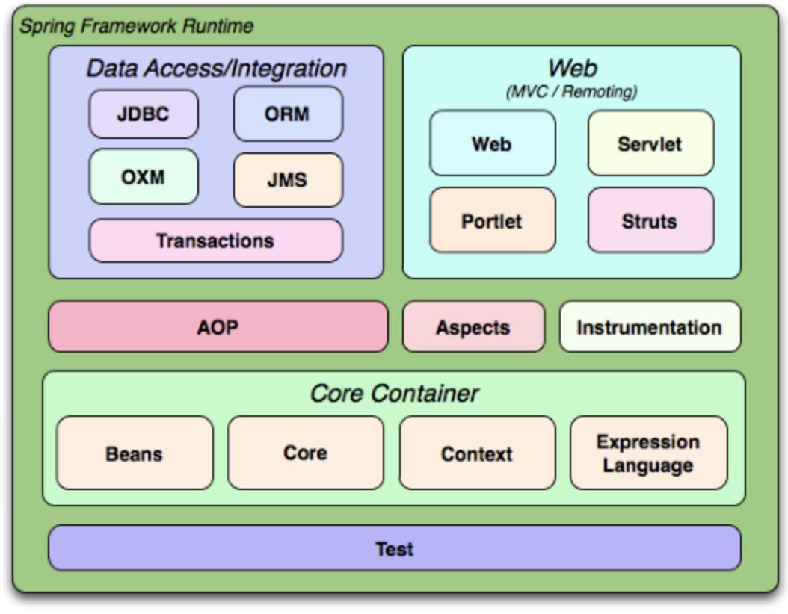
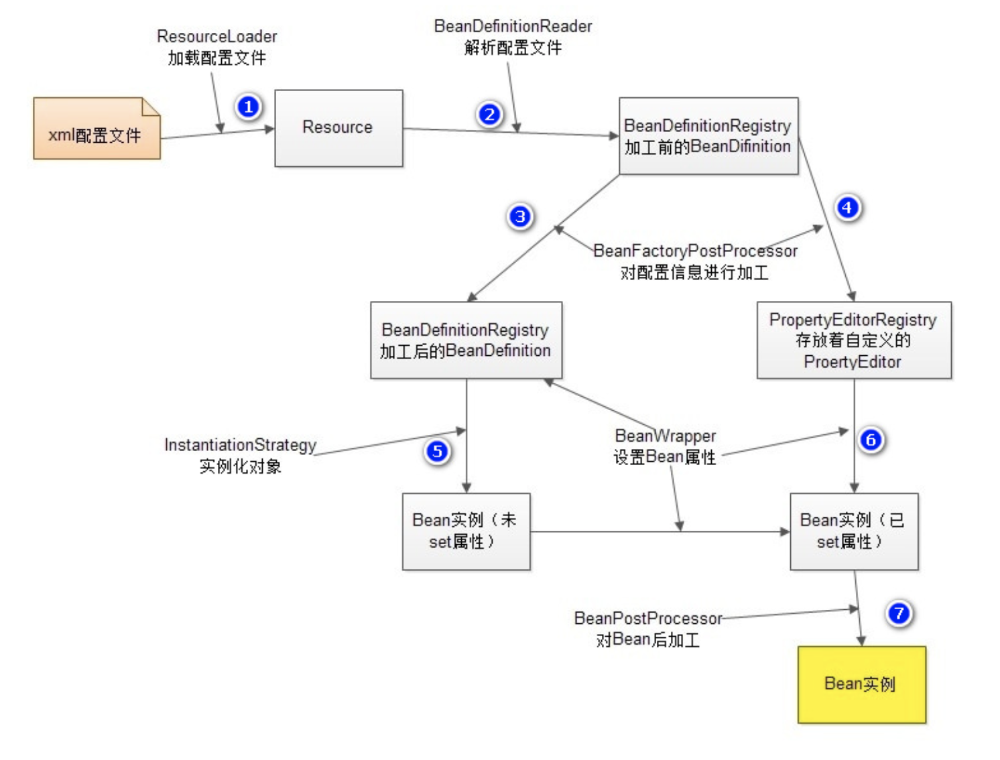

## 认识 Spring 框架

Spring 框架是 Java 应用最广的框架，它的**成功来源于理念，而不是技术本身**，它的理念包括 **IoC (Inversion of Control，控制反转)** 和 **AOP(Aspect Oriented Programming，面向切面编程)**。

[Spring框架的发展历史](https://mp.weixin.qq.com/s/wW6Xpq2X5OB0SWg5bU_tug)

### 什么是 Spring：

1. Spring 是一个**轻量级的 DI / IoC 和 AOP 容器的开源框架**，来源于 Rod Johnson 在其著作**《Expert one on one J2EE design and development》**中阐述的部分理念和原型衍生而来。
2. Spring 提倡以**“最少侵入”**的方式来管理应用中的代码，这意味着我们可以随时安装或者卸载 Spring

- **适用范围：任何 Java 应用**
- **Spring 的根本使命：简化 Java 开发**

> 尽管 J2EE 能够赶上 Spring 的步伐，**但 Spring 并没有停止前进，** Spring 继续在其他领域发展，而 J2EE 则刚刚开始涉及这些领域，或者还没有完全开始在这些领域的创新。**移动开发、社交 API 集成、NoSQL 数据库、云计算以及大数据**都是 Spring 正在涉足和创新的领域。Spring 的前景依然会很美好。

### Spring 中常用术语：

- **框架：**是能**完成一定功能**的**半成品**。
  框架能够帮助我们完成的是：**项目的整体框架、一些基础功能、规定了类和对象如何创建，如何协作等**，当我们开发一个项目时，框架帮助我们完成了一部分功能，我们自己再完成一部分，那这个项目就完成了。
- **非侵入式设计：**
  从框架的角度可以理解为：**无需继承框架提供的任何类**
  这样我们在更换框架时，之前写过的代码几乎可以继续使用。
- **轻量级和重量级：**
  轻量级是相对于重量级而言的，**轻量级一般就是非入侵性的、所依赖的东西非常少、资源占用非常少、部署简单等等**，其实就是**比较容易使用**，而**重量级正好相反**。
- **JavaBean：**
  即**符合 JavaBean 规范**的 Java 类
- **POJO：**即 **Plain Old Java Objects，简单老式 Java 对象**
  它可以包含业务逻辑或持久化逻辑，但**不担当任何特殊角色**且**不继承或不实现任何其它Java框架的类或接口。**

*注意：bean 的各种名称——虽然 Spring 用 bean 或者 JavaBean 来表示应用组件，但并不意味着 Spring 组件必须遵循 JavaBean 规范，一个 Spring 组件可以是任意形式的 POJO。*

- **容器：**
  在日常生活中容器就是一种盛放东西的器具，从程序设计角度看就是**装对象的的对象**，因为存在**放入、拿出等**操作，所以容器还要**管理对象的生命周期**。

### Spring 的优势

- **低侵入 / 低耦合** （降低组件之间的耦合度，实现软件各层之间的解耦）
- **声明式事务管理**（基于切面和惯例）
- **方便集成其他框架**（如MyBatis、Hibernate）
- **降低 Java 开发难度**
- Spring 框架中包括了 J2EE 三层的每一层的解决方案（一站式）

### Spring 能帮我们做什么

**①.Spring** 能帮我们根据配置文件**创建及组装对象之间的依赖关系**。
**②.Spring 面向切面编程**能帮助我们**无耦合的实现日志记录，性能统计，安全控制。**
**③.Spring** 能**非常简单的帮我们管理数据库事务**。
**④.Spring** 还**提供了与第三方数据访问框架（如Hibernate、JPA）无缝集成**，而且自己也提供了一套**JDBC访问模板**来方便数据库访问。
**⑤.Spring** 还提供与**第三方Web（如Struts1/2、JSF）框架无缝集成**，而且自己也提供了一套**Spring MVC**框架，来方便web层搭建。
**⑥.Spring** 能**方便的与Java EE（如Java Mail、任务调度）整合**，与**更多技术整合（比如缓存框架）**。

### Spring 的框架结构

- **Data Access/Integration层**包含有JDBC、ORM、OXM、JMS和Transaction模块。
- **Web层**包含了Web、Web-Servlet、WebSocket、Web-Porlet模块。
- **AOP模块**提供了一个符合AOP联盟标准的面向切面编程的实现。
- **Core Container(核心容器)：**包含有Beans、Core、Context和SpEL模块。
- **Test模块**支持使用JUnit和TestNG对Spring组件进行测试。

## Spring IoC

### IoC：Inverse of Control（控制反转）

- 读作**“反转控制”**，更好理解，不是什么技术，而是一种**设计思想**，就是**将原本在程序中手动创建对象的控制权，交由Spring框架来管理。**控制指的是:当前对象对内部成员的控制权。 反转指的是:这种控制权不由当前对象管理了，由其他(类,第三方容器)来管理。
- **正控：**若要使用某个对象，需要**自己去负责对象的创建**
- **反控：**若要使用某个对象，只需要**从 Spring 容器中获取需要使用的对象，不关心对象的创建过程**，也就是把**创建对象的控制权反转给了Spring框架**
- **好莱坞法则：**Don’t call me ,I’ll call you

## Spring AOP 简介

如果说 IoC 是 Spring 的核心，那么面向切面编程就是 Spring 最为重要的功能之一了，在数据库事务中切面编程被广泛使用。

###AOP 即 Aspect Oriented Program 面向切面编程

首先，在面向切面编程的思想里面，把功能分为核心业务功能，和周边功能。

- **所谓的核心业务**，比如登陆，增加数据，删除数据都叫核心业务
- **所谓的周边功能**，比如性能统计，日志，事务管理等等

周边功能在 Spring 的面向切面编程AOP思想里，即被定义为切面

**在面向切面编程AOP的思想里面，核心业务功能和切面功能分别独立进行开发，然后把切面功能和核心业务功能 "编织" 在一起，这就叫AOP**

### AOP 的目的

AOP能够将那些与业务无关，**却为业务模块所共同调用的逻辑或责任（例如事务处理、日志管理、权限控制等）封装起来**，便于**减少系统的重复代码**，**降低模块间的耦合度**，并**有利于未来的可拓展性和可维护性**。

### AOP 当中的概念：

- 切入点（Pointcut）
  在哪些类，哪些方法上切入（**where**）
- 通知（Advice）
  在方法执行的什么实际（**when:**方法前/方法后/方法前后）做什么（**what:**增强的功能）
- 切面（Aspect）
  切面 = 切入点 + 通知，通俗点就是：**在什么时机，什么地方，做什么增强！**
- 织入（Weaving）
  把切面加入到对象，并创建出代理对象的过程。（由 Spring 来完成）

