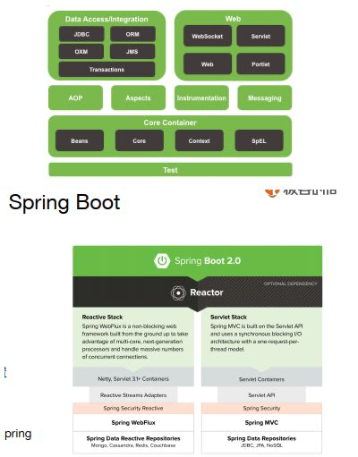

# 玩转Spring全家桶

## 1. 发展历程

Spring的核心。




## 2. JDBC

### 2.1 单数据源

 

```java
// 引入jdbc
<dependency>
  <groupId>org.springframework.boot</groupId>
  <artifactId>spring-boot-starter-jdbc</artifactId>
  </dependency>
// 嵌入式数据库
  <dependency>
  <groupId>com.h2database</groupId>
  <artifactId>h2</artifactId>
  <scope>runtime</scope>
  </dependency>
// 连接mysql
  <dependency>
  <groupId>mysql</groupId> 
  <artifactId>mysql-connector-java</artifactId> 
  <version>5.1.21</version>
  </dependency>

management.endpoints.web.exposure.include=*
spring.output.ansi.enabled=ALWAYS

spring.datasource.url=jdbc:h2:mem:testdb
spring.datasource.username=sa
spring.datasource.password=
spring.datasource.hikari.maximumPoolSize=5
spring.datasource.hikari.minimumIdle=5
spring.datasource.hikari.idleTimeout=600000
spring.datasource.hikari.connectionTimeout=30000
spring.datasource.hikari.maxLifetime=1800000
// 连接JNDI数据源,应用部署于应用服务器上的时候想让数据源由应用服务器管理
spring.datasource.jndi-name=java:jboss/datasources/customers
  
  
// 引⼊入对应数据库驱动——H2,引⼊入 JDBC 依赖——spring-boot-starter-jdbc
// 获取 DataSource Bean，打印信息
@SpringBootApplication
@Slf4j
public class DataSourceDemoApplication implements CommandLineRunner {
	@Autowired
	private DataSource dataSource;

	@Autowired
	private JdbcTemplate jdbcTemplate;

	public static void main(String[] args) {
		SpringApplication.run(DataSourceDemoApplication.class, args);
	}

	@Override
	public void run(String... args) throws Exception {
		showConnection();
		showData();
	}

	private void showConnection() throws SQLException {
		log.info(dataSource.toString());
		Connection conn = dataSource.getConnection();
		log.info(conn.toString());
		conn.close();
	}

	private void showData() {
		jdbcTemplate.queryForList("SELECT * FROM FOO")
				.forEach(row -> log.info(row.toString()));
	}
}

DataSourceDemoApplication: HikariDataSource (HikariPool-1)
2020-10-15 23:49:36.137  INFO 24432 --- [           main] g.s.d.d.DataSourceDemoApplication        : HikariProxyConnection@2120344156 wrapping conn0: url=jdbc:h2:mem:testdb user=SA
2020-10-15 23:49:36.149  INFO 24432 --- [           main] g.s.d.d.DataSourceDemoApplication        : {ID=1, BAR=aaa}
2020-10-15 23:49:36.149  INFO 24432 --- [           main] g.s.d.d.DataSourceDemoApplication        : {ID=2, BAR=bbb}
```

下面是不使用SpringBoot的情况，直接配置所需要的bean。

```java
package geektime.spring.data.datasourcedemo;

@Configuration
@EnableTransactionManagement
public class DataSourceDemo {
    @Autowired
    private DataSource dataSource;

    public static void main(String[] args) throws SQLException {
        ApplicationContext applicationContext =
                new ClassPathXmlApplicationContext("applicationContext*.xml");
        showBeans(applicationContext);
        dataSourceDemo(applicationContext);
    }

    @Bean(destroyMethod = "close")
    public DataSource dataSource() throws Exception {
        Properties properties = new Properties();
        properties.setProperty("driverClassName", "org.h2.Driver");
        properties.setProperty("url", "jdbc:h2:mem:testdb");
        properties.setProperty("username", "sa");
        return BasicDataSourceFactory.createDataSource(properties);
    }

    @Bean
    public PlatformTransactionManager transactionManager() throws Exception {
        return new DataSourceTransactionManager(dataSource());
    }

    private static void showBeans(ApplicationContext applicationContext) {
        System.out.println(Arrays.toString(applicationContext.getBeanDefinitionNames()));
    }

    private static void dataSourceDemo(ApplicationContext applicationContext) throws SQLException {
        DataSourceDemo demo = applicationContext.getBean("dataSourceDemo", DataSourceDemo.class);
        demo.showDataSource();
    }

    public void showDataSource() throws SQLException {
        System.out.println(dataSource.toString());
        Connection conn = dataSource.getConnection();
        System.out.println(conn.toString());
        conn.close();
    }
}
```

### 2.2 多数据源

```java
management.endpoints.web.exposure.include=*
spring.output.ansi.enabled=ALWAYS

foo.datasource.url=jdbc:h2:mem:foo
foo.datasource.username=sa
foo.datasource.password=

bar.datasource.url=jdbc:h2:mem:bar
bar.datasource.username=sa
bar.datasource.password=
// 排除Spring Boot的⾃自动配置
@SpringBootApplication(exclude = { DataSourceAutoConfiguration.class,
        DataSourceTransactionManagerAutoConfiguration.class,
        JdbcTemplateAutoConfiguration.class})
@Slf4j
public class MultiDataSourceDemoApplication {

    public static void main(String[] args) {
        SpringApplication.run(MultiDataSourceDemoApplication.class, args);
    }

    @Bean
    @ConfigurationProperties("foo.datasource")
    public DataSourceProperties fooDataSourceProperties() {
        return new DataSourceProperties();
    }

    @Bean
    public DataSource fooDataSource() {
        DataSourceProperties dataSourceProperties = fooDataSourceProperties();
        log.info("foo datasource: {}", dataSourceProperties.getUrl());
        return dataSourceProperties.initializeDataSourceBuilder().build();
    }

    @Bean
    @Resource
    public PlatformTransactionManager fooTxManager(DataSource fooDataSource) {
        return new DataSourceTransactionManager(fooDataSource);
    }

    @Bean
    @ConfigurationProperties("bar.datasource")
    public DataSourceProperties barDataSourceProperties() {
        return new DataSourceProperties();
    }

    @Bean
    public DataSource barDataSource() {
        DataSourceProperties dataSourceProperties = barDataSourceProperties();
        log.info("bar datasource: {}", dataSourceProperties.getUrl());
        return dataSourceProperties.initializeDataSourceBuilder().build();
    }

    @Bean
    @Resource
    public PlatformTransactionManager barTxManager(DataSource barDataSource) {
        return new DataSourceTransactionManager(barDataSource);
    }
}

2020-10-16 00:19:09.076  INFO 25341 --- [           main] g.s.d.m.MultiDataSourceDemoApplication   : foo datasource: jdbc:h2:mem:foo
2020-10-16 00:19:09.096  INFO 25341 --- [           main] g.s.d.m.MultiDataSourceDemoApplication   : bar datasource: jdbc:h2:mem:bar
2020
```

### 2.3 连接池

Spring Boot 2.x默认使用HikariCP，1.x默认使⽤用 Tomcat 连接池，需要移除 tomcat-jdbc 依赖。

HikariCP：

```java
// 常⽤用 HikariCP 配置参数
spring.datasource.hikari.maximumPoolSize=10 
spring.datasource.hikari.minimumIdle=10 
spring.datasource.hikari.idleTimeout=600000 
spring.datasource.hikari.connectionTimeout=30000
spring.datasource.hikari.maxLifetime=1800000
```

Druid:

```java
<dependency>
<groupId>org.springframework.boot</groupId>
<artifactId>spring-boot-starter-jdbc</artifactId>
<exclusions>
<exclusion>
<artifactId>HikariCP</artifactId>
<groupId>com.zaxxer</groupId>
</exclusion>
</exclusions>
</dependency>
<dependency>
<groupId>com.alibaba</groupId>
<artifactId>druid-spring-boot-starter</artifactId>
<version>1.1.10</version>
</dependency>

// 配置数据源
spring.output.ansi.enabled=ALWAYS

spring.datasource.url=jdbc:h2:mem:foo
spring.datasource.username=sa
spring.datasource.password=n/z7PyA5cvcXvs8px8FVmBVpaRyNsvJb3X7YfS38DJrIg25EbZaZGvH4aHcnc97Om0islpCAPc3MqsGvsrxVJw==

spring.datasource.druid.initial-size=5
spring.datasource.druid.max-active=5
spring.datasource.druid.min-idle=5
spring.datasource.druid.filters=conn,config,stat,slf4j

spring.datasource.druid.connection-properties=config.decrypt=true;config.decrypt.key=${public-key}
spring.datasource.druid.filter.config.enabled=true

spring.datasource.druid.test-on-borrow=true
spring.datasource.druid.test-on-return=true
spring.datasource.druid.test-while-idle=true

public-key=MFwwDQYJKoZIhvcNAQEBBQADSwAwSAJBALS8ng1XvgHrdOgm4pxrnUdt3sXtu/E8My9KzX8sXlz+mXRZQCop7NVQLne25pXHtZoDYuMh3bzoGj6v5HvvAQ8CAwEAAQ==
```

### 2.4 Spring  JDBC

- core，JdbcTemplate 等相关核⼼心接⼝口和类 
- datasource，数据源相关的辅助类 
- object，将基本的 JDBC 操作封装成对象
- support，错误码等其他辅助⼯工具

jdbc常用操作：

query，queryForObject，queryForList，update，execute

```java
@Slf4j
@Repository
public class FooDao {
    @Autowired
    private JdbcTemplate jdbcTemplate;
    @Autowired
    private SimpleJdbcInsert simpleJdbcInsert;

    public void insertData() {
        Arrays.asList("b", "c").forEach(bar -> {
            jdbcTemplate.update("INSERT INTO FOO (BAR) VALUES (?)", bar);
        });

        HashMap<String, String> row = new HashMap<>();
        row.put("BAR", "d");
        Number id = simpleJdbcInsert.executeAndReturnKey(row);
        log.info("ID of d: {}", id.longValue());
    }

    public void listData() {
        log.info("Count: {}",
                jdbcTemplate.queryForObject("SELECT COUNT(*) FROM FOO", Long.class));

        List<String> list = jdbcTemplate.queryForList("SELECT BAR FROM FOO", String.class);
        list.forEach(s -> log.info("Bar: {}", s));

        List<Foo> fooList = jdbcTemplate.query("SELECT * FROM FOO", new RowMapper<Foo>() {
            @Override
            public Foo mapRow(ResultSet rs, int rowNum) throws SQLException {
                return Foo.builder()
                        .id(rs.getLong(1))
                        .bar(rs.getString(2))
                        .build();
            }
        });
        fooList.forEach(f -> log.info("Foo: {}", f));
    }
}
// 批量处理
@Repository
public class BatchFooDao {
    @Autowired
    private JdbcTemplate jdbcTemplate;
    @Autowired
    private NamedParameterJdbcTemplate namedParameterJdbcTemplate;

    public void batchInsert() {
        jdbcTemplate.batchUpdate("INSERT INTO FOO (BAR) VALUES (?)",
                new BatchPreparedStatementSetter() {
                    @Override
                    public void setValues(PreparedStatement ps, int i) throws SQLException {
                        ps.setString(1, "b-" + i);
                    }

                    @Override
                    public int getBatchSize() {
                        return 2;
                    }
                });

        List<Foo> list = new ArrayList<>();
        list.add(Foo.builder().id(100L).bar("b-100").build());
        list.add(Foo.builder().id(101L).bar("b-101").build());
        namedParameterJdbcTemplate
                .batchUpdate("INSERT INTO FOO (ID, BAR) VALUES (:id, :bar)",
                        SqlParameterSourceUtils.createBatch(list));
    }
}
```

### 2.5 事务

事务传播特性：


事务隔离特性：


编程式事务：

```java
@SpringBootApplication
@Slf4j
public class ProgrammaticTransactionDemoApplication implements CommandLineRunner {
	@Autowired
	private TransactionTemplate transactionTemplate;
	@Autowired
	private JdbcTemplate jdbcTemplate;

	public static void main(String[] args) {
		SpringApplication.run(ProgrammaticTransactionDemoApplication.class, args);
	}

	@Override
	public void run(String... args) throws Exception {
		log.info("COUNT BEFORE TRANSACTION: {}", getCount());
		transactionTemplate.execute(new TransactionCallbackWithoutResult() {
			@Override
			protected void doInTransactionWithoutResult(TransactionStatus transactionStatus) {
				jdbcTemplate.execute("INSERT INTO FOO (ID, BAR) VALUES (1, 'aaa')");
				log.info("COUNT IN TRANSACTION: {}", getCount());
				transactionStatus.setRollbackOnly();
			}
		});
		log.info("COUNT AFTER TRANSACTION: {}", getCount());
	}

	private long getCount() {
		return (long) jdbcTemplate.queryForList("SELECT COUNT(*) AS CNT FROM FOO")
				.get(0).get("CNT");
	}
}
```

声明式事务：


```java
@Component
public class FooServiceImpl implements FooService {
    @Autowired
    private JdbcTemplate jdbcTemplate;

    @Override
    @Transactional
    public void insertRecord() {
        jdbcTemplate.execute("INSERT INTO FOO (BAR) VALUES ('AAA')");
    }

    @Override
    @Transactional(rollbackFor = RollbackException.class)
    public void insertThenRollback() throws RollbackException {
        jdbcTemplate.execute("INSERT INTO FOO (BAR) VALUES ('BBB')");
        throw new RollbackException();
    }

    @Override
    public void invokeInsertThenRollback() throws RollbackException {
        insertThenRollback();
    }
}
```

### 2.6 jdbc的异常

**Spring** 会将数据操作的异常转换为 **DataAccessException**。

```xml
// 定制错误码解析逻辑
<beans>

    <bean id="H2" class="org.springframework.jdbc.support.SQLErrorCodes">
        <property name="badSqlGrammarCodes">
            <value>42000,42001,42101,42102,42111,42112,42121,42122,42132</value>
        </property>
        <property name="duplicateKeyCodes">
            <value>23001,23505</value>
        </property>
        <property name="dataIntegrityViolationCodes">
            <value>22001,22003,22012,22018,22025,23000,23002,23003,23502,23503,23506,23507,23513</value>
        </property>
        <property name="dataAccessResourceFailureCodes">
            <value>90046,90100,90117,90121,90126</value>
        </property>
        <property name="cannotAcquireLockCodes">
            <value>50200</value>
        </property>
        <property name="customTranslations">
            <bean class="org.springframework.jdbc.support.CustomSQLErrorCodesTranslation">
                <property name="errorCodes" value="23001,23505" />
                <property name="exceptionClass"
                          value="geektime.spring.data.errorcodedemo.CustomDuplicatedKeyException" />
            </bean>
        </property>
    </bean>

</beans>
```

### 2.7 答疑

[常见maven插件](https://www.cnblogs.com/april-chen/p/10414857.html)

Java常见注解

Java Config 相关注解
• @Configuration
• @ImportResource
• @ComponentScan
• @Bean
• @ConfigurationProperties  

定义相关注解
• @Component / @Repository / @Service
• @Controller / @RestController
• @RequestMapping
注⼊入相关注解
• @Autowired / @Qualifier / @Resource
• @Value  

## 3. ORM


Hibernate：⼀一款开源的对象关系映射(Object / Relational Mapping)框架；

JPA（Java Persistence API） 为对象关系映射提供了一种基于 POJO 的持久化模型。

常用JPA注解：

- 实体
  - @Entity、 @MappedSuperclass
  - @Table(name)
- 主键
  -  @Id
  -  @GeneratedValue(strategy, generator)
  -  @SequenceGenerator(name, sequenceName)  

- 映射
  -  @Column(name, nullable, length, insertable, updatable)
  -  @JoinTable(name)、 @JoinColumn(name)
- 关系
  - @OneToOne、 @OneToMany、 @ManyToOne、 @ManyToMany
  - @OrderBy  

### 3.1 咖啡馆实战项目


```java
// 实体
@Entity
@Table(name = "T_MENU")
@Builder
@Data
@NoArgsConstructor
@AllArgsConstructor
public class Coffee implements Serializable {
    @Id
    @GeneratedValue
    private Long id;
    private String name;
    @Column
    @Type(type = "org.jadira.usertype.moneyandcurrency.joda.PersistentMoneyAmount",
            parameters = {@org.hibernate.annotations.Parameter(name = "currencyCode", value = "CNY")})
    private Money price;
    @Column(updatable = false)
    @CreationTimestamp
    private Date createTime;
    @UpdateTimestamp
    private Date updateTime;
}
@Entity
@Table(name = "T_ORDER")
@Data
@NoArgsConstructor
@AllArgsConstructor
@Builder
public class CoffeeOrder implements Serializable {
    @Id
    @GeneratedValue
    private Long id;
    private String customer;
    @ManyToMany
    @JoinTable(name = "T_ORDER_COFFEE")
    private List<Coffee> items;
    @Column(nullable = false)
    private Integer state;
    @Column(updatable = false)
    @CreationTimestamp
    private Date createTime;
    @UpdateTimestamp
    private Date updateTime;
}
public interface CoffeeOrderRepository extends CrudRepository<CoffeeOrder, Long> {
}
public interface CoffeeRepository extends CrudRepository<Coffee, Long> {
}
```

```java
spring.jpa.hibernate.ddl-auto=create-drop
spring.jpa.properties.hibernate.show_sql=true
spring.jpa.properties.hibernate.format_sql=true

@SpringBootApplication
@EnableJpaRepositories
@Slf4j
public class JpaDemoApplication implements ApplicationRunner {
	@Autowired
	private CoffeeRepository coffeeRepository;
	@Autowired
	private CoffeeOrderRepository orderRepository;

	public static void main(String[] args) {
		SpringApplication.run(JpaDemoApplication.class, args);
	}

	@Override
	public void run(ApplicationArguments args) throws Exception {
		initOrders();
	}

	private void initOrders() {
		Coffee espresso = Coffee.builder().name("espresso")
				.price(Money.of(CurrencyUnit.of("CNY"), 20.0))
				.build();
		coffeeRepository.save(espresso);
		log.info("Coffee: {}", espresso);

		Coffee latte = Coffee.builder().name("latte")
				.price(Money.of(CurrencyUnit.of("CNY"), 30.0))
				.build();
		coffeeRepository.save(latte);
		log.info("Coffee: {}", latte);

		CoffeeOrder order = CoffeeOrder.builder()
				.customer("Li Lei")
				.items(Collections.singletonList(espresso))
				.state(0)
				.build();
		orderRepository.save(order);
		log.info("Order: {}", order);

		order = CoffeeOrder.builder()
				.customer("Li Lei")
				.items(Arrays.asList(espresso, latte))
				.state(0)
				.build();
		orderRepository.save(order);
		log.info("Order: {}", order);
	}
}
```


- Hibernate:一款开源的对象关系映射（Object / Relational Mapping）框架。
- Mybatis & MyBatis Generator

# Spring MVC

- DispatcherServlet
  - Controller
    - @RestController
  - xxxResolver
    - ViewResolver
    - HandlerExceptionResolver
    - MultipartResolver
  - HandlerMapping
    - @RequestMapping
      - @GetMapping / @PostMapping
      - @PutMapping / @DeleteMapping
    - @RequestBody / @ResponseBody / @ResponseStatus

**关于上下⽂文常⽤用的接⼝**

- BeanFactory
  - DefaultListableBeanFactory
-  ApplicationContext
  - ClassPathXmlApplicationContext 
  - FileSystemXmlApplicationContext
  -  AnnotationConfigApplicationContext
- WebApplicationContext


一个请求的⼤大致处理理流程：

- 绑定⼀一些 **Attribute**

WebApplicationContext / LocaleResolver / ThemeResolver

- 处理理 **Multipart**

如果是，则将请求转为 MultipartHttpServletRequest 

- **Handler** 处理

如果找到对应 Handler，执⾏行行 Controller 及前后置处理理器器逻辑 

- 处理理返回的**Model** ，呈现视图


1. 定义映射关系

**@Controller**

**@RequestMapping**

- path / method 指定映射路路径与⽅方法
- params / headers 限定映射范围
- consumes / produces 限定请求与响应格式

⼀一些快捷⽅方式：

@RestController

@GetMapping / @PostMapping / @PutMapping / @DeleteMapping / @PatchMapping


2. 定义处理理⽅方法

- @RequestBody / @ResponseBody / @ResponseStatus
- @PathVariable / @RequestParam / @RequestHeader
- HttpEntity / ResponseEntity

3. 定义类型转换

⾃己实现 WebMvcConfigurer

- Spring Boot 在 WebMvcAutoConfiguration 中实现了了⼀个

- 添加⾃自定义的 Converter
-  添加⾃自定义的 Formatter

4. 定义校验

- 通过 Validator 对绑定结果进⾏行行校验
  - Hibernate Validator
- @Valid 注解
- BindingResult

5. 视图解析的实现基础

**ViewResolver** 与 **View** 接口

- AbstractCachingViewResolver
- UrlBasedViewResolver
- FreeMarkerViewResolver
- ContentNegotiatingViewResolver
- InternalResourceViewResolver

6. DispatcherServlet 中的视图解析逻辑

- initStrategies()，initViewResolvers() 初始化了了对应 ViewResolver 
- doDispatch()
  - processDispatchResult()
    - 没有返回视图的话，尝试 RequestToViewNameTranslator
    - resolveViewName() 解析 View 对象

使⽤用 **@**ResponseBody 的情况

在 HandlerAdapter.handle() 的中完成了了 Response 输出

- RequestMappingHandlerAdapter.invokeHandlerMethod()
  - HandlerMethodReturnValueHandlerComposite.handleReturnValue()
    - RequestResponseBodyMethodProcessor.handleReturnValue()


# 9. Spring Boot

Spring boot的特性：

- ⽅方便便地创建可独⽴立运⾏行行的 Spring 应⽤用程序
- 直接内嵌 Tomcat、Jetty 或 Undertow 
- 简化了了项⽬目的构建配置
- 为 Spring 及第三⽅方库提供⾃自动配置 
- 提供⽣生产级特性
- ⽆无需⽣生成代码或进⾏行行 XML 配置

Spring Boot 的四⼤大核⼼：

- ⾃自动配置 - Auto Configuration 
- 起步依赖 - Starter Dependency
- 命令⾏行行界⾯面 - Spring Boot CLI 
- Actuator

起步依赖 - Starter Dependency


# Spring Boot--程序员DD

## 数据访问

### JdbcTemplate访问MySQL数据库

1. 配置数据源

```java
<dependency>
  <groupId>org.springframework.boot</groupId>
  <artifactId>spring-boot-starter-jdbc</artifactId>
  </dependency>
  // 嵌入式数据库
  <dependency>
  <groupId>org.hsqldb</groupId>
  <artifactId>hsqldb</artifactId>
  <scope>runtime</scope>
  </dependency>
  // mysql
  <dependency>
  <groupId>mysql</groupId>
  <artifactId>mysql-connector-java</artifactId>
  </dependency>
  // application.properties中配置数据源信息
  spring.datasource.url=jdbc:mysql://localhost:3306/test
spring.datasource.username=dbuser
  spring.datasource.password=dbpass
  spring.datasource.driver-class-name=com.mysql.cj.jdbc.Driver
    // 连接JNDI数据源,将应用部署于应用服务器上的时候想让数据源由应用服务器管理，那么可以使用如下配置方式引入JNDI数据源
    spring.datasource.jndi-name=java:jboss/datasources/customers
```

2. 使用JdbcTemplate操作数据库

Spring的JdbcTemplate是自动配置的，可以直接使用`@Autowired`或构造函数（推荐）来注入到bean中来使用。

```java
// 创建数据表
CREATE TABLE `User` (
  `name` varchar(100) COLLATE utf8mb4_general_ci NOT NULL,
  `age` int NOT NULL
) ENGINE=InnoDB DEFAULT CHARSET=utf8mb4 COLLATE=utf8mb4_general_ci
// 领域对象
@Data
@NoArgsConstructor
public class User {
    private String name;
    private Integer age;
}
// 定义包含有插入、删除、查询的抽象接口UserService
public interface UserService {
    /**
     * 新增一个用户
     *
     * @param name
     * @param age
     */
    int create(String name, Integer age);

    /**
     * 根据name查询用户
     *
     * @param name
     * @return
     */
    List<User> getByName(String name);

    /**
     * 根据name删除用户
     *
     * @param name
     */
    int deleteByName(String name);

    /**
     * 获取用户总量
     */
    int getAllUsers();

    /**
     * 删除所有用户
     */
    int deleteAllUsers();
}
// 通过JdbcTemplate实现UserService中定义的数据访问操作
@Service
public class UserServiceImpl implements UserService {

    private JdbcTemplate jdbcTemplate;

    UserServiceImpl(JdbcTemplate jdbcTemplate) {
        this.jdbcTemplate = jdbcTemplate;
    }

    @Override
    public int create(String name, Integer age) {
        return jdbcTemplate.update("insert into USER(NAME, AGE) values(?, ?)", name, age);
    }

    @Override
    public List<User> getByName(String name) {
        List<User> users = jdbcTemplate.query("select NAME, AGE from USER where NAME = ?", (resultSet, i) -> {
            User user = new User();
            user.setName(resultSet.getString("NAME"));
            user.setAge(resultSet.getInt("AGE"));
            return user;
        }, name);
        return users;
    }

    @Override
    public int deleteByName(String name) {
        return jdbcTemplate.update("delete from USER where NAME = ?", name);
    }

    @Override
    public int getAllUsers() {
        return jdbcTemplate.queryForObject("select count(1) from USER", Integer.class);
    }

    @Override
    public int deleteAllUsers() {
        return jdbcTemplate.update("delete from USER");
    }
}
// 单元测试
@RunWith(SpringRunner.class)
@SpringBootTest
public class Chapter31ApplicationTests {

    @Autowired
    private UserService userSerivce;

    @Before
    public void setUp() {
        // 准备，清空user表
        userSerivce.deleteAllUsers();
    }

    @Test
    public void test() throws Exception {
        // 插入5个用户
        userSerivce.create("Tom", 10);
        userSerivce.create("Mike", 11);
        userSerivce.create("Didispace", 30);
        userSerivce.create("Oscar", 21);
        userSerivce.create("Linda", 17);

        // 查询名为Oscar的用户，判断年龄是否匹配
        List<User> userList = userSerivce.getByName("Oscar");
        Assert.assertEquals(21, userList.get(0).getAge().intValue());

        // 查数据库，应该有5个用户
        Assert.assertEquals(5, userSerivce.getAllUsers());

        // 删除两个用户
        userSerivce.deleteByName("Tom");
        userSerivce.deleteByName("Mike");

        // 查数据库，应该有5个用户
        Assert.assertEquals(3, userSerivce.getAllUsers());
    }
}
```

### 默认数据源Hikari的配置详解

Java数据库连接（Java Database Connectivity，简称JDBC）是Java语言中用来规范客户端程序如何来访问数据库的应用程序接口，提供了诸如查询和更新数据库中数据的方法。JDBC也是Sun Microsystems的商标。我们通常说的JDBC是面向关系型数据库的。

JDBC API主要位于JDK中的`java.sql`包中（之后扩展的内容位于`javax.sql`包中），主要包括（斜体代表接口，需驱动程序提供者来具体实现）：

- DriverManager：负责加载各种不同驱动程序（Driver），并根据不同的请求，向调用者返回相应的数据库连接（Connection）。
- Driver：驱动程序，会将自身加载到DriverManager中去，并处理相应的请求并返回相应的数据库连接（Connection）。
- Connection：数据库连接，负责与进行数据库间通讯，SQL执行以及事务处理都是在某个特定Connection环境中进行的。可以产生用以执行SQL的Statement。
- Statement：用以执行SQL查询和更新（针对静态SQL语句和单次执行）。PreparedStatement：用以执行包含动态参数的SQL查询和更新（在服务器端编译，允许重复执行以提高效率）。
- CallableStatement：用以调用数据库中的存储过程。
- SQLException：代表在数据库连接的建立和关闭和SQL语句的执行过程中发生了例外情况（即错误）。

什么是数据源？

可以看到，在`java.sql`中并没有数据源（Data Source）的概念。这是由于在`java.sql`中包含的是JDBC内核API，另外还有个`javax.sql`包，其中包含了JDBC标准的扩展API。而关于数据源（Data Source）的定义，就在`javax.sql`这个扩展包中。

实际上，在JDBC内核API的实现下，就已经可以实现对数据库的访问了，那么我们为什么还需要数据源呢？主要出于以下几个目的：

1. 封装关于数据库访问的各种参数，实现统一管理
2. 通过对数据库的连接池管理，节省开销并提高效率

在Java这个自由开放的生态中，已经有非常多优秀的开源数据源可以供大家选择，比如：DBCP、C3P0、Druid、HikariCP等。

```
# 最小空闲连接，默认值10，小于0或大于maximum-pool-size，都会重置为maximum-pool-size
spring.datasource.hikari.minimum-idle=10
# 最大连接数，小于等于0会被重置为默认值10；大于零小于1会被重置为minimum-idle的值
spring.datasource.hikari.maximum-pool-size=20
# 空闲连接超时时间，默认值600000（10分钟），大于等于max-lifetime且max-lifetime>0，会被重置为0；不等于0且小于10秒，会被重置为10秒。
spring.datasource.hikari.idle-timeout=500000
# 连接最大存活时间.不等于0且小于30秒，会被重置为默认值30分钟.设置应该比mysql设置的超时时间短
spring.datasource.hikari.max-lifetime=540000
# 连接超时时间：毫秒，小于250毫秒，否则被重置为默认值30秒
spring.datasource.hikari.connection-timeout=60000
# 用于测试连接是否可用的查询语句
spring.datasource.hikari.connection-test-query=SELECT 1
```

### 数据库连接池Druid

1. 配置数据源

```
<dependency>
    <groupId>com.alibaba</groupId>
    <artifactId>druid-spring-boot-starter</artifactId>
    <version>1.1.21</version>
</dependency>
spring.datasource.druid.url=jdbc:mysql://localhost:3306/test
spring.datasource.druid.username=root
spring.datasource.druid.password=
spring.datasource.druid.driver-class-name=com.mysql.cj.jdbc.Driver
spring.datasource.druid.initialSize=10
spring.datasource.druid.maxActive=20
spring.datasource.druid.maxWait=60000
spring.datasource.druid.minIdle=1
spring.datasource.druid.timeBetweenEvictionRunsMillis=60000
spring.datasource.druid.minEvictableIdleTimeMillis=300000
spring.datasource.druid.testWhileIdle=true
spring.datasource.druid.testOnBorrow=true
spring.datasource.druid.testOnReturn=false
spring.datasource.druid.poolPreparedStatements=true
spring.datasource.druid.maxOpenPreparedStatements=20
spring.datasource.druid.validationQuery=SELECT 1
spring.datasource.druid.validation-query-timeout=500
spring.datasource.druid.filters=stat
```

2. 配置监控

   ```
   <dependency>
       <groupId>org.springframework.boot</groupId>
       <artifactId>spring-boot-starter-actuator</artifactId>
   </dependency>
   
   spring.datasource.druid.stat-view-servlet.enabled=true
   spring.datasource.druid.stat-view-servlet.url-pattern=/druid/*
   spring.datasource.druid.stat-view-servlet.reset-enable=true
   spring.datasource.druid.stat-view-servlet.login-username=admin
   spring.datasource.druid.stat-view-servlet.login-password=admin
   ```

   3. 创建一个Controller来通过接口去调用数据访问操作

   ```java
   @Data
   @AllArgsConstructor
   @RestController
   public class UserController {
   
       private UserService userService;
   
       @PostMapping("/user")
       public int create(@RequestBody User user) {
           return userService.create(user.getName(), user.getAge());
       }
   
       @GetMapping("/user/{name}")
       public List<User> getByName(@PathVariable String name) {
           return userService.getByName(name);
       }
   
       @DeleteMapping("/user/{name}")
       public int deleteByName(@PathVariable String name) {
           return userService.deleteByName(name);
       }
   
       @GetMapping("/user/count")
       public int getAllUsers() {
           return userService.getAllUsers();
       }
   
       @DeleteMapping("/user/all")
       public int deleteAllUsers() {
           return userService.deleteAllUsers();
       }
   }
   ```

运行后可以在访问http://localhost:8080/druid/即可。

###  Spring DATA JPA

为了解决这些大量枯燥的数据操作语句，诞生了非常多的优秀框架，比如：Hibernate。通过整合Hibernate，我们能够以操作Java实体的方式来完成对数据的操作，通过框架的帮助，对Java实体的变更最终将自动地映射到数据库表中。

在Hibernate的帮助下，Java实体映射到数据库表数据完成之后，再进一步解决抽象各个Java实体基本的“增删改查”操作，我们通常会以泛型的方式封装一个模板Dao来进行抽象简化，但是这样依然不是很方便，我们需要针对每个实体编写一个继承自泛型模板Dao的接口，再编写该接口的实现。虽然一些基础的数据访问已经可以得到很好的复用，但是在代码结构上针对每个实体都会有一堆Dao的接口和实现。

由于模板Dao的实现，使得这些具体实体的Dao层已经变的非常“薄”，有一些具体实体的Dao实现可能完全就是对模板Dao的简单代理，并且往往这样的实现类可能会出现在很多实体上。Spring Data JPA的出现正可以让这样一个已经很“薄”的数据访问层变成只是一层接口的编写方式。

1. 配置

   ```
   <dependency>
       <groupId>org.springframework.boot</groupId>
       <artifactId>spring-boot-starter-data-jpa</artifactId>
   </dependency>
   spring.datasource.url=jdbc:mysql://localhost:3306/test
   spring.datasource.username=root
   spring.datasource.password=
   spring.datasource.driver-class-name=com.mysql.cj.jdbc.Driver
   spring.jpa.properties.hibernate.hbm2ddl.auto=create-drop
   ```

2. 代码编写

```java
// @Entity注解标识了User类是一个持久化的实体
// @Data和@NoArgsConstructor是Lombok中的注解。
// @Id和@GeneratedValue用来标识User对应对应数据库表中的主键
@Entity
@Data
@NoArgsConstructor
public class User {

    @Id
    @GeneratedValue
    private Long id;

    private String name;
    private Integer age;

    public User(String name, Integer age) {
        this.name = name;
        this.age = age;
    }
}
// 创建数据访问接口
public interface UserRepository extends JpaRepository<User, Long> {
// 通过解析方法名创建查询
    User findByName(String name);

    User findByNameAndAge(String name, Integer age);
// 通过使用@Query 注解来创建查询，只需要编写JPQL语句，并通过类似“:name”来映射@Param指定的参数
    @Query("from User u where u.name=:name")
    User findUser(@Param("name") String name);
}
// 单元测试
@Slf4j
@RunWith(SpringRunner.class)
@SpringBootTest
public class Chapter34ApplicationTests {

    @Autowired
    private UserRepository userRepository;

    @Test
    public void test() throws Exception {
        // 创建10条记录
        userRepository.save(new User("AAA", 10));
        userRepository.save(new User("BBB", 20));
        userRepository.save(new User("CCC", 30));
        userRepository.save(new User("DDD", 40));
        userRepository.save(new User("EEE", 50));
        userRepository.save(new User("FFF", 60));
        userRepository.save(new User("GGG", 70));
        userRepository.save(new User("HHH", 80));
        userRepository.save(new User("III", 90));
        userRepository.save(new User("JJJ", 100));

        // 测试findAll, 查询所有记录
        Assert.assertEquals(10, userRepository.findAll().size());

        // 测试findByName, 查询姓名为FFF的User
        Assert.assertEquals(60, userRepository.findByName("FFF").getAge().longValue());

        // 测试findUser, 查询姓名为FFF的User
        Assert.assertEquals(60, userRepository.findUser("FFF").getAge().longValue());

        // 测试findByNameAndAge, 查询姓名为FFF并且年龄为60的User
        Assert.assertEquals("FFF", userRepository.findByNameAndAge("FFF", 60).getName());

        // 测试删除姓名为AAA的User
        userRepository.delete(userRepository.findByName("AAA"));

        // 测试findAll, 查询所有记录, 验证上面的删除是否成功
        Assert.assertEquals(9, userRepository.findAll().size());
    }
}
```

### MyBatis

1. 导入依赖

```
<dependency>
    <groupId>org.mybatis.spring.boot</groupId>
    <artifactId>mybatis-spring-boot-starter</artifactId>
    <version>2.1.1</version>
</dependency>

<dependency>
    <groupId>mysql</groupId>
    <artifactId>mysql-connector-java</artifactId>
</dependency>

CREATE TABLE `User` (
  `id` bigint NOT NULL AUTO_INCREMENT,
  `name` varchar(100) COLLATE utf8mb4_general_ci DEFAULT NULL,
  `age` int DEFAULT NULL,
  PRIMARY KEY (`id`)
) ENGINE=InnoDB DEFAULT CHARSET=utf8mb4 COLLATE=utf8mb4_general_ci
```

2. 代码编写

```java
// 实体对象
@Data
@NoArgsConstructor
public class User {

    private Long id;

    private String name;
    private Integer age;

    public User(String name, Integer age) {
        this.name = name;
        this.age = age;
    }
}
// 创建User表的操作接口：UserMapper
@Mapper
public interface UserMapper {
// @Param中定义的name对应了SQL中的#{name}
    @Select("SELECT * FROM USER WHERE NAME = #{name}")
    User findByName(@Param("name") String name);

    @Insert("INSERT INTO USER(NAME, AGE) VALUES(#{name}, #{age})")
    int insert(@Param("name") String name, @Param("age") Integer age);

}
// 单元测试
@Slf4j
@RunWith(SpringRunner.class)
@SpringBootTest
public class Chapter35ApplicationTests {

    @Autowired
    private UserMapper userMapper;

    @Test
    @Rollback
    public void test() throws Exception {
        userMapper.insert("AAA", 20);
        User u = userMapper.findByName("AAA");
        Assert.assertEquals(20, u.getAge().intValue());
    }

}
```

MyBatis中常用的一些注解：

```java
// 通过Map<String, Object>对象来作为传递参数的容器：
@Insert("INSERT INTO USER(NAME, AGE) VALUES(#{name,jdbcType=VARCHAR}, #{age,jdbcType=INTEGER})")
int insertByMap(Map<String, Object> map);
// 使用
Map<String, Object> map = new HashMap<>();
map.put("name", "CCC");
map.put("age", 40);
userMapper.insertByMap(map);
// 直接使用对象
@Insert("INSERT INTO USER(NAME, AGE) VALUES(#{name}, #{age})")
int insertByUser(User user);

// 增删改查
public interface UserMapper {

    @Select("SELECT * FROM user WHERE name = #{name}")
    User findByName(@Param("name") String name);

    @Insert("INSERT INTO user(name, age) VALUES(#{name}, #{age})")
    int insert(@Param("name") String name, @Param("age") Integer age);

    @Update("UPDATE user SET age=#{age} WHERE name=#{name}")
    void update(User user);

    @Delete("DELETE FROM user WHERE id =#{id}")
    void delete(Long id);
}
// 单元测试
@Transactional
@RunWith(SpringRunner.class)
@SpringBootTest
public class ApplicationTests {

	@Autowired
	private UserMapper userMapper;

	@Test
	@Rollback
	public void testUserMapper() throws Exception {
		// insert一条数据，并select出来验证
		userMapper.insert("AAA", 20);
		User u = userMapper.findByName("AAA");
		Assert.assertEquals(20, u.getAge().intValue());
		// update一条数据，并select出来验证
		u.setAge(30);
		userMapper.update(u);
		u = userMapper.findByName("AAA");
		Assert.assertEquals(30, u.getAge().intValue());
		// 删除这条数据，并select验证
		userMapper.delete(u.getId());
		u = userMapper.findByName("AAA");
		Assert.assertEquals(null, u);
	}
}
// 返回结果绑定
@Results({
    @Result(property = "name", column = "name"),
    @Result(property = "age", column = "age")
})
@Select("SELECT name, age FROM user")
List<User> findAll();
// 测试
@Test
@Rollback
public void testUserMapper() throws Exception {
	List<User> userList = userMapper.findAll();
	for(User user : userList) {
		Assert.assertEquals(null, user.getId());
		Assert.assertNotEquals(null, user.getName());
	}
}
```

#### xml的方式使用Mybatis

```java
// 1. 在应用主类中增加mapper的扫描包配置
@MapperScan("com.didispace.chapter36.mapper")
@SpringBootApplication
public class Chapter36Application {

	public static void main(String[] args) {
		SpringApplication.run(Chapter36Application.class, args);
	}

}
// 2. 在第一步中指定的Mapper包下创建User表的Mapper定义
  public interface UserMapper {

  User findByName(@Param("name") String name);

  int insert(@Param("name") String name, @Param("age") Integer age);

}
// 3. 在配置文件中通过mybatis.mapper-locations参数指定xml配置的位置
mybatis.mapper-locations=classpath:mapper/*.xml
*//3. 结束
// 4. 在第三步中指定的xml配置目录下创建User表的mapper配置
<?xml version="1.0" encoding="UTF-8" ?>
<!DOCTYPE mapper
        PUBLIC "-//mybatis.org//DTD Mapper 3.0//EN"
        "http://mybatis.org/dtd/mybatis-3-mapper.dtd">
<mapper namespace="com.didispace.chapter36.mapper.UserMapper">
    <select id="findByName" resultType="com.didispace.chapter36.entity.User">
        SELECT * FROM USER WHERE NAME = #{name}
    </select>

    <insert id="insert">
        INSERT INTO USER(NAME, AGE) VALUES(#{name}, #{age})
    </insert>
</mapper>
// 5. 单元测试
@Slf4j
@RunWith(SpringRunner.class)
@SpringBootTest
@Transactional
public class Chapter36ApplicationTests {

    @Autowired
    private UserMapper userMapper;

    @Test
    @Rollback
    public void test() throws Exception {
        userMapper.insert("AAA", 20);
        User u = userMapper.findByName("AAA");
        Assert.assertEquals(20, u.getAge().intValue());
    }

}
```

### 多数据源

#### JdbcTemplate的多数据源配置

1. 配置

```
spring.datasource.primary.jdbc-url=jdbc:mysql://localhost:3306/test1
spring.datasource.primary.username=root
spring.datasource.primary.password=123456
spring.datasource.primary.driver-class-name=com.mysql.cj.jdbc.Driver

spring.datasource.secondary.jdbc-url=jdbc:mysql://localhost:3306/test2
spring.datasource.secondary.username=root
spring.datasource.secondary.password=123456
spring.datasource.secondary.driver-class-name=com.mysql.cj.jdbc.Driver
```

2. 初始化数据源

```java
@Configuration
public class DataSourceConfiguration {

    @Primary
    @Bean
    @ConfigurationProperties(prefix = "spring.datasource.primary")
    public DataSource primaryDataSource() {
        return DataSourceBuilder.create().build();
    }

    @Bean
    @ConfigurationProperties(prefix = "spring.datasource.secondary")
    public DataSource secondaryDataSource() {
        return DataSourceBuilder.create().build();
    }

    @Bean
    public JdbcTemplate primaryJdbcTemplate(@Qualifier("primaryDataSource") DataSource primaryDataSource) {
        return new JdbcTemplate(primaryDataSource);
    }

    @Bean
    public JdbcTemplate secondaryJdbcTemplate(@Qualifier("secondaryDataSource") DataSource secondaryDataSource) {
        return new JdbcTemplate(secondaryDataSource);
    }

}
// 单元测试
@RunWith(SpringRunner.class)
@SpringBootTest
public class Chapter37ApplicationTests {

    @Autowired
    protected JdbcTemplate primaryJdbcTemplate;

    @Autowired
    protected JdbcTemplate secondaryJdbcTemplate;

    @Before
    public void setUp() {
        primaryJdbcTemplate.update("DELETE  FROM  USER ");
        secondaryJdbcTemplate.update("DELETE  FROM  USER ");
    }

    @Test
    public void test() throws Exception {
        // 往第一个数据源中插入 2 条数据
        primaryJdbcTemplate.update("insert into user(name,age) values(?, ?)", "aaa", 20);
        primaryJdbcTemplate.update("insert into user(name,age) values(?, ?)", "bbb", 30);

        // 往第二个数据源中插入 1 条数据，若插入的是第一个数据源，则会主键冲突报错
        secondaryJdbcTemplate.update("insert into user(name,age) values(?, ?)", "ccc", 20);

        // 查一下第一个数据源中是否有 2 条数据，验证插入是否成功
        Assert.assertEquals("2", primaryJdbcTemplate.queryForObject("select count(1) from user", String.class));

        // 查一下第一个数据源中是否有 1 条数据，验证插入是否成功
        Assert.assertEquals("1", secondaryJdbcTemplate.queryForObject("select count(1) from user", String.class));
    }
}
```

#### Spring Data JPA的多数据源配置

1. 配置

```
spring.datasource.primary.jdbc-url=jdbc:mysql://localhost:3306/test1
spring.datasource.primary.username=root
spring.datasource.primary.password=123456
spring.datasource.primary.driver-class-name=com.mysql.cj.jdbc.Driver

spring.datasource.secondary.jdbc-url=jdbc:mysql://localhost:3306/test2
spring.datasource.secondary.username=root
spring.datasource.secondary.password=123456
spring.datasource.secondary.driver-class-name=com.mysql.cj.jdbc.Driver

# 日志打印执行的SQL
spring.jpa.show-sql=true
# Hibernate的DDL策略
spring.jpa.hibernate.ddl-auto=create-drop
```

2. 代码编写

完成多数据源的配置信息之后，就来创建个配置类来加载这些配置信息，初始化数据源，以及初始化每个数据源要用的JPA配置。

```java
// 1. 单独建一个多数据源的配置类
@Configuration
public class DataSourceConfiguration {
// @Primary注解指定了主数据源
    @Primary
    @Bean
    @ConfigurationProperties(prefix = "spring.datasource.primary")
    public DataSource primaryDataSource() {
        return DataSourceBuilder.create().build();
    }

    @Bean
    @ConfigurationProperties(prefix = "spring.datasource.secondary")
    public DataSource secondaryDataSource() {
        return DataSourceBuilder.create().build();
    }

}
// 2. 分别创建两个数据源的JPA配置
// 在使用JPA的时候，需要为不同的数据源创建不同的package来存放对应的Entity和Repository，以便于配置类的分区扫描
// 类名上的注解@EnableJpaRepositories中指定Repository的所在位置
// LocalContainerEntityManagerFactoryBean创建的时候，指定Entity所在的位置
// 其他主要注意在互相注入时候，不同数据源不同配置的命名，基本就没有什么大问题了
@Configuration
@EnableTransactionManagement
@EnableJpaRepositories(
        entityManagerFactoryRef="entityManagerFactoryPrimary",
        transactionManagerRef="transactionManagerPrimary",
        basePackages= { "com.didispace.chapter38.p" }) //设置Repository所在位置
public class PrimaryConfig {

    @Autowired
    @Qualifier("primaryDataSource")
    private DataSource primaryDataSource;

    @Autowired
    private JpaProperties jpaProperties;
    @Autowired
    private HibernateProperties hibernateProperties;

    private Map<String, Object> getVendorProperties() {
        return hibernateProperties.determineHibernateProperties(jpaProperties.getProperties(), new HibernateSettings());
    }

    @Primary
    @Bean(name = "entityManagerPrimary")
    public EntityManager entityManager(EntityManagerFactoryBuilder builder) {
        return entityManagerFactoryPrimary(builder).getObject().createEntityManager();
    }

    @Primary
    @Bean(name = "entityManagerFactoryPrimary")
    public LocalContainerEntityManagerFactoryBean entityManagerFactoryPrimary (EntityManagerFactoryBuilder builder) {
        return builder
                .dataSource(primaryDataSource)
                .packages("com.didispace.chapter38.p") //设置实体类所在位置
                .persistenceUnit("primaryPersistenceUnit")
                .properties(getVendorProperties())
                .build();
    }

    @Primary
    @Bean(name = "transactionManagerPrimary")
    public PlatformTransactionManager transactionManagerPrimary(EntityManagerFactoryBuilder builder) {
        return new JpaTransactionManager(entityManagerFactoryPrimary(builder).getObject());
    }

}

@Configuration
@EnableTransactionManagement
@EnableJpaRepositories(
        entityManagerFactoryRef="entityManagerFactorySecondary",
        transactionManagerRef="transactionManagerSecondary",
        basePackages= { "com.didispace.chapter38.s" }) //设置Repository所在位置
public class SecondaryConfig {

    @Autowired
    @Qualifier("secondaryDataSource")
    private DataSource secondaryDataSource;

    @Autowired
    private JpaProperties jpaProperties;
    @Autowired
    private HibernateProperties hibernateProperties;

    private Map<String, Object> getVendorProperties() {
        return hibernateProperties.determineHibernateProperties(jpaProperties.getProperties(), new HibernateSettings());
    }

    @Bean(name = "entityManagerSecondary")
    public EntityManager entityManager(EntityManagerFactoryBuilder builder) {
        return entityManagerFactorySecondary(builder).getObject().createEntityManager();
    }

    @Bean(name = "entityManagerFactorySecondary")
    public LocalContainerEntityManagerFactoryBean entityManagerFactorySecondary (EntityManagerFactoryBuilder builder) {
        return builder
                .dataSource(secondaryDataSource)
                .packages("com.didispace.chapter38.s") //设置实体类所在位置
                .persistenceUnit("secondaryPersistenceUnit")
                .properties(getVendorProperties())
                .build();
    }

    @Bean(name = "transactionManagerSecondary")
    PlatformTransactionManager transactionManagerSecondary(EntityManagerFactoryBuilder builder) {
        return new JpaTransactionManager(entityManagerFactorySecondary(builder).getObject());
    }

}
// 3. 单元测试
@Slf4j
@RunWith(SpringRunner.class)
@SpringBootTest
public class Chapter38ApplicationTests {

    @Autowired
    private UserRepository userRepository;
    @Autowired
    private MessageRepository messageRepository;

    @Test
    public void test() throws Exception {
        userRepository.save(new User("aaa", 10));
        userRepository.save(new User("bbb", 20));
        userRepository.save(new User("ccc", 30));
        userRepository.save(new User("ddd", 40));
        userRepository.save(new User("eee", 50));

        Assert.assertEquals(5, userRepository.findAll().size());

        messageRepository.save(new Message("o1", "aaaaaaaaaa"));
        messageRepository.save(new Message("o2", "bbbbbbbbbb"));
        messageRepository.save(new Message("o3", "cccccccccc"));

        Assert.assertEquals(3, messageRepository.findAll().size());
    }
}
```

#### MyBatis的多数据源配置

1. 配置

```
spring.datasource.primary.jdbc-url=jdbc:mysql://localhost:3306/test1
spring.datasource.primary.username=root
spring.datasource.primary.password=123456
spring.datasource.primary.driver-class-name=com.mysql.cj.jdbc.Driver

spring.datasource.secondary.jdbc-url=jdbc:mysql://localhost:3306/test2
spring.datasource.secondary.username=root
spring.datasource.secondary.password=123456
spring.datasource.secondary.driver-class-name=com.mysql.cj.jdbc.Driver
```

2. 初始化数据源与MyBatis配置

完成多数据源的配置信息之后，就来创建个配置类来加载这些配置信息，初始化数据源，以及初始化每个数据源要用的MyBatis配置。

```java
// 1. 单独建一个多数据源的配置类
// 通过@ConfigurationProperties可以知道这两个数据源分别加载了spring.datasource.primary.*和spring.datasource.secondary.*的配置。@Primary注解指定了主数据源，就是当我们不特别指定哪个数据源的时候，就会使用这个Bean真正差异部分在下面的JPA配置上
@Configuration
public class DataSourceConfiguration {
    @Primary
    @Bean
    @ConfigurationProperties(prefix = "spring.datasource.primary")
    public DataSource primaryDataSource() {
        return DataSourceBuilder.create().build();
    }
    @Bean
    @ConfigurationProperties(prefix = "spring.datasource.secondary")
    public DataSource secondaryDataSource() {
        return DataSourceBuilder.create().build();
    }
}
// 2. 分别创建两个数据源的MyBatis配置
// 配置类上使用@MapperScan注解来指定当前数据源下定义的Entity和Mapper的包路径；另外需要指定sqlSessionFactory和sqlSessionTemplate，这两个具体实现在该配置类中类中初始化。
// 配置类的构造函数中，通过@Qualifier注解来指定具体要用哪个数据源，其名字对应在DataSourceConfiguration配置类中的数据源定义的函数名。
// 配置类中定义SqlSessionFactory和SqlSessionTemplate的实现，注意具体使用的数据源正确（如果使用这里的演示代码，只要第二步没问题就不需要修改）。
@Configuration
@MapperScan(
        basePackages = "com.didispace.chapter39.p",
        sqlSessionFactoryRef = "sqlSessionFactoryPrimary",
        sqlSessionTemplateRef = "sqlSessionTemplatePrimary")
public class PrimaryConfig {
    private DataSource primaryDataSource;
    public PrimaryConfig(@Qualifier("primaryDataSource") DataSource primaryDataSource) {
        this.primaryDataSource = primaryDataSource;
    }
    @Bean
    public SqlSessionFactory sqlSessionFactoryPrimary() throws Exception {
        SqlSessionFactoryBean bean = new SqlSessionFactoryBean();
        bean.setDataSource(primaryDataSource);
        return bean.getObject();
    }
    @Bean
    public SqlSessionTemplate sqlSessionTemplatePrimary() throws Exception {
        return new SqlSessionTemplate(sqlSessionFactoryPrimary());
    }
}
@Configuration
@MapperScan(
        basePackages = "com.didispace.chapter39.s",
        sqlSessionFactoryRef = "sqlSessionFactorySecondary",
        sqlSessionTemplateRef = "sqlSessionTemplateSecondary")
public class SecondaryConfig {
    private DataSource secondaryDataSource;
    public SecondaryConfig(@Qualifier("secondaryDataSource") DataSource secondaryDataSource) {
        this.secondaryDataSource = secondaryDataSource;
    }
    @Bean
    public SqlSessionFactory sqlSessionFactorySecondary() throws Exception {
        SqlSessionFactoryBean bean = new SqlSessionFactoryBean();
        bean.setDataSource(secondaryDataSource);
        return bean.getObject();
    }
    @Bean
    public SqlSessionTemplate sqlSessionTemplateSecondary() throws Exception {
        return new SqlSessionTemplate(sqlSessionFactorySecondary());
    }
}
// 单元测试
@Slf4j
@RunWith(SpringRunner.class)
@SpringBootTest
@Transactional
public class Chapter39ApplicationTests {
    @Autowired
    private UserMapperPrimary userMapperPrimary;
    @Autowired
    private UserMapperSecondary userMapperSecondary;
    @Before
    public void setUp() {
        // 清空测试表，保证每次结果一样
        userMapperPrimary.deleteAll();
        userMapperSecondary.deleteAll();
    }
    @Test
    public void test() throws Exception {
        // 往Primary数据源插入一条数据
        userMapperPrimary.insert("AAA", 20);
        // 从Primary数据源查询刚才插入的数据，配置正确就可以查询到
        UserPrimary userPrimary = userMapperPrimary.findByName("AAA");
        Assert.assertEquals(20, userPrimary.getAge().intValue());
        // 从Secondary数据源查询刚才插入的数据，配置正确应该是查询不到的
        UserSecondary userSecondary = userMapperSecondary.findByName("AAA");
        Assert.assertNull(userSecondary);
        // 往Secondary数据源插入一条数据
        userMapperSecondary.insert("BBB", 20);
        // 从Primary数据源查询刚才插入的数据，配置正确应该是查询不到的
        userPrimary = userMapperPrimary.findByName("BBB");
        Assert.assertNull(userPrimary);
        // 从Secondary数据源查询刚才插入的数据，配置正确就可以查询到
        userSecondary = userMapperSecondary.findByName("BBB");
        Assert.assertEquals(20, userSecondary.getAge().intValue());
    }
}
```

### 事务

**隔离级别**：

隔离级别是指若干个并发的事务之间的隔离程度，与我们开发时候主要相关的场景包括：脏读取、重复读、幻读。

我们可以看`org.springframework.transaction.annotation.Isolation`枚举类中定义了五个表示隔离级别的值：

```
public enum Isolation {
    DEFAULT(-1),
    READ_UNCOMMITTED(1),
    READ_COMMITTED(2),
    REPEATABLE_READ(4),
    SERIALIZABLE(8);
}
```

- `DEFAULT`：这是默认值，表示使用底层数据库的默认隔离级别。对大部分数据库而言，通常这值就是：`READ_COMMITTED`。
- `READ_UNCOMMITTED`：该隔离级别表示一个事务可以读取另一个事务修改但还没有提交的数据。该级别不能防止脏读和不可重复读，因此很少使用该隔离级别。
- `READ_COMMITTED`：该隔离级别表示一个事务只能读取另一个事务已经提交的数据。该级别可以防止脏读，这也是大多数情况下的推荐值。
- `REPEATABLE_READ`：该隔离级别表示一个事务在整个过程中可以多次重复执行某个查询，并且每次返回的记录都相同。即使在多次查询之间有新增的数据满足该查询，这些新增的记录也会被忽略。该级别可以防止脏读和不可重复读。
- `SERIALIZABLE`：所有的事务依次逐个执行，这样事务之间就完全不可能产生干扰，也就是说，该级别可以防止脏读、不可重复读以及幻读。但是这将严重影响程序的性能。通常情况下也不会用到该级别。

指定方法：通过使用`isolation`属性设置，例如：

```
@Transactional(isolation = Isolation.DEFAULT)
```


**传播行为**：

所谓事务的传播行为是指，如果在开始当前事务之前，一个事务上下文已经存在，此时有若干选项可以指定一个事务性方法的执行行为。

我们可以看`org.springframework.transaction.annotation.Propagation`枚举类中定义了6个表示传播行为的枚举值：

```
public enum Propagation {
    REQUIRED(0),
    SUPPORTS(1),
    MANDATORY(2),
    REQUIRES_NEW(3),
    NOT_SUPPORTED(4),
    NEVER(5),
    NESTED(6);
}
```

- `REQUIRED`：如果当前存在事务，则加入该事务；如果当前没有事务，则创建一个新的事务。
- `SUPPORTS`：如果当前存在事务，则加入该事务；如果当前没有事务，则以非事务的方式继续运行。
- `MANDATORY`：如果当前存在事务，则加入该事务；如果当前没有事务，则抛出异常。
- `REQUIRES_NEW`：创建一个新的事务，如果当前存在事务，则把当前事务挂起。
- `NOT_SUPPORTED`：以非事务方式运行，如果当前存在事务，则把当前事务挂起。
- `NEVER`：以非事务方式运行，如果当前存在事务，则抛出异常。
- `NESTED`：如果当前存在事务，则创建一个事务作为当前事务的嵌套事务来运行；如果当前没有事务，则该取值等价于`REQUIRED`。

指定方法：通过使用`propagation`属性设置，例如：

```
@Transactional(propagation = Propagation.REQUIRED)
```

### Redis

