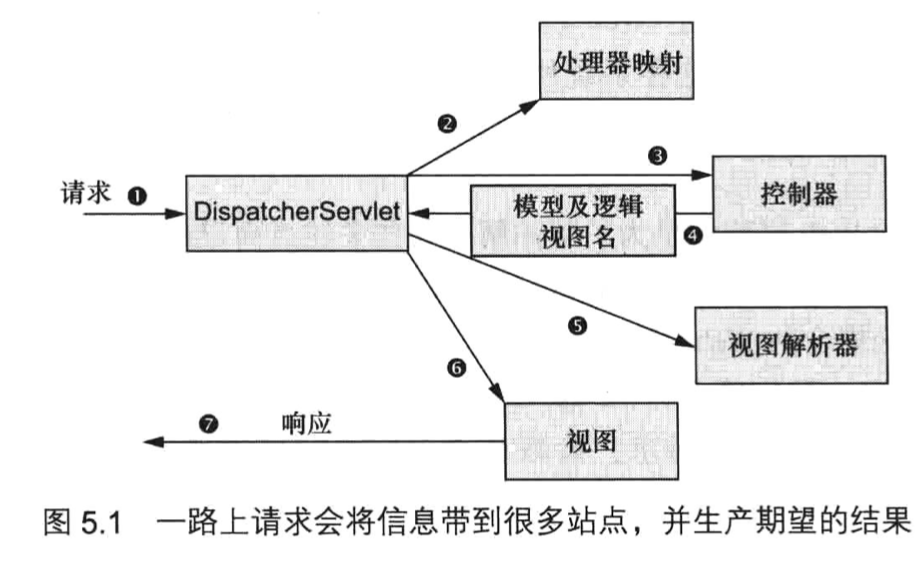

# Spring的核心

https://potoyang.gitbook.io/spring-in-action-v4/

学习Spring框架的核心知识。包括Spring容器，IOC，AOP。

# 1. Spring之旅

Spring主要是为了干掉EJB，可以让简单的JavaBean实现之前EJB的功能。

介绍了POJO（Plain old java object），Spring中的java bean可以不必完全遵循java bean的规范。

我们还需要考虑的一个问题是我们的Bean要如何去管理，需要我们去维护吗？当然不需要，spring为我们进行了管理。spring负责配置并管理他们的生命周期。

接下来，我们从整体上看下Spring。

总结：IOC和AOP是spring为我们提供的最为核心的功能，除此之外，还有很多其他的功能。

# 2. 装配Bean

**装配指的是把各个Bean装配到一起。**

主要有三种装配方式：

# Web中的Spring

# 5. 构建Spring的Web程序

## 5.1 Spring mvc 起步

spring中的web控制框架,如何编写控制器来处理请求，并使用模型数据产生响应。

在请求离开浏览器时，会带有用户所请求内容的信息，至少会包含请求的 URL。但是还可能带有其他的信息，例如用户提交的表单信息。

请求旅程的第一站是 Spring 的 DispatcherServlet。与大多数基于 Java 的 Web 框架一样，Spring MVC 所有的请求都会通过一个前端控制器（front controller）Servlet。前端控制器是常用的 Web 应用程序模式，在这里一个单实例的 Servlet 将请求委托给应用程序的其他组件来执行实际的处理。在 Spring MVC 中，DispatcherServlet 就是前端控制器。

DispatcherServlet 的任务是将请求发送给 Spring MVC 控制器 （controller）。控制器是一个用于处理请求的 Spring 组件。在典型的应用程序中可能会有多个控制器，DispatcherServlet 需要知道应该将请求发送给哪个控制器。所以 DispatcherServlet 以会查询一个或多个处理器映射（handler mapping） 来确定请求的下一站在哪里。处理器映射会根据请求所携带的 URL 信息来进行决策。

一旦选择了合适的控制器，DispatcherServlet 会将请求发送给选中的控制器。到了控制器，请求会卸下其负载（用户提交的信息）并耐心等待控制器处理这些信息。（实际上，设计良好的控制器本身只处理很少甚至不处理工作，而是将业务逻辑委托给一个或多个服务对象进行处理。）

控制器在完成逻辑处理后，通常会产生一些信息，这些信息需要返回给用户并在浏览器上显示。这些信息被称为模型（model）。不过仅仅给用户返回原始的信息是不够的 —— 这些信息需要以用户友好的方式进行格式化，一般会是 HTML。所以，信息需要发送给一个视图 （view），通常会是 JSP。

控制器所做的最后一件事就是将模型数据打包，并且标示出用于渲染输出的视图名。它接下来会将请求连同模型和视图名发送回 DispatcherServlet 。

这样，控制器就不会与特定的视图相耦合，传递给 DispatcherServlet 的视图名并不直接表示某个特定的 JSP。实际上，它甚至并不能确定视图就是 JSP。相反，它仅仅传递了一个逻辑名称，这个名字将会用来查找产生结果的真正视图。DispatcherServlet 将会使用视图解析器（view resolver） 来将逻辑视图名匹配为一个特定的视图实现，它可能是也可能不是 JSP。

既然 DispatcherServlet 已经知道由哪个视图渲染结果，那请求的任务基本上也就完成了。它的最后一站是视图的实现（可能是 JSP），在这里它交付模型数据。请求的任务就完成了。视图将使用模型数据渲染输出，这个输出会通过响应对象传递给客户端（不会像听上去那样硬编码） 。

可以看到，请求要经过很多的步骤，最终才能形成返回给客户端的响应。大多数的步骤都是在 Spring 框架内部完成的，也就是图 5.1 所示的组件中。尽管本章的主要内容都关注于如何编写控制器，但在此之前我们首先看一下如何搭建 Spring MVC 的基础组件。

DispatcherServlet是Spring mvc的核心，

