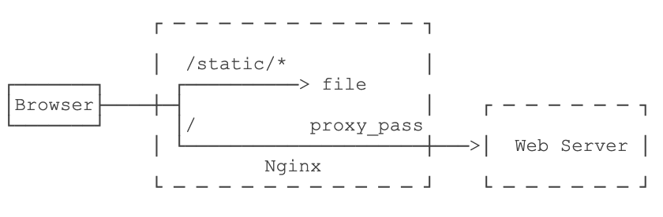

[TOC]

# 前言

很多时候我们都想知道，**web容器或web服务器（比如Tomcat或者jboss）是怎样工作的？**它们是怎样处理来自全世界的http请求的？它们在幕后做了什么动作？Java Servlet API（例如ServletContext，ServletRequest，ServletResponse和Session这些类）在其中扮演了什么角色？这些都是web应用开发者或者想成为web应用开发者的人必须要知道的重要问题或概念。在这篇文章里，我将会尽量给出以上某些问题的答案。请集中精神！

**文章章节： 什么是web服务器、应用服务器和web容器？ 什么是Servlet？他们有什么作用？ 什么是ServletContext？它由谁创建？ ServletRequest和ServletResponse从哪里进入生命周期？ 如何管理Session？知道cookie吗？ 如何确保线程安全？**

# 什么是web服务器，应用服务器和web容器？

我先讨论web服务器和应用服务器。让我在用一句话大概讲讲：

“在过去它们是有区别的，但是这两个不同的分类慢慢地合并了，而如今在大多在情况下和使用中可以把它们看成一个整体。”

在Mosaic 浏览器（通常被认为是第一个图形化的web浏览器）和超链接内容的初期，演变出了“web服务器”的新概念，它通过HTTP协议来提供静态页面内容和图片服务。在那个时候，大多数内容都是静态的，并且HTTP 1.0只是一种传送文件的方式。但在不久后web服务器提供了CGI功能。这意味着我们可以为每个web请求启动一个进程来产生动态内容。现在，HTTP协议已经很成熟了并且web服务器变得更加复杂，拥有了像缓存、安全和session管理这些附加功能。随着技术的进一步成熟，我们从Kiva和NetDynamics学会了公司专属的基于Java的服务器端技术。这些技术最终全都融入到我们今天依然在大多数应用开发里使用的JSP中。


以上是关于web服务器的。现在我们来讨论应用服务器。

在同一时期，应用服务器已经存在并发展很长一段时间了。一些公司为Unix开发了Tuxedo（面向事务的中间件）、TopEnd、Encina等产品，这些产品都是从类似IMS和CICS的主机应用管理和监控环境衍生而来的。大部分的这些产品都指定了“封闭的”产品专用通信协议来互连胖客户机(“fat” client)和服务器。在90年代，这些传统的应用服务器产品开始嵌入HTTP通信功能，刚开始要利用网关来实现。不久后它们之间的界线开始变得模糊了。

同时，web服务器越来越成熟，可以处理更高的负载、更多的并发和拥有更好的特性；应用服务器开始添加越来越多的基于HTTP的通信功能。所有的这些导致了web服务器与应用服务器的界线变得更窄了。

目前，“应用服务器”和“web服务器”之间的界线已经变得模糊不清了。但是人们还把这两个术语区分开来，作为强调使用。

当有人说到“web服务器”时，你通常要把它认为是以HTTP为核心、web UI为向导的应用。当有人说到“应用服务器”时，你可能想到“高负载、企业级特性、事务和队列、多通道通信（HTTP和更多的协议）”。但现在提供这些需求的基本上都是同一个产品。

以上就是关于web服务器和应用服务器的全部内容。现在我们来看看第三个术语，即web容器。


在Java方面，**web容器一般是指Servlet容器**。**Servlet容器是与Java Servlet交互的web容器的组件。Servlet容器负责管理Servlet的生命周期、把URL映射到特定的Servlet、确保URL请求拥有正确的访问权限和更多类似的服务。综合来看，Servlet容器就是用来运行你的Servlet和维护它的生命周期的运行环境。**

**apach是服务器，tomcat是Servlet容器。**

web服务器（apach）负责负载均衡，处理Http请求。tomcat容器（Servlet容器）负责管理Servlet。

当Web服务器得到一个Servlet请求时，并不是直接将请求提交给Servlet，而是转交给部署该Servlet的Web容器（Tomcat），由容器向Servlet提供HTTP请求和响应，并由容器调用Servlet的方法，如doGet()和doPost()。更详细的容器处理请求和响应过程，后边再整理。


# 什么是Servlet？他们有什么作用？

Web服务器对HTML网页有很好的支持,但是他不知道如何生成动态的内容或者怎么将数据保存到数据库中,所以我们需要另外一种工具来生成动态的内容,有很多程序可以生成动态的内容,比如PHP, Python, Ruby on Rails, Java Servlets 和 JSPs. **Java Servlet 和 JSP 是通过支持动态响应和数据持久化来扩展Web服务器能力的服务器端技术**

Java Server Pages

> Model-View-Controller。View,，就是指表现层，Model，是用来承载数据的抽象结构，而Controller则是View和Model的桥梁。
>
> 把业务逻辑（比如操作数据库等）从Servlet中抽出来，把它放入一个模型中（模型是指一个可重用的普通Java类，是业务数据（比如购物车的状态）和和处理该数据方法的集合）。


- 控制器：获取用户输入，并明确输入对模型的影响。更新模型，并且让View层可以得到新的模型状态。
- 模型：具体的业务逻辑和状态。只有这部分才能和数据库进行通信。
- View层：从控制器得到模型状态；获取用户输入，并且交给控制器。

MVC：Model是Java类，View是JSP，Control是Servlet。

JSP负责把数据和模板进行装载来显示。

**Servlet** :   简单地说，Servlet就是Web应用让外界访问的入口。 当然现在直接写Servlet的越来越少， 因为在框架的包装下，应用程序只需要直接写Action 或者 Controller就可以了， 但这并不能否定Servlet的核心和基石地位。

在Java里，Servlet使你能够编写根据请求动态生成内容的服务端组件。事实上，Servlet是一个在javax.servlet包里定义的接口。它为Servlet的生命周期声明了三个基本方法——init()、service()和destroy()。每个Servlet都要实现这些方法（在SDK里定义或者用户定义）并在它们的生命周期的特定时间由服务器来调用这些方法。

类加载器通过懒加载（lazy-loading）或者预加载（eager loading）自动地把Servlet类加载到容器里。每个请求都拥有自己的线程，而一个Servlet对象可以同时为多个线程服务。当Servlet对象不再被使用时，它就会被JVM当做垃圾回收掉。

# 什么是ServletContext？它由谁创建？

当Servlet容器启动时，它会部署并加载所有的web应用。当web应用被加载时，Servlet容器会一次性为每个应用创建Servlet上下文（ServletContext）并把它保存在内存里。Servlet容器会处理web应用的web.xml文件，并且一次性创建在web.xml里定义的Servlet、Filter和Listener，同样也会把它们保存在内存里。当Servlet容器关闭时，它会卸载所有的web应用和ServletContext，所有的Servlet、Filter和Listner实例都会被销毁。

从Java文档可知，ServletContext定义了一组方法，Servlet使用这些方法来与它的Servlet容器进行通信。例如，用来获取文件的MIME类型、转发请求或者编写日志文件。在web应用的部署文件（deployment descriptor）标明“分布式”的情况下，web应用的每一个虚拟机都拥有一个上下文实例。在这种情况下，不能把Servlet上下文当做共享全局信息的变量（因为它的信息已经不具有全局性了）。可以使用外部资源来代替，比如数据库。

ServletRequest和ServletResponse从哪里进入生命周期？

Servlet容器包含在web服务器中，web服务器监听来自特定端口的HTTP请求，这个端口通常是80。当客户端（使用web浏览器的用户）发送一个HTTP请求时，Servlet容器会创建新的HttpServletRequest和HttpServletResponse对象，并且把它们传递给已经创建的Filter和URL模式与请求URL匹配的Servlet实例的方法，所有的这些都使用同一个线程。

request对象提供了获取HTTP请求的所有信息的入口，比如请求头和请求实体。response对象提供了控制和发送HTTP响应的便利方法，比如设置响应头和响应实体（通常是JSP生成的HTML内容）。当HTTP响应被提交并结束后，request和response对象都会被销毁。

# 如何管理Session？知道cookie吗？

当客户端第一次访问web应用或者第一次使用request.getSession()获取HttpSession时，Servlet容器会创建Session，生成一个long类型的唯一ID（你可以使用session.getId()获取它）并把它保存在服务器的内存里。Servlet容器同样会在HTTP响应里设置一个Cookie，cookie的名是JSESSIONID并且cookie的值是session的唯一ID。

根据HTTP cookie规范（正规的web浏览器和web服务器必须遵守的约定），在cookie的有效期间，客户端（web浏览器）之后的请求都要把这个cookie返回给服务器。Servlet容器会利用带有名为JSESSIONID的cookie检测每一个到来的HTTP请求头，并使用cookie的值从服务器内容里获取相关的HttpSession。

HttpSession会一直存活着，除非超过一段时间没使用。你可以在web.xml里设定这个时间段，默认时间段是30分钟。因此，如果客户端已经超过30分钟没有访问web应用的话，Servlet容器就会销毁Session。之后的每一个请求，即使带有特定的cookie，都再也不会访问到同一个Session了。servletcontainer会创建一个新的Session。

另外，在客户端的session cookie拥有一个默认的存活时间，这个时间与浏览器的运行时间相同。因此，当用户关闭浏览器后（所有的标签或者窗口），客户端的Session就会被销毁。重新打开浏览器后，与之前的Session关联的cookie就再也不会被发送出去了。再次使用request.getSession()会返回一个全新的HttpSession并且使用一个全新的session ID来设置cookie。

# 如何确保线程安全?

你现在应该已经知道所有的请求都在共享Servlet和Filter。这是Java的一个很棒的特性，它是多线程的并且不同的线程（即HTTP请求）可以使用同一个实例。否则，对每一个请求都重新创建一个实体会耗费很多的资源。


你同样要知道，你不应该使用Servlet或者Filter的实例变量来存放任何的请求或者会话范围内的数据。这些数据会被其他Session的所有请求共享。这是非线程安全的！下面的例子说明了这个问题：

```java
public class MyServlet extends HttpServlet { 
    private Object thisIsNOTThreadSafe; //Don't to this

    protected void doGet(HttpServletRequest request, HttpServletResponse response) throws ServletException, IOException
    {
        Object thisIsThreadSafe;

        thisIsNOTThreadSafe = request.getParameter("foo"); // BAD!! Shared among all requests!
        thisIsThreadSafe = request.getParameter("foo"); // OK, this is thread safe.
    }


}
```

不要这样做，这会导致软件出bug。

# Web容器

Tomcat 是一个Web容器（Apache是服务器）, 当一个请求从客户端发送到服务端时,请求会被web容器接收,web容器会找到请求的正确资源,然后把这些资源封装成响应提供给服务器,然后服务器再把响应发送给客户端 当web容器接收到请求的时候,如果请求是servlet类型的请求,容器会创建两个对象`HTTPServletRequest` 和 `HTTPServletResponse`然后他会从url中找到瑶要接收请求的servlet并且给请求单独创建一个线程.然后调用service方法,service方法再调doGet() 或者 doPost() 方法,Servlet方法生成动态页面并且将他写入response(响应)中,一旦servlet线程结束,容器将response转成HTTP respons并发送给客户端 web容器做的一些主要工作:

> **通信支持** –容器给web服务器和servlet(jsp)之间提供一种简单的通信方式,因为有了容器,我们不需要创建server socket来监听从web服务器传过来的请求,也不需要解析请求和生成响应,这些重要而且复杂的任务全部由容器来完成,我们只需要关注我们应用的业务逻辑就好.
>
> **生命周期和资源关联** – 容器会管理servlet的整个声明周期,容器负责把servlet加载到内存中,初始化servlet,调用servlet方法并且销毁他们,容器也提供了像JNDI一样对资源的共享和管理工具
>
> **多线程支持** – 容器为每一个servlet请求创建一个单独线程,所以servlet并不为每一个请求单独创建资源来节省时间和内存
>
> **对JSP的支持** – jsp看起来并不像标准的java程序但是容器却可以支持,应用中的每一个jsp都被容器解析并转换成servlet并像管理servlet一样来管理他们
>
> **复杂的任务** – Web容器管理资源池,做内存优化,执行垃圾回收,提供安全配置,支持多个应用,热部署和后台执行使生活变得美好

# Web应用程序目录结构

Java Web应用程序被打成war包（有固定的结构），你可以把上面的程序解压出来看看目录结构，内容应该像下面的图片一样：


web.xml是web应用程序的部署文件，包括对servlet的映射，欢迎页面，安全性配置，session失效时间等。

```ascii
webapp
├── pom.xml
└── src
    └── main
        ├── java
        │   └── com
        │       └── itranswarp
        │           └── learnjava
        │               ├── Main.java
        │               ├── filter
        │               │   └── EncodingFilter.java
        │               └── servlet
        │                   ├── FileServlet.java
        │                   └── HelloServlet.java
        ├── resources
        └── webapp
            ├── WEB-INF
            │   └── web.xml
            ├── favicon.ico
            └── static
                └── bootstrap.css
```



```
server {
    listen 80;

    server_name www.local.liaoxuefeng.com

    # 静态文件根目录:
    root /path/to/src/main/webapp;

    access_log /var/log/nginx/webapp_access_log;
    error_log  /var/log/nginx/webapp_error_log;

    # 处理静态文件请求:
    location /static {
    }

    # 处理静态文件请求:
    location /favicon.ico {
    }

    # 不允许请求/WEB-INF:
    location /WEB-INF {
        return 404;
    }

    # 其他请求转发给Tomcat:
    location / {
        proxy_pass       http://127.0.0.1:8080;
        proxy_set_header Host $host;
        proxy_set_header X-Real-IP $remote_addr;
        proxy_set_header X-Forwarded-Proto $scheme;
        proxy_set_header X-Forwarded-For $proxy_add_x_forwarded_for;
    }
}
```

使用Nginx配合Tomcat服务器，可以充分发挥Nginx作为网关的优势，既可以高效处理静态文件，也可以把https、防火墙、限速、反爬虫等功能放到Nginx中，使得我们自己的WebApp能专注于业务逻辑。